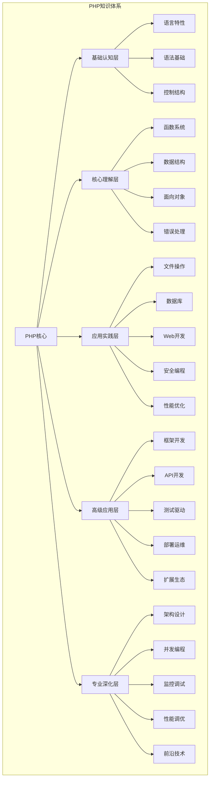
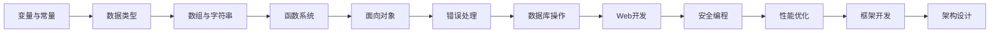

# PHP知识体系总览

## 🏗️ 知识架构图

## 📚 知识层级详解

### 01-基础认知层
**目标**: 建立PHP基础认知框架
**核心概念**: 语言特性、语法基础、控制结构

| 模块 | 核心知识点 | 学习重点 | 实践目标 |
|------|------------|----------|----------|
| 语言特性 | 动态类型、弱类型、解释型 | 理解PHP语言本质 | 能够配置开发环境 |
| 语法基础 | 变量、常量、数据类型、运算符 | 掌握基础语法规则 | 能够编写简单脚本 |
| 控制结构 | 条件、循环、跳转 | 理解程序流程控制 | 能够实现基础逻辑 |

**关键链接**:
- [[01-基础认知层/语言特性与运行环境/01-PHP语言特性|PHP语言特性]]
- [[01-基础认知层/语法基础/01-变量与常量|变量与常量]]
- [[01-基础认知层/控制结构/01-条件语句|条件语句]]

### 02-核心理解层
**目标**: 深入理解PHP核心概念
**核心概念**: 函数、数据结构、面向对象、错误处理

| 模块 | 核心知识点 | 学习重点 | 实践目标 |
|------|------------|----------|----------|
| 函数系统 | 内置函数、自定义函数、闭包 | 掌握函数式编程思想 | 能够设计可复用函数 |
| 数据结构 | 数组、字符串、正则表达式 | 理解数据操作原理 | 能够高效处理数据 |
| 面向对象 | 类、对象、继承、多态 | 掌握OOP设计原则 | 能够设计类结构 |
| 错误处理 | 异常、错误级别、调试 | 理解错误处理机制 | 能够编写健壮代码 |

**关键链接**:
- [[02-核心理解层/函数系统/01-函数基础|函数基础]]
- [[02-核心理解层/面向对象编程/01-类与对象基础|类与对象基础]]
- [[02-核心理解层/数组与字符串/01-数组基础|数组基础]]

### 03-应用实践层
**目标**: 掌握实际开发技能
**核心概念**: 文件操作、数据库、Web开发、安全、性能

| 模块 | 核心知识点 | 学习重点 | 实践目标 |
|------|------------|----------|----------|
| 文件操作 | 读写、上传、权限管理 | 掌握文件系统操作 | 能够处理文件相关功能 |
| 数据库 | MySQL、PDO、ORM | 理解数据库设计原理 | 能够设计数据库结构 |
| Web开发 | HTTP、表单、会话 | 掌握Web开发基础 | 能够开发Web应用 |
| 安全编程 | SQL注入、XSS、CSRF | 理解安全威胁与防护 | 能够编写安全代码 |
| 性能优化 | 缓存、查询优化、内存管理 | 掌握性能优化技巧 | 能够优化应用性能 |

**关键链接**:
- [[03-应用实践层/数据库操作/01-MySQL基础|MySQL基础]]
- [[03-应用实践层/Web开发基础/01-HTTP协议基础|HTTP协议基础]]
- [[03-应用实践层/安全编程/01-SQL注入防护|安全编程]]

### 04-高级应用层
**目标**: 掌握现代开发工具和框架
**核心概念**: 框架、API、测试、部署、生态

| 模块 | 核心知识点 | 学习重点 | 实践目标 |
|------|------------|----------|----------|
| 框架开发 | Laravel、Symfony、CodeIgniter | 理解框架设计思想 | 能够选择合适框架 |
| API开发 | RESTful、GraphQL、微服务 | 掌握API设计原则 | 能够设计API接口 |
| 测试驱动 | 单元测试、集成测试、TDD | 理解测试驱动开发 | 能够编写测试代码 |
| 部署运维 | Docker、CI/CD、监控 | 掌握DevOps实践 | 能够部署生产环境 |
| 扩展生态 | Composer、包管理、社区 | 理解PHP生态系统 | 能够使用第三方库 |

**关键链接**:
- [[04-高级应用层/框架开发/01-Laravel框架|Laravel框架]]
- [[04-高级应用层/API开发/01-RESTful API设计|RESTful API设计]]
- [[04-高级应用层/测试驱动/01-单元测试|单元测试]]

### 05-专业深化层
**目标**: 成为PHP专家
**核心概念**: 架构、并发、监控、性能、前沿技术

| 模块 | 核心知识点 | 学习重点 | 实践目标 |
|------|------------|----------|----------|
| 架构设计 | MVC、设计模式、SOLID | 掌握架构设计原则 | 能够设计复杂系统 |
| 并发编程 | 多进程、异步、消息队列 | 理解并发编程模型 | 能够处理高并发场景 |
| 监控调试 | 性能监控、错误追踪、日志 | 掌握系统监控方法 | 能够诊断系统问题 |
| 性能调优 | 代码优化、数据库优化、缓存 | 理解性能优化原理 | 能够优化系统性能 |
| 前沿技术 | PHP 8+、JIT、云原生 | 了解技术发展趋势 | 能够应用新技术 |

**关键链接**:
- [[05-专业深化层/架构设计/01-MVC架构模式|MVC架构模式]]
- [[05-专业深化层/性能调优/01-代码性能优化|代码性能优化]]
- [[05-专业深化层/前沿技术/01-PHP 8+新特性|PHP 8+新特性]]

## 🔄 知识关联网络

### 核心概念关联

### 技能发展路径
1. **语法基础** → **数据结构** → **函数编程** → **面向对象**
2. **基础操作** → **数据库操作** → **Web开发** → **安全编程**
3. **单机开发** → **框架应用** → **API设计** → **架构设计**
4. **功能实现** → **性能优化** → **监控调试** → **系统运维**

## 📊 学习重点分布

### 时间分配建议
- **基础认知层**: 20% (4-6周)
- **核心理解层**: 25% (5-7周)
- **应用实践层**: 30% (6-8周)
- **高级应用层**: 15% (3-4周)
- **专业深化层**: 10% (持续学习)

### 实践项目对应
- **基础项目**: 对应01-02层知识
- **中级项目**: 对应03层知识
- **高级项目**: 对应04-05层知识

## 🎯 学习策略

### 费曼学习法应用
1. **选择概念**: 从知识体系中选择要深入的概念
2. **简化解释**: 用简单语言解释复杂概念
3. **识别盲点**: 发现理解不深入的地方
4. **重新学习**: 针对盲点进行深入学习

### 刻意练习重点
1. **基础语法**: 反复练习，形成肌肉记忆
2. **OOP思维**: 通过项目实践培养面向对象思维
3. **问题解决**: 通过实际项目锻炼问题解决能力
4. **代码质量**: 通过代码审查提高代码质量

## 🔗 相关链接
- [[计算机/开发学习/语言/PHP/00-学习导航/01-学习路径图|学习路径图]]
- [[计算机/开发学习/语言/PHP/00-学习导航/03-学习进度追踪|学习进度追踪]]
- [[04-学习资源索引|学习资源索引]]
- [[05-常见问题解答|常见问题解答]]
