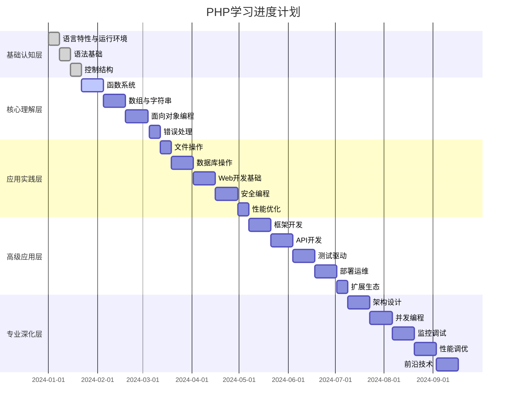
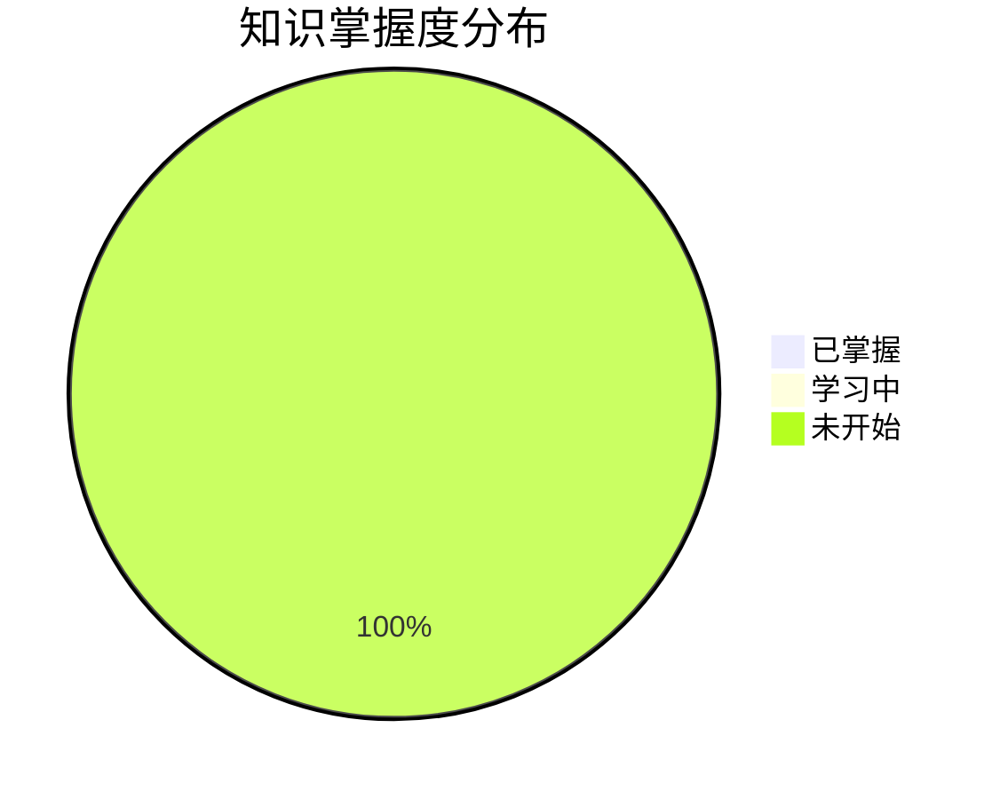

# 学习进度追踪

## 📊 总体进度概览

### 学习阶段进度

## 📈 各层级学习进度

### 01-基础认知层
**目标**: 建立PHP基础认知框架
**预计时间**: 3-4周
**完成度**: 0%

| 模块 | 状态 | 开始时间 | 完成时间 | 学习时长 | 掌握程度 |
|------|------|----------|----------|----------|----------|
| 语言特性与运行环境 | ⏳ 未开始 | - | - | 0h | 0% |
| 语法基础 | ⏳ 未开始 | - | - | 0h | 0% |
| 控制结构 | ⏳ 未开始 | - | - | 0h | 0% |

**学习重点**:
- [ ] [[01-基础认知层/语言特性与运行环境/01-PHP语言特性|PHP语言特性]] - 理解PHP语言本质
- [ ] [[01-基础认知层/语法基础/01-变量与常量|变量与常量]] - 掌握基础语法
- [ ] [[01-基础认知层/控制结构/01-条件语句|条件语句]] - 理解程序流程控制

### 02-核心理解层
**目标**: 深入理解PHP核心概念
**预计时间**: 6-8周
**完成度**: 0%

| 模块 | 状态 | 开始时间 | 完成时间 | 学习时长 | 掌握程度 |
|------|------|----------|----------|----------|----------|
| 函数系统 | ⏳ 未开始 | - | - | 0h | 0% |
| 数组与字符串 | ⏳ 未开始 | - | - | 0h | 0% |
| 面向对象编程 | ⏳ 未开始 | - | - | 0h | 0% |
| 错误处理 | ⏳ 未开始 | - | - | 0h | 0% |

**学习重点**:
- [ ] [[02-核心理解层/函数系统/01-函数基础|函数基础]] - 掌握函数式编程
- [ ] [[02-核心理解层/面向对象编程/01-类与对象基础|类与对象基础]] - 理解OOP思想
- [ ] [[02-核心理解层/数组与字符串/01-数组基础|数组基础]] - 掌握数据处理

### 03-应用实践层
**目标**: 掌握实际开发技能
**预计时间**: 8-10周
**完成度**: 0%

| 模块 | 状态 | 开始时间 | 完成时间 | 学习时长 | 掌握程度 |
|------|------|----------|----------|----------|----------|
| 文件操作 | ⏳ 未开始 | - | - | 0h | 0% |
| 数据库操作 | ⏳ 未开始 | - | - | 0h | 0% |
| Web开发基础 | ⏳ 未开始 | - | - | 0h | 0% |
| 安全编程 | ⏳ 未开始 | - | - | 0h | 0% |
| 性能优化 | ⏳ 未开始 | - | - | 0h | 0% |

**学习重点**:
- [ ] [[03-应用实践层/数据库操作/01-MySQL基础|MySQL基础]] - 掌握数据库操作
- [ ] [[03-应用实践层/Web开发基础/01-HTTP协议基础|HTTP协议基础]] - 理解Web开发
- [ ] [[03-应用实践层/安全编程/01-SQL注入防护|安全编程]] - 掌握安全编程

### 04-高级应用层
**目标**: 掌握现代开发工具和框架
**预计时间**: 6-8周
**完成度**: 0%

| 模块 | 状态 | 开始时间 | 完成时间 | 学习时长 | 掌握程度 |
|------|------|----------|----------|----------|----------|
| 框架开发 | ⏳ 未开始 | - | - | 0h | 0% |
| API开发 | ⏳ 未开始 | - | - | 0h | 0% |
| 测试驱动 | ⏳ 未开始 | - | - | 0h | 0% |
| 部署运维 | ⏳ 未开始 | - | - | 0h | 0% |
| 扩展生态 | ⏳ 未开始 | - | - | 0h | 0% |

**学习重点**:
- [ ] [[04-高级应用层/框架开发/01-Laravel框架|Laravel框架]] - 掌握主流框架
- [ ] [[04-高级应用层/API开发/01-RESTful API设计|RESTful API设计]] - 理解API设计
- [ ] [[04-高级应用层/测试驱动/01-单元测试|单元测试]] - 掌握测试驱动开发

### 05-专业深化层
**目标**: 成为PHP专家
**预计时间**: 持续学习
**完成度**: 0%

| 模块 | 状态 | 开始时间 | 完成时间 | 学习时长 | 掌握程度 |
|------|------|----------|----------|----------|----------|
| 架构设计 | ⏳ 未开始 | - | - | 0h | 0% |
| 并发编程 | ⏳ 未开始 | - | - | 0h | 0% |
| 监控调试 | ⏳ 未开始 | - | - | 0h | 0% |
| 性能调优 | ⏳ 未开始 | - | - | 0h | 0% |
| 前沿技术 | ⏳ 未开始 | - | - | 0h | 0% |

**学习重点**:
- [ ] [[05-专业深化层/架构设计/01-MVC架构模式|MVC架构模式]] - 掌握架构设计
- [ ] [[05-专业深化层/性能调优/01-代码性能优化|代码性能优化]] - 理解性能优化
- [ ] [[05-专业深化层/前沿技术/01-PHP 8+新特性|PHP 8+新特性]] - 了解前沿技术

## 🎯 学习里程碑

### 短期目标 (1-3个月)
- [ ] 完成基础认知层学习
- [ ] 掌握PHP核心语法
- [ ] 能够编写简单脚本
- [ ] 完成第一个基础项目

### 中期目标 (3-6个月)
- [ ] 完成核心理解层学习
- [ ] 掌握面向对象编程
- [ ] 能够开发Web应用
- [ ] 完成中级项目

### 长期目标 (6-12个月)
- [ ] 完成应用实践层学习
- [ ] 掌握框架开发
- [ ] 能够设计API接口
- [ ] 完成高级项目

### 专家目标 (1年以上)
- [ ] 完成专业深化层学习
- [ ] 掌握架构设计
- [ ] 能够优化系统性能
- [ ] 成为PHP专家

## 📊 学习统计

### 时间统计
- **总学习时间**: 0小时
- **平均每日学习**: 0小时
- **最长连续学习**: 0天
- **学习效率**: 待评估

### 知识掌握度

### 技能评估
| 技能领域 | 当前水平 | 目标水平 | 差距分析 |
|---------|----------|----------|----------|
| 语法基础 | 0% | 90% | 需要从零开始 |
| OOP编程 | 0% | 85% | 需要系统学习 |
| Web开发 | 0% | 80% | 需要实践项目 |
| 框架应用 | 0% | 75% | 需要框架学习 |
| 架构设计 | 0% | 70% | 需要深度理解 |

## 🔄 学习反馈与调整

### 每周回顾
- **本周学习内容**: 待填写
- **掌握程度评估**: 待填写
- **遇到的主要问题**: 待填写
- **下周学习计划**: 待填写

### 每月总结
- **本月学习成果**: 待填写
- **知识体系完善**: 待填写
- **实践项目进展**: 待填写
- **下月学习重点**: 待填写

### 学习策略调整
- **学习方法优化**: 待填写
- **时间安排调整**: 待填写
- **资源补充**: 待填写
- **目标修正**: 待填写

## 📝 学习笔记

### 重要概念记录
- 待记录重要概念和定义

### 代码示例收集
- 待收集有价值的代码示例

### 问题解决方案
- 待记录常见问题的解决方案

### 最佳实践总结
- 待总结开发最佳实践

## 🔗 相关链接
- [[计算机/开发学习/语言/PHP/00-学习导航/01-学习路径图|学习路径图]]
- [[02-知识体系总览|知识体系总览]]
- [[04-学习资源索引|学习资源索引]]
- [[05-常见问题解答|常见问题解答]]
