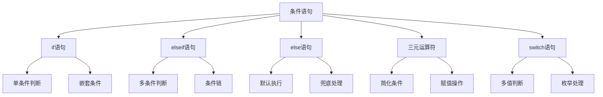

# 条件语句

## 🎯 学习目标
- 理解条件语句的基本概念和作用
- 掌握if、elseif、else语句的使用方法
- 学会使用三元运算符和switch语句
- 了解条件语句在实际开发中的应用场景

## 📚 核心概念

### 条件语句概述
条件语句用于根据不同的条件执行不同的代码块，是程序流程控制的基础。



## 🔍 if语句详解

### 基本if语句
```php
<?php
// 基本if语句
$age = 18;

if ($age >= 18) {
    echo "成年人";
}

// 单行if语句
if ($age >= 18) echo "成年人";

// 多行if语句
if ($age >= 18) {
    echo "成年人";
    echo "可以投票";
    echo "可以开车";
}
?>
```

### if-else语句
```php
<?php
$age = 16;

if ($age >= 18) {
    echo "成年人";
} else {
    echo "未成年人";
}

// 嵌套if-else
if ($age >= 18) {
    echo "成年人";
    if ($age >= 65) {
        echo "，可以退休";
    }
} else {
    echo "未成年人";
    if ($age >= 13) {
        echo "，青少年";
    } else {
        echo "，儿童";
    }
}
?>
```

### if-elseif-else语句
```php
<?php
$score = 85;

if ($score >= 90) {
    echo "优秀";
} elseif ($score >= 80) {
    echo "良好";
} elseif ($score >= 70) {
    echo "中等";
} elseif ($score >= 60) {
    echo "及格";
} else {
    echo "不及格";
}

// 复杂条件判断
$user = [
    'age' => 25,
    'role' => 'admin',
    'status' => 'active'
];

if ($user['status'] === 'inactive') {
    echo "用户已被禁用";
} elseif ($user['role'] === 'admin') {
    echo "管理员用户";
} elseif ($user['age'] >= 18) {
    echo "普通成年用户";
} else {
    echo "未成年用户";
}
?>
```

## 🎯 三元运算符

### 基本语法
```php
<?php
// 基本三元运算符
$age = 20;
$status = ($age >= 18) ? "成年人" : "未成年人";
echo $status; // 输出: 成年人

// 嵌套三元运算符
$score = 85;
$grade = ($score >= 90) ? "A" : (($score >= 80) ? "B" : (($score >= 70) ? "C" : "D"));
echo $grade; // 输出: B

// 与赋值结合
$user = [
    'name' => 'John',
    'email' => 'john@example.com'
];

$displayName = $user['name'] ?: '匿名用户';
$email = $user['email'] ?: '未提供邮箱';
?>
```

### 实际应用示例
```php
<?php
// 用户权限检查
function checkPermission($user, $action) {
    $hasPermission = ($user['role'] === 'admin') ? true : false;
    return $hasPermission ? "允许执行 $action" : "权限不足";
}

// 配置默认值
$config = [
    'debug' => true,
    'cache' => false
];

$debugMode = $config['debug'] ? '开启' : '关闭';
$cacheMode = $config['cache'] ? '开启' : '关闭';

// 数据格式化
function formatPrice($price, $currency = 'USD') {
    $symbol = ($currency === 'USD') ? '$' : (($currency === 'EUR') ? '€' : '¥');
    return $symbol . number_format($price, 2);
}

echo formatPrice(99.99); // 输出: $99.99
echo formatPrice(99.99, 'EUR'); // 输出: €99.99
?>
```

## 🔄 switch语句

### 基本语法
```php
<?php
$day = 3;

switch ($day) {
    case 1:
        echo "星期一";
        break;
    case 2:
        echo "星期二";
        break;
    case 3:
        echo "星期三";
        break;
    case 4:
        echo "星期四";
        break;
    case 5:
        echo "星期五";
        break;
    case 6:
        echo "星期六";
        break;
    case 7:
        echo "星期日";
        break;
    default:
        echo "无效的日期";
        break;
}
?>
```

### 多值匹配
```php
<?php
$month = 3;

switch ($month) {
    case 12:
    case 1:
    case 2:
        echo "冬季";
        break;
    case 3:
    case 4:
    case 5:
        echo "春季";
        break;
    case 6:
    case 7:
    case 8:
        echo "夏季";
        break;
    case 9:
    case 10:
    case 11:
        echo "秋季";
        break;
    default:
        echo "无效的月份";
        break;
}
?>
```

### 字符串匹配
```php
<?php
$userRole = 'editor';

switch ($userRole) {
    case 'admin':
        $permissions = ['read', 'write', 'delete', 'manage'];
        break;
    case 'editor':
        $permissions = ['read', 'write'];
        break;
    case 'author':
        $permissions = ['read', 'write'];
        break;
    case 'subscriber':
        $permissions = ['read'];
        break;
    default:
        $permissions = [];
        break;
}

echo "用户权限: " . implode(', ', $permissions);
?>
```

## 🎯 实际应用示例

### 用户认证系统
```php
<?php
class UserAuth {
    public function authenticate($username, $password) {
        // 模拟用户数据
        $users = [
            'admin' => ['password' => 'admin123', 'role' => 'admin'],
            'user1' => ['password' => 'user123', 'role' => 'user'],
            'guest' => ['password' => 'guest123', 'role' => 'guest']
        ];
        
        if (!isset($users[$username])) {
            return ['success' => false, 'message' => '用户不存在'];
        }
        
        $user = $users[$username];
        
        if ($user['password'] !== $password) {
            return ['success' => false, 'message' => '密码错误'];
        }
        
        // 根据角色设置权限
        switch ($user['role']) {
            case 'admin':
                $permissions = ['read', 'write', 'delete', 'manage'];
                $redirect = '/admin/dashboard';
                break;
            case 'user':
                $permissions = ['read', 'write'];
                $redirect = '/user/dashboard';
                break;
            case 'guest':
                $permissions = ['read'];
                $redirect = '/guest/home';
                break;
            default:
                $permissions = [];
                $redirect = '/';
                break;
        }
        
        return [
            'success' => true,
            'message' => '登录成功',
            'user' => $username,
            'role' => $user['role'],
            'permissions' => $permissions,
            'redirect' => $redirect
        ];
    }
}

// 使用示例
$auth = new UserAuth();
$result = $auth->authenticate('admin', 'admin123');

if ($result['success']) {
    echo "欢迎, " . $result['user'] . "!";
    echo "权限: " . implode(', ', $result['permissions']);
    echo "跳转到: " . $result['redirect'];
} else {
    echo "登录失败: " . $result['message'];
}
?>
```

### 数据验证系统
```php
<?php
class DataValidator {
    public function validateUser($userData) {
        $errors = [];
        
        // 验证姓名
        if (empty($userData['name'])) {
            $errors[] = "姓名不能为空";
        } elseif (strlen($userData['name']) < 2) {
            $errors[] = "姓名长度不能少于2个字符";
        }
        
        // 验证邮箱
        if (empty($userData['email'])) {
            $errors[] = "邮箱不能为空";
        } elseif (!filter_var($userData['email'], FILTER_VALIDATE_EMAIL)) {
            $errors[] = "邮箱格式不正确";
        }
        
        // 验证年龄
        if (!isset($userData['age'])) {
            $errors[] = "年龄不能为空";
        } elseif (!is_numeric($userData['age'])) {
            $errors[] = "年龄必须是数字";
        } elseif ($userData['age'] < 0 || $userData['age'] > 150) {
            $errors[] = "年龄必须在0-150之间";
        }
        
        // 验证性别
        if (!isset($userData['gender'])) {
            $errors[] = "性别不能为空";
        } elseif (!in_array($userData['gender'], ['male', 'female', 'other'])) {
            $errors[] = "性别只能是male、female或other";
        }
        
        return [
            'valid' => empty($errors),
            'errors' => $errors
        ];
    }
    
    public function getValidationMessage($result) {
        if ($result['valid']) {
            return "数据验证通过";
        } else {
            return "验证失败: " . implode(', ', $result['errors']);
        }
    }
}

// 使用示例
$validator = new DataValidator();
$userData = [
    'name' => 'John Doe',
    'email' => 'john@example.com',
    'age' => 25,
    'gender' => 'male'
];

$result = $validator->validateUser($userData);
echo $validator->getValidationMessage($result);
?>
```

### 状态机实现
```php
<?php
class OrderStatus {
    const PENDING = 'pending';
    const CONFIRMED = 'confirmed';
    const SHIPPED = 'shipped';
    const DELIVERED = 'delivered';
    const CANCELLED = 'cancelled';
    
    public function getNextStatus($currentStatus) {
        switch ($currentStatus) {
            case self::PENDING:
                return [self::CONFIRMED, self::CANCELLED];
            case self::CONFIRMED:
                return [self::SHIPPED, self::CANCELLED];
            case self::SHIPPED:
                return [self::DELIVERED];
            case self::DELIVERED:
                return []; // 终态
            case self::CANCELLED:
                return []; // 终态
            default:
                return [];
        }
    }
    
    public function canTransition($from, $to) {
        $nextStatuses = $this->getNextStatus($from);
        return in_array($to, $nextStatuses);
    }
    
    public function getStatusDescription($status) {
        switch ($status) {
            case self::PENDING:
                return "订单待确认";
            case self::CONFIRMED:
                return "订单已确认";
            case self::SHIPPED:
                return "订单已发货";
            case self::DELIVERED:
                return "订单已送达";
            case self::CANCELLED:
                return "订单已取消";
            default:
                return "未知状态";
        }
    }
}

// 使用示例
$orderStatus = new OrderStatus();
$currentStatus = OrderStatus::PENDING;

echo "当前状态: " . $orderStatus->getStatusDescription($currentStatus);
echo "\n可转换状态: " . implode(', ', $orderStatus->getNextStatus($currentStatus));

$newStatus = OrderStatus::CONFIRMED;
if ($orderStatus->canTransition($currentStatus, $newStatus)) {
    echo "\n状态转换成功: " . $orderStatus->getStatusDescription($newStatus);
} else {
    echo "\n状态转换失败";
}
?>
```

## 📊 最佳实践

### 条件语句优化
```php
<?php
// 1. 使用早期返回减少嵌套
function processUser($user) {
    if (!$user) {
        return false;
    }
    
    if ($user['status'] !== 'active') {
        return false;
    }
    
    if (!$user['email']) {
        return false;
    }
    
    // 主要逻辑
    return true;
}

// 2. 使用逻辑运算符简化条件
function checkAccess($user, $resource) {
    return $user['role'] === 'admin' || 
           ($user['role'] === 'user' && $resource['public']) ||
           ($user['id'] === $resource['owner_id']);
}

// 3. 使用数组映射替代多个if-else
function getStatusColor($status) {
    $colors = [
        'active' => 'green',
        'inactive' => 'red',
        'pending' => 'yellow',
        'suspended' => 'orange'
    ];
    
    return $colors[$status] ?? 'gray';
}

// 4. 使用switch处理枚举值
function getDayName($dayNumber) {
    $days = [
        1 => 'Monday',
        2 => 'Tuesday',
        3 => 'Wednesday',
        4 => 'Thursday',
        5 => 'Friday',
        6 => 'Saturday',
        7 => 'Sunday'
    ];
    
    return $days[$dayNumber] ?? 'Invalid day';
}
?>
```

### 性能优化建议
```php
<?php
// 1. 将最可能为真的条件放在前面
function checkUserType($user) {
    // 大多数用户是普通用户，所以先检查
    if ($user['type'] === 'normal') {
        return 'normal';
    } elseif ($user['type'] === 'premium') {
        return 'premium';
    } elseif ($user['type'] === 'admin') {
        return 'admin';
    } else {
        return 'unknown';
    }
}

// 2. 使用短路求值
function isValidUser($user) {
    return $user && 
           $user['email'] && 
           $user['status'] === 'active' && 
           $user['role'] !== 'banned';
}

// 3. 缓存复杂条件的结果
function checkComplexCondition($data) {
    static $cache = [];
    $key = md5(serialize($data));
    
    if (isset($cache[$key])) {
        return $cache[$key];
    }
    
    $result = $data['value'] > 100 && 
              $data['type'] === 'premium' && 
              $data['status'] === 'active';
    
    $cache[$key] = $result;
    return $result;
}
?>
```

## 🎓 学习建议

### 费曼学习法应用
1. **选择概念**: 选择条件语句中的核心概念
2. **简化解释**: 用简单语言解释条件判断的逻辑
3. **识别盲点**: 发现理解不深入的地方
4. **重新学习**: 针对盲点进行深入学习

### 刻意练习重点
1. **条件逻辑**: 练习复杂的条件判断逻辑
2. **代码优化**: 学会优化条件语句的结构
3. **实际应用**: 在实际项目中应用条件语句
4. **性能考虑**: 了解条件语句对性能的影响

## 🔗 相关链接
- [[02-循环语句|循环语句]]
- [[03-跳转语句|跳转语句]]
- [[04-控制结构最佳实践|控制结构最佳实践]]
- [[05-算法思维训练|算法思维训练]]
- [[01-基础认知层/语法基础/03-运算符与表达式|运算符与表达式]]
