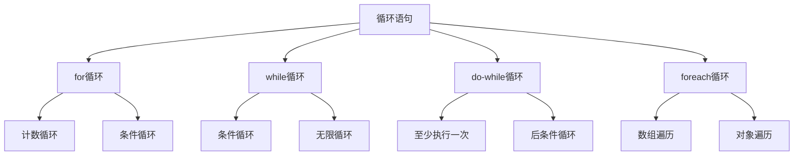

# 循环语句

## 🎯 学习目标
- 理解循环语句的基本概念和作用
- 掌握for、while、do-while、foreach循环的使用方法
- 学会使用循环控制语句break和continue
- 了解循环语句在实际开发中的应用场景

## 📚 核心概念

### 循环语句概述
循环语句用于重复执行代码块，是程序流程控制的重要组成部分。



### 循环类型对比

| 循环类型 | 适用场景 | 执行次数 | 语法特点 |
|----------|----------|----------|----------|
| for | 已知循环次数 | 0次或多次 | 初始化、条件、更新 |
| while | 条件循环 | 0次或多次 | 先判断后执行 |
| do-while | 至少执行一次 | 1次或多次 | 先执行后判断 |
| foreach | 数组/对象遍历 | 根据元素数量 | 自动遍历 |

## 🔄 for循环

### 基本语法
```php
<?php
// 基本for循环
for ($i = 0; $i < 10; $i++) {
    echo "数字: $i\n";
}

// 倒序循环
for ($i = 10; $i > 0; $i--) {
    echo "倒计时: $i\n";
}

// 步长循环
for ($i = 0; $i < 100; $i += 5) {
    echo "步长5: $i\n";
}

// 多变量循环
for ($i = 0, $j = 10; $i < 10; $i++, $j--) {
    echo "i: $i, j: $j\n";
}
?>
```

### 实际应用示例
```php
<?php
// 生成乘法表
function generateMultiplicationTable($n) {
    echo "乘法表 ($n x $n):\n";
    for ($i = 1; $i <= $n; $i++) {
        for ($j = 1; $j <= $n; $j++) {
            $result = $i * $j;
            printf("%4d", $result);
        }
        echo "\n";
    }
}

generateMultiplicationTable(9);

// 计算阶乘
function factorial($n) {
    $result = 1;
    for ($i = 1; $i <= $n; $i++) {
        $result *= $i;
    }
    return $result;
}

echo "5! = " . factorial(5) . "\n"; // 输出: 120

// 生成随机数数组
function generateRandomArray($count, $min = 1, $max = 100) {
    $array = [];
    for ($i = 0; $i < $count; $i++) {
        $array[] = rand($min, $max);
    }
    return $array;
}

$randomNumbers = generateRandomArray(10);
print_r($randomNumbers);
?>
```

## 🔁 while循环

### 基本语法
```php
<?php
// 基本while循环
$count = 0;
while ($count < 5) {
    echo "计数: $count\n";
    $count++;
}

// 条件循环
$number = 100;
while ($number > 1) {
    echo "数字: $number\n";
    $number /= 2;
}

// 用户输入循环
$input = '';
while ($input !== 'quit') {
    echo "请输入命令 (输入 'quit' 退出): ";
    $input = trim(fgets(STDIN));
    echo "您输入了: $input\n";
}
?>
```

### 实际应用示例
```php
<?php
// 文件读取循环
function readFileLines($filename) {
    $lines = [];
    $handle = fopen($filename, 'r');
    
    if ($handle) {
        while (($line = fgets($handle)) !== false) {
            $lines[] = trim($line);
        }
        fclose($handle);
    }
    
    return $lines;
}

// 数据库查询循环
function fetchAllUsers($connection) {
    $users = [];
    $result = mysqli_query($connection, "SELECT * FROM users");
    
    if ($result) {
        while ($row = mysqli_fetch_assoc($result)) {
            $users[] = $row;
        }
        mysqli_free_result($result);
    }
    
    return $users;
}

// 递归替代循环
function countdown($n) {
    while ($n > 0) {
        echo "倒计时: $n\n";
        $n--;
    }
    echo "发射!\n";
}

countdown(5);
?>
```

## 🔂 do-while循环

### 基本语法
```php
<?php
// 基本do-while循环
$count = 0;
do {
    echo "计数: $count\n";
    $count++;
} while ($count < 5);

// 至少执行一次
$number = 0;
do {
    echo "数字: $number\n";
    $number++;
} while ($number < 0); // 条件为false，但仍会执行一次

// 用户菜单循环
do {
    echo "\n=== 菜单 ===\n";
    echo "1. 选项一\n";
    echo "2. 选项二\n";
    echo "3. 退出\n";
    echo "请选择: ";
    
    $choice = trim(fgets(STDIN));
    
    switch ($choice) {
        case '1':
            echo "执行选项一\n";
            break;
        case '2':
            echo "执行选项二\n";
            break;
        case '3':
            echo "退出程序\n";
            break;
        default:
            echo "无效选择\n";
            break;
    }
} while ($choice !== '3');
?>
```

### 实际应用示例
```php
<?php
// 数据验证循环
function getValidInput($prompt, $validator) {
    do {
        echo $prompt;
        $input = trim(fgets(STDIN));
        
        if ($validator($input)) {
            return $input;
        } else {
            echo "输入无效，请重试\n";
        }
    } while (true);
}

// 使用示例
$age = getValidInput("请输入年龄: ", function($input) {
    return is_numeric($input) && $input >= 0 && $input <= 150;
});

$email = getValidInput("请输入邮箱: ", function($input) {
    return filter_var($input, FILTER_VALIDATE_EMAIL) !== false;
});

// 重试机制
function retryOperation($operation, $maxAttempts = 3) {
    $attempts = 0;
    
    do {
        $attempts++;
        echo "尝试 $attempts/$maxAttempts\n";
        
        try {
            $result = $operation();
            echo "操作成功\n";
            return $result;
        } catch (Exception $e) {
            echo "操作失败: " . $e->getMessage() . "\n";
            
            if ($attempts >= $maxAttempts) {
                throw new Exception("操作失败，已达到最大重试次数");
            }
        }
    } while ($attempts < $maxAttempts);
}
?>
```

## 🔄 foreach循环

### 基本语法
```php
<?php
// 数组遍历
$fruits = ['apple', 'banana', 'orange', 'grape'];

// 值遍历
foreach ($fruits as $fruit) {
    echo "水果: $fruit\n";
}

// 键值遍历
foreach ($fruits as $index => $fruit) {
    echo "索引 $index: $fruit\n";
}

// 关联数组遍历
$user = [
    'name' => 'John',
    'age' => 25,
    'email' => 'john@example.com',
    'city' => 'New York'
];

foreach ($user as $key => $value) {
    echo "$key: $value\n";
}
?>
```

### 实际应用示例
```php
<?php
// 数据处理
function processUserData($users) {
    $processedUsers = [];
    
    foreach ($users as $user) {
        $processedUser = [
            'id' => $user['id'],
            'name' => ucwords(strtolower($user['name'])),
            'email' => strtolower($user['email']),
            'age' => (int)$user['age'],
            'status' => $user['status'] === 'active' ? '活跃' : '非活跃'
        ];
        
        $processedUsers[] = $processedUser;
    }
    
    return $processedUsers;
}

// 数组统计
function analyzeArray($data) {
    $stats = [
        'count' => 0,
        'sum' => 0,
        'max' => null,
        'min' => null,
        'average' => 0
    ];
    
    foreach ($data as $value) {
        if (is_numeric($value)) {
            $stats['count']++;
            $stats['sum'] += $value;
            
            if ($stats['max'] === null || $value > $stats['max']) {
                $stats['max'] = $value;
            }
            
            if ($stats['min'] === null || $value < $stats['min']) {
                $stats['min'] = $value;
            }
        }
    }
    
    if ($stats['count'] > 0) {
        $stats['average'] = $stats['sum'] / $stats['count'];
    }
    
    return $stats;
}

// 使用示例
$numbers = [10, 25, 30, 15, 20, 35];
$analysis = analyzeArray($numbers);
print_r($analysis);
?>
```

## 🎯 循环控制语句

### break语句
```php
<?php
// 跳出循环
for ($i = 0; $i < 10; $i++) {
    if ($i === 5) {
        break; // 跳出循环
    }
    echo "数字: $i\n";
}

// 跳出嵌套循环
for ($i = 0; $i < 3; $i++) {
    for ($j = 0; $j < 3; $j++) {
        if ($i === 1 && $j === 1) {
            break 2; // 跳出两层循环
        }
        echo "i: $i, j: $j\n";
    }
}

// 条件跳出
$numbers = [1, 2, 3, 4, 5, 6, 7, 8, 9, 10];
foreach ($numbers as $number) {
    if ($number > 5) {
        break;
    }
    echo "数字: $number\n";
}
?>
```

### continue语句
```php
<?php
// 跳过当前迭代
for ($i = 0; $i < 10; $i++) {
    if ($i % 2 === 0) {
        continue; // 跳过偶数
    }
    echo "奇数: $i\n";
}

// 跳过嵌套循环的当前迭代
for ($i = 0; $i < 3; $i++) {
    for ($j = 0; $j < 3; $j++) {
        if ($j === 1) {
            continue 2; // 跳过外层循环的当前迭代
        }
        echo "i: $i, j: $j\n";
    }
}

// 条件跳过
$fruits = ['apple', 'banana', 'orange', 'grape', 'kiwi'];
foreach ($fruits as $fruit) {
    if (strlen($fruit) > 5) {
        continue; // 跳过长度大于5的水果
    }
    echo "短水果: $fruit\n";
}
?>
```

## 🎯 实际应用示例

### 数据处理系统
```php
<?php
class DataProcessor {
    public function processBatch($data, $batchSize = 100) {
        $processed = [];
        $batch = [];
        
        foreach ($data as $item) {
            $batch[] = $item;
            
            if (count($batch) >= $batchSize) {
                $processed = array_merge($processed, $this->processBatch($batch));
                $batch = [];
            }
        }
        
        // 处理剩余数据
        if (!empty($batch)) {
            $processed = array_merge($processed, $this->processBatch($batch));
        }
        
        return $processed;
    }
    
    private function processBatch($batch) {
        $processed = [];
        
        foreach ($batch as $item) {
            try {
                $processedItem = $this->processItem($item);
                $processed[] = $processedItem;
            } catch (Exception $e) {
                error_log("处理项目失败: " . $e->getMessage());
                continue; // 跳过失败的项目
            }
        }
        
        return $processed;
    }
    
    private function processItem($item) {
        // 模拟数据处理
        return [
            'id' => $item['id'],
            'processed_at' => date('Y-m-d H:i:s'),
            'status' => 'processed'
        ];
    }
}

// 使用示例
$data = array_fill(0, 250, ['id' => uniqid()]);
$processor = new DataProcessor();
$result = $processor->processBatch($data, 50);
echo "处理了 " . count($result) . " 个项目\n";
?>
```

### 游戏循环系统
```php
<?php
class GameLoop {
    private $running = false;
    private $fps = 60;
    private $frameTime = 0;
    
    public function start() {
        $this->running = true;
        $this->frameTime = 1000000 / $this->fps; // 微秒
        
        while ($this->running) {
            $startTime = microtime(true);
            
            $this->update();
            $this->render();
            
            $endTime = microtime(true);
            $elapsed = ($endTime - $startTime) * 1000000;
            
            if ($elapsed < $this->frameTime) {
                usleep($this->frameTime - $elapsed);
            }
        }
    }
    
    public function stop() {
        $this->running = false;
    }
    
    private function update() {
        // 游戏逻辑更新
        echo "更新游戏状态\n";
    }
    
    private function render() {
        // 渲染游戏画面
        echo "渲染画面\n";
    }
}

// 使用示例
$game = new GameLoop();
// $game->start(); // 取消注释以运行游戏循环
?>
```

### 文件处理系统
```php
<?php
class FileProcessor {
    public function processDirectory($directory, $pattern = '*.txt') {
        $files = glob($directory . '/' . $pattern);
        $results = [];
        
        foreach ($files as $file) {
            if (is_file($file)) {
                $result = $this->processFile($file);
                $results[basename($file)] = $result;
            }
        }
        
        return $results;
    }
    
    private function processFile($filename) {
        $handle = fopen($filename, 'r');
        $lines = 0;
        $words = 0;
        $chars = 0;
        
        if ($handle) {
            while (($line = fgets($handle)) !== false) {
                $lines++;
                $words += str_word_count($line);
                $chars += strlen($line);
            }
            fclose($handle);
        }
        
        return [
            'lines' => $lines,
            'words' => $words,
            'characters' => $chars
        ];
    }
    
    public function findFiles($directory, $pattern) {
        $found = [];
        $iterator = new RecursiveIteratorIterator(
            new RecursiveDirectoryIterator($directory)
        );
        
        foreach ($iterator as $file) {
            if ($file->isFile() && fnmatch($pattern, $file->getFilename())) {
                $found[] = $file->getPathname();
            }
        }
        
        return $found;
    }
}

// 使用示例
$processor = new FileProcessor();
$results = $processor->processDirectory('.', '*.md');
print_r($results);
?>
```

## 📊 最佳实践

### 循环优化
```php
<?php
// 1. 使用适当的循环类型
// 已知次数使用for
for ($i = 0; $i < 1000; $i++) {
    // 处理逻辑
}

// 数组遍历使用foreach
foreach ($array as $key => $value) {
    // 处理逻辑
}

// 条件循环使用while
while ($condition) {
    // 处理逻辑
}

// 2. 避免在循环中进行重复计算
$count = count($array); // 预先计算
for ($i = 0; $i < $count; $i++) {
    // 使用$count而不是count($array)
}

// 3. 使用break和continue优化循环
foreach ($items as $item) {
    if (!$item['active']) {
        continue; // 跳过非活跃项目
    }
    
    if ($item['priority'] === 'high') {
        // 处理高优先级项目
        break; // 找到后立即退出
    }
}

// 4. 使用生成器处理大数据集
function processLargeDataset($data) {
    foreach ($data as $item) {
        yield $this->processItem($item);
    }
}
?>
```

### 性能优化建议
```php
<?php
// 1. 缓存循环中的计算结果
$cache = [];
foreach ($items as $item) {
    $key = $item['id'];
    
    if (!isset($cache[$key])) {
        $cache[$key] = expensiveCalculation($item);
    }
    
    $result = $cache[$key];
}

// 2. 使用数组函数替代循环
$numbers = [1, 2, 3, 4, 5];
$squares = array_map(function($n) { return $n * $n; }, $numbers);
$evens = array_filter($numbers, function($n) { return $n % 2 === 0; });
$sum = array_sum($numbers);

// 3. 避免在循环中创建对象
$objects = [];
for ($i = 0; $i < 1000; $i++) {
    $objects[] = new stdClass(); // 避免这样做
}

// 4. 使用引用避免数组复制
foreach ($array as &$item) {
    $item['processed'] = true;
}
unset($item); // 重要：取消引用
?>
```

## 🎓 学习建议

### 费曼学习法应用
1. **选择概念**: 选择循环语句中的核心概念
2. **简化解释**: 用简单语言解释循环的工作原理
3. **识别盲点**: 发现理解不深入的地方
4. **重新学习**: 针对盲点进行深入学习

### 刻意练习重点
1. **循环逻辑**: 练习复杂的循环逻辑
2. **性能优化**: 学会优化循环性能
3. **实际应用**: 在实际项目中应用循环语句
4. **算法思维**: 培养循环算法思维

## 🔗 相关链接
- [[01-条件语句|条件语句]]
- [[03-跳转语句|跳转语句]]
- [[04-控制结构最佳实践|控制结构最佳实践]]
- [[05-算法思维训练|算法思维训练]]
- [[02-核心理解层/数组与字符串/01-数组基础|数组基础]]
