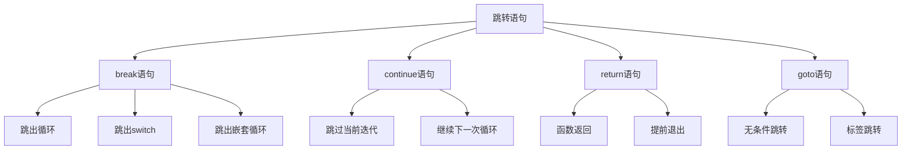

# 跳转语句

## 🎯 学习目标
- 理解跳转语句的基本概念和作用
- 掌握break、continue、return、goto语句的使用方法
- 学会在循环和函数中正确使用跳转语句
- 了解跳转语句在实际开发中的应用场景

## 📚 核心概念

### 跳转语句概述
跳转语句用于改变程序的正常执行流程，实现程序的控制转移。



### 跳转语句对比

| 语句 | 作用范围 | 主要用途 | 使用频率 |
|------|----------|----------|----------|
| break | 循环、switch | 跳出当前结构 | 高 |
| continue | 循环 | 跳过当前迭代 | 高 |
| return | 函数 | 返回值并退出 | 高 |
| goto | 全局 | 无条件跳转 | 低 |

## 🔄 break语句

### 基本用法
```php
<?php
// 跳出for循环
for ($i = 0; $i < 10; $i++) {
    if ($i === 5) {
        break; // 跳出循环
    }
    echo "数字: $i\n";
}

// 跳出while循环
$count = 0;
while ($count < 10) {
    if ($count === 3) {
        break; // 跳出循环
    }
    echo "计数: $count\n";
    $count++;
}

// 跳出foreach循环
$fruits = ['apple', 'banana', 'orange', 'grape'];
foreach ($fruits as $fruit) {
    if ($fruit === 'orange') {
        break; // 跳出循环
    }
    echo "水果: $fruit\n";
}
?>
```

### 跳出嵌套循环
```php
<?php
// 跳出单层循环
for ($i = 0; $i < 3; $i++) {
    for ($j = 0; $j < 3; $j++) {
        if ($j === 1) {
            break; // 只跳出内层循环
        }
        echo "i: $i, j: $j\n";
    }
}

// 跳出多层循环
for ($i = 0; $i < 3; $i++) {
    for ($j = 0; $j < 3; $j++) {
        if ($i === 1 && $j === 1) {
            break 2; // 跳出两层循环
        }
        echo "i: $i, j: $j\n";
    }
}

// 跳出三层循环
for ($i = 0; $i < 2; $i++) {
    for ($j = 0; $j < 2; $j++) {
        for ($k = 0; $k < 2; $k++) {
            if ($i === 1 && $j === 1 && $k === 1) {
                break 3; // 跳出三层循环
            }
            echo "i: $i, j: $j, k: $k\n";
        }
    }
}
?>
```

### 在switch中使用
```php
<?php
$day = 3;

switch ($day) {
    case 1:
        echo "星期一";
        break; // 跳出switch
    case 2:
        echo "星期二";
        break;
    case 3:
        echo "星期三";
        break;
    case 4:
        echo "星期四";
        break;
    case 5:
        echo "星期五";
        break;
    default:
        echo "周末";
        break;
}

// 没有break的情况
$number = 2;
switch ($number) {
    case 1:
        echo "一";
        // 没有break，会继续执行下一个case
    case 2:
        echo "二";
        // 没有break，会继续执行下一个case
    case 3:
        echo "三";
        break;
    default:
        echo "其他";
        break;
}
// 输出: 二三
?>
```

## 🔁 continue语句

### 基本用法
```php
<?php
// 跳过for循环的当前迭代
for ($i = 0; $i < 10; $i++) {
    if ($i % 2 === 0) {
        continue; // 跳过偶数
    }
    echo "奇数: $i\n";
}

// 跳过while循环的当前迭代
$count = 0;
while ($count < 10) {
    $count++;
    if ($count % 3 === 0) {
        continue; // 跳过3的倍数
    }
    echo "计数: $count\n";
}

// 跳过foreach循环的当前迭代
$numbers = [1, 2, 3, 4, 5, 6, 7, 8, 9, 10];
foreach ($numbers as $number) {
    if ($number % 2 === 0) {
        continue; // 跳过偶数
    }
    echo "奇数: $number\n";
}
?>
```

### 跳过嵌套循环
```php
<?php
// 跳过内层循环的当前迭代
for ($i = 0; $i < 3; $i++) {
    for ($j = 0; $j < 3; $j++) {
        if ($j === 1) {
            continue; // 跳过内层循环的当前迭代
        }
        echo "i: $i, j: $j\n";
    }
}

// 跳过外层循环的当前迭代
for ($i = 0; $i < 3; $i++) {
    for ($j = 0; $j < 3; $j++) {
        if ($i === 1 && $j === 1) {
            continue 2; // 跳过外层循环的当前迭代
        }
        echo "i: $i, j: $j\n";
    }
}

// 跳过三层循环
for ($i = 0; $i < 2; $i++) {
    for ($j = 0; $j < 2; $j++) {
        for ($k = 0; $k < 2; $k++) {
            if ($i === 1 && $j === 1 && $k === 1) {
                continue 3; // 跳过三层循环
            }
            echo "i: $i, j: $j, k: $k\n";
        }
    }
}
?>
```

## 🔙 return语句

### 基本用法
```php
<?php
// 基本返回
function add($a, $b) {
    return $a + $b;
}

$result = add(5, 3);
echo "结果: $result\n"; // 输出: 8

// 提前返回
function checkAge($age) {
    if ($age < 0) {
        return "年龄不能为负数";
    }
    
    if ($age > 150) {
        return "年龄不能超过150岁";
    }
    
    if ($age >= 18) {
        return "成年人";
    } else {
        return "未成年人";
    }
}

echo checkAge(25) . "\n"; // 输出: 成年人
echo checkAge(-5) . "\n"; // 输出: 年龄不能为负数

// 返回数组
function getUserInfo($id) {
    if ($id <= 0) {
        return null;
    }
    
    return [
        'id' => $id,
        'name' => 'User ' . $id,
        'email' => 'user' . $id . '@example.com'
    ];
}

$user = getUserInfo(1);
if ($user) {
    print_r($user);
}
?>
```

### 在循环中使用return
```php
<?php
// 在循环中返回
function findFirstEven($numbers) {
    foreach ($numbers as $number) {
        if ($number % 2 === 0) {
            return $number; // 找到第一个偶数就返回
        }
    }
    return null; // 没有找到偶数
}

$numbers = [1, 3, 5, 8, 9, 10];
$firstEven = findFirstEven($numbers);
echo "第一个偶数: $firstEven\n"; // 输出: 8

// 在嵌套循环中返回
function findInMatrix($matrix, $target) {
    foreach ($matrix as $rowIndex => $row) {
        foreach ($row as $colIndex => $value) {
            if ($value === $target) {
                return [$rowIndex, $colIndex]; // 返回位置
            }
        }
    }
    return null; // 没有找到
}

$matrix = [
    [1, 2, 3],
    [4, 5, 6],
    [7, 8, 9]
];

$position = findInMatrix($matrix, 5);
if ($position) {
    echo "找到5在位置: [" . $position[0] . ", " . $position[1] . "]\n";
}
?>
```

## 🎯 goto语句

### 基本用法
```php
<?php
// 基本goto
$count = 0;

start:
echo "计数: $count\n";
$count++;

if ($count < 5) {
    goto start; // 跳转到start标签
}

// 条件跳转
$number = 10;

if ($number > 5) {
    goto large_number;
} else {
    goto small_number;
}

large_number:
echo "这是一个大数字\n";
goto end;

small_number:
echo "这是一个小数字\n";
goto end;

end:
echo "程序结束\n";
?>
```

### 实际应用示例
```php
<?php
// 错误处理跳转
function processData($data) {
    if (empty($data)) {
        goto error;
    }
    
    foreach ($data as $item) {
        if (!is_array($item)) {
            goto error;
        }
        
        if (!isset($item['id'])) {
            goto error;
        }
    }
    
    // 处理成功
    echo "数据处理成功\n";
    return true;
    
    error:
    echo "数据处理失败\n";
    return false;
}

// 使用示例
$data = [
    ['id' => 1, 'name' => 'John'],
    ['id' => 2, 'name' => 'Jane']
];

processData($data);

// 清理资源跳转
function processFile($filename) {
    $handle = fopen($filename, 'r');
    
    if (!$handle) {
        goto cleanup;
    }
    
    while (($line = fgets($handle)) !== false) {
        // 处理文件内容
        echo $line;
    }
    
    cleanup:
    if ($handle) {
        fclose($handle);
    }
    echo "文件处理完成\n";
}
?>
```

## 🎯 实际应用示例

### 搜索算法
```php
<?php
class SearchAlgorithm {
    // 线性搜索
    public function linearSearch($array, $target) {
        foreach ($array as $index => $value) {
            if ($value === $target) {
                return $index; // 找到目标，立即返回
            }
        }
        return -1; // 没有找到
    }
    
    // 二分搜索
    public function binarySearch($array, $target) {
        $left = 0;
        $right = count($array) - 1;
        
        while ($left <= $right) {
            $mid = intval(($left + $right) / 2);
            
            if ($array[$mid] === $target) {
                return $mid; // 找到目标
            } elseif ($array[$mid] < $target) {
                $left = $mid + 1;
            } else {
                $right = $mid - 1;
            }
        }
        
        return -1; // 没有找到
    }
    
    // 查找第一个满足条件的元素
    public function findFirst($array, $condition) {
        foreach ($array as $index => $value) {
            if ($condition($value)) {
                return $index; // 找到第一个满足条件的元素
            }
        }
        return -1;
    }
}

// 使用示例
$search = new SearchAlgorithm();
$numbers = [1, 3, 5, 7, 9, 11, 13, 15];

$index = $search->linearSearch($numbers, 7);
echo "线性搜索找到7在位置: $index\n";

$index = $search->binarySearch($numbers, 7);
echo "二分搜索找到7在位置: $index\n";

$index = $search->findFirst($numbers, function($n) { return $n > 5; });
echo "第一个大于5的数字在位置: $index\n";
?>
```

### 数据验证系统
```php
<?php
class DataValidator {
    public function validateUser($userData) {
        // 验证姓名
        if (empty($userData['name'])) {
            return ['valid' => false, 'error' => '姓名不能为空'];
        }
        
        if (strlen($userData['name']) < 2) {
            return ['valid' => false, 'error' => '姓名长度不能少于2个字符'];
        }
        
        // 验证邮箱
        if (empty($userData['email'])) {
            return ['valid' => false, 'error' => '邮箱不能为空'];
        }
        
        if (!filter_var($userData['email'], FILTER_VALIDATE_EMAIL)) {
            return ['valid' => false, 'error' => '邮箱格式不正确'];
        }
        
        // 验证年龄
        if (!isset($userData['age'])) {
            return ['valid' => false, 'error' => '年龄不能为空'];
        }
        
        if (!is_numeric($userData['age'])) {
            return ['valid' => false, 'error' => '年龄必须是数字'];
        }
        
        if ($userData['age'] < 0 || $userData['age'] > 150) {
            return ['valid' => false, 'error' => '年龄必须在0-150之间'];
        }
        
        // 所有验证通过
        return ['valid' => true, 'error' => null];
    }
    
    public function validateBatch($users) {
        $results = [];
        
        foreach ($users as $index => $user) {
            $result = $this->validateUser($user);
            
            if (!$result['valid']) {
                $results[] = [
                    'index' => $index,
                    'error' => $result['error']
                ];
                continue; // 跳过当前用户，继续验证下一个
            }
            
            $results[] = [
                'index' => $index,
                'valid' => true
            ];
        }
        
        return $results;
    }
}

// 使用示例
$validator = new DataValidator();
$users = [
    ['name' => 'John', 'email' => 'john@example.com', 'age' => 25],
    ['name' => '', 'email' => 'invalid-email', 'age' => -5],
    ['name' => 'Jane', 'email' => 'jane@example.com', 'age' => 30]
];

$results = $validator->validateBatch($users);
foreach ($results as $result) {
    if ($result['valid']) {
        echo "用户 {$result['index']} 验证通过\n";
    } else {
        echo "用户 {$result['index']} 验证失败: {$result['error']}\n";
    }
}
?>
```

### 文件处理系统
```php
<?php
class FileProcessor {
    public function processFiles($directory) {
        $files = glob($directory . '/*.txt');
        $processed = 0;
        $errors = 0;
        
        foreach ($files as $file) {
            $result = $this->processFile($file);
            
            if ($result['success']) {
                $processed++;
                echo "处理成功: " . basename($file) . "\n";
            } else {
                $errors++;
                echo "处理失败: " . basename($file) . " - " . $result['error'] . "\n";
                continue; // 跳过失败的文件，继续处理下一个
            }
        }
        
        return [
            'processed' => $processed,
            'errors' => $errors,
            'total' => count($files)
        ];
    }
    
    private function processFile($filename) {
        $handle = fopen($filename, 'r');
        
        if (!$handle) {
            return ['success' => false, 'error' => '无法打开文件'];
        }
        
        $lines = 0;
        $words = 0;
        
        while (($line = fgets($handle)) !== false) {
            $lines++;
            $words += str_word_count($line);
            
            // 如果文件太大，提前退出
            if ($lines > 10000) {
                fclose($handle);
                return ['success' => false, 'error' => '文件太大，跳过处理'];
            }
        }
        
        fclose($handle);
        
        return [
            'success' => true,
            'lines' => $lines,
            'words' => $words
        ];
    }
    
    public function findAndProcess($directory, $pattern) {
        $found = [];
        $iterator = new RecursiveIteratorIterator(
            new RecursiveDirectoryIterator($directory)
        );
        
        foreach ($iterator as $file) {
            if ($file->isFile() && fnmatch($pattern, $file->getFilename())) {
                $found[] = $file->getPathname();
                
                // 限制处理文件数量
                if (count($found) >= 100) {
                    break; // 找到100个文件后停止搜索
                }
            }
        }
        
        return $found;
    }
}

// 使用示例
$processor = new FileProcessor();
$result = $processor->processFiles('.');
echo "处理了 {$result['processed']} 个文件，{$result['errors']} 个错误\n";
?>
```

## 📊 最佳实践

### 跳转语句使用建议
```php
<?php
// 1. 优先使用return而不是goto
function processData($data) {
    if (empty($data)) {
        return false; // 好的做法
    }
    
    // 处理逻辑
    return true;
}

// 2. 在循环中使用break和continue
foreach ($items as $item) {
    if (!$item['active']) {
        continue; // 跳过非活跃项目
    }
    
    if ($item['priority'] === 'high') {
        // 处理高优先级项目
        break; // 找到后立即退出
    }
}

// 3. 避免深层嵌套的goto
function complexFunction() {
    // 使用函数分解而不是goto
    if ($condition1) {
        return handleCondition1();
    }
    
    if ($condition2) {
        return handleCondition2();
    }
    
    return handleDefault();
}

// 4. 使用标签提高代码可读性
function processWithLabels() {
    $data = [];
    
    // 数据收集阶段
    collect_data:
    foreach ($sources as $source) {
        $data[] = $source->getData();
    }
    
    // 数据验证阶段
    validate_data:
    foreach ($data as $item) {
        if (!$this->isValid($item)) {
            goto collect_data; // 重新收集数据
        }
    }
    
    // 数据处理阶段
    process_data:
    return $this->process($data);
}
?>
```

### 性能优化建议
```php
<?php
// 1. 使用早期返回减少嵌套
function checkUser($user) {
    if (!$user) {
        return false;
    }
    
    if ($user['status'] !== 'active') {
        return false;
    }
    
    if (!$user['email']) {
        return false;
    }
    
    // 主要逻辑
    return true;
}

// 2. 在循环中使用continue跳过不必要的处理
foreach ($users as $user) {
    if (!$user['active']) {
        continue; // 跳过非活跃用户
    }
    
    // 只处理活跃用户
    $this->processActiveUser($user);
}

// 3. 使用break提前退出循环
function findUser($users, $targetId) {
    foreach ($users as $user) {
        if ($user['id'] === $targetId) {
            return $user; // 找到后立即返回
        }
    }
    return null;
}

// 4. 避免在循环中使用goto
// 不好的做法
foreach ($items as $item) {
    if ($item['type'] === 'special') {
        goto special_handling;
    }
    // 普通处理
}

special_handling:
// 特殊处理

// 好的做法
foreach ($items as $item) {
    if ($item['type'] === 'special') {
        $this->handleSpecial($item);
        continue;
    }
    $this->handleNormal($item);
}
?>
```

## 🎓 学习建议

### 费曼学习法应用
1. **选择概念**: 选择跳转语句中的核心概念
2. **简化解释**: 用简单语言解释跳转语句的作用
3. **识别盲点**: 发现理解不深入的地方
4. **重新学习**: 针对盲点进行深入学习

### 刻意练习重点
1. **跳转逻辑**: 练习复杂的跳转逻辑
2. **代码优化**: 学会使用跳转语句优化代码
3. **实际应用**: 在实际项目中应用跳转语句
4. **性能考虑**: 了解跳转语句对性能的影响

## 🔗 相关链接
- [[01-条件语句|条件语句]]
- [[02-循环语句|循环语句]]
- [[04-控制结构最佳实践|控制结构最佳实践]]
- [[05-算法思维训练|算法思维训练]]
- [[02-核心理解层/函数系统/01-函数基础|函数基础]]
