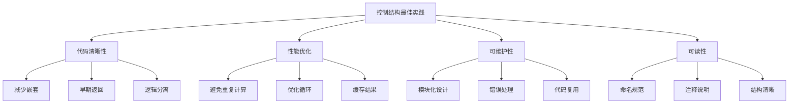

# 控制结构最佳实践

## 🎯 学习目标
- 理解控制结构的最佳实践原则
- 掌握如何编写清晰、高效的控制结构代码
- 学会避免常见的控制结构陷阱
- 了解控制结构在大型项目中的应用

## 📚 核心概念

### 控制结构优化原则



### 控制结构质量指标

| 指标 | 描述 | 目标值 | 检查方法 |
|------|------|--------|----------|
| 圈复杂度 | 代码路径数量 | < 10 | 静态分析工具 |
| 嵌套深度 | 最大嵌套层数 | < 4 | 代码审查 |
| 函数长度 | 单个函数行数 | < 50 | 代码统计 |
| 条件复杂度 | 条件表达式复杂度 | < 3 | 逻辑分析 |

## 🔍 条件语句最佳实践

### 减少嵌套深度
```php
<?php
// 不好的做法：深层嵌套
function processUser($user) {
    if ($user) {
        if ($user['status'] === 'active') {
            if ($user['role'] === 'admin') {
                if ($user['permissions']) {
                    // 处理逻辑
                    return true;
                } else {
                    return false;
                }
            } else {
                return false;
            }
        } else {
            return false;
        }
    } else {
        return false;
    }
}

// 好的做法：早期返回
function processUser($user) {
    if (!$user) {
        return false;
    }
    
    if ($user['status'] !== 'active') {
        return false;
    }
    
    if ($user['role'] !== 'admin') {
        return false;
    }
    
    if (!$user['permissions']) {
        return false;
    }
    
    // 处理逻辑
    return true;
}

// 更好的做法：使用卫语句
function processUser($user) {
    // 卫语句：提前处理异常情况
    if (!$user) return false;
    if ($user['status'] !== 'active') return false;
    if ($user['role'] !== 'admin') return false;
    if (!$user['permissions']) return false;
    
    // 主要逻辑
    return $this->executeAdminTask($user);
}
?>
```

### 条件表达式优化
```php
<?php
// 不好的做法：复杂条件
if (($user['age'] >= 18 && $user['age'] <= 65) && 
    ($user['status'] === 'active' || $user['status'] === 'pending') && 
    ($user['role'] === 'user' || $user['role'] === 'premium')) {
    // 处理逻辑
}

// 好的做法：提取条件
function isEligibleUser($user) {
    $ageValid = $user['age'] >= 18 && $user['age'] <= 65;
    $statusValid = in_array($user['status'], ['active', 'pending']);
    $roleValid = in_array($user['role'], ['user', 'premium']);
    
    return $ageValid && $statusValid && $roleValid;
}

if (isEligibleUser($user)) {
    // 处理逻辑
}

// 更好的做法：使用配置
class UserEligibility {
    private const MIN_AGE = 18;
    private const MAX_AGE = 65;
    private const VALID_STATUSES = ['active', 'pending'];
    private const VALID_ROLES = ['user', 'premium'];
    
    public static function check($user) {
        return self::isAgeValid($user['age']) &&
               self::isStatusValid($user['status']) &&
               self::isRoleValid($user['role']);
    }
    
    private static function isAgeValid($age) {
        return $age >= self::MIN_AGE && $age <= self::MAX_AGE;
    }
    
    private static function isStatusValid($status) {
        return in_array($status, self::VALID_STATUSES);
    }
    
    private static function isRoleValid($role) {
        return in_array($role, self::VALID_ROLES);
    }
}
?>
```

### switch语句优化
```php
<?php
// 不好的做法：重复代码
function getStatusColor($status) {
    switch ($status) {
        case 'active':
            return 'green';
        case 'inactive':
            return 'red';
        case 'pending':
            return 'yellow';
        case 'suspended':
            return 'orange';
        default:
            return 'gray';
    }
}

// 好的做法：使用映射
function getStatusColor($status) {
    $colors = [
        'active' => 'green',
        'inactive' => 'red',
        'pending' => 'yellow',
        'suspended' => 'orange'
    ];
    
    return $colors[$status] ?? 'gray';
}

// 更好的做法：使用类常量
class StatusColors {
    const ACTIVE = 'green';
    const INACTIVE = 'red';
    const PENDING = 'yellow';
    const SUSPENDED = 'orange';
    const DEFAULT = 'gray';
    
    private static $mapping = [
        'active' => self::ACTIVE,
        'inactive' => self::INACTIVE,
        'pending' => self::PENDING,
        'suspended' => self::SUSPENDED
    ];
    
    public static function get($status) {
        return self::$mapping[$status] ?? self::DEFAULT;
    }
}
?>
```

## 🔄 循环语句最佳实践

### 循环性能优化
```php
<?php
// 不好的做法：在循环中重复计算
$array = [1, 2, 3, 4, 5];
for ($i = 0; $i < count($array); $i++) { // count()在每次迭代中调用
    echo $array[$i];
}

// 好的做法：预先计算
$array = [1, 2, 3, 4, 5];
$count = count($array); // 预先计算
for ($i = 0; $i < $count; $i++) {
    echo $array[$i];
}

// 更好的做法：使用foreach
$array = [1, 2, 3, 4, 5];
foreach ($array as $value) {
    echo $value;
}

// 不好的做法：在循环中创建对象
$results = [];
for ($i = 0; $i < 1000; $i++) {
    $results[] = new stdClass(); // 每次迭代都创建新对象
}

// 好的做法：批量处理
$results = [];
$batchSize = 100;
for ($i = 0; $i < 1000; $i += $batchSize) {
    $batch = array_fill(0, $batchSize, new stdClass());
    $results = array_merge($results, $batch);
}
?>
```

### 循环结构优化
```php
<?php
// 不好的做法：复杂的嵌套循环
function findCommonElements($array1, $array2) {
    $common = [];
    for ($i = 0; $i < count($array1); $i++) {
        for ($j = 0; $j < count($array2); $j++) {
            if ($array1[$i] === $array2[$j]) {
                $common[] = $array1[$i];
                break;
            }
        }
    }
    return $common;
}

// 好的做法：使用数组函数
function findCommonElements($array1, $array2) {
    return array_intersect($array1, $array2);
}

// 更好的做法：使用集合
function findCommonElements($array1, $array2) {
    $set1 = array_flip($array1);
    $common = [];
    
    foreach ($array2 as $value) {
        if (isset($set1[$value])) {
            $common[] = $value;
        }
    }
    
    return $common;
}

// 不好的做法：在循环中处理异常
foreach ($files as $file) {
    try {
        $content = file_get_contents($file);
        // 处理内容
    } catch (Exception $e) {
        // 处理异常
    }
}

// 好的做法：预处理和批量处理
$validFiles = [];
foreach ($files as $file) {
    if (file_exists($file) && is_readable($file)) {
        $validFiles[] = $file;
    }
}

foreach ($validFiles as $file) {
    $content = file_get_contents($file);
    // 处理内容
}
?>
```

### 循环控制优化
```php
<?php
// 不好的做法：使用goto跳出嵌套循环
function findInMatrix($matrix, $target) {
    foreach ($matrix as $i => $row) {
        foreach ($row as $j => $value) {
            if ($value === $target) {
                goto found;
            }
        }
    }
    return null;
    
    found:
    return [$i, $j];
}

// 好的做法：使用函数返回
function findInMatrix($matrix, $target) {
    foreach ($matrix as $i => $row) {
        foreach ($row as $j => $value) {
            if ($value === $target) {
                return [$i, $j];
            }
        }
    }
    return null;
}

// 更好的做法：使用生成器
function findInMatrix($matrix, $target) {
    foreach ($matrix as $i => $row) {
        foreach ($row as $j => $value) {
            if ($value === $target) {
                yield [$i, $j];
            }
        }
    }
}

// 不好的做法：在循环中修改数组
$numbers = [1, 2, 3, 4, 5];
foreach ($numbers as $key => $value) {
    if ($value % 2 === 0) {
        unset($numbers[$key]); // 修改正在遍历的数组
    }
}

// 好的做法：使用array_filter
$numbers = [1, 2, 3, 4, 5];
$oddNumbers = array_filter($numbers, function($value) {
    return $value % 2 !== 0;
});

// 更好的做法：使用生成器
function filterOdd($numbers) {
    foreach ($numbers as $number) {
        if ($number % 2 !== 0) {
            yield $number;
        }
    }
}
?>
```

## 🎯 跳转语句最佳实践

### return语句优化
```php
<?php
// 不好的做法：深层嵌套的return
function processOrder($order) {
    if ($order) {
        if ($order['status'] === 'pending') {
            if ($order['items']) {
                if ($order['total'] > 0) {
                    // 处理逻辑
                    return ['success' => true, 'message' => '订单处理成功'];
                } else {
                    return ['success' => false, 'message' => '订单金额无效'];
                }
            } else {
                return ['success' => false, 'message' => '订单没有商品'];
            }
        } else {
            return ['success' => false, 'message' => '订单状态无效'];
        }
    } else {
        return ['success' => false, 'message' => '订单不存在'];
    }
}

// 好的做法：早期返回
function processOrder($order) {
    if (!$order) {
        return ['success' => false, 'message' => '订单不存在'];
    }
    
    if ($order['status'] !== 'pending') {
        return ['success' => false, 'message' => '订单状态无效'];
    }
    
    if (!$order['items']) {
        return ['success' => false, 'message' => '订单没有商品'];
    }
    
    if ($order['total'] <= 0) {
        return ['success' => false, 'message' => '订单金额无效'];
    }
    
    // 主要处理逻辑
    return ['success' => true, 'message' => '订单处理成功'];
}

// 更好的做法：使用异常处理
function processOrder($order) {
    $this->validateOrder($order);
    $this->executeOrder($order);
    return ['success' => true, 'message' => '订单处理成功'];
}

private function validateOrder($order) {
    if (!$order) {
        throw new InvalidArgumentException('订单不存在');
    }
    
    if ($order['status'] !== 'pending') {
        throw new InvalidArgumentException('订单状态无效');
    }
    
    if (!$order['items']) {
        throw new InvalidArgumentException('订单没有商品');
    }
    
    if ($order['total'] <= 0) {
        throw new InvalidArgumentException('订单金额无效');
    }
}
?>
```

### break和continue优化
```php
<?php
// 不好的做法：复杂的break逻辑
function findUsers($users, $criteria) {
    $found = [];
    foreach ($users as $user) {
        if ($user['active']) {
            if ($user['age'] >= 18) {
                if ($user['role'] === 'admin') {
                    $found[] = $user;
                    if (count($found) >= 10) {
                        break;
                    }
                }
            }
        }
    }
    return $found;
}

// 好的做法：使用continue简化逻辑
function findUsers($users, $criteria) {
    $found = [];
    foreach ($users as $user) {
        if (!$user['active']) continue;
        if ($user['age'] < 18) continue;
        if ($user['role'] !== 'admin') continue;
        
        $found[] = $user;
        if (count($found) >= 10) {
            break;
        }
    }
    return $found;
}

// 更好的做法：使用生成器
function findUsers($users, $criteria) {
    $count = 0;
    foreach ($users as $user) {
        if (!$this->matchesCriteria($user, $criteria)) {
            continue;
        }
        
        yield $user;
        $count++;
        
        if ($count >= 10) {
            break;
        }
    }
}

// 不好的做法：在循环中使用goto
foreach ($items as $item) {
    if ($item['type'] === 'special') {
        goto special_handling;
    }
    // 普通处理
}

special_handling:
// 特殊处理

// 好的做法：使用函数分离
foreach ($items as $item) {
    if ($item['type'] === 'special') {
        $this->handleSpecial($item);
        continue;
    }
    $this->handleNormal($item);
}
?>
```

## 🎯 实际应用示例

### 状态机实现
```php
<?php
class OrderStateMachine {
    private const STATES = [
        'pending' => ['confirmed', 'cancelled'],
        'confirmed' => ['shipped', 'cancelled'],
        'shipped' => ['delivered'],
        'delivered' => [],
        'cancelled' => []
    ];
    
    public function canTransition($from, $to) {
        return in_array($to, self::STATES[$from] ?? []);
    }
    
    public function transition($order, $toState) {
        if (!$this->canTransition($order['status'], $toState)) {
            throw new InvalidStateTransitionException(
                "Cannot transition from {$order['status']} to $toState"
            );
        }
        
        $order['status'] = $toState;
        $order['updated_at'] = date('Y-m-d H:i:s');
        
        return $order;
    }
    
    public function processOrder($order) {
        switch ($order['status']) {
            case 'pending':
                return $this->processPendingOrder($order);
            case 'confirmed':
                return $this->processConfirmedOrder($order);
            case 'shipped':
                return $this->processShippedOrder($order);
            case 'delivered':
                return $this->processDeliveredOrder($order);
            case 'cancelled':
                return $this->processCancelledOrder($order);
            default:
                throw new InvalidStateException("Unknown state: {$order['status']}");
        }
    }
    
    private function processPendingOrder($order) {
        // 验证订单
        if (!$this->validateOrder($order)) {
            return $this->transition($order, 'cancelled');
        }
        
        // 检查库存
        if (!$this->checkInventory($order)) {
            return $this->transition($order, 'cancelled');
        }
        
        return $this->transition($order, 'confirmed');
    }
    
    private function processConfirmedOrder($order) {
        // 准备发货
        if ($this->prepareShipment($order)) {
            return $this->transition($order, 'shipped');
        }
        
        return $order;
    }
    
    private function processShippedOrder($order) {
        // 检查配送状态
        if ($this->isDelivered($order)) {
            return $this->transition($order, 'delivered');
        }
        
        return $order;
    }
    
    private function processDeliveredOrder($order) {
        // 订单完成，无需状态转换
        return $order;
    }
    
    private function processCancelledOrder($order) {
        // 订单取消，无需状态转换
        return $order;
    }
}
?>
```

### 数据管道处理
```php
<?php
class DataPipeline {
    private $processors = [];
    
    public function addProcessor(callable $processor) {
        $this->processors[] = $processor;
        return $this;
    }
    
    public function process($data) {
        $result = $data;
        
        foreach ($this->processors as $processor) {
            try {
                $result = $processor($result);
                
                // 如果处理器返回null，停止处理
                if ($result === null) {
                    break;
                }
            } catch (Exception $e) {
                // 记录错误但继续处理
                error_log("Processor error: " . $e->getMessage());
                continue;
            }
        }
        
        return $result;
    }
    
    public function processBatch($dataArray) {
        $results = [];
        
        foreach ($dataArray as $index => $data) {
            try {
                $result = $this->process($data);
                $results[$index] = $result;
            } catch (Exception $e) {
                // 记录错误但继续处理其他数据
                error_log("Batch processing error at index $index: " . $e->getMessage());
                $results[$index] = null;
                continue;
            }
        }
        
        return $results;
    }
}

// 使用示例
$pipeline = new DataPipeline();
$pipeline->addProcessor(function($data) {
    // 数据验证
    if (empty($data)) {
        return null; // 停止处理
    }
    return $data;
});

$pipeline->addProcessor(function($data) {
    // 数据清理
    return array_map('trim', $data);
});

$pipeline->addProcessor(function($data) {
    // 数据转换
    return array_map('strtoupper', $data);
});

$result = $pipeline->process(['  hello  ', '  world  ']);
print_r($result); // ['HELLO', 'WORLD']
?>
```

### 错误处理策略
```php
<?php
class ErrorHandler {
    private $retryAttempts = 3;
    private $retryDelay = 1000; // 毫秒
    
    public function executeWithRetry(callable $operation, $context = null) {
        $attempts = 0;
        
        while ($attempts < $this->retryAttempts) {
            try {
                return $operation();
            } catch (RetryableException $e) {
                $attempts++;
                
                if ($attempts >= $this->retryAttempts) {
                    throw new MaxRetriesExceededException(
                        "Operation failed after {$this->retryAttempts} attempts",
                        0,
                        $e
                    );
                }
                
                // 等待后重试
                usleep($this->retryDelay * 1000);
                continue;
            } catch (Exception $e) {
                // 不可重试的错误，直接抛出
                throw $e;
            }
        }
    }
    
    public function executeWithFallback(callable $primary, callable $fallback) {
        try {
            return $primary();
        } catch (Exception $e) {
            error_log("Primary operation failed: " . $e->getMessage());
            return $fallback();
        }
    }
    
    public function executeWithTimeout(callable $operation, $timeoutSeconds = 30) {
        $startTime = time();
        
        while (true) {
            try {
                return $operation();
            } catch (Exception $e) {
                if (time() - $startTime >= $timeoutSeconds) {
                    throw new TimeoutException("Operation timed out after {$timeoutSeconds} seconds");
                }
                
                // 短暂等待后重试
                usleep(100000); // 100ms
                continue;
            }
        }
    }
}

// 使用示例
$handler = new ErrorHandler();

// 重试机制
$result = $handler->executeWithRetry(function() {
    // 可能失败的操作
    if (rand(1, 3) === 1) {
        throw new RetryableException("Temporary failure");
    }
    return "Success";
});

// 降级机制
$result = $handler->executeWithFallback(
    function() {
        // 主要操作
        throw new Exception("Primary failed");
    },
    function() {
        // 降级操作
        return "Fallback result";
    }
);
?>
```

## 📊 性能优化建议

### 控制结构性能优化
```php
<?php
// 1. 使用早期返回减少计算
function processUser($user) {
    // 快速失败检查
    if (!$user) return null;
    if (!$user['active']) return null;
    
    // 昂贵的操作放在后面
    $expensiveResult = $this->expensiveOperation($user);
    return $expensiveResult;
}

// 2. 缓存循环中的计算结果
function processItems($items) {
    $cache = [];
    $results = [];
    
    foreach ($items as $item) {
        $key = $item['type'];
        
        if (!isset($cache[$key])) {
            $cache[$key] = $this->expensiveCalculation($item);
        }
        
        $results[] = $cache[$key];
    }
    
    return $results;
}

// 3. 使用生成器处理大数据集
function processLargeDataset($data) {
    foreach ($data as $item) {
        yield $this->processItem($item);
    }
}

// 4. 避免在循环中创建对象
function createObjects($count) {
    $objects = [];
    $template = new stdClass();
    
    for ($i = 0; $i < $count; $i++) {
        $obj = clone $template;
        $obj->id = $i;
        $objects[] = $obj;
    }
    
    return $objects;
}

// 5. 使用数组函数替代循环
function processNumbers($numbers) {
    // 使用array_map替代foreach
    $squared = array_map(function($n) { return $n * $n; }, $numbers);
    
    // 使用array_filter替代if条件
    $evens = array_filter($numbers, function($n) { return $n % 2 === 0; });
    
    // 使用array_reduce替代累加循环
    $sum = array_reduce($numbers, function($carry, $item) {
        return $carry + $item;
    }, 0);
    
    return ['squared' => $squared, 'evens' => $evens, 'sum' => $sum];
}
?>
```

## 🎓 学习建议

### 费曼学习法应用
1. **选择概念**: 选择控制结构最佳实践中的核心概念
2. **简化解释**: 用简单语言解释最佳实践的原则
3. **识别盲点**: 发现理解不深入的地方
4. **重新学习**: 针对盲点进行深入学习

### 刻意练习重点
1. **代码重构**: 练习重构复杂的控制结构
2. **性能优化**: 学会优化控制结构的性能
3. **实际应用**: 在实际项目中应用最佳实践
4. **代码审查**: 参与代码审查，学习他人经验

## 🔗 相关链接
- [[01-条件语句|条件语句]]
- [[02-循环语句|循环语句]]
- [[03-跳转语句|跳转语句]]
- [[05-算法思维训练|算法思维训练]]
- [[01-基础认知层/语法基础/05-语法最佳实践|语法最佳实践]]
