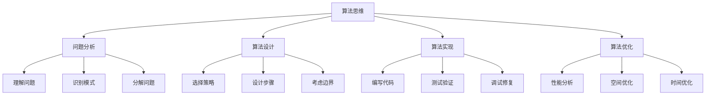

# 算法思维训练

## 🎯 学习目标
- 理解算法思维的基本概念和重要性
- 掌握常见算法设计模式和思维方法
- 学会分析算法的时间复杂度和空间复杂度
- 培养解决实际问题的算法思维

## 📚 核心概念

### 算法思维概述
算法思维是一种解决问题的思维方式，通过系统性的方法分析和解决复杂问题。



### 算法设计模式

| 模式 | 描述 | 适用场景 | 时间复杂度 |
|------|------|----------|------------|
| 分治法 | 将问题分解为子问题 | 排序、搜索 | O(n log n) |
| 动态规划 | 保存子问题结果 | 最优化问题 | O(n²) |
| 贪心算法 | 每步选择最优解 | 调度、路径 | O(n log n) |
| 回溯法 | 尝试所有可能解 | 组合、排列 | O(2^n) |
| 双指针 | 使用两个指针遍历 | 数组、字符串 | O(n) |

## 🔍 问题分析方法

### 问题分解
```php
<?php
// 问题：计算数组中所有子数组的和
// 分解步骤：
// 1. 遍历所有可能的子数组
// 2. 计算每个子数组的和
// 3. 累加所有和

function sumOfAllSubarrays($array) {
    $totalSum = 0;
    $n = count($array);
    
    // 遍历所有可能的起始位置
    for ($i = 0; $i < $n; $i++) {
        // 遍历所有可能的结束位置
        for ($j = $i; $j < $n; $j++) {
            // 计算当前子数组的和
            $subarraySum = 0;
            for ($k = $i; $k <= $j; $k++) {
                $subarraySum += $array[$k];
            }
            $totalSum += $subarraySum;
        }
    }
    
    return $totalSum;
}

// 优化版本：使用数学公式
function sumOfAllSubarraysOptimized($array) {
    $totalSum = 0;
    $n = count($array);
    
    for ($i = 0; $i < $n; $i++) {
        // 元素array[i]出现在(i+1)*(n-i)个子数组中
        $totalSum += $array[$i] * ($i + 1) * ($n - $i);
    }
    
    return $totalSum;
}

// 测试
$array = [1, 2, 3];
echo "原始方法: " . sumOfAllSubarrays($array) . "\n";
echo "优化方法: " . sumOfAllSubarraysOptimized($array) . "\n";
?>
```

### 模式识别
```php
<?php
// 问题：找到数组中的最大子数组和
// 模式：动态规划 - 最大子数组问题

function maxSubarraySum($array) {
    $n = count($array);
    if ($n === 0) return 0;
    
    $maxSoFar = $array[0];
    $maxEndingHere = $array[0];
    
    for ($i = 1; $i < $n; $i++) {
        // 动态规划状态转移
        $maxEndingHere = max($array[$i], $maxEndingHere + $array[$i]);
        $maxSoFar = max($maxSoFar, $maxEndingHere);
    }
    
    return $maxSoFar;
}

// 问题：找到数组中的最长递增子序列
// 模式：动态规划 - 最长递增子序列

function longestIncreasingSubsequence($array) {
    $n = count($array);
    if ($n === 0) return 0;
    
    $dp = array_fill(0, $n, 1);
    
    for ($i = 1; $i < $n; $i++) {
        for ($j = 0; $j < $i; $j++) {
            if ($array[$j] < $array[$i]) {
                $dp[$i] = max($dp[$i], $dp[$j] + 1);
            }
        }
    }
    
    return max($dp);
}

// 测试
$array = [-2, 1, -3, 4, -1, 2, 1, -5, 4];
echo "最大子数组和: " . maxSubarraySum($array) . "\n";

$array = [10, 9, 2, 5, 3, 7, 101, 18];
echo "最长递增子序列长度: " . longestIncreasingSubsequence($array) . "\n";
?>
```

## 🎯 分治法

### 基本思想
```php
<?php
// 分治法：将问题分解为子问题，递归解决，然后合并结果

// 归并排序
function mergeSort($array) {
    $n = count($array);
    
    // 基本情况
    if ($n <= 1) {
        return $array;
    }
    
    // 分解
    $mid = intval($n / 2);
    $left = array_slice($array, 0, $mid);
    $right = array_slice($array, $mid);
    
    // 递归解决
    $left = mergeSort($left);
    $right = mergeSort($right);
    
    // 合并
    return merge($left, $right);
}

function merge($left, $right) {
    $result = [];
    $i = $j = 0;
    
    while ($i < count($left) && $j < count($right)) {
        if ($left[$i] <= $right[$j]) {
            $result[] = $left[$i];
            $i++;
        } else {
            $result[] = $right[$j];
            $j++;
        }
    }
    
    // 添加剩余元素
    while ($i < count($left)) {
        $result[] = $left[$i];
        $i++;
    }
    
    while ($j < count($right)) {
        $result[] = $right[$j];
        $j++;
    }
    
    return $result;
}

// 快速排序
function quickSort($array) {
    $n = count($array);
    
    // 基本情况
    if ($n <= 1) {
        return $array;
    }
    
    // 选择基准
    $pivot = $array[0];
    $left = $right = [];
    
    // 分割
    for ($i = 1; $i < $n; $i++) {
        if ($array[$i] < $pivot) {
            $left[] = $array[$i];
        } else {
            $right[] = $array[$i];
        }
    }
    
    // 递归解决
    $left = quickSort($left);
    $right = quickSort($right);
    
    // 合并
    return array_merge($left, [$pivot], $right);
}

// 测试
$array = [64, 34, 25, 12, 22, 11, 90];
echo "原数组: " . implode(', ', $array) . "\n";
echo "归并排序: " . implode(', ', mergeSort($array)) . "\n";
echo "快速排序: " . implode(', ', quickSort($array)) . "\n";
?>
```

### 实际应用
```php
<?php
// 分治法：计算数组中的逆序对数量
function countInversions($array) {
    return mergeSortAndCount($array, 0, count($array) - 1);
}

function mergeSortAndCount($array, $left, $right) {
    $inversions = 0;
    
    if ($left < $right) {
        $mid = intval(($left + $right) / 2);
        
        // 递归计算左右子数组的逆序对
        $inversions += mergeSortAndCount($array, $left, $mid);
        $inversions += mergeSortAndCount($array, $mid + 1, $right);
        
        // 合并并计算跨越中点的逆序对
        $inversions += mergeAndCount($array, $left, $mid, $right);
    }
    
    return $inversions;
}

function mergeAndCount($array, $left, $mid, $right) {
    $inversions = 0;
    $temp = [];
    $i = $left;
    $j = $mid + 1;
    
    while ($i <= $mid && $j <= $right) {
        if ($array[$i] <= $array[$j]) {
            $temp[] = $array[$i];
            $i++;
        } else {
            $temp[] = $array[$j];
            $inversions += ($mid - $i + 1);
            $j++;
        }
    }
    
    // 添加剩余元素
    while ($i <= $mid) {
        $temp[] = $array[$i];
        $i++;
    }
    
    while ($j <= $right) {
        $temp[] = $array[$j];
        $j++;
    }
    
    // 复制回原数组
    for ($k = 0; $k < count($temp); $k++) {
        $array[$left + $k] = $temp[$k];
    }
    
    return $inversions;
}

// 测试
$array = [2, 4, 1, 3, 5];
echo "逆序对数量: " . countInversions($array) . "\n";
?>
```

## 🔄 动态规划

### 基本思想
```php
<?php
// 动态规划：保存子问题的结果，避免重复计算

// 斐波那契数列
function fibonacci($n) {
    if ($n <= 1) return $n;
    
    $dp = [0, 1];
    
    for ($i = 2; $i <= $n; $i++) {
        $dp[$i] = $dp[$i - 1] + $dp[$i - 2];
    }
    
    return $dp[$n];
}

// 0-1背包问题
function knapsack($weights, $values, $capacity) {
    $n = count($weights);
    $dp = array_fill(0, $n + 1, array_fill(0, $capacity + 1, 0));
    
    for ($i = 1; $i <= $n; $i++) {
        for ($w = 1; $w <= $capacity; $w++) {
            if ($weights[$i - 1] <= $w) {
                $dp[$i][$w] = max(
                    $dp[$i - 1][$w],
                    $dp[$i - 1][$w - $weights[$i - 1]] + $values[$i - 1]
                );
            } else {
                $dp[$i][$w] = $dp[$i - 1][$w];
            }
        }
    }
    
    return $dp[$n][$capacity];
}

// 最长公共子序列
function longestCommonSubsequence($text1, $text2) {
    $m = strlen($text1);
    $n = strlen($text2);
    $dp = array_fill(0, $m + 1, array_fill(0, $n + 1, 0));
    
    for ($i = 1; $i <= $m; $i++) {
        for ($j = 1; $j <= $n; $j++) {
            if ($text1[$i - 1] === $text2[$j - 1]) {
                $dp[$i][$j] = $dp[$i - 1][$j - 1] + 1;
            } else {
                $dp[$i][$j] = max($dp[$i - 1][$j], $dp[$i][$j - 1]);
            }
        }
    }
    
    return $dp[$m][$n];
}

// 测试
echo "斐波那契(10): " . fibonacci(10) . "\n";

$weights = [10, 20, 30];
$values = [60, 100, 120];
$capacity = 50;
echo "背包问题最优值: " . knapsack($weights, $values, $capacity) . "\n";

$text1 = "abcde";
$text2 = "ace";
echo "最长公共子序列长度: " . longestCommonSubsequence($text1, $text2) . "\n";
?>
```

### 实际应用
```php
<?php
// 动态规划：编辑距离（Levenshtein距离）
function editDistance($word1, $word2) {
    $m = strlen($word1);
    $n = strlen($word2);
    $dp = array_fill(0, $m + 1, array_fill(0, $n + 1, 0));
    
    // 初始化
    for ($i = 0; $i <= $m; $i++) {
        $dp[$i][0] = $i;
    }
    
    for ($j = 0; $j <= $n; $j++) {
        $dp[0][$j] = $j;
    }
    
    // 填充DP表
    for ($i = 1; $i <= $m; $i++) {
        for ($j = 1; $j <= $n; $j++) {
            if ($word1[$i - 1] === $word2[$j - 1]) {
                $dp[$i][$j] = $dp[$i - 1][$j - 1];
            } else {
                $dp[$i][$j] = 1 + min(
                    $dp[$i - 1][$j],     // 删除
                    $dp[$i][$j - 1],     // 插入
                    $dp[$i - 1][$j - 1]  // 替换
                );
            }
        }
    }
    
    return $dp[$m][$n];
}

// 动态规划：股票买卖问题
function maxProfit($prices) {
    $n = count($prices);
    if ($n <= 1) return 0;
    
    $hold = -$prices[0];  // 持有股票的最大利润
    $sold = 0;            // 不持有股票的最大利润
    
    for ($i = 1; $i < $n; $i++) {
        $newHold = max($hold, $sold - $prices[$i]);
        $newSold = max($sold, $hold + $prices[$i]);
        
        $hold = $newHold;
        $sold = $newSold;
    }
    
    return $sold;
}

// 测试
$word1 = "kitten";
$word2 = "sitting";
echo "编辑距离: " . editDistance($word1, $word2) . "\n";

$prices = [7, 1, 5, 3, 6, 4];
echo "股票最大利润: " . maxProfit($prices) . "\n";
?>
```

## 🎯 贪心算法

### 基本思想
```php
<?php
// 贪心算法：每步选择当前最优解

// 活动选择问题
function activitySelection($activities) {
    // 按结束时间排序
    usort($activities, function($a, $b) {
        return $a['end'] - $b['end'];
    });
    
    $selected = [];
    $lastEnd = 0;
    
    foreach ($activities as $activity) {
        if ($activity['start'] >= $lastEnd) {
            $selected[] = $activity;
            $lastEnd = $activity['end'];
        }
    }
    
    return $selected;
}

// 找零钱问题
function coinChange($coins, $amount) {
    // 按面值从大到小排序
    rsort($coins);
    
    $result = [];
    $remaining = $amount;
    
    foreach ($coins as $coin) {
        $count = intval($remaining / $coin);
        if ($count > 0) {
            $result[$coin] = $count;
            $remaining -= $coin * $count;
        }
    }
    
    return $remaining === 0 ? $result : null;
}

// 测试
$activities = [
    ['start' => 1, 'end' => 3],
    ['start' => 2, 'end' => 5],
    ['start' => 0, 'end' => 6],
    ['start' => 5, 'end' => 7],
    ['start' => 8, 'end' => 9],
    ['start' => 5, 'end' => 9]
];

$selected = activitySelection($activities);
echo "选择的活动数量: " . count($selected) . "\n";

$coins = [1, 5, 10, 25];
$amount = 67;
$change = coinChange($coins, $amount);
echo "找零方案: " . json_encode($change) . "\n";
?>
```

### 实际应用
```php
<?php
// 贪心算法：最小生成树（Kruskal算法）
class UnionFind {
    private $parent = [];
    private $rank = [];
    
    public function __construct($n) {
        for ($i = 0; $i < $n; $i++) {
            $this->parent[$i] = $i;
            $this->rank[$i] = 0;
        }
    }
    
    public function find($x) {
        if ($this->parent[$x] !== $x) {
            $this->parent[$x] = $this->find($this->parent[$x]);
        }
        return $this->parent[$x];
    }
    
    public function union($x, $y) {
        $rootX = $this->find($x);
        $rootY = $this->find($y);
        
        if ($rootX === $rootY) return false;
        
        if ($this->rank[$rootX] < $this->rank[$rootY]) {
            $this->parent[$rootX] = $rootY;
        } elseif ($this->rank[$rootX] > $this->rank[$rootY]) {
            $this->parent[$rootY] = $rootX;
        } else {
            $this->parent[$rootY] = $rootX;
            $this->rank[$rootX]++;
        }
        
        return true;
    }
}

function kruskalMST($edges, $vertices) {
    // 按权重排序
    usort($edges, function($a, $b) {
        return $a['weight'] - $b['weight'];
    });
    
    $uf = new UnionFind($vertices);
    $mst = [];
    $totalWeight = 0;
    
    foreach ($edges as $edge) {
        if ($uf->union($edge['from'], $edge['to'])) {
            $mst[] = $edge;
            $totalWeight += $edge['weight'];
        }
    }
    
    return ['mst' => $mst, 'weight' => $totalWeight];
}

// 测试
$edges = [
    ['from' => 0, 'to' => 1, 'weight' => 4],
    ['from' => 0, 'to' => 7, 'weight' => 8],
    ['from' => 1, 'to' => 2, 'weight' => 8],
    ['from' => 1, 'to' => 7, 'weight' => 11],
    ['from' => 2, 'to' => 3, 'weight' => 7],
    ['from' => 2, 'to' => 8, 'weight' => 2],
    ['from' => 2, 'to' => 5, 'weight' => 4],
    ['from' => 3, 'to' => 4, 'weight' => 9],
    ['from' => 3, 'to' => 5, 'weight' => 14],
    ['from' => 4, 'to' => 5, 'weight' => 10],
    ['from' => 5, 'to' => 6, 'weight' => 2],
    ['from' => 6, 'to' => 7, 'weight' => 1],
    ['from' => 6, 'to' => 8, 'weight' => 6],
    ['from' => 7, 'to' => 8, 'weight' => 7]
];

$result = kruskalMST($edges, 9);
echo "最小生成树权重: " . $result['weight'] . "\n";
?>
```

## 🔍 双指针技巧

### 基本应用
```php
<?php
// 双指针：两数之和
function twoSum($array, $target) {
    $left = 0;
    $right = count($array) - 1;
    
    while ($left < $right) {
        $sum = $array[$left] + $array[$right];
        
        if ($sum === $target) {
            return [$left, $right];
        } elseif ($sum < $target) {
            $left++;
        } else {
            $right--;
        }
    }
    
    return null;
}

// 双指针：移除重复元素
function removeDuplicates($array) {
    if (count($array) <= 1) return $array;
    
    $slow = 0;
    
    for ($fast = 1; $fast < count($array); $fast++) {
        if ($array[$fast] !== $array[$slow]) {
            $slow++;
            $array[$slow] = $array[$fast];
        }
    }
    
    return array_slice($array, 0, $slow + 1);
}

// 双指针：回文字符串
function isPalindrome($string) {
    $left = 0;
    $right = strlen($string) - 1;
    
    while ($left < $right) {
        if ($string[$left] !== $string[$right]) {
            return false;
        }
        $left++;
        $right--;
    }
    
    return true;
}

// 测试
$array = [2, 7, 11, 15];
$target = 9;
$result = twoSum($array, $target);
echo "两数之和索引: " . json_encode($result) . "\n";

$array = [1, 1, 2, 2, 3, 4, 4, 5];
$unique = removeDuplicates($array);
echo "去重后: " . implode(', ', $unique) . "\n";

$string = "racecar";
echo "回文字符串: " . (isPalindrome($string) ? "是" : "否") . "\n";
?>
```

## 📊 复杂度分析

### 时间复杂度
```php
<?php
// 时间复杂度分析示例

// O(1) - 常数时间
function getFirstElement($array) {
    return $array[0];
}

// O(n) - 线性时间
function linearSearch($array, $target) {
    for ($i = 0; $i < count($array); $i++) {
        if ($array[$i] === $target) {
            return $i;
        }
    }
    return -1;
}

// O(n²) - 平方时间
function bubbleSort($array) {
    $n = count($array);
    
    for ($i = 0; $i < $n - 1; $i++) {
        for ($j = 0; $j < $n - $i - 1; $j++) {
            if ($array[$j] > $array[$j + 1]) {
                $temp = $array[$j];
                $array[$j] = $array[$j + 1];
                $array[$j + 1] = $temp;
            }
        }
    }
    
    return $array;
}

// O(log n) - 对数时间
function binarySearch($array, $target) {
    $left = 0;
    $right = count($array) - 1;
    
    while ($left <= $right) {
        $mid = intval(($left + $right) / 2);
        
        if ($array[$mid] === $target) {
            return $mid;
        } elseif ($array[$mid] < $target) {
            $left = $mid + 1;
        } else {
            $right = $mid - 1;
        }
    }
    
    return -1;
}

// O(n log n) - 线性对数时间
function mergeSort($array) {
    $n = count($array);
    
    if ($n <= 1) return $array;
    
    $mid = intval($n / 2);
    $left = array_slice($array, 0, $mid);
    $right = array_slice($array, $mid);
    
    return merge(mergeSort($left), mergeSort($right));
}

function merge($left, $right) {
    $result = [];
    $i = $j = 0;
    
    while ($i < count($left) && $j < count($right)) {
        if ($left[$i] <= $right[$j]) {
            $result[] = $left[$i];
            $i++;
        } else {
            $result[] = $right[$j];
            $j++;
        }
    }
    
    while ($i < count($left)) {
        $result[] = $left[$i];
        $i++;
    }
    
    while ($j < count($right)) {
        $result[] = $right[$j];
        $j++;
    }
    
    return $result;
}
?>
```

### 空间复杂度
```php
<?php
// 空间复杂度分析示例

// O(1) - 常数空间
function swap($a, $b) {
    $temp = $a;
    $a = $b;
    $b = $temp;
}

// O(n) - 线性空间
function copyArray($array) {
    $copy = [];
    foreach ($array as $item) {
        $copy[] = $item;
    }
    return $copy;
}

// O(n) - 递归调用栈
function factorial($n) {
    if ($n <= 1) return 1;
    return $n * factorial($n - 1);
}

// O(log n) - 递归调用栈
function binarySearchRecursive($array, $target, $left, $right) {
    if ($left > $right) return -1;
    
    $mid = intval(($left + $right) / 2);
    
    if ($array[$mid] === $target) {
        return $mid;
    } elseif ($array[$mid] < $target) {
        return binarySearchRecursive($array, $target, $mid + 1, $right);
    } else {
        return binarySearchRecursive($array, $target, $left, $mid - 1);
    }
}
?>
```

## 🎓 学习建议

### 费曼学习法应用
1. **选择概念**: 选择算法思维中的核心概念
2. **简化解释**: 用简单语言解释算法的原理
3. **识别盲点**: 发现理解不深入的地方
4. **重新学习**: 针对盲点进行深入学习

### 刻意练习重点
1. **算法设计**: 练习设计各种算法
2. **复杂度分析**: 学会分析算法复杂度
3. **实际应用**: 在实际项目中应用算法思维
4. **问题解决**: 培养解决复杂问题的能力

## 🔗 相关链接
- [[01-条件语句|条件语句]]
- [[02-循环语句|循环语句]]
- [[03-跳转语句|跳转语句]]
- [[04-控制结构最佳实践|控制结构最佳实践]]
- [[02-核心理解层/函数系统/01-函数基础|函数基础]]
