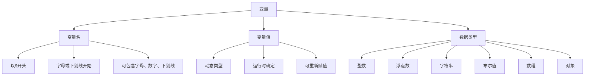

# 变量与常量

## 🎯 学习目标
- 理解PHP中变量和常量的概念
- 掌握变量的声明、赋值和使用方法
- 了解变量的作用域和生命周期
- 学会使用常量和预定义常量

## 📚 核心概念

### 变量基础
变量是存储数据的容器，在PHP中变量以`$`符号开头。



## 🔍 变量详解

### 变量声明和赋值

#### 基本语法
```php
<?php
// 变量声明和赋值
$name = "John";           // 字符串
$age = 25;                // 整数
$height = 5.9;            // 浮点数
$isStudent = true;        // 布尔值
$hobbies = ["reading", "coding"]; // 数组

// 变量重新赋值
$age = 26;                // 改变值
$name = "Jane";           // 改变类型
?>
```

#### 变量命名规则
```php
<?php
// 正确的变量名
$name = "John";
$_name = "John";
$name1 = "John";
$user_name = "John";
$userName = "John";

// 错误的变量名
// $1name = "John";      // 不能以数字开头
// $name-1 = "John";     // 不能包含连字符
// $name space = "John"; // 不能包含空格
?>
```

### 变量引用

#### 值传递 vs 引用传递
```php
<?php
// 值传递
$a = 10;
$b = $a;        // $b 是 $a 的副本
$b = 20;        // 修改 $b 不影响 $a
echo $a;        // 输出: 10

// 引用传递
$x = 10;
$y = &$x;       // $y 是 $x 的引用
$y = 20;        // 修改 $y 会影响 $x
echo $x;        // 输出: 20
?>
```

#### 引用传递示例
```php
<?php
function increment(&$value) {
    $value++;
}

$num = 5;
increment($num);
echo $num;  // 输出: 6

// 数组引用
$arr = [1, 2, 3];
foreach ($arr as &$item) {
    $item *= 2;
}
print_r($arr);  // 输出: [2, 4, 6]
?>
```

### 变量作用域

#### 局部作用域
```php
<?php
function testFunction() {
    $localVar = "I'm local";
    echo $localVar;  // 可以访问
}

// echo $localVar;  // 错误：未定义变量

testFunction();
?>
```

#### 全局作用域
```php
<?php
$globalVar = "I'm global";

function testGlobal() {
    global $globalVar;  // 声明全局变量
    echo $globalVar;    // 输出: I'm global
}

function testGlobal2() {
    echo $GLOBALS['globalVar'];  // 使用$GLOBALS数组
}

testGlobal();
testGlobal2();
?>
```

#### 静态变量
```php
<?php
function counter() {
    static $count = 0;  // 静态变量
    $count++;
    return $count;
}

echo counter();  // 输出: 1
echo counter();  // 输出: 2
echo counter();  // 输出: 3
?>
```

## 🔧 变量操作

### 变量变量
```php
<?php
$name = "user";
$$name = "John";  // 创建 $user 变量
echo $user;       // 输出: John

// 复杂示例
$var = "name";
$name = "John";
echo $$var;       // 输出: John
?>
```

### 变量函数
```php
<?php
// 检查变量是否存在
if (isset($name)) {
    echo "变量存在";
}

// 检查变量是否为空
if (empty($name)) {
    echo "变量为空";
}

// 获取变量类型
echo gettype($name);  // 输出: string

// 检查变量类型
if (is_string($name)) {
    echo "是字符串类型";
}

// 销毁变量
unset($name);
?>
```

### 变量输出
```php
<?php
$name = "John";
$age = 25;

// 基本输出
echo $name;                    // 输出: John
print $name;                   // 输出: John

// 字符串插值
echo "Hello, $name!";          // 输出: Hello, John!
echo "Hello, {$name}!";        // 输出: Hello, John!

// 连接输出
echo "Name: " . $name . ", Age: " . $age;

// 格式化输出
printf("Name: %s, Age: %d", $name, $age);
?>
```

## 📊 常量详解

### 常量定义

#### 基本语法
```php
<?php
// 使用 define() 函数
define("SITE_NAME", "My Website");
define("VERSION", "1.0.0");
define("DEBUG", true);

// 使用 const 关键字
const DATABASE_HOST = "localhost";
const DATABASE_PORT = 3306;

// 访问常量
echo SITE_NAME;        // 输出: My Website
echo DATABASE_HOST;    // 输出: localhost
?>
```

#### 常量命名规则
```php
<?php
// 正确的常量名
define("SITE_NAME", "My Site");
define("_PRIVATE_CONSTANT", "Private");
define("VERSION_1_0", "1.0.0");

// 错误的常量名
// define("site-name", "My Site");  // 不能包含连字符
// define("1VERSION", "1.0.0");     // 不能以数字开头
?>
```

### 预定义常量

#### 魔术常量
```php
<?php
echo __FILE__;      // 当前文件的完整路径
echo __DIR__;       // 当前文件所在的目录
echo __LINE__;      // 当前行号
echo __FUNCTION__;  // 当前函数名
echo __CLASS__;     // 当前类名
echo __METHOD__;    // 当前方法名
echo __NAMESPACE__; // 当前命名空间
?>
```

#### 系统常量
```php
<?php
echo PHP_VERSION;    // PHP版本
echo PHP_OS;         // 操作系统
echo PHP_EOL;        // 行结束符
echo DIRECTORY_SEPARATOR;  // 目录分隔符
echo PATH_SEPARATOR;       // 路径分隔符
?>
```

### 常量检查
```php
<?php
// 检查常量是否已定义
if (defined('SITE_NAME')) {
    echo "常量已定义";
}

// 获取所有已定义的常量
$constants = get_defined_constants();
print_r($constants);

// 获取用户定义的常量
$userConstants = get_defined_constants(true)['user'];
print_r($userConstants);
?>
```

## 🔄 变量类型转换

### 自动类型转换
```php
<?php
// 字符串转数字
$str = "123";
$num = $str + 5;        // 自动转换为整数 128

// 数字转字符串
$num = 456;
$str = $num . " is a number";  // 自动转换为字符串

// 布尔值转换
$bool = true;
$num = $bool + 1;       // true 转换为 1，结果为 2
$str = $bool . " value"; // true 转换为 "1 value"
?>
```

### 强制类型转换
```php
<?php
$value = "123.45";

// 转换为整数
$int = (int)$value;     // 结果: 123
$int = intval($value);  // 结果: 123

// 转换为浮点数
$float = (float)$value; // 结果: 123.45
$float = floatval($value); // 结果: 123.45

// 转换为字符串
$str = (string)$value;  // 结果: "123.45"
$str = strval($value);  // 结果: "123.45"

// 转换为布尔值
$bool = (bool)$value;   // 结果: true
$bool = boolval($value); // 结果: true

// 转换为数组
$arr = (array)$value;   // 结果: ["123.45"]
?>
```

## 🎯 实际应用示例

### 用户信息处理
```php
<?php
// 用户信息变量
$username = "john_doe";
$email = "john@example.com";
$age = 25;
$isActive = true;
$lastLogin = "2024-01-15";

// 常量定义
define("MAX_LOGIN_ATTEMPTS", 3);
define("SESSION_TIMEOUT", 3600);

// 用户状态检查
function checkUserStatus($username, $isActive) {
    if ($isActive) {
        return "用户 $username 状态正常";
    } else {
        return "用户 $username 已被禁用";
    }
}

echo checkUserStatus($username, $isActive);
?>
```

### 配置管理
```php
<?php
// 应用配置常量
define("APP_NAME", "My Application");
define("APP_VERSION", "2.1.0");
define("DEBUG_MODE", true);
define("DATABASE_HOST", "localhost");
define("DATABASE_PORT", 3306);

// 环境变量
$environment = $_SERVER['SERVER_NAME'] ?? 'localhost';
$isProduction = ($environment === 'production');

// 动态配置
$config = [
    'app_name' => APP_NAME,
    'version' => APP_VERSION,
    'debug' => DEBUG_MODE && !$isProduction,
    'database' => [
        'host' => DATABASE_HOST,
        'port' => DATABASE_PORT
    ]
];

// 使用配置
if ($config['debug']) {
    error_reporting(E_ALL);
    ini_set('display_errors', 1);
}
?>
```

## 📊 最佳实践

### 变量命名规范
```php
<?php
// 推荐的命名方式
$userName = "John";           // 驼峰命名
$user_email = "john@example.com"; // 下划线命名
$isLoggedIn = true;           // 布尔值前缀
$maxRetryCount = 3;           // 描述性命名

// 避免的命名方式
$u = "John";                  // 过于简短
$userName123 = "John";        // 数字结尾
$UserName = "John";           // 不一致的大小写
?>
```

### 常量使用建议
```php
<?php
// 配置常量
define("DB_HOST", "localhost");
define("DB_USER", "root");
define("DB_PASS", "password");
define("DB_NAME", "myapp");

// 状态常量
define("STATUS_ACTIVE", 1);
define("STATUS_INACTIVE", 0);
define("STATUS_PENDING", 2);

// 使用常量
$connection = mysqli_connect(DB_HOST, DB_USER, DB_PASS, DB_NAME);
if ($userStatus === STATUS_ACTIVE) {
    // 处理活跃用户
}
?>
```

## 🔍 常见问题

### 变量作用域问题
```php
<?php
// 问题：在函数内无法访问全局变量
$globalVar = "Hello";

function testScope() {
    // echo $globalVar;  // 错误：未定义变量
    global $globalVar;   // 解决方案：声明全局变量
    echo $globalVar;     // 正确
}

testScope();
?>
```

### 变量引用问题
```php
<?php
// 问题：意外的引用行为
$arr = [1, 2, 3];
foreach ($arr as &$item) {
    $item *= 2;
}
unset($item);  // 重要：取消引用

// 如果不取消引用，$item 仍然引用最后一个元素
foreach ($arr as $item) {
    // $item 会修改原数组的最后一个元素
}
?>
```

## 🎓 学习建议

### 费曼学习法应用
1. **选择概念**: 选择变量作用域或常量概念
2. **简化解释**: 用简单语言解释变量和常量的区别
3. **识别盲点**: 发现理解不深入的地方
4. **重新学习**: 针对盲点进行深入学习

### 刻意练习重点
1. **变量操作**: 练习各种变量操作和类型转换
2. **作用域理解**: 通过实际代码理解变量作用域
3. **常量使用**: 在实际项目中合理使用常量
4. **命名规范**: 养成良好的变量命名习惯

## 🔗 相关链接
- [[02-数据类型详解|数据类型详解]]
- [[03-运算符与表达式|运算符与表达式]]
- [[04-类型转换与判断|类型转换与判断]]
- [[05-语法最佳实践|语法最佳实践]]
- [[02-核心理解层/函数系统/01-函数基础|函数基础]]
