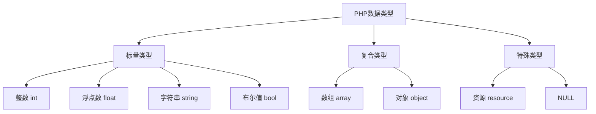

# 数据类型详解

## 🎯 学习目标
- 理解PHP中的8种基本数据类型
- 掌握各种数据类型的特点和使用方法
- 了解类型转换和类型判断
- 学会在实际开发中合理选择数据类型

## 📚 数据类型概览

### PHP数据类型分类



### 数据类型特点对比

| 类型 | 存储方式 | 内存占用 | 可变性 | 示例 |
|------|----------|----------|--------|------|
| int | 直接存储 | 4-8字节 | 不可变 | 42, -17 |
| float | 直接存储 | 8字节 | 不可变 | 3.14, -2.5 |
| string | 动态分配 | 变长 | 不可变 | "Hello" |
| bool | 直接存储 | 1字节 | 不可变 | true, false |
| array | 哈希表 | 变长 | 可变 | [1, 2, 3] |
| object | 引用 | 变长 | 可变 | new Class() |
| resource | 句柄 | 固定 | 不可变 | fopen() |
| NULL | 特殊值 | 0字节 | 不可变 | null |

## 🔢 标量类型详解

### 整数类型 (int)

#### 整数表示方法
```php
<?php
// 十进制
$decimal = 42;
$negative = -17;

// 八进制 (以0开头)
$octal = 0755;      // 十进制: 493

// 十六进制 (以0x开头)
$hex = 0xFF;        // 十进制: 255

// 二进制 (以0b开头)
$binary = 0b1010;   // 十进制: 10

// 大整数
$bigNumber = 9223372036854775807;  // 64位系统最大整数
?>
```

#### 整数范围
```php
<?php
// 检查整数范围
echo "PHP_INT_MAX: " . PHP_INT_MAX . "\n";
echo "PHP_INT_MIN: " . PHP_INT_MIN . "\n";
echo "PHP_INT_SIZE: " . PHP_INT_SIZE . " bytes\n";

// 整数溢出
$large = PHP_INT_MAX + 1;
echo gettype($large);  // 输出: double (自动转换为浮点数)
?>
```

#### 整数操作
```php
<?php
$a = 10;
$b = 3;

// 基本运算
echo $a + $b;  // 13
echo $a - $b;  // 7
echo $a * $b;  // 30
echo $a / $b;  // 3.333...
echo $a % $b;  // 1
echo $a ** $b; // 1000 (幂运算)

// 位运算
echo $a & $b;  // 2 (按位与)
echo $a | $b;  // 11 (按位或)
echo $a ^ $b;  // 9 (按位异或)
echo ~$a;      // -11 (按位取反)
echo $a << 1;  // 20 (左移)
echo $a >> 1;  // 5 (右移)
?>
```

### 浮点数类型 (float)

#### 浮点数表示
```php
<?php
// 基本浮点数
$float1 = 3.14;
$float2 = -2.5;
$float3 = 1.2e3;    // 科学计数法: 1200
$float4 = 7E-10;    // 科学计数法: 0.0000000007

// 浮点数精度问题
$result = 0.1 + 0.2;
echo $result;       // 输出: 0.30000000000000004
echo round($result, 1); // 输出: 0.3
?>
```

#### 浮点数比较
```php
<?php
// 错误的比较方式
$a = 0.1 + 0.2;
$b = 0.3;
if ($a == $b) {
    echo "相等";  // 不会执行
}

// 正确的比较方式
$epsilon = 0.00001;
if (abs($a - $b) < $epsilon) {
    echo "相等";  // 会执行
}

// 使用 bccomp 函数
if (bccomp($a, $b, 5) == 0) {
    echo "相等";
}
?>
```

#### 浮点数函数
```php
<?php
$number = 3.14159;

// 数学函数
echo ceil($number);   // 4 (向上取整)
echo floor($number);  // 3 (向下取整)
echo round($number);  // 3 (四舍五入)
echo round($number, 2); // 3.14 (保留2位小数)

// 其他函数
echo abs(-3.14);      // 3.14 (绝对值)
echo sqrt(16);        // 4 (平方根)
echo pow(2, 3);       // 8 (幂运算)
echo log(10);         // 2.302585092994 (自然对数)
echo sin(pi()/2);     // 1 (正弦函数)
?>
```

### 字符串类型 (string)

#### 字符串定义方式
```php
<?php
// 单引号
$single = 'Hello World';
$single = 'It\'s a beautiful day';  // 转义单引号

// 双引号
$double = "Hello World";
$double = "He said \"Hello\"";      // 转义双引号

// 双引号支持变量插值
$name = "John";
$greeting = "Hello, $name!";        // 输出: Hello, John!
$greeting = "Hello, {$name}!";      // 输出: Hello, John!

// 单引号不支持变量插值
$greeting = 'Hello, $name!';        // 输出: Hello, $name!

// 定界符 (Heredoc)
$heredoc = <<<EOT
This is a heredoc string.
It can span multiple lines.
Variables like $name are interpolated.
EOT;

// 定界符 (Nowdoc)
$nowdoc = <<<'EOT'
This is a nowdoc string.
It can span multiple lines.
Variables like $name are NOT interpolated.
EOT;
?>
```

#### 字符串操作
```php
<?php
$str = "Hello World";

// 长度
echo strlen($str);           // 11

// 子字符串
echo substr($str, 0, 5);     // Hello
echo substr($str, 6);        // World
echo substr($str, -5);       // World

// 查找
echo strpos($str, "World");  // 6
echo strrpos($str, "l");     // 9 (最后一次出现)

// 替换
echo str_replace("World", "PHP", $str);  // Hello PHP

// 大小写转换
echo strtoupper($str);       // HELLO WORLD
echo strtolower($str);       // hello world
echo ucfirst($str);          // Hello world
echo ucwords($str);          // Hello World

// 去除空白
$str = "  Hello World  ";
echo trim($str);             // Hello World
echo ltrim($str);            // Hello World  
echo rtrim($str);            //   Hello World
?>
```

#### 字符串格式化
```php
<?php
$name = "John";
$age = 25;
$salary = 50000.50;

// printf 格式化
printf("Name: %s, Age: %d, Salary: $%.2f\n", $name, $age, $salary);

// sprintf 返回格式化字符串
$formatted = sprintf("Name: %s, Age: %d, Salary: $%.2f", $name, $age, $salary);
echo $formatted;

// 格式化说明符
printf("整数: %d\n", 42);        // 十进制
printf("八进制: %o\n", 42);      // 八进制
printf("十六进制: %x\n", 42);    // 十六进制
printf("浮点数: %.2f\n", 3.14159); // 保留2位小数
printf("科学计数: %e\n", 1000);   // 科学计数法
printf("字符串: %s\n", "Hello");  // 字符串
printf("字符: %c\n", 65);         // ASCII字符
?>
```

### 布尔值类型 (bool)

#### 布尔值定义
```php
<?php
// 直接赋值
$true = true;
$false = false;

// 条件表达式
$result = (5 > 3);        // true
$result = (5 < 3);        // false

// 类型转换
$bool1 = (bool)1;         // true
$bool2 = (bool)0;         // false
$bool3 = (bool)"hello";   // true
$bool4 = (bool)"";        // false
$bool5 = (bool)[];        // false
$bool6 = (bool)[1, 2, 3]; // true
?>
```

#### 布尔值转换规则
```php
<?php
// 转换为 false 的值
$falsy = [
    false,      // 布尔值 false
    0,          // 整数 0
    0.0,        // 浮点数 0.0
    "",         // 空字符串
    "0",        // 字符串 "0"
    [],         // 空数组
    null        // NULL
];

// 转换为 true 的值
$truthy = [
    true,       // 布尔值 true
    1,          // 非零整数
    3.14,       // 非零浮点数
    "hello",    // 非空字符串
    [1, 2, 3],  // 非空数组
    new stdClass() // 对象
];

// 检查函数
function isTruthy($value) {
    return (bool)$value;
}

foreach ($falsy as $value) {
    echo isTruthy($value) ? "true" : "false";  // 全部输出 false
}
?>
```

## 📊 复合类型详解

### 数组类型 (array)

#### 数组定义
```php
<?php
// 索引数组
$fruits = ["apple", "banana", "orange"];
$fruits = array("apple", "banana", "orange");

// 关联数组
$person = [
    "name" => "John",
    "age" => 25,
    "city" => "New York"
];

// 混合数组
$mixed = [
    0 => "first",
    "key" => "value",
    1 => "second"
];

// 多维数组
$matrix = [
    [1, 2, 3],
    [4, 5, 6],
    [7, 8, 9]
];
?>
```

#### 数组操作
```php
<?php
$fruits = ["apple", "banana", "orange"];

// 访问元素
echo $fruits[0];        // apple
echo $fruits[1];        // banana

// 修改元素
$fruits[0] = "grape";
$fruits[] = "kiwi";     // 添加元素

// 数组函数
echo count($fruits);    // 4
echo in_array("banana", $fruits); // 1 (true)

// 添加/删除元素
array_push($fruits, "mango");     // 末尾添加
array_pop($fruits);               // 末尾删除
array_unshift($fruits, "strawberry"); // 开头添加
array_shift($fruits);             // 开头删除

// 数组遍历
foreach ($fruits as $fruit) {
    echo $fruit . "\n";
}

foreach ($fruits as $index => $fruit) {
    echo "$index: $fruit\n";
}
?>
```

### 对象类型 (object)

#### 对象定义
```php
<?php
// 简单对象
$obj = new stdClass();
$obj->name = "John";
$obj->age = 25;

// 访问属性
echo $obj->name;        // John
echo $obj->age;         // 25

// 类定义
class Person {
    public $name;
    public $age;
    
    public function __construct($name, $age) {
        $this->name = $name;
        $this->age = $age;
    }
    
    public function greet() {
        return "Hello, I'm {$this->name}";
    }
}

// 创建对象
$person = new Person("Jane", 30);
echo $person->greet();  // Hello, I'm Jane
?>
```

## 🔄 特殊类型详解

### 资源类型 (resource)

#### 资源使用
```php
<?php
// 文件资源
$file = fopen("data.txt", "r");
echo get_resource_type($file);  // stream

// 数据库连接
$connection = mysqli_connect("localhost", "user", "pass", "db");
echo get_resource_type($connection);  // mysql link

// 图像资源
$image = imagecreate(100, 100);
echo get_resource_type($image);  // gd

// 检查资源
if (is_resource($file)) {
    echo "这是一个资源";
}

// 关闭资源
fclose($file);
mysqli_close($connection);
imagedestroy($image);
?>
```

### NULL类型

#### NULL使用
```php
<?php
// 直接赋值
$var = null;

// 未初始化的变量
$uninitialized;  // 默认为 null

// 函数返回 null
function getValue() {
    return null;
}

// 检查 NULL
if (is_null($var)) {
    echo "变量为 NULL";
}

// 使用 === 比较
if ($var === null) {
    echo "变量为 NULL";
}

// 使用 ?? 操作符
$result = $var ?? "默认值";  // 如果 $var 为 null，使用默认值
?>
```

## 🔍 类型检测和转换

### 类型检测函数
```php
<?php
$value = 42;

// 类型检测
echo gettype($value);        // integer
echo is_int($value);         // 1 (true)
echo is_integer($value);     // 1 (true)
echo is_long($value);        // 1 (true)

// 其他类型检测
echo is_float(3.14);         // 1 (true)
echo is_string("hello");     // 1 (true)
echo is_bool(true);          // 1 (true)
echo is_array([1, 2, 3]);    // 1 (true)
echo is_object(new stdClass()); // 1 (true)
echo is_resource(fopen("test.txt", "r")); // 1 (true)
echo is_null(null);          // 1 (true)

// 类型判断
echo is_numeric("123");      // 1 (true)
echo is_scalar("hello");     // 1 (true)
echo is_callable("strlen");  // 1 (true)
?>
```

### 类型转换
```php
<?php
$value = "123.45";

// 强制类型转换
$int = (int)$value;          // 123
$float = (float)$value;      // 123.45
$string = (string)$value;    // "123.45"
$bool = (bool)$value;        // true
$array = (array)$value;      // ["123.45"]

// 使用函数转换
$int = intval($value);       // 123
$float = floatval($value);   // 123.45
$string = strval($value);    // "123.45"
$bool = boolval($value);     // true

// 自动类型转换
$result = $value + 5;        // 自动转换为浮点数: 128.45
$result = $value . " is a number"; // 自动转换为字符串
?>
```

## 🎯 实际应用示例

### 数据类型验证
```php
<?php
function validateUserData($data) {
    $errors = [];
    
    // 验证姓名
    if (!is_string($data['name']) || empty(trim($data['name']))) {
        $errors[] = "姓名必须是非空字符串";
    }
    
    // 验证年龄
    if (!is_int($data['age']) || $data['age'] < 0 || $data['age'] > 150) {
        $errors[] = "年龄必须是0-150之间的整数";
    }
    
    // 验证邮箱
    if (!is_string($data['email']) || !filter_var($data['email'], FILTER_VALIDATE_EMAIL)) {
        $errors[] = "邮箱格式不正确";
    }
    
    // 验证是否激活
    if (!is_bool($data['isActive'])) {
        $errors[] = "激活状态必须是布尔值";
    }
    
    return $errors;
}

// 使用示例
$userData = [
    'name' => 'John Doe',
    'age' => 25,
    'email' => 'john@example.com',
    'isActive' => true
];

$errors = validateUserData($userData);
if (empty($errors)) {
    echo "数据验证通过";
} else {
    foreach ($errors as $error) {
        echo $error . "\n";
    }
}
?>
```

### 数据类型优化
```php
<?php
// 性能优化示例
function processData($data) {
    // 使用适当的数据类型
    $processed = [];
    
    foreach ($data as $item) {
        // 确保数据类型正确
        $processed[] = [
            'id' => (int)$item['id'],           // 整数
            'name' => (string)$item['name'],    // 字符串
            'price' => (float)$item['price'],   // 浮点数
            'isActive' => (bool)$item['isActive'], // 布尔值
            'tags' => (array)$item['tags']      // 数组
        ];
    }
    
    return $processed;
}

// 内存使用优化
function optimizeMemoryUsage($largeArray) {
    // 使用生成器减少内存使用
    foreach ($largeArray as $item) {
        yield processItem($item);
    }
}

function processItem($item) {
    // 处理单个项目
    return $item * 2;
}
?>
```

## 📊 最佳实践

### 数据类型选择
```php
<?php
// 1. 使用合适的数据类型
$userId = 123;              // 整数
$userName = "John";         // 字符串
$userBalance = 99.99;       // 浮点数
$isPremium = true;          // 布尔值

// 2. 避免不必要的类型转换
$count = 10;                // 直接使用整数
// 避免: $count = (int)"10";

// 3. 使用类型提示
function calculateTotal(array $items): float {
    $total = 0.0;
    foreach ($items as $item) {
        $total += (float)$item['price'];
    }
    return $total;
}

// 4. 使用严格比较
if ($status === 'active') {  // 使用 ===
    // 处理活跃状态
}
?>
```

### 类型安全
```php
<?php
// 类型安全的函数
function safeDivide(float $a, float $b): float {
    if ($b == 0) {
        throw new InvalidArgumentException("除数不能为零");
    }
    return $a / $b;
}

// 使用类型声明
function processUser(User $user): array {
    return [
        'id' => $user->getId(),
        'name' => $user->getName(),
        'email' => $user->getEmail()
    ];
}

// 类型检查
function isValidEmail($email): bool {
    return is_string($email) && filter_var($email, FILTER_VALIDATE_EMAIL) !== false;
}
?>
```

## 🎓 学习建议

### 费曼学习法应用
1. **选择概念**: 选择数据类型转换或类型检测概念
2. **简化解释**: 用简单语言解释不同数据类型的特点
3. **识别盲点**: 发现理解不深入的地方
4. **重新学习**: 针对盲点进行深入学习

### 刻意练习重点
1. **类型转换**: 练习各种类型转换场景
2. **类型检测**: 掌握类型检测函数的使用
3. **实际应用**: 在实际项目中合理选择数据类型
4. **性能优化**: 了解数据类型对性能的影响

## 🔗 相关链接
- [[01-变量与常量|变量与常量]]
- [[03-运算符与表达式|运算符与表达式]]
- [[04-类型转换与判断|类型转换与判断]]
- [[05-语法最佳实践|语法最佳实践]]
- [[02-核心理解层/数组与字符串/01-数组基础|数组基础]]
