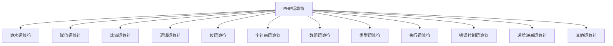

# 运算符与表达式

## 🎯 学习目标
- 理解PHP中各种运算符的分类和用法
- 掌握运算符的优先级和结合性
- 学会使用表达式进行数据计算和逻辑判断
- 了解运算符在实际开发中的应用场景

## 📚 运算符概览

### 运算符分类



### 运算符优先级表

| 优先级 | 运算符 | 结合性 | 说明 |
|--------|--------|--------|------|
| 1 | `()` `[]` `->` `::` | 左结合 | 括号、数组访问、对象访问 |
| 2 | `++` `--` `~` `(int)` `(float)` `(string)` `(array)` `(object)` `(bool)` `@` | 右结合 | 递增递减、类型转换 |
| 3 | `**` | 右结合 | 幂运算 |
| 4 | `*` `/` `%` | 左结合 | 乘除取余 |
| 5 | `+` `-` `.` | 左结合 | 加减字符串连接 |
| 6 | `<<` `>>` | 左结合 | 位左移右移 |
| 7 | `<` `<=` `>` `>=` | 左结合 | 比较运算符 |
| 8 | `==` `!=` `===` `!==` `<>` `<=>` | 左结合 | 相等性比较 |
| 9 | `&` | 左结合 | 按位与 |
| 10 | `^` | 左结合 | 按位异或 |
| 11 | `\|` | 左结合 | 按位或 |
| 12 | `&&` | 左结合 | 逻辑与 |
| 13 | `\|\|` | 左结合 | 逻辑或 |
| 14 | `??` | 左结合 | NULL合并 |
| 15 | `? :` | 左结合 | 三元运算符 |
| 16 | `=` `+=` `-=` `*=` `/=` `%=` `**=` `&=` `\|=` `^=` `<<=` `>>=` `.=` | 右结合 | 赋值运算符 |

## 🔢 算术运算符

### 基本算术运算
```php
<?php
$a = 10;
$b = 3;

// 基本运算
echo $a + $b;   // 13 (加法)
echo $a - $b;   // 7  (减法)
echo $a * $b;   // 30 (乘法)
echo $a / $b;   // 3.333... (除法)
echo $a % $b;   // 1  (取余)
echo $a ** $b;  // 1000 (幂运算)

// 浮点数运算
$x = 3.14;
$y = 2.0;
echo $x + $y;   // 5.14
echo $x * $y;   // 6.28
echo $x / $y;   // 1.57
?>
```

### 算术运算符应用
```php
<?php
// 计算器函数
function calculate($num1, $operator, $num2) {
    switch ($operator) {
        case '+':
            return $num1 + $num2;
        case '-':
            return $num1 - $num2;
        case '*':
            return $num1 * $num2;
        case '/':
            if ($num2 == 0) {
                throw new InvalidArgumentException("除数不能为零");
            }
            return $num1 / $num2;
        case '%':
            return $num1 % $num2;
        case '**':
            return $num1 ** $num2;
        default:
            throw new InvalidArgumentException("不支持的运算符");
    }
}

// 使用示例
echo calculate(10, '+', 5);   // 15
echo calculate(10, '*', 3);   // 30
echo calculate(8, '**', 2);   // 64
?>
```

## 📝 赋值运算符

### 基本赋值
```php
<?php
// 基本赋值
$a = 10;
$b = $a;        // $b 现在等于 10

// 复合赋值
$a += 5;        // $a = $a + 5; 结果: 15
$a -= 3;        // $a = $a - 3; 结果: 12
$a *= 2;        // $a = $a * 2; 结果: 24
$a /= 4;        // $a = $a / 4; 结果: 6
$a %= 5;        // $a = $a % 5; 结果: 1
$a **= 3;       // $a = $a ** 3; 结果: 1

// 字符串赋值
$str = "Hello";
$str .= " World";  // $str = $str . " World"; 结果: "Hello World"
?>
```

### 赋值运算符应用
```php
<?php
// 计数器
$count = 0;
$count += 1;    // 递增计数
$count += 5;    // 增加5

// 累加器
$total = 0;
$prices = [10.5, 25.0, 15.75, 8.99];
foreach ($prices as $price) {
    $total += $price;  // 累加价格
}
echo "总价: $" . number_format($total, 2);

// 字符串构建
$html = "";
$html .= "<html>";
$html .= "<head><title>My Page</title></head>";
$html .= "<body>Content here</body>";
$html .= "</html>";
?>
```

## 🔍 比较运算符

### 基本比较
```php
<?php
$a = 10;
$b = 5;
$c = "10";

// 基本比较
echo $a > $b;   // 1 (true)
echo $a < $b;   // 0 (false)
echo $a >= $b;  // 1 (true)
echo $a <= $b;  // 0 (false)

// 相等性比较
echo $a == $c;  // 1 (true) - 值相等
echo $a === $c; // 0 (false) - 值和类型都相等
echo $a != $b;  // 1 (true) - 值不相等
echo $a !== $c; // 1 (true) - 值或类型不相等
echo $a <> $b;  // 1 (true) - 值不相等 (等同于 !=)

// 太空船运算符 (PHP 7+)
echo $a <=> $b; // 1 (左边大于右边)
echo $b <=> $a; // -1 (左边小于右边)
echo $a <=> $a; // 0 (相等)
?>
```

### 比较运算符应用
```php
<?php
// 成绩等级判断
function getGrade($score) {
    if ($score >= 90) {
        return 'A';
    } elseif ($score >= 80) {
        return 'B';
    } elseif ($score >= 70) {
        return 'C';
    } elseif ($score >= 60) {
        return 'D';
    } else {
        return 'F';
    }
}

// 年龄验证
function validateAge($age) {
    return $age >= 18 && $age <= 65;
}

// 字符串比较
function compareStrings($str1, $str2) {
    $result = strcmp($str1, $str2);
    if ($result < 0) {
        return "$str1 小于 $str2";
    } elseif ($result > 0) {
        return "$str1 大于 $str2";
    } else {
        return "$str1 等于 $str2";
    }
}

// 使用示例
echo getGrade(85);                    // B
echo validateAge(25) ? "有效" : "无效"; // 有效
echo compareStrings("apple", "banana"); // apple 小于 banana
?>
```

## 🧠 逻辑运算符

### 基本逻辑运算
```php
<?php
$a = true;
$b = false;

// 逻辑与
echo $a && $b;  // 0 (false)
echo $a and $b; // 0 (false) - 优先级较低

// 逻辑或
echo $a || $b;  // 1 (true)
echo $a or $b;  // 1 (true) - 优先级较低

// 逻辑非
echo !$a;       // 0 (false)
echo !$b;       // 1 (true)

// 逻辑异或
echo $a xor $b; // 1 (true) - 只有一个为真
echo $a xor $a; // 0 (false) - 两个都为真
?>
```

### 逻辑运算符应用
```php
<?php
// 用户权限检查
function checkPermission($user, $action) {
    $isAdmin = $user['role'] === 'admin';
    $isOwner = $user['id'] === $action['owner_id'];
    $isPublic = $action['is_public'];
    
    return $isAdmin || $isOwner || $isPublic;
}

// 表单验证
function validateForm($data) {
    $errors = [];
    
    // 姓名验证
    if (empty($data['name']) || strlen($data['name']) < 2) {
        $errors[] = "姓名不能为空且长度至少2个字符";
    }
    
    // 邮箱验证
    if (empty($data['email']) || !filter_var($data['email'], FILTER_VALIDATE_EMAIL)) {
        $errors[] = "邮箱格式不正确";
    }
    
    // 年龄验证
    if (!isset($data['age']) || $data['age'] < 18 || $data['age'] > 100) {
        $errors[] = "年龄必须在18-100之间";
    }
    
    return empty($errors);
}

// 条件执行
function processData($data, $options) {
    if ($options['validate'] && !validateForm($data)) {
        return false;
    }
    
    if ($options['log'] || $options['debug']) {
        error_log("Processing data: " . json_encode($data));
    }
    
    return true;
}
?>
```

## 🔧 位运算符

### 基本位运算
```php
<?php
$a = 12;  // 二进制: 1100
$b = 10;  // 二进制: 1010

// 按位与
echo $a & $b;   // 8 (二进制: 1000)

// 按位或
echo $a | $b;   // 14 (二进制: 1110)

// 按位异或
echo $a ^ $b;   // 6 (二进制: 0110)

// 按位取反
echo ~$a;       // -13 (二进制: 11111111111111111111111111110011)

// 左移
echo $a << 2;   // 48 (二进制: 110000)

// 右移
echo $a >> 2;   // 3 (二进制: 11)
?>
```

### 位运算符应用
```php
<?php
// 权限系统
class Permission {
    const READ = 1;    // 0001
    const WRITE = 2;   // 0010
    const EXECUTE = 4; // 0100
    const DELETE = 8;  // 1000
    
    public static function hasPermission($userPermissions, $requiredPermission) {
        return ($userPermissions & $requiredPermission) === $requiredPermission;
    }
    
    public static function addPermission($permissions, $permission) {
        return $permissions | $permission;
    }
    
    public static function removePermission($permissions, $permission) {
        return $permissions & ~$permission;
    }
}

// 使用示例
$userPermissions = Permission::READ | Permission::WRITE; // 3 (0011)

echo Permission::hasPermission($userPermissions, Permission::READ) ? "有读权限" : "无读权限";
echo Permission::hasPermission($userPermissions, Permission::EXECUTE) ? "有执行权限" : "无执行权限";

// 奇偶判断
function isEven($number) {
    return ($number & 1) === 0;
}

// 2的幂判断
function isPowerOfTwo($number) {
    return $number > 0 && ($number & ($number - 1)) === 0;
}

// 使用示例
echo isEven(10) ? "偶数" : "奇数";        // 偶数
echo isPowerOfTwo(8) ? "是2的幂" : "不是2的幂"; // 是2的幂
?>
```

## 🔗 字符串运算符

### 字符串连接
```php
<?php
$str1 = "Hello";
$str2 = "World";

// 连接运算符
$result = $str1 . " " . $str2;  // "Hello World"
echo $result;

// 复合赋值
$str1 .= " " . $str2;  // $str1 现在为 "Hello World"
echo $str1;

// 多行字符串构建
$html = "";
$html .= "<div class='container'>";
$html .= "<h1>标题</h1>";
$html .= "<p>内容</p>";
$html .= "</div>";
?>
```

### 字符串运算符应用
```php
<?php
// 动态SQL构建
function buildQuery($table, $conditions = []) {
    $query = "SELECT * FROM " . $table;
    
    if (!empty($conditions)) {
        $query .= " WHERE ";
        $whereClauses = [];
        
        foreach ($conditions as $field => $value) {
            $whereClauses[] = $field . " = '" . addslashes($value) . "'";
        }
        
        $query .= implode(" AND ", $whereClauses);
    }
    
    return $query;
}

// 使用示例
echo buildQuery("users", ["status" => "active", "age" => "25"]);
// 输出: SELECT * FROM users WHERE status = 'active' AND age = '25'

// 模板生成
function generateEmailTemplate($user, $template) {
    $content = $template;
    $content = str_replace("{name}", $user['name'], $content);
    $content = str_replace("{email}", $user['email'], $content);
    $content = str_replace("{date}", date('Y-m-d'), $content);
    
    return $content;
}

// 使用示例
$template = "Hello {name}, your email is {email}. Today is {date}.";
$user = ["name" => "John", "email" => "john@example.com"];
echo generateEmailTemplate($user, $template);
?>
```

## 🎯 三元运算符和NULL合并运算符

### 三元运算符
```php
<?php
$age = 20;

// 基本三元运算符
$status = $age >= 18 ? "成年人" : "未成年人";
echo $status;  // 成年人

// 嵌套三元运算符
$grade = $age >= 18 ? ($age >= 65 ? "老年" : "成年") : "未成年";
echo $grade;   // 成年

// 与赋值结合
$discount = $age >= 65 ? 0.2 : ($age >= 18 ? 0.1 : 0.05);
echo "折扣: " . ($discount * 100) . "%";  // 折扣: 10%
?>
```

### NULL合并运算符 (PHP 7+)
```php
<?php
// 基本用法
$name = $_GET['name'] ?? 'Guest';
echo $name;  // 如果 $_GET['name'] 存在且不为 null，使用其值，否则使用 'Guest'

// 链式使用
$config = [
    'database' => [
        'host' => 'localhost'
    ]
];

$host = $config['database']['host'] ?? $config['default_host'] ?? 'localhost';
$port = $config['database']['port'] ?? 3306;
$user = $config['database']['user'] ?? 'root';

// 与三元运算符结合
$theme = $_COOKIE['theme'] ?? ($_SESSION['theme'] ?? 'default');
?>
```

### 实际应用示例
```php
<?php
// 配置管理
class Config {
    private static $config = [];
    
    public static function get($key, $default = null) {
        return self::$config[$key] ?? $default;
    }
    
    public static function set($key, $value) {
        self::$config[$key] = $value;
    }
}

// 使用示例
Config::set('app_name', 'My App');
Config::set('debug', true);

$appName = Config::get('app_name', 'Default App');
$debug = Config::get('debug', false);
$timezone = Config::get('timezone', 'UTC');

// 用户偏好设置
function getUserPreference($user, $key, $default = null) {
    return $user['preferences'][$key] ?? 
           $user['default_preferences'][$key] ?? 
           $default;
}

// 使用示例
$user = [
    'preferences' => ['theme' => 'dark'],
    'default_preferences' => ['language' => 'en']
];

$theme = getUserPreference($user, 'theme', 'light');
$language = getUserPreference($user, 'language', 'zh');
$fontSize = getUserPreference($user, 'font_size', '14px');
?>
```

## 🔄 递增递减运算符

### 基本用法
```php
<?php
$a = 5;

// 前置递增
echo ++$a;  // 6 (先递增再使用)
echo $a;    // 6

// 后置递增
echo $a++;  // 6 (先使用再递增)
echo $a;    // 7

// 前置递减
echo --$a;  // 6 (先递减再使用)
echo $a;    // 6

// 后置递减
echo $a--;  // 6 (先使用再递减)
echo $a;    // 5
?>
```

### 递增递减运算符应用
```php
<?php
// 循环计数器
for ($i = 0; $i < 10; $i++) {
    echo "计数: $i\n";
}

// 数组遍历
$items = ['apple', 'banana', 'orange'];
for ($i = 0; $i < count($items); $i++) {
    echo "项目 " . ($i + 1) . ": " . $items[$i] . "\n";
}

// 倒序输出
for ($i = 10; $i > 0; $i--) {
    echo "倒计时: $i\n";
}

// 字符串处理
$str = "Hello";
$length = strlen($str);
for ($i = 0; $i < $length; $i++) {
    echo "字符 " . ($i + 1) . ": " . $str[$i] . "\n";
}
?>
```

## 🎯 实际应用示例

### 计算器应用
```php
<?php
class Calculator {
    public static function calculate($expression) {
        // 简单的表达式计算器
        $tokens = preg_split('/([+\-*\/%])/', $expression, -1, PREG_SPLIT_DELIM_CAPTURE);
        $tokens = array_map('trim', $tokens);
        $tokens = array_filter($tokens);
        
        if (count($tokens) !== 3) {
            throw new InvalidArgumentException("无效的表达式");
        }
        
        $num1 = (float)$tokens[0];
        $operator = $tokens[1];
        $num2 = (float)$tokens[2];
        
        switch ($operator) {
            case '+':
                return $num1 + $num2;
            case '-':
                return $num1 - $num2;
            case '*':
                return $num1 * $num2;
            case '/':
                if ($num2 == 0) {
                    throw new InvalidArgumentException("除数不能为零");
                }
                return $num1 / $num2;
            case '%':
                return $num1 % $num2;
            default:
                throw new InvalidArgumentException("不支持的运算符: $operator");
        }
    }
}

// 使用示例
try {
    echo Calculator::calculate("10 + 5");    // 15
    echo Calculator::calculate("20 * 3");    // 60
    echo Calculator::calculate("15 / 3");    // 5
} catch (Exception $e) {
    echo "错误: " . $e->getMessage();
}
?>
```

### 权限管理系统
```php
<?php
class PermissionManager {
    const PERMISSIONS = [
        'READ' => 1,
        'WRITE' => 2,
        'EXECUTE' => 4,
        'DELETE' => 8,
        'ADMIN' => 16
    ];
    
    private $userPermissions = 0;
    
    public function __construct($permissions = 0) {
        $this->userPermissions = $permissions;
    }
    
    public function hasPermission($permission) {
        return ($this->userPermissions & $permission) === $permission;
    }
    
    public function addPermission($permission) {
        $this->userPermissions |= $permission;
        return $this;
    }
    
    public function removePermission($permission) {
        $this->userPermissions &= ~$permission;
        return $this;
    }
    
    public function getPermissions() {
        $permissions = [];
        foreach (self::PERMISSIONS as $name => $value) {
            if ($this->hasPermission($value)) {
                $permissions[] = $name;
            }
        }
        return $permissions;
    }
}

// 使用示例
$user = new PermissionManager();
$user->addPermission(PermissionManager::PERMISSIONS['READ'])
     ->addPermission(PermissionManager::PERMISSIONS['WRITE']);

echo $user->hasPermission(PermissionManager::PERMISSIONS['READ']) ? "有读权限" : "无读权限";
echo $user->hasPermission(PermissionManager::PERMISSIONS['DELETE']) ? "有删除权限" : "无删除权限";

print_r($user->getPermissions()); // ['READ', 'WRITE']
?>
```

## 📊 最佳实践

### 运算符使用建议
```php
<?php
// 1. 使用括号明确优先级
$result = ($a + $b) * ($c - $d);  // 明确运算顺序

// 2. 避免复杂的嵌套三元运算符
// 不好的写法
$status = $age >= 18 ? ($age >= 65 ? "老年" : "成年") : "未成年";

// 好的写法
if ($age >= 65) {
    $status = "老年";
} elseif ($age >= 18) {
    $status = "成年";
} else {
    $status = "未成年";
}

// 3. 使用NULL合并运算符简化代码
$name = $_POST['name'] ?? $_GET['name'] ?? 'Guest';

// 4. 注意浮点数比较
$result = 0.1 + 0.2;
if (abs($result - 0.3) < 0.00001) {
    echo "相等";
}

// 5. 使用位运算符进行权限管理
$permissions = READ | WRITE;  // 清晰明了
?>
```

### 性能优化
```php
<?php
// 1. 使用复合赋值运算符
$count += 1;  // 比 $count = $count + 1; 更高效

// 2. 避免不必要的类型转换
$result = $a + $b;  // 直接运算
// 避免: $result = (int)$a + (int)$b; 除非必要

// 3. 使用位运算进行快速计算
function isEven($n) {
    return ($n & 1) === 0;  // 比 $n % 2 === 0 更高效
}

// 4. 字符串连接优化
$html = "";
$html .= "<div>";
$html .= "<p>Content</p>";
$html .= "</div>";
// 比多次使用 . 运算符更高效
?>
```

## 🎓 学习建议

### 费曼学习法应用
1. **选择概念**: 选择运算符优先级或逻辑运算符概念
2. **简化解释**: 用简单语言解释运算符的作用和优先级
3. **识别盲点**: 发现理解不深入的地方
4. **重新学习**: 针对盲点进行深入学习

### 刻意练习重点
1. **优先级理解**: 通过实际代码理解运算符优先级
2. **逻辑运算**: 练习复杂的逻辑表达式
3. **位运算应用**: 掌握位运算在权限管理中的应用
4. **表达式优化**: 学会编写高效清晰的表达式

## 🔗 相关链接
- [[01-变量与常量|变量与常量]]
- [[02-数据类型详解|数据类型详解]]
- [[04-类型转换与判断|类型转换与判断]]
- [[05-语法最佳实践|语法最佳实践]]
- [[01-基础认知层/控制结构/01-条件语句|条件语句]]
