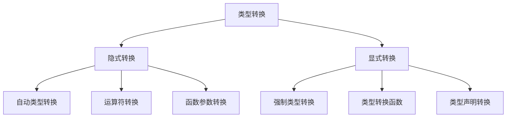

# 类型转换与判断

## 🎯 学习目标
- 理解PHP中类型转换的机制和规则
- 掌握显式类型转换和隐式类型转换
- 学会使用类型判断函数
- 了解类型转换在实际开发中的应用场景

## 📚 类型转换概览

### 类型转换分类



### 类型转换规则表

| 原类型 | 目标类型 | 转换规则 | 示例 |
|--------|----------|----------|------|
| string | int | 提取数字部分，非数字开头为0 | "123" → 123, "abc" → 0 |
| string | float | 提取数字部分，支持小数 | "123.45" → 123.45 |
| string | bool | 空字符串为false，其他为true | "" → false, "0" → true |
| int | string | 直接转换 | 123 → "123" |
| int | bool | 0为false，其他为true | 0 → false, 1 → true |
| float | int | 截断小数部分 | 3.14 → 3 |
| bool | int | true→1, false→0 | true → 1, false → 0 |
| array | string | 转换为"Array" | [1,2,3] → "Array" |
| object | string | 调用__toString()方法 | object → string |
| null | 任意 | 转换为对应类型的默认值 | null → 0, "", false |

## 🔄 隐式类型转换

### 自动类型转换
```php
<?php
// 字符串与数字运算
$str = "123";
$num = $str + 5;        // 自动转换为整数: 128
$result = $str . " is a number"; // 自动转换为字符串

// 布尔值参与运算
$bool = true;
$result = $bool + 1;    // true转换为1，结果为2
$result = $bool . " value"; // true转换为"1 value"

// 数组参与运算
$arr = [1, 2, 3];
$result = $arr + 5;     // 数组转换为0，结果为5
$result = $arr . " array"; // 数组转换为"Array array"

// 对象参与运算
$obj = new stdClass();
$result = $obj + 1;     // 对象转换为1，结果为2
?>
```

### 运算符中的类型转换
```php
<?php
// 算术运算符
echo "123" + "456";     // 579 (字符串转数字)
echo "123" - "456";     // -333
echo "123" * "456";     // 56088
echo "123" / "456";     // 0.26973684210526

// 比较运算符
echo "123" == 123;      // true (值相等)
echo "123" === 123;     // false (类型不同)
echo "123" > 122;       // true (字符串转数字比较)

// 逻辑运算符
echo "hello" && 1;      // true (非空字符串为true)
echo "" || 0;           // false (空字符串和0都为false)
echo "0" && true;       // false ("0"字符串为true，但逻辑与结果为false)

// 字符串连接
echo "Hello " . 123;    // "Hello 123" (数字转字符串)
echo "Count: " . (5 + 3); // "Count: 8" (括号内先计算)
?>
```

### 函数参数中的类型转换
```php
<?php
function processData($data) {
    // 函数内部会根据使用方式自动转换类型
    if (is_numeric($data)) {
        return (int)$data * 2;
    } elseif (is_string($data)) {
        return strtoupper($data);
    } elseif (is_array($data)) {
        return count($data);
    }
    return $data;
}

// 自动类型转换示例
echo processData("123");    // 246 (字符串转数字后乘以2)
echo processData(123);      // 246 (数字直接乘以2)
echo processData("hello");  // "HELLO" (字符串转大写)
echo processData([1,2,3]);  // 3 (数组转长度)
?>
```

## 🔧 显式类型转换

### 强制类型转换
```php
<?php
$value = "123.45";

// 基本类型转换
$int = (int)$value;         // 123
$float = (float)$value;     // 123.45
$string = (string)$value;   // "123.45"
$bool = (bool)$value;       // true
$array = (array)$value;     // ["123.45"]
$object = (object)$value;   // stdClass对象

// 类型转换函数
$int = intval($value);      // 123
$float = floatval($value);  // 123.45
$string = strval($value);   // "123.45"
$bool = boolval($value);    // true

// 特殊类型转换
$binary = (binary)$value;   // 二进制字符串
$unicode = (unicode)$value; // Unicode字符串 (已废弃)
?>
```

### 类型转换函数详解
```php
<?php
// intval() - 转换为整数
echo intval("123.45");      // 123
echo intval("123abc");      // 123
echo intval("abc123");      // 0
echo intval(true);          // 1
echo intval(false);         // 0
echo intval(null);          // 0

// floatval() - 转换为浮点数
echo floatval("123.45");    // 123.45
echo floatval("123");       // 123.0
echo floatval("123.45abc"); // 123.45
echo floatval(true);        // 1.0
echo floatval(false);       // 0.0

// strval() - 转换为字符串
echo strval(123);           // "123"
echo strval(123.45);        // "123.45"
echo strval(true);          // "1"
echo strval(false);         // ""
echo strval(null);          // ""
echo strval([1,2,3]);       // "Array"

// boolval() - 转换为布尔值
echo boolval(1);            // true
echo boolval(0);            // false
echo boolval("hello");      // true
echo boolval("");           // false
echo boolval([1,2,3]);      // true
echo boolval([]);           // false
echo boolval(null);         // false
?>
```

### 高级类型转换
```php
<?php
// 数组转换
$value = "hello";
$array = (array)$value;     // ["hello"]
$array = [$value];          // ["hello"] (推荐方式)

// 对象转换
$value = "hello";
$object = (object)$value;   // stdClass { ["scalar"] => "hello" }
$object = new stdClass();
$object->value = $value;    // 推荐方式

// 资源转换
$file = fopen("test.txt", "r");
$string = (string)$file;    // "Resource id #1"
$int = (int)$file;          // 资源ID号

// 回调函数转换
$callback = "strlen";
if (is_callable($callback)) {
    echo $callback("hello"); // 5
}
?>
```

## 🔍 类型判断函数

### 基本类型判断
```php
<?php
$value = 42;

// 基本类型判断
echo gettype($value);       // "integer"
echo is_int($value);        // true
echo is_integer($value);    // true (别名)
echo is_long($value);       // true (别名)

// 其他类型判断
echo is_float(3.14);        // true
echo is_double(3.14);       // true (别名)
echo is_real(3.14);         // true (别名，已废弃)
echo is_string("hello");    // true
echo is_bool(true);         // true
echo is_array([1,2,3]);     // true
echo is_object(new stdClass()); // true
echo is_resource(fopen("test.txt", "r")); // true
echo is_null(null);         // true
?>
```

### 高级类型判断
```php
<?php
// 数值类型判断
echo is_numeric("123");     // true
echo is_numeric("123.45");  // true
echo is_numeric("123abc");  // false
echo is_numeric("abc123");  // false

// 标量类型判断
echo is_scalar(42);         // true
echo is_scalar("hello");    // true
echo is_scalar(3.14);       // true
echo is_scalar(true);       // true
echo is_scalar([1,2,3]);    // false
echo is_scalar(new stdClass()); // false

// 可调用类型判断
echo is_callable("strlen"); // true
echo is_callable([$obj, "method"]); // true
echo is_callable(function() {}); // true
echo is_callable("nonexistent"); // false

// 可迭代类型判断
echo is_iterable([1,2,3]);  // true
echo is_iterable(new ArrayIterator([1,2,3])); // true
echo is_iterable("hello");   // false
echo is_iterable(42);        // false
?>
```

### 类型判断应用
```php
<?php
// 数据验证函数
function validateData($data, $expectedType) {
    switch ($expectedType) {
        case 'int':
            return is_int($data) || (is_string($data) && is_numeric($data) && (int)$data == $data);
        case 'float':
            return is_float($data) || (is_string($data) && is_numeric($data));
        case 'string':
            return is_string($data);
        case 'bool':
            return is_bool($data);
        case 'array':
            return is_array($data);
        case 'object':
            return is_object($data);
        case 'numeric':
            return is_numeric($data);
        case 'scalar':
            return is_scalar($data);
        default:
            return false;
    }
}

// 使用示例
echo validateData("123", "int") ? "有效整数" : "无效整数";     // 有效整数
echo validateData("123.45", "float") ? "有效浮点数" : "无效浮点数"; // 有效浮点数
echo validateData("hello", "string") ? "有效字符串" : "无效字符串"; // 有效字符串
echo validateData([1,2,3], "array") ? "有效数组" : "无效数组";     // 有效数组
?>
```

## 🎯 实际应用示例

### 数据清洗和验证
```php
<?php
class DataCleaner {
    public static function cleanInteger($value) {
        // 清理整数数据
        if (is_string($value)) {
            $value = trim($value);
            if (is_numeric($value)) {
                return (int)$value;
            }
        } elseif (is_float($value)) {
            return (int)$value;
        } elseif (is_bool($value)) {
            return $value ? 1 : 0;
        }
        return 0;
    }
    
    public static function cleanFloat($value) {
        // 清理浮点数数据
        if (is_string($value)) {
            $value = trim($value);
            if (is_numeric($value)) {
                return (float)$value;
            }
        } elseif (is_int($value)) {
            return (float)$value;
        } elseif (is_bool($value)) {
            return $value ? 1.0 : 0.0;
        }
        return 0.0;
    }
    
    public static function cleanString($value) {
        // 清理字符串数据
        if (is_string($value)) {
            return trim($value);
        } elseif (is_numeric($value)) {
            return (string)$value;
        } elseif (is_bool($value)) {
            return $value ? "1" : "0";
        } elseif (is_array($value)) {
            return "Array";
        } elseif (is_object($value)) {
            return "Object";
        }
        return "";
    }
    
    public static function cleanBoolean($value) {
        // 清理布尔值数据
        if (is_bool($value)) {
            return $value;
        } elseif (is_string($value)) {
            $value = strtolower(trim($value));
            return in_array($value, ['1', 'true', 'yes', 'on']);
        } elseif (is_numeric($value)) {
            return $value != 0;
        }
        return false;
    }
}

// 使用示例
$dirtyData = [
    'age' => '25',
    'price' => '99.99',
    'name' => '  John Doe  ',
    'isActive' => 'true',
    'count' => 42.5
];

$cleanData = [
    'age' => DataCleaner::cleanInteger($dirtyData['age']),
    'price' => DataCleaner::cleanFloat($dirtyData['price']),
    'name' => DataCleaner::cleanString($dirtyData['name']),
    'isActive' => DataCleaner::cleanBoolean($dirtyData['isActive']),
    'count' => DataCleaner::cleanInteger($dirtyData['count'])
];

print_r($cleanData);
?>
```

### 类型安全的API响应
```php
<?php
class ApiResponse {
    public static function formatResponse($data, $expectedType = null) {
        if ($expectedType) {
            $data = self::convertToType($data, $expectedType);
        }
        
        return [
            'success' => true,
            'data' => $data,
            'type' => gettype($data),
            'timestamp' => time()
        ];
    }
    
    private static function convertToType($value, $type) {
        switch ($type) {
            case 'int':
                return is_numeric($value) ? (int)$value : 0;
            case 'float':
                return is_numeric($value) ? (float)$value : 0.0;
            case 'string':
                return (string)$value;
            case 'bool':
                return (bool)$value;
            case 'array':
                return is_array($value) ? $value : [$value];
            case 'object':
                return is_object($value) ? $value : (object)$value;
            default:
                return $value;
        }
    }
    
    public static function validateRequest($data, $schema) {
        $errors = [];
        
        foreach ($schema as $field => $expectedType) {
            if (!isset($data[$field])) {
                $errors[] = "缺少字段: $field";
                continue;
            }
            
            if (!self::isValidType($data[$field], $expectedType)) {
                $errors[] = "字段 $field 类型错误，期望: $expectedType";
            }
        }
        
        return $errors;
    }
    
    private static function isValidType($value, $type) {
        switch ($type) {
            case 'int':
                return is_int($value) || (is_string($value) && is_numeric($value));
            case 'float':
                return is_float($value) || is_numeric($value);
            case 'string':
                return is_string($value);
            case 'bool':
                return is_bool($value);
            case 'array':
                return is_array($value);
            case 'object':
                return is_object($value);
            default:
                return true;
        }
    }
}

// 使用示例
$requestData = [
    'user_id' => '123',
    'name' => 'John Doe',
    'age' => '25',
    'is_active' => 'true'
];

$schema = [
    'user_id' => 'int',
    'name' => 'string',
    'age' => 'int',
    'is_active' => 'bool'
];

$errors = ApiResponse::validateRequest($requestData, $schema);
if (empty($errors)) {
    $response = ApiResponse::formatResponse($requestData);
    echo json_encode($response, JSON_PRETTY_PRINT);
} else {
    echo "验证错误: " . implode(', ', $errors);
}
?>
```

### 动态类型处理
```php
<?php
class DynamicTypeHandler {
    public static function processValue($value, $operation = 'auto') {
        switch ($operation) {
            case 'auto':
                return self::autoDetect($value);
            case 'strict':
                return self::strictType($value);
            case 'loose':
                return self::looseType($value);
            default:
                return $value;
        }
    }
    
    private static function autoDetect($value) {
        if (is_numeric($value)) {
            return strpos($value, '.') !== false ? (float)$value : (int)$value;
        } elseif (is_string($value)) {
            $lower = strtolower($value);
            if (in_array($lower, ['true', 'false'])) {
                return $lower === 'true';
            }
            return $value;
        }
        return $value;
    }
    
    private static function strictType($value) {
        // 严格类型转换，不进行自动检测
        return $value;
    }
    
    private static function looseType($value) {
        // 宽松类型转换
        if (is_string($value)) {
            if (is_numeric($value)) {
                return strpos($value, '.') !== false ? (float)$value : (int)$value;
            }
            $lower = strtolower($value);
            if (in_array($lower, ['true', 'false', '1', '0', 'yes', 'no'])) {
                return in_array($lower, ['true', '1', 'yes']);
            }
        }
        return $value;
    }
    
    public static function batchProcess($data, $operation = 'auto') {
        $result = [];
        foreach ($data as $key => $value) {
            $result[$key] = self::processValue($value, $operation);
        }
        return $result;
    }
}

// 使用示例
$mixedData = [
    'id' => '123',
    'name' => 'John',
    'price' => '99.99',
    'active' => 'true',
    'count' => '0'
];

$processed = DynamicTypeHandler::batchProcess($mixedData, 'loose');
print_r($processed);
?>
```

## 📊 最佳实践

### 类型转换最佳实践
```php
<?php
// 1. 使用明确的类型转换
$age = (int)$_POST['age'];           // 明确转换为整数
$price = (float)$_POST['price'];     // 明确转换为浮点数
$name = trim((string)$_POST['name']); // 明确转换为字符串并清理

// 2. 验证转换结果
function safeIntConvert($value) {
    if (is_numeric($value)) {
        return (int)$value;
    }
    throw new InvalidArgumentException("无法转换为整数: $value");
}

// 3. 使用类型判断函数
if (is_numeric($value)) {
    $number = (float)$value;
} else {
    $string = (string)$value;
}

// 4. 避免隐式类型转换
$result = $a + $b;  // 明确知道 $a 和 $b 的类型
// 避免: $result = "123" + "456"; // 隐式转换

// 5. 使用类型声明
function calculateTotal(float $price, int $quantity): float {
    return $price * $quantity;
}
?>
```

### 性能优化建议
```php
<?php
// 1. 缓存类型判断结果
$isNumeric = is_numeric($value);
if ($isNumeric) {
    $number = (float)$value;
} else {
    $string = (string)$value;
}

// 2. 避免重复类型转换
$converted = (int)$value;
// 使用 $converted 而不是重复转换

// 3. 使用适当的类型转换函数
$int = intval($value);      // 比 (int)$value 更灵活
$float = floatval($value);  // 比 (float)$value 更灵活

// 4. 批量处理类型转换
function convertArray($data, $type) {
    return array_map(function($item) use ($type) {
        return $type($item);
    }, $data);
}
?>
```

## 🎓 学习建议

### 费曼学习法应用
1. **选择概念**: 选择类型转换规则或类型判断函数
2. **简化解释**: 用简单语言解释类型转换的机制
3. **识别盲点**: 发现理解不深入的地方
4. **重新学习**: 针对盲点进行深入学习

### 刻意练习重点
1. **类型转换**: 练习各种类型转换场景
2. **类型判断**: 掌握类型判断函数的使用
3. **实际应用**: 在实际项目中应用类型转换
4. **性能优化**: 了解类型转换对性能的影响

## 🔗 相关链接
- [[01-变量与常量|变量与常量]]
- [[02-数据类型详解|数据类型详解]]
- [[03-运算符与表达式|运算符与表达式]]
- [[05-语法最佳实践|语法最佳实践]]
- [[02-核心理解层/函数系统/01-函数基础|函数基础]]
