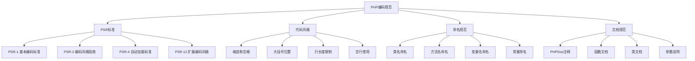

# 语法最佳实践

## 🎯 学习目标
- 掌握PHP编码规范和最佳实践
- 了解PSR标准和其他编码规范
- 学会编写清晰、可维护的PHP代码
- 掌握代码质量提升技巧

## 📚 编码规范概览

### PHP编码标准



### PSR标准对比

| 标准 | 版本 | 主要内容 | 状态 |
|------|------|----------|------|
| PSR-1 | 1.0 | 基本编码标准 | 已接受 |
| PSR-2 | 2.0 | 编码风格指南 | 已废弃 |
| PSR-4 | 1.0 | 自动加载标准 | 已接受 |
| PSR-12 | 1.0 | 扩展编码风格 | 已接受 |

## 🔧 代码风格规范

### 基本格式规范

#### 缩进和空格
```php
<?php
// 使用4个空格缩进，不使用制表符
class ExampleClass
{
    public function exampleMethod($parameter1, $parameter2)
    {
        if ($condition) {
            $variable = 'value';
            return $variable;
        }
        
        return false;
    }
}

// 运算符周围使用空格
$result = $variable1 + $variable2;
$condition = ($value > 0) && ($value < 100);

// 函数调用
$result = functionName($parameter1, $parameter2);
$array = [
    'key1' => 'value1',
    'key2' => 'value2',
];
?>
```

#### 大括号位置
```php
<?php
// 类和方法的大括号
class ExampleClass
{
    public function exampleMethod()
    {
        // 方法体
    }
}

// 控制结构的大括号
if ($condition) {
    // 代码块
} elseif ($anotherCondition) {
    // 代码块
} else {
    // 代码块
}

// 循环结构
for ($i = 0; $i < 10; $i++) {
    // 循环体
}

while ($condition) {
    // 循环体
}

foreach ($array as $key => $value) {
    // 循环体
}
?>
```

#### 行长度和换行
```php
<?php
// 行长度限制为120个字符
$longVariableName = 'This is a very long string that exceeds the recommended line length and should be broken into multiple lines for better readability';

// 长行换行
$longVariableName = 'This is a very long string that exceeds the recommended line length and should be broken into multiple lines for better readability';

// 函数参数换行
$result = functionName(
    $parameter1,
    $parameter2,
    $parameter3,
    $parameter4
);

// 数组换行
$array = [
    'key1' => 'value1',
    'key2' => 'value2',
    'key3' => 'value3',
    'key4' => 'value4',
];
?>
```

### 空行使用规范
```php
<?php
// 文件开头
<?php

// 类之间
class FirstClass
{
    // 类体
}

class SecondClass
{
    // 类体
}

// 方法之间
class ExampleClass
{
    public function firstMethod()
    {
        // 方法体
    }
    
    public function secondMethod()
    {
        // 方法体
    }
}

// 逻辑块之间
public function processData($data)
{
    // 数据验证
    if (empty($data)) {
        return false;
    }
    
    // 数据处理
    $processedData = $this->cleanData($data);
    
    // 数据保存
    return $this->saveData($processedData);
}
?>
```

## 📝 命名规范

### 类名命名
```php
<?php
// 类名使用PascalCase
class UserManager
{
    // 类体
}

class DatabaseConnection
{
    // 类体
}

class ApiResponseHandler
{
    // 类体
}

// 接口名
interface UserInterface
{
    // 接口体
}

interface DatabaseInterface
{
    // 接口体
}

// 抽象类名
abstract class AbstractController
{
    // 抽象类体
}

// 异常类名
class UserNotFoundException extends Exception
{
    // 异常类体
}
?>
```

### 方法名命名
```php
<?php
class UserService
{
    // 方法名使用camelCase
    public function getUserById($id)
    {
        // 方法体
    }
    
    public function createNewUser($userData)
    {
        // 方法体
    }
    
    public function updateUserProfile($userId, $profileData)
    {
        // 方法体
    }
    
    public function deleteUserAccount($userId)
    {
        // 方法体
    }
    
    // 布尔方法使用is/has/can前缀
    public function isUserActive($userId)
    {
        // 方法体
    }
    
    public function hasPermission($userId, $permission)
    {
        // 方法体
    }
    
    public function canAccessResource($userId, $resourceId)
    {
        // 方法体
    }
}
?>
```

### 变量名命名
```php
<?php
// 变量名使用camelCase
$userName = 'John Doe';
$userEmail = 'john@example.com';
$isUserActive = true;
$userPermissions = ['read', 'write'];

// 数组变量
$userList = [];
$userData = [];
$userSettings = [];

// 布尔变量使用is/has/can前缀
$isLoggedIn = false;
$hasPermission = true;
$canEdit = false;

// 常量使用UPPER_SNAKE_CASE
const MAX_LOGIN_ATTEMPTS = 3;
const DEFAULT_TIMEOUT = 30;
const API_BASE_URL = 'https://api.example.com';

// 私有属性使用下划线前缀
class User
{
    private $_userId;
    private $_userName;
    private $_userEmail;
}
?>
```

### 常量命名
```php
<?php
// 类常量使用UPPER_SNAKE_CASE
class DatabaseConfig
{
    const DEFAULT_HOST = 'localhost';
    const DEFAULT_PORT = 3306;
    const DEFAULT_CHARSET = 'utf8mb4';
    const MAX_CONNECTIONS = 100;
}

// 全局常量
define('APP_NAME', 'My Application');
define('APP_VERSION', '1.0.0');
define('DEBUG_MODE', true);

// 使用常量
$host = DatabaseConfig::DEFAULT_HOST;
$appName = APP_NAME;
?>
```

## 📖 文档规范

### PHPDoc注释
```php
<?php
/**
 * 用户管理类
 * 
 * 提供用户相关的所有操作，包括创建、更新、删除和查询用户信息。
 * 
 * @package App\Services
 * @author John Doe <john@example.com>
 * @version 1.0.0
 * @since 2024-01-01
 */
class UserService
{
    /**
     * 根据用户ID获取用户信息
     * 
     * @param int $userId 用户ID
     * @return array|null 用户信息数组，如果用户不存在返回null
     * @throws InvalidArgumentException 当用户ID无效时抛出
     * @throws DatabaseException 当数据库操作失败时抛出
     * 
     * @example
     * $user = $userService->getUserById(123);
     * if ($user) {
     *     echo $user['name'];
     * }
     */
    public function getUserById($userId)
    {
        // 方法实现
    }
    
    /**
     * 创建新用户
     * 
     * @param array $userData 用户数据
     * @param string $userData['name'] 用户姓名
     * @param string $userData['email'] 用户邮箱
     * @param string $userData['password'] 用户密码
     * @return int 新创建用户的ID
     * @throws ValidationException 当数据验证失败时抛出
     */
    public function createUser(array $userData)
    {
        // 方法实现
    }
}
?>
```

### 函数文档
```php
<?php
/**
 * 计算两个数的和
 * 
 * @param float $a 第一个数
 * @param float $b 第二个数
 * @return float 两数之和
 */
function add($a, $b)
{
    return $a + $b;
}

/**
 * 验证邮箱格式
 * 
 * @param string $email 邮箱地址
 * @return bool 验证结果，true表示格式正确
 */
function isValidEmail($email)
{
    return filter_var($email, FILTER_VALIDATE_EMAIL) !== false;
}

/**
 * 格式化日期
 * 
 * @param string|int $date 日期字符串或时间戳
 * @param string $format 输出格式，默认为'Y-m-d H:i:s'
 * @return string 格式化后的日期字符串
 */
function formatDate($date, $format = 'Y-m-d H:i:s')
{
    $timestamp = is_string($date) ? strtotime($date) : $date;
    return date($format, $timestamp);
}
?>
```

## 🎯 代码质量提升

### 代码组织
```php
<?php
// 文件结构示例
<?php
declare(strict_types=1);

namespace App\Services;

use App\Models\User;
use App\Exceptions\UserNotFoundException;
use App\Exceptions\ValidationException;

/**
 * 用户服务类
 */
class UserService
{
    // 常量定义
    const MAX_NAME_LENGTH = 100;
    const MIN_PASSWORD_LENGTH = 8;
    
    // 属性定义
    private $userRepository;
    private $validator;
    
    // 构造函数
    public function __construct($userRepository, $validator)
    {
        $this->userRepository = $userRepository;
        $this->validator = $validator;
    }
    
    // 公共方法
    public function getUserById($userId)
    {
        // 方法实现
    }
    
    public function createUser($userData)
    {
        // 方法实现
    }
    
    // 私有方法
    private function validateUserData($userData)
    {
        // 方法实现
    }
    
    private function hashPassword($password)
    {
        // 方法实现
    }
}
?>
```

### 错误处理
```php
<?php
class UserService
{
    /**
     * 获取用户信息
     * 
     * @param int $userId 用户ID
     * @return array 用户信息
     * @throws UserNotFoundException 用户不存在
     * @throws InvalidArgumentException 参数无效
     */
    public function getUserById($userId)
    {
        // 参数验证
        if (!is_int($userId) || $userId <= 0) {
            throw new InvalidArgumentException('用户ID必须是正整数');
        }
        
        try {
            $user = $this->userRepository->findById($userId);
            
            if (!$user) {
                throw new UserNotFoundException("用户ID {$userId} 不存在");
            }
            
            return $user;
        } catch (DatabaseException $e) {
            // 记录错误日志
            error_log("数据库错误: " . $e->getMessage());
            throw new UserServiceException("获取用户信息失败");
        }
    }
    
    /**
     * 创建用户
     * 
     * @param array $userData 用户数据
     * @return int 新用户ID
     * @throws ValidationException 数据验证失败
     */
    public function createUser(array $userData)
    {
        // 数据验证
        $this->validateUserData($userData);
        
        try {
            // 检查邮箱是否已存在
            if ($this->userRepository->emailExists($userData['email'])) {
                throw new ValidationException('邮箱地址已存在');
            }
            
            // 创建用户
            $userId = $this->userRepository->create($userData);
            
            return $userId;
        } catch (DatabaseException $e) {
            error_log("创建用户失败: " . $e->getMessage());
            throw new UserServiceException("创建用户失败");
        }
    }
}
?>
```

### 性能优化
```php
<?php
class UserService
{
    /**
     * 批量获取用户信息
     * 
     * @param array $userIds 用户ID数组
     * @return array 用户信息数组
     */
    public function getUsersByIds(array $userIds)
    {
        // 参数验证
        if (empty($userIds)) {
            return [];
        }
        
        // 去重和过滤
        $userIds = array_unique(array_filter($userIds, function($id) {
            return is_int($id) && $id > 0;
        }));
        
        if (empty($userIds)) {
            return [];
        }
        
        // 批量查询
        return $this->userRepository->findByIds($userIds);
    }
    
    /**
     * 缓存用户信息
     * 
     * @param int $userId 用户ID
     * @return array 用户信息
     */
    public function getCachedUser($userId)
    {
        $cacheKey = "user_{$userId}";
        
        // 尝试从缓存获取
        $user = $this->cache->get($cacheKey);
        
        if ($user === false) {
            // 缓存未命中，从数据库获取
            $user = $this->getUserById($userId);
            
            // 存入缓存，过期时间1小时
            $this->cache->set($cacheKey, $user, 3600);
        }
        
        return $user;
    }
}
?>
```

## 🔍 代码审查要点

### 常见问题检查
```php
<?php
// 1. 避免使用全局变量
// 不好的做法
$globalVar = 'value';
function badFunction() {
    global $globalVar; // 避免使用
    return $globalVar;
}

// 好的做法
function goodFunction($parameter) {
    return $parameter;
}

// 2. 避免使用短标签
// 不好的做法
<?= $variable ?>

// 好的做法
<?php echo $variable; ?>

// 3. 使用严格比较
// 不好的做法
if ($status == 'active') {
    // 代码
}

// 好的做法
if ($status === 'active') {
    // 代码
}

// 4. 避免使用可变变量
// 不好的做法
$varName = 'userName';
$$varName = 'John';

// 好的做法
$userName = 'John';

// 5. 使用类型声明
// 不好的做法
function calculate($a, $b) {
    return $a + $b;
}

// 好的做法
function calculate(float $a, float $b): float {
    return $a + $b;
}
?>
```

### 安全编码实践
```php
<?php
class UserService
{
    /**
     * 安全的用户登录
     * 
     * @param string $email 邮箱
     * @param string $password 密码
     * @return bool 登录结果
     */
    public function login($email, $password)
    {
        // 输入验证
        if (!filter_var($email, FILTER_VALIDATE_EMAIL)) {
            throw new InvalidArgumentException('邮箱格式无效');
        }
        
        if (empty($password)) {
            throw new InvalidArgumentException('密码不能为空');
        }
        
        // 防止SQL注入
        $user = $this->userRepository->findByEmail($email);
        
        if (!$user) {
            // 记录失败尝试
            $this->logFailedAttempt($email);
            return false;
        }
        
        // 验证密码
        if (!password_verify($password, $user['password_hash'])) {
            $this->logFailedAttempt($email);
            return false;
        }
        
        // 登录成功
        $this->logSuccessfulLogin($user['id']);
        return true;
    }
    
    /**
     * 安全的密码哈希
     * 
     * @param string $password 原始密码
     * @return string 哈希后的密码
     */
    public function hashPassword($password)
    {
        return password_hash($password, PASSWORD_DEFAULT);
    }
}
?>
```

## 📊 工具和自动化

### 代码检查工具
```bash
# PHP_CodeSniffer
composer require --dev squizlabs/php_codesniffer

# 检查代码
./vendor/bin/phpcs --standard=PSR12 src/

# 自动修复
./vendor/bin/phpcbf --standard=PSR12 src/

# PHPStan
composer require --dev phpstan/phpstan

# 静态分析
./vendor/bin/phpstan analyse src --level=6

# Psalm
composer require --dev vimeo/psalm

# 类型检查
./vendor/bin/psalm
```

### 配置文件示例
```xml
<!-- phpcs.xml -->
<?xml version="1.0"?>
<ruleset name="MyProject">
    <description>My Project Coding Standards</description>
    
    <file>src/</file>
    <file>tests/</file>
    
    <exclude-pattern>vendor/</exclude-pattern>
    <exclude-pattern>cache/</exclude-pattern>
    
    <rule ref="PSR12"/>
    
    <rule ref="Generic.Files.LineLength">
        <properties>
            <property name="lineLimit" value="120"/>
            <property name="absoluteLineLimit" value="140"/>
        </properties>
    </rule>
</ruleset>
```

```neon
# phpstan.neon
parameters:
    level: 6
    paths:
        - src
    excludePaths:
        - vendor
        - tests
    ignoreErrors:
        - '#Call to an undefined method#'
        - '#Access to an undefined property#'
    checkMissingIterableValueType: false
    checkGenericClassInNonGenericObjectType: false
    reportUnmatchedIgnoredErrors: false
```

## 🎓 学习建议

### 费曼学习法应用
1. **选择概念**: 选择编码规范或最佳实践概念
2. **简化解释**: 用简单语言解释编码规范的重要性
3. **识别盲点**: 发现理解不深入的地方
4. **重新学习**: 针对盲点进行深入学习

### 刻意练习重点
1. **规范遵循**: 严格按照PSR标准编写代码
2. **工具使用**: 熟练使用代码检查工具
3. **代码审查**: 参与代码审查，学习他人经验
4. **持续改进**: 不断优化代码质量和可读性

## 🔗 相关链接
- [[01-变量与常量|变量与常量]]
- [[02-数据类型详解|数据类型详解]]
- [[03-运算符与表达式|运算符与表达式]]
- [[04-类型转换与判断|类型转换与判断]]
- [[01-基础认知层/控制结构/01-条件语句|条件语句]]
