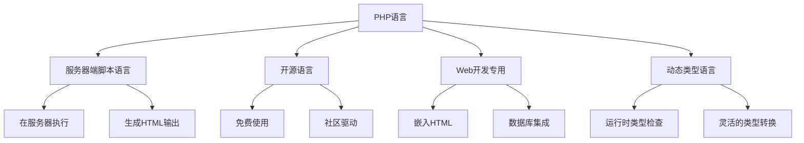
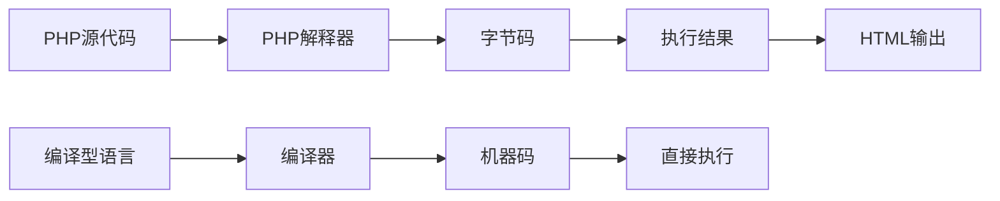
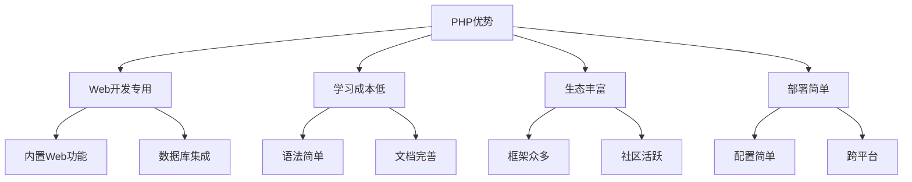
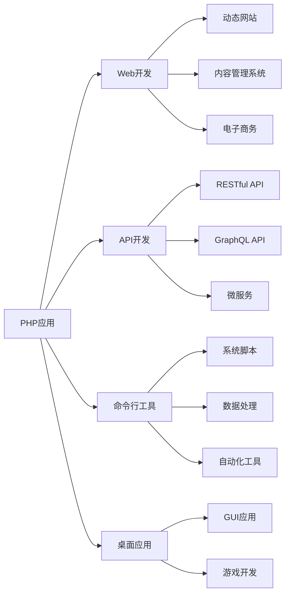
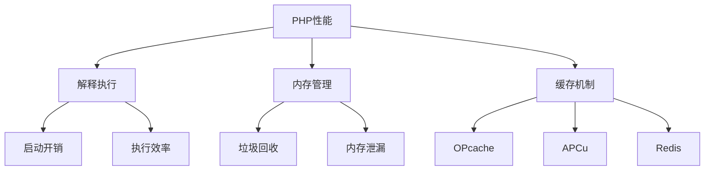

# PHP语言特性

## 🎯 学习目标
- 理解PHP语言的本质特征
- 掌握PHP与其他语言的区别
- 了解PHP的发展历程和版本特性
- 建立PHP语言的整体认知框架

## 📚 核心概念

### PHP语言定义
PHP（PHP: Hypertext Preprocessor）是一种开源的服务器端脚本语言，专门用于Web开发。



## 🔍 语言特性详解

### 1. 动态类型语言
PHP是动态类型语言，变量类型在运行时确定。

```php
<?php
// 变量类型动态变化
$var = 42;        // 整数
$var = "Hello";   // 字符串
$var = 3.14;      // 浮点数
$var = true;      // 布尔值
$var = [1, 2, 3]; // 数组
?>
```

**特点**:
- 变量无需声明类型
- 类型在赋值时确定
- 支持隐式类型转换
- 灵活性高，但需要谨慎使用

### 2. 弱类型语言
PHP是弱类型语言，支持宽松的类型转换。

```php
<?php
// 弱类型转换示例
$num = "123";
$result = $num + 5;  // 自动转换为整数 128

$str = "Hello" . 42; // 自动转换为字符串 "Hello42"

$bool = "false";
if ($bool) {         // 非空字符串为true
    echo "This will execute";
}
?>
```

**类型转换规则**:
| 原类型 | 目标类型 | 转换规则 |
|--------|----------|----------|
| 字符串 | 整数 | 提取数字部分 |
| 字符串 | 浮点数 | 提取数字部分 |
| 整数 | 字符串 | 直接转换 |
| 布尔值 | 整数 | true→1, false→0 |

### 3. 解释型语言
PHP是解释型语言，代码在运行时解释执行。



**解释型语言特点**:
- 开发效率高
- 跨平台性好
- 运行时性能相对较低
- 支持动态代码执行

### 4. 服务器端语言
PHP在服务器端执行，生成HTML输出。

```php
<?php
// 服务器端处理
$user = $_POST['username'];
$password = $_POST['password'];

// 数据库查询
$result = mysqli_query($connection, "SELECT * FROM users WHERE username='$user'");

// 生成HTML响应
if ($result) {
    echo "<h1>Welcome, $user!</h1>";
} else {
    echo "<h1>Login failed!</h1>";
}
?>
```

**服务器端执行流程**:
1. 客户端发送HTTP请求
2. 服务器接收请求
3. PHP解释器执行脚本
4. 生成HTML响应
5. 返回给客户端

## 🚀 PHP版本演进

### 主要版本特性对比

| 版本 | 发布时间 | 主要特性 | 状态 |
|------|----------|----------|------|
| PHP 7.4 | 2019-11 | 类型属性、箭头函数 | 维护中 |
| PHP 8.0 | 2020-11 | JIT编译器、联合类型 | 维护中 |
| PHP 8.1 | 2021-11 | 枚举、只读属性 | 活跃开发 |
| PHP 8.2 | 2022-11 | 只读类、随机扩展 | 最新稳定版 |
| PHP 8.3 | 2023-11 | 类型化类常量、覆盖属性 | 最新版本 |

### PHP 8+ 新特性概览

```php
<?php
// PHP 8.0+ 新特性示例

// 1. 联合类型
function processId(int|string $id): void {
    echo "Processing ID: $id\n";
}

// 2. 命名参数
function createUser(string $name, int $age = 18, string $email = ''): array {
    return compact('name', 'age', 'email');
}

$user = createUser(name: 'John', email: 'john@example.com');

// 3. 匹配表达式 (PHP 8.0)
$status = match($httpCode) {
    200 => 'OK',
    404 => 'Not Found',
    500 => 'Server Error',
    default => 'Unknown'
};

// 4. 枚举 (PHP 8.1)
enum Status: string {
    case PENDING = 'pending';
    case APPROVED = 'approved';
    case REJECTED = 'rejected';
}

// 5. 只读属性 (PHP 8.1)
class User {
    public function __construct(
        public readonly string $name,
        public readonly int $age
    ) {}
}
?>
```

## 🔄 PHP与其他语言对比

### 语言特性对比表

| 特性 | PHP | JavaScript | Python | Java |
|------|-----|------------|--------|------|
| 类型系统 | 动态弱类型 | 动态弱类型 | 动态强类型 | 静态强类型 |
| 执行方式 | 解释型 | 解释型 | 解释型 | 编译型 |
| 主要用途 | Web开发 | 全栈开发 | 通用编程 | 企业应用 |
| 学习曲线 | 中等 | 简单 | 简单 | 复杂 |
| 性能 | 中等 | 中等 | 中等 | 高 |

### PHP优势分析



**PHP核心优势**:
1. **Web开发专用**: 专为Web开发设计，内置HTTP处理
2. **学习成本低**: 语法简单，入门容易
3. **生态丰富**: 框架、库、工具众多
4. **部署简单**: 配置简单，跨平台支持
5. **社区活跃**: 大量教程、文档、社区支持

## 🎯 应用场景

### PHP主要应用领域



### 典型应用案例

**Web应用**:
- WordPress (内容管理系统)
- Drupal (企业级CMS)
- Magento (电子商务平台)

**框架应用**:
- Laravel (现代Web框架)
- Symfony (企业级框架)
- CodeIgniter (轻量级框架)

**API服务**:
- Facebook API
- Twitter API
- 各种RESTful服务

## 🔧 开发环境要求

### 基本环境配置

```php
<?php
// 检查PHP环境
echo "PHP版本: " . PHP_VERSION . "\n";
echo "操作系统: " . PHP_OS . "\n";
echo "Web服务器: " . $_SERVER['SERVER_SOFTWARE'] . "\n";

// 检查扩展
$extensions = ['mysqli', 'pdo', 'json', 'curl'];
foreach ($extensions as $ext) {
    echo $ext . ": " . (extension_loaded($ext) ? '已安装' : '未安装') . "\n";
}
?>
```

### 推荐开发环境

| 组件 | 推荐版本 | 说明 |
|------|----------|------|
| PHP | 8.2+ | 最新稳定版 |
| Web服务器 | Apache 2.4+ / Nginx 1.18+ | 生产环境推荐 |
| 数据库 | MySQL 8.0+ / PostgreSQL 13+ | 关系型数据库 |
| 缓存 | Redis 6.0+ / Memcached | 性能优化 |
| 开发工具 | PhpStorm / VS Code | IDE选择 |

## 📊 性能特性

### PHP性能特点



**性能优化要点**:
1. **使用OPcache**: 缓存编译后的字节码
2. **合理使用内存**: 避免内存泄漏
3. **数据库优化**: 使用索引和查询优化
4. **缓存策略**: 使用Redis等缓存系统

## 🎓 学习建议

### 费曼学习法应用
1. **选择概念**: 选择PHP语言特性中的核心概念
2. **简化解释**: 用简单语言解释动态类型、弱类型等概念
3. **识别盲点**: 发现理解不深入的地方
4. **重新学习**: 针对盲点进行深入学习

### 刻意练习重点
1. **类型转换**: 练习各种类型转换场景
2. **版本特性**: 熟悉不同版本的特性差异
3. **环境配置**: 熟练掌握开发环境搭建
4. **性能测试**: 了解PHP性能特点和优化方法

## 🔗 相关链接
- [[02-运行环境配置|运行环境配置]]
- [[03-PHP-FPM详解|PHP-FPM详解]]
- [[04-Web服务器集成|Web服务器集成]]
- [[05-开发工具配置|开发工具配置]]
- [[01-基础认知层/语法基础/01-变量与常量|变量与常量]]
- [[01-基础认知层/语法基础/02-数据类型详解|数据类型详解]]
