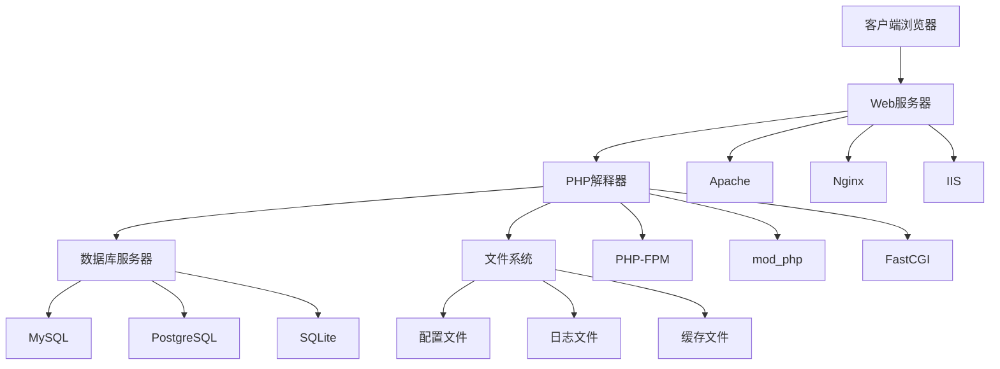

# 运行环境配置

## 🎯 学习目标
- 掌握PHP运行环境的搭建方法
- 了解不同操作系统的配置差异
- 学会配置Web服务器和PHP的集成
- 掌握开发环境的最佳实践

## 🏗️ 环境架构概览

### PHP运行环境组成



## 💻 操作系统环境配置

### Windows环境配置

#### 方式一：XAMPP集成环境
```bash
# 下载和安装XAMPP
# 1. 访问 https://www.apachefriends.org/
# 2. 下载Windows版本
# 3. 运行安装程序
# 4. 启动Apache和MySQL服务
```

**XAMPP目录结构**:
```
xampp/
├── apache/          # Apache服务器
├── mysql/           # MySQL数据库
├── php/             # PHP解释器
├── htdocs/          # Web根目录
├── phpmyadmin/      # 数据库管理工具
└── xampp-control.exe # 控制面板
```

#### 方式二：手动安装
```bash
# 1. 下载PHP
# 访问 https://windows.php.net/download/
# 下载Thread Safe版本

# 2. 解压到 C:\php
# 3. 配置环境变量
# 将 C:\php 添加到 PATH

# 4. 配置php.ini
# 复制 php.ini-development 为 php.ini
# 修改配置：
extension_dir = "C:\php\ext"
extension=mysqli
extension=pdo_mysql
```

### macOS环境配置

#### 方式一：MAMP集成环境
```bash
# 下载MAMP
# 访问 https://www.mamp.info/
# 安装并启动服务
```

#### 方式二：Homebrew安装
```bash
# 安装Homebrew
/bin/bash -c "$(curl -fsSL https://raw.githubusercontent.com/Homebrew/install/HEAD/install.sh)"

# 安装PHP
brew install php

# 安装MySQL
brew install mysql

# 启动服务
brew services start mysql
```

### Linux环境配置

#### Ubuntu/Debian系统
```bash
# 更新包列表
sudo apt update

# 安装Apache
sudo apt install apache2

# 安装PHP
sudo apt install php php-mysql php-curl php-gd php-mbstring php-xml php-zip

# 安装MySQL
sudo apt install mysql-server

# 启动服务
sudo systemctl start apache2
sudo systemctl start mysql
sudo systemctl enable apache2
sudo systemctl enable mysql
```

#### CentOS/RHEL系统
```bash
# 安装EPEL仓库
sudo yum install epel-release

# 安装Apache
sudo yum install httpd

# 安装PHP
sudo yum install php php-mysql php-curl php-gd php-mbstring php-xml

# 安装MySQL
sudo yum install mysql-server

# 启动服务
sudo systemctl start httpd
sudo systemctl start mysqld
sudo systemctl enable httpd
sudo systemctl enable mysqld
```

## 🌐 Web服务器配置

### Apache配置

#### 基本配置
```apache
# httpd.conf 或 apache2.conf
LoadModule php_module modules/libphp.so
AddType application/x-httpd-php .php
DirectoryIndex index.php index.html

# 虚拟主机配置
<VirtualHost *:80>
    ServerName localhost
    DocumentRoot /var/www/html
    <Directory /var/www/html>
        AllowOverride All
        Require all granted
    </Directory>
</VirtualHost>
```

#### .htaccess配置
```apache
# 启用重写模块
RewriteEngine On

# URL重写规则
RewriteCond %{REQUEST_FILENAME} !-f
RewriteCond %{REQUEST_FILENAME} !-d
RewriteRule ^(.*)$ index.php [QSA,L]

# 安全配置
Options -Indexes
ServerSignature Off

# 缓存配置
<IfModule mod_expires.c>
    ExpiresActive On
    ExpiresByType text/css "access plus 1 month"
    ExpiresByType application/javascript "access plus 1 month"
</IfModule>
```

### Nginx配置

#### 基本配置
```nginx
server {
    listen 80;
    server_name localhost;
    root /var/www/html;
    index index.php index.html;

    location / {
        try_files $uri $uri/ /index.php?$query_string;
    }

    location ~ \.php$ {
        fastcgi_pass 127.0.0.1:9000;
        fastcgi_index index.php;
        fastcgi_param SCRIPT_FILENAME $document_root$fastcgi_script_name;
        include fastcgi_params;
    }

    location ~ /\.ht {
        deny all;
    }
}
```

#### PHP-FPM配置
```ini
; /etc/php/8.2/fpm/pool.d/www.conf
[www]
user = www-data
group = www-data
listen = 127.0.0.1:9000
pm = dynamic
pm.max_children = 50
pm.start_servers = 5
pm.min_spare_servers = 5
pm.max_spare_servers = 35
```

## ⚙️ PHP配置文件

### php.ini核心配置

```ini
; 基本配置
engine = On
short_open_tag = Off
precision = 14
output_buffering = 4096
zlib.output_compression = Off

; 错误报告
error_reporting = E_ALL
display_errors = On
display_startup_errors = On
log_errors = On
error_log = /var/log/php_errors.log

; 内存和时间限制
memory_limit = 128M
max_execution_time = 30
max_input_time = 60

; 文件上传
file_uploads = On
upload_max_filesize = 2M
max_file_uploads = 20
post_max_size = 8M

; 会话配置
session.save_handler = files
session.save_path = "/tmp"
session.use_cookies = 1
session.cookie_lifetime = 0
session.cookie_httponly = 1

; 扩展配置
extension_dir = "/usr/lib/php/20220829"
extension=mysqli
extension=pdo_mysql
extension=curl
extension=gd
extension=mbstring
extension=xml
extension=zip
```

### 开发环境vs生产环境配置

| 配置项 | 开发环境 | 生产环境 | 说明 |
|--------|----------|----------|------|
| display_errors | On | Off | 错误显示 |
| error_reporting | E_ALL | E_ERROR | 错误级别 |
| log_errors | On | On | 错误日志 |
| opcache.enable | Off | On | OPcache |
| opcache.validate_timestamps | On | Off | 时间戳验证 |
| session.cookie_secure | Off | On | 安全Cookie |

## 🐳 Docker环境配置

### Docker Compose配置
```yaml
version: '3.8'
services:
  web:
    image: php:8.2-apache
    ports:
      - "80:80"
    volumes:
      - ./src:/var/www/html
      - ./php.ini:/usr/local/etc/php/php.ini
    depends_on:
      - db
    environment:
      - APACHE_DOCUMENT_ROOT=/var/www/html

  db:
    image: mysql:8.0
    environment:
      MYSQL_ROOT_PASSWORD: rootpassword
      MYSQL_DATABASE: myapp
      MYSQL_USER: user
      MYSQL_PASSWORD: password
    volumes:
      - mysql_data:/var/lib/mysql
    ports:
      - "3306:3306"

  phpmyadmin:
    image: phpmyadmin/phpmyadmin
    ports:
      - "8080:80"
    environment:
      PMA_HOST: db
      PMA_USER: root
      PMA_PASSWORD: rootpassword
    depends_on:
      - db

volumes:
  mysql_data:
```

### Dockerfile配置
```dockerfile
FROM php:8.2-apache

# 安装系统依赖
RUN apt-get update && apt-get install -y \
    libzip-dev \
    libpng-dev \
    libjpeg-dev \
    libfreetype6-dev \
    && docker-php-ext-configure gd --with-freetype --with-jpeg \
    && docker-php-ext-install -j$(nproc) gd

# 安装PHP扩展
RUN docker-php-ext-install mysqli pdo pdo_mysql zip

# 配置Apache
RUN a2enmod rewrite
COPY apache-config.conf /etc/apache2/sites-available/000-default.conf

# 复制应用代码
COPY . /var/www/html

# 设置权限
RUN chown -R www-data:www-data /var/www/html
```

## 🔧 开发工具配置

### VS Code配置

#### 扩展推荐
```json
{
  "recommendations": [
    "bmewburn.vscode-intelephense-client",
    "xdebug.php-debug",
    "bradlc.vscode-tailwindcss",
    "formulahendry.auto-rename-tag",
    "ms-vscode.vscode-json"
  ]
}
```

#### 工作区配置
```json
{
  "php.validate.executablePath": "/usr/bin/php",
  "php.suggest.basic": false,
  "intelephense.files.maxSize": 5000000,
  "intelephense.completion.triggerParameterHints": true,
  "intelephense.format.enable": true
}
```

### PhpStorm配置

#### 项目设置
1. **PHP解释器**: 配置PHP 8.2+解释器
2. **Web服务器**: 配置本地Web服务器
3. **数据库**: 配置MySQL连接
4. **版本控制**: 配置Git集成
5. **代码检查**: 启用PHP_CodeSniffer

#### 调试配置
```xml
<!-- .idea/php.xml -->
<component name="PhpProjectSharedConfiguration">
  <option name="suggestChangeDefaultLanguageLevel" value="false" />
  <option name="languageLevel" value="PHP 8.2" />
</component>
```

## 📊 环境检测脚本

### PHP环境信息检测
```php
<?php
// 环境检测脚本
echo "<h1>PHP环境信息</h1>";

// 基本信息
echo "<h2>基本信息</h2>";
echo "PHP版本: " . PHP_VERSION . "<br>";
echo "操作系统: " . PHP_OS . "<br>";
echo "服务器软件: " . $_SERVER['SERVER_SOFTWARE'] . "<br>";
echo "文档根目录: " . $_SERVER['DOCUMENT_ROOT'] . "<br>";

// 配置信息
echo "<h2>配置信息</h2>";
echo "内存限制: " . ini_get('memory_limit') . "<br>";
echo "执行时间限制: " . ini_get('max_execution_time') . "秒<br>";
echo "文件上传限制: " . ini_get('upload_max_filesize') . "<br>";
echo "POST数据限制: " . ini_get('post_max_size') . "<br>";

// 扩展信息
echo "<h2>已安装扩展</h2>";
$extensions = get_loaded_extensions();
sort($extensions);
foreach ($extensions as $ext) {
    echo $ext . "<br>";
}

// 数据库连接测试
echo "<h2>数据库连接测试</h2>";
try {
    $pdo = new PDO('mysql:host=localhost', 'root', '');
    echo "MySQL连接成功<br>";
} catch (PDOException $e) {
    echo "MySQL连接失败: " . $e->getMessage() . "<br>";
}

// 文件权限测试
echo "<h2>文件权限测试</h2>";
$testFile = 'test_write.txt';
if (file_put_contents($testFile, 'test')) {
    echo "文件写入权限正常<br>";
    unlink($testFile);
} else {
    echo "文件写入权限异常<br>";
}
?>
```

## 🚀 性能优化配置

### OPcache配置
```ini
; OPcache配置
opcache.enable=1
opcache.enable_cli=1
opcache.memory_consumption=128
opcache.interned_strings_buffer=8
opcache.max_accelerated_files=4000
opcache.revalidate_freq=2
opcache.fast_shutdown=1
opcache.validate_timestamps=1
```

### 生产环境优化
```ini
; 生产环境配置
display_errors = Off
display_startup_errors = Off
log_errors = On
error_log = /var/log/php_errors.log

; 性能优化
opcache.enable = 1
opcache.validate_timestamps = 0
realpath_cache_size = 4096K
realpath_cache_ttl = 600

; 安全配置
expose_php = Off
allow_url_fopen = Off
allow_url_include = Off
```

## 🔍 故障排除

### 常见问题及解决方案

| 问题 | 可能原因 | 解决方案 |
|------|----------|----------|
| PHP页面显示源代码 | Web服务器未配置PHP | 检查Apache/Nginx配置 |
| 数据库连接失败 | 数据库服务未启动 | 启动MySQL服务 |
| 文件上传失败 | 权限或大小限制 | 检查php.ini配置 |
| 扩展未加载 | 扩展未安装 | 安装相应扩展 |
| 性能问题 | 配置不当 | 优化php.ini配置 |

### 日志文件位置
```bash
# Apache错误日志
/var/log/apache2/error.log

# Nginx错误日志
/var/log/nginx/error.log

# PHP错误日志
/var/log/php_errors.log

# MySQL错误日志
/var/log/mysql/error.log
```

## 🎓 学习建议

### 实践练习
1. **环境搭建**: 在不同操作系统上搭建PHP环境
2. **配置优化**: 根据需求调整php.ini配置
3. **性能测试**: 使用工具测试环境性能
4. **故障排除**: 模拟常见问题并解决

### 最佳实践
1. **版本管理**: 使用Docker管理不同版本
2. **配置分离**: 开发和生产环境配置分离
3. **安全配置**: 生产环境安全配置
4. **监控日志**: 定期检查错误日志

## 🔗 相关链接
- [[01-PHP语言特性|PHP语言特性]]
- [[03-PHP-FPM详解|PHP-FPM详解]]
- [[04-Web服务器集成|Web服务器集成]]
- [[05-开发工具配置|开发工具配置]]
- [[01-基础认知层/语法基础/01-变量与常量|变量与常量]]
