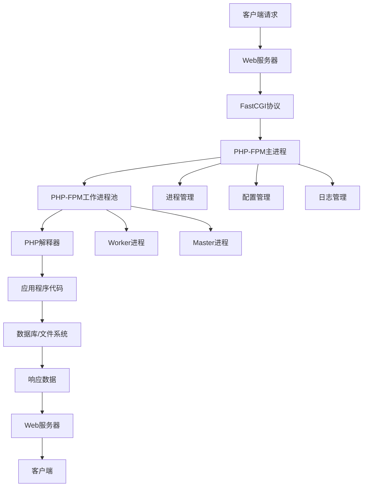
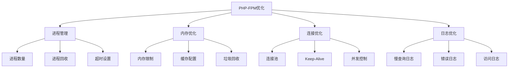

# PHP-FPM详解

## 🎯 学习目标
- 理解PHP-FPM的工作原理和架构
- 掌握PHP-FPM的配置和优化方法
- 了解PHP-FPM与Web服务器的集成方式
- 学会监控和调试PHP-FPM性能

## 🏗️ PHP-FPM架构概览

### 什么是PHP-FPM
PHP-FPM（FastCGI Process Manager）是PHP的FastCGI进程管理器，用于管理PHP进程池。



### PHP-FPM vs mod_php对比

| 特性 | PHP-FPM | mod_php |
|------|---------|---------|
| 进程模型 | 独立进程池 | Apache模块 |
| 内存使用 | 更高效 | 较高 |
| 扩展性 | 优秀 | 一般 |
| 配置灵活性 | 高 | 低 |
| 适用场景 | 高并发 | 简单应用 |

## ⚙️ PHP-FPM配置详解

### 主配置文件结构
```ini
; /etc/php/8.2/fpm/php-fpm.conf
[global]
pid = /run/php/php8.2-fpm.pid
error_log = /var/log/php8.2-fpm.log
log_level = notice
emergency_restart_threshold = 0
emergency_restart_interval = 0
process_control_timeout = 0
daemonize = yes

; 包含池配置
include=/etc/php/8.2/fpm/pool.d/*.conf
```

### 进程池配置
```ini
; /etc/php/8.2/fpm/pool.d/www.conf
[www]
; 用户和组
user = www-data
group = www-data

; 监听配置
listen = 127.0.0.1:9000
listen.backlog = 511
listen.owner = www-data
listen.group = www-data
listen.mode = 0660

; 进程管理
pm = dynamic
pm.max_children = 50
pm.start_servers = 5
pm.min_spare_servers = 5
pm.max_spare_servers = 35
pm.max_requests = 1000

; 性能调优
pm.process_idle_timeout = 10s
request_terminate_timeout = 0
request_slowlog_timeout = 0
slowlog = /var/log/php8.2-fpm-slow.log

; 环境变量
env[HOSTNAME] = $HOSTNAME
env[PATH] = /usr/local/bin:/usr/bin:/bin
env[TMP] = /tmp
env[TMPDIR] = /tmp
env[TEMP] = /tmp
```

### 进程管理模式

#### 1. Static模式
```ini
pm = static
pm.max_children = 20
```
**特点**:
- 固定数量的子进程
- 内存使用稳定
- 适合高负载场景

#### 2. Dynamic模式
```ini
pm = dynamic
pm.max_children = 50
pm.start_servers = 5
pm.min_spare_servers = 5
pm.max_spare_servers = 35
```
**特点**:
- 动态调整进程数量
- 根据负载自动伸缩
- 适合负载变化场景

#### 3. Ondemand模式
```ini
pm = ondemand
pm.max_children = 20
pm.process_idle_timeout = 10s
```
**特点**:
- 按需创建进程
- 空闲时自动回收
- 适合低负载场景

## 🔧 性能优化配置

### 进程池优化参数



### 优化配置示例
```ini
; 高性能配置
[www]
; 进程管理优化
pm = dynamic
pm.max_children = 100
pm.start_servers = 20
pm.min_spare_servers = 10
pm.max_spare_servers = 30
pm.max_requests = 1000

; 超时优化
request_terminate_timeout = 30s
request_slowlog_timeout = 5s

; 内存优化
php_admin_value[memory_limit] = 256M
php_admin_value[max_execution_time] = 30

; 缓存优化
php_admin_value[opcache.enable] = 1
php_admin_value[opcache.memory_consumption] = 128
php_admin_value[opcache.max_accelerated_files] = 4000

; 日志优化
slowlog = /var/log/php-fpm-slow.log
catch_workers_output = yes
```

### 内存使用优化
```ini
; 内存限制配置
php_admin_value[memory_limit] = 128M
php_admin_value[max_input_vars] = 3000
php_admin_value[post_max_size] = 32M
php_admin_value[upload_max_filesize] = 32M

; 垃圾回收优化
php_admin_value[zend.enable_gc] = 1
php_admin_value[gc_probability] = 1
php_admin_value[gc_divisor] = 1000
```

## 📊 监控和调试

### 状态页面配置
```ini
; 启用状态页面
pm.status_path = /fpm-status
ping.path = /fpm-ping
ping.response = pong
```

### 状态页面访问
```php
<?php
// fpm-status.php
if ($_SERVER['REQUEST_URI'] === '/fpm-status') {
    // 显示FPM状态信息
    echo "PHP-FPM Status\n";
    echo "Active processes: " . shell_exec('ps aux | grep php-fpm | grep -v grep | wc -l') . "\n";
    echo "Memory usage: " . shell_exec('ps aux | grep php-fpm | awk \'{sum+=$6} END {print sum/1024 " MB"}\'') . "\n";
}
?>
```

### 性能监控脚本
```bash
#!/bin/bash
# fpm-monitor.sh

echo "PHP-FPM Performance Monitor"
echo "=========================="

# 进程数量
echo "Active processes:"
ps aux | grep php-fpm | grep -v grep | wc -l

# 内存使用
echo "Memory usage:"
ps aux | grep php-fpm | awk '{sum+=$6} END {print sum/1024 " MB"}'

# CPU使用
echo "CPU usage:"
ps aux | grep php-fpm | awk '{sum+=$3} END {print sum "%"}'

# 连接数
echo "Active connections:"
netstat -an | grep :9000 | grep ESTABLISHED | wc -l

# 慢查询日志
echo "Slow queries (last 10):"
tail -10 /var/log/php-fpm-slow.log
```

### 日志分析
```bash
# 分析慢查询日志
grep "slow" /var/log/php-fpm-slow.log | \
awk '{print $NF}' | \
sort | uniq -c | \
sort -nr | head -10

# 分析错误日志
grep "ERROR" /var/log/php-fpm.log | \
awk '{print $1, $2, $NF}' | \
sort | uniq -c | \
sort -nr
```

## 🔄 与Web服务器集成

### Nginx集成配置
```nginx
server {
    listen 80;
    server_name example.com;
    root /var/www/html;
    index index.php index.html;

    location / {
        try_files $uri $uri/ /index.php?$query_string;
    }

    location ~ \.php$ {
        fastcgi_pass 127.0.0.1:9000;
        fastcgi_index index.php;
        fastcgi_param SCRIPT_FILENAME $document_root$fastcgi_script_name;
        include fastcgi_params;
        
        # 性能优化
        fastcgi_buffer_size 128k;
        fastcgi_buffers 4 256k;
        fastcgi_busy_buffers_size 256k;
        fastcgi_temp_file_write_size 256k;
        fastcgi_connect_timeout 60s;
        fastcgi_send_timeout 60s;
        fastcgi_read_timeout 60s;
    }

    # 状态页面
    location ~ ^/(fpm-status|fpm-ping)$ {
        fastcgi_pass 127.0.0.1:9000;
        fastcgi_param SCRIPT_FILENAME $document_root$fastcgi_script_name;
        include fastcgi_params;
        allow 127.0.0.1;
        deny all;
    }
}
```

### Apache集成配置
```apache
# 使用mod_proxy_fcgi
LoadModule proxy_module modules/mod_proxy.so
LoadModule proxy_fcgi_module modules/mod_proxy_fcgi.so

<VirtualHost *:80>
    ServerName example.com
    DocumentRoot /var/www/html
    
    # PHP文件处理
    <FilesMatch \.php$>
        SetHandler "proxy:fcgi://127.0.0.1:9000"
    </FilesMatch>
    
    # 性能优化
    ProxyPassMatch ^/(.*\.php)$ fcgi://127.0.0.1:9000/var/www/html/$1
    ProxyTimeout 60
</VirtualHost>
```

## 🚀 高可用配置

### 多进程池配置
```ini
; 主进程池
[www]
user = www-data
group = www-data
listen = 127.0.0.1:9000
pm = dynamic
pm.max_children = 50

; 管理后台进程池
[admin]
user = www-data
group = www-data
listen = 127.0.0.1:9001
pm = static
pm.max_children = 10
php_admin_value[memory_limit] = 512M

; API服务进程池
[api]
user = www-data
group = www-data
listen = 127.0.0.1:9002
pm = dynamic
pm.max_children = 100
pm.start_servers = 20
pm.min_spare_servers = 10
pm.max_spare_servers = 30
```

### 负载均衡配置
```nginx
upstream php_backend {
    server 127.0.0.1:9000 weight=3;
    server 127.0.0.1:9001 weight=2;
    server 127.0.0.1:9002 weight=1;
    keepalive 32;
}

server {
    location ~ \.php$ {
        fastcgi_pass php_backend;
        fastcgi_keep_conn on;
        fastcgi_param SCRIPT_FILENAME $document_root$fastcgi_script_name;
        include fastcgi_params;
    }
}
```

## 🔍 故障排除

### 常见问题及解决方案

| 问题 | 症状 | 原因 | 解决方案 |
|------|------|------|----------|
| 502 Bad Gateway | 请求失败 | FPM进程崩溃 | 检查FPM日志，重启服务 |
| 504 Gateway Timeout | 请求超时 | 处理时间过长 | 调整超时设置，优化代码 |
| 内存不足 | 进程被杀死 | 内存泄漏 | 增加内存限制，检查代码 |
| 进程数不足 | 响应缓慢 | 并发过高 | 增加进程数，优化配置 |

### 调试命令
```bash
# 检查FPM状态
systemctl status php8.2-fpm

# 查看进程
ps aux | grep php-fpm

# 查看端口
netstat -tlnp | grep 9000

# 测试连接
telnet 127.0.0.1 9000

# 查看日志
tail -f /var/log/php8.2-fpm.log
tail -f /var/log/php-fpm-slow.log
```

### 性能测试
```bash
# 使用ab测试
ab -n 1000 -c 10 http://localhost/

# 使用wrk测试
wrk -t12 -c400 -d30s http://localhost/

# 监控系统资源
htop
iotop
```

## 📈 性能调优建议

### 生产环境优化
```ini
; 生产环境配置
[www]
; 进程管理
pm = dynamic
pm.max_children = 100
pm.start_servers = 20
pm.min_spare_servers = 10
pm.max_spare_servers = 30
pm.max_requests = 1000

; 超时设置
request_terminate_timeout = 30s
request_slowlog_timeout = 5s

; 内存优化
php_admin_value[memory_limit] = 256M
php_admin_value[opcache.enable] = 1
php_admin_value[opcache.memory_consumption] = 128

; 安全设置
php_admin_value[expose_php] = Off
php_admin_value[allow_url_fopen] = Off
```

### 监控指标
- **进程数量**: 活跃进程数、空闲进程数
- **内存使用**: 总内存使用、单进程内存
- **响应时间**: 平均响应时间、慢查询数量
- **并发连接**: 当前连接数、最大连接数

## 🎓 学习建议

### 实践练习
1. **配置优化**: 根据应用特点调整FPM配置
2. **性能测试**: 使用工具测试不同配置的性能
3. **监控设置**: 配置监控和告警系统
4. **故障模拟**: 模拟常见故障并练习解决

### 最佳实践
1. **配置分离**: 不同应用使用不同进程池
2. **资源监控**: 定期监控资源使用情况
3. **日志分析**: 定期分析慢查询和错误日志
4. **版本管理**: 使用配置管理工具管理配置

## 🔗 相关链接
- [[01-PHP语言特性|PHP语言特性]]
- [[02-运行环境配置|运行环境配置]]
- [[04-Web服务器集成|Web服务器集成]]
- [[05-开发工具配置|开发工具配置]]
- [[03-应用实践层/性能优化/01-代码优化技巧|代码优化技巧]]
