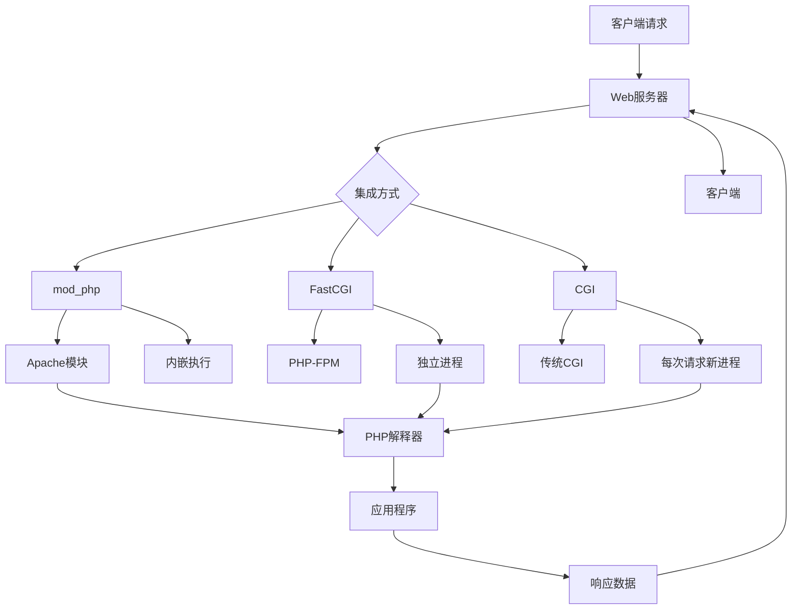

# Web服务器集成

## 🎯 学习目标
- 理解PHP与Web服务器的集成原理
- 掌握Apache和Nginx的PHP集成配置
- 了解不同集成方式的优缺点
- 学会优化Web服务器与PHP的协作性能

## 🏗️ 集成架构概览

### Web服务器与PHP集成方式



### 集成方式对比

| 集成方式 | 性能 | 内存使用 | 扩展性 | 配置复杂度 | 适用场景 |
|----------|------|----------|--------|------------|----------|
| mod_php | 中等 | 高 | 低 | 简单 | 小型应用 |
| FastCGI | 高 | 中等 | 高 | 中等 | 生产环境 |
| CGI | 低 | 低 | 高 | 简单 | 开发测试 |

## 🔧 Apache集成配置

### mod_php集成

#### 基本配置
```apache
# httpd.conf
LoadModule php_module modules/libphp.so
AddType application/x-httpd-php .php
DirectoryIndex index.php index.html

# 虚拟主机配置
<VirtualHost *:80>
    ServerName localhost
    DocumentRoot /var/www/html
    
    <Directory /var/www/html>
        AllowOverride All
        Require all granted
    </Directory>
    
    # PHP配置
    php_admin_value upload_max_filesize "32M"
    php_admin_value post_max_size "32M"
    php_admin_value memory_limit "128M"
</VirtualHost>
```

#### 性能优化配置
```apache
# 启用压缩
LoadModule deflate_module modules/mod_deflate.so
<Location />
    SetOutputFilter DEFLATE
    SetEnvIfNoCase Request_URI \
        \.(?:gif|jpe?g|png)$ no-gzip dont-vary
    SetEnvIfNoCase Request_URI \
        \.(?:exe|t?gz|zip|bz2|sit|rar)$ no-gzip dont-vary
</Location>

# 启用缓存
LoadModule expires_module modules/mod_expires.so
<IfModule mod_expires.c>
    ExpiresActive On
    ExpiresByType text/css "access plus 1 month"
    ExpiresByType application/javascript "access plus 1 month"
    ExpiresByType image/png "access plus 1 month"
    ExpiresByType image/jpg "access plus 1 month"
    ExpiresByType image/jpeg "access plus 1 month"
    ExpiresByType image/gif "access plus 1 month"
</IfModule>

# 启用重写
LoadModule rewrite_module modules/mod_rewrite.so
RewriteEngine On
```

### Apache + PHP-FPM集成

#### 配置mod_proxy_fcgi
```apache
# 加载模块
LoadModule proxy_module modules/mod_proxy.so
LoadModule proxy_fcgi_module modules/mod_proxy_fcgi.so

# 虚拟主机配置
<VirtualHost *:80>
    ServerName localhost
    DocumentRoot /var/www/html
    
    # PHP文件处理
    <FilesMatch \.php$>
        SetHandler "proxy:fcgi://127.0.0.1:9000"
    </FilesMatch>
    
    # 性能优化
    ProxyPassMatch ^/(.*\.php)$ fcgi://127.0.0.1:9000/var/www/html/$1
    ProxyTimeout 60
    ProxyPreserveHost On
</VirtualHost>
```

#### 负载均衡配置
```apache
# 定义后端服务器
<Proxy "balancer://php-cluster">
    BalancerMember "fcgi://127.0.0.1:9000"
    BalancerMember "fcgi://127.0.0.1:9001"
    BalancerMember "fcgi://127.0.0.1:9002"
</Proxy>

# 使用负载均衡
<VirtualHost *:80>
    ServerName localhost
    DocumentRoot /var/www/html
    
    <FilesMatch \.php$>
        SetHandler "proxy:balancer://php-cluster"
    </FilesMatch>
</VirtualHost>
```

## 🌐 Nginx集成配置

### 基本PHP集成
```nginx
server {
    listen 80;
    server_name localhost;
    root /var/www/html;
    index index.php index.html;

    # 静态文件处理
    location / {
        try_files $uri $uri/ /index.php?$query_string;
    }

    # PHP文件处理
    location ~ \.php$ {
        fastcgi_pass 127.0.0.1:9000;
        fastcgi_index index.php;
        fastcgi_param SCRIPT_FILENAME $document_root$fastcgi_script_name;
        include fastcgi_params;
    }

    # 安全配置
    location ~ /\.ht {
        deny all;
    }
    
    location ~ /\.git {
        deny all;
    }
}
```

### 性能优化配置
```nginx
server {
    listen 80;
    server_name localhost;
    root /var/www/html;
    index index.php index.html;

    # 启用gzip压缩
    gzip on;
    gzip_vary on;
    gzip_min_length 1024;
    gzip_types
        text/plain
        text/css
        text/xml
        text/javascript
        application/javascript
        application/xml+rss
        application/json;

    # 静态文件缓存
    location ~* \.(jpg|jpeg|png|gif|ico|css|js)$ {
        expires 1y;
        add_header Cache-Control "public, immutable";
    }

    # PHP处理优化
    location ~ \.php$ {
        fastcgi_pass 127.0.0.1:9000;
        fastcgi_index index.php;
        fastcgi_param SCRIPT_FILENAME $document_root$fastcgi_script_name;
        include fastcgi_params;
        
        # 性能优化
        fastcgi_buffer_size 128k;
        fastcgi_buffers 4 256k;
        fastcgi_busy_buffers_size 256k;
        fastcgi_temp_file_write_size 256k;
        fastcgi_connect_timeout 60s;
        fastcgi_send_timeout 60s;
        fastcgi_read_timeout 60s;
        
        # 缓存配置
        fastcgi_cache_path /var/cache/nginx levels=1:2 keys_zone=php_cache:10m max_size=1g inactive=60m;
        fastcgi_cache php_cache;
        fastcgi_cache_valid 200 60m;
        fastcgi_cache_valid 404 1m;
    }
}
```

### 负载均衡配置
```nginx
# 定义上游服务器
upstream php_backend {
    server 127.0.0.1:9000 weight=3;
    server 127.0.0.1:9001 weight=2;
    server 127.0.0.1:9002 weight=1;
    keepalive 32;
}

server {
    listen 80;
    server_name localhost;
    root /var/www/html;
    index index.php index.html;

    location ~ \.php$ {
        fastcgi_pass php_backend;
        fastcgi_keep_conn on;
        fastcgi_param SCRIPT_FILENAME $document_root$fastcgi_script_name;
        include fastcgi_params;
    }
}
```

## 🔄 反向代理配置

### Nginx反向代理
```nginx
# 主服务器配置
server {
    listen 80;
    server_name example.com;
    
    # 静态文件直接服务
    location /static/ {
        alias /var/www/static/;
        expires 1y;
        add_header Cache-Control "public, immutable";
    }
    
    # PHP应用代理
    location / {
        proxy_pass http://127.0.0.1:8080;
        proxy_set_header Host $host;
        proxy_set_header X-Real-IP $remote_addr;
        proxy_set_header X-Forwarded-For $proxy_add_x_forwarded_for;
        proxy_set_header X-Forwarded-Proto $scheme;
        
        # 超时设置
        proxy_connect_timeout 60s;
        proxy_send_timeout 60s;
        proxy_read_timeout 60s;
        
        # 缓冲设置
        proxy_buffering on;
        proxy_buffer_size 128k;
        proxy_buffers 4 256k;
        proxy_busy_buffers_size 256k;
    }
}

# 后端PHP服务器
server {
    listen 8080;
    server_name localhost;
    root /var/www/html;
    index index.php index.html;

    location ~ \.php$ {
        fastcgi_pass 127.0.0.1:9000;
        fastcgi_index index.php;
        fastcgi_param SCRIPT_FILENAME $document_root$fastcgi_script_name;
        include fastcgi_params;
    }
}
```

### Apache反向代理
```apache
# 加载模块
LoadModule proxy_module modules/mod_proxy.so
LoadModule proxy_http_module modules/mod_proxy_http.so

# 虚拟主机配置
<VirtualHost *:80>
    ServerName example.com
    DocumentRoot /var/www/html
    
    # 反向代理配置
    ProxyPreserveHost On
    ProxyPass /api/ http://127.0.0.1:8080/
    ProxyPassReverse /api/ http://127.0.0.1:8080/
    
    # 静态文件直接服务
    Alias /static /var/www/static
    <Directory /var/www/static>
        Require all granted
    </Directory>
</VirtualHost>
```

## 🚀 性能优化策略

### 静态文件优化
```nginx
# 静态文件服务器
server {
    listen 80;
    server_name static.example.com;
    root /var/www/static;
    
    # 启用gzip
    gzip on;
    gzip_types text/css application/javascript image/svg+xml;
    
    # 缓存配置
    location ~* \.(css|js|png|jpg|jpeg|gif|ico|svg)$ {
        expires 1y;
        add_header Cache-Control "public, immutable";
        add_header Vary Accept-Encoding;
    }
    
    # 字体文件
    location ~* \.(woff|woff2|ttf|eot)$ {
        expires 1y;
        add_header Cache-Control "public, immutable";
        add_header Access-Control-Allow-Origin "*";
    }
}
```

### 动态内容优化
```nginx
# 动态内容服务器
server {
    listen 80;
    server_name api.example.com;
    root /var/www/api;
    
    # PHP处理
    location ~ \.php$ {
        fastcgi_pass 127.0.0.1:9000;
        fastcgi_index index.php;
        fastcgi_param SCRIPT_FILENAME $document_root$fastcgi_script_name;
        include fastcgi_params;
        
        # 缓存配置
        fastcgi_cache_path /var/cache/nginx levels=1:2 keys_zone=api_cache:10m max_size=1g inactive=60m;
        fastcgi_cache api_cache;
        fastcgi_cache_valid 200 5m;
        fastcgi_cache_valid 404 1m;
        fastcgi_cache_bypass $cookie_nocache $arg_nocache;
        fastcgi_no_cache $cookie_nocache $arg_nocache;
    }
}
```

## 🔒 安全配置

### SSL/TLS配置
```nginx
server {
    listen 443 ssl http2;
    server_name example.com;
    root /var/www/html;
    index index.php index.html;
    
    # SSL配置
    ssl_certificate /etc/ssl/certs/example.com.crt;
    ssl_certificate_key /etc/ssl/private/example.com.key;
    ssl_protocols TLSv1.2 TLSv1.3;
    ssl_ciphers ECDHE-RSA-AES256-GCM-SHA512:DHE-RSA-AES256-GCM-SHA512:ECDHE-RSA-AES256-GCM-SHA384:DHE-RSA-AES256-GCM-SHA384;
    ssl_prefer_server_ciphers off;
    ssl_session_cache shared:SSL:10m;
    ssl_session_timeout 10m;
    
    # 安全头
    add_header Strict-Transport-Security "max-age=31536000; includeSubDomains" always;
    add_header X-Frame-Options DENY always;
    add_header X-Content-Type-Options nosniff always;
    add_header X-XSS-Protection "1; mode=block" always;
    
    # PHP处理
    location ~ \.php$ {
        fastcgi_pass 127.0.0.1:9000;
        fastcgi_index index.php;
        fastcgi_param SCRIPT_FILENAME $document_root$fastcgi_script_name;
        include fastcgi_params;
    }
}

# HTTP重定向到HTTPS
server {
    listen 80;
    server_name example.com;
    return 301 https://$server_name$request_uri;
}
```

### 访问控制
```nginx
server {
    listen 80;
    server_name example.com;
    root /var/www/html;
    
    # 禁止访问敏感文件
    location ~ /\. {
        deny all;
    }
    
    location ~ \.(htaccess|htpasswd|ini|log|sh|sql|conf)$ {
        deny all;
    }
    
    # 限制请求方法
    if ($request_method !~ ^(GET|HEAD|POST)$ ) {
        return 405;
    }
    
    # 限制请求大小
    client_max_body_size 10M;
    
    # 限制请求频率
    limit_req_zone $binary_remote_addr zone=api:10m rate=10r/s;
    location /api/ {
        limit_req zone=api burst=20 nodelay;
    }
}
```

## 📊 监控和日志

### 访问日志配置
```nginx
# 日志格式定义
log_format main '$remote_addr - $remote_user [$time_local] "$request" '
                '$status $body_bytes_sent "$http_referer" '
                '"$http_user_agent" "$http_x_forwarded_for"';

log_format detailed '$remote_addr - $remote_user [$time_local] "$request" '
                   '$status $body_bytes_sent "$http_referer" '
                   '"$http_user_agent" "$http_x_forwarded_for" '
                   'rt=$request_time uct="$upstream_connect_time" '
                   'uht="$upstream_header_time" urt="$upstream_response_time"';

# 使用日志格式
server {
    listen 80;
    server_name example.com;
    access_log /var/log/nginx/access.log main;
    error_log /var/log/nginx/error.log;
}
```

### 性能监控
```bash
#!/bin/bash
# web-server-monitor.sh

echo "Web Server Performance Monitor"
echo "=============================="

# Nginx状态
echo "Nginx Status:"
systemctl status nginx --no-pager -l

# 连接数统计
echo "Active Connections:"
netstat -an | grep :80 | grep ESTABLISHED | wc -l

# 请求统计
echo "Request Statistics:"
tail -1000 /var/log/nginx/access.log | \
awk '{print $1}' | sort | uniq -c | sort -nr | head -10

# 响应时间统计
echo "Response Time Statistics:"
tail -1000 /var/log/nginx/access.log | \
awk '{print $NF}' | sort -n | \
awk '{
    count++
    sum += $1
    if (count == 1) min = $1
    max = $1
}
END {
    print "Min:", min
    print "Max:", max
    print "Avg:", sum/count
}'
```

## 🔍 故障排除

### 常见问题及解决方案

| 问题 | 症状 | 原因 | 解决方案 |
|------|------|------|----------|
| 502 Bad Gateway | 请求失败 | 后端服务不可用 | 检查PHP-FPM状态 |
| 504 Gateway Timeout | 请求超时 | 处理时间过长 | 调整超时设置 |
| 403 Forbidden | 访问被拒绝 | 权限配置问题 | 检查文件权限 |
| 404 Not Found | 文件不存在 | 路径配置错误 | 检查DocumentRoot |

### 调试命令
```bash
# 检查服务状态
systemctl status nginx
systemctl status apache2
systemctl status php8.2-fpm

# 检查端口
netstat -tlnp | grep :80
netstat -tlnp | grep :9000

# 检查配置
nginx -t
apache2ctl configtest

# 查看日志
tail -f /var/log/nginx/error.log
tail -f /var/log/apache2/error.log
tail -f /var/log/php8.2-fpm.log
```

## 🎓 学习建议

### 实践练习
1. **配置练习**: 在不同Web服务器上配置PHP集成
2. **性能测试**: 使用工具测试不同配置的性能
3. **安全配置**: 配置SSL和安全头
4. **监控设置**: 设置日志和监控系统

### 最佳实践
1. **配置分离**: 开发和生产环境配置分离
2. **安全优先**: 始终启用HTTPS和安全头
3. **性能优化**: 合理配置缓存和压缩
4. **监控告警**: 设置监控和告警系统

## 🔗 相关链接
- [[01-PHP语言特性|PHP语言特性]]
- [[02-运行环境配置|运行环境配置]]
- [[03-PHP-FPM详解|PHP-FPM详解]]
- [[05-开发工具配置|开发工具配置]]
- [[03-应用实践层/性能优化/01-代码优化技巧|代码优化技巧]]
