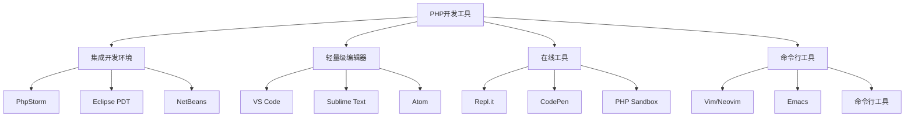

# 开发工具配置

## 🎯 学习目标
- 掌握主流PHP开发工具的配置方法
- 了解不同IDE的特点和适用场景
- 学会配置调试环境和代码质量工具
- 掌握版本控制和协作开发工具的使用

## 🛠️ 开发工具概览

### 主流PHP开发工具对比



### 工具选择建议

| 工具类型 | 推荐工具 | 适用场景 | 学习成本 |
|----------|----------|----------|----------|
| 专业IDE | PhpStorm | 企业开发、大型项目 | 高 |
| 轻量编辑器 | VS Code | 日常开发、学习 | 低 |
| 在线工具 | Repl.it | 快速测试、学习 | 极低 |
| 命令行 | Vim | 服务器开发、高级用户 | 高 |

## 💻 PhpStorm配置

### 基本配置

#### 项目设置
```xml
<!-- .idea/php.xml -->
<component name="PhpProjectSharedConfiguration">
  <option name="suggestChangeDefaultLanguageLevel" value="false" />
  <option name="languageLevel" value="PHP 8.2" />
  <option name="includePath">
    <path value="$PROJECT_DIR$/vendor" />
    <path value="$PROJECT_DIR$/src" />
  </option>
</component>
```

#### 代码风格配置
```xml
<!-- .idea/codeStyles/Project.xml -->
<component name="ProjectCodeStyleConfiguration">
  <code_scheme name="Project" version="173">
    <PHPCodeStyleSettings>
      <option name="ALIGN_KEY_VALUE_PAIRS" value="true" />
      <option name="ALIGN_MULTILINE_PARAMETERS" value="true" />
      <option name="SPACE_BEFORE_ARRAY_BRACKET" value="false" />
      <option name="SPACE_AFTER_ARRAY_BRACKET" value="false" />
    </PHPCodeStyleSettings>
  </code_scheme>
</component>
```

### 调试配置

#### Xdebug配置
```ini
; php.ini
[xdebug]
zend_extension=xdebug.so
xdebug.mode=debug
xdebug.start_with_request=yes
xdebug.client_host=127.0.0.1
xdebug.client_port=9003
xdebug.log=/tmp/xdebug.log
xdebug.idekey=PHPSTORM
```

#### PhpStorm调试设置
1. **File → Settings → PHP → Debug**
   - Xdebug port: 9003
   - Can accept external connections: ✓
   - Force break at first line: ✓

2. **File → Settings → PHP → Servers**
   - Name: localhost
   - Host: localhost
   - Port: 80
   - Debugger: Xdebug

### 代码质量工具

#### PHP_CodeSniffer配置
```xml
<!-- .idea/inspectionProfiles/Project_Default.xml -->
<component name="InspectionProjectProfileManager">
  <profile version="1.0">
    <option name="myName" value="Project Default" />
    <inspection_tool class="PhpCSValidationInspection" enabled="true" level="WARNING" enabled_by_default="true">
      <option name="CODING_STANDARD" value="PSR12" />
      <option name="CUSTOM_RULESET_PATH" value="" />
      <option name="SHOW_SNIFF_NAMES" value="true" />
    </inspection_tool>
  </profile>
</component>
```

#### PHPStan配置
```neon
# phpstan.neon
parameters:
    level: 6
    paths:
        - src
    excludePaths:
        - vendor
    ignoreErrors:
        - '#Call to an undefined method#'
    checkMissingIterableValueType: false
```

## 🔧 VS Code配置

### 基本配置

#### 扩展推荐
```json
{
  "recommendations": [
    "bmewburn.vscode-intelephense-client",
    "xdebug.php-debug",
    "bradlc.vscode-tailwindcss",
    "formulahendry.auto-rename-tag",
    "ms-vscode.vscode-json",
    "felixfbecker.php-intellisense",
    "mikestead.dotenv",
    "ms-vscode.vscode-json"
  ]
}
```

#### 工作区配置
```json
{
  "php.validate.executablePath": "/usr/bin/php",
  "php.suggest.basic": false,
  "intelephense.files.maxSize": 5000000,
  "intelephense.completion.triggerParameterHints": true,
  "intelephense.format.enable": true,
  "intelephense.diagnostics.enable": true,
  "intelephense.diagnostics.run": "onType",
  "intelephense.diagnostics.undefinedFunctions": true,
  "intelephense.diagnostics.undefinedConstants": true,
  "intelephense.diagnostics.undefinedClassConstants": true,
  "intelephense.diagnostics.undefinedMethods": true,
  "intelephense.diagnostics.undefinedProperties": true,
  "intelephense.diagnostics.undefinedTypes": true,
  "intelephense.diagnostics.undefinedVariables": true,
  "intelephense.diagnostics.unusedSymbols": true,
  "intelephense.diagnostics.undefinedFunctions": true
}
```

### 调试配置

#### launch.json配置
```json
{
  "version": "0.2.0",
  "configurations": [
    {
      "name": "Listen for Xdebug",
      "type": "php",
      "request": "launch",
      "port": 9003,
      "pathMappings": {
        "/var/www/html": "${workspaceFolder}"
      },
      "ignore": [
        "**/vendor/**/*.php"
      ]
    },
    {
      "name": "Launch currently open script",
      "type": "php",
      "request": "launch",
      "program": "${file}",
      "cwd": "${fileDirname}",
      "port": 0,
      "runtimeArgs": [
        "-dxdebug.start_with_request=yes"
      ],
      "env": {
        "XDEBUG_MODE": "debug,develop",
        "XDEBUG_CONFIG": "client_port=${port}"
      }
    }
  ]
}
```

### 代码格式化

#### 格式化配置
```json
{
  "editor.formatOnSave": true,
  "editor.formatOnPaste": true,
  "editor.formatOnType": true,
  "php.suggest.basic": false,
  "php.validate.enable": true,
  "php.validate.executablePath": "/usr/bin/php",
  "php.validate.run": "onSave",
  "intelephense.format.enable": true,
  "intelephense.format.braces": "allman",
  "intelephense.format.spaceAfterControlStructures": true,
  "intelephense.format.spaceAfterKeywordsInControlFlowStructures": true,
  "intelephense.format.spaceAfterSemicolon": true,
  "intelephense.format.spaceBeforeSemicolon": false,
  "intelephense.format.spaceAroundStringConcat": true,
  "intelephense.format.spaceAfterOpeningAndBeforeClosingNonEmptyParenthesis": false,
  "intelephense.format.spaceAfterOpeningAndBeforeClosingEmptyParenthesis": false,
  "intelephense.format.spaceAfterOpeningAndBeforeClosingNonEmptyBrackets": false,
  "intelephense.format.spaceAfterOpeningAndBeforeClosingEmptyBrackets": false,
  "intelephense.format.spaceAfterOpeningAndBeforeClosingNonEmptyBraces": true,
  "intelephense.format.spaceAfterOpeningAndBeforeClosingEmptyBraces": true
}
```

## 🐛 调试工具配置

### Xdebug配置

#### 安装和配置
```bash
# Ubuntu/Debian
sudo apt install php-xdebug

# CentOS/RHEL
sudo yum install php-xdebug

# 编译安装
pecl install xdebug
```

#### 配置文件
```ini
; php.ini
[xdebug]
zend_extension=xdebug.so
xdebug.mode=debug,develop,coverage
xdebug.start_with_request=yes
xdebug.client_host=127.0.0.1
xdebug.client_port=9003
xdebug.log=/tmp/xdebug.log
xdebug.idekey=VSCODE
xdebug.remote_autostart=1
xdebug.remote_connect_back=0
xdebug.remote_enable=1
xdebug.remote_handler=dbgp
xdebug.remote_host=127.0.0.1
xdebug.remote_log=/tmp/xdebug_remote.log
xdebug.remote_mode=req
xdebug.remote_port=9003
xdebug.remote_timeout=200
xdebug.var_display_max_children=256
xdebug.var_display_max_data=1024
xdebug.var_display_max_depth=5
```

### 调试技巧

#### 断点调试
```php
<?php
// 设置断点
function calculateTotal($items) {
    $total = 0;
    foreach ($items as $item) {
        $total += $item['price']; // 在此处设置断点
    }
    return $total;
}

// 使用Xdebug
xdebug_break(); // 程序断点

// 变量检查
$debug = [
    'items' => $items,
    'total' => $total
];
var_dump($debug);
?>
```

#### 性能分析
```php
<?php
// 启用性能分析
xdebug_start_trace('/tmp/trace');

// 你的代码
function slowFunction() {
    sleep(1);
    return "Done";
}

$result = slowFunction();

// 停止性能分析
xdebug_stop_trace();
?>
```

## 📊 代码质量工具

### PHP_CodeSniffer

#### 安装和配置
```bash
# 全局安装
composer global require squizlabs/php_codesniffer

# 项目安装
composer require --dev squizlabs/php_codesniffer

# 检查代码
./vendor/bin/phpcs --standard=PSR12 src/

# 自动修复
./vendor/bin/phpcbf --standard=PSR12 src/
```

#### 配置文件
```xml
<!-- phpcs.xml -->
<?xml version="1.0"?>
<ruleset name="MyProject">
    <description>My Project Coding Standards</description>
    
    <file>src/</file>
    <file>tests/</file>
    
    <exclude-pattern>vendor/</exclude-pattern>
    <exclude-pattern>cache/</exclude-pattern>
    
    <rule ref="PSR12"/>
    
    <rule ref="Generic.Files.LineLength">
        <properties>
            <property name="lineLimit" value="120"/>
            <property name="absoluteLineLimit" value="140"/>
        </properties>
    </rule>
</ruleset>
```

### PHPStan

#### 安装和配置
```bash
# 安装
composer require --dev phpstan/phpstan

# 运行分析
./vendor/bin/phpstan analyse src --level=6
```

#### 配置文件
```neon
# phpstan.neon
parameters:
    level: 6
    paths:
        - src
    excludePaths:
        - vendor
        - tests
    ignoreErrors:
        - '#Call to an undefined method#'
        - '#Access to an undefined property#'
    checkMissingIterableValueType: false
    checkGenericClassInNonGenericObjectType: false
    reportUnmatchedIgnoredErrors: false
```

### Psalm

#### 安装和配置
```bash
# 安装
composer require --dev vimeo/psalm

# 初始化
./vendor/bin/psalm --init

# 运行分析
./vendor/bin/psalm
```

#### 配置文件
```xml
<!-- psalm.xml -->
<?xml version="1.0"?>
<psalm
    errorLevel="3"
    resolveFromConfigFile="true"
    xmlns:xsi="http://www.w3.org/2001/XMLSchema-instance"
    xmlns="https://getpsalm.org/schema/config"
    xsi:schemaLocation="https://getpsalm.org/schema/config vendor/vimeo/psalm/config.xsd"
>
    <projectFiles>
        <directory name="src" />
        <ignoreFiles>
            <directory name="vendor" />
        </ignoreFiles>
    </projectFiles>
    
    <issueHandlers>
        <MissingReturnType errorLevel="info" />
        <MissingPropertyType errorLevel="info" />
    </issueHandlers>
</psalm>
```

## 🔄 版本控制工具

### Git配置

#### 基本配置
```bash
# 全局配置
git config --global user.name "Your Name"
git config --global user.email "your.email@example.com"
git config --global core.editor "code --wait"
git config --global init.defaultBranch main

# 别名配置
git config --global alias.st status
git config --global alias.co checkout
git config --global alias.br branch
git config --global alias.ci commit
git config --global alias.unstage 'reset HEAD --'
git config --global alias.last 'log -1 HEAD'
git config --global alias.visual '!gitk'
```

#### .gitignore配置
```gitignore
# PHP
vendor/
composer.lock
.env
.env.local
.env.*.local

# IDE
.vscode/
.idea/
*.swp
*.swo
*~

# OS
.DS_Store
Thumbs.db

# Logs
*.log
logs/

# Cache
cache/
tmp/
temp/

# Database
*.sqlite
*.db

# Build
build/
dist/
```

### Git Hooks

#### pre-commit hook
```bash
#!/bin/bash
# .git/hooks/pre-commit

echo "Running pre-commit checks..."

# PHP语法检查
echo "Checking PHP syntax..."
find . -name "*.php" -not -path "./vendor/*" -exec php -l {} \;
if [ $? -ne 0 ]; then
    echo "PHP syntax errors found!"
    exit 1
fi

# 代码风格检查
echo "Checking code style..."
./vendor/bin/phpcs --standard=PSR12 src/
if [ $? -ne 0 ]; then
    echo "Code style violations found!"
    exit 1
fi

# 静态分析
echo "Running static analysis..."
./vendor/bin/phpstan analyse src --level=6
if [ $? -ne 0 ]; then
    echo "Static analysis errors found!"
    exit 1
fi

echo "All checks passed!"
exit 0
```

## 🚀 性能分析工具

### Blackfire配置

#### 安装和配置
```bash
# 安装
curl -sSL https://packages.blackfire.io/gpg.key | sudo apt-key add -
echo "deb http://packages.blackfire.io/debian any main" | sudo tee /etc/apt/sources.list.d/blackfire.list
sudo apt update
sudo apt install blackfire-agent blackfire-php

# 配置
blackfire-agent --register
```

#### 使用示例
```php
<?php
// 开始性能分析
blackfire_start();

// 你的代码
function expensiveOperation() {
    $data = [];
    for ($i = 0; $i < 10000; $i++) {
        $data[] = md5($i);
    }
    return $data;
}

$result = expensiveOperation();

// 结束性能分析
blackfire_stop();
?>
```

### XHProf配置

#### 安装和配置
```bash
# 安装
pecl install xhprof

# 配置
echo "extension=xhprof.so" >> /etc/php/8.2/mods-available/xhprof.ini
```

#### 使用示例
```php
<?php
// 开始性能分析
xhprof_enable(XHPROF_FLAGS_CPU + XHPROF_FLAGS_MEMORY);

// 你的代码
function slowFunction() {
    sleep(1);
    return "Done";
}

$result = slowFunction();

// 结束性能分析
$xhprof_data = xhprof_disable();

// 保存数据
$XHPROF_ROOT = '/tmp/xhprof';
include_once $XHPROF_ROOT . "/xhprof_lib/utils/xhprof_lib.php";
include_once $XHPROF_ROOT . "/xhprof_lib/utils/xhprof_runs.php";

$xhprof_runs = new XHProfRuns_Default();
$run_id = $xhprof_runs->save_run($xhprof_data, "xhprof_testing");

echo "Performance data saved with run id: $run_id\n";
?>
```

## 📱 移动开发工具

### 移动端调试

#### 远程调试配置
```php
<?php
// 移动端调试配置
if ($_SERVER['HTTP_HOST'] === 'mobile.local') {
    // 启用移动端调试
    ini_set('display_errors', 1);
    error_reporting(E_ALL);
    
    // 移动端特定配置
    ini_set('memory_limit', '256M');
    ini_set('max_execution_time', 60);
}
?>
```

#### 响应式设计测试
```html
<!-- 移动端测试页面 -->
<!DOCTYPE html>
<html>
<head>
    <meta name="viewport" content="width=device-width, initial-scale=1.0">
    <title>Mobile Test</title>
    <style>
        @media (max-width: 768px) {
            .desktop-only { display: none; }
        }
    </style>
</head>
<body>
    <div class="desktop-only">Desktop Content</div>
    <div class="mobile-content">Mobile Content</div>
</body>
</html>
```

## 🎓 学习建议

### 工具选择策略
1. **初学者**: 使用VS Code + 基础扩展
2. **进阶者**: 使用PhpStorm + 专业工具
3. **团队开发**: 统一工具和配置标准
4. **个人项目**: 选择最适合的工具

### 最佳实践
1. **配置管理**: 使用版本控制管理配置文件
2. **代码质量**: 集成代码质量检查工具
3. **调试技巧**: 熟练掌握调试工具使用
4. **性能监控**: 定期进行性能分析

## 🔗 相关链接
- [[01-PHP语言特性|PHP语言特性]]
- [[02-运行环境配置|运行环境配置]]
- [[03-PHP-FPM详解|PHP-FPM详解]]
- [[04-Web服务器集成|Web服务器集成]]
- [[01-基础认知层/语法基础/01-变量与常量|变量与常量]]
