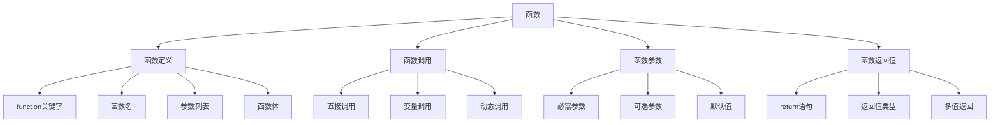

# 函数基础

## 🎯 学习目标
- 理解函数的基本概念和作用
- 掌握函数的定义、调用和返回值
- 学会使用函数参数和默认值
- 了解函数的作用域和生命周期

## 📚 核心概念

### 函数概述
函数是一段可重复使用的代码块，用于执行特定的任务。



### 函数特性对比

| 特性 | 描述 | 示例 |
|------|------|------|
| 可重用性 | 一次定义，多次调用 | `strlen()`, `array_map()` |
| 模块化 | 将复杂任务分解为小函数 | `validateUser()`, `processData()` |
| 封装性 | 隐藏实现细节 | `calculateTotal()`, `formatDate()` |
| 参数化 | 通过参数传递数据 | `add($a, $b)`, `filter($array, $callback)` |

## 🔧 函数定义

### 基本语法
```php
<?php
// 基本函数定义
function sayHello() {
    echo "Hello, World!";
}

// 带参数的函数
function greet($name) {
    echo "Hello, $name!";
}

// 带返回值的函数
function add($a, $b) {
    return $a + $b;
}

// 带默认值的函数
function greetWithDefault($name = "World") {
    echo "Hello, $name!";
}

// 类型声明函数
function calculateTotal(float $price, int $quantity): float {
    return $price * $quantity;
}

// 可空类型函数
function findUser(?int $id): ?array {
    if ($id === null) {
        return null;
    }
    // 查找用户逻辑
    return ['id' => $id, 'name' => 'User'];
}
?>
```

### 函数调用
```php
<?php
// 直接调用
sayHello();
greet("John");
$result = add(5, 3);

// 变量调用
$functionName = "greet";
$functionName("Jane");

// 动态调用
$functions = [
    'add' => function($a, $b) { return $a + $b; },
    'multiply' => function($a, $b) { return $a * $b; }
];

$result = $functions['add'](10, 5);

// 方法调用
class Calculator {
    public function add($a, $b) {
        return $a + $b;
    }
}

$calc = new Calculator();
$result = $calc->add(10, 5);
?>
```

## 📝 函数参数

### 参数类型
```php
<?php
// 值传递
function modifyValue($value) {
    $value = $value * 2;
    return $value;
}

$number = 10;
$result = modifyValue($number);
echo $number; // 输出: 10 (原值不变)
echo $result; // 输出: 20

// 引用传递
function modifyReference(&$value) {
    $value = $value * 2;
}

$number = 10;
modifyReference($number);
echo $number; // 输出: 20 (原值被修改)

// 可变参数
function sum(...$numbers) {
    $total = 0;
    foreach ($numbers as $number) {
        $total += $number;
    }
    return $total;
}

echo sum(1, 2, 3, 4, 5); // 输出: 15

// 命名参数 (PHP 8+)
function createUser(string $name, int $age = 18, string $email = '') {
    return [
        'name' => $name,
        'age' => $age,
        'email' => $email
    ];
}

$user = createUser(name: 'John', email: 'john@example.com');
?>
```

### 参数验证
```php
<?php
// 参数类型检查
function processUser(array $userData) {
    if (empty($userData['name'])) {
        throw new InvalidArgumentException('用户名不能为空');
    }
    
    if (!isset($userData['age']) || $userData['age'] < 0) {
        throw new InvalidArgumentException('年龄必须是非负数');
    }
    
    return $userData;
}

// 参数数量检查
function flexibleFunction(...$args) {
    $count = count($args);
    
    if ($count === 0) {
        return "没有参数";
    } elseif ($count === 1) {
        return "一个参数: " . $args[0];
    } else {
        return "多个参数: " . implode(', ', $args);
    }
}

// 参数范围检查
function calculateDiscount(float $price, float $discountRate) {
    if ($price < 0) {
        throw new InvalidArgumentException('价格不能为负数');
    }
    
    if ($discountRate < 0 || $discountRate > 1) {
        throw new InvalidArgumentException('折扣率必须在0-1之间');
    }
    
    return $price * (1 - $discountRate);
}
?>
```

## 🔄 函数返回值

### 返回值类型
```php
<?php
// 基本返回值
function getStatus() {
    return "active";
}

// 多值返回
function getCoordinates() {
    return [10, 20];
}

// 使用list解构
list($x, $y) = getCoordinates();
echo "X: $x, Y: $y";

// 关联数组返回
function getUserInfo() {
    return [
        'name' => 'John',
        'age' => 25,
        'email' => 'john@example.com'
    ];
}

$user = getUserInfo();
echo $user['name'];

// 对象返回
function createPerson() {
    return (object) [
        'name' => 'Jane',
        'age' => 30
    ];
}

$person = createPerson();
echo $person->name;

// 条件返回
function findUser($id) {
    if ($id <= 0) {
        return null;
    }
    
    // 模拟查找
    if ($id === 1) {
        return ['id' => 1, 'name' => 'John'];
    }
    
    return false;
}

$user = findUser(1);
if ($user) {
    echo "找到用户: " . $user['name'];
} else {
    echo "用户不存在";
}
?>
```

### 返回值处理
```php
<?php
// 链式调用
function add($a, $b) {
    return $a + $b;
}

function multiply($a, $b) {
    return $a * $b;
}

$result = multiply(add(5, 3), 2); // (5+3)*2 = 16

// 返回值验证
function divide($a, $b) {
    if ($b === 0) {
        return false; // 或者抛出异常
    }
    return $a / $b;
}

$result = divide(10, 2);
if ($result !== false) {
    echo "结果: $result";
} else {
    echo "除零错误";
}

// 返回值类型转换
function getNumber() {
    return "123";
}

$number = (int) getNumber();
echo $number; // 输出: 123

// 返回值缓存
function expensiveCalculation($input) {
    static $cache = [];
    
    if (isset($cache[$input])) {
        return $cache[$input];
    }
    
    // 模拟昂贵计算
    $result = $input * $input;
    $cache[$input] = $result;
    
    return $result;
}
?>
```

## 🎯 实际应用示例

### 工具函数
```php
<?php
// 字符串处理函数
function truncateString($string, $length, $suffix = '...') {
    if (strlen($string) <= $length) {
        return $string;
    }
    
    return substr($string, 0, $length - strlen($suffix)) . $suffix;
}

// 数组处理函数
function arrayFlatten($array) {
    $result = [];
    
    foreach ($array as $item) {
        if (is_array($item)) {
            $result = array_merge($result, arrayFlatten($item));
        } else {
            $result[] = $item;
        }
    }
    
    return $result;
}

// 日期处理函数
function formatDate($date, $format = 'Y-m-d H:i:s') {
    if (is_string($date)) {
        $date = strtotime($date);
    }
    
    return date($format, $date);
}

// 文件处理函数
function readFileLines($filename) {
    if (!file_exists($filename)) {
        throw new InvalidArgumentException("文件不存在: $filename");
    }
    
    $lines = [];
    $handle = fopen($filename, 'r');
    
    if ($handle) {
        while (($line = fgets($handle)) !== false) {
            $lines[] = trim($line);
        }
        fclose($handle);
    }
    
    return $lines;
}

// 使用示例
echo truncateString("这是一个很长的字符串", 10);
$nested = [1, [2, 3], [4, [5, 6]]];
print_r(arrayFlatten($nested));
echo formatDate('2024-01-15');
?>
```

### 业务逻辑函数
```php
<?php
// 用户验证函数
function validateUser($userData) {
    $errors = [];
    
    // 验证姓名
    if (empty($userData['name'])) {
        $errors[] = '姓名不能为空';
    } elseif (strlen($userData['name']) < 2) {
        $errors[] = '姓名长度不能少于2个字符';
    }
    
    // 验证邮箱
    if (empty($userData['email'])) {
        $errors[] = '邮箱不能为空';
    } elseif (!filter_var($userData['email'], FILTER_VALIDATE_EMAIL)) {
        $errors[] = '邮箱格式不正确';
    }
    
    // 验证年龄
    if (!isset($userData['age']) || !is_numeric($userData['age'])) {
        $errors[] = '年龄必须是数字';
    } elseif ($userData['age'] < 0 || $userData['age'] > 150) {
        $errors[] = '年龄必须在0-150之间';
    }
    
    return [
        'valid' => empty($errors),
        'errors' => $errors
    ];
}

// 价格计算函数
function calculatePrice($basePrice, $discount = 0, $tax = 0.1) {
    // 应用折扣
    $discountedPrice = $basePrice * (1 - $discount);
    
    // 应用税费
    $finalPrice = $discountedPrice * (1 + $tax);
    
    return round($finalPrice, 2);
}

// 权限检查函数
function hasPermission($user, $permission) {
    if (!isset($user['permissions'])) {
        return false;
    }
    
    return in_array($permission, $user['permissions']);
}

// 使用示例
$userData = [
    'name' => 'John Doe',
    'email' => 'john@example.com',
    'age' => 25
];

$validation = validateUser($userData);
if ($validation['valid']) {
    echo "用户数据有效";
} else {
    echo "验证错误: " . implode(', ', $validation['errors']);
}

$price = calculatePrice(100, 0.1, 0.08); // 100元，10%折扣，8%税费
echo "最终价格: $price";
?>
```

### 数据处理函数
```php
<?php
// 数据过滤函数
function filterData($data, $rules) {
    $filtered = [];
    
    foreach ($rules as $field => $rule) {
        if (!isset($data[$field])) {
            continue;
        }
        
        $value = $data[$field];
        
        // 应用过滤规则
        if (isset($rule['type'])) {
            switch ($rule['type']) {
                case 'string':
                    $value = (string) $value;
                    break;
                case 'int':
                    $value = (int) $value;
                    break;
                case 'float':
                    $value = (float) $value;
                    break;
                case 'bool':
                    $value = (bool) $value;
                    break;
            }
        }
        
        // 应用转换规则
        if (isset($rule['transform'])) {
            $value = $rule['transform']($value);
        }
        
        $filtered[$field] = $value;
    }
    
    return $filtered;
}

// 数据排序函数
function sortData($data, $field, $direction = 'asc') {
    usort($data, function($a, $b) use ($field, $direction) {
        $valueA = $a[$field] ?? '';
        $valueB = $b[$field] ?? '';
        
        $comparison = $valueA <=> $valueB;
        
        return $direction === 'desc' ? -$comparison : $comparison;
    });
    
    return $data;
}

// 数据分组函数
function groupData($data, $field) {
    $groups = [];
    
    foreach ($data as $item) {
        $key = $item[$field] ?? 'unknown';
        $groups[$key][] = $item;
    }
    
    return $groups;
}

// 使用示例
$data = [
    ['name' => 'John', 'age' => 25, 'city' => 'New York'],
    ['name' => 'Jane', 'age' => 30, 'city' => 'London'],
    ['name' => 'Bob', 'age' => 25, 'city' => 'New York']
];

$rules = [
    'name' => ['type' => 'string', 'transform' => 'strtoupper'],
    'age' => ['type' => 'int'],
    'city' => ['type' => 'string']
];

$filtered = filterData($data[0], $rules);
$sorted = sortData($data, 'age', 'desc');
$grouped = groupData($data, 'city');

print_r($filtered);
print_r($sorted);
print_r($grouped);
?>
```

## 📊 最佳实践

### 函数设计原则
```php
<?php
// 1. 单一职责原则
function calculateTotal($items) {
    $total = 0;
    foreach ($items as $item) {
        $total += $item['price'] * $item['quantity'];
    }
    return $total;
}

function applyDiscount($total, $discountRate) {
    return $total * (1 - $discountRate);
}

function addTax($total, $taxRate) {
    return $total * (1 + $taxRate);
}

// 2. 参数验证
function processOrder($orderData) {
    // 验证必需参数
    if (empty($orderData['items'])) {
        throw new InvalidArgumentException('订单必须包含商品');
    }
    
    if (!isset($orderData['customer_id'])) {
        throw new InvalidArgumentException('订单必须包含客户ID');
    }
    
    // 处理逻辑
    return $this->executeOrder($orderData);
}

// 3. 错误处理
function safeDivide($a, $b) {
    if ($b === 0) {
        throw new DivisionByZeroError('除数不能为零');
    }
    
    return $a / $b;
}

// 4. 文档注释
/**
 * 计算两个数的和
 * 
 * @param float $a 第一个数
 * @param float $b 第二个数
 * @return float 两数之和
 * @throws InvalidArgumentException 当参数不是数字时抛出
 */
function add($a, $b) {
    if (!is_numeric($a) || !is_numeric($b)) {
        throw new InvalidArgumentException('参数必须是数字');
    }
    
    return $a + $b;
}
?>
```

### 性能优化
```php
<?php
// 1. 避免重复计算
function processItems($items) {
    $total = count($items); // 预先计算
    $results = [];
    
    for ($i = 0; $i < $total; $i++) {
        $results[] = processItem($items[$i]);
    }
    
    return $results;
}

// 2. 使用静态变量缓存
function expensiveOperation($input) {
    static $cache = [];
    
    if (isset($cache[$input])) {
        return $cache[$input];
    }
    
    // 执行昂贵操作
    $result = $input * $input;
    $cache[$input] = $result;
    
    return $result;
}

// 3. 早期返回
function validateAndProcess($data) {
    // 快速失败检查
    if (empty($data)) {
        return false;
    }
    
    if (!is_array($data)) {
        return false;
    }
    
    // 主要处理逻辑
    return processData($data);
}

// 4. 避免在循环中定义函数
// 不好的做法
function processArray($array) {
    foreach ($array as $item) {
        $callback = function($x) { return $x * 2; }; // 每次循环都创建新函数
        $result = $callback($item);
    }
}

// 好的做法
function processArray($array) {
    $callback = function($x) { return $x * 2; }; // 只创建一次
    
    foreach ($array as $item) {
        $result = $callback($item);
    }
}
?>
```

## 🎓 学习建议

### 费曼学习法应用
1. **选择概念**: 选择函数基础中的核心概念
2. **简化解释**: 用简单语言解释函数的作用和用法
3. **识别盲点**: 发现理解不深入的地方
4. **重新学习**: 针对盲点进行深入学习

### 刻意练习重点
1. **函数设计**: 练习设计清晰、可重用的函数
2. **参数处理**: 掌握各种参数类型和验证方法
3. **返回值**: 学会合理设计返回值
4. **实际应用**: 在实际项目中应用函数

## 🔗 相关链接
- [[02-内置函数分类|内置函数分类]]
- [[03-自定义函数|自定义函数]]
- [[04-匿名函数与闭包|匿名函数与闭包]]
- [[05-函数参数详解|函数参数详解]]
- [[01-基础认知层/语法基础/01-变量与常量|变量与常量]]
