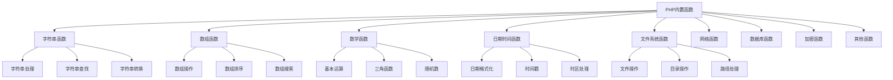

# 内置函数分类

## 🎯 学习目标
- 理解PHP内置函数的分类体系
- 掌握各类内置函数的使用方法
- 学会选择合适的函数解决实际问题
- 了解函数性能和使用注意事项

## 📚 核心概念

### 内置函数分类体系



### 函数分类对比

| 分类 | 主要功能 | 常用函数 | 使用频率 |
|------|----------|----------|----------|
| 字符串函数 | 字符串处理 | `strlen`, `substr`, `str_replace` | 高 |
| 数组函数 | 数组操作 | `array_map`, `array_filter`, `array_merge` | 高 |
| 数学函数 | 数学计算 | `abs`, `round`, `rand` | 中 |
| 日期函数 | 时间处理 | `date`, `strtotime`, `time` | 中 |
| 文件函数 | 文件操作 | `file_get_contents`, `fopen`, `fwrite` | 中 |
| 网络函数 | HTTP处理 | `curl_*`, `file_get_contents` | 低 |
| 数据库函数 | 数据库操作 | `mysqli_*`, `pdo_*` | 高 |
| 加密函数 | 安全处理 | `md5`, `sha1`, `password_hash` | 中 |

## 🔤 字符串函数

### 字符串处理
```php
<?php
// 字符串长度
$str = "Hello World";
echo strlen($str); // 输出: 11

// 字符串截取
echo substr($str, 0, 5); // 输出: Hello
echo substr($str, 6); // 输出: World
echo substr($str, -5); // 输出: World

// 字符串替换
echo str_replace("World", "PHP", $str); // 输出: Hello PHP
echo str_replace(["Hello", "World"], ["Hi", "PHP"], $str); // 输出: Hi PHP

// 字符串分割
$parts = explode(" ", $str);
print_r($parts); // 输出: ["Hello", "World"]

// 字符串连接
$array = ["Hello", "World", "PHP"];
echo implode(" ", $array); // 输出: Hello World PHP

// 字符串填充
echo str_pad($str, 20, "*"); // 输出: Hello World*********
echo str_pad($str, 20, "*", STR_PAD_LEFT); // 输出: *********Hello World

// 字符串重复
echo str_repeat("-", 10); // 输出: ----------
?>
```

### 字符串查找和比较
```php
<?php
$str = "Hello World PHP";

// 查找子字符串
echo strpos($str, "World"); // 输出: 6
echo strrpos($str, "o"); // 输出: 7 (最后一次出现)
echo stripos($str, "world"); // 输出: 6 (不区分大小写)

// 字符串比较
echo strcmp("apple", "banana"); // 输出: -1 (apple < banana)
echo strcasecmp("Apple", "apple"); // 输出: 0 (不区分大小写)

// 检查字符串包含
echo str_contains($str, "World"); // 输出: 1 (PHP 8+)
echo str_starts_with($str, "Hello"); // 输出: 1 (PHP 8+)
echo str_ends_with($str, "PHP"); // 输出: 1 (PHP 8+)

// 字符串计数
echo substr_count($str, "l"); // 输出: 3

// 字符串反转
echo strrev($str); // 输出: PHP dlroW olleH
?>
```

### 字符串转换
```php
<?php
$str = "hello world";

// 大小写转换
echo strtoupper($str); // 输出: HELLO WORLD
echo strtolower($str); // 输出: hello world
echo ucfirst($str); // 输出: Hello world
echo ucwords($str); // 输出: Hello World

// 去除空白
$str = "  hello world  ";
echo trim($str); // 输出: hello world
echo ltrim($str); // 输出: hello world  
echo rtrim($str); // 输出:   hello world

// 字符串转换
echo strtr($str, "hello", "HELLO"); // 输出: HELLO world
echo strtr($str, ["hello" => "hi", "world" => "php"]); // 输出: hi php

// HTML实体转换
$html = "&lt;script&gt;alert('XSS')&lt;/script&gt;";
echo html_entity_decode($html); // 输出: <script>alert('XSS')</script>
echo htmlspecialchars("<script>alert('XSS')</script>"); // 输出: &lt;script&gt;alert('XSS')&lt;/script&gt;
?>
```

## 📊 数组函数

### 数组操作
```php
<?php
$array = [1, 2, 3, 4, 5];

// 数组长度
echo count($array); // 输出: 5

// 数组添加元素
array_push($array, 6, 7);
print_r($array); // 输出: [1, 2, 3, 4, 5, 6, 7]

// 数组删除元素
$last = array_pop($array);
echo $last; // 输出: 7

$first = array_shift($array);
echo $first; // 输出: 1

// 数组合并
$array1 = [1, 2, 3];
$array2 = [4, 5, 6];
$merged = array_merge($array1, $array2);
print_r($merged); // 输出: [1, 2, 3, 4, 5, 6]

// 数组切片
$sliced = array_slice($array, 1, 3);
print_r($sliced); // 输出: [2, 3, 4]

// 数组去重
$duplicates = [1, 2, 2, 3, 3, 3];
$unique = array_unique($duplicates);
print_r($unique); // 输出: [1, 2, 3]
?>
```

### 数组排序和搜索
```php
<?php
$numbers = [3, 1, 4, 1, 5, 9, 2, 6];

// 排序
sort($numbers); // 升序
print_r($numbers); // 输出: [1, 1, 2, 3, 4, 5, 6, 9]

rsort($numbers); // 降序
print_r($numbers); // 输出: [9, 6, 5, 4, 3, 2, 1, 1]

// 关联数组排序
$users = [
    ['name' => 'John', 'age' => 25],
    ['name' => 'Jane', 'age' => 30],
    ['name' => 'Bob', 'age' => 20]
];

usort($users, function($a, $b) {
    return $a['age'] - $b['age'];
});
print_r($users);

// 数组搜索
$fruits = ['apple', 'banana', 'orange'];
echo array_search('banana', $fruits); // 输出: 1
echo in_array('apple', $fruits); // 输出: 1

// 数组键值操作
$assoc = ['a' => 1, 'b' => 2, 'c' => 3];
$keys = array_keys($assoc);
$values = array_values($assoc);
print_r($keys); // 输出: ['a', 'b', 'c']
print_r($values); // 输出: [1, 2, 3]
?>
```

### 数组函数式编程
```php
<?php
$numbers = [1, 2, 3, 4, 5];

// 数组映射
$squared = array_map(function($n) {
    return $n * $n;
}, $numbers);
print_r($squared); // 输出: [1, 4, 9, 16, 25]

// 数组过滤
$evens = array_filter($numbers, function($n) {
    return $n % 2 === 0;
});
print_r($evens); // 输出: [2, 4]

// 数组归约
$sum = array_reduce($numbers, function($carry, $item) {
    return $carry + $item;
}, 0);
echo $sum; // 输出: 15

// 数组遍历
array_walk($numbers, function($value, $key) {
    echo "Key: $key, Value: $value\n";
});

// 数组列提取
$users = [
    ['name' => 'John', 'age' => 25],
    ['name' => 'Jane', 'age' => 30],
    ['name' => 'Bob', 'age' => 20]
];
$names = array_column($users, 'name');
print_r($names); // 输出: ['John', 'Jane', 'Bob']
?>
```

## 🔢 数学函数

### 基本数学运算
```php
<?php
// 绝对值
echo abs(-5); // 输出: 5

// 最大值和最小值
echo max(1, 5, 3, 9, 2); // 输出: 9
echo min(1, 5, 3, 9, 2); // 输出: 1

// 四舍五入
echo round(3.14159, 2); // 输出: 3.14
echo ceil(3.2); // 输出: 4
echo floor(3.8); // 输出: 3

// 幂运算
echo pow(2, 3); // 输出: 8
echo 2 ** 3; // 输出: 8 (PHP 5.6+)

// 平方根
echo sqrt(16); // 输出: 4

// 对数
echo log(10); // 输出: 2.302585092994
echo log10(100); // 输出: 2

// 随机数
echo rand(1, 10); // 输出: 1-10之间的随机数
echo mt_rand(1, 10); // 输出: 更好的随机数生成器
?>
```

### 三角函数
```php
<?php
$angle = 45; // 角度
$radians = deg2rad($angle); // 转换为弧度

// 三角函数
echo sin($radians); // 正弦
echo cos($radians); // 余弦
echo tan($radians); // 正切

// 反三角函数
echo asin(0.5); // 反正弦
echo acos(0.5); // 反余弦
echo atan(1); // 反正切

// 角度转换
echo rad2deg(pi() / 4); // 输出: 45

// 圆周率
echo pi(); // 输出: 3.1415926535898
echo M_PI; // 输出: 3.1415926535898
?>
```

## 📅 日期时间函数

### 日期格式化
```php
<?php
// 当前时间
echo date('Y-m-d H:i:s'); // 输出: 2024-01-15 14:30:25

// 时间戳
echo time(); // 输出: 当前时间戳
echo mktime(14, 30, 0, 1, 15, 2024); // 输出: 指定时间的时间戳

// 字符串转时间戳
echo strtotime('2024-01-15 14:30:00'); // 输出: 时间戳
echo strtotime('+1 day'); // 输出: 明天的时间戳
echo strtotime('next Monday'); // 输出: 下周一的时间戳

// 日期格式化
$timestamp = time();
echo date('Y年m月d日 H:i:s', $timestamp);
echo date('l, F j, Y', $timestamp); // 输出: Monday, January 15, 2024

// 时区设置
date_default_timezone_set('Asia/Shanghai');
echo date('Y-m-d H:i:s'); // 输出: 中国时区时间
?>
```

### 日期计算
```php
<?php
// 日期差计算
$date1 = new DateTime('2024-01-15');
$date2 = new DateTime('2024-02-15');
$interval = $date1->diff($date2);
echo $interval->days; // 输出: 31

// 日期加减
$date = new DateTime('2024-01-15');
$date->add(new DateInterval('P1M')); // 加1个月
echo $date->format('Y-m-d'); // 输出: 2024-02-15

$date->sub(new DateInterval('P1W')); // 减1周
echo $date->format('Y-m-d'); // 输出: 2024-02-08

// 工作日计算
function getWorkingDays($start, $end) {
    $start = new DateTime($start);
    $end = new DateTime($end);
    $workingDays = 0;
    
    while ($start <= $end) {
        $dayOfWeek = $start->format('N');
        if ($dayOfWeek < 6) { // 1-5为工作日
            $workingDays++;
        }
        $start->add(new DateInterval('P1D'));
    }
    
    return $workingDays;
}

echo getWorkingDays('2024-01-15', '2024-01-31'); // 输出: 工作日数量
?>
```

## 📁 文件系统函数

### 文件操作
```php
<?php
// 文件读取
$content = file_get_contents('data.txt');
echo $content;

// 文件写入
file_put_contents('output.txt', 'Hello World');

// 文件存在检查
if (file_exists('data.txt')) {
    echo "文件存在";
}

// 文件大小
echo filesize('data.txt'); // 输出: 文件大小（字节）

// 文件类型
echo filetype('data.txt'); // 输出: file

// 文件权限
echo is_readable('data.txt'); // 输出: 1 或 0
echo is_writable('data.txt'); // 输出: 1 或 0
echo is_executable('script.php'); // 输出: 1 或 0

// 文件时间
echo date('Y-m-d H:i:s', filemtime('data.txt')); // 修改时间
echo date('Y-m-d H:i:s', fileatime('data.txt')); // 访问时间
echo date('Y-m-d H:i:s', filectime('data.txt')); // 创建时间
?>
```

### 目录操作
```php
<?php
// 目录创建
mkdir('new_directory', 0755);

// 目录删除
rmdir('empty_directory');

// 目录存在检查
if (is_dir('directory')) {
    echo "目录存在";
}

// 目录遍历
$files = scandir('.');
print_r($files);

// 递归目录遍历
function scanDirectory($dir) {
    $files = [];
    $iterator = new RecursiveIteratorIterator(
        new RecursiveDirectoryIterator($dir)
    );
    
    foreach ($iterator as $file) {
        if ($file->isFile()) {
            $files[] = $file->getPathname();
        }
    }
    
    return $files;
}

$allFiles = scanDirectory('.');
print_r($allFiles);
?>
```

## 🌐 网络函数

### HTTP请求
```php
<?php
// 使用file_get_contents发送GET请求
$url = 'https://api.example.com/data';
$response = file_get_contents($url);
echo $response;

// 使用cURL发送POST请求
function sendPostRequest($url, $data) {
    $ch = curl_init();
    
    curl_setopt($ch, CURLOPT_URL, $url);
    curl_setopt($ch, CURLOPT_POST, 1);
    curl_setopt($ch, CURLOPT_POSTFIELDS, json_encode($data));
    curl_setopt($ch, CURLOPT_RETURNTRANSFER, true);
    curl_setopt($ch, CURLOPT_HTTPHEADER, [
        'Content-Type: application/json'
    ]);
    
    $response = curl_exec($ch);
    $httpCode = curl_getinfo($ch, CURLINFO_HTTP_CODE);
    
    curl_close($ch);
    
    return [
        'response' => $response,
        'http_code' => $httpCode
    ];
}

// 使用示例
$result = sendPostRequest('https://api.example.com/users', [
    'name' => 'John Doe',
    'email' => 'john@example.com'
]);
?>
```

## 🔐 加密函数

### 哈希函数
```php
<?php
$password = 'mypassword';

// MD5哈希
echo md5($password); // 输出: 32位十六进制字符串

// SHA1哈希
echo sha1($password); // 输出: 40位十六进制字符串

// SHA256哈希
echo hash('sha256', $password); // 输出: 64位十六进制字符串

// 密码哈希（推荐）
$hash = password_hash($password, PASSWORD_DEFAULT);
echo $hash;

// 密码验证
if (password_verify($password, $hash)) {
    echo "密码正确";
} else {
    echo "密码错误";
}

// 随机盐值
$salt = random_bytes(16);
echo bin2hex($salt); // 输出: 32位十六进制字符串
?>
```

## 🎯 实际应用示例

### 数据处理工具
```php
<?php
class DataProcessor {
    // 数据清理
    public static function cleanData($data) {
        if (is_string($data)) {
            return trim(strip_tags($data));
        } elseif (is_array($data)) {
            return array_map([self::class, 'cleanData'], $data);
        }
        return $data;
    }
    
    // 数据验证
    public static function validateEmail($email) {
        return filter_var($email, FILTER_VALIDATE_EMAIL) !== false;
    }
    
    // 数据格式化
    public static function formatCurrency($amount, $currency = 'USD') {
        $symbols = [
            'USD' => '$',
            'EUR' => '€',
            'GBP' => '£',
            'CNY' => '¥'
        ];
        
        $symbol = $symbols[$currency] ?? $currency;
        return $symbol . number_format($amount, 2);
    }
    
    // 数据排序
    public static function sortByField($data, $field, $direction = 'asc') {
        usort($data, function($a, $b) use ($field, $direction) {
            $valueA = $a[$field] ?? '';
            $valueB = $b[$field] ?? '';
            
            $comparison = $valueA <=> $valueB;
            return $direction === 'desc' ? -$comparison : $comparison;
        });
        
        return $data;
    }
}

// 使用示例
$data = [
    ['name' => 'John', 'age' => 25, 'salary' => 50000],
    ['name' => 'Jane', 'age' => 30, 'salary' => 60000],
    ['name' => 'Bob', 'age' => 20, 'salary' => 40000]
];

$cleaned = DataProcessor::cleanData($data);
$sorted = DataProcessor::sortByField($data, 'age', 'desc');
$formatted = DataProcessor::formatCurrency(50000, 'USD');

print_r($sorted);
echo $formatted;
?>
```

### 文件处理工具
```php
<?php
class FileHandler {
    // 安全文件读取
    public static function safeRead($filename) {
        if (!file_exists($filename)) {
            throw new Exception("文件不存在: $filename");
        }
        
        if (!is_readable($filename)) {
            throw new Exception("文件不可读: $filename");
        }
        
        return file_get_contents($filename);
    }
    
    // 安全文件写入
    public static function safeWrite($filename, $content) {
        $dir = dirname($filename);
        
        if (!is_dir($dir)) {
            mkdir($dir, 0755, true);
        }
        
        if (file_put_contents($filename, $content) === false) {
            throw new Exception("文件写入失败: $filename");
        }
        
        return true;
    }
    
    // 文件备份
    public static function backup($filename) {
        if (!file_exists($filename)) {
            return false;
        }
        
        $backupName = $filename . '.backup.' . date('Y-m-d-H-i-s');
        return copy($filename, $backupName);
    }
    
    // 文件信息
    public static function getFileInfo($filename) {
        if (!file_exists($filename)) {
            return null;
        }
        
        return [
            'name' => basename($filename),
            'size' => filesize($filename),
            'type' => mime_content_type($filename),
            'modified' => date('Y-m-d H:i:s', filemtime($filename)),
            'permissions' => substr(sprintf('%o', fileperms($filename)), -4)
        ];
    }
}

// 使用示例
try {
    $content = FileHandler::safeRead('data.txt');
    FileHandler::safeWrite('output.txt', $content);
    FileHandler::backup('data.txt');
    $info = FileHandler::getFileInfo('data.txt');
    print_r($info);
} catch (Exception $e) {
    echo "错误: " . $e->getMessage();
}
?>
```

## 📊 最佳实践

### 函数选择原则
```php
<?php
// 1. 选择最合适的函数
// 不好的做法
function isEven($number) {
    return $number % 2 === 0;
}

// 好的做法
function isEven($number) {
    return ($number & 1) === 0; // 位运算更快
}

// 2. 避免重复计算
// 不好的做法
function processArray($array) {
    for ($i = 0; $i < count($array); $i++) { // count()在每次循环中调用
        // 处理逻辑
    }
}

// 好的做法
function processArray($array) {
    $count = count($array); // 预先计算
    for ($i = 0; $i < $count; $i++) {
        // 处理逻辑
    }
}

// 3. 使用数组函数替代循环
// 不好的做法
function filterEvens($numbers) {
    $evens = [];
    foreach ($numbers as $number) {
        if ($number % 2 === 0) {
            $evens[] = $number;
        }
    }
    return $evens;
}

// 好的做法
function filterEvens($numbers) {
    return array_filter($numbers, function($n) {
        return $n % 2 === 0;
    });
}

// 4. 错误处理
function safeFunction($input) {
    if (!is_string($input)) {
        throw new InvalidArgumentException('输入必须是字符串');
    }
    
    return strtoupper($input);
}
?>
```

### 性能优化建议
```php
<?php
// 1. 缓存函数结果
function expensiveCalculation($input) {
    static $cache = [];
    
    if (isset($cache[$input])) {
        return $cache[$input];
    }
    
    $result = $input * $input; // 模拟昂贵计算
    $cache[$input] = $result;
    
    return $result;
}

// 2. 使用内置函数
// 不好的做法
function customTrim($string) {
    // 自定义trim实现
}

// 好的做法
function customTrim($string) {
    return trim($string); // 使用内置函数
}

// 3. 避免在循环中调用函数
// 不好的做法
foreach ($items as $item) {
    $result = expensiveFunction($item);
}

// 好的做法
$results = array_map('expensiveFunction', $items);
?>
```

## 🎓 学习建议

### 费曼学习法应用
1. **选择概念**: 选择内置函数分类中的核心概念
2. **简化解释**: 用简单语言解释函数的作用和用法
3. **识别盲点**: 发现理解不深入的地方
4. **重新学习**: 针对盲点进行深入学习

### 刻意练习重点
1. **函数分类**: 熟练掌握各类内置函数
2. **函数选择**: 学会选择合适的函数
3. **性能优化**: 了解函数性能特点
4. **实际应用**: 在实际项目中应用内置函数

## 🔗 相关链接
- [[01-函数基础|函数基础]]
- [[03-自定义函数|自定义函数]]
- [[04-匿名函数与闭包|匿名函数与闭包]]
- [[05-函数参数详解|函数参数详解]]
- [[02-核心理解层/数组与字符串/01-数组基础|数组基础]]
