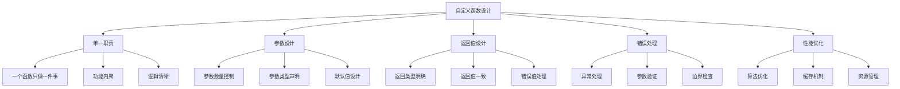

# 自定义函数

## 🎯 学习目标
- 理解自定义函数的设计原则和最佳实践
- 掌握函数参数设计、返回值处理和错误处理
- 学会编写可重用、可维护的自定义函数
- 了解函数性能优化和测试方法

## 📚 核心概念

### 自定义函数设计原则



### 函数设计质量指标

| 指标 | 描述 | 目标值 | 检查方法 |
|------|------|--------|----------|
| 函数长度 | 单个函数行数 | < 50行 | 代码统计 |
| 参数数量 | 函数参数个数 | < 5个 | 静态分析 |
| 圈复杂度 | 代码路径数量 | < 10 | 工具检测 |
| 返回值数量 | 可能的返回值 | < 3个 | 逻辑分析 |

## 🔧 函数设计模式

### 单一职责函数
```php
<?php
// 不好的做法：一个函数做多件事
function processUser($userData) {
    // 验证数据
    if (empty($userData['name'])) {
        return false;
    }
    
    // 清理数据
    $userData['name'] = trim($userData['name']);
    $userData['email'] = strtolower($userData['email']);
    
    // 保存到数据库
    $sql = "INSERT INTO users (name, email) VALUES (?, ?)";
    // 数据库操作...
    
    // 发送邮件
    mail($userData['email'], 'Welcome', 'Welcome to our site');
    
    return true;
}

// 好的做法：职责分离
function validateUserData($userData) {
    $errors = [];
    
    if (empty($userData['name'])) {
        $errors[] = '姓名不能为空';
    }
    
    if (!filter_var($userData['email'], FILTER_VALIDATE_EMAIL)) {
        $errors[] = '邮箱格式不正确';
    }
    
    return $errors;
}

function cleanUserData($userData) {
    return [
        'name' => trim($userData['name']),
        'email' => strtolower(trim($userData['email'])),
        'age' => (int) $userData['age']
    ];
}

function saveUser($userData) {
    // 数据库保存逻辑
    return true;
}

function sendWelcomeEmail($email) {
    // 邮件发送逻辑
    return true;
}

// 主函数协调各个子函数
function processUser($userData) {
    $errors = validateUserData($userData);
    if (!empty($errors)) {
        return ['success' => false, 'errors' => $errors];
    }
    
    $cleanData = cleanUserData($userData);
    $saved = saveUser($cleanData);
    
    if ($saved) {
        sendWelcomeEmail($cleanData['email']);
        return ['success' => true];
    }
    
    return ['success' => false, 'errors' => ['保存失败']];
}
?>
```

### 参数设计模式
```php
<?php
// 参数过多的问题
function createUser($name, $email, $age, $phone, $address, $city, $country, $zipcode) {
    // 函数体
}

// 解决方案1：使用数组参数
function createUser($userData) {
    $required = ['name', 'email'];
    foreach ($required as $field) {
        if (empty($userData[$field])) {
            throw new InvalidArgumentException("缺少必需字段: $field");
        }
    }
    
    // 处理逻辑
}

// 解决方案2：使用配置对象
class UserConfig {
    public $name;
    public $email;
    public $age = 18;
    public $phone = '';
    public $address = '';
    public $city = '';
    public $country = '';
    public $zipcode = '';
    
    public function __construct($name, $email) {
        $this->name = $name;
        $this->email = $email;
    }
}

function createUser(UserConfig $config) {
    // 使用配置对象
}

// 解决方案3：使用建造者模式
class UserBuilder {
    private $userData = [];
    
    public function setName($name) {
        $this->userData['name'] = $name;
        return $this;
    }
    
    public function setEmail($email) {
        $this->userData['email'] = $email;
        return $this;
    }
    
    public function setAge($age) {
        $this->userData['age'] = $age;
        return $this;
    }
    
    public function build() {
        return $this->userData;
    }
}

function createUser(UserBuilder $builder) {
    $userData = $builder->build();
    // 处理逻辑
}

// 使用示例
$user = (new UserBuilder())
    ->setName('John')
    ->setEmail('john@example.com')
    ->setAge(25)
    ->build();
?>
```

### 返回值设计模式
```php
<?php
// 模式1：简单返回值
function isEven($number) {
    return $number % 2 === 0;
}

// 模式2：状态码返回值
function saveData($data) {
    try {
        // 保存逻辑
        return 0; // 成功
    } catch (Exception $e) {
        return 1; // 失败
    }
}

// 模式3：结果对象返回值
class Result {
    public $success;
    public $data;
    public $message;
    public $code;
    
    public function __construct($success, $data = null, $message = '', $code = 0) {
        $this->success = $success;
        $this->data = $data;
        $this->message = $message;
        $this->code = $code;
    }
    
    public static function success($data = null, $message = '') {
        return new self(true, $data, $message);
    }
    
    public static function error($message, $code = 1) {
        return new self(false, null, $message, $code);
    }
}

function processData($data) {
    if (empty($data)) {
        return Result::error('数据不能为空');
    }
    
    try {
        $processed = $this->doProcess($data);
        return Result::success($processed, '处理成功');
    } catch (Exception $e) {
        return Result::error('处理失败: ' . $e->getMessage());
    }
}

// 模式4：异常处理
function divide($a, $b) {
    if ($b === 0) {
        throw new DivisionByZeroError('除数不能为零');
    }
    
    return $a / $b;
}

// 模式5：可空返回值
function findUser($id) {
    if ($id <= 0) {
        return null;
    }
    
    // 查找逻辑
    $user = $this->database->find($id);
    
    return $user ?: null;
}
?>
```

## 🎯 实际应用示例

### 数据验证函数
```php
<?php
class DataValidator {
    // 通用验证函数
    public static function validate($data, $rules) {
        $errors = [];
        
        foreach ($rules as $field => $rule) {
            $value = $data[$field] ?? null;
            $fieldErrors = self::validateField($value, $rule, $field);
            $errors = array_merge($errors, $fieldErrors);
        }
        
        return $errors;
    }
    
    private static function validateField($value, $rule, $field) {
        $errors = [];
        
        // 必需验证
        if (isset($rule['required']) && $rule['required'] && empty($value)) {
            $errors[] = "$field 是必需的";
            return $errors;
        }
        
        // 如果值为空且不是必需的，跳过其他验证
        if (empty($value)) {
            return $errors;
        }
        
        // 类型验证
        if (isset($rule['type'])) {
            if (!self::validateType($value, $rule['type'])) {
                $errors[] = "$field 必须是 " . $rule['type'] . " 类型";
            }
        }
        
        // 长度验证
        if (isset($rule['min_length']) && strlen($value) < $rule['min_length']) {
            $errors[] = "$field 长度不能少于 " . $rule['min_length'] . " 个字符";
        }
        
        if (isset($rule['max_length']) && strlen($value) > $rule['max_length']) {
            $errors[] = "$field 长度不能超过 " . $rule['max_length'] . " 个字符";
        }
        
        // 范围验证
        if (isset($rule['min']) && $value < $rule['min']) {
            $errors[] = "$field 不能小于 " . $rule['min'];
        }
        
        if (isset($rule['max']) && $value > $rule['max']) {
            $errors[] = "$field 不能大于 " . $rule['max'];
        }
        
        // 正则验证
        if (isset($rule['pattern']) && !preg_match($rule['pattern'], $value)) {
            $errors[] = "$field 格式不正确";
        }
        
        // 自定义验证
        if (isset($rule['custom']) && is_callable($rule['custom'])) {
            $customResult = $rule['custom']($value);
            if ($customResult !== true) {
                $errors[] = $customResult ?: "$field 验证失败";
            }
        }
        
        return $errors;
    }
    
    private static function validateType($value, $type) {
        switch ($type) {
            case 'string':
                return is_string($value);
            case 'int':
                return is_int($value) || (is_string($value) && is_numeric($value));
            case 'float':
                return is_float($value) || is_numeric($value);
            case 'email':
                return filter_var($value, FILTER_VALIDATE_EMAIL) !== false;
            case 'url':
                return filter_var($value, FILTER_VALIDATE_URL) !== false;
            case 'array':
                return is_array($value);
            default:
                return true;
        }
    }
}

// 使用示例
$userData = [
    'name' => 'John Doe',
    'email' => 'john@example.com',
    'age' => 25,
    'phone' => '123-456-7890'
];

$rules = [
    'name' => [
        'required' => true,
        'type' => 'string',
        'min_length' => 2,
        'max_length' => 50
    ],
    'email' => [
        'required' => true,
        'type' => 'email'
    ],
    'age' => [
        'required' => true,
        'type' => 'int',
        'min' => 18,
        'max' => 100
    ],
    'phone' => [
        'required' => false,
        'pattern' => '/^\d{3}-\d{3}-\d{4}$/'
    ]
];

$errors = DataValidator::validate($userData, $rules);
if (empty($errors)) {
    echo "验证通过";
} else {
    echo "验证失败: " . implode(', ', $errors);
}
?>
```

### 数据处理函数
```php
<?php
class DataProcessor {
    // 数据清理
    public static function clean($data, $options = []) {
        $defaultOptions = [
            'trim' => true,
            'strip_tags' => true,
            'html_entities' => true,
            'lowercase' => false,
            'uppercase' => false
        ];
        
        $options = array_merge($defaultOptions, $options);
        
        if (is_string($data)) {
            return self::cleanString($data, $options);
        } elseif (is_array($data)) {
            return self::cleanArray($data, $options);
        }
        
        return $data;
    }
    
    private static function cleanString($string, $options) {
        if ($options['trim']) {
            $string = trim($string);
        }
        
        if ($options['strip_tags']) {
            $string = strip_tags($string);
        }
        
        if ($options['html_entities']) {
            $string = htmlspecialchars($string, ENT_QUOTES, 'UTF-8');
        }
        
        if ($options['lowercase']) {
            $string = strtolower($string);
        }
        
        if ($options['uppercase']) {
            $string = strtoupper($string);
        }
        
        return $string;
    }
    
    private static function cleanArray($array, $options) {
        $cleaned = [];
        
        foreach ($array as $key => $value) {
            $cleanedKey = self::cleanString($key, $options);
            $cleanedValue = self::clean($value, $options);
            $cleaned[$cleanedKey] = $cleanedValue;
        }
        
        return $cleaned;
    }
    
    // 数据转换
    public static function transform($data, $transformations) {
        if (is_array($data)) {
            return self::transformArray($data, $transformations);
        }
        
        return self::transformValue($data, $transformations);
    }
    
    private static function transformArray($array, $transformations) {
        $transformed = [];
        
        foreach ($array as $key => $value) {
            if (isset($transformations[$key])) {
                $transformed[$key] = self::transformValue($value, $transformations[$key]);
            } else {
                $transformed[$key] = $value;
            }
        }
        
        return $transformed;
    }
    
    private static function transformValue($value, $transformation) {
        if (is_callable($transformation)) {
            return $transformation($value);
        }
        
        switch ($transformation) {
            case 'int':
                return (int) $value;
            case 'float':
                return (float) $value;
            case 'string':
                return (string) $value;
            case 'bool':
                return (bool) $value;
            case 'upper':
                return strtoupper($value);
            case 'lower':
                return strtolower($value);
            case 'trim':
                return trim($value);
            default:
                return $value;
        }
    }
    
    // 数据过滤
    public static function filter($data, $filters) {
        if (is_array($data)) {
            return self::filterArray($data, $filters);
        }
        
        return self::filterValue($data, $filters);
    }
    
    private static function filterArray($array, $filters) {
        $filtered = [];
        
        foreach ($array as $key => $value) {
            if (self::passesFilters($value, $filters)) {
                $filtered[$key] = $value;
            }
        }
        
        return $filtered;
    }
    
    private static function filterValue($value, $filters) {
        return self::passesFilters($value, $filters) ? $value : null;
    }
    
    private static function passesFilters($value, $filters) {
        foreach ($filters as $filter) {
            if (is_callable($filter)) {
                if (!$filter($value)) {
                    return false;
                }
            } else {
                switch ($filter) {
                    case 'not_empty':
                        if (empty($value)) return false;
                        break;
                    case 'numeric':
                        if (!is_numeric($value)) return false;
                        break;
                    case 'string':
                        if (!is_string($value)) return false;
                        break;
                }
            }
        }
        
        return true;
    }
}

// 使用示例
$data = [
    'name' => '  John Doe  ',
    'email' => 'JOHN@EXAMPLE.COM',
    'age' => '25',
    'phone' => '',
    'city' => 'New York'
];

// 清理数据
$cleaned = DataProcessor::clean($data, [
    'trim' => true,
    'lowercase' => true
]);

// 转换数据
$transformed = DataProcessor::transform($cleaned, [
    'age' => 'int',
    'email' => 'lower'
]);

// 过滤数据
$filtered = DataProcessor::filter($transformed, ['not_empty']);

print_r($filtered);
?>
```

### 缓存函数
```php
<?php
class CacheManager {
    private static $cache = [];
    private static $ttl = [];
    
    // 设置缓存
    public static function set($key, $value, $ttl = 3600) {
        self::$cache[$key] = $value;
        self::$ttl[$key] = time() + $ttl;
    }
    
    // 获取缓存
    public static function get($key) {
        if (!isset(self::$cache[$key])) {
            return null;
        }
        
        if (time() > self::$ttl[$key]) {
            unset(self::$cache[$key], self::$ttl[$key]);
            return null;
        }
        
        return self::$cache[$key];
    }
    
    // 删除缓存
    public static function delete($key) {
        unset(self::$cache[$key], self::$ttl[$key]);
    }
    
    // 清空缓存
    public static function clear() {
        self::$cache = [];
        self::$ttl = [];
    }
    
    // 缓存函数结果
    public static function remember($key, callable $callback, $ttl = 3600) {
        $value = self::get($key);
        
        if ($value === null) {
            $value = $callback();
            self::set($key, $value, $ttl);
        }
        
        return $value;
    }
}

// 使用示例
function expensiveCalculation($input) {
    // 模拟昂贵计算
    sleep(1);
    return $input * $input;
}

// 使用缓存
$result = CacheManager::remember("calc_$input", function() use ($input) {
    return expensiveCalculation($input);
}, 300); // 缓存5分钟

echo $result;
?>
```

## 📊 最佳实践

### 函数设计最佳实践
```php
<?php
// 1. 函数命名规范
function calculateTotalPrice($items) { } // 动词开头，描述功能
function isValidEmail($email) { } // 布尔函数用is/has/can开头
function getUserById($id) { } // 明确参数和返回值

// 2. 参数验证
function divide($a, $b) {
    if (!is_numeric($a) || !is_numeric($b)) {
        throw new InvalidArgumentException('参数必须是数字');
    }
    
    if ($b == 0) {
        throw new DivisionByZeroError('除数不能为零');
    }
    
    return $a / $b;
}

// 3. 错误处理
function processFile($filename) {
    if (!file_exists($filename)) {
        throw new FileNotFoundException("文件不存在: $filename");
    }
    
    if (!is_readable($filename)) {
        throw new PermissionException("文件不可读: $filename");
    }
    
    try {
        return file_get_contents($filename);
    } catch (Exception $e) {
        throw new ProcessingException("文件处理失败: " . $e->getMessage());
    }
}

// 4. 文档注释
/**
 * 计算订单总价
 * 
 * @param array $items 商品列表，每个商品包含price和quantity
 * @param float $discount 折扣率，0-1之间
 * @param float $tax 税率，0-1之间
 * @return float 最终总价
 * @throws InvalidArgumentException 当参数无效时抛出
 */
function calculateOrderTotal($items, $discount = 0, $tax = 0.1) {
    if (!is_array($items)) {
        throw new InvalidArgumentException('商品列表必须是数组');
    }
    
    if ($discount < 0 || $discount > 1) {
        throw new InvalidArgumentException('折扣率必须在0-1之间');
    }
    
    $subtotal = 0;
    foreach ($items as $item) {
        $subtotal += $item['price'] * $item['quantity'];
    }
    
    $discounted = $subtotal * (1 - $discount);
    $total = $discounted * (1 + $tax);
    
    return round($total, 2);
}
?>
```

### 性能优化建议
```php
<?php
// 1. 避免重复计算
function processItems($items) {
    $count = count($items); // 预先计算
    $results = [];
    
    for ($i = 0; $i < $count; $i++) {
        $results[] = processItem($items[$i]);
    }
    
    return $results;
}

// 2. 使用静态变量缓存
function fibonacci($n) {
    static $cache = [];
    
    if ($n <= 1) {
        return $n;
    }
    
    if (!isset($cache[$n])) {
        $cache[$n] = fibonacci($n - 1) + fibonacci($n - 2);
    }
    
    return $cache[$n];
}

// 3. 早期返回
function processUser($user) {
    if (!$user) {
        return null;
    }
    
    if (!$user['active']) {
        return null;
    }
    
    // 主要处理逻辑
    return $this->doProcess($user);
}

// 4. 避免在循环中创建对象
function createObjects($count) {
    $objects = [];
    $template = new stdClass();
    
    for ($i = 0; $i < $count; $i++) {
        $obj = clone $template;
        $obj->id = $i;
        $objects[] = $obj;
    }
    
    return $objects;
}
?>
```

## 🎓 学习建议

### 费曼学习法应用
1. **选择概念**: 选择自定义函数设计中的核心概念
2. **简化解释**: 用简单语言解释函数设计的原则
3. **识别盲点**: 发现理解不深入的地方
4. **重新学习**: 针对盲点进行深入学习

### 刻意练习重点
1. **函数设计**: 练习设计清晰、可重用的函数
2. **参数设计**: 掌握参数设计的最佳实践
3. **错误处理**: 学会合理的错误处理方式
4. **性能优化**: 了解函数性能优化技巧

## 🔗 相关链接
- [[01-函数基础|函数基础]]
- [[02-内置函数分类|内置函数分类]]
- [[04-匿名函数与闭包|匿名函数与闭包]]
- [[05-函数参数详解|函数参数详解]]
- [[02-核心理解层/面向对象编程/01-类与对象基础|类与对象基础]]
