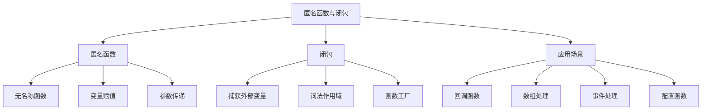

# 匿名函数与闭包

## 🎯 学习目标
- 理解匿名函数和闭包的概念和区别
- 掌握匿名函数的定义和使用方法
- 学会使用闭包捕获外部变量
- 了解匿名函数和闭包在实际开发中的应用

## 📚 核心概念

### 匿名函数与闭包概述



### 匿名函数与闭包对比

| 特性 | 匿名函数 | 闭包 | 说明 |
|------|----------|------|------|
| 定义方式 | `function() {}` | `function() use ($var) {}` | 闭包使用use关键字 |
| 变量访问 | 只能访问参数 | 可以访问外部变量 | 闭包可以捕获外部变量 |
| 内存管理 | 函数执行完释放 | 保持外部变量引用 | 闭包会延长变量生命周期 |
| 使用场景 | 简单回调 | 复杂逻辑 | 闭包适合复杂场景 |

## 🔧 匿名函数基础

### 基本语法
```php
<?php
// 基本匿名函数
$greet = function($name) {
    return "Hello, $name!";
};

echo $greet("John"); // 输出: Hello, John!

// 匿名函数作为变量
$add = function($a, $b) {
    return $a + $b;
};

echo $add(5, 3); // 输出: 8

// 匿名函数作为数组元素
$operations = [
    'add' => function($a, $b) { return $a + $b; },
    'subtract' => function($a, $b) { return $a - $b; },
    'multiply' => function($a, $b) { return $a * $b; },
    'divide' => function($a, $b) { return $b != 0 ? $a / $b : 0; }
];

echo $operations['add'](10, 5); // 输出: 15
echo $operations['multiply'](4, 3); // 输出: 12

// 匿名函数作为对象属性
class Calculator {
    public $operation;
    
    public function __construct() {
        $this->operation = function($a, $b) {
            return $a + $b;
        };
    }
}

$calc = new Calculator();
echo ($calc->operation)(5, 3); // 输出: 8
?>
```

### 匿名函数作为参数
```php
<?php
// 回调函数
function processArray($array, $callback) {
    $result = [];
    foreach ($array as $item) {
        $result[] = $callback($item);
    }
    return $result;
}

$numbers = [1, 2, 3, 4, 5];

// 使用匿名函数
$squared = processArray($numbers, function($n) {
    return $n * $n;
});

print_r($squared); // 输出: [1, 4, 9, 16, 25]

// 过滤函数
function filterArray($array, $predicate) {
    $result = [];
    foreach ($array as $item) {
        if ($predicate($item)) {
            $result[] = $item;
        }
    }
    return $result;
}

$evens = filterArray($numbers, function($n) {
    return $n % 2 === 0;
});

print_r($evens); // 输出: [2, 4]

// 排序函数
function sortArray($array, $comparator) {
    usort($array, $comparator);
    return $array;
}

$users = [
    ['name' => 'John', 'age' => 25],
    ['name' => 'Jane', 'age' => 30],
    ['name' => 'Bob', 'age' => 20]
];

$sorted = sortArray($users, function($a, $b) {
    return $a['age'] - $b['age'];
});

print_r($sorted);
?>
```

### 匿名函数作为返回值
```php
<?php
// 函数工厂
function createMultiplier($factor) {
    return function($number) use ($factor) {
        return $number * $factor;
    };
}

$double = createMultiplier(2);
$triple = createMultiplier(3);

echo $double(5); // 输出: 10
echo $triple(5); // 输出: 15

// 条件函数
function createValidator($type) {
    switch ($type) {
        case 'email':
            return function($value) {
                return filter_var($value, FILTER_VALIDATE_EMAIL) !== false;
            };
        case 'number':
            return function($value) {
                return is_numeric($value);
            };
        case 'required':
            return function($value) {
                return !empty($value);
            };
        default:
            return function($value) {
                return true;
            };
    }
}

$emailValidator = createValidator('email');
$numberValidator = createValidator('number');

echo $emailValidator('test@example.com') ? '有效' : '无效'; // 输出: 有效
echo $numberValidator('123') ? '有效' : '无效'; // 输出: 有效

// 配置函数
function createConfig($settings) {
    return function($key, $default = null) use ($settings) {
        return $settings[$key] ?? $default;
    };
}

$config = createConfig([
    'app_name' => 'My App',
    'debug' => true,
    'version' => '1.0.0'
]);

echo $config('app_name'); // 输出: My App
echo $config('debug') ? '开启' : '关闭'; // 输出: 开启
echo $config('nonexistent', 'default'); // 输出: default
?>
```

## 🔒 闭包详解

### 基本闭包
```php
<?php
// 基本闭包
function createCounter() {
    $count = 0;
    
    return function() use (&$count) {
        return ++$count;
    };
}

$counter = createCounter();
echo $counter(); // 输出: 1
echo $counter(); // 输出: 2
echo $counter(); // 输出: 3

// 多个闭包共享变量
function createCounters() {
    $count = 0;
    
    return [
        'increment' => function() use (&$count) {
            return ++$count;
        },
        'decrement' => function() use (&$count) {
            return --$count;
        },
        'get' => function() use (&$count) {
            return $count;
        }
    ];
}

$counters = createCounters();
echo $counters['increment'](); // 输出: 1
echo $counters['increment'](); // 输出: 2
echo $counters['decrement'](); // 输出: 1
echo $counters['get'](); // 输出: 1
?>
```

### 闭包捕获变量
```php
<?php
// 值捕获
function createValueCapture() {
    $value = 10;
    
    return function() use ($value) {
        return $value;
    };
}

$capture = createValueCapture();
echo $capture(); // 输出: 10

// 引用捕获
function createReferenceCapture() {
    $value = 10;
    
    return function() use (&$value) {
        return $value;
    };
}

$refCapture = createReferenceCapture();
echo $refCapture(); // 输出: 10

// 修改外部变量
function createModifier() {
    $value = 0;
    
    return [
        'get' => function() use (&$value) {
            return $value;
        },
        'set' => function($newValue) use (&$value) {
            $value = $newValue;
        },
        'increment' => function() use (&$value) {
            $value++;
        }
    ];
}

$modifier = createModifier();
echo $modifier['get'](); // 输出: 0
$modifier['set'](5);
echo $modifier['get'](); // 输出: 5
$modifier['increment']();
echo $modifier['get'](); // 输出: 6
?>
```

### 复杂闭包应用
```php
<?php
// 缓存闭包
function createCache() {
    $cache = [];
    
    return function($key, $value = null) use (&$cache) {
        if ($value !== null) {
            // 设置缓存
            $cache[$key] = $value;
            return $value;
        } else {
            // 获取缓存
            return $cache[$key] ?? null;
        }
    };
}

$cache = createCache();
$cache('user:1', ['name' => 'John', 'age' => 25]);
$user = $cache('user:1');
print_r($user);

// 事件系统
function createEventSystem() {
    $listeners = [];
    
    return [
        'on' => function($event, $callback) use (&$listeners) {
            $listeners[$event][] = $callback;
        },
        'emit' => function($event, $data = null) use (&$listeners) {
            if (isset($listeners[$event])) {
                foreach ($listeners[$event] as $callback) {
                    $callback($data);
                }
            }
        },
        'off' => function($event, $callback = null) use (&$listeners) {
            if ($callback === null) {
                unset($listeners[$event]);
            } else {
                $key = array_search($callback, $listeners[$event]);
                if ($key !== false) {
                    unset($listeners[$event][$key]);
                }
            }
        }
    ];
}

$events = createEventSystem();

// 注册事件监听器
$events['on']('user.login', function($user) {
    echo "用户 {$user['name']} 登录了\n";
});

$events['on']('user.logout', function($user) {
    echo "用户 {$user['name']} 退出了\n";
});

// 触发事件
$events['emit']('user.login', ['name' => 'John']);
$events['emit']('user.logout', ['name' => 'John']);
?>
```

## 🎯 实际应用示例

### 数组处理
```php
<?php
class ArrayProcessor {
    // 使用匿名函数处理数组
    public static function map($array, $callback) {
        $result = [];
        foreach ($array as $key => $value) {
            $result[$key] = $callback($value, $key);
        }
        return $result;
    }
    
    public static function filter($array, $predicate) {
        $result = [];
        foreach ($array as $key => $value) {
            if ($predicate($value, $key)) {
                $result[$key] = $value;
            }
        }
        return $result;
    }
    
    public static function reduce($array, $callback, $initial = null) {
        $accumulator = $initial;
        foreach ($array as $key => $value) {
            $accumulator = $callback($accumulator, $value, $key);
        }
        return $accumulator;
    }
    
    // 链式操作
    public static function chain($array) {
        return new ArrayChain($array);
    }
}

class ArrayChain {
    private $array;
    
    public function __construct($array) {
        $this->array = $array;
    }
    
    public function map($callback) {
        $this->array = ArrayProcessor::map($this->array, $callback);
        return $this;
    }
    
    public function filter($predicate) {
        $this->array = ArrayProcessor::filter($this->array, $predicate);
        return $this;
    }
    
    public function reduce($callback, $initial = null) {
        $this->array = ArrayProcessor::reduce($this->array, $callback, $initial);
        return $this;
    }
    
    public function value() {
        return $this->array;
    }
}

// 使用示例
$numbers = [1, 2, 3, 4, 5, 6, 7, 8, 9, 10];

// 传统方式
$squared = ArrayProcessor::map($numbers, function($n) {
    return $n * $n;
});

$evens = ArrayProcessor::filter($squared, function($n) {
    return $n % 2 === 0;
});

$sum = ArrayProcessor::reduce($evens, function($acc, $n) {
    return $acc + $n;
}, 0);

echo $sum; // 输出: 220

// 链式操作
$result = ArrayProcessor::chain($numbers)
    ->map(function($n) { return $n * $n; })
    ->filter(function($n) { return $n % 2 === 0; })
    ->reduce(function($acc, $n) { return $acc + $n; }, 0)
    ->value();

echo $result; // 输出: 220
?>
```

### 配置管理
```php
<?php
class ConfigManager {
    private $config = [];
    private $callbacks = [];
    
    public function __construct($initialConfig = []) {
        $this->config = $initialConfig;
    }
    
    public function set($key, $value) {
        $this->config[$key] = $value;
        $this->notify($key, $value);
    }
    
    public function get($key, $default = null) {
        return $this->config[$key] ?? $default;
    }
    
    public function watch($key, $callback) {
        $this->callbacks[$key][] = $callback;
    }
    
    private function notify($key, $value) {
        if (isset($this->callbacks[$key])) {
            foreach ($this->callbacks[$key] as $callback) {
                $callback($value);
            }
        }
    }
    
    public function createGetter($key, $default = null) {
        return function() use ($key, $default) {
            return $this->get($key, $default);
        };
    }
    
    public function createSetter($key) {
        return function($value) use ($key) {
            $this->set($key, $value);
        };
    }
}

// 使用示例
$config = new ConfigManager([
    'app_name' => 'My App',
    'debug' => true,
    'version' => '1.0.0'
]);

// 创建getter和setter
$getAppName = $config->createGetter('app_name');
$setDebug = $config->createSetter('debug');

echo $getAppName(); // 输出: My App
$setDebug(false);
echo $config->get('debug') ? '开启' : '关闭'; // 输出: 关闭

// 监听配置变化
$config->watch('debug', function($value) {
    echo "调试模式已" . ($value ? '开启' : '关闭') . "\n";
});

$config->set('debug', true); // 输出: 调试模式已开启
?>
```

### 中间件系统
```php
<?php
class MiddlewareStack {
    private $middlewares = [];
    
    public function add($middleware) {
        $this->middlewares[] = $middleware;
        return $this;
    }
    
    public function execute($request, $response) {
        $index = 0;
        
        $next = function($req, $res) use (&$index, &$next) {
            if ($index >= count($this->middlewares)) {
                return $res;
            }
            
            $middleware = $this->middlewares[$index++];
            return $middleware($req, $res, $next);
        };
        
        return $next($request, $response);
    }
}

// 使用示例
$stack = new MiddlewareStack();

// 添加中间件
$stack->add(function($request, $response, $next) {
    echo "中间件1: 开始\n";
    $response = $next($request, $response);
    echo "中间件1: 结束\n";
    return $response;
});

$stack->add(function($request, $response, $next) {
    echo "中间件2: 开始\n";
    $response = $next($request, $response);
    echo "中间件2: 结束\n";
    return $response;
});

$stack->add(function($request, $response, $next) {
    echo "中间件3: 处理请求\n";
    return $response;
});

// 执行中间件栈
$request = ['method' => 'GET', 'path' => '/'];
$response = ['status' => 200, 'body' => ''];

$result = $stack->execute($request, $response);
?>
```

## 📊 最佳实践

### 匿名函数最佳实践
```php
<?php
// 1. 使用类型提示
function processData(array $data, callable $processor) {
    return $processor($data);
}

// 2. 避免过长的匿名函数
// 不好的做法
$result = array_map(function($item) {
    // 很长的处理逻辑
    if ($item['type'] === 'user') {
        if ($item['status'] === 'active') {
            if ($item['role'] === 'admin') {
                // 更多逻辑...
            }
        }
    }
    return $item;
}, $items);

// 好的做法
function processUser($item) {
    // 处理逻辑
    return $item;
}

$result = array_map('processUser', $items);

// 3. 使用有意义的变量名
$isValid = function($value) {
    return !empty($value) && is_string($value);
};

$formatName = function($name) {
    return ucwords(strtolower(trim($name)));
};

// 4. 避免在循环中创建匿名函数
// 不好的做法
foreach ($items as $item) {
    $callback = function($x) { return $x * 2; };
    $result = $callback($item);
}

// 好的做法
$callback = function($x) { return $x * 2; };
foreach ($items as $item) {
    $result = $callback($item);
}
?>
```

### 闭包最佳实践
```php
<?php
// 1. 明确变量捕获
function createCounter() {
    $count = 0;
    
    return function() use (&$count) {
        return ++$count;
    };
}

// 2. 避免内存泄漏
function createHandler() {
    $largeData = str_repeat('x', 1000000);
    
    return function() use ($largeData) {
        // 使用$largeData
        return strlen($largeData);
    };
}

// 3. 使用弱引用
function createWeakHandler() {
    $largeData = str_repeat('x', 1000000);
    
    return function() use (&$largeData) {
        // 使用后释放
        $result = strlen($largeData);
        $largeData = null;
        return $result;
    };
}

// 4. 错误处理
function createSafeHandler() {
    $data = [];
    
    return function($key, $value = null) use (&$data) {
        try {
            if ($value !== null) {
                $data[$key] = $value;
            }
            return $data[$key] ?? null;
        } catch (Exception $e) {
            error_log("Handler error: " . $e->getMessage());
            return null;
        }
    };
}
?>
```

## 🎓 学习建议

### 费曼学习法应用
1. **选择概念**: 选择匿名函数和闭包中的核心概念
2. **简化解释**: 用简单语言解释匿名函数和闭包的作用
3. **识别盲点**: 发现理解不深入的地方
4. **重新学习**: 针对盲点进行深入学习

### 刻意练习重点
1. **匿名函数**: 练习使用匿名函数处理数据
2. **闭包**: 掌握闭包的变量捕获机制
3. **实际应用**: 在实际项目中应用匿名函数和闭包
4. **性能优化**: 了解匿名函数和闭包的性能特点

## 🔗 相关链接
- [[01-函数基础|函数基础]]
- [[02-内置函数分类|内置函数分类]]
- [[03-自定义函数|自定义函数]]
- [[05-函数参数详解|函数参数详解]]
- [[02-核心理解层/数组与字符串/01-数组基础|数组基础]]
