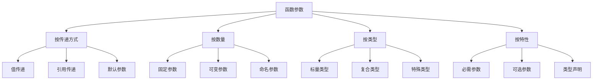

# 函数参数详解

## 🎯 学习目标
- 理解PHP函数参数的各种类型和特性
- 掌握参数传递方式：值传递、引用传递、默认参数
- 学会使用可变参数、命名参数和类型声明
- 了解参数验证和错误处理的最佳实践

## 📚 核心概念

### 函数参数类型体系



### 参数类型对比

| 参数类型 | 传递方式 | 修改原值 | 内存使用 | 适用场景 |
|----------|----------|----------|----------|----------|
| 值传递 | 复制值 | 否 | 较高 | 基本数据类型 |
| 引用传递 | 传递地址 | 是 | 较低 | 大对象、数组 |
| 默认参数 | 可选值 | 否 | 中等 | 可选配置 |
| 可变参数 | 数组 | 否 | 较高 | 不定数量参数 |

## 🔧 参数传递方式

### 值传递
```php
<?php
// 基本值传递
function modifyValue($value) {
    $value = $value * 2;
    return $value;
}

$number = 10;
$result = modifyValue($number);
echo $number; // 输出: 10 (原值不变)
echo $result; // 输出: 20

// 数组值传递
function modifyArray($array) {
    $array[0] = 'modified';
    return $array;
}

$original = ['a', 'b', 'c'];
$modified = modifyArray($original);
print_r($original); // 输出: ['a', 'b', 'c'] (原数组不变)
print_r($modified); // 输出: ['modified', 'b', 'c']

// 对象值传递
class Person {
    public $name;
    
    public function __construct($name) {
        $this->name = $name;
    }
}

function modifyPerson($person) {
    $person->name = 'Modified';
    return $person;
}

$person = new Person('John');
$modified = modifyPerson($person);
echo $person->name; // 输出: Modified (对象是引用传递)
echo $modified->name; // 输出: Modified
?>
```

### 引用传递
```php
<?php
// 基本引用传递
function modifyReference(&$value) {
    $value = $value * 2;
}

$number = 10;
modifyReference($number);
echo $number; // 输出: 20 (原值被修改)

// 数组引用传递
function modifyArrayReference(&$array) {
    $array[0] = 'modified';
}

$original = ['a', 'b', 'c'];
modifyArrayReference($original);
print_r($original); // 输出: ['modified', 'b', 'c'] (原数组被修改)

// 引用传递的优势
function swap(&$a, &$b) {
    $temp = $a;
    $a = $b;
    $b = $temp;
}

$x = 10;
$y = 20;
swap($x, $y);
echo "x: $x, y: $y"; // 输出: x: 20, y: 10

// 引用传递的性能优势
function processLargeArray(&$array) {
    // 直接修改原数组，避免复制
    foreach ($array as &$item) {
        $item = strtoupper($item);
    }
}

$largeArray = array_fill(0, 10000, 'test');
processLargeArray($largeArray);
// 原数组被直接修改，节省内存
?>
```

### 默认参数
```php
<?php
// 基本默认参数
function greet($name, $greeting = 'Hello') {
    return "$greeting, $name!";
}

echo greet('John'); // 输出: Hello, John!
echo greet('Jane', 'Hi'); // 输出: Hi, Jane!

// 多个默认参数
function createUser($name, $email, $age = 18, $role = 'user') {
    return [
        'name' => $name,
        'email' => $email,
        'age' => $age,
        'role' => $role
    ];
}

$user1 = createUser('John', 'john@example.com');
$user2 = createUser('Jane', 'jane@example.com', 25);
$user3 = createUser('Bob', 'bob@example.com', 30, 'admin');

print_r($user1);
print_r($user2);
print_r($user3);

// 默认参数的计算
function getCurrentTime($format = null) {
    if ($format === null) {
        $format = 'Y-m-d H:i:s';
    }
    return date($format);
}

echo getCurrentTime(); // 输出: 2024-01-15 14:30:25
echo getCurrentTime('Y-m-d'); // 输出: 2024-01-15

// 默认参数使用函数调用
function logMessage($message, $timestamp = null) {
    if ($timestamp === null) {
        $timestamp = time();
    }
    return "[$timestamp] $message";
}

echo logMessage('Test message');
echo logMessage('Test message', 1642248000);
?>
```

## 📝 可变参数

### 基本可变参数
```php
<?php
// 使用...语法
function sum(...$numbers) {
    $total = 0;
    foreach ($numbers as $number) {
        $total += $number;
    }
    return $total;
}

echo sum(1, 2, 3, 4, 5); // 输出: 15
echo sum(10, 20); // 输出: 30
echo sum(); // 输出: 0

// 混合参数
function formatMessage($template, ...$args) {
    return sprintf($template, ...$args);
}

echo formatMessage('Hello %s, you have %d messages', 'John', 5);
// 输出: Hello John, you have 5 messages

// 类型声明
function addNumbers(int ...$numbers): int {
    return array_sum($numbers);
}

echo addNumbers(1, 2, 3, 4, 5); // 输出: 15

// 使用func_get_args() (旧方式)
function oldStyleSum() {
    $args = func_get_args();
    return array_sum($args);
}

echo oldStyleSum(1, 2, 3, 4, 5); // 输出: 15
?>
```

### 可变参数应用
```php
<?php
// 数据库查询构建器
function buildQuery($table, ...$conditions) {
    $query = "SELECT * FROM $table";
    
    if (!empty($conditions)) {
        $query .= " WHERE " . implode(' AND ', $conditions);
    }
    
    return $query;
}

echo buildQuery('users', 'age > 18', 'status = "active"');
// 输出: SELECT * FROM users WHERE age > 18 AND status = "active"

// 事件系统
function emit($event, ...$args) {
    global $listeners;
    
    if (isset($listeners[$event])) {
        foreach ($listeners[$event] as $listener) {
            $listener(...$args);
        }
    }
}

function on($event, $callback) {
    global $listeners;
    $listeners[$event][] = $callback;
}

// 使用示例
on('user.login', function($user, $ip, $timestamp) {
    echo "用户 {$user['name']} 从 $ip 登录，时间: $timestamp\n";
});

emit('user.login', ['name' => 'John'], '192.168.1.1', time());

// 配置合并
function mergeConfigs(...$configs) {
    $result = [];
    
    foreach ($configs as $config) {
        $result = array_merge($result, $config);
    }
    
    return $result;
}

$default = ['debug' => false, 'timeout' => 30];
$user = ['debug' => true];
$env = ['timeout' => 60];

$final = mergeConfigs($default, $user, $env);
print_r($final); // 输出: ['debug' => true, 'timeout' => 60]
?>
```

## 🏷️ 命名参数 (PHP 8+)

### 基本命名参数
```php
<?php
// 定义函数
function createUser($name, $email, $age = 18, $role = 'user', $active = true) {
    return [
        'name' => $name,
        'email' => $email,
        'age' => $age,
        'role' => $role,
        'active' => $active
    ];
}

// 使用命名参数
$user = createUser(
    name: 'John Doe',
    email: 'john@example.com',
    role: 'admin',
    active: true
);

print_r($user);

// 混合使用位置参数和命名参数
$user2 = createUser(
    'Jane Doe', // 位置参数
    'jane@example.com', // 位置参数
    role: 'editor', // 命名参数
    active: false // 命名参数
);

print_r($user2);

// 跳过默认参数
$user3 = createUser(
    name: 'Bob Smith',
    email: 'bob@example.com',
    active: false // 跳过age和role参数
);

print_r($user3);
?>
```

### 命名参数高级应用
```php
<?php
// 配置函数
function configureApp(
    $name,
    $version = '1.0.0',
    $debug = false,
    $timeout = 30,
    $cache = true,
    $logLevel = 'info'
) {
    return [
        'name' => $name,
        'version' => $version,
        'debug' => $debug,
        'timeout' => $timeout,
        'cache' => $cache,
        'logLevel' => $logLevel
    ];
}

// 使用命名参数提高可读性
$config = configureApp(
    name: 'My Application',
    version: '2.0.0',
    debug: true,
    timeout: 60,
    logLevel: 'debug'
);

print_r($config);

// 数据库连接函数
function connectDatabase(
    $host,
    $database,
    $username,
    $password,
    $port = 3306,
    $charset = 'utf8mb4',
    $timeout = 30,
    $ssl = false
) {
    return [
        'host' => $host,
        'database' => $database,
        'username' => $username,
        'password' => $password,
        'port' => $port,
        'charset' => $charset,
        'timeout' => $timeout,
        'ssl' => $ssl
    ];
}

// 使用命名参数
$dbConfig = connectDatabase(
    host: 'localhost',
    database: 'myapp',
    username: 'root',
    password: 'secret',
    charset: 'utf8',
    ssl: true
);

print_r($dbConfig);
?>
```

## 🔍 类型声明

### 基本类型声明
```php
<?php
// 标量类型声明
function add(int $a, int $b): int {
    return $a + $b;
}

function greet(string $name): string {
    return "Hello, $name!";
}

function isActive(bool $status): bool {
    return $status;
}

function calculate(float $price, float $tax): float {
    return $price * (1 + $tax);
}

// 使用示例
echo add(5, 3); // 输出: 8
echo greet('John'); // 输出: Hello, John!
echo isActive(true) ? '是' : '否'; // 输出: 是
echo calculate(100.0, 0.1); // 输出: 110

// 数组类型声明
function processArray(array $data): array {
    return array_map('strtoupper', $data);
}

$result = processArray(['hello', 'world']);
print_r($result); // 输出: ['HELLO', 'WORLD']

// 可空类型声明
function findUser(?int $id): ?array {
    if ($id === null) {
        return null;
    }
    
    // 模拟查找
    if ($id === 1) {
        return ['id' => 1, 'name' => 'John'];
    }
    
    return null;
}

$user = findUser(1);
$user2 = findUser(null);
?>
```

### 高级类型声明
```php
<?php
// 联合类型 (PHP 8+)
function processValue(int|string $value): string {
    return (string) $value;
}

echo processValue(123); // 输出: 123
echo processValue('hello'); // 输出: hello

// 交集类型 (PHP 8.1+)
interface Countable {
    public function count(): int;
}

interface Iterator {
    public function current();
    public function next();
    public function valid(): bool;
}

function processIterable(Countable&Iterator $iterable): int {
    return $iterable->count();
}

// 混合类型
function processMixed(mixed $value): string {
    if (is_array($value)) {
        return json_encode($value);
    }
    
    return (string) $value;
}

echo processMixed([1, 2, 3]); // 输出: [1,2,3]
echo processMixed('hello'); // 输出: hello

// 回调类型
function processCallback(callable $callback, $data) {
    return $callback($data);
}

$result = processCallback(function($x) {
    return $x * 2;
}, 5);

echo $result; // 输出: 10
?>
```

## 🎯 实际应用示例

### 参数验证系统
```php
<?php
class ParameterValidator {
    public static function validate($params, $rules) {
        $errors = [];
        
        foreach ($rules as $param => $rule) {
            $value = $params[$param] ?? null;
            $paramErrors = self::validateParameter($param, $value, $rule);
            $errors = array_merge($errors, $paramErrors);
        }
        
        return $errors;
    }
    
    private static function validateParameter($param, $value, $rule) {
        $errors = [];
        
        // 必需检查
        if (isset($rule['required']) && $rule['required'] && $value === null) {
            $errors[] = "参数 $param 是必需的";
            return $errors;
        }
        
        // 如果值为null且不是必需的，跳过其他验证
        if ($value === null) {
            return $errors;
        }
        
        // 类型检查
        if (isset($rule['type'])) {
            if (!self::checkType($value, $rule['type'])) {
                $errors[] = "参数 $param 必须是 " . $rule['type'] . " 类型";
            }
        }
        
        // 范围检查
        if (isset($rule['min']) && $value < $rule['min']) {
            $errors[] = "参数 $param 不能小于 " . $rule['min'];
        }
        
        if (isset($rule['max']) && $value > $rule['max']) {
            $errors[] = "参数 $param 不能大于 " . $rule['max'];
        }
        
        // 长度检查
        if (isset($rule['min_length']) && strlen($value) < $rule['min_length']) {
            $errors[] = "参数 $param 长度不能少于 " . $rule['min_length'] . " 个字符";
        }
        
        if (isset($rule['max_length']) && strlen($value) > $rule['max_length']) {
            $errors[] = "参数 $param 长度不能超过 " . $rule['max_length'] . " 个字符";
        }
        
        // 正则检查
        if (isset($rule['pattern']) && !preg_match($rule['pattern'], $value)) {
            $errors[] = "参数 $param 格式不正确";
        }
        
        // 自定义验证
        if (isset($rule['custom']) && is_callable($rule['custom'])) {
            $customResult = $rule['custom']($value);
            if ($customResult !== true) {
                $errors[] = $customResult ?: "参数 $param 验证失败";
            }
        }
        
        return $errors;
    }
    
    private static function checkType($value, $type) {
        switch ($type) {
            case 'int':
                return is_int($value) || (is_string($value) && is_numeric($value));
            case 'float':
                return is_float($value) || is_numeric($value);
            case 'string':
                return is_string($value);
            case 'bool':
                return is_bool($value);
            case 'array':
                return is_array($value);
            case 'email':
                return filter_var($value, FILTER_VALIDATE_EMAIL) !== false;
            case 'url':
                return filter_var($value, FILTER_VALIDATE_URL) !== false;
            default:
                return true;
        }
    }
}

// 使用示例
function createUser($name, $email, $age, $role = 'user') {
    $params = compact('name', 'email', 'age', 'role');
    
    $rules = [
        'name' => [
            'required' => true,
            'type' => 'string',
            'min_length' => 2,
            'max_length' => 50
        ],
        'email' => [
            'required' => true,
            'type' => 'email'
        ],
        'age' => [
            'required' => true,
            'type' => 'int',
            'min' => 18,
            'max' => 100
        ],
        'role' => [
            'required' => false,
            'type' => 'string',
            'custom' => function($value) {
                return in_array($value, ['user', 'admin', 'editor']) ? true : '角色必须是user、admin或editor';
            }
        ]
    ];
    
    $errors = ParameterValidator::validate($params, $rules);
    
    if (!empty($errors)) {
        throw new InvalidArgumentException(implode(', ', $errors));
    }
    
    return $params;
}

try {
    $user = createUser('John Doe', 'john@example.com', 25, 'admin');
    print_r($user);
} catch (InvalidArgumentException $e) {
    echo "错误: " . $e->getMessage();
}
?>
```

### 函数装饰器
```php
<?php
class FunctionDecorator {
    // 参数验证装饰器
    public static function validateParams($rules) {
        return function($function) use ($rules) {
            return function(...$args) use ($function, $rules) {
                $errors = ParameterValidator::validate($args, $rules);
                if (!empty($errors)) {
                    throw new InvalidArgumentException(implode(', ', $errors));
                }
                return $function(...$args);
            };
        };
    }
    
    // 缓存装饰器
    public static function cache($ttl = 3600) {
        return function($function) use ($ttl) {
            return function(...$args) use ($function, $ttl) {
                $key = md5(serialize($args));
                $cache = apcu_fetch($key);
                
                if ($cache !== false) {
                    return $cache;
                }
                
                $result = $function(...$args);
                apcu_store($key, $result, $ttl);
                
                return $result;
            };
        };
    }
    
    // 日志装饰器
    public static function log($logger = null) {
        return function($function) use ($logger) {
            return function(...$args) use ($function, $logger) {
                $start = microtime(true);
                $result = $function(...$args);
                $duration = microtime(true) - $start;
                
                if ($logger) {
                    $logger("函数执行时间: {$duration}s, 参数: " . json_encode($args));
                }
                
                return $result;
            };
        };
    }
    
    // 重试装饰器
    public static function retry($maxAttempts = 3, $delay = 1000) {
        return function($function) use ($maxAttempts, $delay) {
            return function(...$args) use ($function, $maxAttempts, $delay) {
                $attempts = 0;
                
                while ($attempts < $maxAttempts) {
                    try {
                        return $function(...$args);
                    } catch (Exception $e) {
                        $attempts++;
                        if ($attempts >= $maxAttempts) {
                            throw $e;
                        }
                        usleep($delay * 1000);
                    }
                }
            };
        };
    }
}

// 使用示例
function expensiveCalculation($n) {
    // 模拟昂贵计算
    sleep(1);
    return $n * $n;
}

// 应用装饰器
$decoratedFunction = FunctionDecorator::cache(300)(
    FunctionDecorator::log(function($message) {
        echo $message . "\n";
    })(
        FunctionDecorator::retry(3, 1000)(
            'expensiveCalculation'
        )
    )
);

$result = $decoratedFunction(5);
echo "结果: $result\n";
?>
```

## 📊 最佳实践

### 参数设计最佳实践
```php
<?php
// 1. 参数数量控制
// 不好的做法：参数过多
function createUser($name, $email, $age, $phone, $address, $city, $country, $zipcode) {
    // 函数体
}

// 好的做法：使用数组或对象
function createUser(array $userData) {
    $required = ['name', 'email'];
    foreach ($required as $field) {
        if (empty($userData[$field])) {
            throw new InvalidArgumentException("缺少必需字段: $field");
        }
    }
    // 处理逻辑
}

// 2. 参数顺序
// 好的做法：必需参数在前，可选参数在后
function processData($data, $options = []) {
    // 处理逻辑
}

// 3. 类型声明
function calculateTotal(array $items, float $tax = 0.1): float {
    $subtotal = array_sum(array_column($items, 'price'));
    return $subtotal * (1 + $tax);
}

// 4. 参数验证
function divide(float $a, float $b): float {
    if ($b == 0) {
        throw new DivisionByZeroError('除数不能为零');
    }
    return $a / $b;
}

// 5. 默认值设计
function formatDate($date, $format = 'Y-m-d H:i:s', $timezone = 'UTC') {
    $dt = new DateTime($date);
    $dt->setTimezone(new DateTimeZone($timezone));
    return $dt->format($format);
}
?>
```

### 性能优化建议
```php
<?php
// 1. 避免在函数中修改大数组
// 不好的做法
function processLargeArray($array) {
    foreach ($array as $key => $value) {
        $array[$key] = strtoupper($value);
    }
    return $array;
}

// 好的做法：使用引用传递
function processLargeArray(&$array) {
    foreach ($array as &$value) {
        $value = strtoupper($value);
    }
}

// 2. 使用类型声明提高性能
function fastAdd(int $a, int $b): int {
    return $a + $b;
}

// 3. 避免不必要的参数复制
function processData(array &$data) {
    // 直接修改原数组
    $data['processed'] = true;
}

// 4. 使用默认参数避免重复计算
function getConfig($key, $default = null) {
    static $config = null;
    
    if ($config === null) {
        $config = include 'config.php';
    }
    
    return $config[$key] ?? $default;
}
?>
```

## 🎓 学习建议

### 费曼学习法应用
1. **选择概念**: 选择函数参数中的核心概念
2. **简化解释**: 用简单语言解释参数传递的机制
3. **识别盲点**: 发现理解不深入的地方
4. **重新学习**: 针对盲点进行深入学习

### 刻意练习重点
1. **参数设计**: 练习设计合理的函数参数
2. **类型声明**: 掌握各种类型声明的用法
3. **参数验证**: 学会参数验证的最佳实践
4. **性能优化**: 了解参数对性能的影响

## 🔗 相关链接
- [[01-函数基础|函数基础]]
- [[02-内置函数分类|内置函数分类]]
- [[03-自定义函数|自定义函数]]
- [[04-匿名函数与闭包|匿名函数与闭包]]
- [[01-基础认知层/语法基础/02-数据类型详解|数据类型详解]]
