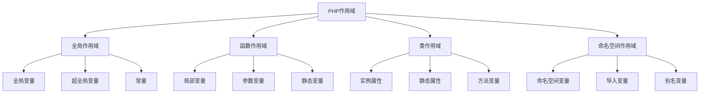

# 函数作用域与生命周期

## 🎯 学习目标
- 理解PHP函数作用域的概念和规则
- 掌握全局变量、局部变量和静态变量的使用
- 学会使用global关键字和$GLOBALS数组
- 了解函数生命周期和内存管理

## 📚 核心概念

### 作用域体系



### 作用域对比

| 作用域类型 | 变量类型 | 访问范围 | 生命周期 | 内存位置 |
|------------|----------|----------|----------|----------|
| 全局作用域 | 全局变量 | 整个脚本 | 脚本执行期间 | 全局内存 |
| 函数作用域 | 局部变量 | 函数内部 | 函数执行期间 | 栈内存 |
| 静态作用域 | 静态变量 | 函数内部 | 脚本执行期间 | 静态内存 |
| 类作用域 | 属性变量 | 类内部 | 对象生命周期 | 堆内存 |

## 🌍 全局作用域

### 全局变量
```php
<?php
// 全局变量定义
$globalVar = "我是全局变量";
$globalNumber = 100;

function testGlobal() {
    // 在函数内部访问全局变量
    global $globalVar, $globalNumber;
    
    echo $globalVar . "\n"; // 输出: 我是全局变量
    echo $globalNumber . "\n"; // 输出: 100
    
    // 修改全局变量
    $globalVar = "修改后的全局变量";
    $globalNumber = 200;
}

testGlobal();
echo $globalVar . "\n"; // 输出: 修改后的全局变量
echo $globalNumber . "\n"; // 输出: 200

// 使用$GLOBALS数组
function testGlobals() {
    echo $GLOBALS['globalVar'] . "\n"; // 输出: 修改后的全局变量
    echo $GLOBALS['globalNumber'] . "\n"; // 输出: 200
    
    // 修改全局变量
    $GLOBALS['globalVar'] = "通过GLOBALS修改";
    $GLOBALS['globalNumber'] = 300;
}

testGlobals();
echo $globalVar . "\n"; // 输出: 通过GLOBALS修改
echo $globalNumber . "\n"; // 输出: 300
?>
```

### 超全局变量
```php
<?php
// 超全局变量示例
function showSuperGlobals() {
    echo "GET参数: " . print_r($_GET, true) . "\n";
    echo "POST参数: " . print_r($_POST, true) . "\n";
    echo "COOKIE: " . print_r($_COOKIE, true) . "\n";
    echo "SESSION: " . print_r($_SESSION, true) . "\n";
    echo "SERVER信息: " . print_r($_SERVER, true) . "\n";
    echo "FILES: " . print_r($_FILES, true) . "\n";
    echo "ENV: " . print_r($_ENV, true) . "\n";
    echo "REQUEST: " . print_r($_REQUEST, true) . "\n";
}

// 使用超全局变量
function processRequest() {
    $method = $_SERVER['REQUEST_METHOD'];
    $uri = $_SERVER['REQUEST_URI'];
    
    echo "请求方法: $method\n";
    echo "请求URI: $uri\n";
    
    if ($method === 'GET') {
        $params = $_GET;
    } elseif ($method === 'POST') {
        $params = $_POST;
    } else {
        $params = $_REQUEST;
    }
    
    return $params;
}

// 会话管理
function startSession() {
    if (session_status() === PHP_SESSION_NONE) {
        session_start();
    }
}

function setSessionData($key, $value) {
    startSession();
    $_SESSION[$key] = $value;
}

function getSessionData($key, $default = null) {
    startSession();
    return $_SESSION[$key] ?? $default;
}

// 使用示例
setSessionData('user_id', 123);
setSessionData('username', 'john');
echo getSessionData('username'); // 输出: john
?>
```

## 🏠 函数作用域

### 局部变量
```php
<?php
// 局部变量示例
function testLocalScope() {
    $localVar = "我是局部变量";
    $localNumber = 42;
    
    echo $localVar . "\n"; // 输出: 我是局部变量
    echo $localNumber . "\n"; // 输出: 42
    
    // 局部变量只在函数内部有效
    function innerFunction() {
        // echo $localVar; // 错误：无法访问外部函数的局部变量
        $innerVar = "我是内部函数变量";
        echo $innerVar . "\n"; // 输出: 我是内部函数变量
    }
    
    innerFunction();
}

testLocalScope();
// echo $localVar; // 错误：无法访问函数内部的局部变量

// 参数变量
function processData($data, $options = []) {
    // $data 和 $options 是局部变量
    echo "处理数据: " . print_r($data, true) . "\n";
    echo "选项: " . print_r($options, true) . "\n";
    
    // 修改参数不会影响原变量（值传递）
    $data = "修改后的数据";
    $options['processed'] = true;
    
    return [$data, $options];
}

$originalData = "原始数据";
$originalOptions = ['debug' => true];

$result = processData($originalData, $originalOptions);
echo $originalData . "\n"; // 输出: 原始数据（未改变）
print_r($originalOptions); // 输出: ['debug' => true]（未改变）
?>
```

### 静态变量
```php
<?php
// 静态变量示例
function counter() {
    static $count = 0; // 静态变量，只在第一次调用时初始化
    $count++;
    return $count;
}

echo counter() . "\n"; // 输出: 1
echo counter() . "\n"; // 输出: 2
echo counter() . "\n"; // 输出: 3

// 静态变量在函数调用间保持值
function fibonacci($n) {
    static $cache = [];
    
    if ($n <= 1) {
        return $n;
    }
    
    if (!isset($cache[$n])) {
        $cache[$n] = fibonacci($n - 1) + fibonacci($n - 2);
    }
    
    return $cache[$n];
}

echo fibonacci(10) . "\n"; // 输出: 55

// 静态变量初始化
function testStaticInit() {
    static $initialized = false;
    
    if (!$initialized) {
        echo "第一次调用，初始化静态变量\n";
        $initialized = true;
    } else {
        echo "后续调用，使用已初始化的静态变量\n";
    }
}

testStaticInit(); // 输出: 第一次调用，初始化静态变量
testStaticInit(); // 输出: 后续调用，使用已初始化的静态变量

// 静态变量与全局变量的区别
$globalCounter = 0;

function globalCounter() {
    global $globalCounter;
    $globalCounter++;
    return $globalCounter;
}

function staticCounter() {
    static $staticCounter = 0;
    $staticCounter++;
    return $staticCounter;
}

echo globalCounter() . "\n"; // 输出: 1
echo staticCounter() . "\n"; // 输出: 1
echo globalCounter() . "\n"; // 输出: 2
echo staticCounter() . "\n"; // 输出: 2
?>
```

## 🔄 作用域链

### 变量查找规则
```php
<?php
// 作用域链示例
$globalVar = "全局变量";

function outerFunction() {
    $outerVar = "外部函数变量";
    
    function innerFunction() {
        $innerVar = "内部函数变量";
        
        // 变量查找顺序：
        // 1. 局部变量
        // 2. 全局变量（通过global关键字）
        // 3. 超全局变量
        
        echo $innerVar . "\n"; // 输出: 内部函数变量（局部变量）
        
        // 访问全局变量
        global $globalVar;
        echo $globalVar . "\n"; // 输出: 全局变量
        
        // 无法直接访问外部函数的局部变量
        // echo $outerVar; // 错误
    }
    
    innerFunction();
}

outerFunction();

// 闭包中的变量捕获
function createClosure() {
    $outerVar = "外部变量";
    
    return function() use ($outerVar) {
        echo $outerVar . "\n"; // 输出: 外部变量
    };
}

$closure = createClosure();
$closure();

// 引用捕获
function createReferenceClosure() {
    $counter = 0;
    
    return function() use (&$counter) {
        $counter++;
        echo "计数: $counter\n";
    };
}

$refClosure = createReferenceClosure();
$refClosure(); // 输出: 计数: 1
$refClosure(); // 输出: 计数: 2
?>
```

### 变量遮蔽
```php
<?php
// 变量遮蔽示例
$name = "全局名称";

function testShadowing() {
    $name = "函数内名称"; // 遮蔽全局变量
    
    echo $name . "\n"; // 输出: 函数内名称
    
    function innerTest() {
        $name = "内部函数名称"; // 遮蔽外部函数变量
        
        echo $name . "\n"; // 输出: 内部函数名称
        
        // 访问全局变量
        global $name;
        echo $name . "\n"; // 输出: 全局名称
    }
    
    innerTest();
}

testShadowing();
echo $name . "\n"; // 输出: 全局名称

// 避免变量遮蔽
function avoidShadowing() {
    global $name;
    $localName = "局部名称";
    
    echo "全局名称: $name\n"; // 输出: 全局名称: 全局名称
    echo "局部名称: $localName\n"; // 输出: 局部名称: 局部名称
}

avoidShadowing();
?>
```

## ⏰ 函数生命周期

### 函数执行周期
```php
<?php
// 函数生命周期示例
function lifecycleDemo() {
    echo "函数开始执行\n";
    
    // 局部变量在函数开始时创建
    $localVar = "局部变量";
    echo "局部变量创建: $localVar\n";
    
    // 静态变量在第一次调用时初始化
    static $staticVar = "静态变量";
    echo "静态变量: $staticVar\n";
    
    // 函数执行过程中的操作
    for ($i = 0; $i < 3; $i++) {
        echo "循环 $i\n";
    }
    
    echo "函数即将结束\n";
    
    // 局部变量在函数结束时销毁
    // 静态变量保持值
}

echo "第一次调用:\n";
lifecycleDemo();

echo "\n第二次调用:\n";
lifecycleDemo();

// 内存使用监控
function memoryDemo() {
    echo "函数开始内存使用: " . memory_get_usage() . " bytes\n";
    
    $largeArray = array_fill(0, 1000, 'test');
    echo "创建大数组后内存使用: " . memory_get_usage() . " bytes\n";
    
    // 局部变量在函数结束时自动释放
    echo "函数结束前内存使用: " . memory_get_usage() . " bytes\n";
}

memoryDemo();
echo "函数结束后内存使用: " . memory_get_usage() . " bytes\n";
?>
```

### 内存管理
```php
<?php
// 内存管理示例
function memoryManagement() {
    // 创建大对象
    $largeObject = new stdClass();
    $largeObject->data = str_repeat('x', 1000000);
    
    echo "创建大对象后内存: " . memory_get_usage() . "\n";
    
    // 显式释放变量
    unset($largeObject);
    echo "释放大对象后内存: " . memory_get_usage() . "\n";
    
    // 垃圾回收
    if (function_exists('gc_collect_cycles')) {
        $collected = gc_collect_cycles();
        echo "垃圾回收释放: $collected 个循环引用\n";
    }
}

memoryManagement();

// 静态变量内存管理
function staticMemoryDemo() {
    static $data = null;
    
    if ($data === null) {
        echo "初始化静态变量\n";
        $data = array_fill(0, 1000, 'static data');
    }
    
    echo "静态变量内存使用: " . memory_get_usage() . "\n";
    
    // 静态变量在脚本结束时才释放
    return $data;
}

staticMemoryDemo();
staticMemoryDemo(); // 第二次调用不会重新初始化

// 闭包内存管理
function createMemoryIntensiveClosure() {
    $largeData = str_repeat('x', 1000000);
    
    return function() use ($largeData) {
        return strlen($largeData);
    };
}

$closure = createMemoryIntensiveClosure();
echo "闭包创建后内存: " . memory_get_usage() . "\n";

// 释放闭包
unset($closure);
echo "闭包释放后内存: " . memory_get_usage() . "\n";
?>
```

## 🎯 实际应用示例

### 配置管理系统
```php
<?php
class ConfigManager {
    private static $config = [];
    private static $initialized = false;
    
    public static function init($configFile = null) {
        if (self::$initialized) {
            return;
        }
        
        if ($configFile && file_exists($configFile)) {
            self::$config = include $configFile;
        } else {
            self::$config = [
                'app_name' => 'My App',
                'debug' => false,
                'timeout' => 30
            ];
        }
        
        self::$initialized = true;
    }
    
    public static function get($key, $default = null) {
        self::init();
        return self::$config[$key] ?? $default;
    }
    
    public static function set($key, $value) {
        self::init();
        self::$config[$key] = $value;
    }
    
    public static function getAll() {
        self::init();
        return self::$config;
    }
}

// 使用示例
ConfigManager::init('config.php');
echo ConfigManager::get('app_name'); // 输出: My App
ConfigManager::set('debug', true);
echo ConfigManager::get('debug') ? '开启' : '关闭'; // 输出: 开启
?>
```

### 缓存系统
```php
<?php
class SimpleCache {
    private static $cache = [];
    private static $ttl = [];
    
    public static function set($key, $value, $ttl = 3600) {
        self::$cache[$key] = $value;
        self::$ttl[$key] = time() + $ttl;
    }
    
    public static function get($key) {
        if (!isset(self::$cache[$key])) {
            return null;
        }
        
        if (time() > self::$ttl[$key]) {
            unset(self::$cache[$key], self::$ttl[$key]);
            return null;
        }
        
        return self::$cache[$key];
    }
    
    public static function delete($key) {
        unset(self::$cache[$key], self::$ttl[$key]);
    }
    
    public static function clear() {
        self::$cache = [];
        self::$ttl = [];
    }
    
    public static function remember($key, callable $callback, $ttl = 3600) {
        $value = self::get($key);
        
        if ($value === null) {
            $value = $callback();
            self::set($key, $value, $ttl);
        }
        
        return $value;
    }
}

// 使用示例
SimpleCache::set('user:1', ['name' => 'John', 'age' => 25]);
$user = SimpleCache::get('user:1');
print_r($user);

$result = SimpleCache::remember('expensive_calculation', function() {
    // 模拟昂贵计算
    sleep(1);
    return '计算结果';
}, 300);
echo $result;
?>
```

### 会话管理
```php
<?php
class SessionManager {
    private static $started = false;
    
    public static function start() {
        if (!self::$started) {
            session_start();
            self::$started = true;
        }
    }
    
    public static function set($key, $value) {
        self::start();
        $_SESSION[$key] = $value;
    }
    
    public static function get($key, $default = null) {
        self::start();
        return $_SESSION[$key] ?? $default;
    }
    
    public static function has($key) {
        self::start();
        return isset($_SESSION[$key]);
    }
    
    public static function delete($key) {
        self::start();
        unset($_SESSION[$key]);
    }
    
    public static function destroy() {
        self::start();
        session_destroy();
        self::$started = false;
    }
    
    public static function regenerate() {
        self::start();
        session_regenerate_id(true);
    }
}

// 使用示例
SessionManager::set('user_id', 123);
SessionManager::set('username', 'john');
echo SessionManager::get('username'); // 输出: john
echo SessionManager::has('user_id') ? '存在' : '不存在'; // 输出: 存在
?>
```

## 📊 最佳实践

### 作用域最佳实践
```php
<?php
// 1. 避免使用全局变量
// 不好的做法
$globalConfig = [];

function setConfig($key, $value) {
    global $globalConfig;
    $globalConfig[$key] = $value;
}

// 好的做法
class Config {
    private static $config = [];
    
    public static function set($key, $value) {
        self::$config[$key] = $value;
    }
    
    public static function get($key, $default = null) {
        return self::$config[$key] ?? $default;
    }
}

// 2. 合理使用静态变量
function getDatabaseConnection() {
    static $connection = null;
    
    if ($connection === null) {
        $connection = new PDO('mysql:host=localhost;dbname=test', 'user', 'pass');
    }
    
    return $connection;
}

// 3. 避免变量遮蔽
function processUser($userData) {
    $localUserData = $userData; // 使用不同的变量名
    
    // 处理逻辑
    return $localUserData;
}

// 4. 使用闭包捕获变量
function createProcessor($config) {
    return function($data) use ($config) {
        // 使用配置处理数据
        return $data;
    };
}
?>
```

### 内存管理最佳实践
```php
<?php
// 1. 及时释放大变量
function processLargeData($data) {
    $result = [];
    
    foreach ($data as $item) {
        $result[] = processItem($item);
    }
    
    // 显式释放
    unset($data);
    
    return $result;
}

// 2. 避免在循环中创建大对象
function processItems($items) {
    $results = [];
    $processor = new DataProcessor(); // 在循环外创建
    
    foreach ($items as $item) {
        $results[] = $processor->process($item);
    }
    
    return $results;
}

// 3. 使用生成器处理大数据
function processLargeDataset($data) {
    foreach ($data as $item) {
        yield processItem($item);
    }
}

// 4. 监控内存使用
function memorySafeProcess($data) {
    $initialMemory = memory_get_usage();
    
    foreach ($data as $item) {
        $result = processItem($item);
        
        // 检查内存使用
        if (memory_get_usage() - $initialMemory > 100 * 1024 * 1024) { // 100MB
            throw new MemoryLimitException('内存使用过多');
        }
        
        yield $result;
    }
}
?>
```

## 🎓 学习建议

### 费曼学习法应用
1. **选择概念**: 选择函数作用域和生命周期中的核心概念
2. **简化解释**: 用简单语言解释作用域的规则
3. **识别盲点**: 发现理解不深入的地方
4. **重新学习**: 针对盲点进行深入学习

### 刻意练习重点
1. **作用域规则**: 熟练掌握各种作用域的规则
2. **变量生命周期**: 理解变量的创建和销毁时机
3. **内存管理**: 学会合理管理内存使用
4. **实际应用**: 在实际项目中应用作用域知识

## 🔗 相关链接
- [[01-函数基础|函数基础]]
- [[02-内置函数分类|内置函数分类]]
- [[03-自定义函数|自定义函数]]
- [[04-匿名函数与闭包|匿名函数与闭包]]
- [[05-函数参数详解|函数参数详解]]
