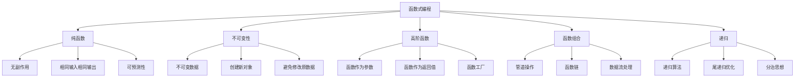

# 函数式编程思想

## 🎯 学习目标
- 理解函数式编程的基本概念和核心思想
- 掌握纯函数、不可变性、高阶函数等概念
- 学会在PHP中应用函数式编程模式
- 了解函数式编程的优势和适用场景

## 📚 核心概念

### 函数式编程核心思想



### 函数式编程 vs 命令式编程

| 特性 | 函数式编程 | 命令式编程 | 说明 |
|------|------------|------------|------|
| 思维方式 | 声明式 | 命令式 | 描述做什么 vs 如何做 |
| 数据状态 | 不可变 | 可变 | 创建新数据 vs 修改原数据 |
| 副作用 | 避免 | 允许 | 纯函数 vs 有副作用函数 |
| 控制流 | 递归 | 循环 | 函数调用 vs 循环结构 |
| 可测试性 | 高 | 中 | 纯函数易于测试 |

## 🔧 纯函数

### 纯函数概念
```php
<?php
// 纯函数示例
function add($a, $b) {
    return $a + $b;
}

function multiply($a, $b) {
    return $a * $b;
}

function square($x) {
    return $x * $x;
}

// 使用示例
echo add(5, 3); // 输出: 8
echo multiply(4, 5); // 输出: 20
echo square(6); // 输出: 36

// 非纯函数示例（有副作用）
$counter = 0;

function impureAdd($a, $b) {
    global $counter;
    $counter++; // 副作用：修改全局变量
    return $a + $b;
}

echo impureAdd(5, 3); // 输出: 8
echo $counter; // 输出: 1

// 纯函数版本
function pureAdd($a, $b) {
    return $a + $b;
}

// 纯函数：字符串处理
function capitalize($str) {
    return ucfirst(strtolower(trim($str)));
}

function reverse($str) {
    return strrev($str);
}

// 使用示例
$name = "  JOHN DOE  ";
echo capitalize($name); // 输出: John doe
echo reverse($name); // 输出: EOD  NHOJ  
?>
```

### 纯函数优势
```php
<?php
// 纯函数的优势：可预测性
function calculateTax($amount, $rate) {
    return $amount * $rate;
}

// 相同输入总是产生相同输出
echo calculateTax(100, 0.1); // 输出: 10
echo calculateTax(100, 0.1); // 输出: 10
echo calculateTax(100, 0.1); // 输出: 10

// 纯函数：易于测试
function isEven($number) {
    return $number % 2 === 0;
}

// 测试用例
assert(isEven(2) === true);
assert(isEven(3) === false);
assert(isEven(0) === true);
assert(isEven(-2) === true);

// 纯函数：易于并行化
function processItem($item) {
    return $item * 2;
}

$items = [1, 2, 3, 4, 5];
$results = array_map('processItem', $items);
print_r($results); // 输出: [2, 4, 6, 8, 10]

// 纯函数：易于缓存
function expensiveCalculation($input) {
    // 模拟昂贵计算
    return $input * $input * $input;
}

// 可以安全地缓存结果
$cache = [];
function cachedCalculation($input) {
    global $cache;
    
    if (!isset($cache[$input])) {
        $cache[$input] = expensiveCalculation($input);
    }
    
    return $cache[$input];
}

echo cachedCalculation(5); // 输出: 125
echo cachedCalculation(5); // 输出: 125 (从缓存获取)
?>
```

## 🔒 不可变性

### 不可变数据
```php
<?php
// 不可变数据操作
class ImmutableList {
    private $items;
    
    public function __construct($items = []) {
        $this->items = $items;
    }
    
    public function add($item) {
        // 创建新对象而不是修改原对象
        $newItems = $this->items;
        $newItems[] = $item;
        return new self($newItems);
    }
    
    public function remove($index) {
        $newItems = $this->items;
        unset($newItems[$index]);
        return new self(array_values($newItems));
    }
    
    public function map($callback) {
        $newItems = array_map($callback, $this->items);
        return new self($newItems);
    }
    
    public function filter($callback) {
        $newItems = array_filter($this->items, $callback);
        return new self(array_values($newItems));
    }
    
    public function toArray() {
        return $this->items;
    }
}

// 使用示例
$list = new ImmutableList([1, 2, 3]);
$newList = $list->add(4);
$filteredList = $newList->filter(function($item) {
    return $item % 2 === 0;
});

print_r($list->toArray()); // 输出: [1, 2, 3] (原对象未改变)
print_r($newList->toArray()); // 输出: [1, 2, 3, 4]
print_r($filteredList->toArray()); // 输出: [2, 4]

// 不可变对象
class ImmutableUser {
    private $name;
    private $email;
    private $age;
    
    public function __construct($name, $email, $age) {
        $this->name = $name;
        $this->email = $email;
        $this->age = $age;
    }
    
    public function getName() {
        return $this->name;
    }
    
    public function getEmail() {
        return $this->email;
    }
    
    public function getAge() {
        return $this->age;
    }
    
    public function withName($name) {
        return new self($name, $this->email, $this->age);
    }
    
    public function withEmail($email) {
        return new self($this->name, $email, $this->age);
    }
    
    public function withAge($age) {
        return new self($this->name, $this->email, $age);
    }
}

// 使用示例
$user = new ImmutableUser('John', 'john@example.com', 25);
$updatedUser = $user->withAge(26);

echo $user->getAge(); // 输出: 25 (原对象未改变)
echo $updatedUser->getAge(); // 输出: 26
?>
```

### 不可变操作
```php
<?php
// 不可变数组操作
function immutableArrayPush($array, $item) {
    $newArray = $array;
    $newArray[] = $item;
    return $newArray;
}

function immutableArraySet($array, $key, $value) {
    $newArray = $array;
    $newArray[$key] = $value;
    return $newArray;
}

function immutableArrayRemove($array, $key) {
    $newArray = $array;
    unset($newArray[$key]);
    return $newArray;
}

// 使用示例
$original = ['a' => 1, 'b' => 2, 'c' => 3];
$modified = immutableArraySet($original, 'd', 4);
$removed = immutableArrayRemove($modified, 'b');

print_r($original); // 输出: ['a' => 1, 'b' => 2, 'c' => 3]
print_r($modified); // 输出: ['a' => 1, 'b' => 2, 'c' => 3, 'd' => 4]
print_r($removed); // 输出: ['a' => 1, 'c' => 3, 'd' => 4]

// 不可变字符串操作
function immutableStringReplace($str, $search, $replace) {
    return str_replace($search, $replace, $str);
}

function immutableStringAppend($str, $suffix) {
    return $str . $suffix;
}

// 使用示例
$original = "Hello World";
$modified = immutableStringReplace($original, "World", "PHP");
$appended = immutableStringAppend($modified, "!");

echo $original; // 输出: Hello World
echo $modified; // 输出: Hello PHP
echo $appended; // 输出: Hello PHP!
?>
```

## 🔄 高阶函数

### 函数作为参数
```php
<?php
// 高阶函数：函数作为参数
function applyOperation($a, $b, $operation) {
    return $operation($a, $b);
}

// 定义操作函数
$add = function($a, $b) {
    return $a + $b;
};

$multiply = function($a, $b) {
    return $a * $b;
};

$subtract = function($a, $b) {
    return $a - $b;
};

// 使用高阶函数
echo applyOperation(5, 3, $add); // 输出: 8
echo applyOperation(5, 3, $multiply); // 输出: 15
echo applyOperation(5, 3, $subtract); // 输出: 2

// 高阶函数：数组处理
function processArray($array, $processor) {
    $result = [];
    foreach ($array as $item) {
        $result[] = $processor($item);
    }
    return $result;
}

// 定义处理函数
$double = function($x) {
    return $x * 2;
};

$square = function($x) {
    return $x * $x;
};

$format = function($x) {
    return "Value: $x";
};

// 使用示例
$numbers = [1, 2, 3, 4, 5];
$doubled = processArray($numbers, $double);
$squared = processArray($numbers, $square);
$formatted = processArray($numbers, $format);

print_r($doubled); // 输出: [2, 4, 6, 8, 10]
print_r($squared); // 输出: [1, 4, 9, 16, 25]
print_r($formatted); // 输出: ["Value: 1", "Value: 2", ...]
?>
```

### 函数作为返回值
```php
<?php
// 高阶函数：函数作为返回值
function createMultiplier($factor) {
    return function($number) use ($factor) {
        return $number * $factor;
    };
}

function createAdder($value) {
    return function($number) use ($value) {
        return $number + $value;
    };
}

function createValidator($type) {
    switch ($type) {
        case 'email':
            return function($value) {
                return filter_var($value, FILTER_VALIDATE_EMAIL) !== false;
            };
        case 'number':
            return function($value) {
                return is_numeric($value);
            };
        case 'required':
            return function($value) {
                return !empty($value);
            };
        default:
            return function($value) {
                return true;
            };
    }
}

// 使用示例
$double = createMultiplier(2);
$triple = createMultiplier(3);
$addTen = createAdder(10);

echo $double(5); // 输出: 10
echo $triple(5); // 输出: 15
echo $addTen(5); // 输出: 15

$emailValidator = createValidator('email');
$numberValidator = createValidator('number');

echo $emailValidator('test@example.com') ? '有效' : '无效'; // 输出: 有效
echo $numberValidator('123') ? '有效' : '无效'; // 输出: 有效

// 函数组合
function compose($f, $g) {
    return function($x) use ($f, $g) {
        return $f($g($x));
    };
}

$addOne = function($x) { return $x + 1; };
$multiplyByTwo = function($x) { return $x * 2; };

$addOneThenDouble = compose($multiplyByTwo, $addOne);
echo $addOneThenDouble(5); // 输出: 12 ((5+1)*2)
?>
```

## 🔗 函数组合

### 管道操作
```php
<?php
// 管道操作
class Pipeline {
    private $functions = [];
    
    public function pipe($function) {
        $this->functions[] = $function;
        return $this;
    }
    
    public function process($input) {
        $result = $input;
        
        foreach ($this->functions as $function) {
            $result = $function($result);
        }
        
        return $result;
    }
}

// 定义处理函数
$trim = function($str) {
    return trim($str);
};

$lowercase = function($str) {
    return strtolower($str);
};

$capitalize = function($str) {
    return ucwords($str);
};

$addPrefix = function($str) {
    return "Hello, $str";
};

// 使用管道
$pipeline = new Pipeline();
$pipeline->pipe($trim)
         ->pipe($lowercase)
         ->pipe($capitalize)
         ->pipe($addPrefix);

$result = $pipeline->process("  john doe  ");
echo $result; // 输出: Hello, John Doe

// 函数链
function chain($value) {
    return new FunctionChain($value);
}

class FunctionChain {
    private $value;
    
    public function __construct($value) {
        $this->value = $value;
    }
    
    public function map($function) {
        $this->value = $function($this->value);
        return $this;
    }
    
    public function filter($predicate) {
        if (is_array($this->value)) {
            $this->value = array_filter($this->value, $predicate);
        }
        return $this;
    }
    
    public function reduce($function, $initial = null) {
        if (is_array($this->value)) {
            $this->value = array_reduce($this->value, $function, $initial);
        }
        return $this;
    }
    
    public function value() {
        return $this->value;
    }
}

// 使用函数链
$result = chain([1, 2, 3, 4, 5])
    ->map(function($x) { return $x * 2; })
    ->filter(function($x) { return $x > 5; })
    ->reduce(function($acc, $x) { return $acc + $x; }, 0)
    ->value();

echo $result; // 输出: 24 (6 + 8 + 10)
?>
```

### 函数组合模式
```php
<?php
// 函数组合
function compose(...$functions) {
    return function($value) use ($functions) {
        return array_reduce(
            array_reverse($functions),
            function($carry, $function) {
                return $function($carry);
            },
            $value
        );
    };
}

// 定义基础函数
$add = function($x) { return $x + 1; };
$multiply = function($x) { return $x * 2; };
$square = function($x) { return $x * $x; };

// 组合函数
$addThenMultiply = compose($multiply, $add);
$addThenMultiplyThenSquare = compose($square, $multiply, $add);

echo $addThenMultiply(5); // 输出: 12 ((5+1)*2)
echo $addThenMultiplyThenSquare(5); // 输出: 144 (((5+1)*2)^2)

// 部分应用
function partial($function, ...$args) {
    return function(...$remainingArgs) use ($function, $args) {
        return $function(...array_merge($args, $remainingArgs));
    };
}

// 定义函数
$add = function($a, $b, $c) {
    return $a + $b + $c;
};

// 部分应用
$addFive = partial($add, 5);
$addFiveAndTen = partial($add, 5, 10);

echo $addFive(10, 15); // 输出: 30 (5 + 10 + 15)
echo $addFiveAndTen(20); // 输出: 35 (5 + 10 + 20)

// 柯里化
function curry($function, $arity = null) {
    if ($arity === null) {
        $arity = (new ReflectionFunction($function))->getNumberOfParameters();
    }
    
    return function(...$args) use ($function, $arity) {
        if (count($args) >= $arity) {
            return $function(...$args);
        }
        
        return curry(partial($function, ...$args), $arity - count($args));
    };
}

// 使用柯里化
$curriedAdd = curry($add);
$addFive = $curriedAdd(5);
$addFiveAndTen = $addFive(10);

echo $addFiveAndTen(15); // 输出: 30
?>
```

## 🔄 递归

### 递归算法
```php
<?php
// 递归：阶乘
function factorial($n) {
    if ($n <= 1) {
        return 1;
    }
    
    return $n * factorial($n - 1);
}

echo factorial(5); // 输出: 120

// 递归：斐波那契数列
function fibonacci($n) {
    if ($n <= 1) {
        return $n;
    }
    
    return fibonacci($n - 1) + fibonacci($n - 2);
}

echo fibonacci(10); // 输出: 55

// 递归：数组求和
function arraySum($array) {
    if (empty($array)) {
        return 0;
    }
    
    return array_shift($array) + arraySum($array);
}

echo arraySum([1, 2, 3, 4, 5]); // 输出: 15

// 递归：数组扁平化
function flatten($array) {
    $result = [];
    
    foreach ($array as $item) {
        if (is_array($item)) {
            $result = array_merge($result, flatten($item));
        } else {
            $result[] = $item;
        }
    }
    
    return $result;
}

$nested = [1, [2, 3], [4, [5, 6]]];
print_r(flatten($nested)); // 输出: [1, 2, 3, 4, 5, 6]
?>
```

### 尾递归优化
```php
<?php
// 尾递归：阶乘
function factorialTail($n, $acc = 1) {
    if ($n <= 1) {
        return $acc;
    }
    
    return factorialTail($n - 1, $n * $acc);
}

echo factorialTail(5); // 输出: 120

// 尾递归：斐波那契数列
function fibonacciTail($n, $a = 0, $b = 1) {
    if ($n === 0) {
        return $a;
    }
    
    if ($n === 1) {
        return $b;
    }
    
    return fibonacciTail($n - 1, $b, $a + $b);
}

echo fibonacciTail(10); // 输出: 55

// 尾递归：数组求和
function arraySumTail($array, $acc = 0) {
    if (empty($array)) {
        return $acc;
    }
    
    return arraySumTail(array_slice($array, 1), $acc + $array[0]);
}

echo arraySumTail([1, 2, 3, 4, 5]); // 输出: 15

// 递归：树遍历
class TreeNode {
    public $value;
    public $left;
    public $right;
    
    public function __construct($value) {
        $this->value = $value;
        $this->left = null;
        $this->right = null;
    }
}

function inOrderTraversal($node) {
    if ($node === null) {
        return [];
    }
    
    return array_merge(
        inOrderTraversal($node->left),
        [$node->value],
        inOrderTraversal($node->right)
    );
}

// 创建树
$root = new TreeNode(1);
$root->left = new TreeNode(2);
$root->right = new TreeNode(3);
$root->left->left = new TreeNode(4);
$root->left->right = new TreeNode(5);

print_r(inOrderTraversal($root)); // 输出: [4, 2, 5, 1, 3]
?>
```

## 🎯 实际应用示例

### 函数式数据处理
```php
<?php
class FunctionalDataProcessor {
    // 纯函数：数据转换
    public static function transform($data, $transformer) {
        if (is_array($data)) {
            return array_map($transformer, $data);
        }
        return $transformer($data);
    }
    
    // 纯函数：数据过滤
    public static function filter($data, $predicate) {
        if (is_array($data)) {
            return array_filter($data, $predicate);
        }
        return $predicate($data) ? $data : null;
    }
    
    // 纯函数：数据归约
    public static function reduce($data, $reducer, $initial = null) {
        if (is_array($data)) {
            return array_reduce($data, $reducer, $initial);
        }
        return $reducer($initial, $data);
    }
    
    // 函数组合：管道处理
    public static function pipeline($data, ...$functions) {
        return array_reduce($functions, function($carry, $function) {
            return $function($carry);
        }, $data);
    }
    
    // 函数组合：链式处理
    public static function chain($data) {
        return new FunctionalChain($data);
    }
}

class FunctionalChain {
    private $data;
    
    public function __construct($data) {
        $this->data = $data;
    }
    
    public function map($function) {
        $this->data = FunctionalDataProcessor::transform($this->data, $function);
        return $this;
    }
    
    public function filter($predicate) {
        $this->data = FunctionalDataProcessor::filter($this->data, $predicate);
        return $this;
    }
    
    public function reduce($reducer, $initial = null) {
        $this->data = FunctionalDataProcessor::reduce($this->data, $reducer, $initial);
        return $this;
    }
    
    public function value() {
        return $this->data;
    }
}

// 使用示例
$users = [
    ['name' => 'John', 'age' => 25, 'salary' => 50000],
    ['name' => 'Jane', 'age' => 30, 'salary' => 60000],
    ['name' => 'Bob', 'age' => 20, 'salary' => 40000],
    ['name' => 'Alice', 'age' => 35, 'salary' => 70000]
];

// 函数式处理
$result = FunctionalDataProcessor::chain($users)
    ->filter(function($user) { return $user['age'] >= 25; })
    ->map(function($user) { 
        $user['salary'] = $user['salary'] * 1.1; 
        return $user; 
    })
    ->reduce(function($acc, $user) { 
        return $acc + $user['salary']; 
    }, 0)
    ->value();

echo "总薪资: $result"; // 输出: 总薪资: 198000
?>
```

### 函数式配置管理
```php
<?php
class FunctionalConfig {
    private $config;
    
    public function __construct($config = []) {
        $this->config = $config;
    }
    
    // 纯函数：获取配置
    public function get($key, $default = null) {
        return $this->config[$key] ?? $default;
    }
    
    // 纯函数：设置配置（返回新对象）
    public function set($key, $value) {
        $newConfig = $this->config;
        $newConfig[$key] = $value;
        return new self($newConfig);
    }
    
    // 纯函数：合并配置
    public function merge($otherConfig) {
        $newConfig = array_merge($this->config, $otherConfig);
        return new self($newConfig);
    }
    
    // 纯函数：过滤配置
    public function filter($predicate) {
        $filtered = array_filter($this->config, $predicate);
        return new self($filtered);
    }
    
    // 纯函数：映射配置
    public function map($function) {
        $mapped = array_map($function, $this->config);
        return new self($mapped);
    }
    
    // 纯函数：转换为数组
    public function toArray() {
        return $this->config;
    }
}

// 使用示例
$config = new FunctionalConfig([
    'app_name' => 'My App',
    'debug' => false,
    'timeout' => 30
]);

// 函数式配置操作
$updatedConfig = $config
    ->set('debug', true)
    ->set('version', '1.0.0')
    ->filter(function($value, $key) {
        return $key !== 'timeout';
    })
    ->map(function($value) {
        return is_string($value) ? strtoupper($value) : $value;
    });

print_r($updatedConfig->toArray());
// 输出: ['app_name' => 'MY APP', 'debug' => true, 'version' => '1.0.0']
?>
```

## 📊 最佳实践

### 函数式编程最佳实践
```php
<?php
// 1. 优先使用纯函数
// 不好的做法
$globalCounter = 0;
function impureCounter() {
    global $globalCounter;
    return ++$globalCounter;
}

// 好的做法
function pureCounter($current) {
    return $current + 1;
}

// 2. 避免修改原数据
// 不好的做法
function addItem($array, $item) {
    $array[] = $item; // 修改原数组
    return $array;
}

// 好的做法
function addItem($array, $item) {
    $newArray = $array;
    $newArray[] = $item;
    return $newArray;
}

// 3. 使用函数组合
// 不好的做法
function processData($data) {
    $data = trim($data);
    $data = strtolower($data);
    $data = ucwords($data);
    return $data;
}

// 好的做法
function processData($data) {
    return compose('ucwords', 'strtolower', 'trim')($data);
}

// 4. 使用递归替代循环
// 不好的做法
function sumArray($array) {
    $sum = 0;
    foreach ($array as $item) {
        $sum += $item;
    }
    return $sum;
}

// 好的做法
function sumArray($array) {
    if (empty($array)) {
        return 0;
    }
    return array_shift($array) + sumArray($array);
}

// 5. 使用高阶函数
// 不好的做法
function doubleArray($array) {
    $result = [];
    foreach ($array as $item) {
        $result[] = $item * 2;
    }
    return $result;
}

// 好的做法
function doubleArray($array) {
    return array_map(function($x) { return $x * 2; }, $array);
}
?>
```

### 性能优化建议
```php
<?php
// 1. 使用尾递归
function factorialTail($n, $acc = 1) {
    if ($n <= 1) return $acc;
    return factorialTail($n - 1, $n * $acc);
}

// 2. 缓存纯函数结果
function memoize($function) {
    static $cache = [];
    
    return function(...$args) use ($function, &$cache) {
        $key = serialize($args);
        
        if (!isset($cache[$key])) {
            $cache[$key] = $function(...$args);
        }
        
        return $cache[$key];
    };
}

$memoizedFactorial = memoize('factorial');

// 3. 使用生成器处理大数据
function processLargeDataset($data) {
    foreach ($data as $item) {
        yield processItem($item);
    }
}

// 4. 避免深度递归
function safeRecursion($data, $maxDepth = 1000) {
    static $depth = 0;
    
    if ($depth >= $maxDepth) {
        throw new Exception('递归深度超限');
    }
    
    $depth++;
    $result = processData($data);
    $depth--;
    
    return $result;
}
?>
```

## 🎓 学习建议

### 费曼学习法应用
1. **选择概念**: 选择函数式编程中的核心概念
2. **简化解释**: 用简单语言解释函数式编程的思想
3. **识别盲点**: 发现理解不深入的地方
4. **重新学习**: 针对盲点进行深入学习

### 刻意练习重点
1. **纯函数**: 练习编写纯函数
2. **不可变性**: 掌握不可变数据操作
3. **高阶函数**: 熟练使用高阶函数
4. **函数组合**: 学会组合函数解决问题

## 🔗 相关链接
- [[01-函数基础|函数基础]]
- [[02-内置函数分类|内置函数分类]]
- [[03-自定义函数|自定义函数]]
- [[04-匿名函数与闭包|匿名函数与闭包]]
- [[05-函数参数详解|函数参数详解]]
