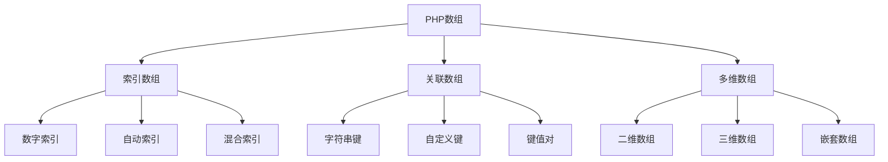

# 数组基础

## 🎯 学习目标
- 理解PHP数组的基本概念和特性
- 掌握数组的创建、访问和基本操作
- 学会使用数组的索引和关联键
- 了解数组的内存结构和性能特点

## 📚 核心概念

### 数组概述



### 数组类型对比

| 数组类型 | 索引方式 | 特点 | 适用场景 |
|----------|----------|------|----------|
| 索引数组 | 数字索引 | 有序、可遍历 | 列表数据、队列 |
| 关联数组 | 字符串键 | 键值对应、快速查找 | 配置数据、映射 |
| 多维数组 | 嵌套结构 | 复杂数据结构 | 表格数据、树形结构 |

## 🔧 数组创建

### 基本创建方式
```php
<?php
// 方式1：使用array()函数
$fruits = array('apple', 'banana', 'orange');
$colors = array('red', 'green', 'blue');

// 方式2：使用短数组语法 []
$numbers = [1, 2, 3, 4, 5];
$letters = ['a', 'b', 'c', 'd'];

// 方式3：逐步添加元素
$animals = [];
$animals[] = 'dog';
$animals[] = 'cat';
$animals[] = 'bird';

// 方式4：指定索引
$scores = [];
$scores[0] = 85;
$scores[1] = 92;
$scores[2] = 78;

// 方式5：使用range()函数
$range1 = range(1, 10);        // [1, 2, 3, 4, 5, 6, 7, 8, 9, 10]
$range2 = range(1, 10, 2);     // [1, 3, 5, 7, 9]
$range3 = range('a', 'z');     // ['a', 'b', 'c', ..., 'z']

// 方式6：使用array_fill()函数
$filled = array_fill(0, 5, 'default'); // [0 => 'default', 1 => 'default', ...]
$filled2 = array_fill(2, 3, 'value');  // [2 => 'value', 3 => 'value', 4 => 'value']

print_r($fruits);
print_r($numbers);
print_r($animals);
?>
```

### 关联数组创建
```php
<?php
// 方式1：使用array()函数
$user = array(
    'name' => 'John Doe',
    'email' => 'john@example.com',
    'age' => 25
);

// 方式2：使用短数组语法 []
$config = [
    'host' => 'localhost',
    'port' => 3306,
    'database' => 'myapp'
];

// 方式3：逐步添加元素
$person = [];
$person['name'] = 'Jane Smith';
$person['email'] = 'jane@example.com';
$person['age'] = 30;

// 方式4：混合创建
$mixed = [
    'name' => 'Bob',
    0 => 'first',
    'age' => 35,
    1 => 'second'
];

// 方式5：使用compact()函数
$name = 'Alice';
$age = 28;
$city = 'New York';
$info = compact('name', 'age', 'city');

print_r($user);
print_r($config);
print_r($person);
print_r($mixed);
print_r($info);
?>
```

### 多维数组创建
```php
<?php
// 二维数组
$students = [
    ['name' => 'John', 'age' => 20, 'grade' => 'A'],
    ['name' => 'Jane', 'age' => 19, 'grade' => 'B'],
    ['name' => 'Bob', 'age' => 21, 'grade' => 'A']
];

// 三维数组
$matrix = [
    [
        [1, 2, 3],
        [4, 5, 6],
        [7, 8, 9]
    ],
    [
        [10, 11, 12],
        [13, 14, 15],
        [16, 17, 18]
    ]
];

// 嵌套关联数组
$company = [
    'name' => 'Tech Corp',
    'departments' => [
        'engineering' => [
            'manager' => 'Alice',
            'employees' => ['Bob', 'Charlie', 'David']
        ],
        'marketing' => [
            'manager' => 'Eve',
            'employees' => ['Frank', 'Grace']
        ]
    ],
    'location' => [
        'country' => 'USA',
        'city' => 'San Francisco'
    ]
];

print_r($students);
print_r($matrix);
print_r($company);
?>
```

## 🔍 数组访问

### 基本访问方式
```php
<?php
// 索引数组访问
$fruits = ['apple', 'banana', 'orange'];
echo $fruits[0]; // 输出: apple
echo $fruits[1]; // 输出: banana
echo $fruits[2]; // 输出: orange

// 关联数组访问
$user = [
    'name' => 'John Doe',
    'email' => 'john@example.com',
    'age' => 25
];
echo $user['name'];  // 输出: John Doe
echo $user['email']; // 输出: john@example.com
echo $user['age'];   // 输出: 25

// 多维数组访问
$students = [
    ['name' => 'John', 'age' => 20],
    ['name' => 'Jane', 'age' => 19]
];
echo $students[0]['name']; // 输出: John
echo $students[1]['age'];  // 输出: 19

// 使用变量作为键
$key = 'name';
echo $user[$key]; // 输出: John Doe

// 动态访问
$nested = [
    'level1' => [
        'level2' => [
            'value' => 'Hello World'
        ]
    ]
];
echo $nested['level1']['level2']['value']; // 输出: Hello World
?>
```

### 安全访问方式
```php
<?php
// 检查键是否存在
$user = ['name' => 'John', 'age' => 25];

if (isset($user['name'])) {
    echo $user['name'];
}

if (array_key_exists('email', $user)) {
    echo $user['email'];
} else {
    echo 'Email not found';
}

// 使用默认值
$name = $user['name'] ?? 'Unknown';
$email = $user['email'] ?? 'No email';
$phone = $user['phone'] ?? 'No phone';

echo "Name: $name, Email: $email, Phone: $phone";

// 安全访问函数
function safeGet($array, $key, $default = null) {
    return $array[$key] ?? $default;
}

$name = safeGet($user, 'name', 'Anonymous');
$age = safeGet($user, 'age', 0);

echo "Name: $name, Age: $age";

// 多维数组安全访问
function safeGetNested($array, $keys, $default = null) {
    $current = $array;
    
    foreach ($keys as $key) {
        if (!is_array($current) || !array_key_exists($key, $current)) {
            return $default;
        }
        $current = $current[$key];
    }
    
    return $current;
}

$nested = [
    'user' => [
        'profile' => [
            'name' => 'John'
        ]
    ]
];

$name = safeGetNested($nested, ['user', 'profile', 'name'], 'Unknown');
echo $name; // 输出: John
?>
```

## ✏️ 数组修改

### 基本修改操作
```php
<?php
// 修改现有元素
$fruits = ['apple', 'banana', 'orange'];
$fruits[1] = 'grape';
print_r($fruits); // 输出: ['apple', 'grape', 'orange']

// 添加新元素
$fruits[] = 'kiwi';        // 添加到末尾
$fruits[10] = 'mango';     // 指定索引添加
print_r($fruits);

// 关联数组修改
$user = ['name' => 'John', 'age' => 25];
$user['email'] = 'john@example.com';  // 添加新键
$user['age'] = 26;                    // 修改现有值
print_r($user);

// 删除元素
unset($fruits[1]);         // 删除指定索引
unset($user['age']);       // 删除指定键
print_r($fruits);
print_r($user);

// 重新索引数组
$fruits = array_values($fruits);
print_r($fruits); // 索引重新从0开始
?>
```

### 批量修改操作
```php
<?php
// 数组合并
$array1 = ['a', 'b', 'c'];
$array2 = ['d', 'e', 'f'];
$merged = array_merge($array1, $array2);
print_r($merged); // 输出: ['a', 'b', 'c', 'd', 'e', 'f']

// 关联数组合并
$user1 = ['name' => 'John', 'age' => 25];
$user2 = ['email' => 'john@example.com', 'city' => 'NYC'];
$user = array_merge($user1, $user2);
print_r($user);

// 使用+操作符合并
$array3 = ['a', 'b', 'c'];
$array4 = ['d', 'e', 'f'];
$combined = $array3 + $array4; // 保留第一个数组的键
print_r($combined);

// 数组替换
$base = ['a' => 1, 'b' => 2, 'c' => 3];
$replace = ['b' => 20, 'd' => 4];
$result = array_replace($base, $replace);
print_r($result); // 输出: ['a' => 1, 'b' => 20, 'c' => 3, 'd' => 4]

// 数组填充
$filled = array_fill_keys(['a', 'b', 'c'], 'default');
print_r($filled); // 输出: ['a' => 'default', 'b' => 'default', 'c' => 'default']
?>
```

## 🔄 数组遍历

### 基本遍历方式
```php
<?php
$fruits = ['apple', 'banana', 'orange'];

// 1. for循环遍历
for ($i = 0; $i < count($fruits); $i++) {
    echo $fruits[$i] . "\n";
}

// 2. foreach循环遍历（值）
foreach ($fruits as $fruit) {
    echo $fruit . "\n";
}

// 3. foreach循环遍历（键值对）
foreach ($fruits as $index => $fruit) {
    echo "$index: $fruit\n";
}

// 关联数组遍历
$user = ['name' => 'John', 'age' => 25, 'city' => 'NYC'];

foreach ($user as $key => $value) {
    echo "$key: $value\n";
}

// 多维数组遍历
$students = [
    ['name' => 'John', 'age' => 20],
    ['name' => 'Jane', 'age' => 19],
    ['name' => 'Bob', 'age' => 21]
];

foreach ($students as $index => $student) {
    echo "Student $index:\n";
    foreach ($student as $key => $value) {
        echo "  $key: $value\n";
    }
}
?>
```

### 高级遍历方式
```php
<?php
// 使用array_walk()遍历
$numbers = [1, 2, 3, 4, 5];

array_walk($numbers, function($value, $key) {
    echo "Key: $key, Value: $value\n";
});

// 使用array_walk_recursive()递归遍历
$nested = [
    'level1' => [
        'a' => 1,
        'b' => 2,
        'level2' => [
            'c' => 3,
            'd' => 4
        ]
    ]
];

array_walk_recursive($nested, function($value, $key) {
    echo "$key: $value\n";
});

// 使用while循环和each()（已废弃，仅作了解）
$colors = ['red', 'green', 'blue'];
reset($colors);
while (list($key, $value) = each($colors)) {
    echo "$key: $value\n";
}

// 使用指针遍历
$data = ['a', 'b', 'c', 'd'];
reset($data);
while (current($data) !== false) {
    echo key($data) . ': ' . current($data) . "\n";
    next($data);
}
?>
```

## 📊 数组信息

### 基本信息获取
```php
<?php
$fruits = ['apple', 'banana', 'orange'];
$user = ['name' => 'John', 'age' => 25, 'city' => 'NYC'];

// 数组长度
echo count($fruits); // 输出: 3
echo sizeof($fruits); // 输出: 3 (count的别名)

// 检查是否为数组
var_dump(is_array($fruits)); // 输出: bool(true)
var_dump(is_array('string')); // 输出: bool(false)

// 获取所有键
$keys = array_keys($user);
print_r($keys); // 输出: ['name', 'age', 'city']

// 获取所有值
$values = array_values($user);
print_r($values); // 输出: ['John', 25, 'NYC']

// 检查键是否存在
var_dump(array_key_exists('name', $user)); // 输出: bool(true)
var_dump(array_key_exists('email', $user)); // 输出: bool(false)

// 检查值是否存在
var_dump(in_array('John', $user)); // 输出: bool(true)
var_dump(in_array('Jane', $user)); // 输出: bool(false)

// 搜索值并返回键
$key = array_search('John', $user);
echo $key; // 输出: name

// 获取数组的最后一个元素
$last = end($fruits);
echo $last; // 输出: orange

// 获取数组的第一个元素
$first = reset($fruits);
echo $first; // 输出: apple
?>
```

### 数组统计信息
```php
<?php
$numbers = [1, 2, 3, 4, 5, 6, 7, 8, 9, 10];

// 数组统计
echo "数组长度: " . count($numbers) . "\n";
echo "最小值: " . min($numbers) . "\n";
echo "最大值: " . max($numbers) . "\n";
echo "总和: " . array_sum($numbers) . "\n";
echo "平均值: " . array_sum($numbers) / count($numbers) . "\n";

// 数组唯一值
$duplicates = [1, 2, 2, 3, 3, 3, 4, 4, 5];
$unique = array_unique($duplicates);
print_r($unique); // 输出: [0 => 1, 1 => 2, 3 => 3, 6 => 4, 8 => 5]

// 数组翻转
$reversed = array_reverse($numbers);
print_r($reversed); // 输出: [10, 9, 8, 7, 6, 5, 4, 3, 2, 1]

// 数组随机化
$shuffled = $numbers;
shuffle($shuffled);
print_r($shuffled); // 输出: 随机顺序的数组

// 数组切片
$slice = array_slice($numbers, 2, 4);
print_r($slice); // 输出: [3, 4, 5, 6]

// 数组分块
$chunks = array_chunk($numbers, 3);
print_r($chunks); // 输出: [[1, 2, 3], [4, 5, 6], [7, 8, 9], [10]]
?>
```

## 🎯 实际应用示例

### 数据存储和检索
```php
<?php
class ArrayStorage {
    private $data = [];
    
    public function set($key, $value) {
        $this->data[$key] = $value;
    }
    
    public function get($key, $default = null) {
        return $this->data[$key] ?? $default;
    }
    
    public function has($key) {
        return array_key_exists($key, $this->data);
    }
    
    public function delete($key) {
        unset($this->data[$key]);
    }
    
    public function getAll() {
        return $this->data;
    }
    
    public function clear() {
        $this->data = [];
    }
    
    public function keys() {
        return array_keys($this->data);
    }
    
    public function values() {
        return array_values($this->data);
    }
    
    public function count() {
        return count($this->data);
    }
}

// 使用示例
$storage = new ArrayStorage();
$storage->set('user:1', ['name' => 'John', 'age' => 25]);
$storage->set('user:2', ['name' => 'Jane', 'age' => 30]);

$user = $storage->get('user:1');
print_r($user);

echo $storage->has('user:1') ? '存在' : '不存在';
echo "\n总数: " . $storage->count();
?>
```

### 配置管理
```php
<?php
class ConfigManager {
    private $config = [];
    
    public function __construct($configFile = null) {
        if ($configFile && file_exists($configFile)) {
            $this->config = include $configFile;
        }
    }
    
    public function get($key, $default = null) {
        $keys = explode('.', $key);
        $value = $this->config;
        
        foreach ($keys as $k) {
            if (!is_array($value) || !array_key_exists($k, $value)) {
                return $default;
            }
            $value = $value[$k];
        }
        
        return $value;
    }
    
    public function set($key, $value) {
        $keys = explode('.', $key);
        $config = &$this->config;
        
        foreach ($keys as $k) {
            if (!is_array($config)) {
                $config = [];
            }
            if (!array_key_exists($k, $config)) {
                $config[$k] = [];
            }
            $config = &$config[$k];
        }
        
        $config = $value;
    }
    
    public function has($key) {
        return $this->get($key) !== null;
    }
    
    public function getAll() {
        return $this->config;
    }
}

// 使用示例
$config = new ConfigManager();
$config->set('database.host', 'localhost');
$config->set('database.port', 3306);
$config->set('app.name', 'My App');
$config->set('app.debug', true);

echo $config->get('database.host'); // 输出: localhost
echo $config->get('app.name'); // 输出: My App
echo $config->get('app.debug') ? '开启' : '关闭'; // 输出: 开启
?>
```

### 数据验证
```php
<?php
class ArrayValidator {
    public static function validate($data, $rules) {
        $errors = [];
        
        foreach ($rules as $field => $rule) {
            $value = $data[$field] ?? null;
            $fieldErrors = self::validateField($field, $value, $rule);
            $errors = array_merge($errors, $fieldErrors);
        }
        
        return $errors;
    }
    
    private static function validateField($field, $value, $rule) {
        $errors = [];
        
        // 必需验证
        if (isset($rule['required']) && $rule['required'] && empty($value)) {
            $errors[] = "$field 是必需的";
            return $errors;
        }
        
        // 如果值为空且不是必需的，跳过其他验证
        if (empty($value)) {
            return $errors;
        }
        
        // 类型验证
        if (isset($rule['type'])) {
            if (!self::validateType($value, $rule['type'])) {
                $errors[] = "$field 必须是 " . $rule['type'] . " 类型";
            }
        }
        
        // 长度验证
        if (isset($rule['min_length']) && strlen($value) < $rule['min_length']) {
            $errors[] = "$field 长度不能少于 " . $rule['min_length'] . " 个字符";
        }
        
        if (isset($rule['max_length']) && strlen($value) > $rule['max_length']) {
            $errors[] = "$field 长度不能超过 " . $rule['max_length'] . " 个字符";
        }
        
        // 范围验证
        if (isset($rule['min']) && $value < $rule['min']) {
            $errors[] = "$field 不能小于 " . $rule['min'];
        }
        
        if (isset($rule['max']) && $value > $rule['max']) {
            $errors[] = "$field 不能大于 " . $rule['max'];
        }
        
        return $errors;
    }
    
    private static function validateType($value, $type) {
        switch ($type) {
            case 'string':
                return is_string($value);
            case 'int':
                return is_int($value) || (is_string($value) && is_numeric($value));
            case 'float':
                return is_float($value) || is_numeric($value);
            case 'array':
                return is_array($value);
            case 'email':
                return filter_var($value, FILTER_VALIDATE_EMAIL) !== false;
            default:
                return true;
        }
    }
}

// 使用示例
$userData = [
    'name' => 'John Doe',
    'email' => 'john@example.com',
    'age' => 25
];

$rules = [
    'name' => [
        'required' => true,
        'type' => 'string',
        'min_length' => 2,
        'max_length' => 50
    ],
    'email' => [
        'required' => true,
        'type' => 'email'
    ],
    'age' => [
        'required' => true,
        'type' => 'int',
        'min' => 18,
        'max' => 100
    ]
];

$errors = ArrayValidator::validate($userData, $rules);
if (empty($errors)) {
    echo "验证通过";
} else {
    echo "验证失败: " . implode(', ', $errors);
}
?>
```

## 📊 最佳实践

### 数组操作最佳实践
```php
<?php
// 1. 使用合适的数组类型
// 索引数组用于有序数据
$fruits = ['apple', 'banana', 'orange'];

// 关联数组用于键值对应
$user = ['name' => 'John', 'age' => 25];

// 2. 安全访问数组元素
$name = $user['name'] ?? 'Unknown';
$email = $user['email'] ?? 'No email';

// 3. 使用array_key_exists()检查键
if (array_key_exists('name', $user)) {
    echo $user['name'];
}

// 4. 避免在循环中修改数组
$numbers = [1, 2, 3, 4, 5];
foreach ($numbers as $key => $value) {
    if ($value % 2 === 0) {
        unset($numbers[$key]); // 可能产生意外结果
    }
}

// 更好的做法
$numbers = array_filter($numbers, function($value) {
    return $value % 2 !== 0;
});

// 5. 使用array_values()重新索引
$numbers = array_values($numbers);

// 6. 合理使用数组函数
$data = [1, 2, 3, 4, 5];
$doubled = array_map(function($x) { return $x * 2; }, $data);
$evens = array_filter($data, function($x) { return $x % 2 === 0; });
$sum = array_sum($data);
?>
```

### 性能优化建议
```php
<?php
// 1. 避免重复计算数组长度
$array = range(1, 1000);
$count = count($array); // 预先计算

for ($i = 0; $i < $count; $i++) {
    // 使用$count而不是count($array)
}

// 2. 使用引用避免数组复制
function processArray(&$array) {
    foreach ($array as &$item) {
        $item = strtoupper($item);
    }
}

// 3. 使用生成器处理大数组
function processLargeArray($array) {
    foreach ($array as $item) {
        yield processItem($item);
    }
}

// 4. 合理使用内存
function memoryEfficientProcess($array) {
    $result = [];
    
    foreach ($array as $item) {
        $processed = processItem($item);
        $result[] = $processed;
        
        // 检查内存使用
        if (memory_get_usage() > 100 * 1024 * 1024) { // 100MB
            break;
        }
    }
    
    return $result;
}
?>
```

## 🎓 学习建议

### 费曼学习法应用
1. **选择概念**: 选择数组基础中的核心概念
2. **简化解释**: 用简单语言解释数组的作用和用法
3. **识别盲点**: 发现理解不深入的地方
4. **重新学习**: 针对盲点进行深入学习

### 刻意练习重点
1. **数组创建**: 练习各种数组创建方式
2. **数组访问**: 掌握安全访问数组的方法
3. **数组操作**: 熟练使用数组的基本操作
4. **实际应用**: 在实际项目中应用数组知识

## 🔗 相关链接
- [[02-数组操作函数|数组操作函数]]
- [[03-多维数组|多维数组]]
- [[04-字符串基础|字符串基础]]
- [[05-字符串处理函数|字符串处理函数]]
- [[01-基础认知层/语法基础/02-数据类型详解|数据类型详解]]
