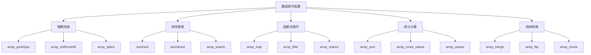

# 数组操作函数

## 🎯 学习目标
- 理解PHP数组操作函数的分类和用途
- 掌握数组的增删改查、排序、搜索等操作
- 学会使用数组函数式编程方法
- 了解数组操作函数的性能特点

## 📚 核心概念

### 数组操作函数分类



### 函数分类对比

| 分类 | 主要函数 | 特点 | 适用场景 |
|------|----------|------|----------|
| 增删改查 | push, pop, shift, unshift | 修改原数组 | 栈、队列操作 |
| 排序搜索 | sort, search, in_array | 改变顺序或查找 | 数据排序、查找 |
| 函数式操作 | map, filter, reduce | 不修改原数组 | 数据转换、过滤 |
| 统计计算 | sum, count, unique | 计算统计信息 | 数据分析 |
| 结构转换 | merge, flip, chunk | 改变数组结构 | 数据重组 |

## 🔧 增删改查操作

### 栈和队列操作
```php
<?php
// 栈操作：后进先出 (LIFO)
$stack = [];

// 入栈
array_push($stack, 'apple');
array_push($stack, 'banana');
array_push($stack, 'orange');
print_r($stack); // 输出: ['apple', 'banana', 'orange']

// 出栈
$item = array_pop($stack);
echo $item; // 输出: orange
print_r($stack); // 输出: ['apple', 'banana']

// 队列操作：先进先出 (FIFO)
$queue = [];

// 入队
array_push($queue, 'first');
array_push($queue, 'second');
array_push($queue, 'third');
print_r($queue); // 输出: ['first', 'second', 'third']

// 出队
$item = array_shift($queue);
echo $item; // 输出: first
print_r($queue); // 输出: ['second', 'third']

// 头部插入
array_unshift($queue, 'zero');
print_r($queue); // 输出: ['zero', 'second', 'third']

// 头部删除
$item = array_shift($queue);
echo $item; // 输出: zero
print_r($queue); // 输出: ['second', 'third']
?>
```

### 数组切片和拼接
```php
<?php
// array_slice() - 数组切片
$numbers = [1, 2, 3, 4, 5, 6, 7, 8, 9, 10];

$slice1 = array_slice($numbers, 2);        // 从索引2开始到末尾
$slice2 = array_slice($numbers, 2, 4);     // 从索引2开始，取4个元素
$slice3 = array_slice($numbers, -3);       // 最后3个元素
$slice4 = array_slice($numbers, 2, -2);    // 从索引2开始，排除最后2个

print_r($slice1); // 输出: [3, 4, 5, 6, 7, 8, 9, 10]
print_r($slice2); // 输出: [3, 4, 5, 6]
print_r($slice3); // 输出: [8, 9, 10]
print_r($slice4); // 输出: [3, 4, 5, 6, 7, 8]

// array_splice() - 数组拼接和替换
$fruits = ['apple', 'banana', 'orange', 'grape'];

// 删除元素
$removed = array_splice($fruits, 1, 2);
print_r($fruits);  // 输出: ['apple', 'grape']
print_r($removed); // 输出: ['banana', 'orange']

// 插入元素
array_splice($fruits, 1, 0, ['kiwi', 'mango']);
print_r($fruits); // 输出: ['apple', 'kiwi', 'mango', 'grape']

// 替换元素
array_splice($fruits, 1, 2, ['pear']);
print_r($fruits); // 输出: ['apple', 'pear', 'grape']

// array_merge() - 数组合并
$array1 = ['a', 'b', 'c'];
$array2 = ['d', 'e', 'f'];
$array3 = ['g', 'h', 'i'];

$merged = array_merge($array1, $array2, $array3);
print_r($merged); // 输出: ['a', 'b', 'c', 'd', 'e', 'f', 'g', 'h', 'i']

// 关联数组合并
$user1 = ['name' => 'John', 'age' => 25];
$user2 = ['email' => 'john@example.com', 'city' => 'NYC'];
$user = array_merge($user1, $user2);
print_r($user); // 输出: ['name' => 'John', 'age' => 25, 'email' => 'john@example.com', 'city' => 'NYC']
?>
```

### 数组替换和填充
```php
<?php
// array_replace() - 数组替换
$base = ['a' => 1, 'b' => 2, 'c' => 3];
$replace1 = ['b' => 20, 'd' => 4];
$replace2 = ['c' => 30, 'e' => 5];

$result = array_replace($base, $replace1, $replace2);
print_r($result); // 输出: ['a' => 1, 'b' => 20, 'c' => 30, 'd' => 4, 'e' => 5]

// array_fill() - 数组填充
$filled1 = array_fill(0, 5, 'default');
$filled2 = array_fill(2, 3, 'value');
$filled3 = array_fill(-2, 3, 'negative');

print_r($filled1); // 输出: [0 => 'default', 1 => 'default', 2 => 'default', 3 => 'default', 4 => 'default']
print_r($filled2); // 输出: [2 => 'value', 3 => 'value', 4 => 'value']
print_r($filled3); // 输出: [-2 => 'negative', -1 => 'negative', 0 => 'negative']

// array_fill_keys() - 用键填充数组
$keys = ['a', 'b', 'c'];
$filled = array_fill_keys($keys, 'value');
print_r($filled); // 输出: ['a' => 'value', 'b' => 'value', 'c' => 'value']

// array_pad() - 数组填充到指定长度
$array = [1, 2, 3];
$padded1 = array_pad($array, 5, 0);      // 填充到长度5
$padded2 = array_pad($array, -5, 0);     // 从前面填充到长度5

print_r($padded1); // 输出: [1, 2, 3, 0, 0]
print_r($padded2); // 输出: [0, 0, 1, 2, 3]
?>
```

## 🔍 排序和搜索

### 数组排序
```php
<?php
// 基本排序
$numbers = [3, 1, 4, 1, 5, 9, 2, 6];

// 升序排序
sort($numbers);
print_r($numbers); // 输出: [1, 1, 2, 3, 4, 5, 6, 9]

// 降序排序
rsort($numbers);
print_r($numbers); // 输出: [9, 6, 5, 4, 3, 2, 1, 1]

// 关联数组排序
$fruits = ['banana' => 2, 'apple' => 1, 'orange' => 3];

// 按值排序
asort($fruits);
print_r($fruits); // 输出: ['apple' => 1, 'banana' => 2, 'orange' => 3]

arsort($fruits);
print_r($fruits); // 输出: ['orange' => 3, 'banana' => 2, 'apple' => 1]

// 按键排序
ksort($fruits);
print_r($fruits); // 输出: ['apple' => 1, 'banana' => 2, 'orange' => 3]

krsort($fruits);
print_r($fruits); // 输出: ['orange' => 3, 'banana' => 2, 'apple' => 1]

// 用户自定义排序
$users = [
    ['name' => 'John', 'age' => 25],
    ['name' => 'Jane', 'age' => 30],
    ['name' => 'Bob', 'age' => 20]
];

// 按年龄排序
usort($users, function($a, $b) {
    return $a['age'] - $b['age'];
});
print_r($users); // 输出: 按年龄升序排列

// 按姓名排序
usort($users, function($a, $b) {
    return strcmp($a['name'], $b['name']);
});
print_r($users); // 输出: 按姓名升序排列

// 自然排序
$files = ['file1.txt', 'file10.txt', 'file2.txt', 'file20.txt'];
natsort($files);
print_r($files); // 输出: ['file1.txt', 'file2.txt', 'file10.txt', 'file20.txt']

// 不区分大小写的自然排序
natcasesort($files);
?>
```

### 数组搜索
```php
<?php
$fruits = ['apple', 'banana', 'orange', 'grape'];

// 检查值是否存在
var_dump(in_array('banana', $fruits)); // 输出: bool(true)
var_dump(in_array('kiwi', $fruits));   // 输出: bool(false)

// 搜索值并返回键
$key = array_search('orange', $fruits);
echo $key; // 输出: 2

$key = array_search('kiwi', $fruits);
var_dump($key); // 输出: bool(false)

// 关联数组搜索
$users = [
    'john' => ['name' => 'John', 'age' => 25],
    'jane' => ['name' => 'Jane', 'age' => 30],
    'bob' => ['name' => 'Bob', 'age' => 20]
];

// 搜索键
var_dump(array_key_exists('john', $users)); // 输出: bool(true)
var_dump(isset($users['jane']));            // 输出: bool(true)

// 搜索值
$key = array_search(['name' => 'Jane', 'age' => 30], $users);
echo $key; // 输出: jane

// 多维数组搜索
$students = [
    ['id' => 1, 'name' => 'John', 'grade' => 'A'],
    ['id' => 2, 'name' => 'Jane', 'grade' => 'B'],
    ['id' => 3, 'name' => 'Bob', 'grade' => 'A']
];

// 搜索特定条件
$found = array_filter($students, function($student) {
    return $student['grade'] === 'A';
});
print_r($found); // 输出: 成绩为A的学生

// 搜索并返回第一个匹配的键
$key = array_search('A', array_column($students, 'grade'));
echo $key; // 输出: 0
?>
```

## 🔄 函数式操作

### 数组映射
```php
<?php
// array_map() - 数组映射
$numbers = [1, 2, 3, 4, 5];

// 使用匿名函数
$doubled = array_map(function($n) {
    return $n * 2;
}, $numbers);
print_r($doubled); // 输出: [2, 4, 6, 8, 10]

// 使用内置函数
$strings = array_map('strval', $numbers);
print_r($strings); // 输出: ['1', '2', '3', '4', '5']

// 多个数组映射
$array1 = [1, 2, 3];
$array2 = [4, 5, 6];
$sums = array_map(function($a, $b) {
    return $a + $b;
}, $array1, $array2);
print_r($sums); // 输出: [5, 7, 9]

// 关联数组映射
$users = [
    ['name' => 'John', 'age' => 25],
    ['name' => 'Jane', 'age' => 30],
    ['name' => 'Bob', 'age' => 20]
];

$names = array_map(function($user) {
    return $user['name'];
}, $users);
print_r($names); // 输出: ['John', 'Jane', 'Bob']

// 使用array_column()提取列
$ages = array_column($users, 'age');
print_r($ages); // 输出: [25, 30, 20]
?>
```

### 数组过滤
```php
<?php
// array_filter() - 数组过滤
$numbers = [1, 2, 3, 4, 5, 6, 7, 8, 9, 10];

// 过滤偶数
$evens = array_filter($numbers, function($n) {
    return $n % 2 === 0;
});
print_r($evens); // 输出: [1 => 2, 3 => 4, 5 => 6, 7 => 8, 9 => 10]

// 重新索引
$evens = array_values($evens);
print_r($evens); // 输出: [2, 4, 6, 8, 10]

// 过滤空值
$data = ['apple', '', 'banana', null, 'orange', false];
$filtered = array_filter($data);
print_r($filtered); // 输出: ['apple', 'banana', 'orange']

// 自定义过滤函数
function isPositive($value) {
    return $value > 0;
}

$positive = array_filter($numbers, 'isPositive');
print_r($positive); // 输出: 正数

// 关联数组过滤
$users = [
    'john' => ['name' => 'John', 'age' => 25, 'active' => true],
    'jane' => ['name' => 'Jane', 'age' => 30, 'active' => false],
    'bob' => ['name' => 'Bob', 'age' => 20, 'active' => true]
];

$activeUsers = array_filter($users, function($user) {
    return $user['active'];
});
print_r($activeUsers); // 输出: 活跃用户

// 使用ARRAY_FILTER_USE_KEY过滤键
$filtered = array_filter($users, function($key) {
    return strlen($key) > 3;
}, ARRAY_FILTER_USE_KEY);
print_r($filtered); // 输出: 键长度大于3的元素
?>
```

### 数组归约
```php
<?php
// array_reduce() - 数组归约
$numbers = [1, 2, 3, 4, 5];

// 求和
$sum = array_reduce($numbers, function($carry, $item) {
    return $carry + $item;
}, 0);
echo $sum; // 输出: 15

// 求积
$product = array_reduce($numbers, function($carry, $item) {
    return $carry * $item;
}, 1);
echo $product; // 输出: 120

// 字符串连接
$words = ['Hello', 'World', 'PHP'];
$sentence = array_reduce($words, function($carry, $item) {
    return $carry . ' ' . $item;
}, '');
echo trim($sentence); // 输出: Hello World PHP

// 数组扁平化
$nested = [[1, 2], [3, 4], [5, 6]];
$flattened = array_reduce($nested, function($carry, $item) {
    return array_merge($carry, $item);
}, []);
print_r($flattened); // 输出: [1, 2, 3, 4, 5, 6]

// 分组操作
$students = [
    ['name' => 'John', 'grade' => 'A'],
    ['name' => 'Jane', 'grade' => 'B'],
    ['name' => 'Bob', 'grade' => 'A'],
    ['name' => 'Alice', 'grade' => 'C']
];

$grouped = array_reduce($students, function($carry, $student) {
    $grade = $student['grade'];
    if (!isset($carry[$grade])) {
        $carry[$grade] = [];
    }
    $carry[$grade][] = $student['name'];
    return $carry;
}, []);
print_r($grouped); // 输出: 按成绩分组的学生
?>
```

## 📊 统计和计算

### 数组统计
```php
<?php
// array_sum() - 数组求和
$numbers = [1, 2, 3, 4, 5];
$sum = array_sum($numbers);
echo $sum; // 输出: 15

// array_product() - 数组求积
$product = array_product($numbers);
echo $product; // 输出: 120

// count() - 数组计数
$count = count($numbers);
echo $count; // 输出: 5

// array_count_values() - 值计数
$data = ['apple', 'banana', 'apple', 'orange', 'banana', 'apple'];
$counts = array_count_values($data);
print_r($counts); // 输出: ['apple' => 3, 'banana' => 2, 'orange' => 1]

// array_unique() - 数组去重
$unique = array_unique($data);
print_r($unique); // 输出: ['apple', 'banana', 'orange']

// 重新索引
$unique = array_values($unique);
print_r($unique); // 输出: [0 => 'apple', 1 => 'banana', 2 => 'orange']

// 多维数组去重
$users = [
    ['name' => 'John', 'age' => 25],
    ['name' => 'Jane', 'age' => 30],
    ['name' => 'John', 'age' => 25], // 重复
    ['name' => 'Bob', 'age' => 20]
];

$uniqueUsers = array_unique($users, SORT_REGULAR);
print_r($uniqueUsers); // 输出: 去重后的用户数组
?>
```

### 数组比较
```php
<?php
// array_diff() - 数组差集
$array1 = ['a', 'b', 'c', 'd'];
$array2 = ['b', 'c', 'e', 'f'];

$diff = array_diff($array1, $array2);
print_r($diff); // 输出: ['a', 'd']

// array_intersect() - 数组交集
$intersect = array_intersect($array1, $array2);
print_r($intersect); // 输出: ['b', 'c']

// array_merge() - 数组合并
$merged = array_merge($array1, $array2);
print_r($merged); // 输出: ['a', 'b', 'c', 'd', 'b', 'c', 'e', 'f']

// array_merge_recursive() - 递归合并
$array1 = ['a' => 1, 'b' => ['x' => 1, 'y' => 2]];
$array2 = ['b' => ['z' => 3], 'c' => 3];

$merged = array_merge_recursive($array1, $array2);
print_r($merged); // 输出: 递归合并结果

// array_combine() - 数组合并成关联数组
$keys = ['name', 'age', 'city'];
$values = ['John', 25, 'NYC'];

$combined = array_combine($keys, $values);
print_r($combined); // 输出: ['name' => 'John', 'age' => 25, 'city' => 'NYC']
?>
```

## 🎯 实际应用示例

### 数据处理管道
```php
<?php
class ArrayProcessor {
    // 数据清洗管道
    public static function cleanData($data) {
        return self::pipeline($data, [
            'trim' => function($item) { return is_string($item) ? trim($item) : $item; },
            'filter' => function($item) { return !empty($item); },
            'unique' => function($array) { return array_unique($array); },
            'reindex' => function($array) { return array_values($array); }
        ]);
    }
    
    // 数据转换管道
    public static function transformData($data, $transformations) {
        return self::pipeline($data, $transformations);
    }
    
    // 通用管道处理
    private static function pipeline($data, $steps) {
        $result = $data;
        
        foreach ($steps as $step) {
            if (is_callable($step)) {
                $result = $step($result);
            }
        }
        
        return $result;
    }
    
    // 数据分组
    public static function groupBy($data, $key) {
        $groups = [];
        
        foreach ($data as $item) {
            $groupKey = is_callable($key) ? $key($item) : $item[$key];
            $groups[$groupKey][] = $item;
        }
        
        return $groups;
    }
    
    // 数据排序
    public static function sortBy($data, $key, $direction = 'asc') {
        usort($data, function($a, $b) use ($key, $direction) {
            $valueA = is_callable($key) ? $key($a) : $a[$key];
            $valueB = is_callable($key) ? $key($b) : $b[$key];
            
            $comparison = $valueA <=> $valueB;
            return $direction === 'desc' ? -$comparison : $comparison;
        });
        
        return $data;
    }
}

// 使用示例
$rawData = ['  apple  ', 'banana', '', '  orange  ', 'banana', 'kiwi'];

$cleaned = ArrayProcessor::cleanData($rawData);
print_r($cleaned); // 输出: ['apple', 'banana', 'orange', 'kiwi']

$users = [
    ['name' => 'John', 'age' => 25, 'department' => 'IT'],
    ['name' => 'Jane', 'age' => 30, 'department' => 'HR'],
    ['name' => 'Bob', 'age' => 20, 'department' => 'IT']
];

$grouped = ArrayProcessor::groupBy($users, 'department');
print_r($grouped); // 输出: 按部门分组

$sorted = ArrayProcessor::sortBy($users, 'age', 'desc');
print_r($sorted); // 输出: 按年龄降序排列
?>
```

### 数组工具类
```php
<?php
class ArrayUtils {
    // 安全获取数组元素
    public static function get($array, $key, $default = null) {
        return $array[$key] ?? $default;
    }
    
    // 深度获取嵌套数组元素
    public static function getNested($array, $path, $default = null) {
        $keys = explode('.', $path);
        $current = $array;
        
        foreach ($keys as $key) {
            if (!is_array($current) || !array_key_exists($key, $current)) {
                return $default;
            }
            $current = $current[$key];
        }
        
        return $current;
    }
    
    // 数组分页
    public static function paginate($array, $page, $perPage) {
        $offset = ($page - 1) * $perPage;
        $total = count($array);
        $items = array_slice($array, $offset, $perPage);
        
        return [
            'data' => $items,
            'current_page' => $page,
            'per_page' => $perPage,
            'total' => $total,
            'last_page' => ceil($total / $perPage),
            'from' => $offset + 1,
            'to' => min($offset + $perPage, $total)
        ];
    }
    
    // 数组分块
    public static function chunk($array, $size) {
        return array_chunk($array, $size);
    }
    
    // 数组随机化
    public static function shuffle($array) {
        $shuffled = $array;
        shuffle($shuffled);
        return $shuffled;
    }
    
    // 数组采样
    public static function sample($array, $count = 1) {
        if ($count >= count($array)) {
            return $array;
        }
        
        $keys = array_rand($array, $count);
        if ($count === 1) {
            $keys = [$keys];
        }
        
        return array_intersect_key($array, array_flip($keys));
    }
    
    // 数组扁平化
    public static function flatten($array, $depth = null) {
        $result = [];
        
        foreach ($array as $item) {
            if (is_array($item) && ($depth === null || $depth > 0)) {
                $flattened = self::flatten($item, $depth === null ? null : $depth - 1);
                $result = array_merge($result, $flattened);
            } else {
                $result[] = $item;
            }
        }
        
        return $result;
    }
}

// 使用示例
$data = [
    'user' => [
        'profile' => [
            'name' => 'John',
            'age' => 25
        ]
    ]
];

$name = ArrayUtils::getNested($data, 'user.profile.name');
echo $name; // 输出: John

$numbers = range(1, 100);
$paginated = ArrayUtils::paginate($numbers, 2, 10);
print_r($paginated); // 输出: 第2页数据

$nested = [[1, 2], [3, [4, 5]], 6];
$flattened = ArrayUtils::flatten($nested);
print_r($flattened); // 输出: [1, 2, 3, 4, 5, 6]
?>
```

## 📊 最佳实践

### 数组操作最佳实践
```php
<?php
// 1. 使用合适的函数
// 不好的做法
function filterEvens($array) {
    $result = [];
    foreach ($array as $item) {
        if ($item % 2 === 0) {
            $result[] = $item;
        }
    }
    return $result;
}

// 好的做法
function filterEvens($array) {
    return array_filter($array, function($item) {
        return $item % 2 === 0;
    });
}

// 2. 避免修改原数组
// 不好的做法
function processArray($array) {
    foreach ($array as &$item) {
        $item = strtoupper($item);
    }
    return $array;
}

// 好的做法
function processArray($array) {
    return array_map('strtoupper', $array);
}

// 3. 使用函数式编程
// 不好的做法
function getActiveUsers($users) {
    $active = [];
    foreach ($users as $user) {
        if ($user['active']) {
            $active[] = $user['name'];
        }
    }
    return $active;
}

// 好的做法
function getActiveUsers($users) {
    return array_column(
        array_filter($users, function($user) {
            return $user['active'];
        }),
        'name'
    );
}

// 4. 合理使用内存
// 不好的做法
function processLargeArray($array) {
    $result = [];
    foreach ($array as $item) {
        $result[] = expensiveOperation($item);
    }
    return $result;
}

// 好的做法
function processLargeArray($array) {
    foreach ($array as &$item) {
        $item = expensiveOperation($item);
    }
    return $array;
}
?>
```

### 性能优化建议
```php
<?php
// 1. 避免重复计算
$array = range(1, 1000);
$count = count($array); // 预先计算

for ($i = 0; $i < $count; $i++) {
    // 使用$count而不是count($array)
}

// 2. 使用引用传递
function processArray(&$array) {
    foreach ($array as &$item) {
        $item = strtoupper($item);
    }
}

// 3. 使用生成器处理大数据
function processLargeDataset($array) {
    foreach ($array as $item) {
        yield processItem($item);
    }
}

// 4. 合理使用数组函数
$numbers = [1, 2, 3, 4, 5];

// 链式操作
$result = array_sum(
    array_filter(
        array_map(function($x) { return $x * 2; }, $numbers),
        function($x) { return $x > 5; }
    )
);

// 5. 缓存计算结果
function expensiveCalculation($input) {
    static $cache = [];
    
    if (!isset($cache[$input])) {
        $cache[$input] = $input * $input;
    }
    
    return $cache[$input];
}
?>
```

## 🎓 学习建议

### 费曼学习法应用
1. **选择概念**: 选择数组操作函数中的核心概念
2. **简化解释**: 用简单语言解释函数的作用和用法
3. **识别盲点**: 发现理解不深入的地方
4. **重新学习**: 针对盲点进行深入学习

### 刻意练习重点
1. **函数分类**: 熟练掌握各类数组操作函数
2. **函数式编程**: 学会使用map、filter、reduce
3. **性能优化**: 了解函数性能特点
4. **实际应用**: 在实际项目中应用数组操作

## 🔗 相关链接
- [[01-数组基础|数组基础]]
- [[03-多维数组|多维数组]]
- [[04-字符串基础|字符串基础]]
- [[05-字符串处理函数|字符串处理函数]]
- [[02-核心理解层/函数系统/04-匿名函数与闭包|匿名函数与闭包]]
