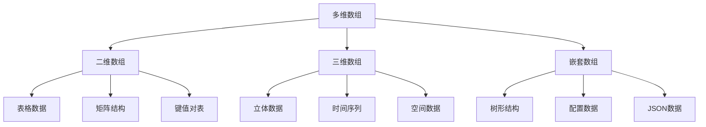

# 多维数组

## 🎯 学习目标
- 理解多维数组的概念和结构
- 掌握多维数组的创建、访问和操作
- 学会处理复杂的嵌套数据结构
- 了解多维数组在实际开发中的应用

## 📚 核心概念

### 多维数组结构



### 数组维度对比

| 维度 | 结构 | 访问方式 | 适用场景 |
|------|------|----------|----------|
| 一维 | `[1, 2, 3]` | `$array[0]` | 简单列表 |
| 二维 | `[[1, 2], [3, 4]]` | `$array[0][1]` | 表格、矩阵 |
| 三维 | `[[[1, 2]], [[3, 4]]]` | `$array[0][0][1]` | 立体数据 |
| 多维 | 任意嵌套 | 逐层访问 | 复杂结构 |

## 🔧 二维数组

### 基本创建和访问
```php
<?php
// 方式1：直接创建
$matrix = [
    [1, 2, 3],
    [4, 5, 6],
    [7, 8, 9]
];

// 方式2：逐步构建
$students = [];
$students[0] = ['name' => 'John', 'age' => 20, 'grade' => 'A'];
$students[1] = ['name' => 'Jane', 'age' => 19, 'grade' => 'B'];
$students[2] = ['name' => 'Bob', 'age' => 21, 'grade' => 'A'];

// 方式3：使用array()函数
$products = array(
    array('name' => 'Laptop', 'price' => 1000, 'stock' => 5),
    array('name' => 'Mouse', 'price' => 25, 'stock' => 50),
    array('name' => 'Keyboard', 'price' => 75, 'stock' => 20)
);

// 访问元素
echo $matrix[0][1]; // 输出: 2
echo $students[1]['name']; // 输出: Jane
echo $products[0]['price']; // 输出: 1000

// 修改元素
$matrix[0][1] = 10;
$students[1]['age'] = 20;
$products[0]['stock'] = 3;

print_r($matrix);
print_r($students);
print_r($products);
?>
```

### 二维数组操作
```php
<?php
// 添加新行
$students = [
    ['name' => 'John', 'age' => 20],
    ['name' => 'Jane', 'age' => 19]
];

$students[] = ['name' => 'Bob', 'age' => 21];
print_r($students);

// 添加新列
foreach ($students as &$student) {
    $student['grade'] = 'A';
}
print_r($students);

// 删除行
unset($students[1]);
$students = array_values($students); // 重新索引
print_r($students);

// 删除列
foreach ($students as &$student) {
    unset($student['grade']);
}
print_r($students);

// 转置矩阵
function transpose($matrix) {
    $transposed = [];
    $rows = count($matrix);
    $cols = count($matrix[0]);
    
    for ($i = 0; $i < $cols; $i++) {
        for ($j = 0; $j < $rows; $j++) {
            $transposed[$i][$j] = $matrix[$j][$i];
        }
    }
    
    return $transposed;
}

$matrix = [
    [1, 2, 3],
    [4, 5, 6]
];

$transposed = transpose($matrix);
print_r($transposed); // 输出: [[1, 4], [2, 5], [3, 6]]
?>
```

### 二维数组遍历
```php
<?php
$students = [
    ['name' => 'John', 'age' => 20, 'grade' => 'A'],
    ['name' => 'Jane', 'age' => 19, 'grade' => 'B'],
    ['name' => 'Bob', 'age' => 21, 'grade' => 'A']
];

// 方式1：嵌套foreach
foreach ($students as $index => $student) {
    echo "学生 $index:\n";
    foreach ($student as $key => $value) {
        echo "  $key: $value\n";
    }
}

// 方式2：for循环
for ($i = 0; $i < count($students); $i++) {
    echo "学生 $i: " . $students[$i]['name'] . "\n";
}

// 方式3：while循环
$i = 0;
while ($i < count($students)) {
    echo "学生 $i: " . $students[$i]['name'] . "\n";
    $i++;
}

// 方式4：使用array_walk
array_walk($students, function($student, $index) {
    echo "学生 $index: " . $student['name'] . "\n";
});

// 方式5：使用array_map
$names = array_map(function($student) {
    return $student['name'];
}, $students);
print_r($names);
?>
```

## 🔄 三维数组

### 三维数组创建
```php
<?php
// 方式1：直接创建
$cube = [
    [
        [1, 2, 3],
        [4, 5, 6],
        [7, 8, 9]
    ],
    [
        [10, 11, 12],
        [13, 14, 15],
        [16, 17, 18]
    ],
    [
        [19, 20, 21],
        [22, 23, 24],
        [25, 26, 27]
    ]
];

// 方式2：逐步构建
$data = [];
for ($i = 0; $i < 3; $i++) {
    for ($j = 0; $j < 3; $j++) {
        for ($k = 0; $k < 3; $k++) {
            $data[$i][$j][$k] = $i * 9 + $j * 3 + $k + 1;
        }
    }
}

// 方式3：时间序列数据
$timeSeries = [
    '2024-01' => [
        'week1' => ['mon' => 100, 'tue' => 120, 'wed' => 110],
        'week2' => ['mon' => 105, 'tue' => 125, 'wed' => 115],
        'week3' => ['mon' => 110, 'tue' => 130, 'wed' => 120]
    ],
    '2024-02' => [
        'week1' => ['mon' => 115, 'tue' => 135, 'wed' => 125],
        'week2' => ['mon' => 120, 'tue' => 140, 'wed' => 130]
    ]
];

// 访问元素
echo $cube[0][1][2]; // 输出: 6
echo $timeSeries['2024-01']['week2']['tue']; // 输出: 125

print_r($cube);
print_r($timeSeries);
?>
```

### 三维数组操作
```php
<?php
// 三维数组遍历
function traverse3D($array) {
    foreach ($array as $i => $level1) {
        echo "Level 1: $i\n";
        foreach ($level1 as $j => $level2) {
            echo "  Level 2: $j\n";
            foreach ($level2 as $k => $value) {
                echo "    Level 3: $k = $value\n";
            }
        }
    }
}

$data = [
    [
        ['a', 'b', 'c'],
        ['d', 'e', 'f']
    ],
    [
        ['g', 'h', 'i'],
        ['j', 'k', 'l']
    ]
];

traverse3D($data);

// 三维数组搜索
function search3D($array, $value) {
    foreach ($array as $i => $level1) {
        foreach ($level1 as $j => $level2) {
            foreach ($level2 as $k => $val) {
                if ($val === $value) {
                    return [$i, $j, $k];
                }
            }
        }
    }
    return null;
}

$position = search3D($data, 'e');
if ($position) {
    echo "找到 'e' 在位置: [" . implode(', ', $position) . "]\n";
}

// 三维数组统计
function count3D($array) {
    $count = 0;
    foreach ($array as $level1) {
        foreach ($level1 as $level2) {
            $count += count($level2);
        }
    }
    return $count;
}

echo "总元素数: " . count3D($data) . "\n";
?>
```

## 🌳 嵌套数组

### 复杂嵌套结构
```php
<?php
// 树形结构
$tree = [
    'name' => 'Root',
    'children' => [
        [
            'name' => 'Branch 1',
            'children' => [
                ['name' => 'Leaf 1.1'],
                ['name' => 'Leaf 1.2']
            ]
        ],
        [
            'name' => 'Branch 2',
            'children' => [
                ['name' => 'Leaf 2.1'],
                [
                    'name' => 'Branch 2.2',
                    'children' => [
                        ['name' => 'Leaf 2.2.1']
                    ]
                ]
            ]
        ]
    ]
];

// 配置数据结构
$config = [
    'database' => [
        'default' => [
            'host' => 'localhost',
            'port' => 3306,
            'username' => 'root',
            'password' => '',
            'database' => 'myapp'
        ],
        'test' => [
            'host' => 'test.localhost',
            'port' => 3306,
            'username' => 'test',
            'password' => 'test',
            'database' => 'testapp'
        ]
    ],
    'cache' => [
        'default' => 'file',
        'stores' => [
            'file' => [
                'driver' => 'file',
                'path' => '/tmp/cache'
            ],
            'redis' => [
                'driver' => 'redis',
                'host' => '127.0.0.1',
                'port' => 6379
            ]
        ]
    ]
];

// JSON-like结构
$jsonData = [
    'users' => [
        [
            'id' => 1,
            'name' => 'John',
            'profile' => [
                'age' => 25,
                'city' => 'NYC',
                'hobbies' => ['reading', 'gaming']
            ],
            'posts' => [
                [
                    'title' => 'Hello World',
                    'content' => 'My first post',
                    'tags' => ['intro', 'hello']
                ]
            ]
        ]
    ]
];

print_r($tree);
print_r($config);
print_r($jsonData);
?>
```

### 嵌套数组操作
```php
<?php
// 深度访问函数
function getNestedValue($array, $path, $default = null) {
    $keys = explode('.', $path);
    $current = $array;
    
    foreach ($keys as $key) {
        if (!is_array($current) || !array_key_exists($key, $current)) {
            return $default;
        }
        $current = $current[$key];
    }
    
    return $current;
}

// 深度设置函数
function setNestedValue(&$array, $path, $value) {
    $keys = explode('.', $path);
    $current = &$array;
    
    foreach ($keys as $key) {
        if (!is_array($current)) {
            $current = [];
        }
        if (!array_key_exists($key, $current)) {
            $current[$key] = [];
        }
        $current = &$current[$key];
    }
    
    $current = $value;
}

// 使用示例
$config = [
    'database' => [
        'default' => [
            'host' => 'localhost'
        ]
    ]
];

$host = getNestedValue($config, 'database.default.host');
echo $host; // 输出: localhost

setNestedValue($config, 'database.default.port', 3306);
setNestedValue($config, 'cache.driver', 'redis');

print_r($config);

// 递归遍历
function traverseNested($array, $prefix = '') {
    foreach ($array as $key => $value) {
        $currentPath = $prefix ? "$prefix.$key" : $key;
        
        if (is_array($value)) {
            echo "$currentPath: (array)\n";
            traverseNested($value, $currentPath);
        } else {
            echo "$currentPath: $value\n";
        }
    }
}

traverseNested($config);
?>
```

## 🎯 实际应用示例

### 表格数据处理
```php
<?php
class TableProcessor {
    private $data;
    
    public function __construct($data) {
        $this->data = $data;
    }
    
    // 获取列数据
    public function getColumn($columnName) {
        return array_column($this->data, $columnName);
    }
    
    // 按列排序
    public function sortByColumn($columnName, $direction = 'asc') {
        usort($this->data, function($a, $b) use ($columnName, $direction) {
            $comparison = $a[$columnName] <=> $b[$columnName];
            return $direction === 'desc' ? -$comparison : $comparison;
        });
        return $this;
    }
    
    // 过滤行
    public function filter($callback) {
        $this->data = array_filter($this->data, $callback);
        return $this;
    }
    
    // 添加列
    public function addColumn($columnName, $callback) {
        foreach ($this->data as &$row) {
            $row[$columnName] = $callback($row);
        }
        return $this;
    }
    
    // 删除列
    public function removeColumn($columnName) {
        foreach ($this->data as &$row) {
            unset($row[$columnName]);
        }
        return $this;
    }
    
    // 分组
    public function groupBy($columnName) {
        $groups = [];
        foreach ($this->data as $row) {
            $key = $row[$columnName];
            $groups[$key][] = $row;
        }
        return $groups;
    }
    
    // 获取数据
    public function getData() {
        return $this->data;
    }
    
    // 统计信息
    public function getStats() {
        if (empty($this->data)) {
            return [];
        }
        
        $stats = [
            'rows' => count($this->data),
            'columns' => count($this->data[0]),
            'column_names' => array_keys($this->data[0])
        ];
        
        return $stats;
    }
}

// 使用示例
$salesData = [
    ['product' => 'Laptop', 'category' => 'Electronics', 'sales' => 1000, 'month' => 'Jan'],
    ['product' => 'Mouse', 'category' => 'Electronics', 'sales' => 500, 'month' => 'Jan'],
    ['product' => 'Book', 'category' => 'Education', 'sales' => 200, 'month' => 'Feb'],
    ['product' => 'Pen', 'category' => 'Education', 'sales' => 50, 'month' => 'Feb']
];

$processor = new TableProcessor($salesData);

// 按销售额排序
$sorted = $processor->sortByColumn('sales', 'desc')->getData();
print_r($sorted);

// 过滤电子产品
$electronics = $processor->filter(function($row) {
    return $row['category'] === 'Electronics';
})->getData();
print_r($electronics);

// 按类别分组
$grouped = $processor->groupBy('category');
print_r($grouped);

// 添加利润率列
$withMargin = $processor->addColumn('margin', function($row) {
    return $row['sales'] * 0.2; // 20%利润率
})->getData();
print_r($withMargin);
?>
```

### 树形结构处理
```php
<?php
class TreeProcessor {
    // 构建树形结构
    public static function buildTree($flatData, $idKey = 'id', $parentKey = 'parent_id', $childrenKey = 'children') {
        $tree = [];
        $indexed = [];
        
        // 建立索引
        foreach ($flatData as $item) {
            $indexed[$item[$idKey]] = $item;
            $indexed[$item[$idKey]][$childrenKey] = [];
        }
        
        // 构建树
        foreach ($indexed as $item) {
            if ($item[$parentKey] && isset($indexed[$item[$parentKey]])) {
                $indexed[$item[$parentKey]][$childrenKey][] = &$indexed[$item[$idKey]];
            } else {
                $tree[] = &$indexed[$item[$idKey]];
            }
        }
        
        return $tree;
    }
    
    // 遍历树
    public static function traverseTree($tree, $callback, $level = 0) {
        foreach ($tree as $node) {
            $callback($node, $level);
            if (!empty($node['children'])) {
                self::traverseTree($node['children'], $callback, $level + 1);
            }
        }
    }
    
    // 查找节点
    public static function findNode($tree, $id, $idKey = 'id') {
        foreach ($tree as $node) {
            if ($node[$idKey] === $id) {
                return $node;
            }
            if (!empty($node['children'])) {
                $found = self::findNode($node['children'], $id, $idKey);
                if ($found) {
                    return $found;
                }
            }
        }
        return null;
    }
    
    // 获取所有叶子节点
    public static function getLeaves($tree, $childrenKey = 'children') {
        $leaves = [];
        self::traverseTree($tree, function($node, $level) use (&$leaves, $childrenKey) {
            if (empty($node[$childrenKey])) {
                $leaves[] = $node;
            }
        });
        return $leaves;
    }
    
    // 获取路径
    public static function getPath($tree, $id, $idKey = 'id', $childrenKey = 'children') {
        foreach ($tree as $node) {
            if ($node[$idKey] === $id) {
                return [$node];
            }
            if (!empty($node[$childrenKey])) {
                $path = self::getPath($node[$childrenKey], $id, $idKey, $childrenKey);
                if ($path) {
                    array_unshift($path, $node);
                    return $path;
                }
            }
        }
        return null;
    }
}

// 使用示例
$flatData = [
    ['id' => 1, 'name' => 'Root', 'parent_id' => null],
    ['id' => 2, 'name' => 'Branch 1', 'parent_id' => 1],
    ['id' => 3, 'name' => 'Branch 2', 'parent_id' => 1],
    ['id' => 4, 'name' => 'Leaf 1.1', 'parent_id' => 2],
    ['id' => 5, 'name' => 'Leaf 1.2', 'parent_id' => 2],
    ['id' => 6, 'name' => 'Leaf 2.1', 'parent_id' => 3]
];

$tree = TreeProcessor::buildTree($flatData);
print_r($tree);

// 遍历树
TreeProcessor::traverseTree($tree, function($node, $level) {
    echo str_repeat('  ', $level) . $node['name'] . "\n";
});

// 查找节点
$node = TreeProcessor::findNode($tree, 4);
print_r($node);

// 获取叶子节点
$leaves = TreeProcessor::getLeaves($tree);
print_r($leaves);

// 获取路径
$path = TreeProcessor::getPath($tree, 4);
print_r($path);
?>
```

### 配置管理系统
```php
<?php
class ConfigManager {
    private $config = [];
    
    public function __construct($configFile = null) {
        if ($configFile && file_exists($configFile)) {
            $this->config = include $configFile;
        }
    }
    
    // 获取配置值
    public function get($key, $default = null) {
        return $this->getNestedValue($this->config, $key, $default);
    }
    
    // 设置配置值
    public function set($key, $value) {
        $this->setNestedValue($this->config, $key, $value);
    }
    
    // 检查配置是否存在
    public function has($key) {
        return $this->getNestedValue($this->config, $key) !== null;
    }
    
    // 获取所有配置
    public function all() {
        return $this->config;
    }
    
    // 合并配置
    public function merge($config) {
        $this->config = $this->arrayMergeRecursive($this->config, $config);
    }
    
    // 深度获取值
    private function getNestedValue($array, $key, $default = null) {
        $keys = explode('.', $key);
        $current = $array;
        
        foreach ($keys as $k) {
            if (!is_array($current) || !array_key_exists($k, $current)) {
                return $default;
            }
            $current = $current[$k];
        }
        
        return $current;
    }
    
    // 深度设置值
    private function setNestedValue(&$array, $key, $value) {
        $keys = explode('.', $key);
        $current = &$array;
        
        foreach ($keys as $k) {
            if (!is_array($current)) {
                $current = [];
            }
            if (!array_key_exists($k, $current)) {
                $current[$k] = [];
            }
            $current = &$current[$k];
        }
        
        $current = $value;
    }
    
    // 递归合并数组
    private function arrayMergeRecursive($array1, $array2) {
        $merged = $array1;
        
        foreach ($array2 as $key => $value) {
            if (is_array($value) && isset($merged[$key]) && is_array($merged[$key])) {
                $merged[$key] = $this->arrayMergeRecursive($merged[$key], $value);
            } else {
                $merged[$key] = $value;
            }
        }
        
        return $merged;
    }
}

// 使用示例
$config = new ConfigManager();

// 设置配置
$config->set('database.host', 'localhost');
$config->set('database.port', 3306);
$config->set('cache.driver', 'redis');
$config->set('cache.redis.host', '127.0.0.1');

// 获取配置
echo $config->get('database.host'); // 输出: localhost
echo $config->get('cache.redis.host'); // 输出: 127.0.0.1

// 合并配置
$newConfig = [
    'database' => [
        'username' => 'root',
        'password' => 'secret'
    ],
    'app' => [
        'name' => 'My App',
        'debug' => true
    ]
];

$config->merge($newConfig);
print_r($config->all());
?>
```

## 📊 最佳实践

### 多维数组最佳实践
```php
<?php
// 1. 使用有意义的键名
// 不好的做法
$data = [
    [1, 'John', 25],
    [2, 'Jane', 30]
];

// 好的做法
$data = [
    ['id' => 1, 'name' => 'John', 'age' => 25],
    ['id' => 2, 'name' => 'Jane', 'age' => 30]
];

// 2. 使用类型提示
function processUsers(array $users): array {
    return array_map(function($user) {
        return [
            'name' => strtoupper($user['name']),
            'age' => $user['age']
        ];
    }, $users);
}

// 3. 验证数组结构
function validateUser(array $user): bool {
    $required = ['name', 'age', 'email'];
    
    foreach ($required as $field) {
        if (!array_key_exists($field, $user)) {
            return false;
        }
    }
    
    return true;
}

// 4. 使用常量定义键名
class UserFields {
    const ID = 'id';
    const NAME = 'name';
    const AGE = 'age';
    const EMAIL = 'email';
}

$user = [
    UserFields::ID => 1,
    UserFields::NAME => 'John',
    UserFields::AGE => 25,
    UserFields::EMAIL => 'john@example.com'
];

// 5. 使用函数处理复杂操作
function getNestedValue($array, $path, $default = null) {
    $keys = explode('.', $path);
    $current = $array;
    
    foreach ($keys as $key) {
        if (!is_array($current) || !array_key_exists($key, $current)) {
            return $default;
        }
        $current = $current[$key];
    }
    
    return $current;
}
?>
```

### 性能优化建议
```php
<?php
// 1. 避免深度嵌套
// 不好的做法
$data = $array['level1']['level2']['level3']['level4']['value'];

// 好的做法
$value = getNestedValue($array, 'level1.level2.level3.level4.value');

// 2. 使用引用传递
function processLargeArray(&$array) {
    foreach ($array as &$row) {
        foreach ($row as &$cell) {
            $cell = strtoupper($cell);
        }
    }
}

// 3. 缓存计算结果
function getColumn($array, $column) {
    static $cache = [];
    $key = md5(serialize($array) . $column);
    
    if (!isset($cache[$key])) {
        $cache[$key] = array_column($array, $column);
    }
    
    return $cache[$key];
}

// 4. 使用生成器处理大数据
function processLargeDataset($array) {
    foreach ($array as $row) {
        yield processRow($row);
    }
}

// 5. 合理使用内存
function memoryEfficientProcess($array) {
    $result = [];
    
    foreach ($array as $row) {
        $processed = processRow($row);
        $result[] = $processed;
        
        // 检查内存使用
        if (memory_get_usage() > 100 * 1024 * 1024) { // 100MB
            break;
        }
    }
    
    return $result;
}
?>
```

## 🎓 学习建议

### 费曼学习法应用
1. **选择概念**: 选择多维数组中的核心概念
2. **简化解释**: 用简单语言解释多维数组的结构
3. **识别盲点**: 发现理解不深入的地方
4. **重新学习**: 针对盲点进行深入学习

### 刻意练习重点
1. **结构理解**: 熟练掌握多维数组的结构
2. **访问操作**: 学会安全访问和操作多维数组
3. **实际应用**: 在实际项目中应用多维数组
4. **性能优化**: 了解多维数组的性能特点

## 🔗 相关链接
- [[01-数组基础|数组基础]]
- [[02-数组操作函数|数组操作函数]]
- [[04-字符串基础|字符串基础]]
- [[05-字符串处理函数|字符串处理函数]]
- [[02-核心理解层/面向对象编程/01-类与对象基础|类与对象基础]]
