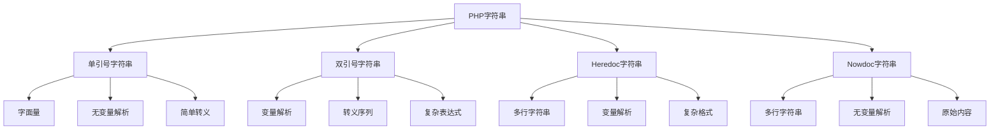

# 字符串基础

## 🎯 学习目标
- 理解PHP字符串的基本概念和特性
- 掌握字符串的创建、连接和基本操作
- 学会使用字符串的转义和格式化
- 了解字符串的内存结构和性能特点

## 📚 核心概念

### 字符串概述



### 字符串类型对比

| 类型 | 语法 | 变量解析 | 转义 | 适用场景 |
|------|------|----------|------|----------|
| 单引号 | `'text'` | 否 | 简单 | 简单文本 |
| 双引号 | `"text"` | 是 | 完整 | 动态内容 |
| Heredoc | `<<<EOF` | 是 | 完整 | 多行文本 |
| Nowdoc | `<<<'EOF'` | 否 | 无 | 多行字面量 |

## 🔧 字符串创建

### 基本创建方式
```php
<?php
// 方式1：单引号
$name = 'John Doe';
$message = 'Hello, World!';
$path = '/var/www/html';

// 方式2：双引号
$greeting = "Hello, $name!";
$calculation = "The result is: " . (5 + 3);
$multiline = "Line 1\nLine 2\nLine 3";

// 方式3：Heredoc语法
$html = <<<HTML
<!DOCTYPE html>
<html>
<head>
    <title>$name's Page</title>
</head>
<body>
    <h1>Welcome, $name!</h1>
</body>
</html>
HTML;

// 方式4：Nowdoc语法
$template = <<<'TEMPLATE'
This is a template with variables like $name and $age.
These variables will NOT be parsed.
TEMPLATE;

// 方式5：字符串连接
$firstName = 'John';
$lastName = 'Doe';
$fullName = $firstName . ' ' . $lastName;

// 方式6：使用sprintf
$formatted = sprintf('Hello, %s! You are %d years old.', $name, 25);

echo $name;
echo $greeting;
echo $fullName;
echo $formatted;
?>
```

### 字符串转义
```php
<?php
// 单引号转义
$single = 'It\'s a beautiful day!';
$backslash = 'This is a backslash: \\';
$newline = 'Line 1\nLine 2'; // 单引号中的\n不会被解析为换行

// 双引号转义
$double = "He said: \"Hello, World!\"";
$tab = "Column 1\tColumn 2\tColumn 3";
$newline = "Line 1\nLine 2\nLine 3";
$carriage = "Line 1\r\nLine 2";
$dollar = "The price is \$100";

// 特殊字符
$special = "Bell: \a, Backspace: \b, Form feed: \f";
$octal = "Octal: \101"; // A
$hex = "Hex: \x41"; // A
$unicode = "Unicode: \u{0041}"; // A (PHP 7.0+)

echo $single;
echo $double;
echo $tab;
echo $newline;
echo $dollar;
echo $special;
echo $octal;
echo $hex;
echo $unicode;
?>
```

### 字符串格式化
```php
<?php
// 基本格式化
$name = 'John';
$age = 25;
$price = 99.99;

// 使用sprintf
$message1 = sprintf('Hello, %s! You are %d years old.', $name, $age);
$message2 = sprintf('Price: $%.2f', $price);
$message3 = sprintf('ID: %04d', 42); // 输出: ID: 0042

// 使用printf（直接输出）
printf('Hello, %s! You are %d years old.', $name, $age);
printf('Price: $%.2f', $price);

// 使用vsprintf
$args = ['John', 25];
$message = vsprintf('Hello, %s! You are %d years old.', $args);

// 格式化说明符
$number = 12345.6789;
printf('整数: %d', $number);           // 输出: 12345
printf('浮点数: %.2f', $number);       // 输出: 12345.68
printf('科学计数: %e', $number);       // 输出: 1.234568e+4
printf('自动选择: %g', $number);       // 输出: 12345.7
printf('八进制: %o', 255);             // 输出: 377
printf('十六进制: %x', 255);           // 输出: ff
printf('十六进制: %X', 255);           // 输出: FF
printf('字符: %c', 65);                // 输出: A
printf('字符串: %s', 'Hello');         // 输出: Hello

// 宽度和对齐
printf('左对齐: %-10s', 'Hello');      // 输出: Hello     
printf('右对齐: %10s', 'Hello');       // 输出:      Hello
printf('零填充: %010d', 42);           // 输出: 0000000042

echo $message1;
echo $message2;
echo $message3;
?>
```

## 🔍 字符串访问

### 基本访问方式
```php
<?php
$str = 'Hello, World!';

// 访问单个字符
echo $str[0];   // 输出: H
echo $str[1];   // 输出: e
echo $str[12];  // 输出: !

// 使用大括号访问
echo $str{0};   // 输出: H (已废弃，不推荐)

// 获取字符串长度
echo strlen($str); // 输出: 13

// 检查字符是否存在
if (isset($str[5])) {
    echo "字符存在: " . $str[5]; // 输出: 字符存在: ,
}

// 修改字符
$str[0] = 'h';
echo $str; // 输出: hello, World!

// 安全访问函数
function getChar($str, $index, $default = '') {
    return isset($str[$index]) ? $str[$index] : $default;
}

echo getChar($str, 0); // 输出: h
echo getChar($str, 100); // 输出: (空字符串)

// 遍历字符串
for ($i = 0; $i < strlen($str); $i++) {
    echo $str[$i] . ' ';
}
echo "\n";

// 使用foreach遍历
foreach (str_split($str) as $char) {
    echo $char . ' ';
}
echo "\n";
?>
```

### 字符串切片
```php
<?php
$str = 'Hello, World!';

// 使用substr()函数
$sub1 = substr($str, 0, 5);    // 从位置0开始，取5个字符
$sub2 = substr($str, 7);       // 从位置7开始到末尾
$sub3 = substr($str, -6);      // 从倒数第6个字符开始到末尾
$sub4 = substr($str, 0, -1);   // 从开始到倒数第1个字符

echo $sub1; // 输出: Hello
echo $sub2; // 输出: World!
echo $sub3; // 输出: World!
echo $sub4; // 输出: Hello, World

// 使用mb_substr()处理多字节字符
$utf8 = '你好，世界！';
$sub_utf8 = mb_substr($utf8, 0, 2, 'UTF-8');
echo $sub_utf8; // 输出: 你好

// 安全切片函数
function safeSubstr($str, $start, $length = null) {
    $strLen = strlen($str);
    
    // 处理负数起始位置
    if ($start < 0) {
        $start = $strLen + $start;
    }
    
    // 处理负数长度
    if ($length !== null && $length < 0) {
        $length = $strLen + $length - $start;
    }
    
    // 边界检查
    if ($start < 0 || $start >= $strLen) {
        return '';
    }
    
    return substr($str, $start, $length);
}

echo safeSubstr($str, 0, 5);   // 输出: Hello
echo safeSubstr($str, -6);     // 输出: World!
echo safeSubstr($str, 100);    // 输出: (空字符串)
?>
```

## ✏️ 字符串修改

### 基本修改操作
```php
<?php
$str = 'Hello, World!';

// 字符串替换
$newStr = str_replace('World', 'PHP', $str);
echo $newStr; // 输出: Hello, PHP!

// 不区分大小写替换
$newStr = str_ireplace('world', 'PHP', $str);
echo $newStr; // 输出: Hello, PHP!

// 多重替换
$replacements = ['Hello' => 'Hi', 'World' => 'Universe'];
$newStr = str_replace(array_keys($replacements), array_values($replacements), $str);
echo $newStr; // 输出: Hi, Universe!

// 字符串插入
function insertString($str, $insert, $position) {
    return substr($str, 0, $position) . $insert . substr($str, $position);
}

$newStr = insertString($str, 'Beautiful ', 7);
echo $newStr; // 输出: Hello, Beautiful World!

// 字符串删除
function removeString($str, $start, $length) {
    return substr($str, 0, $start) . substr($str, $start + $length);
}

$newStr = removeString($str, 7, 6);
echo $newStr; // 输出: Hello, !

// 字符串反转
$reversed = strrev($str);
echo $reversed; // 输出: !dlroW ,olleH

// 字符串重复
$repeated = str_repeat('Hello ', 3);
echo $repeated; // 输出: Hello Hello Hello
?>
```

### 字符串填充和修剪
```php
<?php
$str = 'Hello';

// 字符串填充
$padded1 = str_pad($str, 10);                    // 右填充空格
$padded2 = str_pad($str, 10, '-');               // 右填充破折号
$padded3 = str_pad($str, 10, '-', STR_PAD_LEFT); // 左填充
$padded4 = str_pad($str, 10, '-', STR_PAD_BOTH); // 两端填充

echo "'$padded1'"; // 输出: 'Hello     '
echo "'$padded2'"; // 输出: 'Hello-----'
echo "'$padded3'"; // 输出: '-----Hello'
echo "'$padded4'"; // 输出: '--Hello---'

// 字符串修剪
$str = '  Hello, World!  ';

$trimmed1 = trim($str);        // 修剪两端空白
$trimmed2 = ltrim($str);       // 修剪左端空白
$trimmed3 = rtrim($str);       // 修剪右端空白
$trimmed4 = trim($str, ' !');  // 修剪指定字符

echo "'$trimmed1'"; // 输出: 'Hello, World!'
echo "'$trimmed2'"; // 输出: 'Hello, World!  '
echo "'$trimmed3'"; // 输出: '  Hello, World!'
echo "'$trimmed4'"; // 输出: 'Hello, World'

// 自定义修剪函数
function trimChars($str, $chars) {
    return trim($str, $chars);
}

$customTrimmed = trimChars('***Hello***', '*');
echo $customTrimmed; // 输出: Hello
?>
```

## 🔄 字符串转换

### 大小写转换
```php
<?php
$str = 'Hello, World!';

// 基本大小写转换
$lower = strtolower($str);
$upper = strtoupper($str);
$first = ucfirst($str);
$words = ucwords($str);

echo $lower;  // 输出: hello, world!
echo $upper;  // 输出: HELLO, WORLD!
echo $first;  // 输出: Hello, World!
echo $words;  // 输出: Hello, World!

// 多字节字符大小写转换
$utf8 = 'привет мир';
$utf8Upper = mb_strtoupper($utf8, 'UTF-8');
$utf8Lower = mb_strtolower($utf8Upper, 'UTF-8');

echo $utf8Upper; // 输出: ПРИВЕТ МИР
echo $utf8Lower; // 输出: привет мир

// 首字母大写
function capitalize($str) {
    return ucfirst(strtolower($str));
}

$name = 'JOHN DOE';
echo capitalize($name); // 输出: John doe

// 标题格式
function titleCase($str) {
    return ucwords(strtolower($str));
}

$title = 'THE QUICK BROWN FOX';
echo titleCase($title); // 输出: The Quick Brown Fox

// 驼峰命名转换
function toCamelCase($str, $separator = '_') {
    $words = explode($separator, $str);
    $camelCase = $words[0];
    
    for ($i = 1; $i < count($words); $i++) {
        $camelCase .= ucfirst($words[$i]);
    }
    
    return $camelCase;
}

$snakeCase = 'user_name';
echo toCamelCase($snakeCase); // 输出: userName

// 下划线命名转换
function toSnakeCase($str) {
    return strtolower(preg_replace('/([a-z])([A-Z])/', '$1_$2', $str));
}

$camelCase = 'userName';
echo toSnakeCase($camelCase); // 输出: user_name
?>
```

### 字符编码转换
```php
<?php
// 字符编码检测
$str = 'Hello, 世界!';
$encoding = mb_detect_encoding($str);
echo "检测到的编码: $encoding\n";

// 字符编码转换
$utf8 = 'Hello, 世界!';
$gbk = mb_convert_encoding($utf8, 'GBK', 'UTF-8');
$utf8Back = mb_convert_encoding($gbk, 'UTF-8', 'GBK');

echo "UTF-8: $utf8\n";
echo "GBK: $gbk\n";
echo "转换回UTF-8: $utf8Back\n";

// HTML实体转换
$html = '&lt;script&gt;alert("XSS")&lt;/script&gt;';
$decoded = html_entity_decode($html);
$encoded = htmlspecialchars($decoded);

echo "HTML实体: $html\n";
echo "解码后: $decoded\n";
echo "重新编码: $encoded\n";

// URL编码
$url = 'Hello, 世界!';
$encoded = urlencode($url);
$decoded = urldecode($encoded);

echo "原始URL: $url\n";
echo "编码后: $encoded\n";
echo "解码后: $decoded\n";

// Base64编码
$data = 'Hello, World!';
$base64 = base64_encode($data);
$decoded = base64_decode($base64);

echo "原始数据: $data\n";
echo "Base64编码: $base64\n";
echo "Base64解码: $decoded\n";

// JSON编码
$array = ['name' => 'John', 'age' => 25];
$json = json_encode($array);
$decoded = json_decode($json, true);

echo "数组: " . print_r($array, true);
echo "JSON: $json\n";
echo "解码后: " . print_r($decoded, true);
?>
```

## 🎯 实际应用示例

### 字符串工具类
```php
<?php
class StringUtils {
    // 字符串清理
    public static function clean($str) {
        $str = trim($str);
        $str = htmlspecialchars($str, ENT_QUOTES, 'UTF-8');
        return $str;
    }
    
    // 字符串验证
    public static function isValidEmail($email) {
        return filter_var($email, FILTER_VALIDATE_EMAIL) !== false;
    }
    
    public static function isValidUrl($url) {
        return filter_var($url, FILTER_VALIDATE_URL) !== false;
    }
    
    // 字符串截取
    public static function truncate($str, $length, $suffix = '...') {
        if (strlen($str) <= $length) {
            return $str;
        }
        
        return substr($str, 0, $length - strlen($suffix)) . $suffix;
    }
    
    // 字符串掩码
    public static function mask($str, $start = 0, $length = null, $mask = '*') {
        $strLen = strlen($str);
        
        if ($length === null) {
            $length = $strLen - $start;
        }
        
        $end = $start + $length;
        $masked = substr($str, 0, $start) . str_repeat($mask, $length) . substr($str, $end);
        
        return $masked;
    }
    
    // 字符串随机化
    public static function random($length = 10, $chars = 'abcdefghijklmnopqrstuvwxyzABCDEFGHIJKLMNOPQRSTUVWXYZ0123456789') {
        $result = '';
        $charsLen = strlen($chars);
        
        for ($i = 0; $i < $length; $i++) {
            $result .= $chars[rand(0, $charsLen - 1)];
        }
        
        return $result;
    }
    
    // 字符串相似度
    public static function similarity($str1, $str2) {
        similar_text($str1, $str2, $percent);
        return $percent;
    }
    
    // 字符串距离
    public static function distance($str1, $str2) {
        return levenshtein($str1, $str2);
    }
    
    // 字符串格式化
    public static function format($template, $data) {
        return vsprintf($template, $data);
    }
    
    // 字符串模板
    public static function template($template, $data) {
        foreach ($data as $key => $value) {
            $template = str_replace("{{$key}}", $value, $template);
        }
        return $template;
    }
}

// 使用示例
$email = '  user@example.com  ';
$cleaned = StringUtils::clean($email);
echo "清理后: '$cleaned'\n";

$isValid = StringUtils::isValidEmail($cleaned);
echo "邮箱有效: " . ($isValid ? '是' : '否') . "\n";

$longText = 'This is a very long text that needs to be truncated';
$truncated = StringUtils::truncate($longText, 20);
echo "截取后: $truncated\n";

$phone = '13812345678';
$masked = StringUtils::mask($phone, 3, 4);
echo "掩码后: $masked\n";

$random = StringUtils::random(8);
echo "随机字符串: $random\n";

$similarity = StringUtils::similarity('hello', 'hallo');
echo "相似度: $similarity%\n";

$template = 'Hello, {{name}}! You are {{age}} years old.';
$data = ['name' => 'John', 'age' => 25];
$result = StringUtils::template($template, $data);
echo "模板结果: $result\n";
?>
```

### 文本处理器
```php
<?php
class TextProcessor {
    private $text;
    
    public function __construct($text) {
        $this->text = $text;
    }
    
    // 获取文本
    public function getText() {
        return $this->text;
    }
    
    // 设置文本
    public function setText($text) {
        $this->text = $text;
        return $this;
    }
    
    // 清理文本
    public function clean() {
        $this->text = trim($this->text);
        $this->text = preg_replace('/\s+/', ' ', $this->text);
        return $this;
    }
    
    // 转换为小写
    public function toLower() {
        $this->text = strtolower($this->text);
        return $this;
    }
    
    // 转换为大写
    public function toUpper() {
        $this->text = strtoupper($this->text);
        return $this;
    }
    
    // 首字母大写
    public function capitalize() {
        $this->text = ucfirst($this->text);
        return $this;
    }
    
    // 标题格式
    public function titleCase() {
        $this->text = ucwords($this->text);
        return $this;
    }
    
    // 反转文本
    public function reverse() {
        $this->text = strrev($this->text);
        return $this;
    }
    
    // 替换文本
    public function replace($search, $replace) {
        $this->text = str_replace($search, $replace, $this->text);
        return $this;
    }
    
    // 正则替换
    public function pregReplace($pattern, $replacement) {
        $this->text = preg_replace($pattern, $replacement, $this->text);
        return $this;
    }
    
    // 截取文本
    public function truncate($length, $suffix = '...') {
        if (strlen($this->text) > $length) {
            $this->text = substr($this->text, 0, $length - strlen($suffix)) . $suffix;
        }
        return $this;
    }
    
    // 填充文本
    public function pad($length, $padString = ' ', $padType = STR_PAD_RIGHT) {
        $this->text = str_pad($this->text, $length, $padString, $padType);
        return $this;
    }
    
    // 统计信息
    public function getStats() {
        return [
            'length' => strlen($this->text),
            'words' => str_word_count($this->text),
            'lines' => substr_count($this->text, "\n") + 1,
            'chars' => count_chars($this->text, 1)
        ];
    }
    
    // 查找文本
    public function find($search) {
        return strpos($this->text, $search);
    }
    
    // 检查包含
    public function contains($search) {
        return strpos($this->text, $search) !== false;
    }
    
    // 检查开始
    public function startsWith($prefix) {
        return strpos($this->text, $prefix) === 0;
    }
    
    // 检查结束
    public function endsWith($suffix) {
        return substr($this->text, -strlen($suffix)) === $suffix;
    }
}

// 使用示例
$processor = new TextProcessor('  hello world  ');

$result = $processor
    ->clean()
    ->titleCase()
    ->pad(20, '-')
    ->getText();

echo "处理结果: '$result'\n";

$stats = $processor->getStats();
print_r($stats);

$contains = $processor->contains('Hello');
echo "包含'Hello': " . ($contains ? '是' : '否') . "\n";
?>
```

## 📊 最佳实践

### 字符串操作最佳实践
```php
<?php
// 1. 使用合适的字符串类型
// 简单文本使用单引号
$simple = 'Hello, World!';

// 需要变量解析使用双引号
$dynamic = "Hello, $name!";

// 多行文本使用Heredoc
$multiline = <<<HTML
<div>
    <h1>$title</h1>
    <p>$content</p>
</div>
HTML;

// 2. 安全处理用户输入
function sanitizeInput($input) {
    $input = trim($input);
    $input = stripslashes($input);
    $input = htmlspecialchars($input, ENT_QUOTES, 'UTF-8');
    return $input;
}

// 3. 使用类型提示
function processString(string $str): string {
    return strtoupper(trim($str));
}

// 4. 避免字符串拼接在循环中
// 不好的做法
$result = '';
foreach ($items as $item) {
    $result .= $item . ', ';
}

// 好的做法
$result = implode(', ', $items);

// 5. 使用常量定义字符串
class Messages {
    const WELCOME = 'Welcome to our application!';
    const ERROR = 'An error occurred.';
    const SUCCESS = 'Operation completed successfully.';
}

echo Messages::WELCOME;
?>
```

### 性能优化建议
```php
<?php
// 1. 避免在循环中拼接字符串
// 不好的做法
$result = '';
for ($i = 0; $i < 1000; $i++) {
    $result .= $i . ', ';
}

// 好的做法
$numbers = range(0, 999);
$result = implode(', ', $numbers);

// 2. 使用单引号提高性能
$fast = 'Hello, World!';        // 快
$slow = "Hello, World!";        // 慢（需要解析）

// 3. 缓存字符串操作结果
function expensiveStringOperation($str) {
    static $cache = [];
    
    if (!isset($cache[$str])) {
        $cache[$str] = strtoupper($str);
    }
    
    return $cache[$str];
}

// 4. 使用引用避免复制
function processLargeString(&$str) {
    $str = strtoupper($str);
}

// 5. 合理使用字符串函数
$str = 'Hello, World!';

// 使用最合适的函数
$length = strlen($str);           // 获取长度
$upper = strtoupper($str);        // 转大写
$replaced = str_replace('World', 'PHP', $str); // 替换
?>
```

## 🎓 学习建议

### 费曼学习法应用
1. **选择概念**: 选择字符串基础中的核心概念
2. **简化解释**: 用简单语言解释字符串的特性和用法
3. **识别盲点**: 发现理解不深入的地方
4. **重新学习**: 针对盲点进行深入学习

### 刻意练习重点
1. **字符串创建**: 练习各种字符串创建方式
2. **字符串操作**: 掌握字符串的基本操作
3. **字符串转换**: 学会字符串的各种转换
4. **实际应用**: 在实际项目中应用字符串知识

## 🔗 相关链接
- [[01-数组基础|数组基础]]
- [[02-数组操作函数|数组操作函数]]
- [[03-多维数组|多维数组]]
- [[05-字符串处理函数|字符串处理函数]]
- [[01-基础认知层/语法基础/02-数据类型详解|数据类型详解]]
