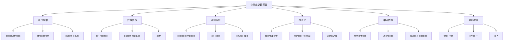

# 字符串处理函数

## 🎯 学习目标
- 理解PHP字符串处理函数的分类和用途
- 掌握字符串的查找、替换、分割、连接等操作
- 学会使用字符串的格式化、编码和验证函数
- 了解字符串处理函数的性能特点

## 📚 核心概念

### 字符串处理函数分类



### 函数分类对比

| 分类 | 主要函数 | 特点 | 适用场景 |
|------|----------|------|----------|
| 查找搜索 | strpos, strstr, substr_count | 定位和计数 | 文本搜索、验证 |
| 替换修改 | str_replace, substr_replace | 修改内容 | 文本替换、格式化 |
| 分割连接 | explode, implode, str_split | 结构转换 | 数据解析、重组 |
| 格式化 | sprintf, number_format | 格式化输出 | 显示格式化、模板 |
| 编码转换 | htmlentities, urlencode | 编码处理 | 安全处理、传输 |
| 验证检查 | filter_var, ctype_* | 数据验证 | 输入验证、类型检查 |

## 🔍 查找搜索函数

### 基本查找函数
```php
<?php
$text = 'Hello, World! Hello, PHP!';

// strpos() - 查找字符串位置
$pos1 = strpos($text, 'World');
$pos2 = strpos($text, 'Hello');
$pos3 = strpos($text, 'Hello', 1); // 从位置1开始查找

echo "World位置: $pos1\n"; // 输出: 7
echo "Hello位置: $pos2\n"; // 输出: 0
echo "Hello位置(从1开始): $pos3\n"; // 输出: 14

// strrpos() - 从右向左查找
$rpos = strrpos($text, 'Hello');
echo "Hello最后位置: $rpos\n"; // 输出: 14

// stripos() - 不区分大小写查找
$ipos = stripos($text, 'world');
echo "world位置(不区分大小写): $ipos\n"; // 输出: 7

// strstr() - 返回从找到位置开始的字符串
$found = strstr($text, 'World');
echo "从World开始: $found\n"; // 输出: World! Hello, PHP!

// stristr() - 不区分大小写
$ifound = stristr($text, 'world');
echo "从world开始(不区分大小写): $ifound\n"; // 输出: World! Hello, PHP!

// substr_count() - 计算子字符串出现次数
$count = substr_count($text, 'Hello');
echo "Hello出现次数: $count\n"; // 输出: 2

// 重叠计数
$overlap = substr_count($text, 'll');
echo "ll出现次数: $overlap\n"; // 输出: 2
?>
```

### 高级查找函数
```php
<?php
$text = 'The quick brown fox jumps over the lazy dog';

// 查找所有匹配位置
function findAllPositions($haystack, $needle) {
    $positions = [];
    $offset = 0;
    
    while (($pos = strpos($haystack, $needle, $offset)) !== false) {
        $positions[] = $pos;
        $offset = $pos + 1;
    }
    
    return $positions;
}

$positions = findAllPositions($text, 'o');
print_r($positions); // 输出: [12, 17, 26, 41]

// 查找单词边界
function findWord($text, $word) {
    $pattern = '/\b' . preg_quote($word, '/') . '\b/';
    return preg_match($pattern, $text);
}

$found = findWord($text, 'fox');
echo "找到单词'fox': " . ($found ? '是' : '否') . "\n";

// 查找多个字符串
function findAny($text, $needles) {
    $results = [];
    
    foreach ($needles as $needle) {
        $pos = strpos($text, $needle);
        if ($pos !== false) {
            $results[$needle] = $pos;
        }
    }
    
    return $results;
}

$needles = ['quick', 'brown', 'red', 'fox'];
$results = findAny($text, $needles);
print_r($results);

// 查找并返回上下文
function findWithContext($text, $needle, $context = 10) {
    $pos = strpos($text, $needle);
    
    if ($pos === false) {
        return false;
    }
    
    $start = max(0, $pos - $context);
    $length = strlen($needle) + 2 * $context;
    
    return substr($text, $start, $length);
}

$context = findWithContext($text, 'fox', 5);
echo "上下文: $context\n"; // 输出: brown fox jumps
?>
```

## 🔄 替换修改函数

### 基本替换函数
```php
<?php
$text = 'Hello, World! Hello, PHP!';

// str_replace() - 基本替换
$replaced1 = str_replace('Hello', 'Hi', $text);
echo "替换Hello: $replaced1\n"; // 输出: Hi, World! Hi, PHP!

// 多重替换
$search = ['Hello', 'World', 'PHP'];
$replace = ['Hi', 'Universe', 'JavaScript'];
$replaced2 = str_replace($search, $replace, $text);
echo "多重替换: $replaced2\n"; // 输出: Hi, Universe! Hi, JavaScript!

// 统计替换次数
$count = 0;
$replaced3 = str_replace('Hello', 'Hi', $text, $count);
echo "替换次数: $count\n"; // 输出: 2

// str_ireplace() - 不区分大小写替换
$caseText = 'Hello, world! HELLO, PHP!';
$replaced4 = str_ireplace('hello', 'Hi', $caseText);
echo "不区分大小写替换: $replaced4\n"; // 输出: Hi, world! Hi, PHP!

// substr_replace() - 替换指定位置
$replaced5 = substr_replace($text, 'Hi', 0, 5);
echo "位置替换: $replaced5\n"; // 输出: Hi, World! Hello, PHP!

// 插入文本
$inserted = substr_replace($text, 'Beautiful ', 7, 0);
echo "插入文本: $inserted\n"; // 输出: Hello, Beautiful World! Hello, PHP!

// strtr() - 字符转换
$translated = strtr($text, 'Hello', 'Hi___');
echo "字符转换: $translated\n"; // 输出: Hi___, W_r_d! Hi___, PHP!

// 数组转换
$translation = [
    'Hello' => 'Hi',
    'World' => 'Universe',
    'PHP' => 'JavaScript'
];
$translated2 = strtr($text, $translation);
echo "数组转换: $translated2\n"; // 输出: Hi, Universe! Hi, JavaScript!
?>
```

### 高级替换函数
```php
<?php
$text = 'The price is $100 and the discount is 10%';

// 正则替换
$pattern = '/\$(\d+)/';
$replacement = '¥$1';
$replaced = preg_replace($pattern, $replacement, $text);
echo "正则替换: $replaced\n"; // 输出: The price is ¥100 and the discount is 10%

// 回调替换
function formatPrice($matches) {
    $price = $matches[1];
    return '¥' . number_format($price);
}

$pattern = '/\$(\d+)/';
$replaced = preg_replace_callback($pattern, 'formatPrice', $text);
echo "回调替换: $replaced\n"; // 输出: The price is ¥100 and the discount is 10%

// 条件替换
function conditionalReplace($text, $search, $replace, $condition) {
    if ($condition) {
        return str_replace($search, $replace, $text);
    }
    return $text;
}

$result = conditionalReplace($text, '$100', '$200', true);
echo "条件替换: $result\n";

// 批量替换
function batchReplace($text, $replacements) {
    foreach ($replacements as $search => $replace) {
        $text = str_replace($search, $replace, $text);
    }
    return $text;
}

$replacements = [
    '$100' => '¥100',
    '10%' => '15%',
    'discount' => '优惠'
];
$result = batchReplace($text, $replacements);
echo "批量替换: $result\n";
?>
```

## ✂️ 分割连接函数

### 基本分割函数
```php
<?php
$text = 'apple,banana,orange,grape';
$sentence = 'The quick brown fox jumps over the lazy dog';

// explode() - 按分隔符分割
$fruits = explode(',', $text);
print_r($fruits); // 输出: ['apple', 'banana', 'orange', 'grape']

// 限制分割次数
$limited = explode(',', $text, 2);
print_r($limited); // 输出: ['apple', 'banana,orange,grape']

// str_split() - 按字符分割
$chars = str_split($text);
print_r($chars); // 输出: ['a', 'p', 'p', 'l', 'e', ',', ...]

// 按指定长度分割
$chunks = str_split($text, 5);
print_r($chunks); // 输出: ['apple', ',bana', 'na,or', 'ange,', 'grape']

// chunk_split() - 按长度分割并添加分隔符
$chunked = chunk_split($text, 5, "\n");
echo "分块结果:\n$chunked\n";

// implode() - 连接数组
$joined = implode(', ', $fruits);
echo "连接结果: $joined\n"; // 输出: apple, banana, orange, grape

// 使用join()别名
$joined2 = join(' | ', $fruits);
echo "连接结果: $joined2\n"; // 输出: apple | banana | orange | grape
?>
```

### 高级分割函数
```php
<?php
$text = 'apple,banana,orange,grape';
$sentence = 'The quick brown fox jumps over the lazy dog';

// 安全分割函数
function safeExplode($delimiter, $string, $limit = null) {
    if (empty($string)) {
        return [];
    }
    
    if ($limit === null) {
        return explode($delimiter, $string);
    }
    
    return explode($delimiter, $string, $limit);
}

$safe = safeExplode(',', $text, 2);
print_r($safe);

// 多分隔符分割
function multiExplode($delimiters, $string) {
    $pattern = '/[' . preg_quote(implode('', $delimiters), '/') . ']/';
    return preg_split($pattern, $string);
}

$multi = multiExplode([',', ';', '|'], 'apple,banana;orange|grape');
print_r($multi);

// 按单词分割
$words = explode(' ', $sentence);
print_r($words);

// 按行分割
$lines = "Line 1\nLine 2\nLine 3";
$lineArray = explode("\n", $lines);
print_r($lineArray);

// 按正则表达式分割
$pattern = '/\s+/';
$split = preg_split($pattern, $sentence);
print_r($split);

// 保留分隔符的分割
function explodeWithDelimiter($delimiter, $string) {
    $pattern = '/(' . preg_quote($delimiter, '/') . ')/';
    return preg_split($pattern, $string, -1, PREG_SPLIT_DELIM_CAPTURE);
}

$withDelimiter = explodeWithDelimiter(',', $text);
print_r($withDelimiter);
?>
```

## 📝 格式化函数

### 基本格式化函数
```php
<?php
$number = 12345.6789;
$text = 'The quick brown fox jumps over the lazy dog';

// sprintf() - 格式化字符串
$formatted1 = sprintf('数字: %d', $number);
$formatted2 = sprintf('浮点数: %.2f', $number);
$formatted3 = sprintf('科学计数: %e', $number);
$formatted4 = sprintf('十六进制: %x', 255);

echo "$formatted1\n"; // 输出: 数字: 12345
echo "$formatted2\n"; // 输出: 浮点数: 12345.68
echo "$formatted3\n"; // 输出: 科学计数: 1.234568e+4
echo "$formatted4\n"; // 输出: 十六进制: ff

// printf() - 直接输出
printf('价格: $%.2f', 99.99);
echo "\n";

// number_format() - 数字格式化
$formatted5 = number_format($number);
$formatted6 = number_format($number, 2);
$formatted7 = number_format($number, 2, ',', '.');

echo "默认格式: $formatted5\n"; // 输出: 12,346
echo "小数格式: $formatted6\n"; // 输出: 12,345.68
echo "自定义格式: $formatted7\n"; // 输出: 12.345,68

// wordwrap() - 文本换行
$wrapped = wordwrap($text, 20, "\n");
echo "换行文本:\n$wrapped\n";

// 强制换行
$forced = wordwrap($text, 20, "\n", true);
echo "强制换行:\n$forced\n";
?>
```

### 高级格式化函数
```php
<?php
$text = 'The quick brown fox jumps over the lazy dog';
$number = 12345.6789;

// 自定义格式化函数
function formatCurrency($amount, $currency = 'USD') {
    $symbols = [
        'USD' => '$',
        'EUR' => '€',
        'GBP' => '£',
        'CNY' => '¥'
    ];
    
    $symbol = $symbols[$currency] ?? $currency;
    return $symbol . number_format($amount, 2);
}

echo formatCurrency(99.99); // 输出: $99.99
echo formatCurrency(99.99, 'EUR'); // 输出: €99.99

// 文本对齐
function alignText($text, $width, $align = 'left') {
    $length = strlen($text);
    
    if ($length >= $width) {
        return substr($text, 0, $width);
    }
    
    $padding = $width - $length;
    
    switch ($align) {
        case 'left':
            return $text . str_repeat(' ', $padding);
        case 'right':
            return str_repeat(' ', $padding) . $text;
        case 'center':
            $left = floor($padding / 2);
            $right = $padding - $left;
            return str_repeat(' ', $left) . $text . str_repeat(' ', $right);
        default:
            return $text;
    }
}

echo "'" . alignText('Hello', 10, 'left') . "'\n";
echo "'" . alignText('Hello', 10, 'right') . "'\n";
echo "'" . alignText('Hello', 10, 'center') . "'\n";

// 表格格式化
function formatTable($data, $headers) {
    $result = '';
    
    // 计算列宽
    $widths = [];
    foreach ($headers as $i => $header) {
        $widths[$i] = strlen($header);
        foreach ($data as $row) {
            $widths[$i] = max($widths[$i], strlen($row[$i]));
        }
    }
    
    // 输出表头
    foreach ($headers as $i => $header) {
        $result .= alignText($header, $widths[$i]) . ' | ';
    }
    $result .= "\n";
    
    // 输出分隔线
    foreach ($widths as $width) {
        $result .= str_repeat('-', $width) . ' | ';
    }
    $result .= "\n";
    
    // 输出数据
    foreach ($data as $row) {
        foreach ($row as $i => $cell) {
            $result .= alignText($cell, $widths[$i]) . ' | ';
        }
        $result .= "\n";
    }
    
    return $result;
}

$tableData = [
    ['John', '25', 'NYC'],
    ['Jane', '30', 'LA'],
    ['Bob', '35', 'Chicago']
];
$headers = ['Name', 'Age', 'City'];

echo formatTable($tableData, $headers);
?>
```

## 🔐 编码转换函数

### 基本编码函数
```php
<?php
$text = 'Hello, 世界!';
$html = '<script>alert("XSS")</script>';
$url = 'Hello, 世界!';

// HTML实体编码
$encoded = htmlentities($text, ENT_QUOTES, 'UTF-8');
echo "HTML编码: $encoded\n";

// HTML特殊字符编码
$special = htmlspecialchars($html, ENT_QUOTES, 'UTF-8');
echo "特殊字符编码: $special\n";

// HTML实体解码
$decoded = html_entity_decode($encoded, ENT_QUOTES, 'UTF-8');
echo "HTML解码: $decoded\n";

// URL编码
$urlEncoded = urlencode($url);
echo "URL编码: $urlEncoded\n";

// URL解码
$urlDecoded = urldecode($urlEncoded);
echo "URL解码: $urlDecoded\n";

// Base64编码
$base64 = base64_encode($text);
echo "Base64编码: $base64\n";

// Base64解码
$base64Decoded = base64_decode($base64);
echo "Base64解码: $base64Decoded\n";

// JSON编码
$data = ['name' => 'John', 'age' => 25];
$json = json_encode($data);
echo "JSON编码: $json\n";

// JSON解码
$jsonDecoded = json_decode($json, true);
print_r($jsonDecoded);
?>
```

### 高级编码函数
```php
<?php
// 安全编码函数
function safeEncode($text, $type = 'html') {
    switch ($type) {
        case 'html':
            return htmlspecialchars($text, ENT_QUOTES, 'UTF-8');
        case 'url':
            return urlencode($text);
        case 'base64':
            return base64_encode($text);
        case 'json':
            return json_encode($text, JSON_UNESCAPED_UNICODE);
        default:
            return $text;
    }
}

// 安全解码函数
function safeDecode($text, $type = 'html') {
    switch ($type) {
        case 'html':
            return html_entity_decode($text, ENT_QUOTES, 'UTF-8');
        case 'url':
            return urldecode($text);
        case 'base64':
            return base64_decode($text);
        case 'json':
            return json_decode($text, true);
        default:
            return $text;
    }
}

// 使用示例
$text = 'Hello, 世界! <script>alert("XSS")</script>';

$htmlEncoded = safeEncode($text, 'html');
echo "HTML编码: $htmlEncoded\n";

$urlEncoded = safeEncode($text, 'url');
echo "URL编码: $urlEncoded\n";

$base64Encoded = safeEncode($text, 'base64');
echo "Base64编码: $base64Encoded\n";

// 多重编码
function multiEncode($text, $encodings) {
    $result = $text;
    foreach ($encodings as $encoding) {
        $result = safeEncode($result, $encoding);
    }
    return $result;
}

$multiEncoded = multiEncode($text, ['html', 'base64']);
echo "多重编码: $multiEncoded\n";
?>
```

## 🎯 实际应用示例

### 文本处理器
```php
<?php
class TextProcessor {
    private $text;
    
    public function __construct($text) {
        $this->text = $text;
    }
    
    // 获取文本
    public function getText() {
        return $this->text;
    }
    
    // 设置文本
    public function setText($text) {
        $this->text = $text;
        return $this;
    }
    
    // 查找文本
    public function find($needle, $caseSensitive = true) {
        if ($caseSensitive) {
            return strpos($this->text, $needle);
        } else {
            return stripos($this->text, $needle);
        }
    }
    
    // 替换文本
    public function replace($search, $replace, $caseSensitive = true) {
        if ($caseSensitive) {
            $this->text = str_replace($search, $replace, $this->text);
        } else {
            $this->text = str_ireplace($search, $replace, $this->text);
        }
        return $this;
    }
    
    // 正则替换
    public function pregReplace($pattern, $replacement) {
        $this->text = preg_replace($pattern, $replacement, $this->text);
        return $this;
    }
    
    // 分割文本
    public function split($delimiter, $limit = null) {
        if ($limit === null) {
            return explode($delimiter, $this->text);
        }
        return explode($delimiter, $this->text, $limit);
    }
    
    // 连接文本
    public function join($array, $glue = ' ') {
        $this->text = implode($glue, $array);
        return $this;
    }
    
    // 格式化文本
    public function format($template, $data) {
        $this->text = vsprintf($template, $data);
        return $this;
    }
    
    // 编码文本
    public function encode($type = 'html') {
        switch ($type) {
            case 'html':
                $this->text = htmlspecialchars($this->text, ENT_QUOTES, 'UTF-8');
                break;
            case 'url':
                $this->text = urlencode($this->text);
                break;
            case 'base64':
                $this->text = base64_encode($this->text);
                break;
        }
        return $this;
    }
    
    // 解码文本
    public function decode($type = 'html') {
        switch ($type) {
            case 'html':
                $this->text = html_entity_decode($this->text, ENT_QUOTES, 'UTF-8');
                break;
            case 'url':
                $this->text = urldecode($this->text);
                break;
            case 'base64':
                $this->text = base64_decode($this->text);
                break;
        }
        return $this;
    }
    
    // 统计信息
    public function getStats() {
        return [
            'length' => strlen($this->text),
            'words' => str_word_count($this->text),
            'lines' => substr_count($this->text, "\n") + 1,
            'chars' => count_chars($this->text, 1)
        ];
    }
}

// 使用示例
$processor = new TextProcessor('Hello, World! Hello, PHP!');

$result = $processor
    ->replace('Hello', 'Hi')
    ->replace('World', 'Universe')
    ->getText();

echo "处理结果: $result\n";

$stats = $processor->getStats();
print_r($stats);
?>
```

### 字符串验证器
```php
<?php
class StringValidator {
    // 验证邮箱
    public static function isEmail($email) {
        return filter_var($email, FILTER_VALIDATE_EMAIL) !== false;
    }
    
    // 验证URL
    public static function isUrl($url) {
        return filter_var($url, FILTER_VALIDATE_URL) !== false;
    }
    
    // 验证IP地址
    public static function isIp($ip) {
        return filter_var($ip, FILTER_VALIDATE_IP) !== false;
    }
    
    // 验证数字
    public static function isNumeric($value) {
        return is_numeric($value);
    }
    
    // 验证整数
    public static function isInteger($value) {
        return filter_var($value, FILTER_VALIDATE_INT) !== false;
    }
    
    // 验证浮点数
    public static function isFloat($value) {
        return filter_var($value, FILTER_VALIDATE_FLOAT) !== false;
    }
    
    // 验证布尔值
    public static function isBoolean($value) {
        return filter_var($value, FILTER_VALIDATE_BOOLEAN, FILTER_NULL_ON_FAILURE) !== null;
    }
    
    // 验证长度
    public static function validateLength($str, $min = 0, $max = null) {
        $length = strlen($str);
        
        if ($length < $min) {
            return false;
        }
        
        if ($max !== null && $length > $max) {
            return false;
        }
        
        return true;
    }
    
    // 验证模式
    public static function validatePattern($str, $pattern) {
        return preg_match($pattern, $str) === 1;
    }
    
    // 验证字符类型
    public static function validateChars($str, $type) {
        switch ($type) {
            case 'alpha':
                return ctype_alpha($str);
            case 'digit':
                return ctype_digit($str);
            case 'alnum':
                return ctype_alnum($str);
            case 'space':
                return ctype_space($str);
            case 'print':
                return ctype_print($str);
            default:
                return false;
        }
    }
    
    // 综合验证
    public static function validate($str, $rules) {
        $errors = [];
        
        foreach ($rules as $rule => $value) {
            switch ($rule) {
                case 'required':
                    if ($value && empty($str)) {
                        $errors[] = '字段是必需的';
                    }
                    break;
                case 'min_length':
                    if (!self::validateLength($str, $value)) {
                        $errors[] = "长度不能少于 $value 个字符";
                    }
                    break;
                case 'max_length':
                    if (!self::validateLength($str, 0, $value)) {
                        $errors[] = "长度不能超过 $value 个字符";
                    }
                    break;
                case 'pattern':
                    if (!self::validatePattern($str, $value)) {
                        $errors[] = '格式不正确';
                    }
                    break;
                case 'type':
                    if (!self::validateChars($str, $value)) {
                        $errors[] = "必须是 $value 类型";
                    }
                    break;
            }
        }
        
        return $errors;
    }
}

// 使用示例
$email = 'user@example.com';
$isValid = StringValidator::isEmail($email);
echo "邮箱有效: " . ($isValid ? '是' : '否') . "\n";

$rules = [
    'required' => true,
    'min_length' => 5,
    'max_length' => 50,
    'pattern' => '/^[a-zA-Z0-9]+$/'
];

$errors = StringValidator::validate('hello123', $rules);
if (empty($errors)) {
    echo "验证通过\n";
} else {
    echo "验证失败: " . implode(', ', $errors) . "\n";
}
?>
```

## 📊 最佳实践

### 字符串处理最佳实践
```php
<?php
// 1. 使用合适的函数
// 简单的字符串操作
$text = 'Hello, World!';
$replaced = str_replace('World', 'PHP', $text);

// 复杂的模式匹配
$pattern = '/\b\w+@\w+\.\w+\b/';
$matched = preg_match($pattern, $text);

// 2. 处理多字节字符
$utf8 = '你好，世界！';
$length = mb_strlen($utf8, 'UTF-8');
$substring = mb_substr($utf8, 0, 2, 'UTF-8');

// 3. 安全处理用户输入
function sanitizeInput($input) {
    $input = trim($input);
    $input = stripslashes($input);
    $input = htmlspecialchars($input, ENT_QUOTES, 'UTF-8');
    return $input;
}

// 4. 使用类型提示
function processString(string $str): string {
    return strtoupper(trim($str));
}

// 5. 避免在循环中拼接字符串
// 不好的做法
$result = '';
foreach ($items as $item) {
    $result .= $item . ', ';
}

// 好的做法
$result = implode(', ', $items);
?>
```

### 性能优化建议
```php
<?php
// 1. 使用单引号提高性能
$fast = 'Hello, World!';        // 快
$slow = "Hello, World!";        // 慢（需要解析）

// 2. 缓存字符串操作结果
function expensiveStringOperation($str) {
    static $cache = [];
    
    if (!isset($cache[$str])) {
        $cache[$str] = strtoupper($str);
    }
    
    return $cache[$str];
}

// 3. 使用引用避免复制
function processLargeString(&$str) {
    $str = strtoupper($str);
}

// 4. 合理使用正则表达式
// 简单的字符串操作使用字符串函数
$replaced = str_replace('old', 'new', $text);

// 复杂的模式匹配使用正则表达式
$pattern = '/\b\w+@\w+\.\w+\b/';
$matched = preg_match($pattern, $text);

// 5. 避免不必要的字符串操作
// 不好的做法
$result = strtoupper(strtolower($text));

// 好的做法
$result = strtoupper($text);
?>
```

## 🎓 学习建议

### 费曼学习法应用
1. **选择概念**: 选择字符串处理函数中的核心概念
2. **简化解释**: 用简单语言解释函数的作用和用法
3. **识别盲点**: 发现理解不深入的地方
4. **重新学习**: 针对盲点进行深入学习

### 刻意练习重点
1. **函数分类**: 熟练掌握各类字符串处理函数
2. **实际应用**: 在实际项目中应用字符串处理
3. **性能优化**: 了解函数性能特点
4. **安全处理**: 学会安全处理用户输入

## 🔗 相关链接
- [[01-数组基础|数组基础]]
- [[02-数组操作函数|数组操作函数]]
- [[03-多维数组|多维数组]]
- [[04-字符串基础|字符串基础]]
- [[06-正则表达式|正则表达式]]
