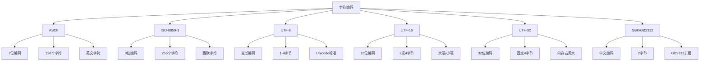

# 字符编码处理

## 🎯 学习目标
- 理解字符编码的基本概念和原理
- 掌握PHP中字符编码的处理方法
- 学会处理多字节字符和Unicode
- 了解字符编码转换和最佳实践

## 📚 核心概念

### 字符编码概述



### 字符编码对比

| 编码 | 字节数 | 字符范围 | 特点 | 使用场景 |
|------|--------|----------|------|----------|
| ASCII | 1 | 0-127 | 7位编码 | 英文文本 |
| ISO-8859-1 | 1 | 0-255 | 8位编码 | 西欧语言 |
| UTF-8 | 1-4 | 0-1,114,111 | 变长编码 | 通用编码 |
| UTF-16 | 2-4 | 0-1,114,111 | 16位编码 | Windows系统 |
| UTF-32 | 4 | 0-1,114,111 | 固定长度 | 内部处理 |
| GBK | 1-2 | 中文扩展 | 中文编码 | 中文系统 |
| GB2312 | 2 | 6,763字符 | 简体中文 | 早期中文 |

## 🔧 基本概念

### 字符编码基础
```php
<?php
// 1. 字符编码检测
$text = 'Hello 世界';
$encoding = mb_detect_encoding($text);
echo "检测到的编码: $encoding\n";

// 2. 字符编码转换
$utf8Text = 'Hello 世界';
$gbkText = mb_convert_encoding($utf8Text, 'GBK', 'UTF-8');
echo "UTF-8转GBK: " . bin2hex($gbkText) . "\n";

// 3. 字符长度计算
$text = 'Hello 世界';
$byteLength = strlen($text);
$charLength = mb_strlen($text, 'UTF-8');
echo "字节长度: $byteLength\n";
echo "字符长度: $charLength\n";

// 4. 字符截取
$text = 'Hello 世界，这是一个测试';
$substring = mb_substr($text, 0, 10, 'UTF-8');
echo "截取前10个字符: $substring\n";

// 5. 字符位置查找
$text = 'Hello 世界，世界很美';
$position = mb_strpos($text, '世界', 0, 'UTF-8');
echo "'世界'的位置: $position\n";

// 6. 字符替换
$text = 'Hello 世界，世界很美';
$replaced = mb_ereg_replace('世界', '地球', $text);
echo "替换后: $replaced\n";
?>
```

### 多字节字符处理
```php
<?php
// 1. 多字节字符串函数
$text = 'Hello 世界，这是一个测试';

// 长度计算
$length = mb_strlen($text, 'UTF-8');
echo "字符长度: $length\n";

// 截取
$substring = mb_substr($text, 6, 4, 'UTF-8');
echo "截取: $substring\n";

// 查找
$pos = mb_strpos($text, '世界', 0, 'UTF-8');
echo "位置: $pos\n";

// 替换
$replaced = mb_ereg_replace('世界', '地球', $text);
echo "替换: $replaced\n";

// 2. 字符分割
$text = '苹果,香蕉,橙子,葡萄';
$fruits = mb_split(',', $text);
echo "水果: " . implode(', ', $fruits) . "\n";

// 3. 字符转换
$text = 'Hello World';
$upper = mb_strtoupper($text, 'UTF-8');
$lower = mb_strtolower($text, 'UTF-8');
echo "大写: $upper\n";
echo "小写: $lower\n";

// 4. 字符宽度
$text = 'Hello 世界';
$width = mb_strwidth($text, 'UTF-8');
echo "显示宽度: $width\n";

// 5. 字符截断
$text = '这是一个很长的文本，需要截断';
$truncated = mb_strimwidth($text, 0, 10, '...', 'UTF-8');
echo "截断: $truncated\n";
?>
```

## 🌐 Unicode处理

### Unicode基础
```php
<?php
// 1. Unicode字符
$unicode = '你好世界';
echo "Unicode文本: $unicode\n";

// 2. Unicode码点
$char = '中';
$codePoint = mb_ord($char, 'UTF-8');
echo "字符 '$char' 的Unicode码点: $codePoint\n";

// 3. 码点转字符
$codePoint = 20013; // 中的Unicode码点
$char = mb_chr($codePoint, 'UTF-8');
echo "码点 $codePoint 对应的字符: $char\n";

// 4. Unicode转义
$text = 'Hello \u4e16\u754c'; // Unicode转义
$decoded = json_decode('"' . $text . '"');
echo "Unicode解码: $decoded\n";

// 5. 字符分类
$text = 'Hello 世界 123 !@#';
$letters = mb_ereg_replace('[^a-zA-Z\u4e00-\u9fff]', '', $text);
$numbers = mb_ereg_replace('[^0-9]', '', $text);
$symbols = mb_ereg_replace('[a-zA-Z0-9\u4e00-\u9fff\s]', '', $text);

echo "字母: $letters\n";
echo "数字: $numbers\n";
echo "符号: $symbols\n";

// 6. 字符规范化
$text = 'café'; // 带重音符号
$normalized = Normalizer::normalize($text, Normalizer::FORM_NFC);
echo "规范化: $normalized\n";
?>
```

### Unicode转换
```php
<?php
// 1. UTF-8到其他编码
$utf8Text = 'Hello 世界';

// 转GBK
$gbkText = mb_convert_encoding($utf8Text, 'GBK', 'UTF-8');
echo "UTF-8转GBK: " . bin2hex($gbkText) . "\n";

// 转UTF-16
$utf16Text = mb_convert_encoding($utf8Text, 'UTF-16', 'UTF-8');
echo "UTF-8转UTF-16: " . bin2hex($utf16Text) . "\n";

// 转ISO-8859-1（会丢失非ASCII字符）
$isoText = mb_convert_encoding($utf8Text, 'ISO-8859-1', 'UTF-8');
echo "UTF-8转ISO-8859-1: $isoText\n";

// 2. 其他编码到UTF-8
$gbkText = mb_convert_encoding($utf8Text, 'GBK', 'UTF-8');
$backToUtf8 = mb_convert_encoding($gbkText, 'UTF-8', 'GBK');
echo "GBK转回UTF-8: $backToUtf8\n";

// 3. 自动检测编码
$text = 'Hello 世界';
$detected = mb_detect_encoding($text, ['UTF-8', 'GBK', 'ISO-8859-1'], true);
echo "检测到的编码: $detected\n";

// 4. 编码验证
$isValidUtf8 = mb_check_encoding($text, 'UTF-8');
echo "UTF-8验证: " . ($isValidUtf8 ? '有效' : '无效') . "\n";

// 5. 编码信息
$info = mb_get_info();
echo "多字节支持: " . ($info['internal_encoding'] ?? '未知') . "\n";
?>
```

## 🔄 编码转换

### 基本转换
```php
<?php
class EncodingConverter {
    // 支持的编码列表
    private static $supportedEncodings = [
        'UTF-8', 'UTF-16', 'UTF-32',
        'GBK', 'GB2312', 'BIG5',
        'ISO-8859-1', 'Windows-1252',
        'ASCII', 'EUC-JP', 'Shift_JIS'
    ];
    
    // 转换编码
    public static function convert($text, $toEncoding, $fromEncoding = 'UTF-8') {
        if (!in_array($toEncoding, self::$supportedEncodings)) {
            throw new InvalidArgumentException("不支持的编码: $toEncoding");
        }
        
        return mb_convert_encoding($text, $toEncoding, $fromEncoding);
    }
    
    // 检测编码
    public static function detect($text) {
        $encodings = ['UTF-8', 'GBK', 'GB2312', 'ISO-8859-1'];
        return mb_detect_encoding($text, $encodings, true);
    }
    
    // 验证编码
    public static function validate($text, $encoding) {
        return mb_check_encoding($text, $encoding);
    }
    
    // 安全转换（处理转换错误）
    public static function safeConvert($text, $toEncoding, $fromEncoding = 'UTF-8') {
        try {
            // 先检测实际编码
            $actualEncoding = self::detect($text);
            if ($actualEncoding) {
                $fromEncoding = $actualEncoding;
            }
            
            // 验证源编码
            if (!self::validate($text, $fromEncoding)) {
                throw new Exception("源文本编码验证失败");
            }
            
            // 转换编码
            $converted = mb_convert_encoding($text, $toEncoding, $fromEncoding);
            
            // 验证目标编码
            if (!self::validate($converted, $toEncoding)) {
                throw new Exception("目标编码验证失败");
            }
            
            return $converted;
        } catch (Exception $e) {
            // 转换失败时返回原文本
            return $text;
        }
    }
    
    // 批量转换
    public static function batchConvert($texts, $toEncoding, $fromEncoding = 'UTF-8') {
        $results = [];
        foreach ($texts as $key => $text) {
            $results[$key] = self::convert($text, $toEncoding, $fromEncoding);
        }
        return $results;
    }
    
    // 获取编码信息
    public static function getInfo($text) {
        $detected = self::detect($text);
        $length = mb_strlen($text, $detected ?: 'UTF-8');
        $byteLength = strlen($text);
        
        return [
            'detected_encoding' => $detected,
            'character_length' => $length,
            'byte_length' => $byteLength,
            'is_multibyte' => $byteLength > $length
        ];
    }
}

// 使用示例
$text = 'Hello 世界，这是一个测试';

// 基本转换
$gbkText = EncodingConverter::convert($text, 'GBK');
echo "转换为GBK: " . bin2hex($gbkText) . "\n";

// 检测编码
$encoding = EncodingConverter::detect($text);
echo "检测到的编码: $encoding\n";

// 安全转换
$safeConverted = EncodingConverter::safeConvert($text, 'GBK');
echo "安全转换: " . bin2hex($safeConverted) . "\n";

// 获取信息
$info = EncodingConverter::getInfo($text);
print_r($info);
?>
```

### 高级转换
```php
<?php
class AdvancedEncodingConverter {
    // 智能编码转换
    public static function smartConvert($text, $targetEncoding = 'UTF-8') {
        // 检测当前编码
        $currentEncoding = mb_detect_encoding($text, [
            'UTF-8', 'GBK', 'GB2312', 'BIG5',
            'ISO-8859-1', 'Windows-1252'
        ], true);
        
        if (!$currentEncoding) {
            // 无法检测时，尝试常见编码
            $currentEncoding = 'UTF-8';
        }
        
        // 如果已经是目标编码，直接返回
        if ($currentEncoding === $targetEncoding) {
            return $text;
        }
        
        // 转换编码
        return mb_convert_encoding($text, $targetEncoding, $currentEncoding);
    }
    
    // 处理BOM
    public static function removeBom($text) {
        // UTF-8 BOM
        if (substr($text, 0, 3) === "\xEF\xBB\xBF") {
            return substr($text, 3);
        }
        
        // UTF-16 LE BOM
        if (substr($text, 0, 2) === "\xFF\xFE") {
            return substr($text, 2);
        }
        
        // UTF-16 BE BOM
        if (substr($text, 0, 2) === "\xFE\xFF") {
            return substr($text, 2);
        }
        
        return $text;
    }
    
    // 添加BOM
    public static function addBom($text, $encoding = 'UTF-8') {
        switch ($encoding) {
            case 'UTF-8':
                return "\xEF\xBB\xBF" . $text;
            case 'UTF-16LE':
                return "\xFF\xFE" . $text;
            case 'UTF-16BE':
                return "\xFE\xFF" . $text;
            default:
                return $text;
        }
    }
    
    // 清理无效字符
    public static function cleanInvalidChars($text, $encoding = 'UTF-8') {
        // 移除无效的UTF-8字符
        if ($encoding === 'UTF-8') {
            return mb_convert_encoding($text, 'UTF-8', 'UTF-8');
        }
        
        // 其他编码的清理
        return mb_convert_encoding($text, $encoding, $encoding);
    }
    
    // 标准化换行符
    public static function normalizeLineEndings($text) {
        // 统一换行符为LF
        $text = str_replace(["\r\n", "\r"], "\n", $text);
        return $text;
    }
    
    // 处理混合编码
    public static function handleMixedEncoding($text) {
        // 尝试识别和转换混合编码的文本
        $parts = [];
        $current = '';
        $currentEncoding = null;
        
        for ($i = 0; $i < strlen($text); $i++) {
            $char = $text[$i];
            $test = $current . $char;
            
            // 检测当前字符的编码
            $encoding = mb_detect_encoding($test, ['UTF-8', 'GBK'], true);
            
            if ($encoding && $encoding === $currentEncoding) {
                $current .= $char;
            } else {
                if ($current) {
                    $parts[] = [
                        'text' => $current,
                        'encoding' => $currentEncoding
                    ];
                }
                $current = $char;
                $currentEncoding = $encoding;
            }
        }
        
        if ($current) {
            $parts[] = [
                'text' => $current,
                'encoding' => $currentEncoding
            ];
        }
        
        // 转换为UTF-8
        $result = '';
        foreach ($parts as $part) {
            if ($part['encoding']) {
                $result .= mb_convert_encoding($part['text'], 'UTF-8', $part['encoding']);
            } else {
                $result .= $part['text'];
            }
        }
        
        return $result;
    }
}

// 使用示例
$mixedText = 'Hello 世界' . "\xEF\xBB\xBF" . 'Test'; // 包含BOM
echo "原始文本: " . bin2hex($mixedText) . "\n";

// 移除BOM
$cleaned = AdvancedEncodingConverter::removeBom($mixedText);
echo "移除BOM后: " . bin2hex($cleaned) . "\n";

// 智能转换
$converted = AdvancedEncodingConverter::smartConvert($cleaned);
echo "智能转换: $converted\n";

// 标准化换行符
$textWithMixedEndings = "Line 1\r\nLine 2\rLine 3\n";
$normalized = AdvancedEncodingConverter::normalizeLineEndings($textWithMixedEndings);
echo "标准化换行符: " . bin2hex($normalized) . "\n";
?>
```

## 🎯 实际应用

### 文件编码处理
```php
<?php
class FileEncodingHandler {
    // 读取文件并转换编码
    public static function readFile($filename, $targetEncoding = 'UTF-8') {
        if (!file_exists($filename)) {
            throw new Exception("文件不存在: $filename");
        }
        
        $content = file_get_contents($filename);
        
        // 移除BOM
        $content = AdvancedEncodingConverter::removeBom($content);
        
        // 检测编码
        $encoding = mb_detect_encoding($content, ['UTF-8', 'GBK', 'GB2312'], true);
        
        // 转换编码
        if ($encoding && $encoding !== $targetEncoding) {
            $content = mb_convert_encoding($content, $targetEncoding, $encoding);
        }
        
        return $content;
    }
    
    // 写入文件并指定编码
    public static function writeFile($filename, $content, $encoding = 'UTF-8') {
        // 转换编码
        $converted = mb_convert_encoding($content, $encoding, 'UTF-8');
        
        // 添加BOM（如果需要）
        if ($encoding === 'UTF-8') {
            $converted = AdvancedEncodingConverter::addBom($converted, 'UTF-8');
        }
        
        return file_put_contents($filename, $converted);
    }
    
    // 批量转换文件编码
    public static function batchConvertFiles($files, $targetEncoding = 'UTF-8') {
        $results = [];
        
        foreach ($files as $file) {
            try {
                $content = self::readFile($file, $targetEncoding);
                $results[$file] = [
                    'success' => true,
                    'content' => $content
                ];
            } catch (Exception $e) {
                $results[$file] = [
                    'success' => false,
                    'error' => $e->getMessage()
                ];
            }
        }
        
        return $results;
    }
    
    // 检测文件编码
    public static function detectFileEncoding($filename) {
        if (!file_exists($filename)) {
            return false;
        }
        
        $content = file_get_contents($filename);
        return mb_detect_encoding($content, ['UTF-8', 'GBK', 'GB2312'], true);
    }
    
    // 转换目录下所有文件
    public static function convertDirectory($directory, $targetEncoding = 'UTF-8', $extensions = ['txt', 'php', 'html']) {
        $files = [];
        $iterator = new RecursiveIteratorIterator(new RecursiveDirectoryIterator($directory));
        
        foreach ($iterator as $file) {
            if ($file->isFile()) {
                $extension = $file->getExtension();
                if (in_array($extension, $extensions)) {
                    $files[] = $file->getPathname();
                }
            }
        }
        
        return self::batchConvertFiles($files, $targetEncoding);
    }
}

// 使用示例
$filename = 'test.txt';

// 写入文件
$content = 'Hello 世界，这是一个测试文件';
FileEncodingHandler::writeFile($filename, $content, 'UTF-8');

// 读取文件
$readContent = FileEncodingHandler::readFile($filename);
echo "读取内容: $readContent\n";

// 检测编码
$encoding = FileEncodingHandler::detectFileEncoding($filename);
echo "文件编码: $encoding\n";

// 批量转换
$files = ['test.txt'];
$results = FileEncodingHandler::batchConvertFiles($files, 'GBK');
print_r($results);
?>
```

### 数据库编码处理
```php
<?php
class DatabaseEncodingHandler {
    private $pdo;
    
    public function __construct($dsn, $username, $password) {
        $this->pdo = new PDO($dsn, $username, $password);
        $this->pdo->setAttribute(PDO::ATTR_ERRMODE, PDO::ERRMODE_EXCEPTION);
    }
    
    // 设置数据库编码
    public function setEncoding($encoding = 'utf8mb4') {
        $sql = "SET NAMES $encoding";
        $this->pdo->exec($sql);
        
        $sql = "SET CHARACTER SET $encoding";
        $this->pdo->exec($sql);
    }
    
    // 插入数据并处理编码
    public function insertWithEncoding($table, $data, $encoding = 'UTF-8') {
        // 转换数据编码
        $convertedData = [];
        foreach ($data as $key => $value) {
            if (is_string($value)) {
                $convertedData[$key] = mb_convert_encoding($value, $encoding, 'UTF-8');
            } else {
                $convertedData[$key] = $value;
            }
        }
        
        // 构建SQL
        $columns = implode(', ', array_keys($convertedData));
        $placeholders = ':' . implode(', :', array_keys($convertedData));
        $sql = "INSERT INTO $table ($columns) VALUES ($placeholders)";
        
        $stmt = $this->pdo->prepare($sql);
        return $stmt->execute($convertedData);
    }
    
    // 查询数据并处理编码
    public function selectWithEncoding($sql, $params = [], $encoding = 'UTF-8') {
        $stmt = $this->pdo->prepare($sql);
        $stmt->execute($params);
        $results = $stmt->fetchAll(PDO::FETCH_ASSOC);
        
        // 转换结果编码
        foreach ($results as &$row) {
            foreach ($row as $key => $value) {
                if (is_string($value)) {
                    $row[$key] = mb_convert_encoding($value, 'UTF-8', $encoding);
                }
            }
        }
        
        return $results;
    }
    
    // 检查数据库编码
    public function checkDatabaseEncoding() {
        $sql = "SELECT @@character_set_database, @@collation_database";
        $stmt = $this->pdo->query($sql);
        return $stmt->fetch(PDO::FETCH_ASSOC);
    }
    
    // 转换表编码
    public function convertTableEncoding($table, $targetEncoding = 'utf8mb4') {
        $sql = "ALTER TABLE $table CONVERT TO CHARACTER SET $targetEncoding";
        return $this->pdo->exec($sql);
    }
}

// 使用示例
try {
    $db = new DatabaseEncodingHandler('mysql:host=localhost;dbname=test', 'username', 'password');
    
    // 设置编码
    $db->setEncoding('utf8mb4');
    
    // 检查编码
    $encoding = $db->checkDatabaseEncoding();
    print_r($encoding);
    
    // 插入数据
    $data = [
        'name' => '张三',
        'email' => 'zhangsan@example.com',
        'description' => '这是一个测试用户'
    ];
    
    $db->insertWithEncoding('users', $data);
    
    // 查询数据
    $results = $db->selectWithEncoding('SELECT * FROM users WHERE name = :name', ['name' => '张三']);
    print_r($results);
    
} catch (Exception $e) {
    echo "错误: " . $e->getMessage() . "\n";
}
?>
```

## 📊 最佳实践

### 编码处理最佳实践
```php
<?php
// 1. 始终指定编码
$text = 'Hello 世界';
$length = mb_strlen($text, 'UTF-8');  // 明确指定UTF-8

// 2. 使用UTF-8作为内部编码
mb_internal_encoding('UTF-8');

// 3. 处理编码错误
function safeMbConvert($text, $to, $from = 'UTF-8') {
    $result = @mb_convert_encoding($text, $to, $from);
    if ($result === false) {
        // 处理转换失败
        return $text;
    }
    return $result;
}

// 4. 验证编码
function isValidEncoding($text, $encoding) {
    return mb_check_encoding($text, $encoding);
}

// 5. 处理BOM
function removeBom($text) {
    if (substr($text, 0, 3) === "\xEF\xBB\xBF") {
        return substr($text, 3);
    }
    return $text;
}

// 6. 标准化文本
function normalizeText($text) {
    // 移除BOM
    $text = removeBom($text);
    
    // 标准化换行符
    $text = str_replace(["\r\n", "\r"], "\n", $text);
    
    // 移除控制字符
    $text = preg_replace('/[\x00-\x08\x0B\x0C\x0E-\x1F\x7F]/', '', $text);
    
    return $text;
}

// 7. 处理混合编码
function handleMixedEncoding($text) {
    // 尝试检测编码
    $encoding = mb_detect_encoding($text, ['UTF-8', 'GBK', 'GB2312'], true);
    
    if (!$encoding) {
        // 无法检测时，尝试修复
        $text = mb_convert_encoding($text, 'UTF-8', 'UTF-8');
    } else if ($encoding !== 'UTF-8') {
        // 转换为UTF-8
        $text = mb_convert_encoding($text, 'UTF-8', $encoding);
    }
    
    return $text;
}
?>
```

### 性能优化建议
```php
<?php
// 1. 缓存编码检测结果
class EncodingCache {
    private static $cache = [];
    
    public static function detect($text) {
        $hash = md5($text);
        if (!isset(self::$cache[$hash])) {
            self::$cache[$hash] = mb_detect_encoding($text, ['UTF-8', 'GBK'], true);
        }
        return self::$cache[$hash];
    }
    
    public static function clear() {
        self::$cache = [];
    }
}

// 2. 批量处理
function batchProcess($texts, $callback) {
    $results = [];
    foreach ($texts as $text) {
        $results[] = $callback($text);
    }
    return $results;
}

// 3. 使用流处理大文件
function processLargeFile($filename, $callback) {
    $handle = fopen($filename, 'r');
    if (!$handle) {
        return false;
    }
    
    while (($line = fgets($handle)) !== false) {
        $callback($line);
    }
    
    fclose($handle);
    return true;
}

// 4. 避免重复转换
function smartConvert($text, $targetEncoding = 'UTF-8') {
    static $currentEncoding = null;
    
    if ($currentEncoding === null) {
        $currentEncoding = mb_detect_encoding($text, ['UTF-8', 'GBK'], true) ?: 'UTF-8';
    }
    
    if ($currentEncoding === $targetEncoding) {
        return $text;
    }
    
    return mb_convert_encoding($text, $targetEncoding, $currentEncoding);
}
?>
```

## 🎓 学习建议

### 费曼学习法应用
1. **选择概念**: 选择字符编码中的核心概念
2. **简化解释**: 用简单语言解释字符编码的原理
3. **识别盲点**: 发现理解不深入的地方
4. **重新学习**: 针对盲点进行深入学习

### 刻意练习重点
1. **编码理解**: 深入理解各种字符编码的特点
2. **实际应用**: 在实际项目中处理编码问题
3. **性能优化**: 了解编码处理的性能特点
4. **调试技巧**: 学会调试编码相关问题

## 🔗 相关链接
- [[01-数组基础|数组基础]]
- [[02-数组操作函数|数组操作函数]]
- [[03-多维数组|多维数组]]
- [[04-字符串基础|字符串基础]]
- [[05-字符串处理函数|字符串处理函数]]
- [[06-正则表达式|正则表达式]]
