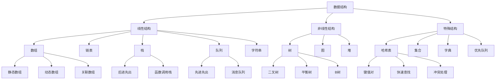

# 数据结构应用

## 🎯 学习目标
- 理解数据结构在PHP中的应用
- 掌握数组和字符串的高级数据结构操作
- 学会实现常见的数据结构算法
- 了解数据结构性能优化和最佳实践

## 📚 核心概念

### 数据结构概述



### 数据结构复杂度对比

| 数据结构 | 查找 | 插入 | 删除 | 空间复杂度 | 特点 |
|----------|------|------|------|------------|------|
| 数组 | O(1) | O(n) | O(n) | O(n) | 随机访问快 |
| 链表 | O(n) | O(1) | O(1) | O(n) | 动态大小 |
| 栈 | O(n) | O(1) | O(1) | O(n) | LIFO |
| 队列 | O(n) | O(1) | O(1) | O(n) | FIFO |
| 哈希表 | O(1) | O(1) | O(1) | O(n) | 快速查找 |
| 二叉树 | O(log n) | O(log n) | O(log n) | O(n) | 有序存储 |
| 堆 | O(1) | O(log n) | O(log n) | O(n) | 优先级队列 |

## 🔧 线性数据结构

### 栈（Stack）
```php
<?php
class Stack {
    private $items = [];
    private $top = -1;
    
    // 入栈
    public function push($item) {
        $this->items[++$this->top] = $item;
    }
    
    // 出栈
    public function pop() {
        if ($this->isEmpty()) {
            throw new Exception('栈为空');
        }
        return $this->items[$this->top--];
    }
    
    // 查看栈顶元素
    public function peek() {
        if ($this->isEmpty()) {
            throw new Exception('栈为空');
        }
        return $this->items[$this->top];
    }
    
    // 检查是否为空
    public function isEmpty() {
        return $this->top === -1;
    }
    
    // 获取大小
    public function size() {
        return $this->top + 1;
    }
    
    // 清空栈
    public function clear() {
        $this->items = [];
        $this->top = -1;
    }
    
    // 转换为数组
    public function toArray() {
        return array_reverse(array_slice($this->items, 0, $this->top + 1));
    }
}

// 使用示例
$stack = new Stack();

// 入栈
$stack->push('A');
$stack->push('B');
$stack->push('C');

echo "栈大小: " . $stack->size() . "\n";
echo "栈顶元素: " . $stack->peek() . "\n";

// 出栈
while (!$stack->isEmpty()) {
    echo "出栈: " . $stack->pop() . "\n";
}

// 实际应用：括号匹配
function isValidParentheses($str) {
    $stack = new Stack();
    $pairs = [
        ')' => '(',
        ']' => '[',
        '}' => '{'
    ];
    
    for ($i = 0; $i < strlen($str); $i++) {
        $char = $str[$i];
        
        if (in_array($char, ['(', '[', '{'])) {
            $stack->push($char);
        } elseif (in_array($char, [')', ']', '}'])) {
            if ($stack->isEmpty() || $stack->pop() !== $pairs[$char]) {
                return false;
            }
        }
    }
    
    return $stack->isEmpty();
}

// 测试括号匹配
$testCases = [
    '()' => true,
    '()[]{}' => true,
    '([{}])' => true,
    '([)]' => false,
    '(((' => false
];

foreach ($testCases as $test => $expected) {
    $result = isValidParentheses($test);
    echo "$test: " . ($result === $expected ? '通过' : '失败') . "\n";
}
?>
```

### 队列（Queue）
```php
<?php
class Queue {
    private $items = [];
    private $front = 0;
    private $rear = -1;
    
    // 入队
    public function enqueue($item) {
        $this->items[++$this->rear] = $item;
    }
    
    // 出队
    public function dequeue() {
        if ($this->isEmpty()) {
            throw new Exception('队列为空');
        }
        $item = $this->items[$this->front];
        unset($this->items[$this->front++]);
        return $item;
    }
    
    // 查看队首元素
    public function front() {
        if ($this->isEmpty()) {
            throw new Exception('队列为空');
        }
        return $this->items[$this->front];
    }
    
    // 查看队尾元素
    public function rear() {
        if ($this->isEmpty()) {
            throw new Exception('队列为空');
        }
        return $this->items[$this->rear];
    }
    
    // 检查是否为空
    public function isEmpty() {
        return $this->front > $this->rear;
    }
    
    // 获取大小
    public function size() {
        return $this->rear - $this->front + 1;
    }
    
    // 清空队列
    public function clear() {
        $this->items = [];
        $this->front = 0;
        $this->rear = -1;
    }
    
    // 转换为数组
    public function toArray() {
        return array_values($this->items);
    }
}

// 使用示例
$queue = new Queue();

// 入队
$queue->enqueue('A');
$queue->enqueue('B');
$queue->enqueue('C');

echo "队列大小: " . $queue->size() . "\n";
echo "队首元素: " . $queue->front() . "\n";
echo "队尾元素: " . $queue->rear() . "\n";

// 出队
while (!$queue->isEmpty()) {
    echo "出队: " . $queue->dequeue() . "\n";
}

// 实际应用：任务调度
class TaskScheduler {
    private $queue;
    
    public function __construct() {
        $this->queue = new Queue();
    }
    
    public function addTask($task) {
        $this->queue->enqueue($task);
    }
    
    public function processNext() {
        if (!$this->queue->isEmpty()) {
            $task = $this->queue->dequeue();
            echo "处理任务: $task\n";
            return $task;
        }
        return null;
    }
    
    public function getPendingTasks() {
        return $this->queue->size();
    }
}

// 使用任务调度器
$scheduler = new TaskScheduler();
$scheduler->addTask('发送邮件');
$scheduler->addTask('备份数据');
$scheduler->addTask('清理缓存');

echo "待处理任务数: " . $scheduler->getPendingTasks() . "\n";

while ($scheduler->getPendingTasks() > 0) {
    $scheduler->processNext();
}
?>
```

### 链表（LinkedList）
```php
<?php
class ListNode {
    public $data;
    public $next;
    
    public function __construct($data) {
        $this->data = $data;
        $this->next = null;
    }
}

class LinkedList {
    private $head;
    private $size;
    
    public function __construct() {
        $this->head = null;
        $this->size = 0;
    }
    
    // 在头部插入
    public function insertAtHead($data) {
        $newNode = new ListNode($data);
        $newNode->next = $this->head;
        $this->head = $newNode;
        $this->size++;
    }
    
    // 在尾部插入
    public function insertAtTail($data) {
        $newNode = new ListNode($data);
        
        if ($this->head === null) {
            $this->head = $newNode;
        } else {
            $current = $this->head;
            while ($current->next !== null) {
                $current = $current->next;
            }
            $current->next = $newNode;
        }
        
        $this->size++;
    }
    
    // 在指定位置插入
    public function insertAt($index, $data) {
        if ($index < 0 || $index > $this->size) {
            throw new Exception('索引超出范围');
        }
        
        if ($index === 0) {
            $this->insertAtHead($data);
            return;
        }
        
        $newNode = new ListNode($data);
        $current = $this->head;
        
        for ($i = 0; $i < $index - 1; $i++) {
            $current = $current->next;
        }
        
        $newNode->next = $current->next;
        $current->next = $newNode;
        $this->size++;
    }
    
    // 删除指定位置的元素
    public function deleteAt($index) {
        if ($index < 0 || $index >= $this->size) {
            throw new Exception('索引超出范围');
        }
        
        if ($index === 0) {
            $this->head = $this->head->next;
        } else {
            $current = $this->head;
            for ($i = 0; $i < $index - 1; $i++) {
                $current = $current->next;
            }
            $current->next = $current->next->next;
        }
        
        $this->size--;
    }
    
    // 查找元素
    public function find($data) {
        $current = $this->head;
        $index = 0;
        
        while ($current !== null) {
            if ($current->data === $data) {
                return $index;
            }
            $current = $current->next;
            $index++;
        }
        
        return -1;
    }
    
    // 获取指定位置的元素
    public function get($index) {
        if ($index < 0 || $index >= $this->size) {
            throw new Exception('索引超出范围');
        }
        
        $current = $this->head;
        for ($i = 0; $i < $index; $i++) {
            $current = $current->next;
        }
        
        return $current->data;
    }
    
    // 获取大小
    public function size() {
        return $this->size;
    }
    
    // 检查是否为空
    public function isEmpty() {
        return $this->head === null;
    }
    
    // 转换为数组
    public function toArray() {
        $result = [];
        $current = $this->head;
        
        while ($current !== null) {
            $result[] = $current->data;
            $current = $current->next;
        }
        
        return $result;
    }
    
    // 反转链表
    public function reverse() {
        $prev = null;
        $current = $this->head;
        
        while ($current !== null) {
            $next = $current->next;
            $current->next = $prev;
            $prev = $current;
            $current = $next;
        }
        
        $this->head = $prev;
    }
    
    // 显示链表
    public function display() {
        $current = $this->head;
        $result = [];
        
        while ($current !== null) {
            $result[] = $current->data;
            $current = $current->next;
        }
        
        return implode(' -> ', $result);
    }
}

// 使用示例
$list = new LinkedList();

// 插入元素
$list->insertAtHead('A');
$list->insertAtTail('B');
$list->insertAtTail('C');
$list->insertAt(1, 'X');

echo "链表: " . $list->display() . "\n";
echo "大小: " . $list->size() . "\n";

// 查找元素
$index = $list->find('B');
echo "B的位置: $index\n";

// 获取元素
$element = $list->get(2);
echo "位置2的元素: $element\n";

// 删除元素
$list->deleteAt(1);
echo "删除后: " . $list->display() . "\n";

// 反转链表
$list->reverse();
echo "反转后: " . $list->display() . "\n";
?>
```

## 🌳 非线性数据结构

### 二叉树（Binary Tree）
```php
<?php
class TreeNode {
    public $data;
    public $left;
    public $right;
    
    public function __construct($data) {
        $this->data = $data;
        $this->left = null;
        $this->right = null;
    }
}

class BinaryTree {
    private $root;
    
    public function __construct() {
        $this->root = null;
    }
    
    // 插入节点
    public function insert($data) {
        $this->root = $this->insertRecursive($this->root, $data);
    }
    
    private function insertRecursive($node, $data) {
        if ($node === null) {
            return new TreeNode($data);
        }
        
        if ($data < $node->data) {
            $node->left = $this->insertRecursive($node->left, $data);
        } elseif ($data > $node->data) {
            $node->right = $this->insertRecursive($node->right, $data);
        }
        
        return $node;
    }
    
    // 查找节点
    public function search($data) {
        return $this->searchRecursive($this->root, $data);
    }
    
    private function searchRecursive($node, $data) {
        if ($node === null || $node->data === $data) {
            return $node;
        }
        
        if ($data < $node->data) {
            return $this->searchRecursive($node->left, $data);
        }
        
        return $this->searchRecursive($node->right, $data);
    }
    
    // 前序遍历
    public function preorder() {
        $result = [];
        $this->preorderRecursive($this->root, $result);
        return $result;
    }
    
    private function preorderRecursive($node, &$result) {
        if ($node !== null) {
            $result[] = $node->data;
            $this->preorderRecursive($node->left, $result);
            $this->preorderRecursive($node->right, $result);
        }
    }
    
    // 中序遍历
    public function inorder() {
        $result = [];
        $this->inorderRecursive($this->root, $result);
        return $result;
    }
    
    private function inorderRecursive($node, &$result) {
        if ($node !== null) {
            $this->inorderRecursive($node->left, $result);
            $result[] = $node->data;
            $this->inorderRecursive($node->right, $result);
        }
    }
    
    // 后序遍历
    public function postorder() {
        $result = [];
        $this->postorderRecursive($this->root, $result);
        return $result;
    }
    
    private function postorderRecursive($node, &$result) {
        if ($node !== null) {
            $this->postorderRecursive($node->left, $result);
            $this->postorderRecursive($node->right, $result);
            $result[] = $node->data;
        }
    }
    
    // 层序遍历
    public function levelOrder() {
        if ($this->root === null) {
            return [];
        }
        
        $result = [];
        $queue = [$this->root];
        
        while (!empty($queue)) {
            $node = array_shift($queue);
            $result[] = $node->data;
            
            if ($node->left !== null) {
                $queue[] = $node->left;
            }
            if ($node->right !== null) {
                $queue[] = $node->right;
            }
        }
        
        return $result;
    }
    
    // 获取高度
    public function height() {
        return $this->heightRecursive($this->root);
    }
    
    private function heightRecursive($node) {
        if ($node === null) {
            return 0;
        }
        
        $leftHeight = $this->heightRecursive($node->left);
        $rightHeight = $this->heightRecursive($node->right);
        
        return max($leftHeight, $rightHeight) + 1;
    }
    
    // 检查是否为空
    public function isEmpty() {
        return $this->root === null;
    }
    
    // 获取节点数
    public function size() {
        return $this->sizeRecursive($this->root);
    }
    
    private function sizeRecursive($node) {
        if ($node === null) {
            return 0;
        }
        
        return 1 + $this->sizeRecursive($node->left) + $this->sizeRecursive($node->right);
    }
}

// 使用示例
$tree = new BinaryTree();

// 插入节点
$values = [5, 3, 7, 2, 4, 6, 8];
foreach ($values as $value) {
    $tree->insert($value);
}

echo "前序遍历: " . implode(', ', $tree->preorder()) . "\n";
echo "中序遍历: " . implode(', ', $tree->inorder()) . "\n";
echo "后序遍历: " . implode(', ', $tree->postorder()) . "\n";
echo "层序遍历: " . implode(', ', $tree->levelOrder()) . "\n";

echo "树高度: " . $tree->height() . "\n";
echo "节点数: " . $tree->size() . "\n";

// 查找节点
$found = $tree->search(4);
echo "查找4: " . ($found ? '找到' : '未找到') . "\n";
?>
```

### 堆（Heap）
```php
<?php
class MinHeap {
    private $heap = [];
    
    // 插入元素
    public function insert($value) {
        $this->heap[] = $value;
        $this->heapifyUp(count($this->heap) - 1);
    }
    
    // 删除最小元素
    public function extractMin() {
        if (empty($this->heap)) {
            throw new Exception('堆为空');
        }
        
        $min = $this->heap[0];
        $last = array_pop($this->heap);
        
        if (!empty($this->heap)) {
            $this->heap[0] = $last;
            $this->heapifyDown(0);
        }
        
        return $min;
    }
    
    // 获取最小元素
    public function peek() {
        if (empty($this->heap)) {
            throw new Exception('堆为空');
        }
        return $this->heap[0];
    }
    
    // 向上调整
    private function heapifyUp($index) {
        while ($index > 0) {
            $parentIndex = intval(($index - 1) / 2);
            
            if ($this->heap[$index] >= $this->heap[$parentIndex]) {
                break;
            }
            
            $this->swap($index, $parentIndex);
            $index = $parentIndex;
        }
    }
    
    // 向下调整
    private function heapifyDown($index) {
        $size = count($this->heap);
        
        while (true) {
            $smallest = $index;
            $leftChild = 2 * $index + 1;
            $rightChild = 2 * $index + 2;
            
            if ($leftChild < $size && $this->heap[$leftChild] < $this->heap[$smallest]) {
                $smallest = $leftChild;
            }
            
            if ($rightChild < $size && $this->heap[$rightChild] < $this->heap[$smallest]) {
                $smallest = $rightChild;
            }
            
            if ($smallest === $index) {
                break;
            }
            
            $this->swap($index, $smallest);
            $index = $smallest;
        }
    }
    
    // 交换元素
    private function swap($i, $j) {
        $temp = $this->heap[$i];
        $this->heap[$i] = $this->heap[$j];
        $this->heap[$j] = $temp;
    }
    
    // 获取大小
    public function size() {
        return count($this->heap);
    }
    
    // 检查是否为空
    public function isEmpty() {
        return empty($this->heap);
    }
    
    // 转换为数组
    public function toArray() {
        return $this->heap;
    }
}

// 使用示例
$heap = new MinHeap();

// 插入元素
$values = [10, 5, 15, 3, 8, 12, 20];
foreach ($values as $value) {
    $heap->insert($value);
}

echo "堆: " . implode(', ', $heap->toArray()) . "\n";
echo "最小元素: " . $heap->peek() . "\n";

// 提取最小元素
while (!$heap->isEmpty()) {
    echo "提取: " . $heap->extractMin() . "\n";
}

// 实际应用：优先队列
class PriorityQueue {
    private $heap;
    
    public function __construct() {
        $this->heap = new MinHeap();
    }
    
    public function enqueue($item, $priority) {
        $this->heap->insert([$priority, $item]);
    }
    
    public function dequeue() {
        if ($this->heap->isEmpty()) {
            throw new Exception('队列为空');
        }
        
        $item = $this->heap->extractMin();
        return $item[1]; // 返回实际项目
    }
    
    public function isEmpty() {
        return $this->heap->isEmpty();
    }
    
    public function size() {
        return $this->heap->size();
    }
}

// 使用优先队列
$pq = new PriorityQueue();
$pq->enqueue('任务A', 3);
$pq->enqueue('任务B', 1);
$pq->enqueue('任务C', 2);

echo "按优先级处理任务:\n";
while (!$pq->isEmpty()) {
    echo "处理: " . $pq->dequeue() . "\n";
}
?>
```

## 🔍 哈希表（Hash Table）
```php
<?php
class HashTable {
    private $buckets = [];
    private $size = 0;
    private $capacity = 16;
    
    public function __construct($capacity = 16) {
        $this->capacity = $capacity;
        $this->buckets = array_fill(0, $capacity, []);
    }
    
    // 哈希函数
    private function hash($key) {
        return crc32($key) % $this->capacity;
    }
    
    // 插入键值对
    public function put($key, $value) {
        $index = $this->hash($key);
        $bucket = &$this->buckets[$index];
        
        // 检查是否已存在
        for ($i = 0; $i < count($bucket); $i++) {
            if ($bucket[$i][0] === $key) {
                $bucket[$i][1] = $value;
                return;
            }
        }
        
        // 添加新键值对
        $bucket[] = [$key, $value];
        $this->size++;
    }
    
    // 获取值
    public function get($key) {
        $index = $this->hash($key);
        $bucket = $this->buckets[$index];
        
        foreach ($bucket as $item) {
            if ($item[0] === $key) {
                return $item[1];
            }
        }
        
        return null;
    }
    
    // 删除键值对
    public function remove($key) {
        $index = $this->hash($key);
        $bucket = &$this->buckets[$index];
        
        for ($i = 0; $i < count($bucket); $i++) {
            if ($bucket[$i][0] === $key) {
                array_splice($bucket, $i, 1);
                $this->size--;
                return true;
            }
        }
        
        return false;
    }
    
    // 检查是否包含键
    public function contains($key) {
        return $this->get($key) !== null;
    }
    
    // 获取所有键
    public function keys() {
        $keys = [];
        foreach ($this->buckets as $bucket) {
            foreach ($bucket as $item) {
                $keys[] = $item[0];
            }
        }
        return $keys;
    }
    
    // 获取所有值
    public function values() {
        $values = [];
        foreach ($this->buckets as $bucket) {
            foreach ($bucket as $item) {
                $values[] = $item[1];
            }
        }
        return $values;
    }
    
    // 获取大小
    public function size() {
        return $this->size;
    }
    
    // 检查是否为空
    public function isEmpty() {
        return $this->size === 0;
    }
    
    // 清空哈希表
    public function clear() {
        $this->buckets = array_fill(0, $this->capacity, []);
        $this->size = 0;
    }
    
    // 获取负载因子
    public function loadFactor() {
        return $this->size / $this->capacity;
    }
    
    // 重新哈希
    private function rehash() {
        $oldBuckets = $this->buckets;
        $this->capacity *= 2;
        $this->buckets = array_fill(0, $this->capacity, []);
        $this->size = 0;
        
        foreach ($oldBuckets as $bucket) {
            foreach ($bucket as $item) {
                $this->put($item[0], $item[1]);
            }
        }
    }
}

// 使用示例
$hashTable = new HashTable();

// 插入键值对
$hashTable->put('name', '张三');
$hashTable->put('age', 25);
$hashTable->put('city', '北京');

echo "姓名: " . $hashTable->get('name') . "\n";
echo "年龄: " . $hashTable->get('age') . "\n";
echo "城市: " . $hashTable->get('city') . "\n";

echo "包含'name': " . ($hashTable->contains('name') ? '是' : '否') . "\n";
echo "哈希表大小: " . $hashTable->size() . "\n";
echo "负载因子: " . $hashTable->loadFactor() . "\n";

// 删除键值对
$hashTable->remove('age');
echo "删除后大小: " . $hashTable->size() . "\n";

// 获取所有键和值
echo "所有键: " . implode(', ', $hashTable->keys()) . "\n";
echo "所有值: " . implode(', ', $hashTable->values()) . "\n";
?>
```

## 🎯 实际应用

### 缓存系统
```php
<?php
class LRUCache {
    private $capacity;
    private $cache = [];
    private $order = [];
    
    public function __construct($capacity) {
        $this->capacity = $capacity;
    }
    
    public function get($key) {
        if (isset($this->cache[$key])) {
            // 移动到末尾
            $this->moveToEnd($key);
            return $this->cache[$key];
        }
        return null;
    }
    
    public function put($key, $value) {
        if (isset($this->cache[$key])) {
            // 更新值
            $this->cache[$key] = $value;
            $this->moveToEnd($key);
        } else {
            // 添加新键值对
            if (count($this->cache) >= $this->capacity) {
                // 删除最久未使用的
                $oldest = array_shift($this->order);
                unset($this->cache[$oldest]);
            }
            
            $this->cache[$key] = $value;
            $this->order[] = $key;
        }
    }
    
    private function moveToEnd($key) {
        $index = array_search($key, $this->order);
        if ($index !== false) {
            unset($this->order[$index]);
            $this->order[] = $key;
        }
    }
    
    public function size() {
        return count($this->cache);
    }
    
    public function clear() {
        $this->cache = [];
        $this->order = [];
    }
}

// 使用示例
$cache = new LRUCache(3);

$cache->put('a', 1);
$cache->put('b', 2);
$cache->put('c', 3);

echo "获取'a': " . $cache->get('a') . "\n"; // 1

$cache->put('d', 4); // 会删除'b'

echo "获取'b': " . ($cache->get('b') ?? 'null') . "\n"; // null
echo "获取'c': " . $cache->get('c') . "\n"; // 3
echo "获取'd': " . $cache->get('d') . "\n"; // 4
?>
```

### 字符串匹配算法
```php
<?php
class StringMatcher {
    // KMP算法
    public static function kmp($text, $pattern) {
        $n = strlen($text);
        $m = strlen($pattern);
        
        if ($m === 0) return 0;
        
        $lps = self::computeLPS($pattern);
        $i = 0; // text索引
        $j = 0; // pattern索引
        
        while ($i < $n) {
            if ($text[$i] === $pattern[$j]) {
                $i++;
                $j++;
            }
            
            if ($j === $m) {
                return $i - $j; // 找到匹配
            } elseif ($i < $n && $text[$i] !== $pattern[$j]) {
                if ($j !== 0) {
                    $j = $lps[$j - 1];
                } else {
                    $i++;
                }
            }
        }
        
        return -1; // 未找到
    }
    
    // 计算LPS数组
    private static function computeLPS($pattern) {
        $m = strlen($pattern);
        $lps = array_fill(0, $m, 0);
        $len = 0;
        $i = 1;
        
        while ($i < $m) {
            if ($pattern[$i] === $pattern[$len]) {
                $len++;
                $lps[$i] = $len;
                $i++;
            } else {
                if ($len !== 0) {
                    $len = $lps[$len - 1];
                } else {
                    $lps[$i] = 0;
                    $i++;
                }
            }
        }
        
        return $lps;
    }
    
    // 朴素字符串匹配
    public static function naive($text, $pattern) {
        $n = strlen($text);
        $m = strlen($pattern);
        
        for ($i = 0; $i <= $n - $m; $i++) {
            $j = 0;
            while ($j < $m && $text[$i + $j] === $pattern[$j]) {
                $j++;
            }
            if ($j === $m) {
                return $i;
            }
        }
        
        return -1;
    }
    
    // 查找所有匹配
    public static function findAll($text, $pattern) {
        $positions = [];
        $n = strlen($text);
        $m = strlen($pattern);
        
        for ($i = 0; $i <= $n - $m; $i++) {
            $j = 0;
            while ($j < $m && $text[$i + $j] === $pattern[$j]) {
                $j++;
            }
            if ($j === $m) {
                $positions[] = $i;
            }
        }
        
        return $positions;
    }
}

// 使用示例
$text = 'ABABDABACDABABCABAB';
$pattern = 'ABABCABAB';

$position = StringMatcher::kmp($text, $pattern);
echo "KMP匹配位置: $position\n";

$position = StringMatcher::naive($text, $pattern);
echo "朴素匹配位置: $position\n";

$positions = StringMatcher::findAll($text, 'AB');
echo "所有'AB'的位置: " . implode(', ', $positions) . "\n";
?>
```

## 📊 性能分析

### 时间复杂度对比
```php
<?php
// 性能测试函数
function benchmark($name, $callback, $iterations = 1000) {
    $start = microtime(true);
    
    for ($i = 0; $i < $iterations; $i++) {
        $callback();
    }
    
    $end = microtime(true);
    $time = ($end - $start) * 1000; // 转换为毫秒
    
    echo "$name: {$time}ms\n";
}

// 测试数组操作
$array = range(1, 1000);

benchmark('数组查找', function() use ($array) {
    in_array(500, $array);
});

benchmark('数组插入', function() use (&$array) {
    array_unshift($array, 0);
    array_shift($array);
});

// 测试哈希表操作
$hashTable = new HashTable(1000);
for ($i = 1; $i <= 1000; $i++) {
    $hashTable->put("key$i", $i);
}

benchmark('哈希表查找', function() use ($hashTable) {
    $hashTable->get('key500');
});

benchmark('哈希表插入', function() use ($hashTable) {
    $hashTable->put('newkey', 1001);
    $hashTable->remove('newkey');
});

// 测试栈操作
$stack = new Stack();
for ($i = 1; $i <= 1000; $i++) {
    $stack->push($i);
}

benchmark('栈操作', function() use ($stack) {
    $stack->push(1001);
    $stack->pop();
});

// 测试队列操作
$queue = new Queue();
for ($i = 1; $i <= 1000; $i++) {
    $queue->enqueue($i);
}

benchmark('队列操作', function() use ($queue) {
    $queue->enqueue(1001);
    $queue->dequeue();
});
?>
```

## 🎓 学习建议

### 费曼学习法应用
1. **选择概念**: 选择数据结构中的核心概念
2. **简化解释**: 用简单语言解释数据结构的原理
3. **识别盲点**: 发现理解不深入的地方
4. **重新学习**: 针对盲点进行深入学习

### 刻意练习重点
1. **算法理解**: 深入理解各种数据结构的算法
2. **实际应用**: 在实际项目中应用数据结构
3. **性能优化**: 了解数据结构的性能特点
4. **调试技巧**: 学会调试数据结构相关问题

## 🔗 相关链接
- [[01-数组基础|数组基础]]
- [[02-数组操作函数|数组操作函数]]
- [[03-多维数组|多维数组]]
- [[04-字符串基础|字符串基础]]
- [[05-字符串处理函数|字符串处理函数]]
- [[06-正则表达式|正则表达式]]
- [[07-字符编码处理|字符编码处理]]
