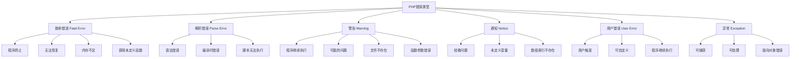

# 错误类型与级别

## 🎯 学习目标
- 理解PHP中错误类型和级别的分类
- 掌握不同错误级别的特点和影响
- 学会配置错误报告级别
- 了解错误处理的最佳实践

## 📚 核心概念

### 错误类型概述



### 错误级别对比

| 错误级别 | 常量 | 值 | 特点 | 程序行为 | 示例 |
|----------|------|-----|------|----------|------|
| E_ERROR | E_ERROR | 1 | 致命错误 | 终止执行 | 调用未定义函数 |
| E_WARNING | E_WARNING | 2 | 警告 | 继续执行 | 文件不存在 |
| E_PARSE | E_PARSE | 4 | 解析错误 | 终止执行 | 语法错误 |
| E_NOTICE | E_NOTICE | 8 | 通知 | 继续执行 | 未定义变量 |
| E_CORE_ERROR | E_CORE_ERROR | 16 | 核心致命错误 | 终止执行 | PHP引擎错误 |
| E_CORE_WARNING | E_CORE_WARNING | 32 | 核心警告 | 继续执行 | PHP引擎警告 |
| E_COMPILE_ERROR | E_COMPILE_ERROR | 64 | 编译错误 | 终止执行 | Zend引擎错误 |
| E_COMPILE_WARNING | E_COMPILE_WARNING | 128 | 编译警告 | 继续执行 | Zend引擎警告 |
| E_USER_ERROR | E_USER_ERROR | 256 | 用户错误 | 终止执行 | trigger_error() |
| E_USER_WARNING | E_USER_WARNING | 512 | 用户警告 | 继续执行 | trigger_error() |
| E_USER_NOTICE | E_USER_NOTICE | 1024 | 用户通知 | 继续执行 | trigger_error() |
| E_STRICT | E_STRICT | 2048 | 严格模式 | 继续执行 | 代码规范建议 |
| E_RECOVERABLE_ERROR | E_RECOVERABLE_ERROR | 4096 | 可恢复错误 | 继续执行 | 类型错误 |
| E_DEPRECATED | E_DEPRECATED | 8192 | 废弃警告 | 继续执行 | 废弃函数 |
| E_USER_DEPRECATED | E_USER_DEPRECATED | 16384 | 用户废弃警告 | 继续执行 | 用户触发 |
| E_ALL | E_ALL | 32767 | 所有错误 | - | 所有错误级别 |

## 🔧 错误级别详解

### 致命错误 (Fatal Error)
```php
<?php
// 1. 调用未定义的函数
function testUndefinedFunction() {
    // 这会导致致命错误
    undefinedFunction();
}

// 2. 调用未定义的方法
class TestClass {
    public function testUndefinedMethod() {
        // 这会导致致命错误
        $this->undefinedMethod();
    }
}

// 3. 访问未定义的类
function testUndefinedClass() {
    // 这会导致致命错误
    $obj = new UndefinedClass();
}

// 4. 内存不足
function testMemoryLimit() {
    // 创建大量数据可能导致内存不足
    $largeArray = [];
    for ($i = 0; $i < 10000000; $i++) {
        $largeArray[] = str_repeat('x', 1000);
    }
}

// 5. 致命错误示例
echo "=== 致命错误示例 ===\n";

// 注释掉实际会报错的代码，只展示概念
/*
try {
    testUndefinedFunction();
} catch (Error $e) {
    echo "捕获到致命错误: " . $e->getMessage() . "\n";
}
*/

// 使用错误处理函数
set_error_handler(function($severity, $message, $file, $line) {
    if ($severity & E_ERROR) {
        echo "致命错误: $message 在 $file 第 $line 行\n";
        // 可以记录日志或发送通知
        return true; // 阻止默认错误处理
    }
    return false; // 继续默认错误处理
});

// 测试致命错误处理
echo "致命错误处理已设置\n";
?>
```

### 解析错误 (Parse Error)
```php
<?php
// 解析错误示例（注释掉实际会报错的代码）

// 1. 语法错误 - 缺少分号
/*
function syntaxError1() {
    echo "Hello World"  // 缺少分号
}
*/

// 2. 语法错误 - 括号不匹配
/*
function syntaxError2() {
    if (true {
        echo "Hello";
    }
}
*/

// 3. 语法错误 - 引号不匹配
/*
function syntaxError3() {
    echo "Hello World';  // 引号不匹配
}
*/

// 4. 语法错误 - 关键字错误
/*
function syntaxError4() {
    if (true) {
        ech "Hello";  // 应该是 echo
    }
}
*/

// 5. 语法错误 - 变量名错误
/*
function syntaxError5() {
    $123variable = "test";  // 变量名不能以数字开头
}
*/

echo "=== 解析错误示例 ===\n";
echo "解析错误通常在开发阶段就能发现\n";
echo "使用IDE或语法检查工具可以避免大部分解析错误\n";

// 检查语法的方法
function checkSyntax($filename) {
    $output = [];
    $return_var = 0;
    
    // 使用 php -l 检查语法
    exec("php -l $filename 2>&1", $output, $return_var);
    
    if ($return_var === 0) {
        echo "语法检查通过: $filename\n";
        return true;
    } else {
        echo "语法错误: $filename\n";
        foreach ($output as $line) {
            echo "  $line\n";
        }
        return false;
    }
}

// 创建临时文件测试语法检查
$tempFile = tempnam(sys_get_temp_dir(), 'php_test_');
file_put_contents($tempFile, '<?php echo "Hello World"; ?>');

if (checkSyntax($tempFile)) {
    echo "临时文件语法正确\n";
}

unlink($tempFile);
?>
```

### 警告 (Warning)
```php
<?php
// 警告示例

// 1. 文件不存在
function testFileWarning() {
    // 这会产生警告，但程序继续执行
    $content = file_get_contents('nonexistent_file.txt');
    if ($content === false) {
        echo "文件读取失败，但程序继续执行\n";
    }
}

// 2. 函数参数错误
function testFunctionWarning() {
    // 这会产生警告，但程序继续执行
    $result = array_merge('string', [1, 2, 3]);
    echo "函数执行完成，结果: " . json_encode($result) . "\n";
}

// 3. 数据库连接警告
function testDatabaseWarning() {
    // 模拟数据库连接警告
    $connection = @mysqli_connect('localhost', 'wrong_user', 'wrong_pass', 'wrong_db');
    if (!$connection) {
        echo "数据库连接失败，但程序继续执行\n";
    }
}

// 4. 网络请求警告
function testNetworkWarning() {
    // 模拟网络请求警告
    $context = stream_context_create([
        'http' => [
            'timeout' => 1
        ]
    ]);
    
    $result = @file_get_contents('http://nonexistent-domain.com', false, $context);
    if ($result === false) {
        echo "网络请求失败，但程序继续执行\n";
    }
}

// 5. 警告处理示例
echo "=== 警告示例 ===\n";

// 设置警告处理
set_error_handler(function($severity, $message, $file, $line) {
    if ($severity & E_WARNING) {
        echo "警告: $message 在 $file 第 $line 行\n";
        // 可以记录日志
        return true; // 阻止默认错误处理
    }
    return false; // 继续默认错误处理
});

// 测试警告
testFileWarning();
testFunctionWarning();
testDatabaseWarning();
testNetworkWarning();

echo "所有警告测试完成\n";
?>
```

### 通知 (Notice)
```php
<?php
// 通知示例

// 1. 未定义变量
function testUndefinedVariable() {
    // 这会产生通知，但程序继续执行
    echo "未定义变量: " . $undefinedVariable . "\n";
}

// 2. 未定义数组索引
function testUndefinedIndex() {
    $array = ['a' => 1, 'b' => 2];
    // 这会产生通知，但程序继续执行
    echo "未定义索引: " . $array['c'] . "\n";
}

// 3. 未定义常量
function testUndefinedConstant() {
    // 这会产生通知，但程序继续执行
    echo "未定义常量: " . UNDEFINED_CONSTANT . "\n";
}

// 4. 未定义属性
function testUndefinedProperty() {
    $obj = new stdClass();
    // 这会产生通知，但程序继续执行
    echo "未定义属性: " . $obj->undefinedProperty . "\n";
}

// 5. 通知处理示例
echo "=== 通知示例 ===\n";

// 设置通知处理
set_error_handler(function($severity, $message, $file, $line) {
    if ($severity & E_NOTICE) {
        echo "通知: $message 在 $file 第 $line 行\n";
        // 可以记录日志
        return true; // 阻止默认错误处理
    }
    return false; // 继续默认错误处理
});

// 测试通知
testUndefinedVariable();
testUndefinedIndex();
testUndefinedConstant();
testUndefinedProperty();

echo "所有通知测试完成\n";
?>
```

### 用户错误 (User Error)
```php
<?php
// 用户错误示例

// 1. 用户错误
function testUserError() {
    $value = -5;
    if ($value < 0) {
        trigger_error("值不能为负数: $value", E_USER_ERROR);
    }
}

// 2. 用户警告
function testUserWarning() {
    $value = 100;
    if ($value > 50) {
        trigger_error("值过大，可能影响性能: $value", E_USER_WARNING);
    }
}

// 3. 用户通知
function testUserNotice() {
    $value = 10;
    if ($value < 20) {
        trigger_error("建议使用更大的值: $value", E_USER_NOTICE);
    }
}

// 4. 用户废弃警告
function testUserDeprecated() {
    trigger_error("此函数已废弃，请使用新函数", E_USER_DEPRECATED);
}

// 5. 用户错误处理示例
echo "=== 用户错误示例 ===\n";

// 设置用户错误处理
set_error_handler(function($severity, $message, $file, $line) {
    switch ($severity) {
        case E_USER_ERROR:
            echo "用户错误: $message 在 $file 第 $line 行\n";
            // 可以记录日志并终止程序
            break;
        case E_USER_WARNING:
            echo "用户警告: $message 在 $file 第 $line 行\n";
            break;
        case E_USER_NOTICE:
            echo "用户通知: $message 在 $file 第 $line 行\n";
            break;
        case E_USER_DEPRECATED:
            echo "用户废弃警告: $message 在 $file 第 $line 行\n";
            break;
    }
    return true; // 阻止默认错误处理
});

// 测试用户错误
try {
    testUserWarning();
    testUserNotice();
    testUserDeprecated();
    
    // 注释掉会终止程序的用户错误
    // testUserError();
    
} catch (Exception $e) {
    echo "捕获异常: " . $e->getMessage() . "\n";
}

echo "用户错误测试完成\n";
?>
```

## 🔧 错误配置

### 错误报告级别配置
```php
<?php
// 错误报告级别配置

// 1. 显示所有错误
error_reporting(E_ALL);
ini_set('display_errors', 1);

// 2. 只显示错误和警告
error_reporting(E_ERROR | E_WARNING);

// 3. 只显示错误
error_reporting(E_ERROR);

// 4. 不显示任何错误
error_reporting(0);
ini_set('display_errors', 0);

// 5. 开发环境配置
function setDevelopmentErrorReporting() {
    error_reporting(E_ALL);
    ini_set('display_errors', 1);
    ini_set('display_startup_errors', 1);
    ini_set('log_errors', 1);
    ini_set('error_log', 'php_errors.log');
}

// 6. 生产环境配置
function setProductionErrorReporting() {
    error_reporting(E_ERROR | E_WARNING | E_PARSE);
    ini_set('display_errors', 0);
    ini_set('display_startup_errors', 0);
    ini_set('log_errors', 1);
    ini_set('error_log', 'php_errors.log');
}

// 7. 测试环境配置
function setTestErrorReporting() {
    error_reporting(E_ALL & ~E_NOTICE & ~E_DEPRECATED);
    ini_set('display_errors', 1);
    ini_set('log_errors', 1);
}

// 8. 动态配置错误级别
function configureErrorReporting($environment) {
    switch ($environment) {
        case 'development':
            setDevelopmentErrorReporting();
            break;
        case 'production':
            setProductionErrorReporting();
            break;
        case 'test':
            setTestErrorReporting();
            break;
        default:
            error_reporting(E_ALL);
            ini_set('display_errors', 1);
    }
}

// 9. 获取当前错误配置
function getCurrentErrorConfig() {
    return [
        'error_reporting' => error_reporting(),
        'display_errors' => ini_get('display_errors'),
        'display_startup_errors' => ini_get('display_startup_errors'),
        'log_errors' => ini_get('log_errors'),
        'error_log' => ini_get('error_log')
    ];
}

// 10. 错误配置示例
echo "=== 错误配置示例 ===\n";

// 设置开发环境
configureErrorReporting('development');
$config = getCurrentErrorConfig();
echo "开发环境配置:\n";
foreach ($config as $key => $value) {
    echo "  $key: $value\n";
}

echo "\n";

// 设置生产环境
configureErrorReporting('production');
$config = getCurrentErrorConfig();
echo "生产环境配置:\n";
foreach ($config as $key => $value) {
    echo "  $key: $value\n";
}
?>
```

### 自定义错误处理
```php
<?php
// 自定义错误处理

class ErrorHandler {
    private $logFile;
    private $email;
    private $environment;
    
    public function __construct($logFile = 'error.log', $email = null, $environment = 'production') {
        $this->logFile = $logFile;
        $this->email = $email;
        $this->environment = $environment;
    }
    
    // 自定义错误处理函数
    public function handleError($severity, $message, $file, $line) {
        $errorInfo = [
            'timestamp' => date('Y-m-d H:i:s'),
            'severity' => $this->getSeverityName($severity),
            'message' => $message,
            'file' => $file,
            'line' => $line,
            'environment' => $this->environment
        ];
        
        // 记录错误日志
        $this->logError($errorInfo);
        
        // 发送邮件通知（严重错误）
        if ($severity & (E_ERROR | E_USER_ERROR | E_CORE_ERROR | E_COMPILE_ERROR)) {
            $this->sendEmailNotification($errorInfo);
        }
        
        // 根据环境决定是否显示错误
        if ($this->environment === 'development') {
            $this->displayError($errorInfo);
        } else {
            $this->displayUserFriendlyError();
        }
        
        // 返回 true 表示已处理错误
        return true;
    }
    
    // 获取错误级别名称
    private function getSeverityName($severity) {
        $levels = [
            E_ERROR => 'ERROR',
            E_WARNING => 'WARNING',
            E_PARSE => 'PARSE',
            E_NOTICE => 'NOTICE',
            E_CORE_ERROR => 'CORE_ERROR',
            E_CORE_WARNING => 'CORE_WARNING',
            E_COMPILE_ERROR => 'COMPILE_ERROR',
            E_COMPILE_WARNING => 'COMPILE_WARNING',
            E_USER_ERROR => 'USER_ERROR',
            E_USER_WARNING => 'USER_WARNING',
            E_USER_NOTICE => 'USER_NOTICE',
            E_STRICT => 'STRICT',
            E_RECOVERABLE_ERROR => 'RECOVERABLE_ERROR',
            E_DEPRECATED => 'DEPRECATED',
            E_USER_DEPRECATED => 'USER_DEPRECATED'
        ];
        
        return $levels[$severity] ?? 'UNKNOWN';
    }
    
    // 记录错误日志
    private function logError($errorInfo) {
        $logEntry = sprintf(
            "[%s] %s: %s in %s on line %d\n",
            $errorInfo['timestamp'],
            $errorInfo['severity'],
            $errorInfo['message'],
            $errorInfo['file'],
            $errorInfo['line']
        );
        
        file_put_contents($this->logFile, $logEntry, FILE_APPEND | LOCK_EX);
    }
    
    // 发送邮件通知
    private function sendEmailNotification($errorInfo) {
        if (!$this->email) {
            return;
        }
        
        $subject = "PHP错误通知 - " . $errorInfo['severity'];
        $body = "发生了一个严重的PHP错误:\n\n";
        $body .= "时间: " . $errorInfo['timestamp'] . "\n";
        $body .= "级别: " . $errorInfo['severity'] . "\n";
        $body .= "消息: " . $errorInfo['message'] . "\n";
        $body .= "文件: " . $errorInfo['file'] . "\n";
        $body .= "行号: " . $errorInfo['line'] . "\n";
        $body .= "环境: " . $errorInfo['environment'] . "\n";
        
        // 这里应该使用实际的邮件发送函数
        echo "发送邮件通知到: " . $this->email . "\n";
        echo "邮件内容:\n$body\n";
    }
    
    // 显示错误信息（开发环境）
    private function displayError($errorInfo) {
        echo "<div style='background: #f8d7da; color: #721c24; padding: 10px; margin: 10px; border: 1px solid #f5c6cb; border-radius: 4px;'>";
        echo "<h3>PHP错误</h3>";
        echo "<p><strong>级别:</strong> " . $errorInfo['severity'] . "</p>";
        echo "<p><strong>消息:</strong> " . $errorInfo['message'] . "</p>";
        echo "<p><strong>文件:</strong> " . $errorInfo['file'] . "</p>";
        echo "<p><strong>行号:</strong> " . $errorInfo['line'] . "</p>";
        echo "<p><strong>时间:</strong> " . $errorInfo['timestamp'] . "</p>";
        echo "</div>";
    }
    
    // 显示用户友好错误（生产环境）
    private function displayUserFriendlyError() {
        echo "<div style='background: #f8d7da; color: #721c24; padding: 10px; margin: 10px; border: 1px solid #f5c6cb; border-radius: 4px;'>";
        echo "<h3>系统错误</h3>";
        echo "<p>抱歉，系统遇到了一个错误。我们已经记录了这个问题，并会尽快修复。</p>";
        echo "<p>如果问题持续存在，请联系技术支持。</p>";
        echo "</div>";
    }
    
    // 注册错误处理函数
    public function register() {
        set_error_handler([$this, 'handleError']);
    }
    
    // 恢复默认错误处理
    public function restore() {
        restore_error_handler();
    }
}

// 使用示例
echo "=== 自定义错误处理示例 ===\n";

// 创建错误处理器
$errorHandler = new ErrorHandler('custom_error.log', 'admin@example.com', 'development');

// 注册错误处理函数
$errorHandler->register();

// 测试不同类型的错误
echo "测试用户警告...\n";
trigger_error("这是一个用户警告", E_USER_WARNING);

echo "测试用户通知...\n";
trigger_error("这是一个用户通知", E_USER_NOTICE);

echo "测试用户废弃警告...\n";
trigger_error("这是一个废弃警告", E_USER_DEPRECATED);

// 恢复默认错误处理
$errorHandler->restore();

echo "自定义错误处理测试完成\n";
?>
```

## 🎯 实际应用

### 错误监控系统
```php
<?php
// 错误监控系统

class ErrorMonitor {
    private $errors;
    private $maxErrors;
    private $alertThreshold;
    private $email;
    
    public function __construct($maxErrors = 100, $alertThreshold = 10, $email = null) {
        $this->errors = [];
        $this->maxErrors = $maxErrors;
        $this->alertThreshold = $alertThreshold;
        $this->email = $email;
    }
    
    // 监控错误
    public function monitorError($severity, $message, $file, $line) {
        $error = [
            'id' => uniqid(),
            'timestamp' => time(),
            'severity' => $severity,
            'message' => $message,
            'file' => $file,
            'line' => $line,
            'count' => 1
        ];
        
        // 检查是否是重复错误
        $existingError = $this->findExistingError($error);
        if ($existingError) {
            $existingError['count']++;
            $existingError['last_occurrence'] = time();
        } else {
            $this->errors[] = $error;
        }
        
        // 检查是否需要发送警报
        if (count($this->errors) >= $this->alertThreshold) {
            $this->sendAlert();
        }
        
        // 清理旧错误
        $this->cleanupOldErrors();
        
        return $error;
    }
    
    // 查找现有错误
    private function findExistingError($newError) {
        foreach ($this->errors as &$error) {
            if ($error['severity'] === $newError['severity'] &&
                $error['message'] === $newError['message'] &&
                $error['file'] === $newError['file'] &&
                $error['line'] === $newError['line']) {
                return $error;
            }
        }
        return null;
    }
    
    // 发送警报
    private function sendAlert() {
        if (!$this->email) {
            return;
        }
        
        $subject = "PHP错误监控警报";
        $body = "错误数量已达到阈值: " . count($this->errors) . "\n\n";
        $body .= "最近错误:\n";
        
        $recentErrors = array_slice($this->errors, -5);
        foreach ($recentErrors as $error) {
            $body .= "- " . $error['message'] . " (出现 " . $error['count'] . " 次)\n";
        }
        
        echo "发送警报邮件到: " . $this->email . "\n";
        echo "邮件内容:\n$body\n";
    }
    
    // 清理旧错误
    private function cleanupOldErrors() {
        if (count($this->errors) > $this->maxErrors) {
            $this->errors = array_slice($this->errors, -$this->maxErrors);
        }
    }
    
    // 获取错误统计
    public function getErrorStatistics() {
        $stats = [
            'total_errors' => count($this->errors),
            'error_types' => [],
            'most_common' => [],
            'recent_errors' => []
        ];
        
        // 统计错误类型
        foreach ($this->errors as $error) {
            $severity = $this->getSeverityName($error['severity']);
            $stats['error_types'][$severity] = ($stats['error_types'][$severity] ?? 0) + 1;
        }
        
        // 找出最常见的错误
        $counts = array_column($this->errors, 'count');
        array_multisort($counts, SORT_DESC, $this->errors);
        $stats['most_common'] = array_slice($this->errors, 0, 5);
        
        // 最近错误
        $timestamps = array_column($this->errors, 'timestamp');
        array_multisort($timestamps, SORT_DESC, $this->errors);
        $stats['recent_errors'] = array_slice($this->errors, 0, 10);
        
        return $stats;
    }
    
    // 获取错误级别名称
    private function getSeverityName($severity) {
        $levels = [
            E_ERROR => 'ERROR',
            E_WARNING => 'WARNING',
            E_NOTICE => 'NOTICE',
            E_USER_ERROR => 'USER_ERROR',
            E_USER_WARNING => 'USER_WARNING',
            E_USER_NOTICE => 'USER_NOTICE'
        ];
        
        return $levels[$severity] ?? 'UNKNOWN';
    }
    
    // 生成错误报告
    public function generateReport() {
        $stats = $this->getErrorStatistics();
        
        $report = "=== PHP错误监控报告 ===\n";
        $report .= "生成时间: " . date('Y-m-d H:i:s') . "\n";
        $report .= "总错误数: " . $stats['total_errors'] . "\n\n";
        
        $report .= "错误类型统计:\n";
        foreach ($stats['error_types'] as $type => $count) {
            $report .= "  $type: $count\n";
        }
        
        $report .= "\n最常见错误:\n";
        foreach ($stats['most_common'] as $error) {
            $report .= "  " . $error['message'] . " (出现 " . $error['count'] . " 次)\n";
        }
        
        return $report;
    }
    
    // 导出错误数据
    public function exportErrors($format = 'json') {
        switch ($format) {
            case 'json':
                return json_encode($this->errors, JSON_PRETTY_PRINT | JSON_UNESCAPED_UNICODE);
            case 'csv':
                $csv = "ID,Timestamp,Severity,Message,File,Line,Count\n";
                foreach ($this->errors as $error) {
                    $csv .= implode(',', [
                        $error['id'],
                        date('Y-m-d H:i:s', $error['timestamp']),
                        $this->getSeverityName($error['severity']),
                        '"' . str_replace('"', '""', $error['message']) . '"',
                        $error['file'],
                        $error['line'],
                        $error['count']
                    ]) . "\n";
                }
                return $csv;
            default:
                return serialize($this->errors);
        }
    }
}

// 使用示例
echo "=== 错误监控系统示例 ===\n";

// 创建错误监控器
$monitor = new ErrorMonitor(50, 5, 'admin@example.com');

// 设置错误处理函数
set_error_handler(function($severity, $message, $file, $line) use ($monitor) {
    $monitor->monitorError($severity, $message, $file, $line);
    return true;
});

// 模拟一些错误
trigger_error("数据库连接失败", E_USER_ERROR);
trigger_error("文件不存在", E_USER_WARNING);
trigger_error("未定义变量", E_USER_NOTICE);
trigger_error("数据库连接失败", E_USER_ERROR); // 重复错误
trigger_error("内存不足", E_USER_ERROR);

// 生成报告
$report = $monitor->generateReport();
echo $report;

// 导出错误数据
$jsonData = $monitor->exportErrors('json');
echo "\nJSON导出:\n" . $jsonData . "\n";

// 恢复默认错误处理
restore_error_handler();

echo "错误监控系统测试完成\n";
?>
```

## 📊 最佳实践

### 错误处理最佳实践
```php
<?php
// 错误处理最佳实践

// 1. 环境相关配置
class ErrorConfig {
    public static function getConfig($environment) {
        $configs = [
            'development' => [
                'error_reporting' => E_ALL,
                'display_errors' => 1,
                'log_errors' => 1,
                'error_log' => 'dev_errors.log'
            ],
            'testing' => [
                'error_reporting' => E_ALL & ~E_NOTICE & ~E_DEPRECATED,
                'display_errors' => 1,
                'log_errors' => 1,
                'error_log' => 'test_errors.log'
            ],
            'production' => [
                'error_reporting' => E_ERROR | E_WARNING | E_PARSE,
                'display_errors' => 0,
                'log_errors' => 1,
                'error_log' => 'prod_errors.log'
            ]
        ];
        
        return $configs[$environment] ?? $configs['production'];
    }
    
    public static function applyConfig($environment) {
        $config = self::getConfig($environment);
        
        foreach ($config as $key => $value) {
            if ($key === 'error_reporting') {
                error_reporting($value);
            } else {
                ini_set($key, $value);
            }
        }
    }
}

// 2. 结构化错误处理
class StructuredErrorHandler {
    private $environment;
    private $logFile;
    
    public function __construct($environment = 'production', $logFile = 'error.log') {
        $this->environment = $environment;
        $this->logFile = $logFile;
    }
    
    public function handleError($severity, $message, $file, $line) {
        $error = [
            'timestamp' => date('c'),
            'severity' => $this->getSeverityName($severity),
            'message' => $message,
            'file' => $file,
            'line' => $line,
            'environment' => $this->environment,
            'request_uri' => $_SERVER['REQUEST_URI'] ?? '',
            'user_agent' => $_SERVER['HTTP_USER_AGENT'] ?? '',
            'ip' => $_SERVER['REMOTE_ADDR'] ?? ''
        ];
        
        // 记录结构化日志
        $this->logStructuredError($error);
        
        // 根据环境处理错误
        if ($this->environment === 'development') {
            $this->displayDevelopmentError($error);
        } else {
            $this->handleProductionError($error);
        }
        
        return true;
    }
    
    private function logStructuredError($error) {
        $logEntry = json_encode($error, JSON_UNESCAPED_UNICODE) . "\n";
        file_put_contents($this->logFile, $logEntry, FILE_APPEND | LOCK_EX);
    }
    
    private function displayDevelopmentError($error) {
        echo "<div style='background: #f8d7da; color: #721c24; padding: 15px; margin: 10px; border: 1px solid #f5c6cb; border-radius: 4px; font-family: monospace;'>";
        echo "<h3>PHP错误 (开发环境)</h3>";
        echo "<p><strong>级别:</strong> " . $error['severity'] . "</p>";
        echo "<p><strong>消息:</strong> " . $error['message'] . "</p>";
        echo "<p><strong>文件:</strong> " . $error['file'] . "</p>";
        echo "<p><strong>行号:</strong> " . $error['line'] . "</p>";
        echo "<p><strong>时间:</strong> " . $error['timestamp'] . "</p>";
        echo "</div>";
    }
    
    private function handleProductionError($error) {
        // 生产环境不显示详细错误信息
        if ($error['severity'] === 'ERROR') {
            echo "<div style='background: #f8d7da; color: #721c24; padding: 15px; margin: 10px; border: 1px solid #f5c6cb; border-radius: 4px;'>";
            echo "<h3>系统错误</h3>";
            echo "<p>抱歉，系统遇到了一个错误。我们已经记录了这个问题，并会尽快修复。</p>";
            echo "</div>";
        }
    }
    
    private function getSeverityName($severity) {
        $levels = [
            E_ERROR => 'ERROR',
            E_WARNING => 'WARNING',
            E_NOTICE => 'NOTICE',
            E_USER_ERROR => 'USER_ERROR',
            E_USER_WARNING => 'USER_WARNING',
            E_USER_NOTICE => 'USER_NOTICE'
        ];
        
        return $levels[$severity] ?? 'UNKNOWN';
    }
}

// 3. 错误恢复机制
class ErrorRecovery {
    private $fallbackHandlers;
    
    public function __construct() {
        $this->fallbackHandlers = [];
    }
    
    public function addFallbackHandler($errorType, $handler) {
        $this->fallbackHandlers[$errorType] = $handler;
    }
    
    public function handleError($severity, $message, $file, $line) {
        $errorType = $this->getErrorType($severity);
        
        if (isset($this->fallbackHandlers[$errorType])) {
            $this->fallbackHandlers[$errorType]($message, $file, $line);
        }
        
        return true;
    }
    
    private function getErrorType($severity) {
        if ($severity & E_ERROR) return 'fatal';
        if ($severity & E_WARNING) return 'warning';
        if ($severity & E_NOTICE) return 'notice';
        return 'unknown';
    }
}

// 使用示例
echo "=== 错误处理最佳实践示例 ===\n";

// 应用环境配置
ErrorConfig::applyConfig('development');

// 创建结构化错误处理器
$errorHandler = new StructuredErrorHandler('development', 'structured_errors.log');
set_error_handler([$errorHandler, 'handleError']);

// 创建错误恢复机制
$recovery = new ErrorRecovery();
$recovery->addFallbackHandler('fatal', function($message, $file, $line) {
    echo "致命错误恢复: $message\n";
});
$recovery->addFallbackHandler('warning', function($message, $file, $line) {
    echo "警告恢复: $message\n";
});

// 测试错误处理
trigger_error("测试用户错误", E_USER_ERROR);
trigger_error("测试用户警告", E_USER_WARNING);
trigger_error("测试用户通知", E_USER_NOTICE);

// 恢复默认错误处理
restore_error_handler();

echo "错误处理最佳实践测试完成\n";
?>
```

## 🎓 学习建议

### 费曼学习法应用
1. **选择概念**: 选择错误类型和级别中的核心概念
2. **简化解释**: 用简单语言解释不同错误级别的特点
3. **识别盲点**: 发现理解不深入的地方
4. **重新学习**: 针对盲点进行深入学习

### 刻意练习重点
1. **概念理解**: 深入理解各种错误类型和级别
2. **实际应用**: 在实际项目中配置错误处理
3. **最佳实践**: 学习错误处理的最佳实践
4. **监控调试**: 掌握错误监控和调试技巧

## 🔗 相关链接
- [[02-异常处理机制|异常处理机制]]
- [[03-自定义异常|自定义异常]]
- [[04-错误日志记录|错误日志记录]]
- [[05-调试技巧与工具|调试技巧与工具]]
- [[06-错误处理策略|错误处理策略]]
