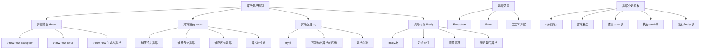

# 异常处理机制

## 🎯 学习目标
- 理解PHP中异常处理的基本概念和机制
- 掌握try-catch-finally语句的使用
- 学会抛出和捕获异常
- 了解异常处理的最佳实践

## 📚 核心概念

### 异常处理概述



### 异常 vs 错误对比

| 特性 | 异常 (Exception) | 错误 (Error) |
|------|------------------|--------------|
| 可捕获性 | 可捕获 | 可捕获（PHP 7+） |
| 处理方式 | try-catch | try-catch |
| 继承关系 | 继承自Exception | 继承自Error |
| 使用场景 | 业务逻辑错误 | 系统级错误 |
| 恢复性 | 通常可恢复 | 通常不可恢复 |
| 示例 | 数据库连接失败 | 内存不足 |

## 🔧 基本异常处理

### try-catch语句
```php
<?php
// 基本try-catch语句

// 1. 简单异常处理
function divide($a, $b) {
    if ($b == 0) {
        throw new Exception("除数不能为零");
    }
    return $a / $b;
}

try {
    $result = divide(10, 0);
    echo "结果: $result\n";
} catch (Exception $e) {
    echo "捕获异常: " . $e->getMessage() . "\n";
}

// 2. 多个catch块
function processFile($filename) {
    if (!file_exists($filename)) {
        throw new InvalidArgumentException("文件不存在: $filename");
    }
    
    if (!is_readable($filename)) {
        throw new RuntimeException("文件不可读: $filename");
    }
    
    $content = file_get_contents($filename);
    if ($content === false) {
        throw new Exception("文件读取失败: $filename");
    }
    
    return $content;
}

try {
    $content = processFile('nonexistent.txt');
    echo "文件内容: $content\n";
} catch (InvalidArgumentException $e) {
    echo "参数错误: " . $e->getMessage() . "\n";
} catch (RuntimeException $e) {
    echo "运行时错误: " . $e->getMessage() . "\n";
} catch (Exception $e) {
    echo "其他异常: " . $e->getMessage() . "\n";
}

// 3. 捕获多个异常类型
function validateInput($input) {
    if (empty($input)) {
        throw new InvalidArgumentException("输入不能为空");
    }
    
    if (!is_string($input)) {
        throw new TypeError("输入必须是字符串");
    }
    
    if (strlen($input) > 100) {
        throw new LengthException("输入长度不能超过100字符");
    }
    
    return true;
}

try {
    validateInput(123); // 会抛出TypeError
} catch (InvalidArgumentException | TypeError | LengthException $e) {
    echo "验证失败: " . $e->getMessage() . "\n";
    echo "异常类型: " . get_class($e) . "\n";
}

// 4. 捕获所有异常
function riskyOperation() {
    $random = rand(1, 3);
    
    switch ($random) {
        case 1:
            throw new Exception("随机异常1");
        case 2:
            throw new InvalidArgumentException("随机异常2");
        case 3:
            throw new RuntimeException("随机异常3");
    }
}

try {
    riskyOperation();
} catch (Throwable $e) {
    echo "捕获所有异常: " . $e->getMessage() . "\n";
    echo "异常类型: " . get_class($e) . "\n";
    echo "文件: " . $e->getFile() . "\n";
    echo "行号: " . $e->getLine() . "\n";
}

echo "=== try-catch语句示例完成 ===\n";
?>
```

### finally语句
```php
<?php
// finally语句示例

// 1. 基本finally使用
function basicFinally() {
    try {
        echo "执行try块\n";
        throw new Exception("测试异常");
    } catch (Exception $e) {
        echo "捕获异常: " . $e->getMessage() . "\n";
    } finally {
        echo "执行finally块\n";
    }
}

basicFinally();

// 2. finally中的资源清理
function resourceCleanup() {
    $file = null;
    
    try {
        $file = fopen('test.txt', 'w');
        if (!$file) {
            throw new Exception("无法打开文件");
        }
        
        fwrite($file, "测试内容");
        throw new Exception("模拟异常");
        
    } catch (Exception $e) {
        echo "捕获异常: " . $e->getMessage() . "\n";
    } finally {
        if ($file) {
            fclose($file);
            echo "文件已关闭\n";
        }
    }
}

resourceCleanup();

// 3. finally中的返回值处理
function finallyReturn() {
    try {
        echo "try块执行\n";
        return "try返回值";
    } catch (Exception $e) {
        echo "catch块执行\n";
        return "catch返回值";
    } finally {
        echo "finally块执行\n";
        // finally中的return会覆盖try/catch中的return
        return "finally返回值";
    }
}

$result = finallyReturn();
echo "最终返回值: $result\n";

// 4. 数据库连接示例
class DatabaseConnection {
    private $connection;
    
    public function connect($host, $username, $password, $database) {
        try {
            echo "尝试连接数据库...\n";
            $this->connection = "模拟数据库连接";
            
            // 模拟连接失败
            if (rand(1, 2) === 1) {
                throw new Exception("数据库连接失败");
            }
            
            echo "数据库连接成功\n";
            return $this->connection;
            
        } catch (Exception $e) {
            echo "数据库连接异常: " . $e->getMessage() . "\n";
            throw $e; // 重新抛出异常
        } finally {
            // 无论成功还是失败，都执行清理
            echo "执行数据库连接清理\n";
        }
    }
    
    public function query($sql) {
        try {
            echo "执行查询: $sql\n";
            
            // 模拟查询失败
            if (rand(1, 3) === 1) {
                throw new Exception("查询执行失败");
            }
            
            return "查询结果";
            
        } catch (Exception $e) {
            echo "查询异常: " . $e->getMessage() . "\n";
            throw $e;
        } finally {
            echo "查询清理完成\n";
        }
    }
    
    public function close() {
        if ($this->connection) {
            echo "关闭数据库连接\n";
            $this->connection = null;
        }
    }
}

// 使用数据库连接示例
try {
    $db = new DatabaseConnection();
    $connection = $db->connect('localhost', 'user', 'pass', 'testdb');
    $result = $db->query('SELECT * FROM users');
    echo "查询结果: $result\n";
} catch (Exception $e) {
    echo "数据库操作失败: " . $e->getMessage() . "\n";
} finally {
    if (isset($db)) {
        $db->close();
    }
}

echo "=== finally语句示例完成 ===\n";
?>
```

### 异常抛出
```php
<?php
// 异常抛出示例

// 1. 基本异常抛出
function validateAge($age) {
    if (!is_numeric($age)) {
        throw new InvalidArgumentException("年龄必须是数字");
    }
    
    if ($age < 0) {
        throw new InvalidArgumentException("年龄不能为负数");
    }
    
    if ($age > 150) {
        throw new InvalidArgumentException("年龄不能超过150岁");
    }
    
    return true;
}

// 2. 自定义异常信息
function processPayment($amount, $cardNumber) {
    if ($amount <= 0) {
        throw new InvalidArgumentException("支付金额必须大于0");
    }
    
    if (empty($cardNumber)) {
        throw new InvalidArgumentException("银行卡号不能为空");
    }
    
    if (strlen($cardNumber) < 16) {
        throw new InvalidArgumentException("银行卡号长度不正确");
    }
    
    // 模拟支付处理
    if (rand(1, 3) === 1) {
        throw new RuntimeException("支付处理失败，请稍后重试");
    }
    
    return "支付成功，交易ID: " . uniqid();
}

// 3. 异常链传递
function processOrder($orderData) {
    try {
        // 验证订单数据
        if (empty($orderData['items'])) {
            throw new InvalidArgumentException("订单商品不能为空");
        }
        
        // 处理支付
        $paymentResult = processPayment($orderData['total'], $orderData['cardNumber']);
        
        // 更新库存
        if (rand(1, 4) === 1) {
            throw new RuntimeException("库存不足");
        }
        
        return "订单处理成功";
        
    } catch (Exception $e) {
        // 重新抛出异常，添加更多上下文信息
        throw new Exception("订单处理失败: " . $e->getMessage(), 0, $e);
    }
}

// 4. 条件异常抛出
function uploadFile($file, $maxSize = 1024 * 1024) {
    if (!isset($file['tmp_name']) || !is_uploaded_file($file['tmp_name'])) {
        throw new InvalidArgumentException("无效的文件上传");
    }
    
    if ($file['size'] > $maxSize) {
        throw new RuntimeException("文件大小超过限制: " . ($maxSize / 1024 / 1024) . "MB");
    }
    
    $allowedTypes = ['image/jpeg', 'image/png', 'image/gif'];
    if (!in_array($file['type'], $allowedTypes)) {
        throw new RuntimeException("不支持的文件类型: " . $file['type']);
    }
    
    $uploadPath = 'uploads/' . uniqid() . '_' . $file['name'];
    if (!move_uploaded_file($file['tmp_name'], $uploadPath)) {
        throw new RuntimeException("文件上传失败");
    }
    
    return $uploadPath;
}

// 5. 异常抛出测试
echo "=== 异常抛出示例 ===\n";

// 测试年龄验证
try {
    validateAge(25);
    echo "年龄验证通过\n";
} catch (InvalidArgumentException $e) {
    echo "年龄验证失败: " . $e->getMessage() . "\n";
}

try {
    validateAge(-5);
} catch (InvalidArgumentException $e) {
    echo "年龄验证失败: " . $e->getMessage() . "\n";
}

// 测试支付处理
try {
    $result = processPayment(100, '1234567890123456');
    echo "支付结果: $result\n";
} catch (InvalidArgumentException $e) {
    echo "支付参数错误: " . $e->getMessage() . "\n";
} catch (RuntimeException $e) {
    echo "支付处理失败: " . $e->getMessage() . "\n";
}

// 测试订单处理
try {
    $orderData = [
        'items' => ['商品1', '商品2'],
        'total' => 200,
        'cardNumber' => '1234567890123456'
    ];
    
    $result = processOrder($orderData);
    echo "订单处理结果: $result\n";
} catch (Exception $e) {
    echo "订单处理异常: " . $e->getMessage() . "\n";
    
    // 检查是否有前一个异常
    if ($e->getPrevious()) {
        echo "前一个异常: " . $e->getPrevious()->getMessage() . "\n";
    }
}

echo "=== 异常抛出示例完成 ===\n";
?>
```

## 🔧 高级异常处理

### 异常链和嵌套异常
```php
<?php
// 异常链和嵌套异常示例

// 1. 异常链传递
function level1() {
    try {
        level2();
    } catch (Exception $e) {
        throw new Exception("Level 1 异常: " . $e->getMessage(), 0, $e);
    }
}

function level2() {
    try {
        level3();
    } catch (Exception $e) {
        throw new Exception("Level 2 异常: " . $e->getMessage(), 0, $e);
    }
}

function level3() {
    throw new Exception("Level 3 原始异常");
}

// 2. 异常信息收集
class ExceptionCollector {
    private $exceptions = [];
    
    public function addException(Exception $e) {
        $this->exceptions[] = $e;
    }
    
    public function getExceptionChain(Exception $e) {
        $chain = [];
        $current = $e;
        
        while ($current) {
            $chain[] = [
                'message' => $current->getMessage(),
                'file' => $current->getFile(),
                'line' => $current->getLine(),
                'trace' => $current->getTraceAsString()
            ];
            $current = $current->getPrevious();
        }
        
        return $chain;
    }
    
    public function formatExceptionChain(Exception $e) {
        $chain = $this->getExceptionChain($e);
        $output = "异常链:\n";
        
        foreach ($chain as $index => $exception) {
            $output .= "  [$index] " . $exception['message'] . "\n";
            $output .= "      文件: " . $exception['file'] . "\n";
            $output .= "      行号: " . $exception['line'] . "\n";
        }
        
        return $output;
    }
}

// 3. 嵌套异常处理
function processData($data) {
    try {
        // 第一步：验证数据
        validateData($data);
        
        // 第二步：处理数据
        $processedData = transformData($data);
        
        // 第三步：保存数据
        saveData($processedData);
        
        return "数据处理成功";
        
    } catch (Exception $e) {
        // 收集所有异常信息
        $collector = new ExceptionCollector();
        $collector->addException($e);
        
        // 重新抛出包含完整信息的异常
        throw new Exception("数据处理失败: " . $e->getMessage(), 0, $e);
    }
}

function validateData($data) {
    if (empty($data)) {
        throw new InvalidArgumentException("数据不能为空");
    }
    
    if (!is_array($data)) {
        throw new InvalidArgumentException("数据必须是数组");
    }
}

function transformData($data) {
    try {
        // 模拟数据转换
        if (rand(1, 3) === 1) {
            throw new RuntimeException("数据转换失败");
        }
        
        return array_map('strtoupper', $data);
        
    } catch (Exception $e) {
        throw new Exception("数据转换异常: " . $e->getMessage(), 0, $e);
    }
}

function saveData($data) {
    try {
        // 模拟数据保存
        if (rand(1, 4) === 1) {
            throw new RuntimeException("数据保存失败");
        }
        
        return true;
        
    } catch (Exception $e) {
        throw new Exception("数据保存异常: " . $e->getMessage(), 0, $e);
    }
}

// 4. 异常链测试
echo "=== 异常链和嵌套异常示例 ===\n";

// 测试异常链
try {
    level1();
} catch (Exception $e) {
    $collector = new ExceptionCollector();
    echo $collector->formatExceptionChain($e);
}

// 测试嵌套异常处理
try {
    $result = processData(['item1', 'item2', 'item3']);
    echo "处理结果: $result\n";
} catch (Exception $e) {
    $collector = new ExceptionCollector();
    echo $collector->formatExceptionChain($e);
}

echo "=== 异常链和嵌套异常示例完成 ===\n";
?>
```

### 异常处理模式
```php
<?php
// 异常处理模式示例

// 1. 重试模式
class RetryHandler {
    private $maxRetries;
    private $delay;
    
    public function __construct($maxRetries = 3, $delay = 1000) {
        $this->maxRetries = $maxRetries;
        $this->delay = $delay;
    }
    
    public function execute(callable $operation, array $args = []) {
        $lastException = null;
        
        for ($attempt = 1; $attempt <= $this->maxRetries; $attempt++) {
            try {
                echo "尝试第 $attempt 次执行...\n";
                return call_user_func_array($operation, $args);
                
            } catch (Exception $e) {
                $lastException = $e;
                echo "第 $attempt 次尝试失败: " . $e->getMessage() . "\n";
                
                if ($attempt < $this->maxRetries) {
                    echo "等待 {$this->delay}ms 后重试...\n";
                    usleep($this->delay * 1000);
                }
            }
        }
        
        throw new Exception("操作在 $this->maxRetries 次尝试后仍然失败", 0, $lastException);
    }
}

// 2. 断路器模式
class CircuitBreaker {
    private $failureThreshold;
    private $timeout;
    private $failureCount = 0;
    private $lastFailureTime = 0;
    private $state = 'CLOSED'; // CLOSED, OPEN, HALF_OPEN
    
    public function __construct($failureThreshold = 5, $timeout = 60000) {
        $this->failureThreshold = $failureThreshold;
        $this->timeout = $timeout;
    }
    
    public function execute(callable $operation, array $args = []) {
        if ($this->state === 'OPEN') {
            if (time() * 1000 - $this->lastFailureTime > $this->timeout) {
                $this->state = 'HALF_OPEN';
                echo "断路器状态: HALF_OPEN\n";
            } else {
                throw new Exception("断路器开启，操作被拒绝");
            }
        }
        
        try {
            $result = call_user_func_array($operation, $args);
            $this->onSuccess();
            return $result;
            
        } catch (Exception $e) {
            $this->onFailure();
            throw $e;
        }
    }
    
    private function onSuccess() {
        $this->failureCount = 0;
        $this->state = 'CLOSED';
        echo "操作成功，断路器状态: CLOSED\n";
    }
    
    private function onFailure() {
        $this->failureCount++;
        $this->lastFailureTime = time() * 1000;
        
        if ($this->failureCount >= $this->failureThreshold) {
            $this->state = 'OPEN';
            echo "断路器状态: OPEN\n";
        }
    }
    
    public function getState() {
        return $this->state;
    }
}

// 3. 超时模式
class TimeoutHandler {
    private $timeout;
    
    public function __construct($timeout = 5000) {
        $this->timeout = $timeout;
    }
    
    public function execute(callable $operation, array $args = []) {
        $startTime = microtime(true) * 1000;
        
        try {
            $result = call_user_func_array($operation, $args);
            $endTime = microtime(true) * 1000;
            $duration = $endTime - $startTime;
            
            if ($duration > $this->timeout) {
                throw new Exception("操作超时: {$duration}ms > {$this->timeout}ms");
            }
            
            echo "操作完成，耗时: {$duration}ms\n";
            return $result;
            
        } catch (Exception $e) {
            $endTime = microtime(true) * 1000;
            $duration = $endTime - $startTime;
            
            if ($duration > $this->timeout) {
                throw new Exception("操作超时: {$duration}ms > {$this->timeout}ms", 0, $e);
            }
            
            throw $e;
        }
    }
}

// 4. 模拟操作函数
function unreliableOperation() {
    $random = rand(1, 10);
    
    if ($random <= 3) {
        throw new Exception("操作失败");
    }
    
    if ($random <= 5) {
        usleep(6000 * 1000); // 6秒延迟
    }
    
    return "操作成功";
}

// 5. 异常处理模式测试
echo "=== 异常处理模式示例 ===\n";

// 测试重试模式
$retryHandler = new RetryHandler(3, 1000);
try {
    $result = $retryHandler->execute('unreliableOperation');
    echo "重试模式结果: $result\n";
} catch (Exception $e) {
    echo "重试模式失败: " . $e->getMessage() . "\n";
}

// 测试断路器模式
$circuitBreaker = new CircuitBreaker(3, 5000);
for ($i = 1; $i <= 5; $i++) {
    try {
        $result = $circuitBreaker->execute('unreliableOperation');
        echo "断路器模式结果: $result\n";
    } catch (Exception $e) {
        echo "断路器模式失败: " . $e->getMessage() . "\n";
    }
    
    echo "当前断路器状态: " . $circuitBreaker->getState() . "\n";
}

// 测试超时模式
$timeoutHandler = new TimeoutHandler(3000);
try {
    $result = $timeoutHandler->execute('unreliableOperation');
    echo "超时模式结果: $result\n";
} catch (Exception $e) {
    echo "超时模式失败: " . $e->getMessage() . "\n";
}

echo "=== 异常处理模式示例完成 ===\n";
?>
```

## 🎯 实际应用

### 异常处理框架
```php
<?php
// 异常处理框架示例

// 1. 基础异常类
abstract class BaseException extends Exception {
    protected $context;
    protected $timestamp;
    
    public function __construct($message = "", $code = 0, Exception $previous = null, array $context = []) {
        parent::__construct($message, $code, $previous);
        $this->context = $context;
        $this->timestamp = time();
    }
    
    public function getContext() {
        return $this->context;
    }
    
    public function getTimestamp() {
        return $this->timestamp;
    }
    
    public function toArray() {
        return [
            'type' => get_class($this),
            'message' => $this->getMessage(),
            'code' => $this->getCode(),
            'file' => $this->getFile(),
            'line' => $this->getLine(),
            'context' => $this->context,
            'timestamp' => $this->timestamp,
            'trace' => $this->getTrace()
        ];
    }
}

// 2. 具体异常类
class ValidationException extends BaseException {
    public function __construct($message = "", $field = null, array $context = []) {
        if ($field) {
            $message = "字段 '$field' 验证失败: $message";
        }
        parent::__construct($message, 400, null, $context);
    }
}

class DatabaseException extends BaseException {
    public function __construct($message = "", $query = null, array $context = []) {
        if ($query) {
            $message = "数据库操作失败: $message (查询: $query)";
        }
        parent::__construct($message, 500, null, $context);
    }
}

class BusinessLogicException extends BaseException {
    public function __construct($message = "", $operation = null, array $context = []) {
        if ($operation) {
            $message = "业务逻辑错误: $message (操作: $operation)";
        }
        parent::__construct($message, 422, null, $context);
    }
}

// 3. 异常处理器
class ExceptionHandler {
    private $handlers;
    private $logger;
    
    public function __construct($logger = null) {
        $this->handlers = [];
        $this->logger = $logger;
    }
    
    public function registerHandler($exceptionType, callable $handler) {
        $this->handlers[$exceptionType] = $handler;
    }
    
    public function handle(Exception $e) {
        $exceptionType = get_class($e);
        
        // 记录异常
        if ($this->logger) {
            $this->logger->log($e);
        }
        
        // 查找处理器
        if (isset($this->handlers[$exceptionType])) {
            return $this->handlers[$exceptionType]($e);
        }
        
        // 默认处理
        return $this->defaultHandle($e);
    }
    
    private function defaultHandle(Exception $e) {
        if ($e instanceof BaseException) {
            return [
                'error' => true,
                'message' => $e->getMessage(),
                'code' => $e->getCode(),
                'context' => $e->getContext(),
                'timestamp' => $e->getTimestamp()
            ];
        }
        
        return [
            'error' => true,
            'message' => '系统错误',
            'code' => 500,
            'timestamp' => time()
        ];
    }
}

// 4. 异常日志记录器
class ExceptionLogger {
    private $logFile;
    
    public function __construct($logFile = 'exceptions.log') {
        $this->logFile = $logFile;
    }
    
    public function log(Exception $e) {
        $logEntry = [
            'timestamp' => date('Y-m-d H:i:s'),
            'type' => get_class($e),
            'message' => $e->getMessage(),
            'file' => $e->getFile(),
            'line' => $e->getLine(),
            'trace' => $e->getTraceAsString()
        ];
        
        if ($e instanceof BaseException) {
            $logEntry['context'] = $e->getContext();
        }
        
        $logLine = json_encode($logEntry, JSON_UNESCAPED_UNICODE) . "\n";
        file_put_contents($this->logFile, $logLine, FILE_APPEND | LOCK_EX);
    }
}

// 5. 业务逻辑示例
class UserService {
    private $exceptionHandler;
    
    public function __construct($exceptionHandler) {
        $this->exceptionHandler = $exceptionHandler;
    }
    
    public function createUser($userData) {
        try {
            // 验证用户数据
            $this->validateUserData($userData);
            
            // 检查用户是否存在
            $this->checkUserExists($userData['email']);
            
            // 创建用户
            $user = $this->saveUser($userData);
            
            return $user;
            
        } catch (Exception $e) {
            return $this->exceptionHandler->handle($e);
        }
    }
    
    private function validateUserData($userData) {
        if (empty($userData['name'])) {
            throw new ValidationException("姓名不能为空", 'name', $userData);
        }
        
        if (empty($userData['email'])) {
            throw new ValidationException("邮箱不能为空", 'email', $userData);
        }
        
        if (!filter_var($userData['email'], FILTER_VALIDATE_EMAIL)) {
            throw new ValidationException("邮箱格式不正确", 'email', $userData);
        }
    }
    
    private function checkUserExists($email) {
        // 模拟数据库查询
        if (rand(1, 3) === 1) {
            throw new DatabaseException("数据库连接失败", "SELECT * FROM users WHERE email = '$email'");
        }
        
        // 模拟用户已存在
        if (rand(1, 4) === 1) {
            throw new BusinessLogicException("用户已存在", 'createUser', ['email' => $email]);
        }
    }
    
    private function saveUser($userData) {
        // 模拟保存用户
        if (rand(1, 5) === 1) {
            throw new DatabaseException("用户保存失败", "INSERT INTO users ...");
        }
        
        return [
            'id' => uniqid(),
            'name' => $userData['name'],
            'email' => $userData['email'],
            'created_at' => date('Y-m-d H:i:s')
        ];
    }
}

// 6. 异常处理框架测试
echo "=== 异常处理框架示例 ===\n";

// 创建异常处理器和日志记录器
$logger = new ExceptionLogger('framework_exceptions.log');
$handler = new ExceptionHandler($logger);

// 注册异常处理器
$handler->registerHandler('ValidationException', function($e) {
    return [
        'error' => true,
        'type' => 'validation',
        'message' => $e->getMessage(),
        'field' => $e->getContext()['field'] ?? null,
        'code' => 400
    ];
});

$handler->registerHandler('DatabaseException', function($e) {
    return [
        'error' => true,
        'type' => 'database',
        'message' => '数据库操作失败，请稍后重试',
        'code' => 500
    ];
});

$handler->registerHandler('BusinessLogicException', function($e) {
    return [
        'error' => true,
        'type' => 'business',
        'message' => $e->getMessage(),
        'code' => 422
    ];
});

// 创建用户服务
$userService = new UserService($handler);

// 测试用户创建
$testCases = [
    ['name' => '张三', 'email' => 'zhangsan@example.com'],
    ['name' => '', 'email' => 'invalid-email'],
    ['name' => '李四', 'email' => 'lisi@example.com'],
    ['name' => '王五', 'email' => 'wangwu@example.com']
];

foreach ($testCases as $index => $userData) {
    echo "测试用例 " . ($index + 1) . ":\n";
    $result = $userService->createUser($userData);
    
    if (isset($result['error']) && $result['error']) {
        echo "  错误: " . $result['message'] . " (类型: " . $result['type'] . ")\n";
    } else {
        echo "  成功: 用户ID " . $result['id'] . "\n";
    }
    echo "\n";
}

echo "=== 异常处理框架示例完成 ===\n";
?>
```

## 📊 最佳实践

### 异常处理最佳实践
```php
<?php
// 异常处理最佳实践

// 1. 异常分类和层次结构
abstract class AppException extends Exception {
    protected $context;
    
    public function __construct($message = "", $code = 0, Exception $previous = null, array $context = []) {
        parent::__construct($message, $code, $previous);
        $this->context = $context;
    }
    
    public function getContext() {
        return $this->context;
    }
}

class ValidationException extends AppException {
    public function __construct($message = "", $field = null, array $context = []) {
        if ($field) {
            $message = "验证失败 [$field]: $message";
        }
        parent::__construct($message, 400, null, $context);
    }
}

class BusinessException extends AppException {
    public function __construct($message = "", $operation = null, array $context = []) {
        if ($operation) {
            $message = "业务错误 [$operation]: $message";
        }
        parent::__construct($message, 422, null, $context);
    }
}

class SystemException extends AppException {
    public function __construct($message = "", $component = null, array $context = []) {
        if ($component) {
            $message = "系统错误 [$component]: $message";
        }
        parent::__construct($message, 500, null, $context);
    }
}

// 2. 异常处理策略
class ExceptionStrategy {
    private $strategies;
    
    public function __construct() {
        $this->strategies = [
            'ValidationException' => 'handleValidation',
            'BusinessException' => 'handleBusiness',
            'SystemException' => 'handleSystem',
            'default' => 'handleDefault'
        ];
    }
    
    public function handle(Exception $e) {
        $exceptionType = get_class($e);
        $strategy = $this->strategies[$exceptionType] ?? $this->strategies['default'];
        
        return $this->$strategy($e);
    }
    
    private function handleValidation(ValidationException $e) {
        return [
            'error' => true,
            'type' => 'validation',
            'message' => $e->getMessage(),
            'code' => 400,
            'context' => $e->getContext()
        ];
    }
    
    private function handleBusiness(BusinessException $e) {
        return [
            'error' => true,
            'type' => 'business',
            'message' => $e->getMessage(),
            'code' => 422,
            'context' => $e->getContext()
        ];
    }
    
    private function handleSystem(SystemException $e) {
        return [
            'error' => true,
            'type' => 'system',
            'message' => '系统错误，请稍后重试',
            'code' => 500,
            'context' => $e->getContext()
        ];
    }
    
    private function handleDefault(Exception $e) {
        return [
            'error' => true,
            'type' => 'unknown',
            'message' => '未知错误',
            'code' => 500
        ];
    }
}

// 3. 异常处理装饰器
class ExceptionDecorator {
    private $handler;
    private $decorators;
    
    public function __construct($handler) {
        $this->handler = $handler;
        $this->decorators = [];
    }
    
    public function addDecorator(callable $decorator) {
        $this->decorators[] = $decorator;
    }
    
    public function handle(Exception $e) {
        $result = $this->handler->handle($e);
        
        foreach ($this->decorators as $decorator) {
            $result = $decorator($result, $e);
        }
        
        return $result;
    }
}

// 4. 异常处理中间件
class ExceptionMiddleware {
    private $middlewares;
    
    public function __construct() {
        $this->middlewares = [];
    }
    
    public function addMiddleware(callable $middleware) {
        $this->middlewares[] = $middleware;
    }
    
    public function execute(callable $operation, array $args = []) {
        $middlewareChain = $this->buildMiddlewareChain($operation);
        return $middlewareChain($args);
    }
    
    private function buildMiddlewareChain(callable $operation) {
        $chain = $operation;
        
        foreach (array_reverse($this->middlewares) as $middleware) {
            $chain = function($args) use ($middleware, $chain) {
                return $middleware($args, $chain);
            };
        }
        
        return $chain;
    }
}

// 5. 使用示例
echo "=== 异常处理最佳实践示例 ===\n";

// 创建异常处理策略
$strategy = new ExceptionStrategy();

// 创建异常处理装饰器
$decorator = new ExceptionDecorator($strategy);

// 添加装饰器
$decorator->addDecorator(function($result, $e) {
    $result['timestamp'] = time();
    $result['request_id'] = uniqid();
    return $result;
});

$decorator->addDecorator(function($result, $e) {
    if ($result['error']) {
        $result['debug_info'] = [
            'file' => $e->getFile(),
            'line' => $e->getLine(),
            'trace' => $e->getTraceAsString()
        ];
    }
    return $result;
});

// 测试异常处理
try {
    throw new ValidationException("邮箱格式不正确", "email", ["value" => "invalid-email"]);
} catch (Exception $e) {
    $result = $decorator->handle($e);
    echo "验证异常处理结果: " . json_encode($result, JSON_UNESCAPED_UNICODE) . "\n";
}

try {
    throw new BusinessException("用户已存在", "createUser", ["email" => "test@example.com"]);
} catch (Exception $e) {
    $result = $decorator->handle($e);
    echo "业务异常处理结果: " . json_encode($result, JSON_UNESCAPED_UNICODE) . "\n";
}

// 测试异常处理中间件
$middleware = new ExceptionMiddleware();

$middleware->addMiddleware(function($args, $next) {
    try {
        return $next($args);
    } catch (Exception $e) {
        return $decorator->handle($e);
    }
});

$middleware->addMiddleware(function($args, $next) {
    echo "中间件1: 开始处理\n";
    $result = $next($args);
    echo "中间件1: 处理完成\n";
    return $result;
});

$middleware->addMiddleware(function($args, $next) {
    echo "中间件2: 开始处理\n";
    $result = $next($args);
    echo "中间件2: 处理完成\n";
    return $result;
});

// 执行带中间件的操作
$result = $middleware->execute(function($args) {
    echo "执行业务逻辑\n";
    throw new SystemException("数据库连接失败", "database");
});

echo "中间件处理结果: " . json_encode($result, JSON_UNESCAPED_UNICODE) . "\n";

echo "=== 异常处理最佳实践示例完成 ===\n";
?>
```

## 🎓 学习建议

### 费曼学习法应用
1. **选择概念**: 选择异常处理机制中的核心概念
2. **简化解释**: 用简单语言解释异常处理的作用和流程
3. **识别盲点**: 发现理解不深入的地方
4. **重新学习**: 针对盲点进行深入学习

### 刻意练习重点
1. **概念理解**: 深入理解异常处理的基本概念
2. **实际应用**: 在实际项目中应用异常处理
3. **最佳实践**: 学习异常处理的最佳实践
4. **模式应用**: 掌握异常处理的常见模式

## 🔗 相关链接
- [[01-错误类型与级别|错误类型与级别]]
- [[03-自定义异常|自定义异常]]
- [[04-错误日志记录|错误日志记录]]
- [[05-调试技巧与工具|调试技巧与工具]]
- [[06-错误处理策略|错误处理策略]]
