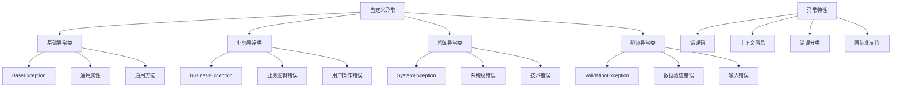

# 自定义异常

## 🎯 学习目标
- 理解自定义异常的概念和作用
- 掌握PHP中自定义异常的创建和使用
- 学会设计异常层次结构
- 了解自定义异常的最佳实践

## 📚 核心概念

### 自定义异常概述



### 异常层次结构

| 异常类型 | 继承关系 | 用途 | 错误码范围 |
|----------|----------|------|------------|
| BaseException | Exception | 基础异常类 | 1000-1999 |
| ValidationException | BaseException | 数据验证 | 2000-2999 |
| BusinessException | BaseException | 业务逻辑 | 3000-3999 |
| SystemException | BaseException | 系统错误 | 4000-4999 |
| DatabaseException | SystemException | 数据库错误 | 4100-4199 |
| NetworkException | SystemException | 网络错误 | 4200-4299 |

## 🔧 基本自定义异常

### 基础异常类
```php
<?php
// 基础异常类
abstract class BaseException extends Exception {
    protected $errorCode;
    protected $context;
    protected $timestamp;
    protected $severity;
    
    public function __construct($message = "", $errorCode = 0, $severity = 'error', array $context = [], Exception $previous = null) {
        parent::__construct($message, $errorCode, $previous);
        $this->errorCode = $errorCode;
        $this->context = $context;
        $this->timestamp = time();
        $this->severity = $severity;
    }
    
    public function getErrorCode() {
        return $this->errorCode;
    }
    
    public function getContext() {
        return $this->context;
    }
    
    public function getTimestamp() {
        return $this->timestamp;
    }
    
    public function getSeverity() {
        return $this->severity;
    }
    
    public function toArray() {
        return [
            'type' => get_class($this),
            'message' => $this->getMessage(),
            'errorCode' => $this->errorCode,
            'severity' => $this->severity,
            'context' => $this->context,
            'timestamp' => $this->timestamp,
            'file' => $this->getFile(),
            'line' => $this->getLine()
        ];
    }
    
    public function toJson() {
        return json_encode($this->toArray(), JSON_UNESCAPED_UNICODE | JSON_PRETTY_PRINT);
    }
}

// 验证异常类
class ValidationException extends BaseException {
    private $field;
    
    public function __construct($message = "", $field = null, $errorCode = 2000, array $context = []) {
        if ($field) {
            $message = "字段 '$field' 验证失败: $message";
        }
        parent::__construct($message, $errorCode, 'warning', $context);
        $this->field = $field;
    }
    
    public function getField() {
        return $this->field;
    }
}

// 业务异常类
class BusinessException extends BaseException {
    private $operation;
    
    public function __construct($message = "", $operation = null, $errorCode = 3000, array $context = []) {
        if ($operation) {
            $message = "业务操作 '$operation' 失败: $message";
        }
        parent::__construct($message, $errorCode, 'error', $context);
        $this->operation = $operation;
    }
    
    public function getOperation() {
        return $this->operation;
    }
}

// 系统异常类
class SystemException extends BaseException {
    private $component;
    
    public function __construct($message = "", $component = null, $errorCode = 4000, array $context = []) {
        if ($component) {
            $message = "系统组件 '$component' 错误: $message";
        }
        parent::__construct($message, $errorCode, 'critical', $context);
        $this->component = $component;
    }
    
    public function getComponent() {
        return $this->component;
    }
}

// 使用示例
echo "=== 自定义异常示例 ===\n";

try {
    // 验证异常
    throw new ValidationException("邮箱格式不正确", "email", 2001, ["value" => "invalid-email"]);
} catch (ValidationException $e) {
    echo "验证异常: " . $e->getMessage() . "\n";
    echo "字段: " . $e->getField() . "\n";
    echo "错误码: " . $e->getErrorCode() . "\n";
    echo "严重程度: " . $e->getSeverity() . "\n";
}

try {
    // 业务异常
    throw new BusinessException("用户余额不足", "withdraw", 3001, ["amount" => 1000, "balance" => 500]);
} catch (BusinessException $e) {
    echo "业务异常: " . $e->getMessage() . "\n";
    echo "操作: " . $e->getOperation() . "\n";
    echo "上下文: " . json_encode($e->getContext()) . "\n";
}

try {
    // 系统异常
    throw new SystemException("数据库连接失败", "database", 4001, ["host" => "localhost", "port" => 3306]);
} catch (SystemException $e) {
    echo "系统异常: " . $e->getMessage() . "\n";
    echo "组件: " . $e->getComponent() . "\n";
    echo "JSON格式: " . $e->toJson() . "\n";
}
?>
```

### 具体业务异常
```php
<?php
// 用户相关异常
class UserException extends BusinessException {
    public function __construct($message = "", $errorCode = 3100, array $context = []) {
        parent::__construct($message, "user", $errorCode, $context);
    }
}

class UserNotFoundException extends UserException {
    public function __construct($userId = null, array $context = []) {
        $message = $userId ? "用户不存在: $userId" : "用户不存在";
        parent::__construct($message, 3101, $context);
    }
}

class UserAlreadyExistsException extends UserException {
    public function __construct($email = null, array $context = []) {
        $message = $email ? "用户已存在: $email" : "用户已存在";
        parent::__construct($message, 3102, $context);
    }
}

class UserPermissionException extends UserException {
    public function __construct($permission = null, array $context = []) {
        $message = $permission ? "权限不足: $permission" : "权限不足";
        parent::__construct($message, 3103, $context);
    }
}

// 支付相关异常
class PaymentException extends BusinessException {
    public function __construct($message = "", $errorCode = 3200, array $context = []) {
        parent::__construct($message, "payment", $errorCode, $context);
    }
}

class InsufficientFundsException extends PaymentException {
    public function __construct($amount = null, $balance = null, array $context = []) {
        $message = "余额不足";
        if ($amount && $balance) {
            $message .= ": 需要 $amount，当前余额 $balance";
        }
        parent::__construct($message, 3201, $context);
    }
}

class PaymentFailedException extends PaymentException {
    public function __construct($reason = null, array $context = []) {
        $message = "支付失败";
        if ($reason) {
            $message .= ": $reason";
        }
        parent::__construct($message, 3202, $context);
    }
}

// 数据库相关异常
class DatabaseException extends SystemException {
    public function __construct($message = "", $errorCode = 4100, array $context = []) {
        parent::__construct($message, "database", $errorCode, $context);
    }
}

class ConnectionException extends DatabaseException {
    public function __construct($host = null, $port = null, array $context = []) {
        $message = "数据库连接失败";
        if ($host && $port) {
            $message .= ": $host:$port";
        }
        parent::__construct($message, 4101, $context);
    }
}

class QueryException extends DatabaseException {
    public function __construct($query = null, array $context = []) {
        $message = "数据库查询失败";
        if ($query) {
            $message .= ": $query";
        }
        parent::__construct($message, 4102, $context);
    }
}

// 使用示例
echo "=== 具体业务异常示例 ===\n";

// 用户异常测试
try {
    throw new UserNotFoundException("user123", ["search_criteria" => "id"]);
} catch (UserException $e) {
    echo "用户异常: " . $e->getMessage() . "\n";
    echo "操作: " . $e->getOperation() . "\n";
}

try {
    throw new UserAlreadyExistsException("test@example.com", ["duplicate_field" => "email"]);
} catch (UserException $e) {
    echo "用户异常: " . $e->getMessage() . "\n";
}

try {
    throw new UserPermissionException("admin", ["required_permission" => "admin", "user_role" => "user"]);
} catch (UserException $e) {
    echo "用户异常: " . $e->getMessage() . "\n";
}

// 支付异常测试
try {
    throw new InsufficientFundsException(1000, 500, ["transaction_id" => "txn123"]);
} catch (PaymentException $e) {
    echo "支付异常: " . $e->getMessage() . "\n";
}

try {
    throw new PaymentFailedException("银行卡被拒绝", ["card_last4" => "1234"]);
} catch (PaymentException $e) {
    echo "支付异常: " . $e->getMessage() . "\n";
}

// 数据库异常测试
try {
    throw new ConnectionException("localhost", 3306, ["database" => "testdb"]);
} catch (DatabaseException $e) {
    echo "数据库异常: " . $e->getMessage() . "\n";
    echo "组件: " . $e->getComponent() . "\n";
}

try {
    throw new QueryException("SELECT * FROM users", ["table" => "users"]);
} catch (DatabaseException $e) {
    echo "数据库异常: " . $e->getMessage() . "\n";
}
?>
```

## 🔧 高级自定义异常

### 异常工厂
```php
<?php
// 异常工厂类
class ExceptionFactory {
    private static $exceptionMap = [
        'validation' => ValidationException::class,
        'business' => BusinessException::class,
        'system' => SystemException::class,
        'user' => UserException::class,
        'payment' => PaymentException::class,
        'database' => DatabaseException::class
    ];
    
    public static function create($type, $message = "", $errorCode = 0, array $context = []) {
        if (!isset(self::$exceptionMap[$type])) {
            throw new InvalidArgumentException("未知的异常类型: $type");
        }
        
        $exceptionClass = self::$exceptionMap[$type];
        return new $exceptionClass($message, $errorCode, $context);
    }
    
    public static function createValidation($message, $field = null, $errorCode = 2000, array $context = []) {
        return new ValidationException($message, $field, $errorCode, $context);
    }
    
    public static function createBusiness($message, $operation = null, $errorCode = 3000, array $context = []) {
        return new BusinessException($message, $operation, $errorCode, $context);
    }
    
    public static function createSystem($message, $component = null, $errorCode = 4000, array $context = []) {
        return new SystemException($message, $component, $errorCode, $context);
    }
    
    public static function createUser($message, $errorCode = 3100, array $context = []) {
        return new UserException($message, $errorCode, $context);
    }
    
    public static function createPayment($message, $errorCode = 3200, array $context = []) {
        return new PaymentException($message, $errorCode, $context);
    }
    
    public static function createDatabase($message, $errorCode = 4100, array $context = []) {
        return new DatabaseException($message, $errorCode, $context);
    }
}

// 异常构建器
class ExceptionBuilder {
    private $type;
    private $message;
    private $errorCode;
    private $context;
    private $field;
    private $operation;
    private $component;
    
    public function __construct($type) {
        $this->type = $type;
        $this->message = "";
        $this->errorCode = 0;
        $this->context = [];
    }
    
    public function message($message) {
        $this->message = $message;
        return $this;
    }
    
    public function errorCode($errorCode) {
        $this->errorCode = $errorCode;
        return $this;
    }
    
    public function context(array $context) {
        $this->context = $context;
        return $this;
    }
    
    public function field($field) {
        $this->field = $field;
        return $this;
    }
    
    public function operation($operation) {
        $this->operation = $operation;
        return $this;
    }
    
    public function component($component) {
        $this->component = $component;
        return $this;
    }
    
    public function build() {
        switch ($this->type) {
            case 'validation':
                return new ValidationException($this->message, $this->field, $this->errorCode, $this->context);
            case 'business':
                return new BusinessException($this->message, $this->operation, $this->errorCode, $this->context);
            case 'system':
                return new SystemException($this->message, $this->component, $this->errorCode, $this->context);
            case 'user':
                return new UserException($this->message, $this->errorCode, $this->context);
            case 'payment':
                return new PaymentException($this->message, $this->errorCode, $this->context);
            case 'database':
                return new DatabaseException($this->message, $this->errorCode, $this->context);
            default:
                throw new InvalidArgumentException("未知的异常类型: " . $this->type);
        }
    }
    
    public static function validation() {
        return new self('validation');
    }
    
    public static function business() {
        return new self('business');
    }
    
    public static function system() {
        return new self('system');
    }
    
    public static function user() {
        return new self('user');
    }
    
    public static function payment() {
        return new self('payment');
    }
    
    public static function database() {
        return new self('database');
    }
}

// 使用示例
echo "=== 异常工厂和构建器示例 ===\n";

// 使用异常工厂
try {
    $exception = ExceptionFactory::createValidation("邮箱格式不正确", "email", 2001, ["value" => "invalid"]);
    throw $exception;
} catch (ValidationException $e) {
    echo "工厂创建异常: " . $e->getMessage() . "\n";
}

// 使用异常构建器
try {
    $exception = ExceptionBuilder::business()
        ->message("用户余额不足")
        ->operation("withdraw")
        ->errorCode(3001)
        ->context(["amount" => 1000, "balance" => 500])
        ->build();
    throw $exception;
} catch (BusinessException $e) {
    echo "构建器创建异常: " . $e->getMessage() . "\n";
    echo "操作: " . $e->getOperation() . "\n";
}

// 链式调用示例
try {
    $exception = ExceptionBuilder::system()
        ->message("数据库连接失败")
        ->component("database")
        ->errorCode(4001)
        ->context(["host" => "localhost", "port" => 3306])
        ->build();
    throw $exception;
} catch (SystemException $e) {
    echo "链式创建异常: " . $e->getMessage() . "\n";
    echo "组件: " . $e->getComponent() . "\n";
}
?>
```

### 异常处理器
```php
<?php
// 异常处理器
class CustomExceptionHandler {
    private $handlers;
    private $logger;
    
    public function __construct($logger = null) {
        $this->handlers = [];
        $this->logger = $logger;
    }
    
    public function registerHandler($exceptionType, callable $handler) {
        $this->handlers[$exceptionType] = $handler;
    }
    
    public function handle(Exception $e) {
        // 记录异常
        if ($this->logger) {
            $this->logger->log($e);
        }
        
        // 查找处理器
        $exceptionType = get_class($e);
        if (isset($this->handlers[$exceptionType])) {
            return $this->handlers[$exceptionType]($e);
        }
        
        // 默认处理
        return $this->defaultHandle($e);
    }
    
    private function defaultHandle(Exception $e) {
        if ($e instanceof BaseException) {
            return [
                'error' => true,
                'type' => $this->getExceptionType($e),
                'message' => $e->getMessage(),
                'errorCode' => $e->getErrorCode(),
                'severity' => $e->getSeverity(),
                'context' => $e->getContext(),
                'timestamp' => $e->getTimestamp()
            ];
        }
        
        return [
            'error' => true,
            'type' => 'unknown',
            'message' => '系统错误',
            'errorCode' => 5000,
            'timestamp' => time()
        ];
    }
    
    private function getExceptionType(BaseException $e) {
        $class = get_class($e);
        $parts = explode('\\', $class);
        return strtolower(str_replace('Exception', '', end($parts)));
    }
}

// 异常日志记录器
class ExceptionLogger {
    private $logFile;
    
    public function __construct($logFile = 'exceptions.log') {
        $this->logFile = $logFile;
    }
    
    public function log(Exception $e) {
        $logEntry = [
            'timestamp' => date('Y-m-d H:i:s'),
            'type' => get_class($e),
            'message' => $e->getMessage(),
            'file' => $e->getFile(),
            'line' => $e->getLine(),
            'trace' => $e->getTraceAsString()
        ];
        
        if ($e instanceof BaseException) {
            $logEntry['errorCode'] = $e->getErrorCode();
            $logEntry['severity'] = $e->getSeverity();
            $logEntry['context'] = $e->getContext();
        }
        
        $logLine = json_encode($logEntry, JSON_UNESCAPED_UNICODE) . "\n";
        file_put_contents($this->logFile, $logLine, FILE_APPEND | LOCK_EX);
    }
}

// 使用示例
echo "=== 异常处理器示例 ===\n";

// 创建异常处理器和日志记录器
$logger = new ExceptionLogger('custom_exceptions.log');
$handler = new CustomExceptionHandler($logger);

// 注册异常处理器
$handler->registerHandler('ValidationException', function($e) {
    return [
        'error' => true,
        'type' => 'validation',
        'message' => $e->getMessage(),
        'field' => $e->getField(),
        'errorCode' => $e->getErrorCode(),
        'context' => $e->getContext()
    ];
});

$handler->registerHandler('BusinessException', function($e) {
    return [
        'error' => true,
        'type' => 'business',
        'message' => $e->getMessage(),
        'operation' => $e->getOperation(),
        'errorCode' => $e->getErrorCode(),
        'context' => $e->getContext()
    ];
});

$handler->registerHandler('SystemException', function($e) {
    return [
        'error' => true,
        'type' => 'system',
        'message' => '系统错误，请稍后重试',
        'component' => $e->getComponent(),
        'errorCode' => $e->getErrorCode()
    ];
});

// 测试异常处理
try {
    throw new ValidationException("邮箱格式不正确", "email", 2001, ["value" => "invalid-email"]);
} catch (Exception $e) {
    $result = $handler->handle($e);
    echo "验证异常处理结果: " . json_encode($result, JSON_UNESCAPED_UNICODE) . "\n";
}

try {
    throw new BusinessException("用户余额不足", "withdraw", 3001, ["amount" => 1000, "balance" => 500]);
} catch (Exception $e) {
    $result = $handler->handle($e);
    echo "业务异常处理结果: " . json_encode($result, JSON_UNESCAPED_UNICODE) . "\n";
}

try {
    throw new SystemException("数据库连接失败", "database", 4001, ["host" => "localhost"]);
} catch (Exception $e) {
    $result = $handler->handle($e);
    echo "系统异常处理结果: " . json_encode($result, JSON_UNESCAPED_UNICODE) . "\n";
}
?>
```

## 🎯 实际应用

### 用户服务异常处理
```php
<?php
// 用户服务异常处理示例

class UserService {
    private $exceptionHandler;
    
    public function __construct($exceptionHandler) {
        $this->exceptionHandler = $exceptionHandler;
    }
    
    public function createUser($userData) {
        try {
            // 验证用户数据
            $this->validateUserData($userData);
            
            // 检查用户是否存在
            $this->checkUserExists($userData['email']);
            
            // 创建用户
            $user = $this->saveUser($userData);
            
            return $user;
            
        } catch (Exception $e) {
            return $this->exceptionHandler->handle($e);
        }
    }
    
    private function validateUserData($userData) {
        if (empty($userData['name'])) {
            throw ExceptionBuilder::validation()
                ->message("姓名不能为空")
                ->field("name")
                ->errorCode(2001)
                ->context($userData)
                ->build();
        }
        
        if (empty($userData['email'])) {
            throw ExceptionBuilder::validation()
                ->message("邮箱不能为空")
                ->field("email")
                ->errorCode(2002)
                ->context($userData)
                ->build();
        }
        
        if (!filter_var($userData['email'], FILTER_VALIDATE_EMAIL)) {
            throw ExceptionBuilder::validation()
                ->message("邮箱格式不正确")
                ->field("email")
                ->errorCode(2003)
                ->context($userData)
                ->build();
        }
    }
    
    private function checkUserExists($email) {
        // 模拟数据库查询
        if (rand(1, 3) === 1) {
            throw ExceptionBuilder::database()
                ->message("数据库连接失败")
                ->errorCode(4101)
                ->context(["query" => "SELECT * FROM users WHERE email = '$email'"])
                ->build();
        }
        
        // 模拟用户已存在
        if (rand(1, 4) === 1) {
            throw ExceptionBuilder::user()
                ->message("用户已存在")
                ->errorCode(3102)
                ->context(["email" => $email])
                ->build();
        }
    }
    
    private function saveUser($userData) {
        // 模拟保存用户
        if (rand(1, 5) === 1) {
            throw ExceptionBuilder::database()
                ->message("用户保存失败")
                ->errorCode(4102)
                ->context(["table" => "users", "data" => $userData])
                ->build();
        }
        
        return [
            'id' => uniqid(),
            'name' => $userData['name'],
            'email' => $userData['email'],
            'created_at' => date('Y-m-d H:i:s')
        ];
    }
}

// 使用示例
echo "=== 用户服务异常处理示例 ===\n";

// 创建异常处理器
$logger = new ExceptionLogger('user_service_exceptions.log');
$handler = new CustomExceptionHandler($logger);

// 注册异常处理器
$handler->registerHandler('ValidationException', function($e) {
    return [
        'success' => false,
        'error' => [
            'type' => 'validation',
            'message' => $e->getMessage(),
            'field' => $e->getField(),
            'code' => $e->getErrorCode()
        ]
    ];
});

$handler->registerHandler('UserException', function($e) {
    return [
        'success' => false,
        'error' => [
            'type' => 'business',
            'message' => $e->getMessage(),
            'code' => $e->getErrorCode()
        ]
    ];
});

$handler->registerHandler('DatabaseException', function($e) {
    return [
        'success' => false,
        'error' => [
            'type' => 'system',
            'message' => '系统错误，请稍后重试',
            'code' => $e->getErrorCode()
        ]
    ];
});

// 创建用户服务
$userService = new UserService($handler);

// 测试用户创建
$testCases = [
    ['name' => '张三', 'email' => 'zhangsan@example.com'],
    ['name' => '', 'email' => 'invalid-email'],
    ['name' => '李四', 'email' => 'lisi@example.com'],
    ['name' => '王五', 'email' => 'wangwu@example.com']
];

foreach ($testCases as $index => $userData) {
    echo "测试用例 " . ($index + 1) . ":\n";
    $result = $userService->createUser($userData);
    
    if ($result['success'] ?? true) {
        echo "  成功: 用户ID " . $result['id'] . "\n";
    } else {
        echo "  失败: " . $result['error']['message'] . " (类型: " . $result['error']['type'] . ")\n";
    }
    echo "\n";
}
?>
```

## 📊 最佳实践

### 自定义异常最佳实践
```php
<?php
// 自定义异常最佳实践

// 1. 异常常量定义
class ExceptionCodes {
    // 验证异常 (2000-2999)
    const VALIDATION_EMAIL_INVALID = 2001;
    const VALIDATION_PASSWORD_WEAK = 2002;
    const VALIDATION_REQUIRED_FIELD = 2003;
    
    // 业务异常 (3000-3999)
    const BUSINESS_USER_NOT_FOUND = 3001;
    const BUSINESS_INSUFFICIENT_FUNDS = 3002;
    const BUSINESS_PERMISSION_DENIED = 3003;
    
    // 系统异常 (4000-4999)
    const SYSTEM_DATABASE_ERROR = 4001;
    const SYSTEM_NETWORK_ERROR = 4002;
    const SYSTEM_CONFIG_ERROR = 4003;
}

// 2. 异常消息国际化
class ExceptionMessages {
    private static $messages = [
        'zh' => [
            ExceptionCodes::VALIDATION_EMAIL_INVALID => '邮箱格式不正确',
            ExceptionCodes::VALIDATION_PASSWORD_WEAK => '密码强度不够',
            ExceptionCodes::BUSINESS_USER_NOT_FOUND => '用户不存在',
            ExceptionCodes::BUSINESS_INSUFFICIENT_FUNDS => '余额不足',
            ExceptionCodes::SYSTEM_DATABASE_ERROR => '数据库错误'
        ],
        'en' => [
            ExceptionCodes::VALIDATION_EMAIL_INVALID => 'Invalid email format',
            ExceptionCodes::VALIDATION_PASSWORD_WEAK => 'Password is too weak',
            ExceptionCodes::BUSINESS_USER_NOT_FOUND => 'User not found',
            ExceptionCodes::BUSINESS_INSUFFICIENT_FUNDS => 'Insufficient funds',
            ExceptionCodes::SYSTEM_DATABASE_ERROR => 'Database error'
        ]
    ];
    
    public static function getMessage($code, $locale = 'zh') {
        return self::$messages[$locale][$code] ?? 'Unknown error';
    }
}

// 3. 异常工厂增强版
class EnhancedExceptionFactory {
    public static function createValidation($code, $field = null, array $context = []) {
        $message = ExceptionMessages::getMessage($code);
        return new ValidationException($message, $field, $code, $context);
    }
    
    public static function createBusiness($code, $operation = null, array $context = []) {
        $message = ExceptionMessages::getMessage($code);
        return new BusinessException($message, $operation, $code, $context);
    }
    
    public static function createSystem($code, $component = null, array $context = []) {
        $message = ExceptionMessages::getMessage($code);
        return new SystemException($message, $component, $code, $context);
    }
}

// 4. 异常处理中间件
class ExceptionMiddleware {
    private $handlers;
    
    public function __construct() {
        $this->handlers = [];
    }
    
    public function addHandler($exceptionType, callable $handler) {
        $this->handlers[$exceptionType] = $handler;
    }
    
    public function execute(callable $operation, array $args = []) {
        try {
            return call_user_func_array($operation, $args);
        } catch (Exception $e) {
            return $this->handleException($e);
        }
    }
    
    private function handleException(Exception $e) {
        $exceptionType = get_class($e);
        
        if (isset($this->handlers[$exceptionType])) {
            return $this->handlers[$exceptionType]($e);
        }
        
        // 默认处理
        return [
            'success' => false,
            'error' => [
                'message' => $e->getMessage(),
                'code' => $e->getCode(),
                'type' => 'unknown'
            ]
        ];
    }
}

// 使用示例
echo "=== 自定义异常最佳实践示例 ===\n";

// 创建异常处理中间件
$middleware = new ExceptionMiddleware();

$middleware->addHandler('ValidationException', function($e) {
    return [
        'success' => false,
        'error' => [
            'type' => 'validation',
            'message' => $e->getMessage(),
            'field' => $e->getField(),
            'code' => $e->getErrorCode()
        ]
    ];
});

$middleware->addHandler('BusinessException', function($e) {
    return [
        'success' => false,
        'error' => [
            'type' => 'business',
            'message' => $e->getMessage(),
            'operation' => $e->getOperation(),
            'code' => $e->getErrorCode()
        ]
    ];
});

// 测试异常处理
$result = $middleware->execute(function() {
    throw EnhancedExceptionFactory::createValidation(
        ExceptionCodes::VALIDATION_EMAIL_INVALID,
        'email',
        ['value' => 'invalid-email']
    );
});

echo "验证异常处理结果: " . json_encode($result, JSON_UNESCAPED_UNICODE) . "\n";

$result = $middleware->execute(function() {
    throw EnhancedExceptionFactory::createBusiness(
        ExceptionCodes::BUSINESS_USER_NOT_FOUND,
        'findUser',
        ['userId' => 'user123']
    );
});

echo "业务异常处理结果: " . json_encode($result, JSON_UNESCAPED_UNICODE) . "\n";
?>
```

## 🎓 学习建议

### 费曼学习法应用
1. **选择概念**: 选择自定义异常中的核心概念
2. **简化解释**: 用简单语言解释自定义异常的作用
3. **识别盲点**: 发现理解不深入的地方
4. **重新学习**: 针对盲点进行深入学习

### 刻意练习重点
1. **概念理解**: 深入理解自定义异常的概念
2. **实际应用**: 在实际项目中应用自定义异常
3. **最佳实践**: 学习自定义异常的最佳实践
4. **设计模式**: 掌握异常处理的设计模式

## 🔗 相关链接
- [[01-错误类型与级别|错误类型与级别]]
- [[02-异常处理机制|异常处理机制]]
- [[04-错误日志记录|错误日志记录]]
- [[05-调试技巧与工具|调试技巧与工具]]
- [[06-错误处理策略|错误处理策略]]
