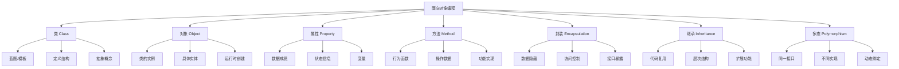

# 类与对象基础

## 🎯 学习目标
- 理解面向对象编程的基本概念
- 掌握PHP中类和对象的定义与使用
- 学会创建和使用对象实例
- 了解面向对象编程的优势和应用场景

## 📚 核心概念

### 面向对象编程概述



### 面向对象 vs 面向过程

| 特性 | 面向过程 | 面向对象 |
|------|----------|----------|
| 编程思想 | 以函数为中心 | 以对象为中心 |
| 数据组织 | 全局变量、参数传递 | 封装在对象中 |
| 代码复用 | 函数调用 | 继承、组合 |
| 维护性 | 函数间耦合度高 | 对象间低耦合 |
| 扩展性 | 修改影响范围大 | 局部修改影响小 |
| 抽象层次 | 较低 | 较高 |
| 适用场景 | 简单程序 | 复杂系统 |

## 🔧 基本语法

### 类的定义
```php
<?php
// 基本类定义
class Person {
    // 属性（成员变量）
    public $name;
    public $age;
    public $email;
    
    // 方法（成员函数）
    public function sayHello() {
        return "Hello, I'm " . $this->name;
    }
    
    public function getAge() {
        return $this->age;
    }
    
    public function setEmail($email) {
        $this->email = $email;
    }
    
    public function getEmail() {
        return $this->email;
    }
}

// 创建对象实例
$person1 = new Person();
$person1->name = "张三";
$person1->age = 25;
$person1->setEmail("zhangsan@example.com");

echo $person1->sayHello() . "\n";
echo "年龄: " . $person1->getAge() . "\n";
echo "邮箱: " . $person1->getEmail() . "\n";

// 创建多个对象
$person2 = new Person();
$person2->name = "李四";
$person2->age = 30;
$person2->setEmail("lisi@example.com");

echo $person2->sayHello() . "\n";
?>
```

### 访问控制
```php
<?php
class AccessControl {
    // 公共属性 - 任何地方都可以访问
    public $publicProperty = "公共属性";
    
    // 受保护属性 - 类和子类可以访问
    protected $protectedProperty = "受保护属性";
    
    // 私有属性 - 只有当前类可以访问
    private $privateProperty = "私有属性";
    
    // 公共方法
    public function publicMethod() {
        return "公共方法";
    }
    
    // 受保护方法
    protected function protectedMethod() {
        return "受保护方法";
    }
    
    // 私有方法
    private function privateMethod() {
        return "私有方法";
    }
    
    // 访问不同级别的属性和方法
    public function testAccess() {
        echo "公共属性: " . $this->publicProperty . "\n";
        echo "受保护属性: " . $this->protectedProperty . "\n";
        echo "私有属性: " . $this->privateProperty . "\n";
        
        echo "公共方法: " . $this->publicMethod() . "\n";
        echo "受保护方法: " . $this->protectedMethod() . "\n";
        echo "私有方法: " . $this->privateMethod() . "\n";
    }
}

// 测试访问控制
$obj = new AccessControl();
echo "外部访问公共属性: " . $obj->publicProperty . "\n";
echo "外部调用公共方法: " . $obj->publicMethod() . "\n";

// 以下代码会报错（注释掉）
// echo $obj->protectedProperty; // 错误
// echo $obj->privateProperty;   // 错误
// echo $obj->protectedMethod(); // 错误
// echo $obj->privateMethod();   // 错误

$obj->testAccess();
?>
```

### 构造函数和析构函数
```php
<?php
class User {
    private $name;
    private $email;
    private $createdAt;
    
    // 构造函数
    public function __construct($name, $email) {
        $this->name = $name;
        $this->email = $email;
        $this->createdAt = date('Y-m-d H:i:s');
        echo "用户对象已创建: $name\n";
    }
    
    // 析构函数
    public function __destruct() {
        echo "用户对象已销毁: " . $this->name . "\n";
    }
    
    // Getter方法
    public function getName() {
        return $this->name;
    }
    
    public function getEmail() {
        return $this->email;
    }
    
    public function getCreatedAt() {
        return $this->createdAt;
    }
    
    // Setter方法
    public function setName($name) {
        $this->name = $name;
    }
    
    public function setEmail($email) {
        $this->email = $email;
    }
    
    // 显示用户信息
    public function displayInfo() {
        echo "姓名: " . $this->name . "\n";
        echo "邮箱: " . $this->email . "\n";
        echo "创建时间: " . $this->createdAt . "\n";
    }
}

// 创建用户对象
$user1 = new User("张三", "zhangsan@example.com");
$user1->displayInfo();

// 修改用户信息
$user1->setName("张三丰");
$user1->setEmail("zhangsanfeng@example.com");
$user1->displayInfo();

// 创建另一个用户对象
$user2 = new User("李四", "lisi@example.com");
$user2->displayInfo();

// 对象会在脚本结束时自动销毁
?>
```

## 🎯 实际应用

### 银行账户类
```php
<?php
class BankAccount {
    private $accountNumber;
    private $balance;
    private $owner;
    private $transactions;
    
    public function __construct($accountNumber, $owner, $initialBalance = 0) {
        $this->accountNumber = $accountNumber;
        $this->owner = $owner;
        $this->balance = $initialBalance;
        $this->transactions = [];
        
        if ($initialBalance > 0) {
            $this->addTransaction('开户', $initialBalance, $this->balance);
        }
    }
    
    // 存款
    public function deposit($amount) {
        if ($amount <= 0) {
            throw new InvalidArgumentException("存款金额必须大于0");
        }
        
        $this->balance += $amount;
        $this->addTransaction('存款', $amount, $this->balance);
        return $this->balance;
    }
    
    // 取款
    public function withdraw($amount) {
        if ($amount <= 0) {
            throw new InvalidArgumentException("取款金额必须大于0");
        }
        
        if ($amount > $this->balance) {
            throw new Exception("余额不足");
        }
        
        $this->balance -= $amount;
        $this->addTransaction('取款', -$amount, $this->balance);
        return $this->balance;
    }
    
    // 转账
    public function transfer($amount, BankAccount $targetAccount) {
        if ($amount <= 0) {
            throw new InvalidArgumentException("转账金额必须大于0");
        }
        
        if ($amount > $this->balance) {
            throw new Exception("余额不足");
        }
        
        $this->balance -= $amount;
        $targetAccount->balance += $amount;
        
        $this->addTransaction('转出', -$amount, $this->balance);
        $targetAccount->addTransaction('转入', $amount, $targetAccount->balance);
        
        return $this->balance;
    }
    
    // 添加交易记录
    private function addTransaction($type, $amount, $balance) {
        $this->transactions[] = [
            'type' => $type,
            'amount' => $amount,
            'balance' => $balance,
            'timestamp' => date('Y-m-d H:i:s')
        ];
    }
    
    // 获取余额
    public function getBalance() {
        return $this->balance;
    }
    
    // 获取账户信息
    public function getAccountInfo() {
        return [
            'accountNumber' => $this->accountNumber,
            'owner' => $this->owner,
            'balance' => $this->balance
        ];
    }
    
    // 获取交易记录
    public function getTransactions() {
        return $this->transactions;
    }
    
    // 显示账户摘要
    public function displaySummary() {
        echo "账户号: " . $this->accountNumber . "\n";
        echo "户主: " . $this->owner . "\n";
        echo "余额: ¥" . number_format($this->balance, 2) . "\n";
        echo "交易次数: " . count($this->transactions) . "\n";
    }
    
    // 显示交易历史
    public function displayTransactions() {
        echo "交易历史:\n";
        echo str_repeat("-", 50) . "\n";
        printf("%-10s %-10s %-15s %-20s\n", "类型", "金额", "余额", "时间");
        echo str_repeat("-", 50) . "\n";
        
        foreach ($this->transactions as $transaction) {
            printf("%-10s %-10s %-15s %-20s\n",
                $transaction['type'],
                ($transaction['amount'] > 0 ? '+' : '') . $transaction['amount'],
                number_format($transaction['balance'], 2),
                $transaction['timestamp']
            );
        }
    }
}

// 使用示例
try {
    // 创建银行账户
    $account1 = new BankAccount("1234567890", "张三", 1000);
    $account2 = new BankAccount("0987654321", "李四", 500);
    
    echo "=== 初始状态 ===\n";
    $account1->displaySummary();
    echo "\n";
    
    // 存款
    $account1->deposit(500);
    echo "存款500后余额: ¥" . $account1->getBalance() . "\n";
    
    // 取款
    $account1->withdraw(200);
    echo "取款200后余额: ¥" . $account1->getBalance() . "\n";
    
    // 转账
    $account1->transfer(300, $account2);
    echo "转账300后余额: ¥" . $account1->getBalance() . "\n";
    
    echo "\n=== 账户1摘要 ===\n";
    $account1->displaySummary();
    
    echo "\n=== 账户2摘要 ===\n";
    $account2->displaySummary();
    
    echo "\n=== 账户1交易历史 ===\n";
    $account1->displayTransactions();
    
} catch (Exception $e) {
    echo "错误: " . $e->getMessage() . "\n";
}
?>
```

### 购物车类
```php
<?php
class Product {
    private $id;
    private $name;
    private $price;
    private $description;
    
    public function __construct($id, $name, $price, $description = '') {
        $this->id = $id;
        $this->name = $name;
        $this->price = $price;
        $this->description = $description;
    }
    
    public function getId() { return $this->id; }
    public function getName() { return $this->name; }
    public function getPrice() { return $this->price; }
    public function getDescription() { return $this->description; }
    
    public function setPrice($price) {
        if ($price < 0) {
            throw new InvalidArgumentException("价格不能为负数");
        }
        $this->price = $price;
    }
}

class CartItem {
    private $product;
    private $quantity;
    
    public function __construct(Product $product, $quantity = 1) {
        $this->product = $product;
        $this->quantity = $quantity;
    }
    
    public function getProduct() { return $this->product; }
    public function getQuantity() { return $this->quantity; }
    
    public function setQuantity($quantity) {
        if ($quantity < 0) {
            throw new InvalidArgumentException("数量不能为负数");
        }
        $this->quantity = $quantity;
    }
    
    public function getTotalPrice() {
        return $this->product->getPrice() * $this->quantity;
    }
    
    public function increaseQuantity($amount = 1) {
        $this->quantity += $amount;
    }
    
    public function decreaseQuantity($amount = 1) {
        $this->quantity = max(0, $this->quantity - $amount);
    }
}

class ShoppingCart {
    private $items;
    private $customerName;
    
    public function __construct($customerName = '') {
        $this->items = [];
        $this->customerName = $customerName;
    }
    
    // 添加商品
    public function addItem(Product $product, $quantity = 1) {
        $productId = $product->getId();
        
        if (isset($this->items[$productId])) {
            $this->items[$productId]->increaseQuantity($quantity);
        } else {
            $this->items[$productId] = new CartItem($product, $quantity);
        }
    }
    
    // 移除商品
    public function removeItem($productId) {
        if (isset($this->items[$productId])) {
            unset($this->items[$productId]);
            return true;
        }
        return false;
    }
    
    // 更新商品数量
    public function updateQuantity($productId, $quantity) {
        if (isset($this->items[$productId])) {
            if ($quantity <= 0) {
                $this->removeItem($productId);
            } else {
                $this->items[$productId]->setQuantity($quantity);
            }
            return true;
        }
        return false;
    }
    
    // 清空购物车
    public function clear() {
        $this->items = [];
    }
    
    // 获取商品数量
    public function getItemCount() {
        return count($this->items);
    }
    
    // 获取总商品数
    public function getTotalQuantity() {
        $total = 0;
        foreach ($this->items as $item) {
            $total += $item->getQuantity();
        }
        return $total;
    }
    
    // 获取总价格
    public function getTotalPrice() {
        $total = 0;
        foreach ($this->items as $item) {
            $total += $item->getTotalPrice();
        }
        return $total;
    }
    
    // 获取所有商品
    public function getItems() {
        return $this->items;
    }
    
    // 显示购物车内容
    public function displayCart() {
        if (empty($this->items)) {
            echo "购物车为空\n";
            return;
        }
        
        echo "=== 购物车内容 ===\n";
        if ($this->customerName) {
            echo "客户: " . $this->customerName . "\n";
        }
        echo str_repeat("-", 60) . "\n";
        printf("%-20s %-10s %-10s %-15s\n", "商品名称", "单价", "数量", "小计");
        echo str_repeat("-", 60) . "\n";
        
        foreach ($this->items as $item) {
            $product = $item->getProduct();
            printf("%-20s %-10s %-10d %-15s\n",
                $product->getName(),
                "¥" . number_format($product->getPrice(), 2),
                $item->getQuantity(),
                "¥" . number_format($item->getTotalPrice(), 2)
            );
        }
        
        echo str_repeat("-", 60) . "\n";
        echo "总商品数: " . $this->getTotalQuantity() . "\n";
        echo "总价格: ¥" . number_format($this->getTotalPrice(), 2) . "\n";
    }
    
    // 应用折扣
    public function applyDiscount($discountPercent) {
        if ($discountPercent < 0 || $discountPercent > 100) {
            throw new InvalidArgumentException("折扣百分比必须在0-100之间");
        }
        
        $discount = $this->getTotalPrice() * ($discountPercent / 100);
        return $this->getTotalPrice() - $discount;
    }
}

// 使用示例
try {
    // 创建商品
    $product1 = new Product(1, "iPhone 15", 7999, "最新款iPhone");
    $product2 = new Product(2, "MacBook Pro", 12999, "专业级笔记本电脑");
    $product3 = new Product(3, "AirPods Pro", 1999, "无线降噪耳机");
    
    // 创建购物车
    $cart = new ShoppingCart("张三");
    
    // 添加商品
    $cart->addItem($product1, 1);
    $cart->addItem($product2, 1);
    $cart->addItem($product3, 2);
    
    // 显示购物车
    $cart->displayCart();
    
    // 更新商品数量
    $cart->updateQuantity(3, 3); // AirPods Pro数量改为3
    
    echo "\n=== 更新数量后 ===\n";
    $cart->displayCart();
    
    // 应用折扣
    $discountedPrice = $cart->applyDiscount(10); // 10%折扣
    echo "\n应用10%折扣后价格: ¥" . number_format($discountedPrice, 2) . "\n";
    
    // 移除商品
    $cart->removeItem(2); // 移除MacBook Pro
    
    echo "\n=== 移除MacBook Pro后 ===\n";
    $cart->displayCart();
    
} catch (Exception $e) {
    echo "错误: " . $e->getMessage() . "\n";
}
?>
```

## 📊 最佳实践

### 类设计原则
```php
<?php
// 1. 单一职责原则 - 每个类只负责一个功能
class User {
    private $name;
    private $email;
    
    public function __construct($name, $email) {
        $this->name = $name;
        $this->email = $email;
    }
    
    public function getName() { return $this->name; }
    public function getEmail() { return $this->email; }
}

class EmailValidator {
    public static function isValid($email) {
        return filter_var($email, FILTER_VALIDATE_EMAIL) !== false;
    }
}

class UserRepository {
    private $users = [];
    
    public function save(User $user) {
        $this->users[] = $user;
    }
    
    public function findByName($name) {
        foreach ($this->users as $user) {
            if ($user->getName() === $name) {
                return $user;
            }
        }
        return null;
    }
}

// 2. 开闭原则 - 对扩展开放，对修改关闭
abstract class Shape {
    abstract public function area();
    abstract public function perimeter();
}

class Rectangle extends Shape {
    private $width;
    private $height;
    
    public function __construct($width, $height) {
        $this->width = $width;
        $this->height = $height;
    }
    
    public function area() {
        return $this->width * $this->height;
    }
    
    public function perimeter() {
        return 2 * ($this->width + $this->height);
    }
}

class Circle extends Shape {
    private $radius;
    
    public function __construct($radius) {
        $this->radius = $radius;
    }
    
    public function area() {
        return pi() * $this->radius * $this->radius;
    }
    
    public function perimeter() {
        return 2 * pi() * $this->radius;
    }
}

// 3. 里氏替换原则 - 子类可以替换父类
class Animal {
    public function makeSound() {
        return "Some sound";
    }
}

class Dog extends Animal {
    public function makeSound() {
        return "Woof!";
    }
}

class Cat extends Animal {
    public function makeSound() {
        return "Meow!";
    }
}

// 4. 接口隔离原则 - 使用多个专门的接口
interface Readable {
    public function read();
}

interface Writable {
    public function write($data);
}

interface Deletable {
    public function delete();
}

class File implements Readable, Writable, Deletable {
    private $filename;
    
    public function __construct($filename) {
        $this->filename = $filename;
    }
    
    public function read() {
        return file_get_contents($this->filename);
    }
    
    public function write($data) {
        return file_put_contents($this->filename, $data);
    }
    
    public function delete() {
        return unlink($this->filename);
    }
}

// 5. 依赖倒置原则 - 依赖抽象而不是具体实现
interface DatabaseInterface {
    public function save($data);
    public function find($id);
}

class MySQLDatabase implements DatabaseInterface {
    public function save($data) {
        // MySQL保存逻辑
        return "Saved to MySQL";
    }
    
    public function find($id) {
        // MySQL查找逻辑
        return "Found in MySQL";
    }
}

class UserService {
    private $database;
    
    public function __construct(DatabaseInterface $database) {
        $this->database = $database;
    }
    
    public function createUser($userData) {
        return $this->database->save($userData);
    }
    
    public function getUser($id) {
        return $this->database->find($id);
    }
}

// 使用示例
$mysql = new MySQLDatabase();
$userService = new UserService($mysql);

echo $userService->createUser(['name' => '张三', 'email' => 'zhangsan@example.com']) . "\n";
echo $userService->getUser(1) . "\n";
?>
```

### 命名规范
```php
<?php
// 类名使用PascalCase
class UserManager {
    // 属性名使用camelCase
    private $userList;
    private $isActive;
    
    // 方法名使用camelCase
    public function addUser() {
        // 方法实现
    }
    
    public function getUserById() {
        // 方法实现
    }
    
    // 常量使用UPPER_SNAKE_CASE
    const MAX_USERS = 100;
    const DEFAULT_STATUS = 'active';
}

// 接口名以Interface结尾
interface UserInterface {
    public function getName();
    public function getEmail();
}

// 抽象类名以Abstract开头
abstract class AbstractUser {
    abstract public function validate();
}

// 异常类名以Exception结尾
class UserNotFoundException extends Exception {
    // 异常实现
}

// 测试类名以Test结尾
class UserManagerTest {
    // 测试方法实现
}
?>
```

## 🎓 学习建议

### 费曼学习法应用
1. **选择概念**: 选择面向对象编程中的核心概念
2. **简化解释**: 用简单语言解释类和对象的关系
3. **识别盲点**: 发现理解不深入的地方
4. **重新学习**: 针对盲点进行深入学习

### 刻意练习重点
1. **概念理解**: 深入理解面向对象的基本概念
2. **实际应用**: 在实际项目中应用面向对象编程
3. **设计模式**: 学习常见的设计模式
4. **最佳实践**: 掌握面向对象编程的最佳实践

## 🔗 相关链接
- [[02-属性与方法|属性与方法]]
- [[03-构造函数与析构函数|构造函数与析构函数]]
- [[04-继承与多态|继承与多态]]
- [[05-封装与访问控制|封装与访问控制]]
- [[06-抽象类与接口|抽象类与接口]]
