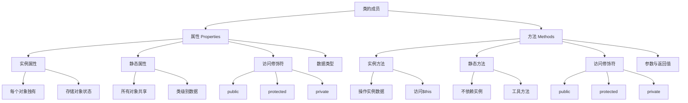

# 属性与方法

## 🎯 学习目标
- 理解PHP中属性和方法的概念
- 掌握属性的定义、访问和修改
- 学会方法的定义、调用和参数传递
- 了解属性和方法的最佳实践

## 📚 核心概念

### 属性与方法概述



### 属性类型对比

| 属性类型 | 访问方式 | 内存分配 | 使用场景 | 示例 |
|----------|----------|----------|----------|------|
| 实例属性 | 对象->属性 | 每个对象独立 | 对象状态数据 | $user->name |
| 静态属性 | 类::属性 | 类级别共享 | 全局配置、计数器 | User::$count |
| 常量属性 | 类::常量 | 编译时确定 | 不变的值 | User::MAX_AGE |

## 🔧 属性详解

### 实例属性
```php
<?php
class Person {
    // 公共属性
    public $name;
    public $age;
    
    // 受保护属性
    protected $email;
    
    // 私有属性
    private $salary;
    
    // 属性初始化
    public $isActive = true;
    public $hobbies = [];
    
    // 构造函数中初始化属性
    public function __construct($name, $age, $email) {
        $this->name = $name;
        $this->age = $age;
        $this->email = $email;
        $this->salary = 0;
    }
    
    // Getter方法
    public function getName() {
        return $this->name;
    }
    
    public function getAge() {
        return $this->age;
    }
    
    public function getEmail() {
        return $this->email;
    }
    
    public function getSalary() {
        return $this->salary;
    }
    
    // Setter方法
    public function setName($name) {
        if (empty($name)) {
            throw new InvalidArgumentException("姓名不能为空");
        }
        $this->name = $name;
    }
    
    public function setAge($age) {
        if ($age < 0 || $age > 150) {
            throw new InvalidArgumentException("年龄必须在0-150之间");
        }
        $this->age = $age;
    }
    
    public function setEmail($email) {
        if (!filter_var($email, FILTER_VALIDATE_EMAIL)) {
            throw new InvalidArgumentException("邮箱格式不正确");
        }
        $this->email = $email;
    }
    
    public function setSalary($salary) {
        if ($salary < 0) {
            throw new InvalidArgumentException("薪资不能为负数");
        }
        $this->salary = $salary;
    }
    
    // 属性操作方法
    public function addHobby($hobby) {
        if (!in_array($hobby, $this->hobbies)) {
            $this->hobbies[] = $hobby;
        }
    }
    
    public function removeHobby($hobby) {
        $key = array_search($hobby, $this->hobbies);
        if ($key !== false) {
            unset($this->hobbies[$key]);
            $this->hobbies = array_values($this->hobbies); // 重新索引
        }
    }
    
    public function getHobbies() {
        return $this->hobbies;
    }
    
    // 属性验证
    public function validate() {
        $errors = [];
        
        if (empty($this->name)) {
            $errors[] = "姓名不能为空";
        }
        
        if ($this->age < 0) {
            $errors[] = "年龄不能为负数";
        }
        
        if (!filter_var($this->email, FILTER_VALIDATE_EMAIL)) {
            $errors[] = "邮箱格式不正确";
        }
        
        return $errors;
    }
    
    // 显示个人信息
    public function displayInfo() {
        echo "姓名: " . $this->name . "\n";
        echo "年龄: " . $this->age . "\n";
        echo "邮箱: " . $this->email . "\n";
        echo "状态: " . ($this->isActive ? "活跃" : "非活跃") . "\n";
        echo "爱好: " . implode(", ", $this->hobbies) . "\n";
    }
}

// 使用示例
try {
    $person = new Person("张三", 25, "zhangsan@example.com");
    
    // 直接访问公共属性
    echo "姓名: " . $person->name . "\n";
    echo "年龄: " . $person->age . "\n";
    
    // 通过方法访问属性
    echo "邮箱: " . $person->getEmail() . "\n";
    echo "薪资: " . $person->getSalary() . "\n";
    
    // 修改属性
    $person->setSalary(8000);
    $person->addHobby("编程");
    $person->addHobby("阅读");
    $person->addHobby("运动");
    
    // 显示信息
    $person->displayInfo();
    
    // 验证属性
    $errors = $person->validate();
    if (empty($errors)) {
        echo "属性验证通过\n";
    } else {
        echo "验证错误: " . implode(", ", $errors) . "\n";
    }
    
} catch (Exception $e) {
    echo "错误: " . $e->getMessage() . "\n";
}
?>
```

### 静态属性
```php
<?php
class Counter {
    // 静态属性
    private static $count = 0;
    private static $instances = [];
    
    // 实例属性
    private $id;
    private $name;
    
    public function __construct($name) {
        $this->name = $name;
        $this->id = ++self::$count;
        self::$instances[] = $this;
    }
    
    // 静态方法访问静态属性
    public static function getCount() {
        return self::$count;
    }
    
    public static function getInstances() {
        return self::$instances;
    }
    
    public static function resetCount() {
        self::$count = 0;
        self::$instances = [];
    }
    
    // 实例方法访问静态属性
    public function getId() {
        return $this->id;
    }
    
    public function getName() {
        return $this->name;
    }
    
    public function getTotalCount() {
        return self::$count;
    }
}

// 使用示例
echo "初始计数: " . Counter::getCount() . "\n";

$counter1 = new Counter("第一个");
$counter2 = new Counter("第二个");
$counter3 = new Counter("第三个");

echo "创建3个对象后计数: " . Counter::getCount() . "\n";

// 通过对象访问静态属性
echo "对象1的ID: " . $counter1->getId() . "\n";
echo "对象1的总计数: " . $counter1->getTotalCount() . "\n";

// 获取所有实例
$instances = Counter::getInstances();
echo "实例数量: " . count($instances) . "\n";

foreach ($instances as $instance) {
    echo "ID: " . $instance->getId() . ", 名称: " . $instance->getName() . "\n";
}

// 重置计数
Counter::resetCount();
echo "重置后计数: " . Counter::getCount() . "\n";
?>
```

### 常量属性
```php
<?php
class MathConstants {
    // 类常量
    const PI = 3.14159265359;
    const E = 2.71828182846;
    const GOLDEN_RATIO = 1.61803398875;
    
    // 公共常量
    public const MAX_INTEGER = PHP_INT_MAX;
    public const MIN_INTEGER = PHP_INT_MIN;
    
    // 私有常量
    private const SECRET_KEY = "my_secret_key";
    
    // 方法中使用常量
    public static function getPi() {
        return self::PI;
    }
    
    public static function getE() {
        return self::E;
    }
    
    public static function getGoldenRatio() {
        return self::GOLDEN_RATIO;
    }
    
    public static function getSecretKey() {
        return self::SECRET_KEY;
    }
    
    // 计算圆的面积
    public static function circleArea($radius) {
        return self::PI * $radius * $radius;
    }
    
    // 计算圆的周长
    public static function circleCircumference($radius) {
        return 2 * self::PI * $radius;
    }
}

// 使用示例
echo "PI值: " . MathConstants::PI . "\n";
echo "E值: " . MathConstants::E . "\n";
echo "黄金比例: " . MathConstants::GOLDEN_RATIO . "\n";

// 通过方法访问常量
echo "PI值(方法): " . MathConstants::getPi() . "\n";
echo "E值(方法): " . MathConstants::getE() . "\n";

// 使用常量进行计算
$radius = 5;
echo "半径为{$radius}的圆面积: " . MathConstants::circleArea($radius) . "\n";
echo "半径为{$radius}的圆周长: " . MathConstants::circleCircumference($radius) . "\n";

// 访问公共常量
echo "最大整数: " . MathConstants::MAX_INTEGER . "\n";
echo "最小整数: " . MathConstants::MIN_INTEGER . "\n";

// 访问私有常量
echo "密钥: " . MathConstants::getSecretKey() . "\n";
?>
```

## 🔧 方法详解

### 实例方法
```php
<?php
class Calculator {
    private $result;
    private $history;
    
    public function __construct() {
        $this->result = 0;
        $this->history = [];
    }
    
    // 基本计算方法
    public function add($number) {
        $oldResult = $this->result;
        $this->result += $number;
        $this->addToHistory("加法", $oldResult, $number, $this->result);
        return $this;
    }
    
    public function subtract($number) {
        $oldResult = $this->result;
        $this->result -= $number;
        $this->addToHistory("减法", $oldResult, $number, $this->result);
        return $this;
    }
    
    public function multiply($number) {
        $oldResult = $this->result;
        $this->result *= $number;
        $this->addToHistory("乘法", $oldResult, $number, $this->result);
        return $this;
    }
    
    public function divide($number) {
        if ($number == 0) {
            throw new InvalidArgumentException("除数不能为零");
        }
        $oldResult = $this->result;
        $this->result /= $number;
        $this->addToHistory("除法", $oldResult, $number, $this->result);
        return $this;
    }
    
    // 高级计算方法
    public function power($exponent) {
        $oldResult = $this->result;
        $this->result = pow($this->result, $exponent);
        $this->addToHistory("幂运算", $oldResult, $exponent, $this->result);
        return $this;
    }
    
    public function squareRoot() {
        if ($this->result < 0) {
            throw new InvalidArgumentException("负数不能开平方根");
        }
        $oldResult = $this->result;
        $this->result = sqrt($this->result);
        $this->addToHistory("开平方根", $oldResult, 0, $this->result);
        return $this;
    }
    
    // 工具方法
    public function clear() {
        $this->result = 0;
        $this->history = [];
        return $this;
    }
    
    public function getResult() {
        return $this->result;
    }
    
    public function getHistory() {
        return $this->history;
    }
    
    // 私有方法
    private function addToHistory($operation, $oldValue, $operand, $newValue) {
        $this->history[] = [
            'operation' => $operation,
            'oldValue' => $oldValue,
            'operand' => $operand,
            'newValue' => $newValue,
            'timestamp' => date('Y-m-d H:i:s')
        ];
    }
    
    // 显示历史记录
    public function displayHistory() {
        if (empty($this->history)) {
            echo "没有计算历史\n";
            return;
        }
        
        echo "计算历史:\n";
        echo str_repeat("-", 60) . "\n";
        printf("%-10s %-10s %-10s %-15s %-20s\n", "操作", "原值", "操作数", "结果", "时间");
        echo str_repeat("-", 60) . "\n";
        
        foreach ($this->history as $record) {
            printf("%-10s %-10.2f %-10.2f %-15.2f %-20s\n",
                $record['operation'],
                $record['oldValue'],
                $record['operand'],
                $record['newValue'],
                $record['timestamp']
            );
        }
    }
    
    // 方法链式调用
    public function setValue($value) {
        $this->result = $value;
        return $this;
    }
}

// 使用示例
try {
    $calc = new Calculator();
    
    // 链式调用
    $result = $calc->setValue(10)
                   ->add(5)
                   ->multiply(2)
                   ->subtract(3)
                   ->getResult();
    
    echo "计算结果: $result\n";
    
    // 显示历史
    $calc->displayHistory();
    
    // 高级计算
    $calc->clear()
         ->setValue(16)
         ->squareRoot()
         ->power(3)
         ->getResult();
    
    echo "高级计算结果: " . $calc->getResult() . "\n";
    
} catch (Exception $e) {
    echo "错误: " . $e->getMessage() . "\n";
}
?>
```

### 静态方法
```php
<?php
class StringUtils {
    // 静态方法 - 字符串工具
    public static function capitalize($str) {
        return ucfirst(strtolower($str));
    }
    
    public static function reverse($str) {
        return strrev($str);
    }
    
    public static function isPalindrome($str) {
        $cleaned = strtolower(preg_replace('/[^a-zA-Z0-9]/', '', $str));
        return $cleaned === strrev($cleaned);
    }
    
    public static function countWords($str) {
        return str_word_count($str);
    }
    
    public static function truncate($str, $length, $suffix = '...') {
        if (strlen($str) <= $length) {
            return $str;
        }
        return substr($str, 0, $length) . $suffix;
    }
    
    // 静态方法 - 数组工具
    public static function arrayToCsv($array, $delimiter = ',') {
        $output = fopen('php://temp', 'r+');
        foreach ($array as $row) {
            fputcsv($output, $row, $delimiter);
        }
        rewind($output);
        $csv = stream_get_contents($output);
        fclose($output);
        return $csv;
    }
    
    public static function csvToArray($csv, $delimiter = ',') {
        $lines = explode("\n", $csv);
        $array = [];
        foreach ($lines as $line) {
            if (!empty(trim($line))) {
                $array[] = str_getcsv($line, $delimiter);
            }
        }
        return $array;
    }
    
    // 静态方法 - 数学工具
    public static function factorial($n) {
        if ($n < 0) {
            throw new InvalidArgumentException("阶乘不能计算负数");
        }
        if ($n <= 1) {
            return 1;
        }
        return $n * self::factorial($n - 1);
    }
    
    public static function fibonacci($n) {
        if ($n < 0) {
            throw new InvalidArgumentException("斐波那契数列不能计算负数");
        }
        if ($n <= 1) {
            return $n;
        }
        return self::fibonacci($n - 1) + self::fibonacci($n - 2);
    }
    
    public static function isPrime($n) {
        if ($n < 2) {
            return false;
        }
        for ($i = 2; $i <= sqrt($n); $i++) {
            if ($n % $i === 0) {
                return false;
            }
        }
        return true;
    }
    
    // 静态方法 - 日期工具
    public static function formatDate($date, $format = 'Y-m-d H:i:s') {
        if (is_string($date)) {
            $date = new DateTime($date);
        }
        return $date->format($format);
    }
    
    public static function daysBetween($date1, $date2) {
        if (is_string($date1)) {
            $date1 = new DateTime($date1);
        }
        if (is_string($date2)) {
            $date2 = new DateTime($date2);
        }
        return $date1->diff($date2)->days;
    }
    
    // 静态方法 - 文件工具
    public static function getFileExtension($filename) {
        return pathinfo($filename, PATHINFO_EXTENSION);
    }
    
    public static function getFileSize($filename) {
        if (!file_exists($filename)) {
            throw new InvalidArgumentException("文件不存在: $filename");
        }
        return filesize($filename);
    }
    
    public static function formatFileSize($bytes) {
        $units = ['B', 'KB', 'MB', 'GB', 'TB'];
        $bytes = max($bytes, 0);
        $pow = floor(($bytes ? log($bytes) : 0) / log(1024));
        $pow = min($pow, count($units) - 1);
        $bytes /= pow(1024, $pow);
        return round($bytes, 2) . ' ' . $units[$pow];
    }
}

// 使用示例
// 字符串工具
echo "首字母大写: " . StringUtils::capitalize("hello world") . "\n";
echo "反转字符串: " . StringUtils::reverse("Hello") . "\n";
echo "回文检查: " . (StringUtils::isPalindrome("A man a plan a canal Panama") ? "是" : "否") . "\n";
echo "单词计数: " . StringUtils::countWords("Hello world from PHP") . "\n";
echo "截断字符串: " . StringUtils::truncate("这是一个很长的字符串", 10) . "\n";

// 数学工具
echo "5的阶乘: " . StringUtils::factorial(5) . "\n";
echo "斐波那契数列第10项: " . StringUtils::fibonacci(10) . "\n";
echo "17是质数: " . (StringUtils::isPrime(17) ? "是" : "否") . "\n";

// 日期工具
echo "当前日期: " . StringUtils::formatDate(new DateTime()) . "\n";
echo "日期差: " . StringUtils::daysBetween('2024-01-01', '2024-12-31') . " 天\n";

// 文件工具
echo "文件扩展名: " . StringUtils::getFileExtension("document.pdf") . "\n";
echo "格式化文件大小: " . StringUtils::formatFileSize(1024 * 1024) . "\n";
?>
```

### 方法重载
```php
<?php
class MathOperations {
    // 方法重载 - 使用可变参数
    public function add(...$numbers) {
        return array_sum($numbers);
    }
    
    public function multiply(...$numbers) {
        $result = 1;
        foreach ($numbers as $number) {
            $result *= $number;
        }
        return $result;
    }
    
    // 方法重载 - 使用默认参数
    public function power($base, $exponent = 2) {
        return pow($base, $exponent);
    }
    
    public function divide($dividend, $divisor = 1) {
        if ($divisor == 0) {
            throw new InvalidArgumentException("除数不能为零");
        }
        return $dividend / $divisor;
    }
    
    // 方法重载 - 使用类型提示
    public function process($data) {
        if (is_string($data)) {
            return $this->processString($data);
        } elseif (is_array($data)) {
            return $this->processArray($data);
        } elseif (is_numeric($data)) {
            return $this->processNumber($data);
        } else {
            throw new InvalidArgumentException("不支持的数据类型");
        }
    }
    
    private function processString($str) {
        return "处理字符串: " . strtoupper($str);
    }
    
    private function processArray($arr) {
        return "处理数组: " . count($arr) . " 个元素";
    }
    
    private function processNumber($num) {
        return "处理数字: " . ($num * 2);
    }
    
    // 方法重载 - 使用魔术方法
    public function __call($method, $args) {
        if (strpos($method, 'calculate') === 0) {
            $operation = substr($method, 9); // 移除 'calculate' 前缀
            return $this->performCalculation($operation, $args);
        }
        
        throw new BadMethodCallException("方法 $method 不存在");
    }
    
    private function performCalculation($operation, $args) {
        switch ($operation) {
            case 'Sum':
                return array_sum($args);
            case 'Product':
                $result = 1;
                foreach ($args as $arg) {
                    $result *= $arg;
                }
                return $result;
            case 'Average':
                return array_sum($args) / count($args);
            default:
                throw new InvalidArgumentException("不支持的操作: $operation");
        }
    }
}

// 使用示例
$math = new MathOperations();

// 可变参数
echo "加法: " . $math->add(1, 2, 3, 4, 5) . "\n";
echo "乘法: " . $math->multiply(2, 3, 4) . "\n";

// 默认参数
echo "平方: " . $math->power(5) . "\n";
echo "立方: " . $math->power(5, 3) . "\n";
echo "除法: " . $math->divide(10, 2) . "\n";

// 类型重载
echo $math->process("hello") . "\n";
echo $math->process([1, 2, 3]) . "\n";
echo $math->process(42) . "\n";

// 魔术方法重载
echo "计算和: " . $math->calculateSum(1, 2, 3, 4) . "\n";
echo "计算积: " . $math->calculateProduct(2, 3, 4) . "\n";
echo "计算平均值: " . $math->calculateAverage(10, 20, 30) . "\n";
?>
```

## 🎯 实际应用

### 用户管理系统
```php
<?php
class User {
    private $id;
    private $username;
    private $email;
    private $password;
    private $createdAt;
    private $lastLogin;
    private $isActive;
    private $profile;
    
    public function __construct($username, $email, $password) {
        $this->id = uniqid();
        $this->username = $username;
        $this->email = $email;
        $this->password = password_hash($password, PASSWORD_DEFAULT);
        $this->createdAt = new DateTime();
        $this->lastLogin = null;
        $this->isActive = true;
        $this->profile = [];
    }
    
    // 属性访问方法
    public function getId() { return $this->id; }
    public function getUsername() { return $this->username; }
    public function getEmail() { return $this->email; }
    public function getCreatedAt() { return $this->createdAt; }
    public function getLastLogin() { return $this->lastLogin; }
    public function isActive() { return $this->isActive; }
    
    // 密码相关方法
    public function verifyPassword($password) {
        return password_verify($password, $this->password);
    }
    
    public function changePassword($oldPassword, $newPassword) {
        if (!$this->verifyPassword($oldPassword)) {
            throw new InvalidArgumentException("原密码不正确");
        }
        
        if (strlen($newPassword) < 6) {
            throw new InvalidArgumentException("新密码长度不能少于6位");
        }
        
        $this->password = password_hash($newPassword, PASSWORD_DEFAULT);
        return true;
    }
    
    // 登录相关方法
    public function login($password) {
        if (!$this->verifyPassword($password)) {
            throw new InvalidArgumentException("密码不正确");
        }
        
        if (!$this->isActive) {
            throw new Exception("账户已被禁用");
        }
        
        $this->lastLogin = new DateTime();
        return true;
    }
    
    public function logout() {
        $this->lastLogin = null;
        return true;
    }
    
    // 账户状态方法
    public function activate() {
        $this->isActive = true;
    }
    
    public function deactivate() {
        $this->isActive = false;
    }
    
    // 个人资料方法
    public function setProfile($key, $value) {
        $this->profile[$key] = $value;
    }
    
    public function getProfile($key = null) {
        if ($key === null) {
            return $this->profile;
        }
        return $this->profile[$key] ?? null;
    }
    
    public function removeProfile($key) {
        unset($this->profile[$key]);
    }
    
    // 验证方法
    public function validate() {
        $errors = [];
        
        if (empty($this->username)) {
            $errors[] = "用户名不能为空";
        }
        
        if (!filter_var($this->email, FILTER_VALIDATE_EMAIL)) {
            $errors[] = "邮箱格式不正确";
        }
        
        if (strlen($this->username) < 3) {
            $errors[] = "用户名长度不能少于3位";
        }
        
        return $errors;
    }
    
    // 显示用户信息
    public function displayInfo() {
        echo "用户ID: " . $this->id . "\n";
        echo "用户名: " . $this->username . "\n";
        echo "邮箱: " . $this->email . "\n";
        echo "创建时间: " . $this->createdAt->format('Y-m-d H:i:s') . "\n";
        echo "最后登录: " . ($this->lastLogin ? $this->lastLogin->format('Y-m-d H:i:s') : '从未登录') . "\n";
        echo "状态: " . ($this->isActive ? '活跃' : '禁用') . "\n";
        
        if (!empty($this->profile)) {
            echo "个人资料:\n";
            foreach ($this->profile as $key => $value) {
                echo "  $key: $value\n";
            }
        }
    }
    
    // 转换为数组
    public function toArray() {
        return [
            'id' => $this->id,
            'username' => $this->username,
            'email' => $this->email,
            'createdAt' => $this->createdAt->format('Y-m-d H:i:s'),
            'lastLogin' => $this->lastLogin ? $this->lastLogin->format('Y-m-d H:i:s') : null,
            'isActive' => $this->isActive,
            'profile' => $this->profile
        ];
    }
}

// 使用示例
try {
    // 创建用户
    $user = new User("zhangsan", "zhangsan@example.com", "password123");
    
    // 设置个人资料
    $user->setProfile('firstName', '张三');
    $user->setProfile('lastName', '李');
    $user->setProfile('age', 25);
    $user->setProfile('city', '北京');
    
    // 显示用户信息
    $user->displayInfo();
    
    // 验证用户
    $errors = $user->validate();
    if (empty($errors)) {
        echo "用户验证通过\n";
    } else {
        echo "验证错误: " . implode(", ", $errors) . "\n";
    }
    
    // 登录测试
    $user->login("password123");
    echo "登录成功\n";
    
    // 修改密码
    $user->changePassword("password123", "newpassword456");
    echo "密码修改成功\n";
    
    // 转换为数组
    $userArray = $user->toArray();
    echo "用户数组: " . json_encode($userArray, JSON_UNESCAPED_UNICODE) . "\n";
    
} catch (Exception $e) {
    echo "错误: " . $e->getMessage() . "\n";
}
?>
```

## 📊 最佳实践

### 属性设计原则
```php
<?php
// 1. 使用私有属性，提供公共访问方法
class GoodDesign {
    private $name;
    private $age;
    
    public function getName() { return $this->name; }
    public function setName($name) { 
        if (empty($name)) {
            throw new InvalidArgumentException("姓名不能为空");
        }
        $this->name = $name; 
    }
    
    public function getAge() { return $this->age; }
    public function setAge($age) { 
        if ($age < 0 || $age > 150) {
            throw new InvalidArgumentException("年龄必须在0-150之间");
        }
        $this->age = $age; 
    }
}

// 2. 使用静态属性存储类级别的数据
class Configuration {
    private static $settings = [];
    
    public static function set($key, $value) {
        self::$settings[$key] = $value;
    }
    
    public static function get($key, $default = null) {
        return self::$settings[$key] ?? $default;
    }
    
    public static function getAll() {
        return self::$settings;
    }
}

// 3. 使用常量定义不变的值
class DatabaseConfig {
    const HOST = 'localhost';
    const PORT = 3306;
    const CHARSET = 'utf8mb4';
    
    public static function getDsn($database) {
        return "mysql:host=" . self::HOST . ";port=" . self::PORT . ";dbname=$database;charset=" . self::CHARSET;
    }
}
?>
```

### 方法设计原则
```php
<?php
// 1. 方法应该单一职责
class UserService {
    public function createUser($userData) {
        // 只负责创建用户
        $user = new User($userData['username'], $userData['email'], $userData['password']);
        return $user;
    }
    
    public function validateUser($user) {
        // 只负责验证用户
        return $user->validate();
    }
    
    public function saveUser($user) {
        // 只负责保存用户
        // 数据库保存逻辑
        return true;
    }
}

// 2. 使用静态方法处理工具功能
class FileUtils {
    public static function readFile($filename) {
        if (!file_exists($filename)) {
            throw new FileNotFoundException("文件不存在: $filename");
        }
        return file_get_contents($filename);
    }
    
    public static function writeFile($filename, $content) {
        return file_put_contents($filename, $content);
    }
    
    public static function deleteFile($filename) {
        if (file_exists($filename)) {
            return unlink($filename);
        }
        return false;
    }
}

// 3. 使用方法链提高可读性
class QueryBuilder {
    private $query = '';
    private $table = '';
    private $conditions = [];
    
    public function select($columns = '*') {
        $this->query = "SELECT $columns";
        return $this;
    }
    
    public function from($table) {
        $this->table = $table;
        $this->query .= " FROM $table";
        return $this;
    }
    
    public function where($condition) {
        $this->conditions[] = $condition;
        return $this;
    }
    
    public function build() {
        if (!empty($this->conditions)) {
            $this->query .= " WHERE " . implode(' AND ', $this->conditions);
        }
        return $this->query;
    }
}

// 使用示例
$query = (new QueryBuilder())
    ->select('id, name, email')
    ->from('users')
    ->where('age > 18')
    ->where('status = "active"')
    ->build();

echo "SQL查询: $query\n";
?>
```

## 🎓 学习建议

### 费曼学习法应用
1. **选择概念**: 选择属性和方法中的核心概念
2. **简化解释**: 用简单语言解释属性和方法的作用
3. **识别盲点**: 发现理解不深入的地方
4. **重新学习**: 针对盲点进行深入学习

### 刻意练习重点
1. **概念理解**: 深入理解属性和方法的概念
2. **实际应用**: 在实际项目中应用属性和方法
3. **设计原则**: 学习属性和方法的设计原则
4. **最佳实践**: 掌握属性和方法的最佳实践

## 🔗 相关链接
- [[01-类与对象基础|类与对象基础]]
- [[03-构造函数与析构函数|构造函数与析构函数]]
- [[04-继承与多态|继承与多态]]
- [[05-封装与访问控制|封装与访问控制]]
- [[06-抽象类与接口|抽象类与接口]]
