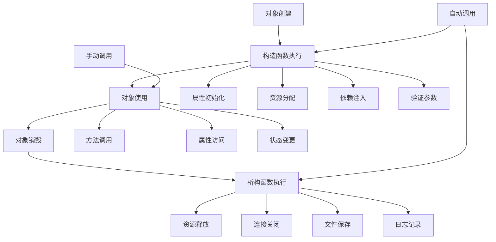

# 构造函数与析构函数

## 🎯 学习目标
- 理解构造函数和析构函数的作用和生命周期
- 掌握PHP中构造函数和析构函数的定义与使用
- 学会在构造函数中进行对象初始化
- 了解析构函数中的资源清理和最佳实践

## 📚 核心概念

### 对象生命周期



### 构造函数与析构函数对比

| 特性 | 构造函数 | 析构函数 |
|------|----------|----------|
| 调用时机 | 对象创建时 | 对象销毁时 |
| 调用方式 | 自动调用 | 自动调用 |
| 参数 | 可以接受参数 | 不接受参数 |
| 返回值 | 无返回值 | 无返回值 |
| 访问修饰符 | 通常为public | 通常为public |
| 主要作用 | 初始化对象 | 清理资源 |
| 调用顺序 | 子类构造函数调用父类 | 子类析构函数先执行 |

## 🔧 构造函数详解

### 基本构造函数
```php
<?php
class Person {
    private $name;
    private $age;
    private $email;
    private $createdAt;
    
    // 基本构造函数
    public function __construct($name, $age, $email) {
        $this->name = $name;
        $this->age = $age;
        $this->email = $email;
        $this->createdAt = new DateTime();
        
        echo "Person对象已创建: $name\n";
    }
    
    // Getter方法
    public function getName() { return $this->name; }
    public function getAge() { return $this->age; }
    public function getEmail() { return $this->email; }
    public function getCreatedAt() { return $this->createdAt; }
    
    // 显示信息
    public function displayInfo() {
        echo "姓名: " . $this->name . "\n";
        echo "年龄: " . $this->age . "\n";
        echo "邮箱: " . $this->email . "\n";
        echo "创建时间: " . $this->createdAt->format('Y-m-d H:i:s') . "\n";
    }
}

// 使用示例
$person1 = new Person("张三", 25, "zhangsan@example.com");
$person1->displayInfo();

$person2 = new Person("李四", 30, "lisi@example.com");
$person2->displayInfo();
?>
```

### 构造函数重载
```php
<?php
class User {
    private $id;
    private $username;
    private $email;
    private $password;
    private $profile;
    private $createdAt;
    
    // 主构造函数
    public function __construct($username, $email, $password = null) {
        $this->id = uniqid();
        $this->username = $username;
        $this->email = $email;
        $this->password = $password ? password_hash($password, PASSWORD_DEFAULT) : null;
        $this->profile = [];
        $this->createdAt = new DateTime();
        
        echo "用户对象已创建: $username\n";
    }
    
    // 静态工厂方法 - 创建管理员用户
    public static function createAdmin($username, $email, $password) {
        $user = new self($username, $email, $password);
        $user->profile['role'] = 'admin';
        $user->profile['permissions'] = ['read', 'write', 'delete', 'admin'];
        return $user;
    }
    
    // 静态工厂方法 - 创建普通用户
    public static function createUser($username, $email, $password) {
        $user = new self($username, $email, $password);
        $user->profile['role'] = 'user';
        $user->profile['permissions'] = ['read', 'write'];
        return $user;
    }
    
    // 静态工厂方法 - 从数组创建
    public static function fromArray($data) {
        $user = new self($data['username'], $data['email'], $data['password'] ?? null);
        
        if (isset($data['profile'])) {
            $user->profile = array_merge($user->profile, $data['profile']);
        }
        
        return $user;
    }
    
    // 静态工厂方法 - 创建访客用户
    public static function createGuest() {
        $user = new self('guest_' . uniqid(), 'guest@example.com');
        $user->profile['role'] = 'guest';
        $user->profile['permissions'] = ['read'];
        return $user;
    }
    
    // Getter方法
    public function getId() { return $this->id; }
    public function getUsername() { return $this->username; }
    public function getEmail() { return $this->email; }
    public function getProfile() { return $this->profile; }
    public function getCreatedAt() { return $this->createdAt; }
    
    // 显示用户信息
    public function displayInfo() {
        echo "用户ID: " . $this->id . "\n";
        echo "用户名: " . $this->username . "\n";
        echo "邮箱: " . $this->email . "\n";
        echo "角色: " . ($this->profile['role'] ?? '未设置') . "\n";
        echo "权限: " . implode(', ', $this->profile['permissions'] ?? []) . "\n";
        echo "创建时间: " . $this->createdAt->format('Y-m-d H:i:s') . "\n";
    }
}

// 使用示例
echo "=== 创建普通用户 ===\n";
$user1 = User::createUser("zhangsan", "zhangsan@example.com", "password123");
$user1->displayInfo();

echo "\n=== 创建管理员用户 ===\n";
$admin = User::createAdmin("admin", "admin@example.com", "admin123");
$admin->displayInfo();

echo "\n=== 从数组创建用户 ===\n";
$userData = [
    'username' => 'wangwu',
    'email' => 'wangwu@example.com',
    'password' => 'password456',
    'profile' => [
        'role' => 'moderator',
        'permissions' => ['read', 'write', 'moderate']
    ]
];
$user2 = User::fromArray($userData);
$user2->displayInfo();

echo "\n=== 创建访客用户 ===\n";
$guest = User::createGuest();
$guest->displayInfo();
?>
```

### 构造函数中的验证和初始化
```php
<?php
class BankAccount {
    private $accountNumber;
    private $owner;
    private $balance;
    private $transactions;
    private $isActive;
    private $createdAt;
    
    public function __construct($accountNumber, $owner, $initialBalance = 0) {
        // 参数验证
        $this->validateAccountNumber($accountNumber);
        $this->validateOwner($owner);
        $this->validateBalance($initialBalance);
        
        // 属性初始化
        $this->accountNumber = $accountNumber;
        $this->owner = $owner;
        $this->balance = $initialBalance;
        $this->transactions = [];
        $this->isActive = true;
        $this->createdAt = new DateTime();
        
        // 记录初始交易
        if ($initialBalance > 0) {
            $this->addTransaction('开户', $initialBalance, $this->balance);
        }
        
        echo "银行账户已创建: $accountNumber (户主: $owner)\n";
    }
    
    // 验证账户号
    private function validateAccountNumber($accountNumber) {
        if (empty($accountNumber)) {
            throw new InvalidArgumentException("账户号不能为空");
        }
        
        if (!preg_match('/^\d{10,20}$/', $accountNumber)) {
            throw new InvalidArgumentException("账户号必须是10-20位数字");
        }
    }
    
    // 验证户主
    private function validateOwner($owner) {
        if (empty($owner)) {
            throw new InvalidArgumentException("户主姓名不能为空");
        }
        
        if (strlen($owner) < 2) {
            throw new InvalidArgumentException("户主姓名长度不能少于2位");
        }
    }
    
    // 验证余额
    private function validateBalance($balance) {
        if (!is_numeric($balance)) {
            throw new InvalidArgumentException("余额必须是数字");
        }
        
        if ($balance < 0) {
            throw new InvalidArgumentException("初始余额不能为负数");
        }
    }
    
    // 添加交易记录
    private function addTransaction($type, $amount, $balance) {
        $this->transactions[] = [
            'type' => $type,
            'amount' => $amount,
            'balance' => $balance,
            'timestamp' => new DateTime()
        ];
    }
    
    // 存款
    public function deposit($amount) {
        if (!$this->isActive) {
            throw new Exception("账户已被冻结");
        }
        
        if ($amount <= 0) {
            throw new InvalidArgumentException("存款金额必须大于0");
        }
        
        $this->balance += $amount;
        $this->addTransaction('存款', $amount, $this->balance);
        return $this->balance;
    }
    
    // 取款
    public function withdraw($amount) {
        if (!$this->isActive) {
            throw new Exception("账户已被冻结");
        }
        
        if ($amount <= 0) {
            throw new InvalidArgumentException("取款金额必须大于0");
        }
        
        if ($amount > $this->balance) {
            throw new Exception("余额不足");
        }
        
        $this->balance -= $amount;
        $this->addTransaction('取款', -$amount, $this->balance);
        return $this->balance;
    }
    
    // Getter方法
    public function getAccountNumber() { return $this->accountNumber; }
    public function getOwner() { return $this->owner; }
    public function getBalance() { return $this->balance; }
    public function getTransactions() { return $this->transactions; }
    public function isActive() { return $this->isActive; }
    public function getCreatedAt() { return $this->createdAt; }
    
    // 显示账户信息
    public function displayInfo() {
        echo "账户号: " . $this->accountNumber . "\n";
        echo "户主: " . $this->owner . "\n";
        echo "余额: ¥" . number_format($this->balance, 2) . "\n";
        echo "状态: " . ($this->isActive ? "正常" : "冻结") . "\n";
        echo "创建时间: " . $this->createdAt->format('Y-m-d H:i:s') . "\n";
        echo "交易次数: " . count($this->transactions) . "\n";
    }
}

// 使用示例
try {
    // 创建银行账户
    $account1 = new BankAccount("1234567890", "张三", 1000);
    $account1->displayInfo();
    
    // 存款
    $account1->deposit(500);
    echo "存款后余额: ¥" . $account1->getBalance() . "\n";
    
    // 取款
    $account1->withdraw(200);
    echo "取款后余额: ¥" . $account1->getBalance() . "\n";
    
} catch (Exception $e) {
    echo "错误: " . $e->getMessage() . "\n";
}
?>
```

## 🔧 析构函数详解

### 基本析构函数
```php
<?php
class ResourceManager {
    private $filename;
    private $handle;
    private $data;
    private $isModified;
    
    public function __construct($filename) {
        $this->filename = $filename;
        $this->handle = fopen($filename, 'a+');
        $this->data = [];
        $this->isModified = false;
        
        if (!$this->handle) {
            throw new Exception("无法打开文件: $filename");
        }
        
        echo "ResourceManager对象已创建，文件: $filename\n";
    }
    
    // 析构函数
    public function __destruct() {
        echo "ResourceManager对象正在销毁，文件: " . $this->filename . "\n";
        
        // 保存数据
        if ($this->isModified) {
            $this->saveData();
        }
        
        // 关闭文件句柄
        if ($this->handle) {
            fclose($this->handle);
            echo "文件句柄已关闭\n";
        }
        
        // 清理其他资源
        $this->data = null;
        echo "资源清理完成\n";
    }
    
    // 添加数据
    public function addData($key, $value) {
        $this->data[$key] = $value;
        $this->isModified = true;
    }
    
    // 获取数据
    public function getData($key) {
        return $this->data[$key] ?? null;
    }
    
    // 保存数据
    private function saveData() {
        if ($this->handle) {
            fseek($this->handle, 0, SEEK_END);
            fwrite($this->handle, json_encode($this->data) . "\n");
            fflush($this->handle);
            echo "数据已保存到文件\n";
        }
    }
    
    // 手动保存
    public function save() {
        $this->saveData();
        $this->isModified = false;
    }
    
    // 显示数据
    public function displayData() {
        echo "当前数据:\n";
        foreach ($this->data as $key => $value) {
            echo "  $key: $value\n";
        }
    }
}

// 使用示例
try {
    $resource = new ResourceManager('test.txt');
    
    $resource->addData('name', '张三');
    $resource->addData('age', 25);
    $resource->addData('city', '北京');
    
    $resource->displayData();
    
    // 手动保存
    $resource->save();
    
    // 对象会在脚本结束时自动销毁
    echo "脚本即将结束，对象将被自动销毁\n";
    
} catch (Exception $e) {
    echo "错误: " . $e->getMessage() . "\n";
}
?>
```

### 析构函数中的资源清理
```php
<?php
class DatabaseConnection {
    private $host;
    private $database;
    private $username;
    private $password;
    private $connection;
    private $isConnected;
    private $queryCount;
    private $startTime;
    
    public function __construct($host, $database, $username, $password) {
        $this->host = $host;
        $this->database = $database;
        $this->username = $username;
        $this->password = $password;
        $this->connection = null;
        $this->isConnected = false;
        $this->queryCount = 0;
        $this->startTime = microtime(true);
        
        $this->connect();
        echo "数据库连接已建立: $host/$database\n";
    }
    
    // 析构函数
    public function __destruct() {
        echo "数据库连接正在关闭...\n";
        
        // 记录连接统计信息
        $duration = microtime(true) - $this->startTime;
        echo "连接持续时间: " . round($duration, 2) . " 秒\n";
        echo "执行查询次数: " . $this->queryCount . "\n";
        
        // 关闭连接
        if ($this->isConnected && $this->connection) {
            $this->disconnect();
        }
        
        // 清理资源
        $this->connection = null;
        $this->isConnected = false;
        
        echo "数据库连接已关闭\n";
    }
    
    // 连接数据库
    private function connect() {
        try {
            $dsn = "mysql:host={$this->host};dbname={$this->database};charset=utf8mb4";
            $this->connection = new PDO($dsn, $this->username, $this->password, [
                PDO::ATTR_ERRMODE => PDO::ERRMODE_EXCEPTION,
                PDO::ATTR_DEFAULT_FETCH_MODE => PDO::FETCH_ASSOC
            ]);
            $this->isConnected = true;
        } catch (PDOException $e) {
            echo "数据库连接失败: " . $e->getMessage() . "\n";
            $this->isConnected = false;
        }
    }
    
    // 断开连接
    private function disconnect() {
        if ($this->connection) {
            $this->connection = null;
            $this->isConnected = false;
        }
    }
    
    // 执行查询
    public function query($sql, $params = []) {
        if (!$this->isConnected) {
            throw new Exception("数据库未连接");
        }
        
        try {
            $stmt = $this->connection->prepare($sql);
            $stmt->execute($params);
            $this->queryCount++;
            return $stmt;
        } catch (PDOException $e) {
            echo "查询执行失败: " . $e->getMessage() . "\n";
            throw $e;
        }
    }
    
    // 获取连接状态
    public function isConnected() {
        return $this->isConnected;
    }
    
    // 获取查询计数
    public function getQueryCount() {
        return $this->queryCount;
    }
    
    // 手动关闭连接
    public function close() {
        $this->__destruct();
    }
}

// 使用示例
try {
    // 创建数据库连接
    $db = new DatabaseConnection('localhost', 'test', 'root', 'password');
    
    if ($db->isConnected()) {
        echo "数据库连接成功\n";
        
        // 执行一些查询
        $db->query("SELECT 1");
        $db->query("SELECT 2");
        $db->query("SELECT 3");
        
        echo "已执行查询次数: " . $db->getQueryCount() . "\n";
    }
    
    // 对象会在脚本结束时自动销毁
    echo "脚本即将结束，数据库连接将被自动关闭\n";
    
} catch (Exception $e) {
    echo "错误: " . $e->getMessage() . "\n";
}
?>
```

### 析构函数中的日志记录
```php
<?php
class Logger {
    private $logFile;
    private $handle;
    private $logs;
    private $isEnabled;
    private $startTime;
    
    public function __construct($logFile = 'app.log') {
        $this->logFile = $logFile;
        $this->handle = null;
        $this->logs = [];
        $this->isEnabled = true;
        $this->startTime = microtime(true);
        
        // 打开日志文件
        $this->handle = fopen($this->logFile, 'a');
        if (!$this->handle) {
            $this->isEnabled = false;
            echo "无法打开日志文件: $logFile\n";
        } else {
            echo "日志记录器已启动: $logFile\n";
        }
    }
    
    // 析构函数
    public function __destruct() {
        echo "日志记录器正在关闭...\n";
        
        // 记录会话统计信息
        $duration = microtime(true) - $this->startTime;
        $this->log("INFO", "会话结束", [
            'duration' => round($duration, 2) . 's',
            'total_logs' => count($this->logs)
        ]);
        
        // 写入所有日志
        if ($this->isEnabled && $this->handle) {
            foreach ($this->logs as $log) {
                fwrite($this->handle, $log . "\n");
            }
            fflush($this->handle);
            fclose($this->handle);
            echo "日志已写入文件: " . $this->logFile . "\n";
        }
        
        // 清理资源
        $this->handle = null;
        $this->logs = null;
        $this->isEnabled = false;
        
        echo "日志记录器已关闭\n";
    }
    
    // 记录日志
    public function log($level, $message, $context = []) {
        if (!$this->isEnabled) {
            return;
        }
        
        $timestamp = date('Y-m-d H:i:s');
        $contextStr = !empty($context) ? ' ' . json_encode($context) : '';
        $logEntry = "[$timestamp] [$level] $message$contextStr";
        
        $this->logs[] = $logEntry;
        
        // 实时输出到控制台
        echo $logEntry . "\n";
    }
    
    // 不同级别的日志方法
    public function info($message, $context = []) {
        $this->log('INFO', $message, $context);
    }
    
    public function warning($message, $context = []) {
        $this->log('WARNING', $message, $context);
    }
    
    public function error($message, $context = []) {
        $this->log('ERROR', $message, $context);
    }
    
    public function debug($message, $context = []) {
        $this->log('DEBUG', $message, $context);
    }
    
    // 手动刷新日志
    public function flush() {
        if ($this->isEnabled && $this->handle) {
            foreach ($this->logs as $log) {
                fwrite($this->handle, $log . "\n");
            }
            fflush($this->handle);
            $this->logs = [];
        }
    }
    
    // 获取日志数量
    public function getLogCount() {
        return count($this->logs);
    }
}

// 使用示例
try {
    // 创建日志记录器
    $logger = new Logger('test.log');
    
    // 记录各种级别的日志
    $logger->info('应用程序启动');
    $logger->info('用户登录', ['user_id' => 123, 'username' => 'zhangsan']);
    $logger->warning('内存使用率较高', ['memory_usage' => '85%']);
    $logger->error('数据库连接失败', ['error_code' => 500, 'retry_count' => 3]);
    $logger->debug('调试信息', ['variable' => 'test_value']);
    
    echo "已记录日志数量: " . $logger->getLogCount() . "\n";
    
    // 手动刷新日志
    $logger->flush();
    
    // 对象会在脚本结束时自动销毁
    echo "脚本即将结束，日志记录器将被自动关闭\n";
    
} catch (Exception $e) {
    echo "错误: " . $e->getMessage() . "\n";
}
?>
```

## 🎯 实际应用

### 文件管理器类
```php
<?php
class FileManager {
    private $basePath;
    private $openFiles;
    private $operations;
    private $startTime;
    
    public function __construct($basePath = '.') {
        $this->basePath = realpath($basePath);
        $this->openFiles = [];
        $this->operations = [];
        $this->startTime = microtime(true);
        
        if (!$this->basePath) {
            throw new InvalidArgumentException("无效的基础路径: $basePath");
        }
        
        echo "文件管理器已启动，基础路径: " . $this->basePath . "\n";
    }
    
    // 析构函数
    public function __destruct() {
        echo "文件管理器正在关闭...\n";
        
        // 关闭所有打开的文件
        foreach ($this->openFiles as $filename => $handle) {
            if ($handle) {
                fclose($handle);
                echo "文件已关闭: $filename\n";
            }
        }
        
        // 记录操作统计
        $duration = microtime(true) - $this->startTime;
        $this->logOperation('SESSION_END', [
            'duration' => round($duration, 2) . 's',
            'total_operations' => count($this->operations),
            'files_opened' => count($this->openFiles)
        ]);
        
        // 清理资源
        $this->openFiles = null;
        $this->operations = null;
        
        echo "文件管理器已关闭\n";
    }
    
    // 打开文件
    public function openFile($filename, $mode = 'r') {
        $fullPath = $this->getFullPath($filename);
        
        if (isset($this->openFiles[$fullPath])) {
            echo "文件已打开: $filename\n";
            return $this->openFiles[$fullPath];
        }
        
        $handle = fopen($fullPath, $mode);
        if (!$handle) {
            throw new Exception("无法打开文件: $filename");
        }
        
        $this->openFiles[$fullPath] = $handle;
        $this->logOperation('FILE_OPEN', ['filename' => $filename, 'mode' => $mode]);
        
        echo "文件已打开: $filename (模式: $mode)\n";
        return $handle;
    }
    
    // 关闭文件
    public function closeFile($filename) {
        $fullPath = $this->getFullPath($filename);
        
        if (isset($this->openFiles[$fullPath])) {
            fclose($this->openFiles[$fullPath]);
            unset($this->openFiles[$fullPath]);
            $this->logOperation('FILE_CLOSE', ['filename' => $filename]);
            echo "文件已关闭: $filename\n";
            return true;
        }
        
        return false;
    }
    
    // 读取文件内容
    public function readFile($filename) {
        $handle = $this->openFile($filename, 'r');
        $content = fread($handle, filesize($this->getFullPath($filename)));
        $this->logOperation('FILE_READ', ['filename' => $filename, 'size' => strlen($content)]);
        return $content;
    }
    
    // 写入文件内容
    public function writeFile($filename, $content) {
        $handle = $this->openFile($filename, 'w');
        $bytesWritten = fwrite($handle, $content);
        $this->logOperation('FILE_WRITE', ['filename' => $filename, 'bytes' => $bytesWritten]);
        echo "已写入文件: $filename ($bytesWritten 字节)\n";
        return $bytesWritten;
    }
    
    // 获取完整路径
    private function getFullPath($filename) {
        return $this->basePath . DIRECTORY_SEPARATOR . $filename;
    }
    
    // 记录操作
    private function logOperation($operation, $data = []) {
        $this->operations[] = [
            'operation' => $operation,
            'data' => $data,
            'timestamp' => date('Y-m-d H:i:s')
        ];
    }
    
    // 获取操作统计
    public function getStatistics() {
        $stats = [
            'total_operations' => count($this->operations),
            'open_files' => count($this->openFiles),
            'duration' => round(microtime(true) - $this->startTime, 2) . 's'
        ];
        
        // 统计各种操作
        $operationCounts = [];
        foreach ($this->operations as $op) {
            $operationCounts[$op['operation']] = ($operationCounts[$op['operation']] ?? 0) + 1;
        }
        $stats['operation_counts'] = $operationCounts;
        
        return $stats;
    }
    
    // 显示统计信息
    public function displayStatistics() {
        $stats = $this->getStatistics();
        
        echo "=== 文件管理器统计 ===\n";
        echo "总操作数: " . $stats['total_operations'] . "\n";
        echo "打开文件数: " . $stats['open_files'] . "\n";
        echo "运行时间: " . $stats['duration'] . "\n";
        
        if (!empty($stats['operation_counts'])) {
            echo "操作统计:\n";
            foreach ($stats['operation_counts'] as $operation => $count) {
                echo "  $operation: $count\n";
            }
        }
    }
}

// 使用示例
try {
    // 创建文件管理器
    $fileManager = new FileManager();
    
    // 写入文件
    $fileManager->writeFile('test.txt', 'Hello, World!');
    $fileManager->writeFile('data.json', json_encode(['name' => '张三', 'age' => 25]));
    
    // 读取文件
    $content = $fileManager->readFile('test.txt');
    echo "读取内容: $content\n";
    
    // 显示统计信息
    $fileManager->displayStatistics();
    
    // 对象会在脚本结束时自动销毁
    echo "脚本即将结束，文件管理器将被自动关闭\n";
    
} catch (Exception $e) {
    echo "错误: " . $e->getMessage() . "\n";
}
?>
```

## 📊 最佳实践

### 构造函数最佳实践
```php
<?php
// 1. 使用类型提示和默认参数
class GoodConstructor {
    private $name;
    private $age;
    private $email;
    
    public function __construct(string $name, int $age, string $email = '') {
        $this->name = $name;
        $this->age = $age;
        $this->email = $email;
    }
}

// 2. 参数验证
class ValidatedConstructor {
    private $value;
    
    public function __construct($value) {
        if (!is_numeric($value)) {
            throw new InvalidArgumentException("值必须是数字");
        }
        
        if ($value < 0) {
            throw new InvalidArgumentException("值不能为负数");
        }
        
        $this->value = $value;
    }
}

// 3. 使用静态工厂方法
class FactoryConstructor {
    private $type;
    private $config;
    
    private function __construct($type, $config) {
        $this->type = $type;
        $this->config = $config;
    }
    
    public static function createDatabase($host, $database) {
        return new self('database', ['host' => $host, 'database' => $database]);
    }
    
    public static function createCache($host, $port) {
        return new self('cache', ['host' => $host, 'port' => $port]);
    }
}

// 4. 依赖注入
class DependencyInjection {
    private $logger;
    private $database;
    
    public function __construct(Logger $logger, Database $database) {
        $this->logger = $logger;
        $this->database = $database;
    }
}
?>
```

### 析构函数最佳实践
```php
<?php
// 1. 资源清理
class ResourceCleanup {
    private $resources = [];
    
    public function __destruct() {
        foreach ($this->resources as $resource) {
            if (is_resource($resource)) {
                fclose($resource);
            }
        }
    }
    
    public function addResource($resource) {
        $this->resources[] = $resource;
    }
}

// 2. 异常处理
class SafeDestructor {
    private $handle;
    
    public function __destruct() {
        try {
            if ($this->handle) {
                fclose($this->handle);
            }
        } catch (Exception $e) {
            // 记录错误但不抛出异常
            error_log("析构函数错误: " . $e->getMessage());
        }
    }
}

// 3. 条件清理
class ConditionalCleanup {
    private $data;
    private $shouldSave;
    
    public function __destruct() {
        if ($this->shouldSave && $this->data) {
            $this->saveData();
        }
    }
    
    public function setShouldSave($shouldSave) {
        $this->shouldSave = $shouldSave;
    }
    
    private function saveData() {
        // 保存数据逻辑
    }
}
?>
```

## 🎓 学习建议

### 费曼学习法应用
1. **选择概念**: 选择构造函数和析构函数中的核心概念
2. **简化解释**: 用简单语言解释构造函数和析构函数的作用
3. **识别盲点**: 发现理解不深入的地方
4. **重新学习**: 针对盲点进行深入学习

### 刻意练习重点
1. **生命周期理解**: 深入理解对象的生命周期
2. **资源管理**: 学会在构造函数和析构函数中管理资源
3. **最佳实践**: 掌握构造函数和析构函数的最佳实践
4. **实际应用**: 在实际项目中应用构造函数和析构函数

## 🔗 相关链接
- [[01-类与对象基础|类与对象基础]]
- [[02-属性与方法|属性与方法]]
- [[04-继承与多态|继承与多态]]
- [[05-封装与访问控制|封装与访问控制]]
- [[06-抽象类与接口|抽象类与接口]]
