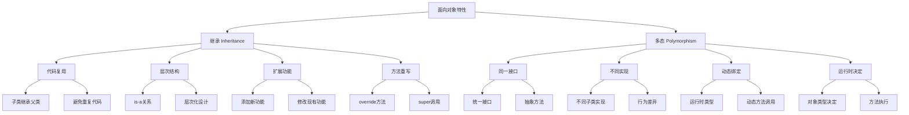

# 继承与多态

## 🎯 学习目标
- 理解面向对象编程中继承和多态的概念
- 掌握PHP中类的继承机制和语法
- 学会方法重写和属性重写
- 了解多态的实现和应用场景

## 📚 核心概念

### 继承与多态概述



### 继承 vs 多态对比

| 特性 | 继承 | 多态 |
|------|------|------|
| 目的 | 代码复用、功能扩展 | 统一接口、不同实现 |
| 关系 | is-a关系 | 同一接口的不同实现 |
| 实现 | extends关键字 | 方法重写 + 动态绑定 |
| 编译时 | 确定继承关系 | 确定方法签名 |
| 运行时 | 静态绑定 | 动态绑定 |
| 优势 | 减少重复代码 | 提高灵活性 |

## 🔧 继承详解

### 基本继承
```php
<?php
// 父类 - 动物
class Animal {
    protected $name;
    protected $age;
    protected $species;
    
    public function __construct($name, $age, $species) {
        $this->name = $name;
        $this->age = $age;
        $this->species = $species;
    }
    
    // 公共方法
    public function getName() {
        return $this->name;
    }
    
    public function getAge() {
        return $this->age;
    }
    
    public function getSpecies() {
        return $this->species;
    }
    
    // 可重写的方法
    public function makeSound() {
        return "动物发出声音";
    }
    
    public function move() {
        return "动物在移动";
    }
    
    public function eat() {
        return "动物在吃东西";
    }
    
    // 显示信息
    public function displayInfo() {
        echo "名称: " . $this->name . "\n";
        echo "年龄: " . $this->age . "\n";
        echo "种类: " . $this->species . "\n";
        echo "声音: " . $this->makeSound() . "\n";
        echo "移动: " . $this->move() . "\n";
        echo "进食: " . $this->eat() . "\n";
    }
}

// 子类 - 狗
class Dog extends Animal {
    private $breed;
    
    public function __construct($name, $age, $breed) {
        parent::__construct($name, $age, "狗");
        $this->breed = $breed;
    }
    
    // 重写父类方法
    public function makeSound() {
        return "汪汪！";
    }
    
    public function move() {
        return "狗在跑步";
    }
    
    public function eat() {
        return "狗在吃狗粮";
    }
    
    // 子类特有方法
    public function fetch() {
        return "狗在捡球";
    }
    
    public function getBreed() {
        return $this->breed;
    }
    
    // 重写显示信息方法
    public function displayInfo() {
        parent::displayInfo();
        echo "品种: " . $this->breed . "\n";
        echo "特殊技能: " . $this->fetch() . "\n";
    }
}

// 子类 - 猫
class Cat extends Animal {
    private $color;
    
    public function __construct($name, $age, $color) {
        parent::__construct($name, $age, "猫");
        $this->color = $color;
    }
    
    // 重写父类方法
    public function makeSound() {
        return "喵喵！";
    }
    
    public function move() {
        return "猫在悄悄走路";
    }
    
    public function eat() {
        return "猫在吃猫粮";
    }
    
    // 子类特有方法
    public function climb() {
        return "猫在爬树";
    }
    
    public function getColor() {
        return $this->color;
    }
    
    // 重写显示信息方法
    public function displayInfo() {
        parent::displayInfo();
        echo "颜色: " . $this->color . "\n";
        echo "特殊技能: " . $this->climb() . "\n";
    }
}

// 使用示例
echo "=== 创建动物对象 ===\n";
$animal = new Animal("通用动物", 5, "未知");
$animal->displayInfo();

echo "\n=== 创建狗对象 ===\n";
$dog = new Dog("旺财", 3, "金毛");
$dog->displayInfo();

echo "\n=== 创建猫对象 ===\n";
$cat = new Cat("咪咪", 2, "橘色");
$cat->displayInfo();
?>
```

### 多级继承
```php
<?php
// 基类 - 交通工具
class Vehicle {
    protected $brand;
    protected $model;
    protected $year;
    protected $fuel;
    
    public function __construct($brand, $model, $year, $fuel) {
        $this->brand = $brand;
        $this->model = $model;
        $this->year = $year;
        $this->fuel = $fuel;
    }
    
    public function getBrand() { return $this->brand; }
    public function getModel() { return $this->model; }
    public function getYear() { return $this->year; }
    public function getFuel() { return $this->fuel; }
    
    public function start() {
        return "交通工具启动";
    }
    
    public function stop() {
        return "交通工具停止";
    }
    
    public function displayInfo() {
        echo "品牌: " . $this->brand . "\n";
        echo "型号: " . $this->model . "\n";
        echo "年份: " . $this->year . "\n";
        echo "燃料: " . $this->fuel . "\n";
    }
}

// 子类 - 汽车
class Car extends Vehicle {
    protected $doors;
    protected $seats;
    
    public function __construct($brand, $model, $year, $fuel, $doors, $seats) {
        parent::__construct($brand, $model, $year, $fuel);
        $this->doors = $doors;
        $this->seats = $seats;
    }
    
    public function getDoors() { return $this->doors; }
    public function getSeats() { return $this->seats; }
    
    public function start() {
        return "汽车发动机启动";
    }
    
    public function drive() {
        return "汽车在公路上行驶";
    }
    
    public function displayInfo() {
        parent::displayInfo();
        echo "车门数: " . $this->doors . "\n";
        echo "座位数: " . $this->seats . "\n";
    }
}

// 子类 - 卡车
class Truck extends Car {
    private $cargoCapacity;
    private $hasTrailer;
    
    public function __construct($brand, $model, $year, $fuel, $doors, $seats, $cargoCapacity, $hasTrailer = false) {
        parent::__construct($brand, $model, $year, $fuel, $doors, $seats);
        $this->cargoCapacity = $cargoCapacity;
        $this->hasTrailer = $hasTrailer;
    }
    
    public function getCargoCapacity() { return $this->cargoCapacity; }
    public function hasTrailer() { return $this->hasTrailer; }
    
    public function start() {
        return "卡车柴油发动机启动";
    }
    
    public function loadCargo($weight) {
        if ($weight <= $this->cargoCapacity) {
            return "装载货物: {$weight}吨";
        } else {
            return "货物超重，无法装载";
        }
    }
    
    public function displayInfo() {
        parent::displayInfo();
        echo "载重能力: " . $this->cargoCapacity . "吨\n";
        echo "拖车: " . ($this->hasTrailer ? "有" : "无") . "\n";
    }
}

// 子类 - 跑车
class SportsCar extends Car {
    private $topSpeed;
    private $acceleration;
    
    public function __construct($brand, $model, $year, $fuel, $doors, $seats, $topSpeed, $acceleration) {
        parent::__construct($brand, $model, $year, $fuel, $doors, $seats);
        $this->topSpeed = $topSpeed;
        $this->acceleration = $acceleration;
    }
    
    public function getTopSpeed() { return $this->topSpeed; }
    public function getAcceleration() { return $this->acceleration; }
    
    public function start() {
        return "跑车引擎轰鸣启动";
    }
    
    public function race() {
        return "跑车在赛道上飞驰";
    }
    
    public function displayInfo() {
        parent::displayInfo();
        echo "最高时速: " . $this->topSpeed . " km/h\n";
        echo "加速时间: " . $this->acceleration . " 秒 (0-100km/h)\n";
    }
}

// 使用示例
echo "=== 创建汽车对象 ===\n";
$car = new Car("丰田", "凯美瑞", 2023, "汽油", 4, 5);
$car->displayInfo();
echo "启动: " . $car->start() . "\n";

echo "\n=== 创建卡车对象 ===\n";
$truck = new Truck("解放", "J6", 2022, "柴油", 2, 3, 20, true);
$truck->displayInfo();
echo "启动: " . $truck->start() . "\n";
echo "装载: " . $truck->loadCargo(15) . "\n";

echo "\n=== 创建跑车对象 ===\n";
$sportsCar = new SportsCar("法拉利", "488", 2023, "汽油", 2, 2, 330, 3.0);
$sportsCar->displayInfo();
echo "启动: " . $sportsCar->start() . "\n";
echo "比赛: " . $sportsCar->race() . "\n";
?>
```

### 方法重写和属性重写
```php
<?php
// 父类 - 员工
class Employee {
    protected $name;
    protected $id;
    protected $salary;
    protected $department;
    
    public function __construct($name, $id, $salary, $department) {
        $this->name = $name;
        $this->id = $id;
        $this->salary = $salary;
        $this->department = $department;
    }
    
    // 可重写的方法
    public function calculateSalary() {
        return $this->salary;
    }
    
    public function getBonus() {
        return 0; // 普通员工无奖金
    }
    
    public function getTotalCompensation() {
        return $this->calculateSalary() + $this->getBonus();
    }
    
    public function work() {
        return "员工在工作";
    }
    
    public function displayInfo() {
        echo "姓名: " . $this->name . "\n";
        echo "工号: " . $this->id . "\n";
        echo "部门: " . $this->department . "\n";
        echo "基本工资: ¥" . number_format($this->salary, 2) . "\n";
        echo "奖金: ¥" . number_format($this->getBonus(), 2) . "\n";
        echo "总收入: ¥" . number_format($this->getTotalCompensation(), 2) . "\n";
        echo "工作状态: " . $this->work() . "\n";
    }
}

// 子类 - 经理
class Manager extends Employee {
    private $teamSize;
    private $bonusRate;
    
    public function __construct($name, $id, $salary, $department, $teamSize, $bonusRate = 0.1) {
        parent::__construct($name, $id, $salary, $department);
        $this->teamSize = $teamSize;
        $this->bonusRate = $bonusRate;
    }
    
    // 重写父类方法
    public function calculateSalary() {
        // 经理有基本工资 + 管理津贴
        return $this->salary + ($this->teamSize * 1000);
    }
    
    public function getBonus() {
        // 经理有团队绩效奖金
        return $this->calculateSalary() * $this->bonusRate;
    }
    
    public function work() {
        return "经理在管理团队";
    }
    
    // 经理特有方法
    public function manageTeam() {
        return "管理 " . $this->teamSize . " 人的团队";
    }
    
    public function getTeamSize() {
        return $this->teamSize;
    }
    
    public function displayInfo() {
        parent::displayInfo();
        echo "团队规模: " . $this->teamSize . " 人\n";
        echo "管理活动: " . $this->manageTeam() . "\n";
    }
}

// 子类 - 销售员
class Salesperson extends Employee {
    private $salesTarget;
    private $actualSales;
    private $commissionRate;
    
    public function __construct($name, $id, $salary, $department, $salesTarget, $commissionRate = 0.05) {
        parent::__construct($name, $id, $salary, $department);
        $this->salesTarget = $salesTarget;
        $this->actualSales = 0;
        $this->commissionRate = $commissionRate;
    }
    
    // 重写父类方法
    public function getBonus() {
        // 销售员有销售提成
        return $this->actualSales * $this->commissionRate;
    }
    
    public function work() {
        return "销售员在拜访客户";
    }
    
    // 销售员特有方法
    public function makeSale($amount) {
        $this->actualSales += $amount;
        return "完成销售: ¥" . number_format($amount, 2);
    }
    
    public function getSalesPerformance() {
        $performance = ($this->actualSales / $this->salesTarget) * 100;
        return round($performance, 2) . "%";
    }
    
    public function getSalesTarget() {
        return $this->salesTarget;
    }
    
    public function getActualSales() {
        return $this->actualSales;
    }
    
    public function displayInfo() {
        parent::displayInfo();
        echo "销售目标: ¥" . number_format($this->salesTarget, 2) . "\n";
        echo "实际销售: ¥" . number_format($this->actualSales, 2) . "\n";
        echo "销售绩效: " . $this->getSalesPerformance() . "\n";
    }
}

// 使用示例
echo "=== 创建普通员工 ===\n";
$employee = new Employee("张三", "E001", 8000, "技术部");
$employee->displayInfo();

echo "\n=== 创建经理 ===\n";
$manager = new Manager("李四", "M001", 15000, "技术部", 8, 0.15);
$manager->displayInfo();

echo "\n=== 创建销售员 ===\n";
$salesperson = new Salesperson("王五", "S001", 6000, "销售部", 100000, 0.08);
$salesperson->makeSale(50000);
$salesperson->makeSale(30000);
$salesperson->displayInfo();
?>
```

## 🔧 多态详解

### 基本多态
```php
<?php
// 抽象基类 - 形状
abstract class Shape {
    protected $name;
    
    public function __construct($name) {
        $this->name = $name;
    }
    
    public function getName() {
        return $this->name;
    }
    
    // 抽象方法 - 子类必须实现
    abstract public function area();
    abstract public function perimeter();
    
    // 具体方法 - 所有子类共享
    public function displayInfo() {
        echo "形状: " . $this->name . "\n";
        echo "面积: " . $this->area() . "\n";
        echo "周长: " . $this->perimeter() . "\n";
    }
}

// 子类 - 矩形
class Rectangle extends Shape {
    private $width;
    private $height;
    
    public function __construct($name, $width, $height) {
        parent::__construct($name);
        $this->width = $width;
        $this->height = $height;
    }
    
    public function area() {
        return $this->width * $this->height;
    }
    
    public function perimeter() {
        return 2 * ($this->width + $this->height);
    }
}

// 子类 - 圆形
class Circle extends Shape {
    private $radius;
    
    public function __construct($name, $radius) {
        parent::__construct($name);
        $this->radius = $radius;
    }
    
    public function area() {
        return pi() * $this->radius * $this->radius;
    }
    
    public function perimeter() {
        return 2 * pi() * $this->radius;
    }
}

// 子类 - 三角形
class Triangle extends Shape {
    private $base;
    private $height;
    private $side1;
    private $side2;
    
    public function __construct($name, $base, $height, $side1, $side2) {
        parent::__construct($name);
        $this->base = $base;
        $this->height = $height;
        $this->side1 = $side1;
        $this->side2 = $side2;
    }
    
    public function area() {
        return 0.5 * $this->base * $this->height;
    }
    
    public function perimeter() {
        return $this->base + $this->side1 + $this->side2;
    }
}

// 多态函数 - 处理任何形状
function processShape(Shape $shape) {
    echo "处理形状: " . $shape->getName() . "\n";
    $shape->displayInfo();
    echo "---\n";
}

// 多态函数 - 计算总面积
function calculateTotalArea(array $shapes) {
    $totalArea = 0;
    foreach ($shapes as $shape) {
        $totalArea += $shape->area();
    }
    return $totalArea;
}

// 使用示例
echo "=== 多态示例 ===\n";

// 创建不同形状的对象
$shapes = [
    new Rectangle("矩形1", 10, 5),
    new Circle("圆形1", 7),
    new Triangle("三角形1", 8, 6, 5, 5),
    new Rectangle("矩形2", 12, 8),
    new Circle("圆形2", 4)
];

// 使用多态处理每个形状
foreach ($shapes as $shape) {
    processShape($shape);
}

// 计算总面积
$totalArea = calculateTotalArea($shapes);
echo "所有形状的总面积: " . round($totalArea, 2) . "\n";
?>
```

### 接口多态
```php
<?php
// 接口 - 可播放
interface Playable {
    public function play();
    public function pause();
    public function stop();
    public function getDuration();
}

// 接口 - 可下载
interface Downloadable {
    public function download();
    public function getFileSize();
}

// 类 - 音频文件
class AudioFile implements Playable, Downloadable {
    private $filename;
    private $duration;
    private $fileSize;
    private $isPlaying;
    
    public function __construct($filename, $duration, $fileSize) {
        $this->filename = $filename;
        $this->duration = $duration;
        $this->fileSize = $fileSize;
        $this->isPlaying = false;
    }
    
    // 实现 Playable 接口
    public function play() {
        $this->isPlaying = true;
        return "播放音频: " . $this->filename;
    }
    
    public function pause() {
        $this->isPlaying = false;
        return "暂停音频: " . $this->filename;
    }
    
    public function stop() {
        $this->isPlaying = false;
        return "停止音频: " . $this->filename;
    }
    
    public function getDuration() {
        return $this->duration;
    }
    
    // 实现 Downloadable 接口
    public function download() {
        return "下载音频文件: " . $this->filename;
    }
    
    public function getFileSize() {
        return $this->fileSize;
    }
    
    public function getFilename() {
        return $this->filename;
    }
}

// 类 - 视频文件
class VideoFile implements Playable, Downloadable {
    private $filename;
    private $duration;
    private $fileSize;
    private $resolution;
    private $isPlaying;
    
    public function __construct($filename, $duration, $fileSize, $resolution) {
        $this->filename = $filename;
        $this->duration = $duration;
        $this->fileSize = $fileSize;
        $this->resolution = $resolution;
        $this->isPlaying = false;
    }
    
    // 实现 Playable 接口
    public function play() {
        $this->isPlaying = true;
        return "播放视频: " . $this->filename . " (" . $this->resolution . ")";
    }
    
    public function pause() {
        $this->isPlaying = false;
        return "暂停视频: " . $this->filename;
    }
    
    public function stop() {
        $this->isPlaying = false;
        return "停止视频: " . $this->filename;
    }
    
    public function getDuration() {
        return $this->duration;
    }
    
    // 实现 Downloadable 接口
    public function download() {
        return "下载视频文件: " . $this->filename;
    }
    
    public function getFileSize() {
        return $this->fileSize;
    }
    
    public function getFilename() {
        return $this->filename;
    }
    
    public function getResolution() {
        return $this->resolution;
    }
}

// 类 - 文档文件
class DocumentFile implements Downloadable {
    private $filename;
    private $fileSize;
    private $pages;
    
    public function __construct($filename, $fileSize, $pages) {
        $this->filename = $filename;
        $this->fileSize = $fileSize;
        $this->pages = $pages;
    }
    
    // 实现 Downloadable 接口
    public function download() {
        return "下载文档: " . $this->filename;
    }
    
    public function getFileSize() {
        return $this->fileSize;
    }
    
    public function getFilename() {
        return $this->filename;
    }
    
    public function getPages() {
        return $this->pages;
    }
}

// 多态函数 - 播放媒体
function playMedia(Playable $media) {
    echo $media->play() . "\n";
    echo "时长: " . $media->getDuration() . " 分钟\n";
}

// 多态函数 - 下载文件
function downloadFile(Downloadable $file) {
    echo $file->download() . "\n";
    echo "文件大小: " . $file->getFileSize() . " MB\n";
}

// 多态函数 - 处理所有可下载文件
function processDownloadables(array $files) {
    $totalSize = 0;
    foreach ($files as $file) {
        $totalSize += $file->getFileSize();
        downloadFile($file);
    }
    echo "总下载大小: " . $totalSize . " MB\n";
}

// 使用示例
echo "=== 接口多态示例 ===\n";

// 创建不同类型的文件
$audio = new AudioFile("song.mp3", 3.5, 5.2);
$video = new VideoFile("movie.mp4", 120, 1500, "1920x1080");
$document = new DocumentFile("report.pdf", 2.1, 25);

// 使用多态播放媒体
echo "=== 播放媒体 ===\n";
playMedia($audio);
echo "\n";
playMedia($video);

// 使用多态下载文件
echo "\n=== 下载文件 ===\n";
downloadFile($audio);
downloadFile($video);
downloadFile($document);

// 处理所有可下载文件
echo "\n=== 批量下载 ===\n";
$downloadableFiles = [$audio, $video, $document];
processDownloadables($downloadableFiles);
?>
```

## 🎯 实际应用

### 支付系统多态
```php
<?php
// 抽象支付类
abstract class PaymentMethod {
    protected $amount;
    protected $currency;
    protected $transactionId;
    
    public function __construct($amount, $currency = 'CNY') {
        $this->amount = $amount;
        $this->currency = $currency;
        $this->transactionId = uniqid('TXN_');
    }
    
    public function getAmount() {
        return $this->amount;
    }
    
    public function getCurrency() {
        return $this->currency;
    }
    
    public function getTransactionId() {
        return $this->transactionId;
    }
    
    // 抽象方法 - 子类必须实现
    abstract public function processPayment();
    abstract public function validatePayment();
    abstract public function getPaymentInfo();
}

// 支付宝支付
class AlipayPayment extends PaymentMethod {
    private $account;
    private $password;
    
    public function __construct($amount, $account, $password, $currency = 'CNY') {
        parent::__construct($amount, $currency);
        $this->account = $account;
        $this->password = $password;
    }
    
    public function processPayment() {
        if (!$this->validatePayment()) {
            throw new Exception("支付宝支付验证失败");
        }
        
        // 模拟支付宝支付处理
        echo "正在通过支付宝处理支付...\n";
        echo "账户: " . $this->account . "\n";
        echo "金额: " . $this->amount . " " . $this->currency . "\n";
        
        // 模拟支付成功
        return [
            'status' => 'success',
            'transaction_id' => $this->transactionId,
            'payment_method' => 'Alipay',
            'amount' => $this->amount,
            'currency' => $this->currency
        ];
    }
    
    public function validatePayment() {
        // 模拟验证逻辑
        return !empty($this->account) && !empty($this->password);
    }
    
    public function getPaymentInfo() {
        return [
            'method' => '支付宝',
            'account' => $this->account,
            'amount' => $this->amount,
            'currency' => $this->currency
        ];
    }
}

// 微信支付
class WechatPayment extends PaymentMethod {
    private $openId;
    private $appId;
    
    public function __construct($amount, $openId, $appId, $currency = 'CNY') {
        parent::__construct($amount, $currency);
        $this->openId = $openId;
        $this->appId = $appId;
    }
    
    public function processPayment() {
        if (!$this->validatePayment()) {
            throw new Exception("微信支付验证失败");
        }
        
        // 模拟微信支付处理
        echo "正在通过微信处理支付...\n";
        echo "OpenID: " . $this->openId . "\n";
        echo "AppID: " . $this->appId . "\n";
        echo "金额: " . $this->amount . " " . $this->currency . "\n";
        
        // 模拟支付成功
        return [
            'status' => 'success',
            'transaction_id' => $this->transactionId,
            'payment_method' => 'Wechat',
            'amount' => $this->amount,
            'currency' => $this->currency
        ];
    }
    
    public function validatePayment() {
        // 模拟验证逻辑
        return !empty($this->openId) && !empty($this->appId);
    }
    
    public function getPaymentInfo() {
        return [
            'method' => '微信支付',
            'open_id' => $this->openId,
            'amount' => $this->amount,
            'currency' => $this->currency
        ];
    }
}

// 银行卡支付
class BankCardPayment extends PaymentMethod {
    private $cardNumber;
    private $cvv;
    private $expiryDate;
    
    public function __construct($amount, $cardNumber, $cvv, $expiryDate, $currency = 'CNY') {
        parent::__construct($amount, $currency);
        $this->cardNumber = $cardNumber;
        $this->cvv = $cvv;
        $this->expiryDate = $expiryDate;
    }
    
    public function processPayment() {
        if (!$this->validatePayment()) {
            throw new Exception("银行卡支付验证失败");
        }
        
        // 模拟银行卡支付处理
        echo "正在通过银行卡处理支付...\n";
        echo "卡号: " . substr($this->cardNumber, 0, 4) . "****" . substr($this->cardNumber, -4) . "\n";
        echo "金额: " . $this->amount . " " . $this->currency . "\n";
        
        // 模拟支付成功
        return [
            'status' => 'success',
            'transaction_id' => $this->transactionId,
            'payment_method' => 'BankCard',
            'amount' => $this->amount,
            'currency' => $this->currency
        ];
    }
    
    public function validatePayment() {
        // 模拟验证逻辑
        return !empty($this->cardNumber) && 
               !empty($this->cvv) && 
               !empty($this->expiryDate) &&
               strlen($this->cardNumber) >= 16;
    }
    
    public function getPaymentInfo() {
        return [
            'method' => '银行卡',
            'card_number' => substr($this->cardNumber, 0, 4) . "****" . substr($this->cardNumber, -4),
            'amount' => $this->amount,
            'currency' => $this->currency
        ];
    }
}

// 支付处理器 - 多态处理
class PaymentProcessor {
    public function processPayment(PaymentMethod $payment) {
        try {
            echo "=== 开始支付处理 ===\n";
            
            // 显示支付信息
            $info = $payment->getPaymentInfo();
            echo "支付方式: " . $info['method'] . "\n";
            echo "交易ID: " . $payment->getTransactionId() . "\n";
            
            // 处理支付
            $result = $payment->processPayment();
            
            echo "支付结果: " . $result['status'] . "\n";
            echo "=== 支付处理完成 ===\n\n";
            
            return $result;
            
        } catch (Exception $e) {
            echo "支付失败: " . $e->getMessage() . "\n";
            return [
                'status' => 'failed',
                'error' => $e->getMessage()
            ];
        }
    }
    
    public function processMultiplePayments(array $payments) {
        $results = [];
        foreach ($payments as $payment) {
            $results[] = $this->processPayment($payment);
        }
        return $results;
    }
}

// 使用示例
echo "=== 支付系统多态示例 ===\n";

// 创建支付处理器
$processor = new PaymentProcessor();

// 创建不同的支付方式
$payments = [
    new AlipayPayment(100.00, 'zhangsan@alipay.com', 'password123'),
    new WechatPayment(200.00, 'wx_openid_123', 'wx_appid_456'),
    new BankCardPayment(300.00, '1234567890123456', '123', '12/25')
];

// 使用多态处理支付
foreach ($payments as $payment) {
    $processor->processPayment($payment);
}

// 批量处理支付
echo "=== 批量支付处理 ===\n";
$results = $processor->processMultiplePayments($payments);

// 统计支付结果
$successCount = 0;
$totalAmount = 0;

foreach ($results as $result) {
    if ($result['status'] === 'success') {
        $successCount++;
        $totalAmount += $result['amount'];
    }
}

echo "支付统计:\n";
echo "成功支付: $successCount 笔\n";
echo "总金额: ¥" . number_format($totalAmount, 2) . "\n";
?>
```

## 📊 最佳实践

### 继承设计原则
```php
<?php
// 1. 使用抽象类定义通用行为
abstract class Animal {
    protected $name;
    protected $age;
    
    public function __construct($name, $age) {
        $this->name = $name;
        $this->age = $age;
    }
    
    // 具体方法 - 所有子类共享
    public function getName() {
        return $this->name;
    }
    
    public function getAge() {
        return $this->age;
    }
    
    // 抽象方法 - 子类必须实现
    abstract public function makeSound();
    abstract public function move();
}

// 2. 使用接口定义契约
interface Flyable {
    public function fly();
    public function land();
}

interface Swimmable {
    public function swim();
    public function dive();
}

// 3. 组合优于继承
class Bird extends Animal implements Flyable {
    public function makeSound() {
        return "鸟在唱歌";
    }
    
    public function move() {
        return "鸟在飞行";
    }
    
    public function fly() {
        return "鸟在天空中飞翔";
    }
    
    public function land() {
        return "鸟降落到地面";
    }
}

class Duck extends Animal implements Flyable, Swimmable {
    public function makeSound() {
        return "鸭子嘎嘎叫";
    }
    
    public function move() {
        return "鸭子在水上游动";
    }
    
    public function fly() {
        return "鸭子在水面上飞行";
    }
    
    public function land() {
        return "鸭子降落到水面";
    }
    
    public function swim() {
        return "鸭子在水中游泳";
    }
    
    public function dive() {
        return "鸭子潜入水中";
    }
}

// 4. 使用工厂模式创建对象
class AnimalFactory {
    public static function createAnimal($type, $name, $age) {
        switch ($type) {
            case 'bird':
                return new Bird($name, $age);
            case 'duck':
                return new Duck($name, $age);
            default:
                throw new InvalidArgumentException("未知的动物类型: $type");
        }
    }
}

// 使用示例
$bird = AnimalFactory::createAnimal('bird', '小鸟', 2);
$duck = AnimalFactory::createAnimal('duck', '小鸭', 1);

echo $bird->makeSound() . "\n";
echo $bird->fly() . "\n";

echo $duck->makeSound() . "\n";
echo $duck->swim() . "\n";
echo $duck->fly() . "\n";
?>
```

## 🎓 学习建议

### 费曼学习法应用
1. **选择概念**: 选择继承和多态中的核心概念
2. **简化解释**: 用简单语言解释继承和多态的作用
3. **识别盲点**: 发现理解不深入的地方
4. **重新学习**: 针对盲点进行深入学习

### 刻意练习重点
1. **概念理解**: 深入理解继承和多态的概念
2. **实际应用**: 在实际项目中应用继承和多态
3. **设计原则**: 学习继承和多态的设计原则
4. **最佳实践**: 掌握继承和多态的最佳实践

## 🔗 相关链接
- [[01-类与对象基础|类与对象基础]]
- [[02-属性与方法|属性与方法]]
- [[03-构造函数与析构函数|构造函数与析构函数]]
- [[05-封装与访问控制|封装与访问控制]]
- [[06-抽象类与接口|抽象类与接口]]
