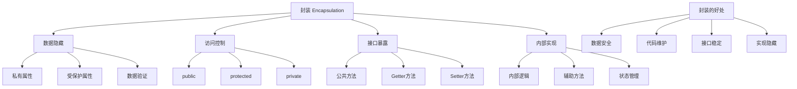

# 封装与访问控制

## 🎯 学习目标
- 理解面向对象编程中封装的概念和重要性
- 掌握PHP中访问控制修饰符的使用
- 学会通过getter和setter方法控制属性访问
- 了解封装的最佳实践和设计原则

## 📚 核心概念

### 封装概述



### 访问控制级别

| 修饰符 | 类内部 | 子类 | 外部 | 特点 | 使用场景 |
|--------|--------|------|------|------|----------|
| public | ✅ | ✅ | ✅ | 完全开放 | 公共接口、常量 |
| protected | ✅ | ✅ | ❌ | 继承可见 | 子类需要访问的属性/方法 |
| private | ✅ | ❌ | ❌ | 完全私有 | 内部实现、敏感数据 |

## 🔧 基本封装

### 属性封装
```php
<?php
class BankAccount {
    // 私有属性 - 完全封装
    private $accountNumber;
    private $balance;
    private $pin;
    private $isActive;
    private $transactionHistory;
    
    // 受保护属性 - 子类可访问
    protected $owner;
    protected $createdAt;
    
    // 公共属性 - 完全开放（通常不推荐）
    public $bankName;
    
    public function __construct($accountNumber, $owner, $initialBalance = 0, $pin = '0000') {
        $this->accountNumber = $accountNumber;
        $this->owner = $owner;
        $this->balance = $initialBalance;
        $this->pin = $pin;
        $this->isActive = true;
        $this->transactionHistory = [];
        $this->createdAt = new DateTime();
        $this->bankName = "示例银行";
        
        // 记录开户交易
        $this->addTransaction('开户', $initialBalance, $this->balance);
    }
    
    // 公共方法 - 安全的属性访问
    public function getAccountNumber() {
        return $this->accountNumber;
    }
    
    public function getBalance() {
        return $this->balance;
    }
    
    public function getOwner() {
        return $this->owner;
    }
    
    public function getCreatedAt() {
        return $this->createdAt;
    }
    
    public function isActive() {
        return $this->isActive;
    }
    
    // 受保护方法 - 子类可访问
    protected function addTransaction($type, $amount, $balance) {
        $this->transactionHistory[] = [
            'type' => $type,
            'amount' => $amount,
            'balance' => $balance,
            'timestamp' => new DateTime()
        ];
    }
    
    // 私有方法 - 内部实现
    private function validatePin($pin) {
        return $this->pin === $pin;
    }
    
    private function validateAmount($amount) {
        return is_numeric($amount) && $amount > 0;
    }
    
    // 公共方法 - 业务逻辑
    public function deposit($amount, $pin) {
        if (!$this->isActive) {
            throw new Exception("账户已被冻结");
        }
        
        if (!$this->validatePin($pin)) {
            throw new Exception("PIN码错误");
        }
        
        if (!$this->validateAmount($amount)) {
            throw new Exception("存款金额无效");
        }
        
        $this->balance += $amount;
        $this->addTransaction('存款', $amount, $this->balance);
        
        return $this->balance;
    }
    
    public function withdraw($amount, $pin) {
        if (!$this->isActive) {
            throw new Exception("账户已被冻结");
        }
        
        if (!$this->validatePin($pin)) {
            throw new Exception("PIN码错误");
        }
        
        if (!$this->validateAmount($amount)) {
            throw new Exception("取款金额无效");
        }
        
        if ($amount > $this->balance) {
            throw new Exception("余额不足");
        }
        
        $this->balance -= $amount;
        $this->addTransaction('取款', -$amount, $this->balance);
        
        return $this->balance;
    }
    
    public function changePin($oldPin, $newPin) {
        if (!$this->validatePin($oldPin)) {
            throw new Exception("原PIN码错误");
        }
        
        if (strlen($newPin) !== 4 || !is_numeric($newPin)) {
            throw new Exception("新PIN码必须是4位数字");
        }
        
        $this->pin = $newPin;
        $this->addTransaction('修改PIN', 0, $this->balance);
        
        return true;
    }
    
    public function freeze() {
        $this->isActive = false;
        $this->addTransaction('冻结账户', 0, $this->balance);
    }
    
    public function unfreeze($pin) {
        if (!$this->validatePin($pin)) {
            throw new Exception("PIN码错误");
        }
        
        $this->isActive = true;
        $this->addTransaction('解冻账户', 0, $this->balance);
    }
    
    // 获取交易历史（只读）
    public function getTransactionHistory() {
        return $this->transactionHistory;
    }
    
    // 显示账户信息
    public function displayInfo() {
        echo "账户号: " . $this->accountNumber . "\n";
        echo "户主: " . $this->owner . "\n";
        echo "余额: ¥" . number_format($this->balance, 2) . "\n";
        echo "状态: " . ($this->isActive ? "正常" : "冻结") . "\n";
        echo "开户时间: " . $this->createdAt->format('Y-m-d H:i:s') . "\n";
        echo "银行: " . $this->bankName . "\n";
    }
    
    // 显示交易历史
    public function displayTransactionHistory() {
        echo "交易历史:\n";
        echo str_repeat("-", 60) . "\n";
        printf("%-10s %-10s %-15s %-20s\n", "类型", "金额", "余额", "时间");
        echo str_repeat("-", 60) . "\n";
        
        foreach ($this->transactionHistory as $transaction) {
            printf("%-10s %-10s %-15s %-20s\n",
                $transaction['type'],
                ($transaction['amount'] > 0 ? '+' : '') . $transaction['amount'],
                number_format($transaction['balance'], 2),
                $transaction['timestamp']->format('Y-m-d H:i:s')
            );
        }
    }
}

// 使用示例
try {
    // 创建银行账户
    $account = new BankAccount("1234567890", "张三", 1000, "1234");
    
    // 显示账户信息
    $account->displayInfo();
    
    // 存款
    $account->deposit(500, "1234");
    echo "存款后余额: ¥" . $account->getBalance() . "\n";
    
    // 取款
    $account->withdraw(200, "1234");
    echo "取款后余额: ¥" . $account->getBalance() . "\n";
    
    // 修改PIN
    $account->changePin("1234", "5678");
    echo "PIN修改成功\n";
    
    // 显示交易历史
    $account->displayTransactionHistory();
    
} catch (Exception $e) {
    echo "错误: " . $e->getMessage() . "\n";
}
?>
```

### 方法封装
```php
<?php
class UserManager {
    // 私有属性
    private $users;
    private $currentUser;
    private $sessionId;
    
    // 受保护属性
    protected $database;
    protected $config;
    
    public function __construct($database, $config = []) {
        $this->users = [];
        $this->currentUser = null;
        $this->sessionId = uniqid('session_');
        $this->database = $database;
        $this->config = array_merge([
            'maxLoginAttempts' => 3,
            'sessionTimeout' => 3600,
            'passwordMinLength' => 6
        ], $config);
    }
    
    // 公共方法 - 用户注册
    public function register($username, $email, $password) {
        // 验证输入
        $this->validateRegistration($username, $email, $password);
        
        // 检查用户是否已存在
        if ($this->userExists($username, $email)) {
            throw new Exception("用户名或邮箱已存在");
        }
        
        // 创建用户
        $user = $this->createUser($username, $email, $password);
        
        // 保存用户
        $this->saveUser($user);
        
        return $user;
    }
    
    // 公共方法 - 用户登录
    public function login($username, $password) {
        // 验证输入
        if (empty($username) || empty($password)) {
            throw new Exception("用户名和密码不能为空");
        }
        
        // 检查登录尝试次数
        if ($this->isAccountLocked($username)) {
            throw new Exception("账户已被锁定，请稍后再试");
        }
        
        // 验证用户凭据
        $user = $this->authenticateUser($username, $password);
        
        if (!$user) {
            $this->recordFailedLogin($username);
            throw new Exception("用户名或密码错误");
        }
        
        // 登录成功
        $this->currentUser = $user;
        $this->recordSuccessfulLogin($user);
        
        return $user;
    }
    
    // 公共方法 - 用户登出
    public function logout() {
        if ($this->currentUser) {
            $this->recordLogout($this->currentUser);
            $this->currentUser = null;
        }
    }
    
    // 公共方法 - 获取当前用户
    public function getCurrentUser() {
        return $this->currentUser;
    }
    
    // 公共方法 - 检查是否已登录
    public function isLoggedIn() {
        return $this->currentUser !== null;
    }
    
    // 受保护方法 - 验证注册信息
    protected function validateRegistration($username, $email, $password) {
        if (empty($username) || strlen($username) < 3) {
            throw new Exception("用户名长度不能少于3位");
        }
        
        if (!filter_var($email, FILTER_VALIDATE_EMAIL)) {
            throw new Exception("邮箱格式不正确");
        }
        
        if (strlen($password) < $this->config['passwordMinLength']) {
            throw new Exception("密码长度不能少于" . $this->config['passwordMinLength'] . "位");
        }
    }
    
    // 受保护方法 - 检查用户是否存在
    protected function userExists($username, $email) {
        foreach ($this->users as $user) {
            if ($user['username'] === $username || $user['email'] === $email) {
                return true;
            }
        }
        return false;
    }
    
    // 受保护方法 - 创建用户
    protected function createUser($username, $email, $password) {
        return [
            'id' => uniqid('user_'),
            'username' => $username,
            'email' => $email,
            'password' => password_hash($password, PASSWORD_DEFAULT),
            'createdAt' => new DateTime(),
            'isActive' => true,
            'loginAttempts' => 0,
            'lastLogin' => null
        ];
    }
    
    // 受保护方法 - 保存用户
    protected function saveUser($user) {
        $this->users[] = $user;
        // 在实际应用中，这里会保存到数据库
    }
    
    // 私有方法 - 验证用户凭据
    private function authenticateUser($username, $password) {
        foreach ($this->users as $user) {
            if ($user['username'] === $username && 
                password_verify($password, $user['password']) &&
                $user['isActive']) {
                return $user;
            }
        }
        return null;
    }
    
    // 私有方法 - 检查账户是否被锁定
    private function isAccountLocked($username) {
        foreach ($this->users as $user) {
            if ($user['username'] === $username) {
                return $user['loginAttempts'] >= $this->config['maxLoginAttempts'];
            }
        }
        return false;
    }
    
    // 私有方法 - 记录失败登录
    private function recordFailedLogin($username) {
        foreach ($this->users as &$user) {
            if ($user['username'] === $username) {
                $user['loginAttempts']++;
                break;
            }
        }
    }
    
    // 私有方法 - 记录成功登录
    private function recordSuccessfulLogin($user) {
        foreach ($this->users as &$u) {
            if ($u['id'] === $user['id']) {
                $u['loginAttempts'] = 0;
                $u['lastLogin'] = new DateTime();
                break;
            }
        }
    }
    
    // 私有方法 - 记录登出
    private function recordLogout($user) {
        // 记录登出日志
        echo "用户 " . $user['username'] . " 已登出\n";
    }
    
    // 公共方法 - 获取用户统计
    public function getUserStatistics() {
        $totalUsers = count($this->users);
        $activeUsers = 0;
        $lockedUsers = 0;
        
        foreach ($this->users as $user) {
            if ($user['isActive']) {
                $activeUsers++;
            }
            if ($user['loginAttempts'] >= $this->config['maxLoginAttempts']) {
                $lockedUsers++;
            }
        }
        
        return [
            'totalUsers' => $totalUsers,
            'activeUsers' => $activeUsers,
            'lockedUsers' => $lockedUsers,
            'currentSession' => $this->sessionId
        ];
    }
}

// 使用示例
try {
    // 创建用户管理器
    $userManager = new UserManager(null, [
        'maxLoginAttempts' => 3,
        'passwordMinLength' => 6
    ]);
    
    // 注册用户
    $user = $userManager->register("zhangsan", "zhangsan@example.com", "password123");
    echo "用户注册成功: " . $user['username'] . "\n";
    
    // 登录用户
    $loggedInUser = $userManager->login("zhangsan", "password123");
    echo "用户登录成功: " . $loggedInUser['username'] . "\n";
    
    // 检查登录状态
    if ($userManager->isLoggedIn()) {
        echo "当前用户: " . $userManager->getCurrentUser()['username'] . "\n";
    }
    
    // 获取统计信息
    $stats = $userManager->getUserStatistics();
    echo "用户统计: " . json_encode($stats, JSON_UNESCAPED_UNICODE) . "\n";
    
    // 登出
    $userManager->logout();
    echo "用户已登出\n";
    
} catch (Exception $e) {
    echo "错误: " . $e->getMessage() . "\n";
}
?>
```

## 🔧 高级封装

### 属性访问器
```php
<?php
class Product {
    private $id;
    private $name;
    private $price;
    private $description;
    private $category;
    private $stock;
    private $isActive;
    private $createdAt;
    private $updatedAt;
    
    public function __construct($name, $price, $description = '', $category = '') {
        $this->id = uniqid('prod_');
        $this->name = $name;
        $this->price = $price;
        $this->description = $description;
        $this->category = $category;
        $this->stock = 0;
        $this->isActive = true;
        $this->createdAt = new DateTime();
        $this->updatedAt = new DateTime();
    }
    
    // 只读属性访问器
    public function getId() {
        return $this->id;
    }
    
    public function getName() {
        return $this->name;
    }
    
    public function getPrice() {
        return $this->price;
    }
    
    public function getDescription() {
        return $this->description;
    }
    
    public function getCategory() {
        return $this->category;
    }
    
    public function getStock() {
        return $this->stock;
    }
    
    public function isActive() {
        return $this->isActive;
    }
    
    public function getCreatedAt() {
        return $this->createdAt;
    }
    
    public function getUpdatedAt() {
        return $this->updatedAt;
    }
    
    // 受控的属性修改器
    public function setName($name) {
        if (empty($name)) {
            throw new InvalidArgumentException("产品名称不能为空");
        }
        
        if (strlen($name) > 100) {
            throw new InvalidArgumentException("产品名称长度不能超过100字符");
        }
        
        $this->name = $name;
        $this->updatedAt = new DateTime();
    }
    
    public function setPrice($price) {
        if (!is_numeric($price) || $price < 0) {
            throw new InvalidArgumentException("价格必须是大于等于0的数字");
        }
        
        $this->price = $price;
        $this->updatedAt = new DateTime();
    }
    
    public function setDescription($description) {
        if (strlen($description) > 1000) {
            throw new InvalidArgumentException("描述长度不能超过1000字符");
        }
        
        $this->description = $description;
        $this->updatedAt = new DateTime();
    }
    
    public function setCategory($category) {
        $allowedCategories = ['电子产品', '服装', '食品', '图书', '家居', '运动'];
        
        if (!in_array($category, $allowedCategories)) {
            throw new InvalidArgumentException("无效的产品类别");
        }
        
        $this->category = $category;
        $this->updatedAt = new DateTime();
    }
    
    public function setStock($stock) {
        if (!is_int($stock) || $stock < 0) {
            throw new InvalidArgumentException("库存必须是大于等于0的整数");
        }
        
        $this->stock = $stock;
        $this->updatedAt = new DateTime();
    }
    
    public function activate() {
        $this->isActive = true;
        $this->updatedAt = new DateTime();
    }
    
    public function deactivate() {
        $this->isActive = false;
        $this->updatedAt = new DateTime();
    }
    
    // 业务逻辑方法
    public function addStock($quantity) {
        if (!is_int($quantity) || $quantity <= 0) {
            throw new InvalidArgumentException("添加数量必须是正整数");
        }
        
        $this->stock += $quantity;
        $this->updatedAt = new DateTime();
    }
    
    public function reduceStock($quantity) {
        if (!is_int($quantity) || $quantity <= 0) {
            throw new InvalidArgumentException("减少数量必须是正整数");
        }
        
        if ($quantity > $this->stock) {
            throw new Exception("库存不足");
        }
        
        $this->stock -= $quantity;
        $this->updatedAt = new DateTime();
    }
    
    public function isInStock() {
        return $this->stock > 0;
    }
    
    public function isAvailable() {
        return $this->isActive && $this->isInStock();
    }
    
    // 计算相关方法
    public function calculateDiscount($discountPercent) {
        if ($discountPercent < 0 || $discountPercent > 100) {
            throw new InvalidArgumentException("折扣百分比必须在0-100之间");
        }
        
        return $this->price * (1 - $discountPercent / 100);
    }
    
    public function calculateTax($taxRate = 0.1) {
        return $this->price * $taxRate;
    }
    
    public function getTotalPrice($taxRate = 0.1) {
        return $this->price + $this->calculateTax($taxRate);
    }
    
    // 显示产品信息
    public function displayInfo() {
        echo "产品ID: " . $this->id . "\n";
        echo "产品名称: " . $this->name . "\n";
        echo "价格: ¥" . number_format($this->price, 2) . "\n";
        echo "描述: " . $this->description . "\n";
        echo "类别: " . $this->category . "\n";
        echo "库存: " . $this->stock . "\n";
        echo "状态: " . ($this->isActive ? "上架" : "下架") . "\n";
        echo "可用性: " . ($this->isAvailable() ? "可购买" : "不可购买") . "\n";
        echo "创建时间: " . $this->createdAt->format('Y-m-d H:i:s') . "\n";
        echo "更新时间: " . $this->updatedAt->format('Y-m-d H:i:s') . "\n";
    }
    
    // 转换为数组
    public function toArray() {
        return [
            'id' => $this->id,
            'name' => $this->name,
            'price' => $this->price,
            'description' => $this->description,
            'category' => $this->category,
            'stock' => $this->stock,
            'isActive' => $this->isActive,
            'createdAt' => $this->createdAt->format('Y-m-d H:i:s'),
            'updatedAt' => $this->updatedAt->format('Y-m-d H:i:s')
        ];
    }
}

// 使用示例
try {
    // 创建产品
    $product = new Product("iPhone 15", 7999, "最新款iPhone手机", "电子产品");
    
    // 设置库存
    $product->setStock(100);
    
    // 显示产品信息
    $product->displayInfo();
    
    // 修改产品信息
    $product->setPrice(7500);
    $product->setDescription("iPhone 15 Pro Max 256GB");
    
    // 添加库存
    $product->addStock(50);
    
    // 计算价格
    echo "原价: ¥" . number_format($product->getPrice(), 2) . "\n";
    echo "9折价格: ¥" . number_format($product->calculateDiscount(10), 2) . "\n";
    echo "含税价格: ¥" . number_format($product->getTotalPrice(), 2) . "\n";
    
    // 转换为数组
    $productArray = $product->toArray();
    echo "产品数组: " . json_encode($productArray, JSON_UNESCAPED_UNICODE) . "\n";
    
} catch (Exception $e) {
    echo "错误: " . $e->getMessage() . "\n";
}
?>
```

### 魔术方法封装
```php
<?php
class SecureData {
    private $data;
    private $allowedKeys;
    private $readOnlyKeys;
    
    public function __construct($allowedKeys = [], $readOnlyKeys = []) {
        $this->data = [];
        $this->allowedKeys = $allowedKeys;
        $this->readOnlyKeys = $readOnlyKeys;
    }
    
    // 魔术方法 - 属性访问
    public function __get($name) {
        if (in_array($name, $this->allowedKeys)) {
            return $this->data[$name] ?? null;
        }
        
        throw new Exception("无权访问属性: $name");
    }
    
    public function __set($name, $value) {
        if (!in_array($name, $this->allowedKeys)) {
            throw new Exception("无权设置属性: $name");
        }
        
        if (in_array($name, $this->readOnlyKeys)) {
            throw new Exception("属性 $name 是只读的");
        }
        
        $this->data[$name] = $value;
    }
    
    public function __isset($name) {
        return in_array($name, $this->allowedKeys) && isset($this->data[$name]);
    }
    
    public function __unset($name) {
        if (!in_array($name, $this->allowedKeys)) {
            throw new Exception("无权删除属性: $name");
        }
        
        if (in_array($name, $this->readOnlyKeys)) {
            throw new Exception("属性 $name 是只读的");
        }
        
        unset($this->data[$name]);
    }
    
    // 公共方法 - 安全设置数据
    public function setData($key, $value) {
        if (!in_array($key, $this->allowedKeys)) {
            throw new Exception("无权设置属性: $key");
        }
        
        if (in_array($key, $this->readOnlyKeys)) {
            throw new Exception("属性 $key 是只读的");
        }
        
        $this->data[$key] = $value;
    }
    
    // 公共方法 - 安全获取数据
    public function getData($key) {
        if (!in_array($key, $this->allowedKeys)) {
            throw new Exception("无权访问属性: $key");
        }
        
        return $this->data[$key] ?? null;
    }
    
    // 公共方法 - 检查属性是否存在
    public function hasData($key) {
        return in_array($key, $this->allowedKeys) && isset($this->data[$key]);
    }
    
    // 公共方法 - 获取所有数据
    public function getAllData() {
        return $this->data;
    }
    
    // 公共方法 - 清空数据
    public function clearData() {
        $this->data = [];
    }
    
    // 公共方法 - 批量设置数据
    public function setMultipleData($data) {
        foreach ($data as $key => $value) {
            $this->setData($key, $value);
        }
    }
}

// 使用示例
try {
    // 创建安全数据对象
    $secureData = new SecureData(
        ['name', 'email', 'age', 'id'], // 允许的键
        ['id'] // 只读键
    );
    
    // 设置数据
    $secureData->setData('name', '张三');
    $secureData->setData('email', 'zhangsan@example.com');
    $secureData->setData('age', 25);
    $secureData->setData('id', 'user_123');
    
    // 获取数据
    echo "姓名: " . $secureData->getData('name') . "\n";
    echo "邮箱: " . $secureData->getData('email') . "\n";
    echo "年龄: " . $secureData->getData('age') . "\n";
    echo "ID: " . $secureData->getData('id') . "\n";
    
    // 使用魔术方法访问
    echo "姓名(魔术方法): " . $secureData->name . "\n";
    
    // 检查属性是否存在
    if ($secureData->hasData('name')) {
        echo "姓名属性存在\n";
    }
    
    // 尝试修改只读属性
    try {
        $secureData->setData('id', 'new_id');
    } catch (Exception $e) {
        echo "错误: " . $e->getMessage() . "\n";
    }
    
    // 尝试访问不允许的属性
    try {
        $secureData->setData('password', 'secret');
    } catch (Exception $e) {
        echo "错误: " . $e->getMessage() . "\n";
    }
    
    // 获取所有数据
    $allData = $secureData->getAllData();
    echo "所有数据: " . json_encode($allData, JSON_UNESCAPED_UNICODE) . "\n";
    
} catch (Exception $e) {
    echo "错误: " . $e->getMessage() . "\n";
}
?>
```

## 🎯 实际应用

### 配置管理器
```php
<?php
class ConfigManager {
    private $config;
    private $defaults;
    private $validators;
    private $isLoaded;
    
    public function __construct() {
        $this->config = [];
        $this->defaults = [];
        $this->validators = [];
        $this->isLoaded = false;
        
        // 设置默认配置
        $this->setDefaults();
    }
    
    // 设置默认配置
    private function setDefaults() {
        $this->defaults = [
            'app.name' => 'My Application',
            'app.version' => '1.0.0',
            'app.debug' => false,
            'app.timezone' => 'Asia/Shanghai',
            'database.host' => 'localhost',
            'database.port' => 3306,
            'database.name' => 'myapp',
            'database.charset' => 'utf8mb4',
            'cache.driver' => 'file',
            'cache.ttl' => 3600,
            'log.level' => 'info',
            'log.file' => 'app.log'
        ];
        
        // 设置验证器
        $this->validators = [
            'app.name' => function($value) {
                return is_string($value) && strlen($value) > 0;
            },
            'app.version' => function($value) {
                return preg_match('/^\d+\.\d+\.\d+$/', $value);
            },
            'app.debug' => function($value) {
                return is_bool($value);
            },
            'app.timezone' => function($value) {
                return in_array($value, timezone_identifiers_list());
            },
            'database.port' => function($value) {
                return is_int($value) && $value > 0 && $value <= 65535;
            },
            'cache.ttl' => function($value) {
                return is_int($value) && $value > 0;
            },
            'log.level' => function($value) {
                return in_array($value, ['debug', 'info', 'warning', 'error']);
            }
        ];
    }
    
    // 加载配置文件
    public function loadFromFile($filename) {
        if (!file_exists($filename)) {
            throw new Exception("配置文件不存在: $filename");
        }
        
        $content = file_get_contents($filename);
        $config = json_decode($content, true);
        
        if (json_last_error() !== JSON_ERROR_NONE) {
            throw new Exception("配置文件格式错误: " . json_last_error_msg());
        }
        
        $this->loadFromArray($config);
    }
    
    // 从数组加载配置
    public function loadFromArray($config) {
        foreach ($config as $key => $value) {
            $this->set($key, $value);
        }
        $this->isLoaded = true;
    }
    
    // 设置配置值
    public function set($key, $value) {
        // 验证配置键
        if (!$this->isValidKey($key)) {
            throw new InvalidArgumentException("无效的配置键: $key");
        }
        
        // 验证配置值
        if (isset($this->validators[$key])) {
            if (!$this->validators[$key]($value)) {
                throw new InvalidArgumentException("配置值验证失败: $key = $value");
            }
        }
        
        $this->config[$key] = $value;
    }
    
    // 获取配置值
    public function get($key, $default = null) {
        if (isset($this->config[$key])) {
            return $this->config[$key];
        }
        
        if (isset($this->defaults[$key])) {
            return $this->defaults[$key];
        }
        
        return $default;
    }
    
    // 检查配置是否存在
    public function has($key) {
        return isset($this->config[$key]) || isset($this->defaults[$key]);
    }
    
    // 删除配置
    public function remove($key) {
        unset($this->config[$key]);
    }
    
    // 获取所有配置
    public function getAll() {
        return array_merge($this->defaults, $this->config);
    }
    
    // 获取已修改的配置
    public function getModified() {
        return $this->config;
    }
    
    // 重置配置
    public function reset() {
        $this->config = [];
        $this->isLoaded = false;
    }
    
    // 保存配置到文件
    public function saveToFile($filename) {
        $content = json_encode($this->config, JSON_PRETTY_PRINT | JSON_UNESCAPED_UNICODE);
        if (file_put_contents($filename, $content) === false) {
            throw new Exception("保存配置文件失败: $filename");
        }
    }
    
    // 验证配置键
    private function isValidKey($key) {
        return is_string($key) && preg_match('/^[a-zA-Z][a-zA-Z0-9._-]*$/', $key);
    }
    
    // 获取配置统计
    public function getStatistics() {
        return [
            'total' => count($this->getAll()),
            'defaults' => count($this->defaults),
            'modified' => count($this->config),
            'isLoaded' => $this->isLoaded
        ];
    }
    
    // 显示配置信息
    public function displayInfo() {
        $stats = $this->getStatistics();
        
        echo "=== 配置管理器信息 ===\n";
        echo "总配置数: " . $stats['total'] . "\n";
        echo "默认配置: " . $stats['defaults'] . "\n";
        echo "已修改配置: " . $stats['modified'] . "\n";
        echo "已加载: " . ($stats['isLoaded'] ? '是' : '否') . "\n";
        
        if (!empty($this->config)) {
            echo "\n已修改的配置:\n";
            foreach ($this->config as $key => $value) {
                echo "  $key = " . (is_bool($value) ? ($value ? 'true' : 'false') : $value) . "\n";
            }
        }
    }
}

// 使用示例
try {
    // 创建配置管理器
    $config = new ConfigManager();
    
    // 显示初始信息
    $config->displayInfo();
    
    // 设置一些配置
    $config->set('app.name', 'My PHP Application');
    $config->set('app.debug', true);
    $config->set('database.host', '192.168.1.100');
    $config->set('database.port', 3306);
    $config->set('cache.ttl', 7200);
    
    // 获取配置值
    echo "应用名称: " . $config->get('app.name') . "\n";
    echo "调试模式: " . ($config->get('app.debug') ? '开启' : '关闭') . "\n";
    echo "数据库主机: " . $config->get('database.host') . "\n";
    echo "缓存TTL: " . $config->get('cache.ttl') . " 秒\n";
    
    // 检查配置是否存在
    if ($config->has('app.version')) {
        echo "应用版本: " . $config->get('app.version') . "\n";
    }
    
    // 显示更新后的信息
    $config->displayInfo();
    
    // 保存配置到文件
    $config->saveToFile('config.json');
    echo "配置已保存到 config.json\n";
    
    // 从文件加载配置
    $newConfig = new ConfigManager();
    $newConfig->loadFromFile('config.json');
    echo "从文件加载配置成功\n";
    
} catch (Exception $e) {
    echo "错误: " . $e->getMessage() . "\n";
}
?>
```

## 📊 最佳实践

### 封装设计原则
```php
<?php
// 1. 最小权限原则
class SecureClass {
    // 私有属性 - 只有类内部可访问
    private $sensitiveData;
    private $internalState;
    
    // 受保护属性 - 子类可访问
    protected $inheritableData;
    
    // 公共属性 - 完全开放（谨慎使用）
    public $publicConstant;
    
    // 私有方法 - 内部实现
    private function validateData($data) {
        return !empty($data);
    }
    
    // 受保护方法 - 子类可重写
    protected function processData($data) {
        return $data;
    }
    
    // 公共方法 - 外部接口
    public function getData() {
        return $this->sensitiveData;
    }
    
    public function setData($data) {
        if ($this->validateData($data)) {
            $this->sensitiveData = $this->processData($data);
        }
    }
}

// 2. 接口隔离原则
interface Readable {
    public function read();
}

interface Writable {
    public function write($data);
}

interface Deletable {
    public function delete();
}

class File implements Readable, Writable, Deletable {
    private $filename;
    
    public function __construct($filename) {
        $this->filename = $filename;
    }
    
    public function read() {
        return file_get_contents($this->filename);
    }
    
    public function write($data) {
        return file_put_contents($this->filename, $data);
    }
    
    public function delete() {
        return unlink($this->filename);
    }
}

// 3. 依赖倒置原则
interface DataSource {
    public function getData();
    public function saveData($data);
}

class DatabaseSource implements DataSource {
    private $connection;
    
    public function __construct($connection) {
        $this->connection = $connection;
    }
    
    public function getData() {
        // 数据库查询逻辑
        return "数据库数据";
    }
    
    public function saveData($data) {
        // 数据库保存逻辑
        return true;
    }
}

class FileSource implements DataSource {
    private $filename;
    
    public function __construct($filename) {
        $this->filename = $filename;
    }
    
    public function getData() {
        return file_get_contents($this->filename);
    }
    
    public function saveData($data) {
        return file_put_contents($this->filename, $data);
    }
}

class DataManager {
    private $source;
    
    public function __construct(DataSource $source) {
        $this->source = $source;
    }
    
    public function loadData() {
        return $this->source->getData();
    }
    
    public function storeData($data) {
        return $this->source->saveData($data);
    }
}

// 使用示例
$dbSource = new DatabaseSource(null);
$fileSource = new FileSource('data.txt');

$dbManager = new DataManager($dbSource);
$fileManager = new DataManager($fileSource);

echo $dbManager->loadData() . "\n";
echo $fileManager->loadData() . "\n";
?>
```

## 🎓 学习建议

### 费曼学习法应用
1. **选择概念**: 选择封装和访问控制中的核心概念
2. **简化解释**: 用简单语言解释封装的作用和重要性
3. **识别盲点**: 发现理解不深入的地方
4. **重新学习**: 针对盲点进行深入学习

### 刻意练习重点
1. **概念理解**: 深入理解封装和访问控制的概念
2. **实际应用**: 在实际项目中应用封装原则
3. **设计原则**: 学习封装的设计原则
4. **最佳实践**: 掌握封装的最佳实践

## 🔗 相关链接
- [[01-类与对象基础|类与对象基础]]
- [[02-属性与方法|属性与方法]]
- [[03-构造函数与析构函数|构造函数与析构函数]]
- [[04-继承与多态|继承与多态]]
- [[06-抽象类与接口|抽象类与接口]]
