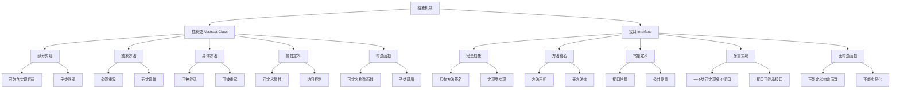

# 抽象类与接口

## 🎯 学习目标
- 理解抽象类和接口的概念和区别
- 掌握PHP中抽象类和接口的定义与使用
- 学会通过抽象类和接口实现多态
- 了解抽象类和接口的设计原则和最佳实践

## 📚 核心概念

### 抽象类与接口概述



### 抽象类 vs 接口对比

| 特性 | 抽象类 | 接口 |
|------|--------|------|
| 关键字 | abstract class | interface |
| 实例化 | 不能实例化 | 不能实例化 |
| 继承 | 单继承 | 多重实现 |
| 方法 | 可包含具体方法 | 只有方法签名 |
| 属性 | 可定义属性 | 只能定义常量 |
| 构造函数 | 可定义 | 不能定义 |
| 访问修饰符 | 各种修饰符 | 默认public |
| 使用场景 | 代码复用、模板方法 | 契约定义、多态 |

## 🔧 抽象类详解

### 基本抽象类
```php
<?php
// 抽象类 - 图形
abstract class Shape {
    // 属性
    protected $name;
    protected $color;
    
    // 构造函数
    public function __construct($name, $color = 'black') {
        $this->name = $name;
        $this->color = $color;
    }
    
    // 具体方法 - 所有子类共享
    public function getName() {
        return $this->name;
    }
    
    public function getColor() {
        return $this->color;
    }
    
    public function setColor($color) {
        $this->color = $color;
    }
    
    // 抽象方法 - 子类必须实现
    abstract public function area();
    abstract public function perimeter();
    
    // 具体方法 - 使用抽象方法
    public function displayInfo() {
        echo "图形: " . $this->name . "\n";
        echo "颜色: " . $this->color . "\n";
        echo "面积: " . $this->area() . "\n";
        echo "周长: " . $this->perimeter() . "\n";
    }
    
    // 模板方法 - 定义算法骨架
    public function draw() {
        echo "开始绘制 " . $this->name . "\n";
        $this->drawShape();
        echo "绘制完成\n";
    }
    
    // 抽象方法 - 子类实现具体绘制
    abstract protected function drawShape();
}

// 具体类 - 矩形
class Rectangle extends Shape {
    private $width;
    private $height;
    
    public function __construct($name, $width, $height, $color = 'black') {
        parent::__construct($name, $color);
        $this->width = $width;
        $this->height = $height;
    }
    
    // 实现抽象方法
    public function area() {
        return $this->width * $this->height;
    }
    
    public function perimeter() {
        return 2 * ($this->width + $this->height);
    }
    
    protected function drawShape() {
        echo "绘制矩形: {$this->width} x {$this->height}\n";
    }
    
    // 子类特有方法
    public function getWidth() {
        return $this->width;
    }
    
    public function getHeight() {
        return $this->height;
    }
}

// 具体类 - 圆形
class Circle extends Shape {
    private $radius;
    
    public function __construct($name, $radius, $color = 'black') {
        parent::__construct($name, $color);
        $this->radius = $radius;
    }
    
    // 实现抽象方法
    public function area() {
        return pi() * $this->radius * $this->radius;
    }
    
    public function perimeter() {
        return 2 * pi() * $this->radius;
    }
    
    protected function drawShape() {
        echo "绘制圆形: 半径 {$this->radius}\n";
    }
    
    // 子类特有方法
    public function getRadius() {
        return $this->radius;
    }
}

// 使用示例
echo "=== 抽象类示例 ===\n";

// 创建具体对象
$rectangle = new Rectangle("矩形1", 10, 5, "红色");
$circle = new Circle("圆形1", 7, "蓝色");

// 使用继承的方法
$rectangle->displayInfo();
echo "\n";
$rectangle->draw();

echo "\n";
$circle->displayInfo();
echo "\n";
$circle->draw();
?>
```

### 抽象类中的模板方法模式
```php
<?php
// 抽象类 - 数据处理模板
abstract class DataProcessor {
    protected $data;
    protected $result;
    
    public function __construct($data) {
        $this->data = $data;
        $this->result = null;
    }
    
    // 模板方法 - 定义处理流程
    public function process() {
        echo "开始数据处理...\n";
        
        // 1. 验证数据
        if (!$this->validateData()) {
            throw new Exception("数据验证失败");
        }
        
        // 2. 预处理数据
        $this->preprocessData();
        
        // 3. 处理数据（抽象方法）
        $this->result = $this->doProcess();
        
        // 4. 后处理数据
        $this->postprocessData();
        
        // 5. 记录处理结果
        $this->logResult();
        
        echo "数据处理完成\n";
        return $this->result;
    }
    
    // 具体方法 - 数据验证
    protected function validateData() {
        return !empty($this->data);
    }
    
    // 具体方法 - 预处理
    protected function preprocessData() {
        echo "预处理数据...\n";
        // 通用预处理逻辑
    }
    
    // 抽象方法 - 具体处理逻辑
    abstract protected function doProcess();
    
    // 具体方法 - 后处理
    protected function postprocessData() {
        echo "后处理数据...\n";
        // 通用后处理逻辑
    }
    
    // 具体方法 - 记录结果
    protected function logResult() {
        echo "处理结果: " . json_encode($this->result) . "\n";
    }
    
    // 获取结果
    public function getResult() {
        return $this->result;
    }
}

// 具体类 - 文本处理器
class TextProcessor extends DataProcessor {
    protected function doProcess() {
        echo "处理文本数据...\n";
        
        // 文本处理逻辑
        $processed = strtoupper($this->data);
        $processed = trim($processed);
        $processed = preg_replace('/\s+/', ' ', $processed);
        
        return $processed;
    }
}

// 具体类 - 数字处理器
class NumberProcessor extends DataProcessor {
    protected function doProcess() {
        echo "处理数字数据...\n";
        
        // 数字处理逻辑
        $numbers = array_map('intval', explode(',', $this->data));
        $sum = array_sum($numbers);
        $average = $sum / count($numbers);
        $max = max($numbers);
        $min = min($numbers);
        
        return [
            'numbers' => $numbers,
            'sum' => $sum,
            'average' => $average,
            'max' => $max,
            'min' => $min
        ];
    }
}

// 具体类 - JSON处理器
class JsonProcessor extends DataProcessor {
    protected function doProcess() {
        echo "处理JSON数据...\n";
        
        // JSON处理逻辑
        $decoded = json_decode($this->data, true);
        
        if (json_last_error() !== JSON_ERROR_NONE) {
            throw new Exception("JSON解析错误: " . json_last_error_msg());
        }
        
        // 添加处理时间戳
        $decoded['processed_at'] = date('Y-m-d H:i:s');
        $decoded['processor'] = 'JsonProcessor';
        
        return $decoded;
    }
}

// 使用示例
echo "=== 模板方法模式示例 ===\n";

try {
    // 文本处理
    $textProcessor = new TextProcessor("  hello   world   from   php  ");
    $textResult = $textProcessor->process();
    echo "文本处理结果: $textResult\n\n";
    
    // 数字处理
    $numberProcessor = new NumberProcessor("10,20,30,40,50");
    $numberResult = $numberProcessor->process();
    echo "数字处理结果: " . json_encode($numberResult) . "\n\n";
    
    // JSON处理
    $jsonProcessor = new JsonProcessor('{"name":"张三","age":25,"city":"北京"}');
    $jsonResult = $jsonProcessor->process();
    echo "JSON处理结果: " . json_encode($jsonResult, JSON_UNESCAPED_UNICODE) . "\n";
    
} catch (Exception $e) {
    echo "错误: " . $e->getMessage() . "\n";
}
?>
```

## 🔧 接口详解

### 基本接口
```php
<?php
// 接口 - 可播放
interface Playable {
    public function play();
    public function pause();
    public function stop();
    public function getDuration();
}

// 接口 - 可下载
interface Downloadable {
    public function download();
    public function getFileSize();
}

// 接口 - 可分享
interface Shareable {
    public function share($platform);
    public function getShareUrl();
}

// 类 - 音频文件（实现多个接口）
class AudioFile implements Playable, Downloadable, Shareable {
    private $filename;
    private $duration;
    private $fileSize;
    private $isPlaying;
    
    public function __construct($filename, $duration, $fileSize) {
        $this->filename = $filename;
        $this->duration = $duration;
        $this->fileSize = $fileSize;
        $this->isPlaying = false;
    }
    
    // 实现 Playable 接口
    public function play() {
        $this->isPlaying = true;
        return "播放音频: " . $this->filename;
    }
    
    public function pause() {
        $this->isPlaying = false;
        return "暂停音频: " . $this->filename;
    }
    
    public function stop() {
        $this->isPlaying = false;
        return "停止音频: " . $this->filename;
    }
    
    public function getDuration() {
        return $this->duration;
    }
    
    // 实现 Downloadable 接口
    public function download() {
        return "下载音频文件: " . $this->filename;
    }
    
    public function getFileSize() {
        return $this->fileSize;
    }
    
    // 实现 Shareable 接口
    public function share($platform) {
        return "分享音频到: " . $platform;
    }
    
    public function getShareUrl() {
        return "https://example.com/audio/" . $this->filename;
    }
    
    // 类特有方法
    public function getFilename() {
        return $this->filename;
    }
    
    public function isPlaying() {
        return $this->isPlaying;
    }
}

// 类 - 视频文件（实现多个接口）
class VideoFile implements Playable, Downloadable, Shareable {
    private $filename;
    private $duration;
    private $fileSize;
    private $resolution;
    private $isPlaying;
    
    public function __construct($filename, $duration, $fileSize, $resolution) {
        $this->filename = $filename;
        $this->duration = $duration;
        $this->fileSize = $fileSize;
        $this->resolution = $resolution;
        $this->isPlaying = false;
    }
    
    // 实现 Playable 接口
    public function play() {
        $this->isPlaying = true;
        return "播放视频: " . $this->filename . " (" . $this->resolution . ")";
    }
    
    public function pause() {
        $this->isPlaying = false;
        return "暂停视频: " . $this->filename;
    }
    
    public function stop() {
        $this->isPlaying = false;
        return "停止视频: " . $this->filename;
    }
    
    public function getDuration() {
        return $this->duration;
    }
    
    // 实现 Downloadable 接口
    public function download() {
        return "下载视频文件: " . $this->filename;
    }
    
    public function getFileSize() {
        return $this->fileSize;
    }
    
    // 实现 Shareable 接口
    public function share($platform) {
        return "分享视频到: " . $platform;
    }
    
    public function getShareUrl() {
        return "https://example.com/video/" . $this->filename;
    }
    
    // 类特有方法
    public function getFilename() {
        return $this->filename;
    }
    
    public function getResolution() {
        return $this->resolution;
    }
    
    public function isPlaying() {
        return $this->isPlaying;
    }
}

// 类 - 文档文件（只实现部分接口）
class DocumentFile implements Downloadable, Shareable {
    private $filename;
    private $fileSize;
    private $pages;
    
    public function __construct($filename, $fileSize, $pages) {
        $this->filename = $filename;
        $this->fileSize = $fileSize;
        $this->pages = $pages;
    }
    
    // 实现 Downloadable 接口
    public function download() {
        return "下载文档: " . $this->filename;
    }
    
    public function getFileSize() {
        return $this->fileSize;
    }
    
    // 实现 Shareable 接口
    public function share($platform) {
        return "分享文档到: " . $platform;
    }
    
    public function getShareUrl() {
        return "https://example.com/document/" . $this->filename;
    }
    
    // 类特有方法
    public function getFilename() {
        return $this->filename;
    }
    
    public function getPages() {
        return $this->pages;
    }
}

// 使用示例
echo "=== 接口示例 ===\n";

// 创建不同类型的文件
$audio = new AudioFile("song.mp3", 3.5, 5.2);
$video = new VideoFile("movie.mp4", 120, 1500, "1920x1080");
$document = new DocumentFile("report.pdf", 2.1, 25);

// 使用 Playable 接口
echo "=== 播放媒体 ===\n";
$playableFiles = [$audio, $video];
foreach ($playableFiles as $file) {
    echo $file->play() . "\n";
    echo "时长: " . $file->getDuration() . " 分钟\n";
    echo $file->pause() . "\n\n";
}

// 使用 Downloadable 接口
echo "=== 下载文件 ===\n";
$downloadableFiles = [$audio, $video, $document];
foreach ($downloadableFiles as $file) {
    echo $file->download() . "\n";
    echo "文件大小: " . $file->getFileSize() . " MB\n";
    echo "分享链接: " . $file->getShareUrl() . "\n\n";
}

// 使用 Shareable 接口
echo "=== 分享文件 ===\n";
$shareableFiles = [$audio, $video, $document];
$platforms = ['微信', '微博', 'QQ'];
foreach ($shareableFiles as $file) {
    foreach ($platforms as $platform) {
        echo $file->share($platform) . "\n";
    }
    echo "\n";
}
?>
```

### 接口继承
```php
<?php
// 基础接口 - 可读
interface Readable {
    public function read();
}

// 基础接口 - 可写
interface Writable {
    public function write($data);
}

// 基础接口 - 可删除
interface Deletable {
    public function delete();
}

// 扩展接口 - 文件操作（继承多个接口）
interface FileOperations extends Readable, Writable, Deletable {
    public function exists();
    public function getSize();
    public function getPath();
}

// 扩展接口 - 数据库操作
interface DatabaseOperations extends Readable, Writable, Deletable {
    public function connect();
    public function disconnect();
    public function query($sql);
}

// 扩展接口 - 缓存操作
interface CacheOperations extends Readable, Writable, Deletable {
    public function set($key, $value, $ttl = 0);
    public function get($key);
    public function has($key);
    public function clear();
}

// 具体类 - 文件系统
class FileSystem implements FileOperations {
    private $path;
    
    public function __construct($path) {
        $this->path = $path;
    }
    
    // 实现 Readable 接口
    public function read() {
        if (!$this->exists()) {
            throw new Exception("文件不存在: " . $this->path);
        }
        return file_get_contents($this->path);
    }
    
    // 实现 Writable 接口
    public function write($data) {
        return file_put_contents($this->path, $data);
    }
    
    // 实现 Deletable 接口
    public function delete() {
        if (!$this->exists()) {
            return false;
        }
        return unlink($this->path);
    }
    
    // 实现 FileOperations 接口
    public function exists() {
        return file_exists($this->path);
    }
    
    public function getSize() {
        return $this->exists() ? filesize($this->path) : 0;
    }
    
    public function getPath() {
        return $this->path;
    }
}

// 具体类 - 数据库系统
class DatabaseSystem implements DatabaseOperations {
    private $connection;
    private $host;
    private $database;
    
    public function __construct($host, $database) {
        $this->host = $host;
        $this->database = $database;
        $this->connection = null;
    }
    
    // 实现 DatabaseOperations 接口
    public function connect() {
        $this->connection = "连接到 {$this->host}/{$this->database}";
        return $this->connection;
    }
    
    public function disconnect() {
        $this->connection = null;
        return "断开数据库连接";
    }
    
    public function query($sql) {
        if (!$this->connection) {
            throw new Exception("数据库未连接");
        }
        return "执行SQL: $sql";
    }
    
    // 实现 Readable 接口
    public function read() {
        return $this->query("SELECT * FROM table");
    }
    
    // 实现 Writable 接口
    public function write($data) {
        return $this->query("INSERT INTO table VALUES ('$data')");
    }
    
    // 实现 Deletable 接口
    public function delete() {
        return $this->query("DELETE FROM table");
    }
}

// 具体类 - 缓存系统
class CacheSystem implements CacheOperations {
    private $cache;
    
    public function __construct() {
        $this->cache = [];
    }
    
    // 实现 CacheOperations 接口
    public function set($key, $value, $ttl = 0) {
        $this->cache[$key] = [
            'value' => $value,
            'ttl' => $ttl,
            'created' => time()
        ];
        return true;
    }
    
    public function get($key) {
        if (!$this->has($key)) {
            return null;
        }
        
        $item = $this->cache[$key];
        if ($item['ttl'] > 0 && (time() - $item['created']) > $item['ttl']) {
            unset($this->cache[$key]);
            return null;
        }
        
        return $item['value'];
    }
    
    public function has($key) {
        return isset($this->cache[$key]);
    }
    
    public function clear() {
        $this->cache = [];
        return true;
    }
    
    // 实现 Readable 接口
    public function read() {
        return $this->cache;
    }
    
    // 实现 Writable 接口
    public function write($data) {
        $this->cache = $data;
        return true;
    }
    
    // 实现 Deletable 接口
    public function delete() {
        return $this->clear();
    }
}

// 使用示例
echo "=== 接口继承示例 ===\n";

// 文件系统
$fileSystem = new FileSystem("test.txt");
echo "文件路径: " . $fileSystem->getPath() . "\n";
echo "文件存在: " . ($fileSystem->exists() ? "是" : "否") . "\n";

$fileSystem->write("Hello, World!");
echo "写入文件: " . $fileSystem->write("Hello, World!") . " 字节\n";
echo "文件大小: " . $fileSystem->getSize() . " 字节\n";
echo "读取文件: " . $fileSystem->read() . "\n";

// 数据库系统
$database = new DatabaseSystem("localhost", "testdb");
echo "连接数据库: " . $database->connect() . "\n";
echo "读取数据: " . $database->read() . "\n";
echo "写入数据: " . $database->write("新数据") . "\n";
echo "删除数据: " . $database->delete() . "\n";
echo "断开连接: " . $database->disconnect() . "\n";

// 缓存系统
$cache = new CacheSystem();
$cache->set("key1", "value1", 60);
$cache->set("key2", "value2", 0);
echo "缓存key1: " . $cache->get("key1") . "\n";
echo "缓存key2: " . $cache->get("key2") . "\n";
echo "缓存存在key1: " . ($cache->has("key1") ? "是" : "否") . "\n";
?>
```

## 🎯 实际应用

### 支付系统接口设计
```php
<?php
// 基础支付接口
interface PaymentInterface {
    public function processPayment($amount, $currency = 'CNY');
    public function refund($transactionId, $amount);
    public function getPaymentStatus($transactionId);
}

// 扩展接口 - 在线支付
interface OnlinePaymentInterface extends PaymentInterface {
    public function createOrder($orderData);
    public function handleCallback($callbackData);
    public function getPaymentUrl();
}

// 扩展接口 - 移动支付
interface MobilePaymentInterface extends PaymentInterface {
    public function scanQRCode($qrCode);
    public function sendPaymentRequest($phoneNumber, $amount);
    public function confirmPayment($verificationCode);
}

// 扩展接口 - 银行卡支付
interface BankCardPaymentInterface extends PaymentInterface {
    public function validateCard($cardNumber, $cvv, $expiryDate);
    public function authorizePayment($cardData, $amount);
    public function capturePayment($authorizationId);
}

// 支付宝实现
class AlipayPayment implements OnlinePaymentInterface {
    private $appId;
    private $privateKey;
    private $publicKey;
    
    public function __construct($appId, $privateKey, $publicKey) {
        $this->appId = $appId;
        $this->privateKey = $privateKey;
        $this->publicKey = $publicKey;
    }
    
    public function processPayment($amount, $currency = 'CNY') {
        echo "支付宝处理支付: ¥$amount\n";
        return [
            'status' => 'success',
            'transaction_id' => 'alipay_' . uniqid(),
            'amount' => $amount,
            'currency' => $currency
        ];
    }
    
    public function refund($transactionId, $amount) {
        echo "支付宝退款: $transactionId, ¥$amount\n";
        return [
            'status' => 'success',
            'refund_id' => 'refund_' . uniqid(),
            'amount' => $amount
        ];
    }
    
    public function getPaymentStatus($transactionId) {
        echo "查询支付宝支付状态: $transactionId\n";
        return 'completed';
    }
    
    public function createOrder($orderData) {
        echo "创建支付宝订单: " . json_encode($orderData) . "\n";
        return 'order_' . uniqid();
    }
    
    public function handleCallback($callbackData) {
        echo "处理支付宝回调: " . json_encode($callbackData) . "\n";
        return true;
    }
    
    public function getPaymentUrl() {
        return 'https://openapi.alipay.com/gateway.do';
    }
}

// 微信支付实现
class WechatPayment implements OnlinePaymentInterface, MobilePaymentInterface {
    private $appId;
    private $mchId;
    private $apiKey;
    
    public function __construct($appId, $mchId, $apiKey) {
        $this->appId = $appId;
        $this->mchId = $mchId;
        $this->apiKey = $apiKey;
    }
    
    public function processPayment($amount, $currency = 'CNY') {
        echo "微信支付处理支付: ¥$amount\n";
        return [
            'status' => 'success',
            'transaction_id' => 'wechat_' . uniqid(),
            'amount' => $amount,
            'currency' => $currency
        ];
    }
    
    public function refund($transactionId, $amount) {
        echo "微信支付退款: $transactionId, ¥$amount\n";
        return [
            'status' => 'success',
            'refund_id' => 'refund_' . uniqid(),
            'amount' => $amount
        ];
    }
    
    public function getPaymentStatus($transactionId) {
        echo "查询微信支付状态: $transactionId\n";
        return 'completed';
    }
    
    public function createOrder($orderData) {
        echo "创建微信支付订单: " . json_encode($orderData) . "\n";
        return 'order_' . uniqid();
    }
    
    public function handleCallback($callbackData) {
        echo "处理微信支付回调: " . json_encode($callbackData) . "\n";
        return true;
    }
    
    public function getPaymentUrl() {
        return 'https://api.mch.weixin.qq.com/pay/unifiedorder';
    }
    
    public function scanQRCode($qrCode) {
        echo "扫描微信二维码: $qrCode\n";
        return 'qr_' . uniqid();
    }
    
    public function sendPaymentRequest($phoneNumber, $amount) {
        echo "发送微信支付请求到: $phoneNumber, ¥$amount\n";
        return 'request_' . uniqid();
    }
    
    public function confirmPayment($verificationCode) {
        echo "确认微信支付: $verificationCode\n";
        return true;
    }
}

// 银行卡支付实现
class BankCardPayment implements BankCardPaymentInterface {
    private $merchantId;
    private $apiKey;
    
    public function __construct($merchantId, $apiKey) {
        $this->merchantId = $merchantId;
        $this->apiKey = $apiKey;
    }
    
    public function processPayment($amount, $currency = 'CNY') {
        echo "银行卡处理支付: ¥$amount\n";
        return [
            'status' => 'success',
            'transaction_id' => 'bank_' . uniqid(),
            'amount' => $amount,
            'currency' => $currency
        ];
    }
    
    public function refund($transactionId, $amount) {
        echo "银行卡退款: $transactionId, ¥$amount\n";
        return [
            'status' => 'success',
            'refund_id' => 'refund_' . uniqid(),
            'amount' => $amount
        ];
    }
    
    public function getPaymentStatus($transactionId) {
        echo "查询银行卡支付状态: $transactionId\n";
        return 'completed';
    }
    
    public function validateCard($cardNumber, $cvv, $expiryDate) {
        echo "验证银行卡: " . substr($cardNumber, 0, 4) . "****\n";
        return true;
    }
    
    public function authorizePayment($cardData, $amount) {
        echo "授权银行卡支付: ¥$amount\n";
        return 'auth_' . uniqid();
    }
    
    public function capturePayment($authorizationId) {
        echo "捕获银行卡支付: $authorizationId\n";
        return true;
    }
}

// 支付管理器
class PaymentManager {
    private $payments;
    
    public function __construct() {
        $this->payments = [];
    }
    
    public function addPayment(PaymentInterface $payment, $name) {
        $this->payments[$name] = $payment;
    }
    
    public function processPayment($paymentName, $amount, $currency = 'CNY') {
        if (!isset($this->payments[$paymentName])) {
            throw new Exception("支付方式不存在: $paymentName");
        }
        
        return $this->payments[$paymentName]->processPayment($amount, $currency);
    }
    
    public function refund($paymentName, $transactionId, $amount) {
        if (!isset($this->payments[$paymentName])) {
            throw new Exception("支付方式不存在: $paymentName");
        }
        
        return $this->payments[$paymentName]->refund($transactionId, $amount);
    }
    
    public function getPaymentStatus($paymentName, $transactionId) {
        if (!isset($this->payments[$paymentName])) {
            throw new Exception("支付方式不存在: $paymentName");
        }
        
        return $this->payments[$paymentName]->getPaymentStatus($transactionId);
    }
    
    public function getAvailablePayments() {
        return array_keys($this->payments);
    }
}

// 使用示例
echo "=== 支付系统接口设计示例 ===\n";

// 创建支付管理器
$paymentManager = new PaymentManager();

// 添加支付方式
$paymentManager->addPayment(new AlipayPayment('alipay_app_id', 'private_key', 'public_key'), 'alipay');
$paymentManager->addPayment(new WechatPayment('wechat_app_id', 'mch_id', 'api_key'), 'wechat');
$paymentManager->addPayment(new BankCardPayment('merchant_id', 'api_key'), 'bankcard');

// 处理支付
echo "可用支付方式: " . implode(', ', $paymentManager->getAvailablePayments()) . "\n\n";

// 支付宝支付
$alipayResult = $paymentManager->processPayment('alipay', 100.00);
echo "支付宝支付结果: " . json_encode($alipayResult) . "\n\n";

// 微信支付
$wechatResult = $paymentManager->processPayment('wechat', 200.00);
echo "微信支付结果: " . json_encode($wechatResult) . "\n\n";

// 银行卡支付
$bankResult = $paymentManager->processPayment('bankcard', 300.00);
echo "银行卡支付结果: " . json_encode($bankResult) . "\n\n";

// 退款
$refundResult = $paymentManager->refund('alipay', $alipayResult['transaction_id'], 50.00);
echo "退款结果: " . json_encode($refundResult) . "\n";
?>
```

## 📊 最佳实践

### 抽象类与接口选择原则
```php
<?php
// 1. 使用抽象类 - 当有共同实现时
abstract class Animal {
    protected $name;
    protected $age;
    
    public function __construct($name, $age) {
        $this->name = $name;
        $this->age = $age;
    }
    
    // 共同实现
    public function getName() {
        return $this->name;
    }
    
    public function getAge() {
        return $this->age;
    }
    
    // 抽象方法
    abstract public function makeSound();
    abstract public function move();
}

// 2. 使用接口 - 当定义契约时
interface Flyable {
    public function fly();
    public function land();
}

interface Swimmable {
    public function swim();
    public function dive();
}

// 3. 组合使用
class Duck extends Animal implements Flyable, Swimmable {
    public function makeSound() {
        return "嘎嘎";
    }
    
    public function move() {
        return "游泳";
    }
    
    public function fly() {
        return "飞行";
    }
    
    public function land() {
        return "降落";
    }
    
    public function swim() {
        return "游泳";
    }
    
    public function dive() {
        return "潜水";
    }
}

// 4. 接口隔离原则
interface Readable {
    public function read();
}

interface Writable {
    public function write($data);
}

interface Deletable {
    public function delete();
}

// 5. 依赖倒置原则
interface DataSource {
    public function getData();
    public function saveData($data);
}

class DatabaseSource implements DataSource {
    public function getData() {
        return "数据库数据";
    }
    
    public function saveData($data) {
        return "保存到数据库";
    }
}

class FileSource implements DataSource {
    public function getData() {
        return "文件数据";
    }
    
    public function saveData($data) {
        return "保存到文件";
    }
}

class DataService {
    private $source;
    
    public function __construct(DataSource $source) {
        $this->source = $source;
    }
    
    public function processData() {
        $data = $this->source->getData();
        // 处理数据
        $this->source->saveData($data);
    }
}

// 使用示例
$duck = new Duck("小鸭", 2);
echo $duck->makeSound() . "\n";
echo $duck->fly() . "\n";
echo $duck->swim() . "\n";

$dbService = new DataService(new DatabaseSource());
$fileService = new DataService(new FileSource());

$dbService->processData();
$fileService->processData();
?>
```

## 🎓 学习建议

### 费曼学习法应用
1. **选择概念**: 选择抽象类和接口中的核心概念
2. **简化解释**: 用简单语言解释抽象类和接口的区别
3. **识别盲点**: 发现理解不深入的地方
4. **重新学习**: 针对盲点进行深入学习

### 刻意练习重点
1. **概念理解**: 深入理解抽象类和接口的概念
2. **实际应用**: 在实际项目中应用抽象类和接口
3. **设计原则**: 学习抽象类和接口的设计原则
4. **最佳实践**: 掌握抽象类和接口的最佳实践

## 🔗 相关链接
- [[01-类与对象基础|类与对象基础]]
- [[02-属性与方法|属性与方法]]
- [[03-构造函数与析构函数|构造函数与析构函数]]
- [[04-继承与多态|继承与多态]]
- [[05-封装与访问控制|封装与访问控制]]
