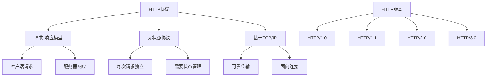

# HTTP协议基础

## 🎯 学习目标
- 掌握HTTP协议的基本概念和工作原理
- 理解HTTP请求和响应的结构
- 学会在PHP中处理HTTP协议
- 了解HTTP状态码和头信息的使用

## 📚 核心概念

### HTTP协议概述



### HTTP请求方法

| 方法 | 描述 | 幂等性 | 安全性 | 常用场景 |
|------|------|--------|--------|----------|
| GET | 获取资源 | 是 | 是 | 查询数据 |
| POST | 创建资源 | 否 | 否 | 提交表单 |
| PUT | 更新资源 | 是 | 否 | 完整更新 |
| PATCH | 部分更新 | 否 | 否 | 部分更新 |
| DELETE | 删除资源 | 是 | 否 | 删除数据 |
| HEAD | 获取头信息 | 是 | 是 | 检查资源 |
| OPTIONS | 获取选项 | 是 | 是 | 预检请求 |

## 🔧 HTTP请求处理

### 请求信息获取
```php
<?php
// 1. 获取请求方法
function getRequestMethod() {
    return $_SERVER['REQUEST_METHOD'] ?? 'GET';
}

// 2. 获取请求URI
function getRequestUri() {
    return $_SERVER['REQUEST_URI'] ?? '/';
}

// 3. 获取请求头信息
function getRequestHeaders() {
    if (function_exists('getallheaders')) {
        return getallheaders();
    }
    
    $headers = [];
    foreach ($_SERVER as $key => $value) {
        if (strpos($key, 'HTTP_') === 0) {
            $header = str_replace('_', '-', substr($key, 5));
            $headers[$header] = $value;
        }
    }
    
    return $headers;
}

// 4. 获取特定请求头
function getRequestHeader($name, $default = null) {
    $headers = getRequestHeaders();
    $name = strtoupper(str_replace('-', '_', $name));
    
    return $headers[$name] ?? $default;
}

// 5. 获取请求体
function getRequestBody() {
    return file_get_contents('php://input');
}

// 6. 解析JSON请求体
function getJsonRequestBody() {
    $body = getRequestBody();
    if (empty($body)) {
        return null;
    }
    
    $data = json_decode($body, true);
    if (json_last_error() !== JSON_ERROR_NONE) {
        throw new Exception('Invalid JSON in request body');
    }
    
    return $data;
}

// 7. 获取查询参数
function getQueryParams() {
    return $_GET;
}

// 8. 获取POST数据
function getPostData() {
    return $_POST;
}

// 9. 获取客户端IP
function getClientIp() {
    $ipKeys = ['HTTP_X_FORWARDED_FOR', 'HTTP_X_REAL_IP', 'HTTP_CLIENT_IP', 'REMOTE_ADDR'];
    
    foreach ($ipKeys as $key) {
        if (!empty($_SERVER[$key])) {
            $ip = $_SERVER[$key];
            if (strpos($ip, ',') !== false) {
                $ip = trim(explode(',', $ip)[0]);
            }
            
            if (filter_var($ip, FILTER_VALIDATE_IP, FILTER_FLAG_NO_PRIV_RANGE | FILTER_FLAG_NO_RES_RANGE)) {
                return $ip;
            }
        }
    }
    
    return $_SERVER['REMOTE_ADDR'] ?? '0.0.0.0';
}

// 10. 获取用户代理
function getUserAgent() {
    return $_SERVER['HTTP_USER_AGENT'] ?? '';
}

// 使用示例
echo "=== HTTP请求信息示例 ===\n";

try {
    echo "请求方法: " . getRequestMethod() . "\n";
    echo "请求URI: " . getRequestUri() . "\n";
    echo "客户端IP: " . getClientIp() . "\n";
    echo "用户代理: " . getUserAgent() . "\n";
    
    $headers = getRequestHeaders();
    echo "请求头数量: " . count($headers) . "\n";
    
    foreach ($headers as $name => $value) {
        echo "  $name: $value\n";
    }
    
    $queryParams = getQueryParams();
    if (!empty($queryParams)) {
        echo "查询参数: " . json_encode($queryParams) . "\n";
    }
    
} catch (Exception $e) {
    echo "错误: " . $e->getMessage() . "\n";
}
?>
```

### HTTP响应处理
```php
<?php
// 1. 设置响应状态码
function setResponseStatus($code, $message = '') {
    $statusMessages = [
        200 => 'OK',
        201 => 'Created',
        204 => 'No Content',
        301 => 'Moved Permanently',
        302 => 'Found',
        304 => 'Not Modified',
        400 => 'Bad Request',
        401 => 'Unauthorized',
        403 => 'Forbidden',
        404 => 'Not Found',
        405 => 'Method Not Allowed',
        500 => 'Internal Server Error',
        502 => 'Bad Gateway',
        503 => 'Service Unavailable'
    ];
    
    $message = $message ?: ($statusMessages[$code] ?? 'Unknown');
    
    http_response_code($code);
    header("HTTP/1.1 $code $message");
}

// 2. 设置响应头
function setResponseHeader($name, $value, $replace = true) {
    header("$name: $value", $replace);
}

// 3. 设置多个响应头
function setResponseHeaders($headers) {
    foreach ($headers as $name => $value) {
        setResponseHeader($name, $value);
    }
}

// 4. 设置内容类型
function setContentType($type, $charset = 'utf-8') {
    setResponseHeader('Content-Type', "$type; charset=$charset");
}

// 5. 设置缓存控制
function setCacheControl($maxAge = 3600, $public = true) {
    $directive = $public ? 'public' : 'private';
    setResponseHeader('Cache-Control', "$directive, max-age=$maxAge");
    setResponseHeader('Expires', gmdate('D, d M Y H:i:s', time() + $maxAge) . ' GMT');
}

// 6. 禁用缓存
function disableCache() {
    setResponseHeaders([
        'Cache-Control' => 'no-cache, no-store, must-revalidate',
        'Pragma' => 'no-cache',
        'Expires' => '0'
    ]);
}

// 7. 设置CORS头
function setCorsHeaders($origin = '*', $methods = 'GET, POST, PUT, DELETE', $headers = 'Content-Type, Authorization') {
    setResponseHeaders([
        'Access-Control-Allow-Origin' => $origin,
        'Access-Control-Allow-Methods' => $methods,
        'Access-Control-Allow-Headers' => $headers,
        'Access-Control-Max-Age' => '86400'
    ]);
}

// 8. JSON响应
function jsonResponse($data, $status = 200) {
    setResponseStatus($status);
    setContentType('application/json');
    echo json_encode($data, JSON_UNESCAPED_UNICODE);
    exit;
}

// 9. XML响应
function xmlResponse($data, $status = 200) {
    setResponseStatus($status);
    setContentType('application/xml');
    
    $xml = new SimpleXMLElement('<response/>');
    arrayToXml($data, $xml);
    
    echo $xml->asXML();
    exit;
}

// 10. 数组转XML辅助函数
function arrayToXml($array, $xml) {
    foreach ($array as $key => $value) {
        if (is_array($value)) {
            $subnode = $xml->addChild($key);
            arrayToXml($value, $subnode);
        } else {
            $xml->addChild($key, htmlspecialchars($value));
        }
    }
}

// 11. 重定向响应
function redirect($url, $permanent = false) {
    $status = $permanent ? 301 : 302;
    setResponseStatus($status);
    setResponseHeader('Location', $url);
    exit;
}

// 12. 错误响应
function errorResponse($message, $status = 400, $details = []) {
    $response = [
        'error' => true,
        'message' => $message,
        'status' => $status
    ];
    
    if (!empty($details)) {
        $response['details'] = $details;
    }
    
    jsonResponse($response, $status);
}

// 使用示例
echo "=== HTTP响应处理示例 ===\n";

try {
    // 设置响应状态码
    setResponseStatus(200);
    echo "响应状态码已设置为 200\n";
    
    // 设置响应头
    setResponseHeaders([
        'X-Powered-By' => 'PHP',
        'X-Version' => '1.0'
    ]);
    echo "响应头已设置\n";
    
    // 设置内容类型
    setContentType('text/html');
    echo "内容类型已设置为 text/html\n";
    
    // 设置缓存控制
    setCacheControl(3600, true);
    echo "缓存控制已设置\n";
    
    // 设置CORS头
    setCorsHeaders();
    echo "CORS头已设置\n";
    
    // JSON响应示例（注释掉避免退出）
    // jsonResponse(['message' => 'Success', 'data' => ['id' => 1, 'name' => 'Test']]);
    
    // 重定向示例（注释掉避免退出）
    // redirect('https://example.com');
    
} catch (Exception $e) {
    echo "错误: " . $e->getMessage() . "\n";
}
?>
```

## 🔧 HTTP客户端

### HTTP请求发送
```php
<?php
// 1. 使用cURL发送GET请求
function httpGet($url, $headers = []) {
    $ch = curl_init();
    
    curl_setopt_array($ch, [
        CURLOPT_URL => $url,
        CURLOPT_RETURNTRANSFER => true,
        CURLOPT_FOLLOWLOCATION => true,
        CURLOPT_TIMEOUT => 30,
        CURLOPT_USERAGENT => 'PHP HTTP Client/1.0'
    ]);
    
    if (!empty($headers)) {
        curl_setopt($ch, CURLOPT_HTTPHEADER, $headers);
    }
    
    $response = curl_exec($ch);
    $httpCode = curl_getinfo($ch, CURLINFO_HTTP_CODE);
    $error = curl_error($ch);
    
    curl_close($ch);
    
    if ($error) {
        throw new Exception("cURL Error: $error");
    }
    
    return [
        'status' => $httpCode,
        'body' => $response
    ];
}

// 2. 使用cURL发送POST请求
function httpPost($url, $data = [], $headers = []) {
    $ch = curl_init();
    
    curl_setopt_array($ch, [
        CURLOPT_URL => $url,
        CURLOPT_RETURNTRANSFER => true,
        CURLOPT_POST => true,
        CURLOPT_POSTFIELDS => is_array($data) ? http_build_query($data) : $data,
        CURLOPT_TIMEOUT => 30,
        CURLOPT_USERAGENT => 'PHP HTTP Client/1.0'
    ]);
    
    if (!empty($headers)) {
        curl_setopt($ch, CURLOPT_HTTPHEADER, $headers);
    }
    
    $response = curl_exec($ch);
    $httpCode = curl_getinfo($ch, CURLINFO_HTTP_CODE);
    $error = curl_error($ch);
    
    curl_close($ch);
    
    if ($error) {
        throw new Exception("cURL Error: $error");
    }
    
    return [
        'status' => $httpCode,
        'body' => $response
    ];
}

// 3. 发送JSON请求
function httpPostJson($url, $data, $headers = []) {
    $headers[] = 'Content-Type: application/json';
    return httpPost($url, json_encode($data), $headers);
}

// 4. HTTP客户端类
class HttpClient {
    private $baseUrl;
    private $defaultHeaders;
    private $timeout;
    
    public function __construct($baseUrl = '', $options = []) {
        $this->baseUrl = rtrim($baseUrl, '/');
        $this->defaultHeaders = $options['headers'] ?? [];
        $this->timeout = $options['timeout'] ?? 30;
    }
    
    // 发送请求
    public function request($method, $path, $options = []) {
        $url = $this->baseUrl . '/' . ltrim($path, '/');
        $headers = array_merge($this->defaultHeaders, $options['headers'] ?? []);
        $data = $options['data'] ?? null;
        
        $ch = curl_init();
        
        curl_setopt_array($ch, [
            CURLOPT_URL => $url,
            CURLOPT_RETURNTRANSFER => true,
            CURLOPT_FOLLOWLOCATION => true,
            CURLOPT_TIMEOUT => $this->timeout,
            CURLOPT_USERAGENT => 'PHP HTTP Client/1.0',
            CURLOPT_CUSTOMREQUEST => strtoupper($method)
        ]);
        
        if (!empty($headers)) {
            curl_setopt($ch, CURLOPT_HTTPHEADER, $headers);
        }
        
        if ($data !== null) {
            curl_setopt($ch, CURLOPT_POSTFIELDS, $data);
        }
        
        $response = curl_exec($ch);
        $httpCode = curl_getinfo($ch, CURLINFO_HTTP_CODE);
        $info = curl_getinfo($ch);
        $error = curl_error($ch);
        
        curl_close($ch);
        
        if ($error) {
            throw new Exception("HTTP Request Error: $error");
        }
        
        return [
            'status' => $httpCode,
            'body' => $response,
            'info' => $info
        ];
    }
    
    // GET请求
    public function get($path, $headers = []) {
        return $this->request('GET', $path, ['headers' => $headers]);
    }
    
    // POST请求
    public function post($path, $data = null, $headers = []) {
        return $this->request('POST', $path, ['data' => $data, 'headers' => $headers]);
    }
    
    // PUT请求
    public function put($path, $data = null, $headers = []) {
        return $this->request('PUT', $path, ['data' => $data, 'headers' => $headers]);
    }
    
    // DELETE请求
    public function delete($path, $headers = []) {
        return $this->request('DELETE', $path, ['headers' => $headers]);
    }
    
    // JSON请求
    public function postJson($path, $data, $headers = []) {
        $headers[] = 'Content-Type: application/json';
        return $this->post($path, json_encode($data), $headers);
    }
}

// 使用示例
echo "=== HTTP客户端示例 ===\n";

try {
    // 创建HTTP客户端
    $client = new HttpClient('https://httpbin.org', [
        'headers' => ['User-Agent: PHP Test Client'],
        'timeout' => 10
    ]);
    
    // 发送GET请求
    $response = $client->get('/get');
    echo "GET请求状态: " . $response['status'] . "\n";
    echo "响应长度: " . strlen($response['body']) . " 字节\n";
    
    // 发送POST请求
    $postData = ['name' => 'test', 'value' => '123'];
    $response = $client->post('/post', http_build_query($postData));
    echo "POST请求状态: " . $response['status'] . "\n";
    
    // 发送JSON请求
    $jsonData = ['message' => 'Hello World', 'timestamp' => time()];
    $response = $client->postJson('/post', $jsonData);
    echo "JSON请求状态: " . $response['status'] . "\n";
    
} catch (Exception $e) {
    echo "错误: " . $e->getMessage() . "\n";
}
?>
```

## 🎯 实际应用

### HTTP路由器
```php
<?php
// HTTP路由器类
class HttpRouter {
    private $routes;
    private $middlewares;
    
    public function __construct() {
        $this->routes = [];
        $this->middlewares = [];
    }
    
    // 添加路由
    public function addRoute($method, $path, $handler) {
        $method = strtoupper($method);
        $pattern = $this->pathToPattern($path);
        
        $this->routes[] = [
            'method' => $method,
            'pattern' => $pattern,
            'path' => $path,
            'handler' => $handler
        ];
    }
    
    // GET路由
    public function get($path, $handler) {
        $this->addRoute('GET', $path, $handler);
    }
    
    // POST路由
    public function post($path, $handler) {
        $this->addRoute('POST', $path, $handler);
    }
    
    // PUT路由
    public function put($path, $handler) {
        $this->addRoute('PUT', $path, $handler);
    }
    
    // DELETE路由
    public function delete($path, $handler) {
        $this->addRoute('DELETE', $path, $handler);
    }
    
    // 添加中间件
    public function middleware($middleware) {
        $this->middlewares[] = $middleware;
    }
    
    // 路径转换为正则表达式
    private function pathToPattern($path) {
        $pattern = preg_replace('/\{([^}]+)\}/', '(?P<$1>[^/]+)', $path);
        return '#^' . $pattern . '$#';
    }
    
    // 处理请求
    public function handle() {
        $method = $_SERVER['REQUEST_METHOD'];
        $path = parse_url($_SERVER['REQUEST_URI'], PHP_URL_PATH);
        
        // 执行中间件
        foreach ($this->middlewares as $middleware) {
            $result = $middleware();
            if ($result === false) {
                return;
            }
        }
        
        // 匹配路由
        foreach ($this->routes as $route) {
            if ($route['method'] === $method && preg_match($route['pattern'], $path, $matches)) {
                // 提取路径参数
                $params = array_filter($matches, 'is_string', ARRAY_FILTER_USE_KEY);
                
                // 调用处理器
                if (is_callable($route['handler'])) {
                    call_user_func($route['handler'], $params);
                } else {
                    echo "Handler not callable\n";
                }
                return;
            }
        }
        
        // 404 Not Found
        setResponseStatus(404);
        echo "404 Not Found\n";
    }
}

// 使用示例
echo "=== HTTP路由器示例 ===\n";

try {
    $router = new HttpRouter();
    
    // 添加中间件
    $router->middleware(function() {
        echo "中间件执行\n";
        return true;
    });
    
    // 添加路由
    $router->get('/', function($params) {
        echo "首页\n";
    });
    
    $router->get('/user/{id}', function($params) {
        echo "用户ID: " . $params['id'] . "\n";
    });
    
    $router->post('/user', function($params) {
        echo "创建用户\n";
    });
    
    $router->put('/user/{id}', function($params) {
        echo "更新用户ID: " . $params['id'] . "\n";
    });
    
    $router->delete('/user/{id}', function($params) {
        echo "删除用户ID: " . $params['id'] . "\n";
    });
    
    // 模拟请求处理
    $_SERVER['REQUEST_METHOD'] = 'GET';
    $_SERVER['REQUEST_URI'] = '/user/123';
    
    echo "处理请求: GET /user/123\n";
    $router->handle();
    
} catch (Exception $e) {
    echo "错误: " . $e->getMessage() . "\n";
}
?>
```

## 📊 最佳实践

### HTTP最佳实践
```php
<?php
// HTTP最佳实践

// 1. 安全的HTTP头设置
function setSecurityHeaders() {
    setResponseHeaders([
        'X-Content-Type-Options' => 'nosniff',
        'X-Frame-Options' => 'DENY',
        'X-XSS-Protection' => '1; mode=block',
        'Strict-Transport-Security' => 'max-age=31536000; includeSubDomains',
        'Content-Security-Policy' => "default-src 'self'",
        'Referrer-Policy' => 'strict-origin-when-cross-origin'
    ]);
}

// 2. HTTP状态码最佳实践
class HttpStatus {
    const OK = 200;
    const CREATED = 201;
    const NO_CONTENT = 204;
    const BAD_REQUEST = 400;
    const UNAUTHORIZED = 401;
    const FORBIDDEN = 403;
    const NOT_FOUND = 404;
    const METHOD_NOT_ALLOWED = 405;
    const INTERNAL_SERVER_ERROR = 500;
    
    public static function getMessage($code) {
        $messages = [
            200 => 'OK',
            201 => 'Created',
            204 => 'No Content',
            400 => 'Bad Request',
            401 => 'Unauthorized',
            403 => 'Forbidden',
            404 => 'Not Found',
            405 => 'Method Not Allowed',
            500 => 'Internal Server Error'
        ];
        
        return $messages[$code] ?? 'Unknown Status';
    }
}

// 3. 内容协商
function negotiateContent() {
    $accept = $_SERVER['HTTP_ACCEPT'] ?? '';
    
    if (strpos($accept, 'application/json') !== false) {
        return 'json';
    } elseif (strpos($accept, 'application/xml') !== false) {
        return 'xml';
    } elseif (strpos($accept, 'text/html') !== false) {
        return 'html';
    }
    
    return 'json'; // 默认返回JSON
}

// 4. 响应格式化
function formatResponse($data, $format = null) {
    $format = $format ?: negotiateContent();
    
    switch ($format) {
        case 'json':
            setContentType('application/json');
            return json_encode($data, JSON_UNESCAPED_UNICODE);
            
        case 'xml':
            setContentType('application/xml');
            $xml = new SimpleXMLElement('<response/>');
            arrayToXml($data, $xml);
            return $xml->asXML();
            
        case 'html':
            setContentType('text/html');
            return '<pre>' . htmlspecialchars(print_r($data, true)) . '</pre>';
            
        default:
            return json_encode($data);
    }
}

// 使用示例
echo "=== HTTP最佳实践示例 ===\n";

try {
    // 设置安全头
    setSecurityHeaders();
    echo "安全头已设置\n";
    
    // 状态码使用
    echo "状态码 " . HttpStatus::OK . ": " . HttpStatus::getMessage(HttpStatus::OK) . "\n";
    echo "状态码 " . HttpStatus::NOT_FOUND . ": " . HttpStatus::getMessage(HttpStatus::NOT_FOUND) . "\n";
    
    // 内容协商
    $contentType = negotiateContent();
    echo "协商的内容类型: $contentType\n";
    
    // 响应格式化
    $data = ['message' => 'Hello World', 'timestamp' => time()];
    $response = formatResponse($data, 'json');
    echo "格式化响应: $response\n";
    
} catch (Exception $e) {
    echo "错误: " . $e->getMessage() . "\n";
}
?>
```

## 🎓 学习建议

### 费曼学习法应用
1. **选择概念**: 选择HTTP协议中的核心概念
2. **简化解释**: 用简单语言解释HTTP的工作原理
3. **识别盲点**: 发现理解不深入的地方
4. **重新学习**: 针对盲点进行深入学习

### 刻意练习重点
1. **协议理解**: 深入理解HTTP协议的工作机制
2. **实际应用**: 在实际项目中应用HTTP处理
3. **性能优化**: 学习HTTP性能优化技巧
4. **安全防护**: 掌握HTTP安全防护措施

## 🔗 相关链接
- [[02-表单处理|表单处理]]
- [[03-会话管理|会话管理]]
- [[04-Cookie操作|Cookie操作]]
- [[05-请求与响应|请求与响应]]
- [[06-路由与URL重写|路由与URL重写]]
- [[07-Web开发最佳实践|Web开发最佳实践]]
