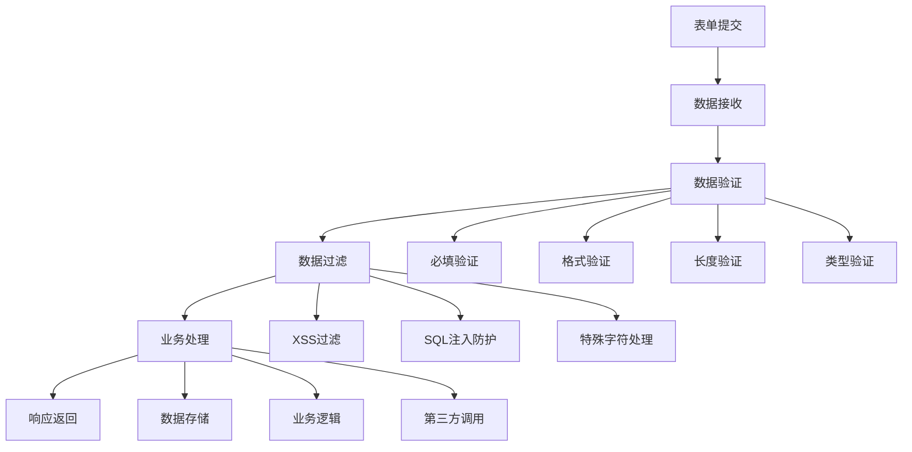

# 表单处理

## 🎯 学习目标
- 掌握HTML表单的创建和处理
- 理解表单数据的验证和过滤
- 学会防范表单安全威胁
- 了解文件上传表单的处理

## 📚 核心概念

### 表单处理流程



## 🔧 基本表单处理

### 表单创建和接收
```php
<?php
// 1. 创建HTML表单
function createForm($action = '', $method = 'POST', $enctype = 'application/x-www-form-urlencoded') {
    $html = "<form action='$action' method='$method' enctype='$enctype'>\n";
    $html .= "  <input type='text' name='username' placeholder='用户名' required>\n";
    $html .= "  <input type='email' name='email' placeholder='邮箱' required>\n";
    $html .= "  <input type='password' name='password' placeholder='密码' required>\n";
    $html .= "  <textarea name='message' placeholder='留言'></textarea>\n";
    $html .= "  <input type='submit' value='提交'>\n";
    $html .= "</form>\n";
    
    return $html;
}

// 2. 获取表单数据
function getFormData($method = 'POST') {
    switch (strtoupper($method)) {
        case 'GET':
            return $_GET;
        case 'POST':
            return $_POST;
        default:
            return [];
    }
}

// 3. 检查表单是否提交
function isFormSubmitted($method = 'POST') {
    $data = getFormData($method);
    return !empty($data);
}

// 4. 获取特定字段值
function getFieldValue($fieldName, $method = 'POST', $default = '') {
    $data = getFormData($method);
    return $data[$fieldName] ?? $default;
}

// 5. 基本表单处理器
class FormHandler {
    private $data;
    private $errors;
    private $rules;
    
    public function __construct($data = null) {
        $this->data = $data ?: $_POST;
        $this->errors = [];
        $this->rules = [];
    }
    
    // 添加验证规则
    public function addRule($field, $rule, $message = '') {
        if (!isset($this->rules[$field])) {
            $this->rules[$field] = [];
        }
        
        $this->rules[$field][] = [
            'rule' => $rule,
            'message' => $message ?: "字段 $field 验证失败"
        ];
        
        return $this;
    }
    
    // 验证数据
    public function validate() {
        $this->errors = [];
        
        foreach ($this->rules as $field => $rules) {
            $value = $this->data[$field] ?? '';
            
            foreach ($rules as $rule) {
                if (!$this->applyRule($value, $rule['rule'])) {
                    $this->errors[$field] = $rule['message'];
                    break; // 一个字段只显示第一个错误
                }
            }
        }
        
        return empty($this->errors);
    }
    
    // 应用验证规则
    private function applyRule($value, $rule) {
        if (is_callable($rule)) {
            return $rule($value);
        }
        
        switch ($rule) {
            case 'required':
                return !empty($value);
            case 'email':
                return filter_var($value, FILTER_VALIDATE_EMAIL) !== false;
            case 'numeric':
                return is_numeric($value);
            case 'alpha':
                return ctype_alpha($value);
            case 'alphanumeric':
                return ctype_alnum($value);
            default:
                if (strpos($rule, 'min:') === 0) {
                    $min = (int)substr($rule, 4);
                    return strlen($value) >= $min;
                }
                if (strpos($rule, 'max:') === 0) {
                    $max = (int)substr($rule, 4);
                    return strlen($value) <= $max;
                }
                return true;
        }
    }
    
    // 获取错误信息
    public function getErrors() {
        return $this->errors;
    }
    
    // 获取处理后的数据
    public function getData() {
        return $this->data;
    }
    
    // 获取特定字段值
    public function get($field, $default = '') {
        return $this->data[$field] ?? $default;
    }
}

// 使用示例
echo "=== 基本表单处理示例 ===\n";

try {
    // 模拟表单数据
    $_POST = [
        'username' => 'testuser',
        'email' => 'test@example.com',
        'password' => '123456',
        'message' => 'Hello World'
    ];
    
    // 检查表单是否提交
    if (isFormSubmitted()) {
        echo "表单已提交\n";
        
        // 创建表单处理器
        $form = new FormHandler();
        
        // 添加验证规则
        $form->addRule('username', 'required', '用户名不能为空')
             ->addRule('username', 'min:3', '用户名至少3个字符')
             ->addRule('email', 'required', '邮箱不能为空')
             ->addRule('email', 'email', '邮箱格式不正确')
             ->addRule('password', 'required', '密码不能为空')
             ->addRule('password', 'min:6', '密码至少6个字符');
        
        // 验证数据
        if ($form->validate()) {
            echo "表单验证通过\n";
            echo "用户名: " . $form->get('username') . "\n";
            echo "邮箱: " . $form->get('email') . "\n";
        } else {
            echo "表单验证失败:\n";
            foreach ($form->getErrors() as $field => $error) {
                echo "  $field: $error\n";
            }
        }
    }
    
} catch (Exception $e) {
    echo "错误: " . $e->getMessage() . "\n";
}
?>
```

### 数据验证和过滤
```php
<?php
// 1. 数据验证器类
class DataValidator {
    private $rules = [];
    
    // 添加验证规则
    public function rule($field, $rules, $message = '') {
        $this->rules[$field] = [
            'rules' => is_array($rules) ? $rules : [$rules],
            'message' => $message
        ];
        return $this;
    }
    
    // 验证数据
    public function validate($data) {
        $errors = [];
        
        foreach ($this->rules as $field => $config) {
            $value = $data[$field] ?? '';
            $rules = $config['rules'];
            
            foreach ($rules as $rule) {
                if (!$this->validateRule($value, $rule)) {
                    $errors[$field] = $config['message'] ?: "字段 $field 验证失败";
                    break;
                }
            }
        }
        
        return [
            'valid' => empty($errors),
            'errors' => $errors
        ];
    }
    
    // 验证单个规则
    private function validateRule($value, $rule) {
        if (is_callable($rule)) {
            return $rule($value);
        }
        
        if (is_array($rule)) {
            $ruleName = $rule[0];
            $params = array_slice($rule, 1);
        } else {
            $parts = explode(':', $rule);
            $ruleName = $parts[0];
            $params = isset($parts[1]) ? explode(',', $parts[1]) : [];
        }
        
        switch ($ruleName) {
            case 'required':
                return !empty($value);
            case 'email':
                return filter_var($value, FILTER_VALIDATE_EMAIL) !== false;
            case 'url':
                return filter_var($value, FILTER_VALIDATE_URL) !== false;
            case 'numeric':
                return is_numeric($value);
            case 'integer':
                return filter_var($value, FILTER_VALIDATE_INT) !== false;
            case 'float':
                return filter_var($value, FILTER_VALIDATE_FLOAT) !== false;
            case 'alpha':
                return ctype_alpha($value);
            case 'alphanumeric':
                return ctype_alnum($value);
            case 'min':
                return strlen($value) >= (int)$params[0];
            case 'max':
                return strlen($value) <= (int)$params[0];
            case 'between':
                $len = strlen($value);
                return $len >= (int)$params[0] && $len <= (int)$params[1];
            case 'regex':
                return preg_match($params[0], $value);
            case 'in':
                return in_array($value, $params);
            case 'not_in':
                return !in_array($value, $params);
            default:
                return true;
        }
    }
}

// 2. 数据过滤器类
class DataFilter {
    // 过滤字符串
    public static function string($value, $options = []) {
        $value = trim($value);
        
        if ($options['strip_tags'] ?? true) {
            $value = strip_tags($value);
        }
        
        if ($options['escape_html'] ?? true) {
            $value = htmlspecialchars($value, ENT_QUOTES, 'UTF-8');
        }
        
        return $value;
    }
    
    // 过滤邮箱
    public static function email($value) {
        return filter_var($value, FILTER_SANITIZE_EMAIL);
    }
    
    // 过滤URL
    public static function url($value) {
        return filter_var($value, FILTER_SANITIZE_URL);
    }
    
    // 过滤整数
    public static function integer($value) {
        return filter_var($value, FILTER_SANITIZE_NUMBER_INT);
    }
    
    // 过滤浮点数
    public static function float($value) {
        return filter_var($value, FILTER_SANITIZE_NUMBER_FLOAT, FILTER_FLAG_ALLOW_FRACTION);
    }
    
    // 移除特殊字符
    public static function alphanumeric($value) {
        return preg_replace('/[^a-zA-Z0-9]/', '', $value);
    }
    
    // 批量过滤
    public static function batch($data, $filters) {
        $filtered = [];
        
        foreach ($data as $key => $value) {
            if (isset($filters[$key])) {
                $filter = $filters[$key];
                if (is_callable($filter)) {
                    $filtered[$key] = $filter($value);
                } elseif (method_exists(self::class, $filter)) {
                    $filtered[$key] = self::$filter($value);
                } else {
                    $filtered[$key] = $value;
                }
            } else {
                $filtered[$key] = $value;
            }
        }
        
        return $filtered;
    }
}

// 使用示例
echo "=== 数据验证和过滤示例 ===\n";

try {
    // 测试数据
    $data = [
        'username' => '  testuser123  ',
        'email' => 'test@example.com',
        'age' => '25',
        'website' => 'https://example.com',
        'bio' => '<script>alert("xss")</script>Hello World'
    ];
    
    // 数据验证
    $validator = new DataValidator();
    $validator->rule('username', ['required', 'min:3', 'max:20'], '用户名必须在3-20个字符之间')
              ->rule('email', ['required', 'email'], '邮箱格式不正确')
              ->rule('age', ['required', 'integer'], '年龄必须是整数')
              ->rule('website', 'url', '网站地址格式不正确');
    
    $validation = $validator->validate($data);
    
    if ($validation['valid']) {
        echo "数据验证通过\n";
        
        // 数据过滤
        $filters = [
            'username' => 'alphanumeric',
            'email' => 'email',
            'age' => 'integer',
            'website' => 'url',
            'bio' => function($value) {
                return DataFilter::string($value, ['strip_tags' => true, 'escape_html' => true]);
            }
        ];
        
        $filtered = DataFilter::batch($data, $filters);
        
        echo "过滤后的数据:\n";
        foreach ($filtered as $key => $value) {
            echo "  $key: $value\n";
        }
    } else {
        echo "数据验证失败:\n";
        foreach ($validation['errors'] as $field => $error) {
            echo "  $field: $error\n";
        }
    }
    
} catch (Exception $e) {
    echo "错误: " . $e->getMessage() . "\n";
}
?>
```

## 🔧 高级表单处理

### 表单安全防护
```php
<?php
// 1. CSRF防护
class CsrfProtection {
    private static $tokenName = '_csrf_token';
    
    // 生成CSRF令牌
    public static function generateToken() {
        if (session_status() === PHP_SESSION_NONE) {
            session_start();
        }
        
        $token = bin2hex(random_bytes(32));
        $_SESSION[self::$tokenName] = $token;
        
        return $token;
    }
    
    // 获取CSRF令牌
    public static function getToken() {
        if (session_status() === PHP_SESSION_NONE) {
            session_start();
        }
        
        return $_SESSION[self::$tokenName] ?? self::generateToken();
    }
    
    // 验证CSRF令牌
    public static function validateToken($token) {
        if (session_status() === PHP_SESSION_NONE) {
            session_start();
        }
        
        $sessionToken = $_SESSION[self::$tokenName] ?? '';
        return hash_equals($sessionToken, $token);
    }
    
    // 创建CSRF隐藏字段
    public static function createHiddenField() {
        $token = self::getToken();
        return "<input type='hidden' name='" . self::$tokenName . "' value='$token'>";
    }
}

// 2. 表单限流
class FormRateLimit {
    private $storage;
    
    public function __construct($storage = 'file') {
        $this->storage = $storage;
    }
    
    // 检查是否超过限制
    public function isLimited($identifier, $maxAttempts = 5, $timeWindow = 300) {
        $key = "form_limit_" . md5($identifier);
        $attempts = $this->getAttempts($key);
        
        // 清理过期记录
        $currentTime = time();
        $attempts = array_filter($attempts, function($timestamp) use ($currentTime, $timeWindow) {
            return ($currentTime - $timestamp) < $timeWindow;
        });
        
        // 检查是否超过限制
        if (count($attempts) >= $maxAttempts) {
            return true;
        }
        
        // 记录新的尝试
        $attempts[] = $currentTime;
        $this->setAttempts($key, $attempts);
        
        return false;
    }
    
    // 获取尝试记录
    private function getAttempts($key) {
        if ($this->storage === 'session') {
            if (session_status() === PHP_SESSION_NONE) {
                session_start();
            }
            return $_SESSION[$key] ?? [];
        } else {
            $file = sys_get_temp_dir() . '/' . $key . '.json';
            if (file_exists($file)) {
                return json_decode(file_get_contents($file), true) ?: [];
            }
            return [];
        }
    }
    
    // 设置尝试记录
    private function setAttempts($key, $attempts) {
        if ($this->storage === 'session') {
            if (session_status() === PHP_SESSION_NONE) {
                session_start();
            }
            $_SESSION[$key] = $attempts;
        } else {
            $file = sys_get_temp_dir() . '/' . $key . '.json';
            file_put_contents($file, json_encode($attempts));
        }
    }
}

// 3. 安全表单处理器
class SecureFormHandler extends FormHandler {
    private $csrfProtection;
    private $rateLimit;
    
    public function __construct($data = null) {
        parent::__construct($data);
        $this->csrfProtection = true;
        $this->rateLimit = new FormRateLimit();
    }
    
    // 启用/禁用CSRF保护
    public function setCsrfProtection($enabled) {
        $this->csrfProtection = $enabled;
        return $this;
    }
    
    // 验证表单安全性
    public function validateSecurity($identifier = null) {
        // CSRF验证
        if ($this->csrfProtection) {
            $token = $this->get('_csrf_token');
            if (!CsrfProtection::validateToken($token)) {
                throw new Exception('CSRF令牌验证失败');
            }
        }
        
        // 限流检查
        if ($identifier) {
            if ($this->rateLimit->isLimited($identifier)) {
                throw new Exception('提交过于频繁，请稍后再试');
            }
        }
        
        return true;
    }
    
    // 安全验证
    public function secureValidate($identifier = null) {
        $this->validateSecurity($identifier);
        return $this->validate();
    }
}

// 使用示例
echo "=== 表单安全防护示例 ===\n";

try {
    // 生成CSRF令牌
    $csrfToken = CsrfProtection::generateToken();
    echo "CSRF令牌: " . substr($csrfToken, 0, 16) . "...\n";
    
    // 模拟表单数据（包含CSRF令牌）
    $_POST = [
        'username' => 'testuser',
        'email' => 'test@example.com',
        'password' => '123456',
        '_csrf_token' => $csrfToken
    ];
    
    // 创建安全表单处理器
    $form = new SecureFormHandler();
    $form->addRule('username', 'required', '用户名不能为空')
         ->addRule('email', 'email', '邮箱格式不正确');
    
    // 安全验证
    $clientIp = '192.168.1.100'; // 模拟客户端IP
    if ($form->secureValidate($clientIp)) {
        echo "表单安全验证通过\n";
        echo "用户名: " . $form->get('username') . "\n";
        echo "邮箱: " . $form->get('email') . "\n";
    } else {
        echo "表单验证失败:\n";
        foreach ($form->getErrors() as $field => $error) {
            echo "  $field: $error\n";
        }
    }
    
} catch (Exception $e) {
    echo "安全错误: " . $e->getMessage() . "\n";
}
?>
```

## 🎯 实际应用

### 完整表单处理系统
```php
<?php
// 完整表单处理系统
class FormProcessor {
    private $validator;
    private $filter;
    private $security;
    private $storage;
    
    public function __construct($options = []) {
        $this->validator = new DataValidator();
        $this->filter = new DataFilter();
        $this->security = new SecureFormHandler();
        $this->storage = $options['storage'] ?? 'array';
    }
    
    // 处理用户注册表单
    public function processRegistration($data) {
        // 验证规则
        $this->validator
            ->rule('username', ['required', 'min:3', 'max:20'], '用户名必须在3-20个字符之间')
            ->rule('email', ['required', 'email'], '邮箱格式不正确')
            ->rule('password', ['required', 'min:6'], '密码至少6个字符')
            ->rule('confirm_password', function($value) use ($data) {
                return $value === ($data['password'] ?? '');
            }, '确认密码不匹配');
        
        // 数据验证
        $validation = $this->validator->validate($data);
        if (!$validation['valid']) {
            return [
                'success' => false,
                'errors' => $validation['errors']
            ];
        }
        
        // 数据过滤
        $filters = [
            'username' => 'alphanumeric',
            'email' => 'email',
            'password' => function($value) {
                return password_hash($value, PASSWORD_DEFAULT);
            }
        ];
        
        $filtered = DataFilter::batch($data, $filters);
        
        // 存储数据
        $userId = $this->storeUser($filtered);
        
        return [
            'success' => true,
            'user_id' => $userId,
            'message' => '注册成功'
        ];
    }
    
    // 处理联系表单
    public function processContact($data) {
        // 验证规则
        $this->validator
            ->rule('name', ['required', 'min:2'], '姓名至少2个字符')
            ->rule('email', ['required', 'email'], '邮箱格式不正确')
            ->rule('subject', ['required', 'min:5'], '主题至少5个字符')
            ->rule('message', ['required', 'min:10'], '消息至少10个字符');
        
        // 数据验证
        $validation = $this->validator->validate($data);
        if (!$validation['valid']) {
            return [
                'success' => false,
                'errors' => $validation['errors']
            ];
        }
        
        // 数据过滤
        $filters = [
            'name' => function($value) {
                return DataFilter::string($value);
            },
            'email' => 'email',
            'subject' => function($value) {
                return DataFilter::string($value);
            },
            'message' => function($value) {
                return DataFilter::string($value);
            }
        ];
        
        $filtered = DataFilter::batch($data, $filters);
        
        // 发送邮件（模拟）
        $this->sendContactEmail($filtered);
        
        return [
            'success' => true,
            'message' => '消息发送成功'
        ];
    }
    
    // 存储用户数据
    private function storeUser($data) {
        // 这里应该连接数据库存储用户信息
        // 现在只是模拟
        $userId = uniqid('user_');
        
        echo "存储用户数据: " . json_encode($data) . "\n";
        echo "生成用户ID: $userId\n";
        
        return $userId;
    }
    
    // 发送联系邮件
    private function sendContactEmail($data) {
        // 这里应该发送实际邮件
        // 现在只是模拟
        echo "发送联系邮件:\n";
        echo "  发件人: {$data['name']} <{$data['email']}>\n";
        echo "  主题: {$data['subject']}\n";
        echo "  内容: {$data['message']}\n";
    }
}

// 使用示例
echo "=== 完整表单处理系统示例 ===\n";

try {
    $processor = new FormProcessor();
    
    // 处理用户注册
    $registrationData = [
        'username' => 'newuser',
        'email' => 'newuser@example.com',
        'password' => 'password123',
        'confirm_password' => 'password123'
    ];
    
    $result = $processor->processRegistration($registrationData);
    echo "注册处理结果:\n";
    echo "  成功: " . ($result['success'] ? '是' : '否') . "\n";
    if ($result['success']) {
        echo "  用户ID: " . $result['user_id'] . "\n";
        echo "  消息: " . $result['message'] . "\n";
    } else {
        echo "  错误:\n";
        foreach ($result['errors'] as $field => $error) {
            echo "    $field: $error\n";
        }
    }
    
    // 处理联系表单
    $contactData = [
        'name' => 'John Doe',
        'email' => 'john@example.com',
        'subject' => 'Website Inquiry',
        'message' => 'I would like to know more about your services.'
    ];
    
    $result = $processor->processContact($contactData);
    echo "\n联系表单处理结果:\n";
    echo "  成功: " . ($result['success'] ? '是' : '否') . "\n";
    echo "  消息: " . $result['message'] . "\n";
    
} catch (Exception $e) {
    echo "错误: " . $e->getMessage() . "\n";
}
?>
```

## 📊 最佳实践

### 表单处理最佳实践
1. **数据验证**: 始终在服务器端验证数据
2. **数据过滤**: 过滤和清理用户输入
3. **安全防护**: 实施CSRF保护和限流
4. **错误处理**: 提供清晰的错误信息
5. **用户体验**: 保持表单状态和友好提示

## 🎓 学习建议

### 费曼学习法应用
1. **选择概念**: 选择表单处理中的核心概念
2. **简化解释**: 用简单语言解释表单处理流程
3. **识别盲点**: 发现理解不深入的地方
4. **重新学习**: 针对盲点进行深入学习

### 刻意练习重点
1. **验证技巧**: 掌握各种数据验证方法
2. **安全防护**: 学习表单安全防护措施
3. **用户体验**: 优化表单的用户体验
4. **性能优化**: 提高表单处理性能

## 🔗 相关链接
- [[01-HTTP协议基础|HTTP协议基础]]
- [[03-会话管理|会话管理]]
- [[04-Cookie操作|Cookie操作]]
- [[05-请求与响应|请求与响应]]
- [[06-路由与URL重写|路由与URL重写]]
- [[07-Web开发最佳实践|Web开发最佳实践]]
