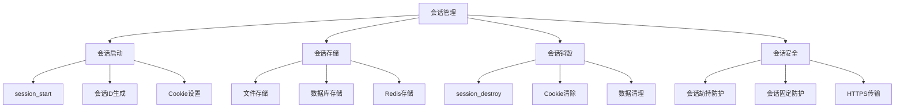

# 会话管理

## 🎯 学习目标
- 掌握PHP会话的基本概念和使用
- 理解会话的生命周期和存储机制
- 学会会话安全防护措施
- 了解会话的最佳实践

## 📚 核心概念

### 会话管理概述



## 🔧 基本会话操作

### 会话基础操作
```php
<?php
// 1. 会话管理器类
class SessionManager {
    private $started = false;
    private $config;
    
    public function __construct($config = []) {
        $this->config = array_merge([
            'name' => 'PHPSESSID',
            'lifetime' => 3600,
            'path' => '/',
            'domain' => '',
            'secure' => false,
            'httponly' => true,
            'samesite' => 'Lax'
        ], $config);
    }
    
    // 启动会话
    public function start() {
        if ($this->started) {
            return true;
        }
        
        // 设置会话配置
        ini_set('session.name', $this->config['name']);
        ini_set('session.gc_maxlifetime', $this->config['lifetime']);
        ini_set('session.cookie_lifetime', $this->config['lifetime']);
        ini_set('session.cookie_path', $this->config['path']);
        ini_set('session.cookie_domain', $this->config['domain']);
        ini_set('session.cookie_secure', $this->config['secure']);
        ini_set('session.cookie_httponly', $this->config['httponly']);
        ini_set('session.cookie_samesite', $this->config['samesite']);
        
        $result = session_start();
        if ($result) {
            $this->started = true;
        }
        
        return $result;
    }
    
    // 设置会话数据
    public function set($key, $value) {
        $this->start();
        $_SESSION[$key] = $value;
    }
    
    // 获取会话数据
    public function get($key, $default = null) {
        $this->start();
        return $_SESSION[$key] ?? $default;
    }
    
    // 检查会话数据是否存在
    public function has($key) {
        $this->start();
        return isset($_SESSION[$key]);
    }
    
    // 删除会话数据
    public function remove($key) {
        $this->start();
        unset($_SESSION[$key]);
    }
    
    // 清空所有会话数据
    public function clear() {
        $this->start();
        $_SESSION = [];
    }
    
    // 销毁会话
    public function destroy() {
        if ($this->started) {
            session_destroy();
            $this->started = false;
        }
        
        // 清除会话Cookie
        if (ini_get('session.use_cookies')) {
            $params = session_get_cookie_params();
            setcookie(
                session_name(),
                '',
                time() - 42000,
                $params['path'],
                $params['domain'],
                $params['secure'],
                $params['httponly']
            );
        }
    }
    
    // 重新生成会话ID
    public function regenerateId($deleteOldSession = true) {
        $this->start();
        return session_regenerate_id($deleteOldSession);
    }
    
    // 获取会话ID
    public function getId() {
        $this->start();
        return session_id();
    }
    
    // 获取会话状态
    public function getStatus() {
        return session_status();
    }
}

// 2. 会话数据操作
function setSessionData($key, $value) {
    if (session_status() === PHP_SESSION_NONE) {
        session_start();
    }
    $_SESSION[$key] = $value;
}

function getSessionData($key, $default = null) {
    if (session_status() === PHP_SESSION_NONE) {
        session_start();
    }
    return $_SESSION[$key] ?? $default;
}

function removeSessionData($key) {
    if (session_status() === PHP_SESSION_NONE) {
        session_start();
    }
    unset($_SESSION[$key]);
}

// 使用示例
echo "=== 会话基础操作示例 ===\n";

try {
    // 创建会话管理器
    $session = new SessionManager([
        'name' => 'MyApp',
        'lifetime' => 7200,
        'httponly' => true,
        'secure' => false
    ]);
    
    // 启动会话
    $session->start();
    echo "会话已启动，ID: " . $session->getId() . "\n";
    
    // 设置会话数据
    $session->set('user_id', 123);
    $session->set('username', 'testuser');
    $session->set('login_time', time());
    
    echo "会话数据已设置\n";
    
    // 获取会话数据
    echo "用户ID: " . $session->get('user_id') . "\n";
    echo "用户名: " . $session->get('username') . "\n";
    echo "登录时间: " . date('Y-m-d H:i:s', $session->get('login_time')) . "\n";
    
    // 检查数据是否存在
    echo "是否有邮箱: " . ($session->has('email') ? '是' : '否') . "\n";
    
} catch (Exception $e) {
    echo "错误: " . $e->getMessage() . "\n";
}
?>
```

### 会话安全防护
```php
<?php
// 1. 安全会话管理器
class SecureSessionManager extends SessionManager {
    private $fingerprint;
    
    public function __construct($config = []) {
        parent::__construct($config);
        $this->fingerprint = $this->generateFingerprint();
    }
    
    // 启动安全会话
    public function start() {
        $result = parent::start();
        
        if ($result) {
            $this->validateSession();
            $this->preventSessionFixation();
        }
        
        return $result;
    }
    
    // 生成浏览器指纹
    private function generateFingerprint() {
        $userAgent = $_SERVER['HTTP_USER_AGENT'] ?? '';
        $acceptLanguage = $_SERVER['HTTP_ACCEPT_LANGUAGE'] ?? '';
        $acceptEncoding = $_SERVER['HTTP_ACCEPT_ENCODING'] ?? '';
        
        return md5($userAgent . $acceptLanguage . $acceptEncoding);
    }
    
    // 验证会话
    private function validateSession() {
        // 检查会话指纹
        $storedFingerprint = $this->get('_fingerprint');
        if ($storedFingerprint && $storedFingerprint !== $this->fingerprint) {
            $this->destroy();
            throw new Exception('会话验证失败：浏览器指纹不匹配');
        }
        
        // 设置指纹
        if (!$storedFingerprint) {
            $this->set('_fingerprint', $this->fingerprint);
        }
        
        // 检查会话过期
        $lastActivity = $this->get('_last_activity');
        if ($lastActivity && (time() - $lastActivity) > $this->config['lifetime']) {
            $this->destroy();
            throw new Exception('会话已过期');
        }
        
        // 更新最后活动时间
        $this->set('_last_activity', time());
    }
    
    // 防止会话固定攻击
    private function preventSessionFixation() {
        $regenerateInterval = 300; // 5分钟
        $lastRegenerate = $this->get('_last_regenerate', 0);
        
        if ((time() - $lastRegenerate) > $regenerateInterval) {
            $this->regenerateId(true);
            $this->set('_last_regenerate', time());
        }
    }
    
    // 安全登录
    public function login($userId, $userData = []) {
        // 重新生成会话ID
        $this->regenerateId(true);
        
        // 设置用户数据
        $this->set('user_id', $userId);
        $this->set('user_data', $userData);
        $this->set('login_time', time());
        $this->set('_authenticated', true);
        
        // 重新设置安全标记
        $this->set('_fingerprint', $this->fingerprint);
        $this->set('_last_activity', time());
        $this->set('_last_regenerate', time());
    }
    
    // 安全登出
    public function logout() {
        $this->clear();
        $this->destroy();
    }
    
    // 检查是否已认证
    public function isAuthenticated() {
        return $this->get('_authenticated', false) === true;
    }
    
    // 获取用户ID
    public function getUserId() {
        return $this->isAuthenticated() ? $this->get('user_id') : null;
    }
}

// 2. 会话存储处理器
class DatabaseSessionHandler implements SessionHandlerInterface {
    private $pdo;
    private $table;
    
    public function __construct($pdo, $table = 'sessions') {
        $this->pdo = $pdo;
        $this->table = $table;
    }
    
    public function open($savePath, $sessionName) {
        return true;
    }
    
    public function close() {
        return true;
    }
    
    public function read($sessionId) {
        $stmt = $this->pdo->prepare("SELECT data FROM {$this->table} WHERE id = ? AND expires > ?");
        $stmt->execute([$sessionId, time()]);
        
        $result = $stmt->fetchColumn();
        return $result ? $result : '';
    }
    
    public function write($sessionId, $data) {
        $expires = time() + ini_get('session.gc_maxlifetime');
        
        $stmt = $this->pdo->prepare("
            INSERT INTO {$this->table} (id, data, expires) VALUES (?, ?, ?)
            ON DUPLICATE KEY UPDATE data = VALUES(data), expires = VALUES(expires)
        ");
        
        return $stmt->execute([$sessionId, $data, $expires]);
    }
    
    public function destroy($sessionId) {
        $stmt = $this->pdo->prepare("DELETE FROM {$this->table} WHERE id = ?");
        return $stmt->execute([$sessionId]);
    }
    
    public function gc($maxLifetime) {
        $stmt = $this->pdo->prepare("DELETE FROM {$this->table} WHERE expires < ?");
        return $stmt->execute([time()]);
    }
}

// 使用示例
echo "=== 会话安全防护示例 ===\n";

try {
    // 创建安全会话管理器
    $secureSession = new SecureSessionManager([
        'name' => 'SecureApp',
        'lifetime' => 3600,
        'secure' => false, // 在生产环境中应设为true
        'httponly' => true,
        'samesite' => 'Strict'
    ]);
    
    // 启动安全会话
    $secureSession->start();
    echo "安全会话已启动\n";
    
    // 模拟用户登录
    $userId = 123;
    $userData = [
        'username' => 'testuser',
        'email' => 'test@example.com',
        'role' => 'user'
    ];
    
    $secureSession->login($userId, $userData);
    echo "用户登录成功\n";
    
    // 检查认证状态
    echo "是否已认证: " . ($secureSession->isAuthenticated() ? '是' : '否') . "\n";
    echo "用户ID: " . $secureSession->getUserId() . "\n";
    
    // 获取用户数据
    $storedUserData = $secureSession->get('user_data');
    echo "用户名: " . $storedUserData['username'] . "\n";
    echo "邮箱: " . $storedUserData['email'] . "\n";
    
} catch (Exception $e) {
    echo "错误: " . $e->getMessage() . "\n";
}
?>
```

## 🔧 高级会话功能

### 会话存储优化
```php
<?php
// 1. Redis会话处理器
class RedisSessionHandler implements SessionHandlerInterface {
    private $redis;
    private $prefix;
    private $ttl;
    
    public function __construct($redis, $prefix = 'sess:', $ttl = 3600) {
        $this->redis = $redis;
        $this->prefix = $prefix;
        $this->ttl = $ttl;
    }
    
    public function open($savePath, $sessionName) {
        return true;
    }
    
    public function close() {
        return true;
    }
    
    public function read($sessionId) {
        $key = $this->prefix . $sessionId;
        $data = $this->redis->get($key);
        return $data ? $data : '';
    }
    
    public function write($sessionId, $data) {
        $key = $this->prefix . $sessionId;
        return $this->redis->setex($key, $this->ttl, $data);
    }
    
    public function destroy($sessionId) {
        $key = $this->prefix . $sessionId;
        return $this->redis->del($key) > 0;
    }
    
    public function gc($maxLifetime) {
        // Redis会自动处理过期键
        return true;
    }
}

// 2. 会话管理工具类
class SessionUtils {
    // 会话数据序列化
    public static function serialize($data) {
        return serialize($data);
    }
    
    // 会话数据反序列化
    public static function unserialize($data) {
        return unserialize($data);
    }
    
    // 会话数据加密
    public static function encrypt($data, $key) {
        $iv = random_bytes(16);
        $encrypted = openssl_encrypt($data, 'AES-256-CBC', $key, 0, $iv);
        return base64_encode($iv . $encrypted);
    }
    
    // 会话数据解密
    public static function decrypt($data, $key) {
        $data = base64_decode($data);
        $iv = substr($data, 0, 16);
        $encrypted = substr($data, 16);
        return openssl_decrypt($encrypted, 'AES-256-CBC', $key, 0, $iv);
    }
    
    // 生成安全的会话ID
    public static function generateSecureId() {
        return bin2hex(random_bytes(32));
    }
    
    // 验证会话ID格式
    public static function validateSessionId($sessionId) {
        return preg_match('/^[a-f0-9]{64}$/', $sessionId);
    }
}

// 3. 会话监控器
class SessionMonitor {
    private $storage;
    
    public function __construct($storage) {
        $this->storage = $storage;
    }
    
    // 记录会话活动
    public function logActivity($sessionId, $action, $data = []) {
        $log = [
            'session_id' => $sessionId,
            'action' => $action,
            'data' => $data,
            'timestamp' => time(),
            'ip' => $_SERVER['REMOTE_ADDR'] ?? '',
            'user_agent' => $_SERVER['HTTP_USER_AGENT'] ?? ''
        ];
        
        $this->storage->store('session_log_' . $sessionId, $log);
    }
    
    // 获取会话统计
    public function getSessionStats() {
        return [
            'active_sessions' => $this->getActiveSessions(),
            'total_sessions_today' => $this->getTotalSessionsToday(),
            'average_session_duration' => $this->getAverageSessionDuration()
        ];
    }
    
    // 获取活跃会话数
    private function getActiveSessions() {
        // 实现获取活跃会话数的逻辑
        return 0;
    }
    
    // 获取今日总会话数
    private function getTotalSessionsToday() {
        // 实现获取今日总会话数的逻辑
        return 0;
    }
    
    // 获取平均会话时长
    private function getAverageSessionDuration() {
        // 实现获取平均会话时长的逻辑
        return 0;
    }
}

// 使用示例
echo "=== 高级会话功能示例 ===\n";

try {
    // 会话工具使用
    $data = ['user_id' => 123, 'username' => 'testuser'];
    $serialized = SessionUtils::serialize($data);
    echo "序列化数据: " . substr($serialized, 0, 50) . "...\n";
    
    $unserialized = SessionUtils::unserialize($serialized);
    echo "反序列化用户ID: " . $unserialized['user_id'] . "\n";
    
    // 生成安全会话ID
    $secureId = SessionUtils::generateSecureId();
    echo "安全会话ID: " . substr($secureId, 0, 16) . "...\n";
    
    // 验证会话ID
    $isValid = SessionUtils::validateSessionId($secureId);
    echo "会话ID有效: " . ($isValid ? '是' : '否') . "\n";
    
} catch (Exception $e) {
    echo "错误: " . $e->getMessage() . "\n";
}
?>
```

## 📊 最佳实践

### 会话安全最佳实践
1. **使用HTTPS**: 在生产环境中始终使用HTTPS
2. **定期重新生成**: 定期重新生成会话ID
3. **设置过期时间**: 合理设置会话过期时间
4. **验证会话**: 验证会话的有效性和完整性
5. **安全存储**: 使用安全的会话存储机制

### 会话性能优化
1. **选择合适的存储**: 根据需求选择文件、数据库或Redis
2. **减少会话数据**: 只存储必要的会话数据
3. **及时清理**: 定期清理过期的会话数据
4. **使用缓存**: 对频繁访问的会话数据使用缓存

## 🎓 学习建议

### 费曼学习法应用
1. **选择概念**: 选择会话管理中的核心概念
2. **简化解释**: 用简单语言解释会话的工作原理
3. **识别盲点**: 发现理解不深入的地方
4. **重新学习**: 针对盲点进行深入学习

### 刻意练习重点
1. **安全意识**: 培养会话安全意识
2. **实际应用**: 在实际项目中应用会话管理
3. **性能优化**: 学习会话性能优化技巧
4. **问题排查**: 掌握会话问题的排查方法

## 🔗 相关链接
- [[01-HTTP协议基础|HTTP协议基础]]
- [[02-表单处理|表单处理]]
- [[04-Cookie操作|Cookie操作]]
- [[05-请求与响应|请求与响应]]
- [[06-路由与URL重写|路由与URL重写]]
- [[07-Web开发最佳实践|Web开发最佳实践]]
