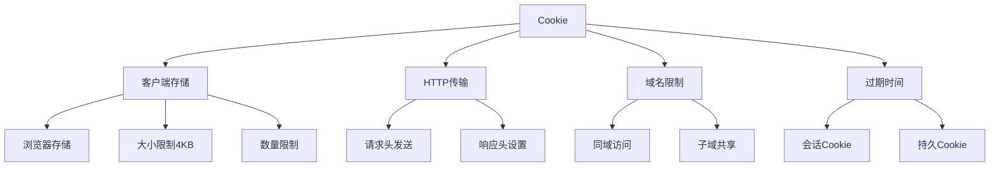

# Cookie操作

## 🎯 学习目标
- 掌握Cookie的基本概念和使用方法
- 理解Cookie的属性和安全设置
- 学会Cookie的读取、设置和删除
- 了解Cookie的最佳实践和安全防护

## 📚 核心概念

### Cookie概述



### Cookie属性

| 属性 | 描述 | 示例 | 安全性 |
|------|------|------|--------|
| Name | Cookie名称 | username | - |
| Value | Cookie值 | john_doe | 需加密敏感数据 |
| Expires | 过期时间 | Wed, 09 Jun 2021 10:18:14 GMT | 控制生命周期 |
| Max-Age | 最大存活时间(秒) | 3600 | 优先于Expires |
| Domain | 作用域名 | .example.com | 防止跨域访问 |
| Path | 作用路径 | /admin | 限制访问路径 |
| Secure | 仅HTTPS传输 | true | 防止中间人攻击 |
| HttpOnly | 禁止JavaScript访问 | true | 防止XSS攻击 |
| SameSite | 跨站请求限制 | Strict/Lax/None | 防止CSRF攻击 |

## 🔧 基本Cookie操作

### Cookie设置和读取
```php
<?php
// 1. Cookie管理器类
class CookieManager {
    private $defaults;
    
    public function __construct($defaults = []) {
        $this->defaults = array_merge([
            'expires' => 0,
            'path' => '/',
            'domain' => '',
            'secure' => false,
            'httponly' => true,
            'samesite' => 'Lax'
        ], $defaults);
    }
    
    // 设置Cookie
    public function set($name, $value, $options = []) {
        $options = array_merge($this->defaults, $options);
        
        // 处理过期时间
        if (isset($options['expires']) && is_string($options['expires'])) {
            $options['expires'] = strtotime($options['expires']);
        }
        
        return setcookie(
            $name,
            $value,
            $options['expires'],
            $options['path'],
            $options['domain'],
            $options['secure'],
            $options['httponly']
        );
    }
    
    // 获取Cookie
    public function get($name, $default = null) {
        return $_COOKIE[$name] ?? $default;
    }
    
    // 检查Cookie是否存在
    public function has($name) {
        return isset($_COOKIE[$name]);
    }
    
    // 删除Cookie
    public function delete($name, $path = '/', $domain = '') {
        if ($this->has($name)) {
            unset($_COOKIE[$name]);
        }
        
        return setcookie($name, '', time() - 3600, $path, $domain);
    }
    
    // 获取所有Cookie
    public function all() {
        return $_COOKIE;
    }
    
    // 清除所有Cookie
    public function clear() {
        foreach ($_COOKIE as $name => $value) {
            $this->delete($name);
        }
    }
}

// 2. 安全Cookie操作
function setSecureCookie($name, $value, $expires = 0, $encrypt = true) {
    // 加密敏感数据
    if ($encrypt) {
        $value = encryptCookieValue($value);
    }
    
    return setcookie($name, $value, [
        'expires' => $expires,
        'path' => '/',
        'domain' => '',
        'secure' => isset($_SERVER['HTTPS']),
        'httponly' => true,
        'samesite' => 'Strict'
    ]);
}

function getSecureCookie($name, $decrypt = true, $default = null) {
    if (!isset($_COOKIE[$name])) {
        return $default;
    }
    
    $value = $_COOKIE[$name];
    
    // 解密数据
    if ($decrypt) {
        $value = decryptCookieValue($value);
    }
    
    return $value;
}

// 3. Cookie加密解密
function encryptCookieValue($value) {
    $key = getCookieEncryptionKey();
    $iv = random_bytes(16);
    $encrypted = openssl_encrypt($value, 'AES-256-CBC', $key, 0, $iv);
    return base64_encode($iv . $encrypted);
}

function decryptCookieValue($encryptedValue) {
    $key = getCookieEncryptionKey();
    $data = base64_decode($encryptedValue);
    
    if (strlen($data) < 16) {
        return false;
    }
    
    $iv = substr($data, 0, 16);
    $encrypted = substr($data, 16);
    
    return openssl_decrypt($encrypted, 'AES-256-CBC', $key, 0, $iv);
}

function getCookieEncryptionKey() {
    // 在实际应用中，这应该从配置文件或环境变量中获取
    return 'your-secret-key-32-characters-long';
}

// 使用示例
echo "=== Cookie基本操作示例 ===\n";

try {
    // 创建Cookie管理器
    $cookie = new CookieManager([
        'expires' => time() + 3600, // 1小时后过期
        'secure' => false, // 在生产环境中应设为true
        'httponly' => true,
        'samesite' => 'Lax'
    ]);
    
    // 设置Cookie
    $cookie->set('username', 'testuser');
    $cookie->set('theme', 'dark');
    $cookie->set('language', 'zh-CN');
    
    echo "Cookie已设置\n";
    
    // 读取Cookie（注意：在同一个请求中设置的Cookie在当前请求中不可见）
    // 这里我们手动设置$_COOKIE来模拟
    $_COOKIE['username'] = 'testuser';
    $_COOKIE['theme'] = 'dark';
    $_COOKIE['language'] = 'zh-CN';
    
    echo "用户名: " . $cookie->get('username') . "\n";
    echo "主题: " . $cookie->get('theme') . "\n";
    echo "语言: " . $cookie->get('language') . "\n";
    
    // 检查Cookie是否存在
    echo "是否有邮箱Cookie: " . ($cookie->has('email') ? '是' : '否') . "\n";
    
    // 获取所有Cookie
    $allCookies = $cookie->all();
    echo "所有Cookie数量: " . count($allCookies) . "\n";
    
} catch (Exception $e) {
    echo "错误: " . $e->getMessage() . "\n";
}
?>
```

### Cookie安全防护
```php
<?php
// 1. 安全Cookie管理器
class SecureCookieManager extends CookieManager {
    private $encryptionKey;
    private $signatureKey;
    
    public function __construct($encryptionKey, $signatureKey, $defaults = []) {
        parent::__construct(array_merge([
            'secure' => true,
            'httponly' => true,
            'samesite' => 'Strict'
        ], $defaults));
        
        $this->encryptionKey = $encryptionKey;
        $this->signatureKey = $signatureKey;
    }
    
    // 设置加密Cookie
    public function setSecure($name, $value, $options = []) {
        $encryptedValue = $this->encrypt($value);
        $signedValue = $this->sign($encryptedValue);
        
        return $this->set($name, $signedValue, $options);
    }
    
    // 获取加密Cookie
    public function getSecure($name, $default = null) {
        $signedValue = $this->get($name);
        
        if ($signedValue === null) {
            return $default;
        }
        
        if (!$this->verify($signedValue)) {
            return $default;
        }
        
        $encryptedValue = $this->unsign($signedValue);
        return $this->decrypt($encryptedValue);
    }
    
    // 加密数据
    private function encrypt($data) {
        $iv = random_bytes(16);
        $encrypted = openssl_encrypt(
            serialize($data),
            'AES-256-CBC',
            $this->encryptionKey,
            0,
            $iv
        );
        
        return base64_encode($iv . $encrypted);
    }
    
    // 解密数据
    private function decrypt($encryptedData) {
        $data = base64_decode($encryptedData);
        
        if (strlen($data) < 16) {
            return false;
        }
        
        $iv = substr($data, 0, 16);
        $encrypted = substr($data, 16);
        
        $decrypted = openssl_decrypt(
            $encrypted,
            'AES-256-CBC',
            $this->encryptionKey,
            0,
            $iv
        );
        
        return $decrypted ? unserialize($decrypted) : false;
    }
    
    // 签名数据
    private function sign($data) {
        $signature = hash_hmac('sha256', $data, $this->signatureKey);
        return $data . '.' . $signature;
    }
    
    // 移除签名
    private function unsign($signedData) {
        $parts = explode('.', $signedData);
        if (count($parts) !== 2) {
            return false;
        }
        
        return $parts[0];
    }
    
    // 验证签名
    private function verify($signedData) {
        $parts = explode('.', $signedData);
        if (count($parts) !== 2) {
            return false;
        }
        
        $data = $parts[0];
        $signature = $parts[1];
        $expectedSignature = hash_hmac('sha256', $data, $this->signatureKey);
        
        return hash_equals($expectedSignature, $signature);
    }
}

// 2. Cookie安全验证
class CookieValidator {
    // 验证Cookie名称
    public static function validateName($name) {
        // Cookie名称不能包含特殊字符
        return preg_match('/^[a-zA-Z0-9_-]+$/', $name);
    }
    
    // 验证Cookie值大小
    public static function validateSize($value) {
        // Cookie值不能超过4KB
        return strlen($value) <= 4096;
    }
    
    // 验证Cookie数量
    public static function validateCount() {
        // 每个域名最多20个Cookie
        return count($_COOKIE) <= 20;
    }
    
    // 检查Cookie安全性
    public static function checkSecurity($name) {
        $issues = [];
        
        // 检查是否使用HTTPS
        if (!isset($_SERVER['HTTPS']) || $_SERVER['HTTPS'] !== 'on') {
            $issues[] = '建议使用HTTPS传输敏感Cookie';
        }
        
        // 检查HttpOnly属性
        $cookieParams = session_get_cookie_params();
        if (!$cookieParams['httponly']) {
            $issues[] = '建议设置HttpOnly属性防止XSS攻击';
        }
        
        // 检查Secure属性
        if (!$cookieParams['secure'] && isset($_SERVER['HTTPS'])) {
            $issues[] = '建议设置Secure属性仅在HTTPS下传输';
        }
        
        return $issues;
    }
}

// 使用示例
echo "=== Cookie安全防护示例 ===\n";

try {
    // 创建安全Cookie管理器
    $encryptionKey = hash('sha256', 'encryption-secret-key');
    $signatureKey = hash('sha256', 'signature-secret-key');
    
    $secureCookie = new SecureCookieManager($encryptionKey, $signatureKey, [
        'expires' => time() + 3600,
        'secure' => false, // 在生产环境中应设为true
        'httponly' => true,
        'samesite' => 'Strict'
    ]);
    
    // 设置安全Cookie
    $userData = [
        'user_id' => 123,
        'username' => 'testuser',
        'role' => 'admin'
    ];
    
    $secureCookie->setSecure('user_data', $userData);
    echo "安全Cookie已设置\n";
    
    // Cookie验证
    $nameValid = CookieValidator::validateName('user_data');
    echo "Cookie名称有效: " . ($nameValid ? '是' : '否') . "\n";
    
    $sizeValid = CookieValidator::validateSize(serialize($userData));
    echo "Cookie大小有效: " . ($sizeValid ? '是' : '否') . "\n";
    
    $countValid = CookieValidator::validateCount();
    echo "Cookie数量有效: " . ($countValid ? '是' : '否') . "\n";
    
    // 安全检查
    $securityIssues = CookieValidator::checkSecurity('user_data');
    if (empty($securityIssues)) {
        echo "Cookie安全检查通过\n";
    } else {
        echo "安全建议:\n";
        foreach ($securityIssues as $issue) {
            echo "  - $issue\n";
        }
    }
    
} catch (Exception $e) {
    echo "错误: " . $e->getMessage() . "\n";
}
?>
```

## 🔧 Cookie应用场景

### 用户偏好设置
```php
<?php
// 1. 用户偏好管理器
class UserPreferences {
    private $cookie;
    private $cookieName = 'user_preferences';
    
    public function __construct() {
        $this->cookie = new CookieManager([
            'expires' => time() + (365 * 24 * 3600), // 1年
            'httponly' => false, // 允许JavaScript访问偏好设置
            'samesite' => 'Lax'
        ]);
    }
    
    // 设置偏好
    public function setPreference($key, $value) {
        $preferences = $this->getAll();
        $preferences[$key] = $value;
        
        return $this->cookie->set($this->cookieName, json_encode($preferences));
    }
    
    // 获取偏好
    public function getPreference($key, $default = null) {
        $preferences = $this->getAll();
        return $preferences[$key] ?? $default;
    }
    
    // 获取所有偏好
    public function getAll() {
        $data = $this->cookie->get($this->cookieName, '{}');
        return json_decode($data, true) ?: [];
    }
    
    // 删除偏好
    public function removePreference($key) {
        $preferences = $this->getAll();
        unset($preferences[$key]);
        
        return $this->cookie->set($this->cookieName, json_encode($preferences));
    }
    
    // 清除所有偏好
    public function clearAll() {
        return $this->cookie->delete($this->cookieName);
    }
}

// 2. 购物车管理
class ShoppingCart {
    private $cookie;
    private $cookieName = 'shopping_cart';
    
    public function __construct() {
        $this->cookie = new CookieManager([
            'expires' => time() + (7 * 24 * 3600), // 7天
            'httponly' => true,
            'samesite' => 'Lax'
        ]);
    }
    
    // 添加商品
    public function addItem($productId, $quantity = 1) {
        $cart = $this->getItems();
        
        if (isset($cart[$productId])) {
            $cart[$productId] += $quantity;
        } else {
            $cart[$productId] = $quantity;
        }
        
        return $this->saveCart($cart);
    }
    
    // 移除商品
    public function removeItem($productId) {
        $cart = $this->getItems();
        unset($cart[$productId]);
        
        return $this->saveCart($cart);
    }
    
    // 更新数量
    public function updateQuantity($productId, $quantity) {
        $cart = $this->getItems();
        
        if ($quantity <= 0) {
            unset($cart[$productId]);
        } else {
            $cart[$productId] = $quantity;
        }
        
        return $this->saveCart($cart);
    }
    
    // 获取所有商品
    public function getItems() {
        $data = $this->cookie->get($this->cookieName, '{}');
        return json_decode($data, true) ?: [];
    }
    
    // 获取商品数量
    public function getItemCount() {
        return array_sum($this->getItems());
    }
    
    // 清空购物车
    public function clear() {
        return $this->cookie->delete($this->cookieName);
    }
    
    // 保存购物车
    private function saveCart($cart) {
        return $this->cookie->set($this->cookieName, json_encode($cart));
    }
}

// 使用示例
echo "=== Cookie应用场景示例 ===\n";

try {
    // 用户偏好设置
    $preferences = new UserPreferences();
    
    // 模拟已有的偏好数据
    $_COOKIE['user_preferences'] = json_encode([
        'theme' => 'dark',
        'language' => 'zh-CN'
    ]);
    
    // 设置新偏好
    $preferences->setPreference('timezone', 'Asia/Shanghai');
    $preferences->setPreference('notifications', true);
    
    echo "用户偏好设置:\n";
    echo "  主题: " . $preferences->getPreference('theme') . "\n";
    echo "  语言: " . $preferences->getPreference('language') . "\n";
    echo "  时区: " . $preferences->getPreference('timezone') . "\n";
    echo "  通知: " . ($preferences->getPreference('notifications') ? '开启' : '关闭') . "\n";
    
    // 购物车管理
    $cart = new ShoppingCart();
    
    // 模拟已有的购物车数据
    $_COOKIE['shopping_cart'] = json_encode([
        '101' => 2,
        '102' => 1
    ]);
    
    // 添加商品
    $cart->addItem('103', 3);
    $cart->updateQuantity('101', 5);
    
    echo "\n购物车内容:\n";
    $items = $cart->getItems();
    foreach ($items as $productId => $quantity) {
        echo "  商品 $productId: $quantity 件\n";
    }
    echo "  总商品数量: " . $cart->getItemCount() . "\n";
    
} catch (Exception $e) {
    echo "错误: " . $e->getMessage() . "\n";
}
?>
```

## 📊 最佳实践

### Cookie最佳实践
```php
<?php
// Cookie最佳实践指南

class CookieBestPractices {
    // 1. 安全设置指南
    public static function getSecureDefaults() {
        return [
            'expires' => time() + 3600, // 合理的过期时间
            'path' => '/',
            'domain' => '', // 限制域名
            'secure' => isset($_SERVER['HTTPS']), // HTTPS环境下启用
            'httponly' => true, // 防止XSS
            'samesite' => 'Strict' // 防止CSRF
        ];
    }
    
    // 2. 敏感数据处理
    public static function handleSensitiveData($data) {
        // 不要在Cookie中存储敏感信息
        $allowedKeys = ['theme', 'language', 'timezone', 'preferences'];
        
        return array_intersect_key($data, array_flip($allowedKeys));
    }
    
    // 3. Cookie大小优化
    public static function optimizeSize($data) {
        // 压缩数据
        $json = json_encode($data);
        
        if (strlen($json) > 4000) { // 接近4KB限制
            // 移除不必要的数据或使用服务器端存储
            throw new Exception('Cookie数据过大，建议使用服务器端存储');
        }
        
        return gzcompress($json);
    }
    
    // 4. Cookie清理策略
    public static function cleanup() {
        $expiredCookies = [];
        
        foreach ($_COOKIE as $name => $value) {
            // 检查Cookie是否过期或无效
            if (self::isExpiredOrInvalid($name, $value)) {
                $expiredCookies[] = $name;
            }
        }
        
        // 清理过期Cookie
        foreach ($expiredCookies as $name) {
            setcookie($name, '', time() - 3600, '/');
        }
        
        return count($expiredCookies);
    }
    
    private static function isExpiredOrInvalid($name, $value) {
        // 实现Cookie过期和有效性检查逻辑
        return false;
    }
}

// 使用示例
echo "=== Cookie最佳实践示例 ===\n";

try {
    // 获取安全默认设置
    $secureDefaults = CookieBestPractices::getSecureDefaults();
    echo "安全默认设置:\n";
    foreach ($secureDefaults as $key => $value) {
        echo "  $key: " . (is_bool($value) ? ($value ? 'true' : 'false') : $value) . "\n";
    }
    
    // 处理敏感数据
    $userData = [
        'theme' => 'dark',
        'password' => 'secret123', // 敏感数据
        'language' => 'zh-CN',
        'credit_card' => '1234-5678-9012-3456' // 敏感数据
    ];
    
    $safeData = CookieBestPractices::handleSensitiveData($userData);
    echo "\n安全数据处理后:\n";
    foreach ($safeData as $key => $value) {
        echo "  $key: $value\n";
    }
    
    // Cookie清理
    $cleanedCount = CookieBestPractices::cleanup();
    echo "\n清理了 $cleanedCount 个过期Cookie\n";
    
} catch (Exception $e) {
    echo "错误: " . $e->getMessage() . "\n";
}
?>
```

## 🎓 学习建议

### 费曼学习法应用
1. **选择概念**: 选择Cookie中的核心概念
2. **简化解释**: 用简单语言解释Cookie的工作原理
3. **识别盲点**: 发现理解不深入的地方
4. **重新学习**: 针对盲点进行深入学习

### 刻意练习重点
1. **安全意识**: 培养Cookie安全意识
2. **实际应用**: 在实际项目中应用Cookie
3. **性能优化**: 学习Cookie性能优化技巧
4. **最佳实践**: 掌握Cookie使用的最佳实践

## 🔗 相关链接
- [[01-HTTP协议基础|HTTP协议基础]]
- [[02-表单处理|表单处理]]
- [[03-会话管理|会话管理]]
- [[05-请求与响应|请求与响应]]
- [[06-路由与URL重写|路由与URL重写]]
- [[07-Web开发最佳实践|Web开发最佳实践]]
