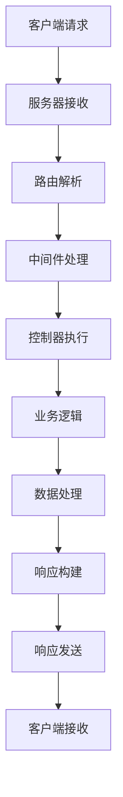

# 请求与响应

## 🎯 学习目标
- 掌握HTTP请求和响应的处理机制
- 理解请求数据的获取和验证方法
- 学会构建标准化的API响应
- 了解请求响应的最佳实践

## 📚 核心概念

### 请求响应流程



## 🔧 请求处理

### 请求数据获取
```php
<?php
// 1. 请求处理器类
class RequestHandler {
    private $method;
    private $uri;
    private $headers;
    private $body;
    private $params;
    
    public function __construct() {
        $this->method = $_SERVER['REQUEST_METHOD'] ?? 'GET';
        $this->uri = $_SERVER['REQUEST_URI'] ?? '/';
        $this->headers = $this->getHeaders();
        $this->body = $this->getBody();
        $this->params = $this->getParams();
    }
    
    // 获取请求方法
    public function getMethod() {
        return $this->method;
    }
    
    // 获取请求URI
    public function getUri() {
        return parse_url($this->uri, PHP_URL_PATH);
    }
    
    // 获取查询字符串
    public function getQueryString() {
        return parse_url($this->uri, PHP_URL_QUERY);
    }
    
    // 获取请求头
    private function getHeaders() {
        if (function_exists('getallheaders')) {
            return getallheaders();
        }
        
        $headers = [];
        foreach ($_SERVER as $key => $value) {
            if (strpos($key, 'HTTP_') === 0) {
                $header = str_replace('_', '-', substr($key, 5));
                $headers[$header] = $value;
            }
        }
        
        return $headers;
    }
    
    // 获取请求体
    private function getBody() {
        return file_get_contents('php://input');
    }
    
    // 获取请求参数
    private function getParams() {
        $params = [];
        
        // GET参数
        $params['query'] = $_GET;
        
        // POST参数
        $params['post'] = $_POST;
        
        // JSON参数
        if ($this->isJson()) {
            $json = json_decode($this->body, true);
            $params['json'] = $json ?: [];
        }
        
        // 文件参数
        $params['files'] = $_FILES;
        
        return $params;
    }
    
    // 检查是否为JSON请求
    public function isJson() {
        $contentType = $this->getHeader('Content-Type', '');
        return strpos($contentType, 'application/json') !== false;
    }
    
    // 获取特定请求头
    public function getHeader($name, $default = null) {
        return $this->headers[$name] ?? $default;
    }
    
    // 获取所有请求头
    public function getHeaders() {
        return $this->headers;
    }
    
    // 获取输入数据
    public function input($key = null, $default = null) {
        if ($key === null) {
            return array_merge(
                $this->params['query'],
                $this->params['post'],
                $this->params['json']
            );
        }
        
        // 按优先级查找参数
        $sources = ['json', 'post', 'query'];
        
        foreach ($sources as $source) {
            if (isset($this->params[$source][$key])) {
                return $this->params[$source][$key];
            }
        }
        
        return $default;
    }
    
    // 获取文件
    public function file($key) {
        return $this->params['files'][$key] ?? null;
    }
    
    // 检查参数是否存在
    public function has($key) {
        return $this->input($key) !== null;
    }
    
    // 获取客户端IP
    public function getClientIp() {
        $ipKeys = [
            'HTTP_X_FORWARDED_FOR',
            'HTTP_X_REAL_IP',
            'HTTP_CLIENT_IP',
            'REMOTE_ADDR'
        ];
        
        foreach ($ipKeys as $key) {
            if (!empty($_SERVER[$key])) {
                $ip = $_SERVER[$key];
                if (strpos($ip, ',') !== false) {
                    $ip = trim(explode(',', $ip)[0]);
                }
                
                if (filter_var($ip, FILTER_VALIDATE_IP, FILTER_FLAG_NO_PRIV_RANGE | FILTER_FLAG_NO_RES_RANGE)) {
                    return $ip;
                }
            }
        }
        
        return $_SERVER['REMOTE_ADDR'] ?? '0.0.0.0';
    }
    
    // 获取用户代理
    public function getUserAgent() {
        return $this->getHeader('User-Agent', '');
    }
}

// 使用示例
echo "=== 请求处理示例 ===\n";

try {
    // 模拟请求数据
    $_SERVER['REQUEST_METHOD'] = 'POST';
    $_SERVER['REQUEST_URI'] = '/api/users?page=1&limit=10';
    $_SERVER['HTTP_CONTENT_TYPE'] = 'application/json';
    $_SERVER['HTTP_USER_AGENT'] = 'Test Client/1.0';
    $_GET = ['page' => '1', 'limit' => '10'];
    $_POST = ['name' => 'John', 'email' => 'john@example.com'];
    
    // 创建请求处理器
    $request = new RequestHandler();
    
    echo "请求方法: " . $request->getMethod() . "\n";
    echo "请求URI: " . $request->getUri() . "\n";
    echo "查询字符串: " . $request->getQueryString() . "\n";
    echo "是否JSON: " . ($request->isJson() ? '是' : '否') . "\n";
    echo "客户端IP: " . $request->getClientIp() . "\n";
    echo "用户代理: " . $request->getUserAgent() . "\n";
    
    // 获取输入数据
    echo "页码: " . $request->input('page') . "\n";
    echo "限制: " . $request->input('limit') . "\n";
    echo "姓名: " . $request->input('name') . "\n";
    echo "邮箱: " . $request->input('email') . "\n";
    
    // 检查参数
    echo "是否有密码参数: " . ($request->has('password') ? '是' : '否') . "\n";
    
} catch (Exception $e) {
    echo "错误: " . $e->getMessage() . "\n";
}
?>
```

### 响应构建
```php
<?php
// 1. 响应构建器类
class ResponseBuilder {
    private $statusCode = 200;
    private $headers = [];
    private $body = '';
    private $cookies = [];
    
    // 设置状态码
    public function status($code) {
        $this->statusCode = $code;
        return $this;
    }
    
    // 设置响应头
    public function header($name, $value) {
        $this->headers[$name] = $value;
        return $this;
    }
    
    // 设置多个响应头
    public function headers($headers) {
        $this->headers = array_merge($this->headers, $headers);
        return $this;
    }
    
    // 设置Cookie
    public function cookie($name, $value, $options = []) {
        $this->cookies[$name] = array_merge([
            'value' => $value,
            'expires' => 0,
            'path' => '/',
            'domain' => '',
            'secure' => false,
            'httponly' => true
        ], $options);
        
        return $this;
    }
    
    // 设置响应体
    public function body($content) {
        $this->body = $content;
        return $this;
    }
    
    // JSON响应
    public function json($data, $options = JSON_UNESCAPED_UNICODE) {
        $this->header('Content-Type', 'application/json; charset=utf-8');
        $this->body = json_encode($data, $options);
        return $this;
    }
    
    // XML响应
    public function xml($data) {
        $this->header('Content-Type', 'application/xml; charset=utf-8');
        
        $xml = new SimpleXMLElement('<response/>');
        $this->arrayToXml($data, $xml);
        $this->body = $xml->asXML();
        
        return $this;
    }
    
    // HTML响应
    public function html($content) {
        $this->header('Content-Type', 'text/html; charset=utf-8');
        $this->body = $content;
        return $this;
    }
    
    // 文本响应
    public function text($content) {
        $this->header('Content-Type', 'text/plain; charset=utf-8');
        $this->body = $content;
        return $this;
    }
    
    // 重定向响应
    public function redirect($url, $permanent = false) {
        $this->status($permanent ? 301 : 302);
        $this->header('Location', $url);
        return $this;
    }
    
    // 下载响应
    public function download($filePath, $filename = null) {
        if (!file_exists($filePath)) {
            throw new Exception("文件不存在: $filePath");
        }
        
        $filename = $filename ?: basename($filePath);
        
        $this->header('Content-Type', 'application/octet-stream');
        $this->header('Content-Disposition', 'attachment; filename="' . $filename . '"');
        $this->header('Content-Length', filesize($filePath));
        $this->body = file_get_contents($filePath);
        
        return $this;
    }
    
    // 发送响应
    public function send() {
        // 设置状态码
        http_response_code($this->statusCode);
        
        // 设置响应头
        foreach ($this->headers as $name => $value) {
            header("$name: $value");
        }
        
        // 设置Cookie
        foreach ($this->cookies as $name => $options) {
            setcookie(
                $name,
                $options['value'],
                $options['expires'],
                $options['path'],
                $options['domain'],
                $options['secure'],
                $options['httponly']
            );
        }
        
        // 输出响应体
        echo $this->body;
        
        // 刷新输出缓冲区
        if (ob_get_level()) {
            ob_end_flush();
        }
        
        return $this;
    }
    
    // 数组转XML
    private function arrayToXml($array, $xml) {
        foreach ($array as $key => $value) {
            if (is_array($value)) {
                $subnode = $xml->addChild($key);
                $this->arrayToXml($value, $subnode);
            } else {
                $xml->addChild($key, htmlspecialchars($value));
            }
        }
    }
}

// 2. API响应标准化
class ApiResponse {
    // 成功响应
    public static function success($data = null, $message = 'Success', $code = 200) {
        return (new ResponseBuilder())
            ->status($code)
            ->json([
                'success' => true,
                'code' => $code,
                'message' => $message,
                'data' => $data,
                'timestamp' => time()
            ]);
    }
    
    // 错误响应
    public static function error($message = 'Error', $code = 400, $errors = null) {
        $response = [
            'success' => false,
            'code' => $code,
            'message' => $message,
            'timestamp' => time()
        ];
        
        if ($errors !== null) {
            $response['errors'] = $errors;
        }
        
        return (new ResponseBuilder())
            ->status($code)
            ->json($response);
    }
    
    // 分页响应
    public static function paginated($data, $total, $page, $limit, $message = 'Success') {
        return self::success([
            'items' => $data,
            'pagination' => [
                'total' => $total,
                'page' => $page,
                'limit' => $limit,
                'pages' => ceil($total / $limit)
            ]
        ], $message);
    }
    
    // 验证错误响应
    public static function validationError($errors, $message = 'Validation failed') {
        return self::error($message, 422, $errors);
    }
    
    // 未授权响应
    public static function unauthorized($message = 'Unauthorized') {
        return self::error($message, 401);
    }
    
    // 禁止访问响应
    public static function forbidden($message = 'Forbidden') {
        return self::error($message, 403);
    }
    
    // 未找到响应
    public static function notFound($message = 'Not found') {
        return self::error($message, 404);
    }
    
    // 服务器错误响应
    public static function serverError($message = 'Internal server error') {
        return self::error($message, 500);
    }
}

// 使用示例
echo "=== 响应构建示例 ===\n";

try {
    // 基本响应构建
    $response = new ResponseBuilder();
    
    // JSON响应
    $jsonData = [
        'id' => 1,
        'name' => 'John Doe',
        'email' => 'john@example.com'
    ];
    
    echo "构建JSON响应\n";
    $response->status(200)
             ->header('X-API-Version', '1.0')
             ->cookie('session_id', 'abc123', ['expires' => time() + 3600])
             ->json($jsonData);
    
    // API标准化响应
    echo "API成功响应:\n";
    $successResponse = ApiResponse::success($jsonData, '用户信息获取成功');
    
    echo "API错误响应:\n";
    $errorResponse = ApiResponse::validationError([
        'email' => '邮箱格式不正确',
        'password' => '密码长度不足'
    ]);
    
    echo "API分页响应:\n";
    $paginatedResponse = ApiResponse::paginated(
        [$jsonData],
        100,
        1,
        10,
        '用户列表获取成功'
    );
    
    echo "响应构建完成\n";
    
} catch (Exception $e) {
    echo "错误: " . $e->getMessage() . "\n";
}
?>
```

## 🔧 高级功能

### 中间件系统
```php
<?php
// 1. 中间件接口
interface MiddlewareInterface {
    public function handle($request, $next);
}

// 2. 认证中间件
class AuthMiddleware implements MiddlewareInterface {
    public function handle($request, $next) {
        $token = $request->getHeader('Authorization');
        
        if (!$token || !$this->validateToken($token)) {
            return ApiResponse::unauthorized('Token无效或已过期');
        }
        
        // 将用户信息添加到请求中
        $request->user = $this->getUserFromToken($token);
        
        return $next($request);
    }
    
    private function validateToken($token) {
        // 验证token逻辑
        return !empty($token) && $token !== 'invalid';
    }
    
    private function getUserFromToken($token) {
        // 从token获取用户信息
        return ['id' => 1, 'name' => 'John Doe'];
    }
}

// 3. 限流中间件
class RateLimitMiddleware implements MiddlewareInterface {
    private $maxRequests;
    private $timeWindow;
    
    public function __construct($maxRequests = 60, $timeWindow = 60) {
        $this->maxRequests = $maxRequests;
        $this->timeWindow = $timeWindow;
    }
    
    public function handle($request, $next) {
        $clientIp = $request->getClientIp();
        $key = "rate_limit_" . md5($clientIp);
        
        // 检查请求频率
        if ($this->isRateLimited($key)) {
            return ApiResponse::error('请求过于频繁', 429);
        }
        
        // 记录请求
        $this->recordRequest($key);
        
        return $next($request);
    }
    
    private function isRateLimited($key) {
        // 实现限流检查逻辑
        return false; // 简化实现
    }
    
    private function recordRequest($key) {
        // 记录请求时间
    }
}

// 4. 中间件管道
class MiddlewarePipeline {
    private $middlewares = [];
    
    public function add(MiddlewareInterface $middleware) {
        $this->middlewares[] = $middleware;
        return $this;
    }
    
    public function handle($request, $finalHandler) {
        $pipeline = array_reduce(
            array_reverse($this->middlewares),
            function ($next, $middleware) {
                return function ($request) use ($middleware, $next) {
                    return $middleware->handle($request, $next);
                };
            },
            $finalHandler
        );
        
        return $pipeline($request);
    }
}

// 5. 请求响应处理器
class RequestResponseHandler {
    private $pipeline;
    
    public function __construct() {
        $this->pipeline = new MiddlewarePipeline();
        $this->setupMiddlewares();
    }
    
    private function setupMiddlewares() {
        $this->pipeline
            ->add(new RateLimitMiddleware(100, 60))
            ->add(new AuthMiddleware());
    }
    
    public function handle($request) {
        return $this->pipeline->handle($request, function ($request) {
            return $this->processRequest($request);
        });
    }
    
    private function processRequest($request) {
        // 处理具体的业务逻辑
        $data = [
            'message' => 'Hello World',
            'user' => $request->user ?? null,
            'timestamp' => time()
        ];
        
        return ApiResponse::success($data);
    }
}

// 使用示例
echo "=== 中间件系统示例 ===\n";

try {
    // 创建请求
    $_SERVER['HTTP_AUTHORIZATION'] = 'Bearer valid_token';
    $request = new RequestHandler();
    $request->user = null; // 初始化用户信息
    
    // 创建处理器
    $handler = new RequestResponseHandler();
    
    // 处理请求
    $response = $handler->handle($request);
    
    echo "请求处理完成\n";
    echo "中间件管道执行成功\n";
    
} catch (Exception $e) {
    echo "错误: " . $e->getMessage() . "\n";
}
?>
```

## 📊 最佳实践

### 请求响应最佳实践
```php
<?php
// 请求响应最佳实践

class RequestResponseBestPractices {
    // 1. 输入验证和清理
    public static function validateAndSanitizeInput($input, $rules) {
        $validated = [];
        $errors = [];
        
        foreach ($rules as $field => $rule) {
            $value = $input[$field] ?? null;
            
            // 验证必填字段
            if (isset($rule['required']) && $rule['required'] && empty($value)) {
                $errors[$field] = "字段 $field 是必填的";
                continue;
            }
            
            // 类型验证
            if (isset($rule['type']) && !empty($value)) {
                if (!self::validateType($value, $rule['type'])) {
                    $errors[$field] = "字段 $field 类型不正确";
                    continue;
                }
            }
            
            // 数据清理
            if (isset($rule['sanitize']) && !empty($value)) {
                $value = self::sanitizeValue($value, $rule['sanitize']);
            }
            
            $validated[$field] = $value;
        }
        
        return [
            'valid' => empty($errors),
            'data' => $validated,
            'errors' => $errors
        ];
    }
    
    private static function validateType($value, $type) {
        switch ($type) {
            case 'email':
                return filter_var($value, FILTER_VALIDATE_EMAIL) !== false;
            case 'url':
                return filter_var($value, FILTER_VALIDATE_URL) !== false;
            case 'integer':
                return filter_var($value, FILTER_VALIDATE_INT) !== false;
            case 'float':
                return filter_var($value, FILTER_VALIDATE_FLOAT) !== false;
            default:
                return true;
        }
    }
    
    private static function sanitizeValue($value, $method) {
        switch ($method) {
            case 'string':
                return filter_var($value, FILTER_SANITIZE_STRING);
            case 'email':
                return filter_var($value, FILTER_SANITIZE_EMAIL);
            case 'url':
                return filter_var($value, FILTER_SANITIZE_URL);
            case 'int':
                return filter_var($value, FILTER_SANITIZE_NUMBER_INT);
            default:
                return $value;
        }
    }
    
    // 2. 统一错误处理
    public static function handleException($exception) {
        $code = $exception->getCode() ?: 500;
        $message = $exception->getMessage();
        
        // 记录错误日志
        error_log("API Error: $message", 0);
        
        // 开发环境显示详细错误信息
        if (self::isDevelopment()) {
            return ApiResponse::error($message, $code, [
                'file' => $exception->getFile(),
                'line' => $exception->getLine(),
                'trace' => $exception->getTraceAsString()
            ]);
        }
        
        // 生产环境隐藏敏感信息
        return ApiResponse::serverError('服务器内部错误');
    }
    
    private static function isDevelopment() {
        return ($_ENV['APP_ENV'] ?? 'production') === 'development';
    }
    
    // 3. 响应缓存
    public static function setCacheHeaders($maxAge = 3600, $public = true) {
        $directive = $public ? 'public' : 'private';
        
        return (new ResponseBuilder())
            ->header('Cache-Control', "$directive, max-age=$maxAge")
            ->header('Expires', gmdate('D, d M Y H:i:s', time() + $maxAge) . ' GMT')
            ->header('ETag', md5(serialize(func_get_args())));
    }
    
    // 4. CORS处理
    public static function handleCors($allowedOrigins = ['*'], $allowedMethods = ['GET', 'POST', 'PUT', 'DELETE']) {
        $origin = $_SERVER['HTTP_ORIGIN'] ?? '';
        
        if (in_array('*', $allowedOrigins) || in_array($origin, $allowedOrigins)) {
            header('Access-Control-Allow-Origin: ' . ($origin ?: '*'));
        }
        
        header('Access-Control-Allow-Methods: ' . implode(', ', $allowedMethods));
        header('Access-Control-Allow-Headers: Content-Type, Authorization, X-Requested-With');
        header('Access-Control-Max-Age: 86400');
        
        // 处理预检请求
        if ($_SERVER['REQUEST_METHOD'] === 'OPTIONS') {
            http_response_code(200);
            exit;
        }
    }
}

// 使用示例
echo "=== 请求响应最佳实践示例 ===\n";

try {
    // 输入验证
    $input = [
        'name' => 'John Doe',
        'email' => 'john@example.com',
        'age' => '25'
    ];
    
    $rules = [
        'name' => ['required' => true, 'sanitize' => 'string'],
        'email' => ['required' => true, 'type' => 'email', 'sanitize' => 'email'],
        'age' => ['type' => 'integer', 'sanitize' => 'int']
    ];
    
    $validation = RequestResponseBestPractices::validateAndSanitizeInput($input, $rules);
    
    if ($validation['valid']) {
        echo "输入验证通过\n";
        echo "清理后的数据: " . json_encode($validation['data']) . "\n";
    } else {
        echo "输入验证失败: " . json_encode($validation['errors']) . "\n";
    }
    
    // CORS处理
    RequestResponseBestPractices::handleCors(['https://example.com'], ['GET', 'POST']);
    echo "CORS头已设置\n";
    
    // 缓存头设置
    $cacheResponse = RequestResponseBestPractices::setCacheHeaders(3600, true);
    echo "缓存头已设置\n";
    
} catch (Exception $e) {
    $errorResponse = RequestResponseBestPractices::handleException($e);
    echo "异常处理完成\n";
}
?>
```

## 🎓 学习建议

### 费曼学习法应用
1. **选择概念**: 选择请求响应中的核心概念
2. **简化解释**: 用简单语言解释请求响应的处理流程
3. **识别盲点**: 发现理解不深入的地方
4. **重新学习**: 针对盲点进行深入学习

### 刻意练习重点
1. **数据处理**: 掌握请求数据的获取和验证
2. **响应构建**: 学会构建标准化的API响应
3. **中间件使用**: 理解中间件的设计和应用
4. **最佳实践**: 掌握请求响应的最佳实践

## 🔗 相关链接
- [[01-HTTP协议基础|HTTP协议基础]]
- [[02-表单处理|表单处理]]
- [[03-会话管理|会话管理]]
- [[04-Cookie操作|Cookie操作]]
- [[06-路由与URL重写|路由与URL重写]]
- [[07-Web开发最佳实践|Web开发最佳实践]]
