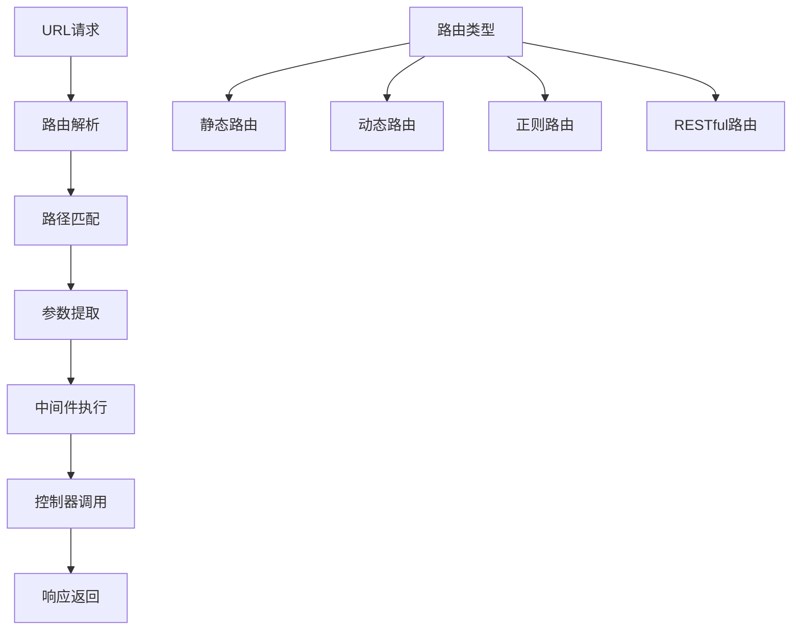

# 路由与URL重写

## 🎯 学习目标
- 掌握URL路由的基本概念和实现
- 理解URL重写的原理和配置
- 学会构建RESTful API路由
- 了解路由的性能优化技巧

## 📚 核心概念

### 路由系统概述



## 🔧 基本路由实现

### 简单路由器
```php
<?php
// 1. 基础路由器类
class Router {
    private $routes = [];
    private $middlewares = [];
    private $currentGroup = '';
    
    // 添加路由
    public function addRoute($method, $path, $handler, $middlewares = []) {
        $method = strtoupper($method);
        $path = $this->currentGroup . $path;
        
        $this->routes[] = [
            'method' => $method,
            'path' => $path,
            'pattern' => $this->pathToPattern($path),
            'handler' => $handler,
            'middlewares' => array_merge($this->middlewares, $middlewares)
        ];
    }
    
    // GET路由
    public function get($path, $handler, $middlewares = []) {
        $this->addRoute('GET', $path, $handler, $middlewares);
    }
    
    // POST路由
    public function post($path, $handler, $middlewares = []) {
        $this->addRoute('POST', $path, $handler, $middlewares);
    }
    
    // PUT路由
    public function put($path, $handler, $middlewares = []) {
        $this->addRoute('PUT', $path, $handler, $middlewares);
    }
    
    // DELETE路由
    public function delete($path, $handler, $middlewares = []) {
        $this->addRoute('DELETE', $path, $handler, $middlewares);
    }
    
    // 路由组
    public function group($prefix, $callback, $middlewares = []) {
        $previousGroup = $this->currentGroup;
        $previousMiddlewares = $this->middlewares;
        
        $this->currentGroup .= $prefix;
        $this->middlewares = array_merge($this->middlewares, $middlewares);
        
        $callback($this);
        
        $this->currentGroup = $previousGroup;
        $this->middlewares = $previousMiddlewares;
    }
    
    // 路径转换为正则表达式
    private function pathToPattern($path) {
        // 处理参数 {id} -> (?P<id>[^/]+)
        $pattern = preg_replace('/\{([^}]+)\}/', '(?P<$1>[^/]+)', $path);
        
        // 处理可选参数 {id?} -> (?P<id>[^/]+)?
        $pattern = preg_replace('/\{([^}]+)\?\}/', '(?P<$1>[^/]+)?', $pattern);
        
        return '#^' . $pattern . '$#';
    }
    
    // 匹配路由
    public function match($method, $path) {
        foreach ($this->routes as $route) {
            if ($route['method'] === $method && preg_match($route['pattern'], $path, $matches)) {
                // 提取参数
                $params = array_filter($matches, 'is_string', ARRAY_FILTER_USE_KEY);
                
                return [
                    'handler' => $route['handler'],
                    'params' => $params,
                    'middlewares' => $route['middlewares']
                ];
            }
        }
        
        return null;
    }
    
    // 处理请求
    public function dispatch($method = null, $path = null) {
        $method = $method ?: $_SERVER['REQUEST_METHOD'];
        $path = $path ?: parse_url($_SERVER['REQUEST_URI'], PHP_URL_PATH);
        
        $match = $this->match($method, $path);
        
        if (!$match) {
            http_response_code(404);
            echo "404 Not Found";
            return;
        }
        
        // 执行中间件
        foreach ($match['middlewares'] as $middleware) {
            if (is_callable($middleware)) {
                $result = $middleware();
                if ($result === false) {
                    return;
                }
            }
        }
        
        // 执行处理器
        $handler = $match['handler'];
        $params = $match['params'];
        
        if (is_callable($handler)) {
            $handler($params);
        } elseif (is_string($handler) && strpos($handler, '@') !== false) {
            $this->callControllerAction($handler, $params);
        } else {
            echo "Invalid handler";
        }
    }
    
    // 调用控制器方法
    private function callControllerAction($handler, $params) {
        list($controller, $action) = explode('@', $handler);
        
        if (class_exists($controller)) {
            $instance = new $controller();
            if (method_exists($instance, $action)) {
                $instance->$action($params);
            } else {
                echo "Method $action not found in $controller";
            }
        } else {
            echo "Controller $controller not found";
        }
    }
    
    // 生成URL
    public function url($name, $params = []) {
        // 简化实现，实际应用中需要命名路由
        return '/' . implode('/', $params);
    }
}

// 使用示例
echo "=== 基础路由器示例 ===\n";

try {
    $router = new Router();
    
    // 基本路由
    $router->get('/', function($params) {
        echo "首页\n";
    });
    
    $router->get('/user/{id}', function($params) {
        echo "用户ID: " . $params['id'] . "\n";
    });
    
    $router->post('/user', function($params) {
        echo "创建用户\n";
    });
    
    // 路由组
    $router->group('/api', function($router) {
        $router->get('/users', function($params) {
            echo "API: 获取用户列表\n";
        });
        
        $router->get('/users/{id}', function($params) {
            echo "API: 获取用户 " . $params['id'] . "\n";
        });
    });
    
    // 测试路由匹配
    echo "测试路由匹配:\n";
    
    // 模拟请求
    $_SERVER['REQUEST_METHOD'] = 'GET';
    $_SERVER['REQUEST_URI'] = '/user/123';
    
    $router->dispatch();
    
} catch (Exception $e) {
    echo "错误: " . $e->getMessage() . "\n";
}
?>
```

### RESTful路由
```php
<?php
// 1. RESTful路由器
class RestfulRouter extends Router {
    // 资源路由
    public function resource($name, $controller, $options = []) {
        $only = $options['only'] ?? ['index', 'show', 'store', 'update', 'destroy'];
        $except = $options['except'] ?? [];
        
        $actions = array_diff($only, $except);
        
        foreach ($actions as $action) {
            switch ($action) {
                case 'index':
                    $this->get("/$name", "$controller@index");
                    break;
                case 'show':
                    $this->get("/$name/{id}", "$controller@show");
                    break;
                case 'store':
                    $this->post("/$name", "$controller@store");
                    break;
                case 'update':
                    $this->put("/$name/{id}", "$controller@update");
                    break;
                case 'destroy':
                    $this->delete("/$name/{id}", "$controller@destroy");
                    break;
            }
        }
    }
    
    // API资源路由
    public function apiResource($name, $controller, $options = []) {
        $this->group('/api', function($router) use ($name, $controller, $options) {
            $router->resource($name, $controller, $options);
        });
    }
}

// 2. 控制器基类
abstract class Controller {
    protected $request;
    protected $response;
    
    public function __construct() {
        $this->request = new RequestHandler();
        $this->response = new ResponseBuilder();
    }
    
    // 返回JSON响应
    protected function json($data, $status = 200) {
        return $this->response->status($status)->json($data)->send();
    }
    
    // 返回错误响应
    protected function error($message, $status = 400) {
        return $this->json(['error' => $message], $status);
    }
}

// 3. 用户控制器示例
class UserController extends Controller {
    public function index($params) {
        $users = [
            ['id' => 1, 'name' => 'John'],
            ['id' => 2, 'name' => 'Jane']
        ];
        
        echo "获取用户列表: " . json_encode($users) . "\n";
    }
    
    public function show($params) {
        $id = $params['id'];
        $user = ['id' => $id, 'name' => 'User ' . $id];
        
        echo "获取用户: " . json_encode($user) . "\n";
    }
    
    public function store($params) {
        echo "创建用户\n";
    }
    
    public function update($params) {
        $id = $params['id'];
        echo "更新用户: $id\n";
    }
    
    public function destroy($params) {
        $id = $params['id'];
        echo "删除用户: $id\n";
    }
}

// 使用示例
echo "=== RESTful路由示例 ===\n";

try {
    $router = new RestfulRouter();
    
    // 资源路由
    $router->resource('users', 'UserController');
    
    // API资源路由
    $router->apiResource('posts', 'PostController', [
        'only' => ['index', 'show', 'store']
    ]);
    
    // 测试RESTful路由
    echo "测试RESTful路由:\n";
    
    // GET /users
    $_SERVER['REQUEST_METHOD'] = 'GET';
    $_SERVER['REQUEST_URI'] = '/users';
    $router->dispatch();
    
    // GET /users/123
    $_SERVER['REQUEST_URI'] = '/users/123';
    $router->dispatch();
    
    // POST /users
    $_SERVER['REQUEST_METHOD'] = 'POST';
    $_SERVER['REQUEST_URI'] = '/users';
    $router->dispatch();
    
} catch (Exception $e) {
    echo "错误: " . $e->getMessage() . "\n";
}
?>
```

## 🔧 URL重写配置

### Apache重写规则
```apache
# .htaccess 文件配置

# 启用重写引擎
RewriteEngine On

# 重定向到HTTPS
RewriteCond %{HTTPS} off
RewriteRule ^(.*)$ https://%{HTTP_HOST}%{REQUEST_URI} [L,R=301]

# 移除www前缀
RewriteCond %{HTTP_HOST} ^www\.(.*)$ [NC]
RewriteRule ^(.*)$ https://%1/$1 [R=301,L]

# 前端路由支持
RewriteCond %{REQUEST_FILENAME} !-f
RewriteCond %{REQUEST_FILENAME} !-d
RewriteRule ^(.*)$ index.php [QSA,L]

# API路由
RewriteRule ^api/(.*)$ api/index.php [QSA,L]

# 缓存静态文件
<FilesMatch "\.(css|js|png|jpg|jpeg|gif|ico|svg)$">
    ExpiresActive On
    ExpiresDefault "access plus 1 month"
</FilesMatch>
```

### Nginx重写配置
```nginx
server {
    listen 80;
    server_name example.com www.example.com;
    
    # 重定向到HTTPS
    return 301 https://example.com$request_uri;
}

server {
    listen 443 ssl http2;
    server_name www.example.com;
    
    # 移除www前缀
    return 301 https://example.com$request_uri;
}

server {
    listen 443 ssl http2;
    server_name example.com;
    root /var/www/html;
    index index.php index.html;
    
    # PHP处理
    location ~ \.php$ {
        fastcgi_pass unix:/var/run/php/php8.0-fpm.sock;
        fastcgi_index index.php;
        include fastcgi_params;
        fastcgi_param SCRIPT_FILENAME $document_root$fastcgi_script_name;
    }
    
    # 前端路由支持
    location / {
        try_files $uri $uri/ /index.php?$query_string;
    }
    
    # API路由
    location /api {
        try_files $uri $uri/ /api/index.php?$query_string;
    }
    
    # 静态文件缓存
    location ~* \.(css|js|png|jpg|jpeg|gif|ico|svg)$ {
        expires 1M;
        add_header Cache-Control "public, immutable";
    }
}
```

### PHP URL重写处理
```php
<?php
// 1. URL重写处理器
class UrlRewriter {
    private $rules = [];
    
    // 添加重写规则
    public function addRule($pattern, $replacement, $flags = []) {
        $this->rules[] = [
            'pattern' => $pattern,
            'replacement' => $replacement,
            'flags' => $flags
        ];
    }
    
    // 处理URL重写
    public function rewrite($url) {
        foreach ($this->rules as $rule) {
            $pattern = $rule['pattern'];
            $replacement = $rule['replacement'];
            $flags = $rule['flags'];
            
            if (preg_match($pattern, $url)) {
                $newUrl = preg_replace($pattern, $replacement, $url);
                
                // 处理重定向标志
                if (in_array('R', $flags)) {
                    $code = in_array('301', $flags) ? 301 : 302;
                    header("Location: $newUrl", true, $code);
                    exit;
                }
                
                return $newUrl;
            }
        }
        
        return $url;
    }
    
    // 预定义规则
    public function addCommonRules() {
        // 移除尾部斜杠
        $this->addRule('#^(.+)/$#', '$1', ['R', '301']);
        
        // 强制小写
        $this->addRule('#^([A-Z].*)$#', function($matches) {
            return strtolower($matches[1]);
        }, ['R', '301']);
        
        // 旧URL重定向
        $this->addRule('#^old-page$#', '/new-page', ['R', '301']);
    }
}

// 2. SEO友好URL生成器
class SeoUrlGenerator {
    // 生成SEO友好的URL
    public static function generate($title, $id = null) {
        // 转换为小写
        $slug = strtolower($title);
        
        // 替换空格为连字符
        $slug = preg_replace('/\s+/', '-', $slug);
        
        // 移除特殊字符
        $slug = preg_replace('/[^a-z0-9\-]/', '', $slug);
        
        // 移除多余的连字符
        $slug = preg_replace('/-+/', '-', $slug);
        
        // 移除首尾连字符
        $slug = trim($slug, '-');
        
        // 添加ID（可选）
        if ($id) {
            $slug = $id . '-' . $slug;
        }
        
        return $slug;
    }
    
    // 从URL提取ID
    public static function extractId($slug) {
        if (preg_match('/^(\d+)-/', $slug, $matches)) {
            return (int)$matches[1];
        }
        
        return null;
    }
    
    // 生成面包屑导航
    public static function generateBreadcrumb($path) {
        $segments = explode('/', trim($path, '/'));
        $breadcrumb = [];
        $currentPath = '';
        
        foreach ($segments as $segment) {
            $currentPath .= '/' . $segment;
            $breadcrumb[] = [
                'title' => ucwords(str_replace('-', ' ', $segment)),
                'url' => $currentPath
            ];
        }
        
        return $breadcrumb;
    }
}

// 使用示例
echo "=== URL重写示例 ===\n";

try {
    // URL重写处理
    $rewriter = new UrlRewriter();
    $rewriter->addCommonRules();
    
    // 测试URL重写
    $testUrls = [
        '/page/',
        '/OLD-PAGE',
        '/old-page'
    ];
    
    foreach ($testUrls as $url) {
        $rewritten = $rewriter->rewrite($url);
        echo "原URL: $url -> 重写后: $rewritten\n";
    }
    
    // SEO友好URL生成
    $title = "How to Learn PHP Programming";
    $seoUrl = SeoUrlGenerator::generate($title, 123);
    echo "SEO URL: $seoUrl\n";
    
    $extractedId = SeoUrlGenerator::extractId($seoUrl);
    echo "提取的ID: $extractedId\n";
    
    // 面包屑导航
    $breadcrumb = SeoUrlGenerator::generateBreadcrumb('/blog/php/tutorials');
    echo "面包屑导航:\n";
    foreach ($breadcrumb as $crumb) {
        echo "  {$crumb['title']} -> {$crumb['url']}\n";
    }
    
} catch (Exception $e) {
    echo "错误: " . $e->getMessage() . "\n";
}
?>
```

## 📊 最佳实践

### 路由性能优化
```php
<?php
// 路由性能优化

class OptimizedRouter extends Router {
    private $cache = [];
    private $cacheFile = 'routes.cache';
    
    // 缓存路由
    public function cacheRoutes() {
        $routeData = [
            'routes' => $this->routes,
            'timestamp' => time()
        ];
        
        file_put_contents($this->cacheFile, serialize($routeData));
    }
    
    // 加载缓存路由
    public function loadCachedRoutes() {
        if (file_exists($this->cacheFile)) {
            $data = unserialize(file_get_contents($this->cacheFile));
            
            // 检查缓存是否过期（1小时）
            if (time() - $data['timestamp'] < 3600) {
                $this->routes = $data['routes'];
                return true;
            }
        }
        
        return false;
    }
    
    // 优化的路由匹配
    public function match($method, $path) {
        $cacheKey = $method . ':' . $path;
        
        // 检查内存缓存
        if (isset($this->cache[$cacheKey])) {
            return $this->cache[$cacheKey];
        }
        
        $result = parent::match($method, $path);
        
        // 缓存结果
        $this->cache[$cacheKey] = $result;
        
        return $result;
    }
}

// 路由最佳实践指南
class RoutingBestPractices {
    // 1. 路由命名规范
    public static function getRestfulRoutes($resource) {
        return [
            "GET /$resource" => 'index',           // 列表
            "GET /$resource/{id}" => 'show',       // 详情
            "POST /$resource" => 'store',          // 创建
            "PUT /$resource/{id}" => 'update',     // 更新
            "DELETE /$resource/{id}" => 'destroy'  // 删除
        ];
    }
    
    // 2. 路由分组策略
    public static function groupRoutes($router) {
        // API路由组
        $router->group('/api/v1', function($router) {
            $router->resource('users', 'Api\UserController');
            $router->resource('posts', 'Api\PostController');
        }, ['middleware' => 'api']);
        
        // 管理后台路由组
        $router->group('/admin', function($router) {
            $router->resource('users', 'Admin\UserController');
            $router->resource('posts', 'Admin\PostController');
        }, ['middleware' => 'auth']);
    }
    
    // 3. 路由参数验证
    public static function validateRouteParams($params, $rules) {
        foreach ($rules as $param => $rule) {
            if (!isset($params[$param])) {
                throw new Exception("缺少参数: $param");
            }
            
            $value = $params[$param];
            
            switch ($rule) {
                case 'int':
                    if (!ctype_digit($value)) {
                        throw new Exception("参数 $param 必须是整数");
                    }
                    break;
                case 'uuid':
                    if (!preg_match('/^[0-9a-f]{8}-[0-9a-f]{4}-[0-9a-f]{4}-[0-9a-f]{4}-[0-9a-f]{12}$/', $value)) {
                        throw new Exception("参数 $param 必须是有效的UUID");
                    }
                    break;
            }
        }
        
        return true;
    }
}

// 使用示例
echo "=== 路由最佳实践示例 ===\n";

try {
    // 优化路由器
    $router = new OptimizedRouter();
    
    // 尝试加载缓存路由
    if (!$router->loadCachedRoutes()) {
        // 定义路由
        $router->get('/users', 'UserController@index');
        $router->get('/users/{id}', 'UserController@show');
        
        // 缓存路由
        $router->cacheRoutes();
        echo "路由已缓存\n";
    } else {
        echo "路由从缓存加载\n";
    }
    
    // RESTful路由规范
    $restfulRoutes = RoutingBestPractices::getRestfulRoutes('posts');
    echo "RESTful路由规范:\n";
    foreach ($restfulRoutes as $route => $action) {
        echo "  $route -> $action\n";
    }
    
    // 路由参数验证
    $params = ['id' => '123', 'uuid' => 'invalid-uuid'];
    $rules = ['id' => 'int', 'uuid' => 'uuid'];
    
    try {
        RoutingBestPractices::validateRouteParams($params, $rules);
        echo "参数验证通过\n";
    } catch (Exception $e) {
        echo "参数验证失败: " . $e->getMessage() . "\n";
    }
    
    // 清理缓存文件
    if (file_exists('routes.cache')) {
        unlink('routes.cache');
    }
    
} catch (Exception $e) {
    echo "错误: " . $e->getMessage() . "\n";
}
?>
```

## 🎓 学习建议

### 费曼学习法应用
1. **选择概念**: 选择路由中的核心概念
2. **简化解释**: 用简单语言解释路由的工作原理
3. **识别盲点**: 发现理解不深入的地方
4. **重新学习**: 针对盲点进行深入学习

### 刻意练习重点
1. **路由设计**: 掌握RESTful路由设计原则
2. **性能优化**: 学习路由性能优化技巧
3. **URL重写**: 理解URL重写的配置和应用
4. **最佳实践**: 掌握路由开发的最佳实践

## 🔗 相关链接
- [[01-HTTP协议基础|HTTP协议基础]]
- [[02-表单处理|表单处理]]
- [[03-会话管理|会话管理]]
- [[04-Cookie操作|Cookie操作]]
- [[05-请求与响应|请求与响应]]
- [[07-Web开发最佳实践|Web开发最佳实践]]
