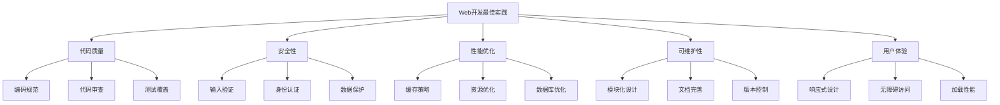

# Web开发最佳实践

## 🎯 学习目标
- 掌握Web开发的核心最佳实践
- 理解代码质量和安全性要求
- 学会性能优化和可维护性设计
- 了解现代Web开发标准

## 📚 核心概念

### Web开发最佳实践体系



## 🔧 代码质量最佳实践

### 编码规范和标准
```php
<?php
// 1. PHP编码规范（PSR标准）
class CodingStandards {
    // PSR-1: 基本编码标准
    public static function psr1Guidelines() {
        return [
            '文件必须使用<?php标签',
            '文件必须使用UTF-8编码',
            '类名必须使用StudlyCaps',
            '方法名必须使用camelCase',
            '常量必须使用UPPER_CASE'
        ];
    }
    
    // PSR-2: 编码风格指南
    public static function psr2Guidelines() {
        return [
            '缩进使用4个空格',
            '行长度不超过120字符',
            '类的开括号必须在下一行',
            '方法的开括号必须在下一行',
            '控制结构关键字后必须有空格'
        ];
    }
    
    // PSR-4: 自动加载标准
    public static function psr4Example() {
        // 命名空间与目录结构对应
        // App\Controllers\UserController -> app/Controllers/UserController.php
        return 'spl_autoload_register(function ($class) {
            $file = str_replace("\\\\", "/", $class) . ".php";
            if (file_exists($file)) {
                require $file;
            }
        });';
    }
}

// 2. 代码质量检查器
class CodeQualityChecker {
    private $rules;
    
    public function __construct() {
        $this->rules = [
            'max_line_length' => 120,
            'max_method_length' => 50,
            'max_class_length' => 500,
            'max_complexity' => 10
        ];
    }
    
    // 检查代码质量
    public function checkCode($code) {
        $issues = [];
        
        $lines = explode("\n", $code);
        
        foreach ($lines as $lineNumber => $line) {
            // 检查行长度
            if (strlen($line) > $this->rules['max_line_length']) {
                $issues[] = [
                    'line' => $lineNumber + 1,
                    'type' => 'line_length',
                    'message' => '行长度超过' . $this->rules['max_line_length'] . '字符'
                ];
            }
            
            // 检查缩进
            if (preg_match('/^\t/', $line)) {
                $issues[] = [
                    'line' => $lineNumber + 1,
                    'type' => 'indentation',
                    'message' => '使用制表符而非空格缩进'
                ];
            }
            
            // 检查尾随空格
            if (preg_match('/\s+$/', $line)) {
                $issues[] = [
                    'line' => $lineNumber + 1,
                    'type' => 'trailing_space',
                    'message' => '行尾有多余空格'
                ];
            }
        }
        
        return $issues;
    }
    
    // 计算圈复杂度
    public function calculateComplexity($code) {
        $complexity = 1; // 基础复杂度
        
        // 统计控制结构
        $patterns = [
            '/\bif\b/',
            '/\belse\b/',
            '/\belseif\b/',
            '/\bwhile\b/',
            '/\bfor\b/',
            '/\bforeach\b/',
            '/\bswitch\b/',
            '/\bcase\b/',
            '/\bcatch\b/',
            '/\?\s*:/' // 三元操作符
        ];
        
        foreach ($patterns as $pattern) {
            $complexity += preg_match_all($pattern, $code);
        }
        
        return $complexity;
    }
}

// 3. 代码格式化器
class CodeFormatter {
    // 格式化PHP代码
    public static function formatPhp($code) {
        // 移除尾随空格
        $code = preg_replace('/\s+$/m', '', $code);
        
        // 统一换行符
        $code = str_replace(["\r\n", "\r"], "\n", $code);
        
        // 确保文件以换行符结尾
        if (!empty($code) && substr($code, -1) !== "\n") {
            $code .= "\n";
        }
        
        return $code;
    }
    
    // 格式化SQL查询
    public static function formatSql($sql) {
        $keywords = ['SELECT', 'FROM', 'WHERE', 'JOIN', 'ORDER BY', 'GROUP BY', 'HAVING'];
        
        foreach ($keywords as $keyword) {
            $sql = preg_replace('/\b' . $keyword . '\b/i', "\n" . $keyword, $sql);
        }
        
        return trim($sql);
    }
}

// 使用示例
echo "=== 代码质量最佳实践示例 ===\n";

try {
    // 编码规范
    $psr1 = CodingStandards::psr1Guidelines();
    echo "PSR-1 基本编码标准:\n";
    foreach ($psr1 as $guideline) {
        echo "  - $guideline\n";
    }
    
    // 代码质量检查
    $checker = new CodeQualityChecker();
    
    $testCode = "<?php\nclass Test {\n\tpublic function longMethod() {\n        // 这行有尾随空格   \n        if (\$condition) {\n            return 'This is a very long line that exceeds the maximum line length limit and should be broken into multiple lines';\n        }\n    }\n}";
    
    $issues = $checker->checkCode($testCode);
    echo "\n代码质量问题:\n";
    foreach ($issues as $issue) {
        echo "  行 {$issue['line']}: {$issue['message']}\n";
    }
    
    // 圈复杂度计算
    $complexity = $checker->calculateComplexity($testCode);
    echo "\n圈复杂度: $complexity\n";
    
    // 代码格式化
    $formattedCode = CodeFormatter::formatPhp($testCode);
    echo "\n代码已格式化\n";
    
} catch (Exception $e) {
    echo "错误: " . $e->getMessage() . "\n";
}
?>
```

### 安全最佳实践
```php
<?php
// 1. 安全检查器
class SecurityChecker {
    private $vulnerabilities = [];
    
    // 检查SQL注入风险
    public function checkSqlInjection($code) {
        $patterns = [
            '/\$_[GET|POST|REQUEST]\[.*?\].*?mysql_query/i',
            '/\$_[GET|POST|REQUEST]\[.*?\].*?query\(/i',
            '/\$_[GET|POST|REQUEST]\[.*?\].*?exec\(/i'
        ];
        
        foreach ($patterns as $pattern) {
            if (preg_match($pattern, $code)) {
                $this->vulnerabilities[] = [
                    'type' => 'sql_injection',
                    'severity' => 'high',
                    'message' => '可能存在SQL注入风险'
                ];
            }
        }
    }
    
    // 检查XSS风险
    public function checkXss($code) {
        $patterns = [
            '/echo\s+\$_[GET|POST|REQUEST]/i',
            '/print\s+\$_[GET|POST|REQUEST]/i',
            '/\<\?\=\s*\$_[GET|POST|REQUEST]/i'
        ];
        
        foreach ($patterns as $pattern) {
            if (preg_match($pattern, $code)) {
                $this->vulnerabilities[] = [
                    'type' => 'xss',
                    'severity' => 'high',
                    'message' => '可能存在XSS风险'
                ];
            }
        }
    }
    
    // 检查文件包含风险
    public function checkFileInclusion($code) {
        $patterns = [
            '/include\s*\(\s*\$_[GET|POST|REQUEST]/i',
            '/require\s*\(\s*\$_[GET|POST|REQUEST]/i',
            '/include_once\s*\(\s*\$_[GET|POST|REQUEST]/i',
            '/require_once\s*\(\s*\$_[GET|POST|REQUEST]/i'
        ];
        
        foreach ($patterns as $pattern) {
            if (preg_match($pattern, $code)) {
                $this->vulnerabilities[] = [
                    'type' => 'file_inclusion',
                    'severity' => 'critical',
                    'message' => '可能存在文件包含风险'
                ];
            }
        }
    }
    
    // 获取所有漏洞
    public function getVulnerabilities() {
        return $this->vulnerabilities;
    }
    
    // 生成安全报告
    public function generateReport() {
        $report = [
            'total' => count($this->vulnerabilities),
            'critical' => 0,
            'high' => 0,
            'medium' => 0,
            'low' => 0
        ];
        
        foreach ($this->vulnerabilities as $vuln) {
            $report[$vuln['severity']]++;
        }
        
        return $report;
    }
}

// 2. 安全工具类
class SecurityUtils {
    // 安全的输入过滤
    public static function sanitizeInput($input, $type = 'string') {
        switch ($type) {
            case 'string':
                return htmlspecialchars(strip_tags(trim($input)), ENT_QUOTES, 'UTF-8');
            case 'email':
                return filter_var($input, FILTER_SANITIZE_EMAIL);
            case 'url':
                return filter_var($input, FILTER_SANITIZE_URL);
            case 'int':
                return filter_var($input, FILTER_SANITIZE_NUMBER_INT);
            case 'float':
                return filter_var($input, FILTER_SANITIZE_NUMBER_FLOAT, FILTER_FLAG_ALLOW_FRACTION);
            default:
                return $input;
        }
    }
    
    // 生成安全的随机字符串
    public static function generateSecureToken($length = 32) {
        return bin2hex(random_bytes($length / 2));
    }
    
    // 安全的密码哈希
    public static function hashPassword($password) {
        return password_hash($password, PASSWORD_ARGON2ID, [
            'memory_cost' => 65536,
            'time_cost' => 4,
            'threads' => 3
        ]);
    }
    
    // 验证密码
    public static function verifyPassword($password, $hash) {
        return password_verify($password, $hash);
    }
    
    // 安全的文件上传检查
    public static function validateFileUpload($file) {
        $allowedTypes = ['image/jpeg', 'image/png', 'image/gif', 'application/pdf'];
        $maxSize = 5 * 1024 * 1024; // 5MB
        
        // 检查文件类型
        $finfo = finfo_open(FILEINFO_MIME_TYPE);
        $mimeType = finfo_file($finfo, $file['tmp_name']);
        finfo_close($finfo);
        
        if (!in_array($mimeType, $allowedTypes)) {
            throw new Exception('不允许的文件类型');
        }
        
        // 检查文件大小
        if ($file['size'] > $maxSize) {
            throw new Exception('文件大小超过限制');
        }
        
        return true;
    }
}

// 使用示例
echo "=== 安全最佳实践示例 ===\n";

try {
    // 安全检查
    $checker = new SecurityChecker();
    
    $unsafeCode = '
    <?php
    $id = $_GET["id"];
    $query = "SELECT * FROM users WHERE id = " . $id;
    mysql_query($query);
    
    echo $_POST["message"];
    
    include($_GET["page"] . ".php");
    ';
    
    $checker->checkSqlInjection($unsafeCode);
    $checker->checkXss($unsafeCode);
    $checker->checkFileInclusion($unsafeCode);
    
    $vulnerabilities = $checker->getVulnerabilities();
    echo "发现安全漏洞:\n";
    foreach ($vulnerabilities as $vuln) {
        echo "  {$vuln['severity']}: {$vuln['message']}\n";
    }
    
    $report = $checker->generateReport();
    echo "\n安全报告:\n";
    echo "  总计: {$report['total']}\n";
    echo "  严重: {$report['critical']}\n";
    echo "  高危: {$report['high']}\n";
    
    // 安全工具使用
    $userInput = '<script>alert("xss")</script>Hello World';
    $safeInput = SecurityUtils::sanitizeInput($userInput);
    echo "\n输入过滤:\n";
    echo "  原始: $userInput\n";
    echo "  过滤后: $safeInput\n";
    
    // 生成安全令牌
    $token = SecurityUtils::generateSecureToken();
    echo "\n安全令牌: " . substr($token, 0, 16) . "...\n";
    
    // 密码哈希
    $password = 'mypassword123';
    $hash = SecurityUtils::hashPassword($password);
    $isValid = SecurityUtils::verifyPassword($password, $hash);
    echo "\n密码验证: " . ($isValid ? '通过' : '失败') . "\n";
    
} catch (Exception $e) {
    echo "错误: " . $e->getMessage() . "\n";
}
?>
```

## 🔧 性能优化最佳实践

### 性能监控和优化
```php
<?php
// 1. 性能监控器
class PerformanceMonitor {
    private $startTime;
    private $startMemory;
    private $checkpoints = [];
    
    public function __construct() {
        $this->start();
    }
    
    // 开始监控
    public function start() {
        $this->startTime = microtime(true);
        $this->startMemory = memory_get_usage();
    }
    
    // 添加检查点
    public function checkpoint($name) {
        $this->checkpoints[$name] = [
            'time' => microtime(true),
            'memory' => memory_get_usage(),
            'peak_memory' => memory_get_peak_usage()
        ];
    }
    
    // 获取性能报告
    public function getReport() {
        $currentTime = microtime(true);
        $currentMemory = memory_get_usage();
        
        $report = [
            'total_time' => $currentTime - $this->startTime,
            'total_memory' => $currentMemory - $this->startMemory,
            'peak_memory' => memory_get_peak_usage(),
            'checkpoints' => []
        ];
        
        $previousTime = $this->startTime;
        $previousMemory = $this->startMemory;
        
        foreach ($this->checkpoints as $name => $data) {
            $report['checkpoints'][$name] = [
                'elapsed_time' => $data['time'] - $previousTime,
                'memory_usage' => $data['memory'] - $previousMemory,
                'peak_memory' => $data['peak_memory']
            ];
            
            $previousTime = $data['time'];
            $previousMemory = $data['memory'];
        }
        
        return $report;
    }
}

// 2. 缓存管理器
class CacheManager {
    private $cacheDir;
    private $defaultTtl;
    
    public function __construct($cacheDir = 'cache', $defaultTtl = 3600) {
        $this->cacheDir = $cacheDir;
        $this->defaultTtl = $defaultTtl;
        
        if (!is_dir($this->cacheDir)) {
            mkdir($this->cacheDir, 0755, true);
        }
    }
    
    // 获取缓存
    public function get($key, $default = null) {
        $file = $this->getCacheFile($key);
        
        if (!file_exists($file)) {
            return $default;
        }
        
        $data = unserialize(file_get_contents($file));
        
        // 检查是否过期
        if ($data['expires'] > 0 && time() > $data['expires']) {
            unlink($file);
            return $default;
        }
        
        return $data['value'];
    }
    
    // 设置缓存
    public function set($key, $value, $ttl = null) {
        $ttl = $ttl ?: $this->defaultTtl;
        $expires = $ttl > 0 ? time() + $ttl : 0;
        
        $data = [
            'value' => $value,
            'expires' => $expires,
            'created' => time()
        ];
        
        $file = $this->getCacheFile($key);
        return file_put_contents($file, serialize($data)) !== false;
    }
    
    // 删除缓存
    public function delete($key) {
        $file = $this->getCacheFile($key);
        
        if (file_exists($file)) {
            return unlink($file);
        }
        
        return true;
    }
    
    // 清空缓存
    public function clear() {
        $files = glob($this->cacheDir . '/*');
        
        foreach ($files as $file) {
            if (is_file($file)) {
                unlink($file);
            }
        }
        
        return true;
    }
    
    // 获取缓存文件路径
    private function getCacheFile($key) {
        return $this->cacheDir . '/' . md5($key) . '.cache';
    }
    
    // 记住函数结果
    public function remember($key, $callback, $ttl = null) {
        $value = $this->get($key);
        
        if ($value === null) {
            $value = $callback();
            $this->set($key, $value, $ttl);
        }
        
        return $value;
    }
}

// 3. 数据库查询优化器
class QueryOptimizer {
    private $queries = [];
    
    // 记录查询
    public function logQuery($sql, $time, $rows = 0) {
        $this->queries[] = [
            'sql' => $sql,
            'time' => $time,
            'rows' => $rows,
            'timestamp' => microtime(true)
        ];
    }
    
    // 分析慢查询
    public function getSlowQueries($threshold = 0.1) {
        return array_filter($this->queries, function($query) use ($threshold) {
            return $query['time'] > $threshold;
        });
    }
    
    // 获取查询统计
    public function getStats() {
        if (empty($this->queries)) {
            return [];
        }
        
        $times = array_column($this->queries, 'time');
        
        return [
            'total_queries' => count($this->queries),
            'total_time' => array_sum($times),
            'average_time' => array_sum($times) / count($times),
            'slowest_query' => max($times),
            'fastest_query' => min($times)
        ];
    }
    
    // 优化建议
    public function getOptimizationSuggestions() {
        $suggestions = [];
        
        foreach ($this->queries as $query) {
            $sql = strtolower($query['sql']);
            
            // 检查是否使用SELECT *
            if (strpos($sql, 'select *') !== false) {
                $suggestions[] = '避免使用 SELECT *，只选择需要的列';
            }
            
            // 检查是否缺少WHERE条件
            if (strpos($sql, 'select') !== false && strpos($sql, 'where') === false) {
                $suggestions[] = '考虑添加 WHERE 条件限制结果集';
            }
            
            // 检查是否使用LIMIT
            if (strpos($sql, 'select') !== false && strpos($sql, 'limit') === false) {
                $suggestions[] = '考虑使用 LIMIT 限制返回行数';
            }
        }
        
        return array_unique($suggestions);
    }
}

// 使用示例
echo "=== 性能优化最佳实践示例 ===\n";

try {
    // 性能监控
    $monitor = new PerformanceMonitor();
    
    // 模拟一些操作
    usleep(10000); // 10ms
    $monitor->checkpoint('operation1');
    
    usleep(20000); // 20ms
    $monitor->checkpoint('operation2');
    
    $report = $monitor->getReport();
    echo "性能报告:\n";
    echo "  总时间: " . round($report['total_time'] * 1000, 2) . "ms\n";
    echo "  内存使用: " . round($report['total_memory'] / 1024, 2) . "KB\n";
    echo "  峰值内存: " . round($report['peak_memory'] / 1024, 2) . "KB\n";
    
    // 缓存管理
    $cache = new CacheManager('test_cache');
    
    // 缓存数据
    $cache->set('user_123', ['name' => 'John', 'email' => 'john@example.com'], 60);
    
    // 获取缓存
    $userData = $cache->get('user_123');
    echo "\n缓存数据: " . json_encode($userData) . "\n";
    
    // 记住函数结果
    $expensiveResult = $cache->remember('expensive_calculation', function() {
        // 模拟耗时计算
        usleep(50000);
        return 'calculated_result';
    }, 300);
    
    echo "计算结果: $expensiveResult\n";
    
    // 查询优化
    $optimizer = new QueryOptimizer();
    
    // 模拟查询
    $optimizer->logQuery('SELECT * FROM users', 0.15, 1000);
    $optimizer->logQuery('SELECT id, name FROM users WHERE active = 1', 0.05, 50);
    $optimizer->logQuery('SELECT COUNT(*) FROM posts', 0.02, 1);
    
    $slowQueries = $optimizer->getSlowQueries(0.1);
    echo "\n慢查询数量: " . count($slowQueries) . "\n";
    
    $stats = $optimizer->getStats();
    echo "查询统计:\n";
    echo "  总查询数: {$stats['total_queries']}\n";
    echo "  平均时间: " . round($stats['average_time'] * 1000, 2) . "ms\n";
    
    $suggestions = $optimizer->getOptimizationSuggestions();
    echo "优化建议:\n";
    foreach ($suggestions as $suggestion) {
        echo "  - $suggestion\n";
    }
    
    // 清理缓存
    $cache->clear();
    if (is_dir('test_cache')) {
        rmdir('test_cache');
    }
    
} catch (Exception $e) {
    echo "错误: " . $e->getMessage() . "\n";
}
?>
```

## 📊 开发流程最佳实践

### 项目管理和部署
```php
<?php
// 开发流程最佳实践指南

class DevelopmentBestPractices {
    // 1. 版本控制最佳实践
    public static function getGitWorkflow() {
        return [
            'main' => '主分支，用于生产环境',
            'develop' => '开发分支，用于集成新功能',
            'feature/*' => '功能分支，开发新功能',
            'hotfix/*' => '热修复分支，修复紧急问题',
            'release/*' => '发布分支，准备新版本发布'
        ];
    }
    
    // 2. 代码审查清单
    public static function getCodeReviewChecklist() {
        return [
            '功能性' => [
                '代码是否实现了预期功能',
                '是否处理了边界情况',
                '错误处理是否完善'
            ],
            '可读性' => [
                '代码是否易于理解',
                '变量和函数命名是否清晰',
                '注释是否充分'
            ],
            '性能' => [
                '是否存在性能瓶颈',
                '算法复杂度是否合理',
                '是否有不必要的循环或查询'
            ],
            '安全性' => [
                '输入是否经过验证',
                '是否存在安全漏洞',
                '敏感数据是否得到保护'
            ]
        ];
    }
    
    // 3. 测试策略
    public static function getTestingStrategy() {
        return [
            '单元测试' => '测试单个函数或方法',
            '集成测试' => '测试模块间的交互',
            '功能测试' => '测试完整的业务流程',
            '性能测试' => '测试系统性能和负载',
            '安全测试' => '测试安全漏洞和防护'
        ];
    }
    
    // 4. 部署检查清单
    public static function getDeploymentChecklist() {
        return [
            '部署前' => [
                '代码审查完成',
                '测试用例通过',
                '数据库迁移准备',
                '配置文件更新',
                '备份计划确认'
            ],
            '部署中' => [
                '维护模式启用',
                '代码部署',
                '数据库迁移',
                '缓存清理',
                '服务重启'
            ],
            '部署后' => [
                '功能验证',
                '性能监控',
                '错误日志检查',
                '回滚计划准备',
                '维护模式关闭'
            ]
        ];
    }
}

// 环境配置管理
class EnvironmentManager {
    private $environments = ['development', 'testing', 'staging', 'production'];
    private $currentEnv;
    
    public function __construct() {
        $this->currentEnv = $_ENV['APP_ENV'] ?? 'development';
    }
    
    // 获取环境配置
    public function getConfig($key, $default = null) {
        $configs = [
            'development' => [
                'debug' => true,
                'log_level' => 'debug',
                'cache_enabled' => false,
                'database_host' => 'localhost'
            ],
            'testing' => [
                'debug' => true,
                'log_level' => 'info',
                'cache_enabled' => false,
                'database_host' => 'test-db'
            ],
            'staging' => [
                'debug' => false,
                'log_level' => 'warning',
                'cache_enabled' => true,
                'database_host' => 'staging-db'
            ],
            'production' => [
                'debug' => false,
                'log_level' => 'error',
                'cache_enabled' => true,
                'database_host' => 'prod-db'
            ]
        ];
        
        return $configs[$this->currentEnv][$key] ?? $default;
    }
    
    // 检查环境
    public function isDevelopment() {
        return $this->currentEnv === 'development';
    }
    
    public function isProduction() {
        return $this->currentEnv === 'production';
    }
    
    // 环境验证
    public function validateEnvironment() {
        $required = [
            'APP_ENV',
            'DATABASE_HOST',
            'DATABASE_NAME',
            'SECRET_KEY'
        ];
        
        $missing = [];
        
        foreach ($required as $var) {
            if (!isset($_ENV[$var])) {
                $missing[] = $var;
            }
        }
        
        if (!empty($missing)) {
            throw new Exception('缺少环境变量: ' . implode(', ', $missing));
        }
        
        return true;
    }
}

// 使用示例
echo "=== 开发流程最佳实践示例 ===\n";

try {
    // Git工作流
    $gitWorkflow = DevelopmentBestPractices::getGitWorkflow();
    echo "Git工作流:\n";
    foreach ($gitWorkflow as $branch => $description) {
        echo "  $branch: $description\n";
    }
    
    // 代码审查清单
    $checklist = DevelopmentBestPractices::getCodeReviewChecklist();
    echo "\n代码审查清单:\n";
    foreach ($checklist as $category => $items) {
        echo "  $category:\n";
        foreach ($items as $item) {
            echo "    - $item\n";
        }
    }
    
    // 环境管理
    $_ENV['APP_ENV'] = 'development';
    $envManager = new EnvironmentManager();
    
    echo "\n环境配置:\n";
    echo "  当前环境: " . ($_ENV['APP_ENV'] ?? 'unknown') . "\n";
    echo "  调试模式: " . ($envManager->getConfig('debug') ? '开启' : '关闭') . "\n";
    echo "  日志级别: " . $envManager->getConfig('log_level') . "\n";
    echo "  缓存启用: " . ($envManager->getConfig('cache_enabled') ? '是' : '否') . "\n";
    
    echo "\n环境检查:\n";
    echo "  是否开发环境: " . ($envManager->isDevelopment() ? '是' : '否') . "\n";
    echo "  是否生产环境: " . ($envManager->isProduction() ? '是' : '否') . "\n";
    
} catch (Exception $e) {
    echo "错误: " . $e->getMessage() . "\n";
}
?>
```

## 🎓 学习建议

### 持续改进
1. **代码审查**: 定期进行代码审查，提高代码质量
2. **自动化测试**: 建立完善的测试体系
3. **性能监控**: 持续监控应用性能
4. **安全审计**: 定期进行安全审计
5. **技术更新**: 跟上技术发展趋势

### 团队协作
1. **编码规范**: 制定并遵守团队编码规范
2. **文档维护**: 保持文档的及时更新
3. **知识分享**: 定期进行技术分享
4. **工具统一**: 使用统一的开发工具和环境

## 🔗 相关链接
- [[01-HTTP协议基础|HTTP协议基础]]
- [[02-表单处理|表单处理]]
- [[03-会话管理|会话管理]]
- [[04-Cookie操作|Cookie操作]]
- [[05-请求与响应|请求与响应]]
- [[06-路由与URL重写|路由与URL重写]]
