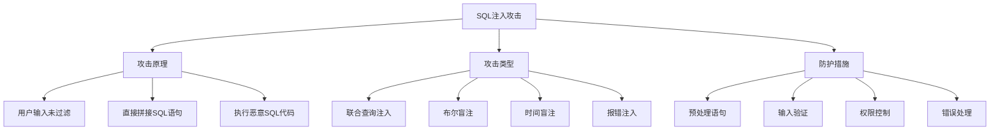

# SQL注入防护

## 🎯 学习目标
- 理解SQL注入攻击的原理和危害
- 掌握SQL注入的防护方法
- 学会使用预处理语句和参数化查询
- 了解SQL注入检测和修复技巧

## 📚 核心概念

### SQL注入攻击原理



### 常见SQL注入场景

| 场景 | 漏洞代码 | 攻击示例 | 危害程度 |
|------|----------|----------|----------|
| 登录绕过 | `WHERE user='$user' AND pass='$pass'` | `admin'--` | 高 |
| 数据泄露 | `WHERE id=$id` | `1 UNION SELECT password FROM users` | 高 |
| 数据篡改 | `UPDATE users SET name='$name' WHERE id=$id` | `'; DROP TABLE users;--` | 严重 |
| 权限提升 | `SELECT * FROM data WHERE user_id=$id` | `1 OR 1=1` | 中 |

## 🔧 SQL注入防护实现

### 预处理语句防护
```php
<?php
// 1. PDO预处理语句
class SecureDatabase {
    private $pdo;
    
    public function __construct($dsn, $username, $password, $options = []) {
        $defaultOptions = [
            PDO::ATTR_ERRMODE => PDO::ERRMODE_EXCEPTION,
            PDO::ATTR_DEFAULT_FETCH_MODE => PDO::FETCH_ASSOC,
            PDO::ATTR_EMULATE_PREPARES => false,
            PDO::MYSQL_ATTR_FOUND_ROWS => true
        ];
        
        $options = array_merge($defaultOptions, $options);
        
        try {
            $this->pdo = new PDO($dsn, $username, $password, $options);
        } catch (PDOException $e) {
            throw new Exception("数据库连接失败: " . $e->getMessage());
        }
    }
    
    // 安全查询方法
    public function query($sql, $params = []) {
        try {
            $stmt = $this->pdo->prepare($sql);
            $stmt->execute($params);
            return $stmt;
        } catch (PDOException $e) {
            throw new Exception("查询执行失败: " . $e->getMessage());
        }
    }
    
    // 安全获取单行数据
    public function fetchOne($sql, $params = []) {
        $stmt = $this->query($sql, $params);
        return $stmt->fetch();
    }
    
    // 安全获取多行数据
    public function fetchAll($sql, $params = []) {
        $stmt = $this->query($sql, $params);
        return $stmt->fetchAll();
    }
    
    // 安全插入数据
    public function insert($table, $data) {
        $columns = array_keys($data);
        $placeholders = ':' . implode(', :', $columns);
        
        $sql = "INSERT INTO {$table} (" . implode(', ', $columns) . ") VALUES ({$placeholders})";
        
        $params = [];
        foreach ($data as $key => $value) {
            $params[':' . $key] = $value;
        }
        
        $stmt = $this->query($sql, $params);
        return $this->pdo->lastInsertId();
    }
    
    // 安全更新数据
    public function update($table, $data, $where, $whereParams = []) {
        $setParts = [];
        $params = [];
        
        foreach ($data as $key => $value) {
            $setParts[] = "{$key} = :{$key}";
            $params[':' . $key] = $value;
        }
        
        $sql = "UPDATE {$table} SET " . implode(', ', $setParts) . " WHERE {$where}";
        
        // 合并WHERE参数
        $params = array_merge($params, $whereParams);
        
        $stmt = $this->query($sql, $params);
        return $stmt->rowCount();
    }
    
    // 安全删除数据
    public function delete($table, $where, $params = []) {
        $sql = "DELETE FROM {$table} WHERE {$where}";
        $stmt = $this->query($sql, $params);
        return $stmt->rowCount();
    }
}

// 2. 用户认证示例
class SecureUserAuth {
    private $db;
    
    public function __construct(SecureDatabase $db) {
        $this->db = $db;
    }
    
    // 安全登录验证
    public function login($username, $password) {
        // 使用预处理语句防止SQL注入
        $sql = "SELECT id, username, password, salt FROM users WHERE username = :username AND active = 1";
        $user = $this->db->fetchOne($sql, [':username' => $username]);
        
        if (!$user) {
            throw new Exception("用户名或密码错误");
        }
        
        // 验证密码
        if (!$this->verifyPassword($password, $user['password'], $user['salt'])) {
            throw new Exception("用户名或密码错误");
        }
        
        return [
            'id' => $user['id'],
            'username' => $user['username']
        ];
    }
    
    // 安全用户注册
    public function register($username, $email, $password) {
        // 检查用户是否已存在
        $sql = "SELECT COUNT(*) as count FROM users WHERE username = :username OR email = :email";
        $result = $this->db->fetchOne($sql, [
            ':username' => $username,
            ':email' => $email
        ]);
        
        if ($result['count'] > 0) {
            throw new Exception("用户名或邮箱已存在");
        }
        
        // 生成盐值和密码哈希
        $salt = bin2hex(random_bytes(16));
        $passwordHash = $this->hashPassword($password, $salt);
        
        // 插入新用户
        return $this->db->insert('users', [
            'username' => $username,
            'email' => $email,
            'password' => $passwordHash,
            'salt' => $salt,
            'created_at' => date('Y-m-d H:i:s')
        ]);
    }
    
    // 密码哈希
    private function hashPassword($password, $salt) {
        return hash('sha256', $password . $salt);
    }
    
    // 密码验证
    private function verifyPassword($password, $hash, $salt) {
        return hash_equals($hash, $this->hashPassword($password, $salt));
    }
}

// 使用示例
echo "=== SQL注入防护示例 ===\n";

try {
    // 模拟数据库连接（实际使用时需要真实的数据库）
    // $db = new SecureDatabase('mysql:host=localhost;dbname=test', 'user', 'pass');
    
    echo "安全数据库操作示例:\n";
    
    // 安全查询示例
    $safeQuery = "SELECT * FROM users WHERE id = :id AND status = :status";
    $safeParams = [':id' => 123, ':status' => 'active'];
    echo "安全查询: $safeQuery\n";
    echo "参数: " . json_encode($safeParams) . "\n";
    
    // 危险查询示例（不要这样做）
    $userId = "1 OR 1=1"; // 恶意输入
    $dangerousQuery = "SELECT * FROM users WHERE id = $userId"; // 直接拼接
    echo "\n危险查询: $dangerousQuery\n";
    echo "这将导致SQL注入漏洞！\n";
    
    // 安全的替代方案
    $secureQuery = "SELECT * FROM users WHERE id = :id";
    $secureParams = [':id' => $userId]; // 参数化查询会自动转义
    echo "\n安全替代: $secureQuery\n";
    echo "参数: " . json_encode($secureParams) . "\n";
    
} catch (Exception $e) {
    echo "错误: " . $e->getMessage() . "\n";
}
?>
```

### 输入验证和过滤
```php
<?php
// 1. SQL注入检测器
class SqlInjectionDetector {
    private $patterns = [
        // 常见SQL关键字
        '/\b(SELECT|INSERT|UPDATE|DELETE|DROP|CREATE|ALTER|EXEC|UNION|SCRIPT)\b/i',
        
        // SQL注释
        '/--|\#|\/\*|\*\//',
        
        // 引号和分号
        '/[\'";]/',
        
        // 逻辑操作符
        '/\b(OR|AND)\s+\d+\s*=\s*\d+/i',
        
        // 函数调用
        '/\b(CONCAT|CHAR|ASCII|SUBSTRING|LENGTH|DATABASE|USER|VERSION)\s*\(/i',
        
        // 十六进制编码
        '/0x[0-9a-f]+/i'
    ];
    
    // 检测SQL注入
    public function detect($input) {
        if (!is_string($input)) {
            return false;
        }
        
        foreach ($this->patterns as $pattern) {
            if (preg_match($pattern, $input)) {
                return true;
            }
        }
        
        return false;
    }
    
    // 获取匹配的模式
    public function getMatchedPatterns($input) {
        $matches = [];
        
        foreach ($this->patterns as $index => $pattern) {
            if (preg_match($pattern, $input, $match)) {
                $matches[] = [
                    'pattern' => $pattern,
                    'match' => $match[0]
                ];
            }
        }
        
        return $matches;
    }
    
    // 批量检测
    public function batchDetect($inputs) {
        $results = [];
        
        foreach ($inputs as $key => $value) {
            if (is_string($value)) {
                $results[$key] = $this->detect($value);
            } elseif (is_array($value)) {
                $results[$key] = $this->batchDetect($value);
            }
        }
        
        return $results;
    }
}

// 2. 输入过滤器
class InputFilter {
    // 过滤SQL特殊字符
    public static function filterSql($input) {
        if (!is_string($input)) {
            return $input;
        }
        
        // 移除或转义危险字符
        $filtered = str_replace([
            '--', '#', '/*', '*/', ';',
            'SELECT', 'INSERT', 'UPDATE', 'DELETE', 'DROP',
            'UNION', 'OR', 'AND', 'EXEC', 'SCRIPT'
        ], '', strtoupper($input));
        
        return strtolower($filtered);
    }
    
    // 严格的输入验证
    public static function validateInput($input, $type, $options = []) {
        switch ($type) {
            case 'int':
                return filter_var($input, FILTER_VALIDATE_INT) !== false;
                
            case 'float':
                return filter_var($input, FILTER_VALIDATE_FLOAT) !== false;
                
            case 'email':
                return filter_var($input, FILTER_VALIDATE_EMAIL) !== false;
                
            case 'url':
                return filter_var($input, FILTER_VALIDATE_URL) !== false;
                
            case 'alphanumeric':
                return ctype_alnum($input);
                
            case 'alpha':
                return ctype_alpha($input);
                
            case 'string':
                $minLength = $options['min_length'] ?? 0;
                $maxLength = $options['max_length'] ?? 255;
                $length = strlen($input);
                
                return $length >= $minLength && $length <= $maxLength;
                
            case 'regex':
                if (!isset($options['pattern'])) {
                    return false;
                }
                return preg_match($options['pattern'], $input);
                
            default:
                return false;
        }
    }
    
    // 清理输入数据
    public static function sanitizeInput($input, $type = 'string') {
        if (!is_string($input)) {
            return $input;
        }
        
        switch ($type) {
            case 'string':
                return htmlspecialchars(strip_tags(trim($input)), ENT_QUOTES, 'UTF-8');
                
            case 'email':
                return filter_var($input, FILTER_SANITIZE_EMAIL);
                
            case 'url':
                return filter_var($input, FILTER_SANITIZE_URL);
                
            case 'int':
                return filter_var($input, FILTER_SANITIZE_NUMBER_INT);
                
            case 'float':
                return filter_var($input, FILTER_SANITIZE_NUMBER_FLOAT, FILTER_FLAG_ALLOW_FRACTION);
                
            case 'alphanumeric':
                return preg_replace('/[^a-zA-Z0-9]/', '', $input);
                
            default:
                return $input;
        }
    }
}

// 3. 安全查询构建器
class SecureQueryBuilder {
    private $table;
    private $where = [];
    private $params = [];
    private $select = ['*'];
    private $joins = [];
    private $orderBy = [];
    private $limit = null;
    
    public function __construct($table) {
        $this->table = $this->sanitizeTableName($table);
    }
    
    // 清理表名
    private function sanitizeTableName($table) {
        // 只允许字母、数字和下划线
        return preg_replace('/[^a-zA-Z0-9_]/', '', $table);
    }
    
    // 选择字段
    public function select($columns) {
        if (is_array($columns)) {
            $this->select = array_map([$this, 'sanitizeColumnName'], $columns);
        } else {
            $this->select = [$this->sanitizeColumnName($columns)];
        }
        
        return $this;
    }
    
    // 清理列名
    private function sanitizeColumnName($column) {
        // 只允许字母、数字、下划线和点号
        return preg_replace('/[^a-zA-Z0-9_.]/', '', $column);
    }
    
    // WHERE条件
    public function where($column, $operator, $value) {
        $column = $this->sanitizeColumnName($column);
        $placeholder = ':param' . count($this->params);
        
        // 验证操作符
        $allowedOperators = ['=', '!=', '<>', '>', '<', '>=', '<=', 'LIKE', 'IN', 'NOT IN'];
        if (!in_array(strtoupper($operator), $allowedOperators)) {
            throw new Exception("不允许的操作符: $operator");
        }
        
        $this->where[] = "$column $operator $placeholder";
        $this->params[$placeholder] = $value;
        
        return $this;
    }
    
    // ORDER BY
    public function orderBy($column, $direction = 'ASC') {
        $column = $this->sanitizeColumnName($column);
        $direction = strtoupper($direction) === 'DESC' ? 'DESC' : 'ASC';
        
        $this->orderBy[] = "$column $direction";
        
        return $this;
    }
    
    // LIMIT
    public function limit($count, $offset = 0) {
        $this->limit = [
            'count' => (int)$count,
            'offset' => (int)$offset
        ];
        
        return $this;
    }
    
    // 构建SELECT查询
    public function buildSelect() {
        $sql = "SELECT " . implode(', ', $this->select) . " FROM {$this->table}";
        
        if (!empty($this->where)) {
            $sql .= " WHERE " . implode(' AND ', $this->where);
        }
        
        if (!empty($this->orderBy)) {
            $sql .= " ORDER BY " . implode(', ', $this->orderBy);
        }
        
        if ($this->limit) {
            $sql .= " LIMIT {$this->limit['count']}";
            if ($this->limit['offset'] > 0) {
                $sql .= " OFFSET {$this->limit['offset']}";
            }
        }
        
        return ['sql' => $sql, 'params' => $this->params];
    }
}

// 使用示例
echo "=== 输入验证和过滤示例 ===\n";

try {
    // SQL注入检测
    $detector = new SqlInjectionDetector();
    
    $testInputs = [
        "normal_input",
        "1' OR '1'='1",
        "admin'--",
        "1 UNION SELECT password FROM users",
        "'; DROP TABLE users; --"
    ];
    
    echo "SQL注入检测结果:\n";
    foreach ($testInputs as $input) {
        $isInjection = $detector->detect($input);
        echo "  '$input': " . ($isInjection ? "检测到注入" : "安全") . "\n";
        
        if ($isInjection) {
            $patterns = $detector->getMatchedPatterns($input);
            foreach ($patterns as $pattern) {
                echo "    匹配: {$pattern['match']}\n";
            }
        }
    }
    
    // 输入验证
    echo "\n输入验证示例:\n";
    $validationTests = [
        ['123', 'int', true],
        ['abc', 'int', false],
        ['test@example.com', 'email', true],
        ['invalid-email', 'email', false],
        ['abc123', 'alphanumeric', true],
        ['abc-123', 'alphanumeric', false]
    ];
    
    foreach ($validationTests as [$input, $type, $expected]) {
        $result = InputFilter::validateInput($input, $type);
        $status = $result === $expected ? "✓" : "✗";
        echo "  $status '$input' as $type: " . ($result ? "有效" : "无效") . "\n";
    }
    
    // 安全查询构建
    echo "\n安全查询构建示例:\n";
    $builder = new SecureQueryBuilder('users');
    $query = $builder
        ->select(['id', 'username', 'email'])
        ->where('status', '=', 'active')
        ->where('age', '>', 18)
        ->orderBy('created_at', 'DESC')
        ->limit(10)
        ->buildSelect();
    
    echo "SQL: {$query['sql']}\n";
    echo "参数: " . json_encode($query['params']) . "\n";
    
} catch (Exception $e) {
    echo "错误: " . $e->getMessage() . "\n";
}
?>
```

## 📊 最佳实践

### SQL注入防护最佳实践
```php
<?php
// SQL注入防护最佳实践

class SqlInjectionBestPractices {
    // 1. 预处理语句模板
    public static function getPreparedStatementExamples() {
        return [
            '查询' => [
                '错误' => "SELECT * FROM users WHERE id = $id",
                '正确' => "SELECT * FROM users WHERE id = :id"
            ],
            '插入' => [
                '错误' => "INSERT INTO users (name) VALUES ('$name')",
                '正确' => "INSERT INTO users (name) VALUES (:name)"
            ],
            '更新' => [
                '错误' => "UPDATE users SET name = '$name' WHERE id = $id",
                '正确' => "UPDATE users SET name = :name WHERE id = :id"
            ],
            '删除' => [
                '错误' => "DELETE FROM users WHERE id = $id",
                '正确' => "DELETE FROM users WHERE id = :id"
            ]
        ];
    }
    
    // 2. 输入验证规则
    public static function getValidationRules() {
        return [
            'user_id' => ['type' => 'int', 'min' => 1],
            'username' => ['type' => 'string', 'min_length' => 3, 'max_length' => 50, 'pattern' => '/^[a-zA-Z0-9_]+$/'],
            'email' => ['type' => 'email'],
            'age' => ['type' => 'int', 'min' => 0, 'max' => 150],
            'status' => ['type' => 'string', 'allowed' => ['active', 'inactive', 'pending']]
        ];
    }
    
    // 3. 数据库权限配置
    public static function getDatabaseSecurityConfig() {
        return [
            '应用用户权限' => [
                'SELECT' => '仅必要的表',
                'INSERT' => '仅数据表，非系统表',
                'UPDATE' => '仅数据表，非系统表',
                'DELETE' => '仅数据表，非系统表',
                'DROP' => '禁止',
                'CREATE' => '禁止',
                'ALTER' => '禁止'
            ],
            '网络安全' => [
                '绑定IP' => '限制数据库访问IP',
                'SSL连接' => '启用SSL加密连接',
                '端口安全' => '更改默认端口',
                '防火墙' => '配置数据库防火墙'
            ]
        ];
    }
    
    // 4. 错误处理策略
    public static function getErrorHandlingStrategy() {
        return [
            '生产环境' => [
                '隐藏详细错误' => '不显示SQL错误详情',
                '记录日志' => '记录详细错误到日志文件',
                '通用错误消息' => '显示通用错误消息给用户'
            ],
            '开发环境' => [
                '显示详细错误' => '便于调试',
                'SQL日志' => '记录所有SQL查询',
                '性能分析' => '分析查询性能'
            ]
        ];
    }
}

// 安全审计工具
class SqlSecurityAuditor {
    private $vulnerabilities = [];
    
    // 审计代码文件
    public function auditFile($filePath) {
        if (!file_exists($filePath)) {
            throw new Exception("文件不存在: $filePath");
        }
        
        $content = file_get_contents($filePath);
        $this->auditCode($content, $filePath);
        
        return $this->vulnerabilities;
    }
    
    // 审计代码内容
    public function auditCode($code, $source = 'unknown') {
        $lines = explode("\n", $code);
        
        foreach ($lines as $lineNumber => $line) {
            $this->checkLine($line, $lineNumber + 1, $source);
        }
    }
    
    // 检查单行代码
    private function checkLine($line, $lineNumber, $source) {
        // 检查直接SQL拼接
        $patterns = [
            '/\$\w+\s*\.\s*["\']SELECT\s+.*?\$/' => 'SQL字符串拼接',
            '/mysql_query\s*\(\s*["\'].*?\$.*?["\']/' => '使用已弃用的mysql_query函数',
            '/query\s*\(\s*["\'].*?\$.*?["\']/' => '直接拼接SQL查询',
            '/WHERE\s+.*?=\s*\$_[GET|POST|REQUEST]/' => '直接使用用户输入作为WHERE条件',
            '/\$_[GET|POST|REQUEST]\[.*?\].*?mysql_query/' => '用户输入直接用于SQL查询'
        ];
        
        foreach ($patterns as $pattern => $description) {
            if (preg_match($pattern, $line)) {
                $this->vulnerabilities[] = [
                    'type' => 'sql_injection_risk',
                    'severity' => 'high',
                    'description' => $description,
                    'line' => $lineNumber,
                    'source' => $source,
                    'code' => trim($line)
                ];
            }
        }
    }
    
    // 生成审计报告
    public function generateReport() {
        $report = [
            'total_issues' => count($this->vulnerabilities),
            'severity_breakdown' => [
                'critical' => 0,
                'high' => 0,
                'medium' => 0,
                'low' => 0
            ],
            'issues' => $this->vulnerabilities
        ];
        
        foreach ($this->vulnerabilities as $vuln) {
            $report['severity_breakdown'][$vuln['severity']]++;
        }
        
        return $report;
    }
}

// 使用示例
echo "=== SQL注入防护最佳实践示例 ===\n";

try {
    // 最佳实践示例
    $examples = SqlInjectionBestPractices::getPreparedStatementExamples();
    echo "预处理语句示例:\n";
    foreach ($examples as $operation => $example) {
        echo "  $operation:\n";
        echo "    错误: {$example['错误']}\n";
        echo "    正确: {$example['正确']}\n";
    }
    
    // 验证规则
    $rules = SqlInjectionBestPractices::getValidationRules();
    echo "\n输入验证规则:\n";
    foreach ($rules as $field => $rule) {
        echo "  $field: " . json_encode($rule) . "\n";
    }
    
    // 安全审计
    $auditor = new SqlSecurityAuditor();
    
    $testCode = '
    <?php
    $id = $_GET["id"];
    $query = "SELECT * FROM users WHERE id = " . $id;
    mysql_query($query);
    
    $stmt = $pdo->prepare("SELECT * FROM users WHERE id = :id");
    $stmt->execute([":id" => $id]);
    ';
    
    $auditor->auditCode($testCode, 'test.php');
    $report = $auditor->generateReport();
    
    echo "\n安全审计报告:\n";
    echo "  总问题数: {$report['total_issues']}\n";
    echo "  高危问题: {$report['severity_breakdown']['high']}\n";
    
    if (!empty($report['issues'])) {
        echo "  发现的问题:\n";
        foreach ($report['issues'] as $issue) {
            echo "    行 {$issue['line']}: {$issue['description']}\n";
        }
    }
    
} catch (Exception $e) {
    echo "错误: " . $e->getMessage() . "\n";
}
?>
```

## 🎓 学习建议

### 费曼学习法应用
1. **选择概念**: 选择SQL注入中的核心概念
2. **简化解释**: 用简单语言解释SQL注入的危害
3. **识别盲点**: 发现理解不深入的地方
4. **重新学习**: 针对盲点进行深入学习

### 刻意练习重点
1. **预处理语句**: 熟练使用预处理语句
2. **输入验证**: 掌握严格的输入验证技巧
3. **代码审计**: 学会识别SQL注入漏洞
4. **安全测试**: 进行SQL注入安全测试

## 🔗 相关链接
- [[02-XSS攻击防护|XSS攻击防护]]
- [[03-CSRF防护|CSRF防护]]
- [[04-输入验证与过滤|输入验证与过滤]]
- [[05-密码安全|密码安全]]
- [[06-文件上传安全|文件上传安全]]
- [[07-安全编程最佳实践|安全编程最佳实践]]
- [[08-安全审计清单|安全审计清单]]
