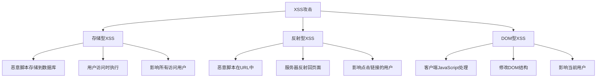

# XSS攻击防护

## 🎯 学习目标
- 理解XSS攻击的原理和类型
- 掌握XSS攻击的防护方法
- 学会输入输出过滤和编码
- 了解CSP内容安全策略

## 📚 核心概念

### XSS攻击类型



### XSS攻击场景

| 攻击类型 | 攻击位置 | 示例 | 危害程度 |
|----------|----------|------|----------|
| 存储型 | 用户输入、数据库 | `<script>alert('XSS')</script>` | 高 |
| 反射型 | URL参数、表单 | `?search=` | 中 |
| DOM型 | 客户端脚本 | `document.write(userInput)` | 中 |

## 🔧 XSS防护实现

### 输入过滤和验证
```php
<?php
// 1. XSS过滤器类
class XssFilter {
    private $allowedTags = [];
    private $allowedAttributes = [];
    
    public function __construct($allowedTags = [], $allowedAttributes = []) {
        $this->allowedTags = $allowedTags;
        $this->allowedAttributes = $allowedAttributes;
    }
    
    // 基础XSS过滤
    public function filter($input) {
        if (!is_string($input)) {
            return $input;
        }
        
        // 移除所有HTML标签
        $filtered = strip_tags($input);
        
        // HTML实体编码
        $filtered = htmlspecialchars($filtered, ENT_QUOTES | ENT_HTML5, 'UTF-8');
        
        return $filtered;
    }
    
    // 高级XSS过滤（保留部分HTML）
    public function filterAdvanced($input) {
        if (!is_string($input)) {
            return $input;
        }
        
        // 使用白名单过滤
        if (!empty($this->allowedTags)) {
            $filtered = strip_tags($input, implode('', $this->allowedTags));
        } else {
            $filtered = strip_tags($input);
        }
        
        // 移除危险属性
        $filtered = $this->removeDangerousAttributes($filtered);
        
        // HTML实体编码
        $filtered = htmlspecialchars($filtered, ENT_QUOTES | ENT_HTML5, 'UTF-8');
        
        return $filtered;
    }
    
    // 移除危险属性
    private function removeDangerousAttributes($html) {
        $dangerousAttributes = [
            'onload', 'onerror', 'onclick', 'onmouseover', 'onfocus',
            'onblur', 'onchange', 'onsubmit', 'onreset', 'onselect',
            'javascript:', 'vbscript:', 'data:', 'expression('
        ];
        
        foreach ($dangerousAttributes as $attr) {
            $html = preg_replace('/' . preg_quote($attr) . '[^>]*/i', '', $html);
        }
        
        return $html;
    }
    
    // 检测XSS攻击
    public function detect($input) {
        if (!is_string($input)) {
            return false;
        }
        
        $patterns = [
            '/<script[^>]*>.*?<\/script>/is',
            '/<iframe[^>]*>.*?<\/iframe>/is',
            '/<object[^>]*>.*?<\/object>/is',
            '/<embed[^>]*>.*?<\/embed>/is',
            '/<link[^>]*>.*?<\/link>/is',
            '/<meta[^>]*>.*?<\/meta>/is',
            '/javascript:/i',
            '/vbscript:/i',
            '/on\w+\s*=/i',
            '/expression\s*\(/i',
            '/<[^>]*style\s*=\s*["\'][^"\']*expression\s*\([^"\']*["\'][^>]*>/i'
        ];
        
        foreach ($patterns as $pattern) {
            if (preg_match($pattern, $input)) {
                return true;
            }
        }
        
        return false;
    }
    
    // 批量过滤
    public function filterArray($data) {
        if (is_array($data)) {
            return array_map([$this, 'filterArray'], $data);
        } elseif (is_string($data)) {
            return $this->filter($data);
        } else {
            return $data;
        }
    }
}

// 2. 输入验证器
class InputValidator {
    // 验证用户输入
    public static function validate($input, $type, $options = []) {
        switch ($type) {
            case 'text':
                return self::validateText($input, $options);
            case 'html':
                return self::validateHtml($input, $options);
            case 'url':
                return self::validateUrl($input, $options);
            case 'email':
                return self::validateEmail($input, $options);
            default:
                return false;
        }
    }
    
    // 验证文本输入
    private static function validateText($input, $options) {
        $maxLength = $options['max_length'] ?? 1000;
        $minLength = $options['min_length'] ?? 0;
        $allowedChars = $options['allowed_chars'] ?? null;
        
        if (strlen($input) > $maxLength || strlen($input) < $minLength) {
            return false;
        }
        
        if ($allowedChars && !preg_match($allowedChars, $input)) {
            return false;
        }
        
        return true;
    }
    
    // 验证HTML输入
    private static function validateHtml($input, $options) {
        $allowedTags = $options['allowed_tags'] ?? [];
        $maxLength = $options['max_length'] ?? 5000;
        
        if (strlen($input) > $maxLength) {
            return false;
        }
        
        // 检查是否包含不允许的标签
        if (!empty($allowedTags)) {
            $stripped = strip_tags($input, implode('', $allowedTags));
            if ($stripped !== $input) {
                return false;
            }
        }
        
        return true;
    }
    
    // 验证URL
    private static function validateUrl($input, $options) {
        $allowedSchemes = $options['allowed_schemes'] ?? ['http', 'https'];
        
        $parsed = parse_url($input);
        
        if (!$parsed || !isset($parsed['scheme'])) {
            return false;
        }
        
        if (!in_array($parsed['scheme'], $allowedSchemes)) {
            return false;
        }
        
        return filter_var($input, FILTER_VALIDATE_URL) !== false;
    }
    
    // 验证邮箱
    private static function validateEmail($input, $options) {
        return filter_var($input, FILTER_VALIDATE_EMAIL) !== false;
    }
}

// 使用示例
echo "=== XSS输入过滤示例 ===\n";

try {
    // 创建XSS过滤器
    $filter = new XssFilter(['p', 'br', 'strong', 'em'], ['class', 'id']);
    
    // 测试输入
    $testInputs = [
        "正常文本",
        "<script>alert('XSS')</script>",
        "",
        "<p>正常段落</p>",
        "javascript:alert('XSS')",
        "<a href='javascript:alert(1)'>链接</a>"
    ];
    
    echo "XSS过滤结果:\n";
    foreach ($testInputs as $input) {
        $filtered = $filter->filter($input);
        $detected = $filter->detect($input) ? "检测到XSS" : "安全";
        
        echo "  原始: $input\n";
        echo "  过滤: $filtered\n";
        echo "  状态: $detected\n\n";
    }
    
    // 输入验证
    echo "输入验证示例:\n";
    $validationTests = [
        ['Hello World', 'text', ['max_length' => 50], true],
        ['<script>alert(1)</script>', 'text', ['max_length' => 50], true], // 过滤后应该通过
        ['http://example.com', 'url', ['allowed_schemes' => ['http', 'https']], true],
        ['javascript:alert(1)', 'url', ['allowed_schemes' => ['http', 'https']], false],
        ['test@example.com', 'email', [], true],
        ['invalid-email', 'email', [], false]
    ];
    
    foreach ($validationTests as [$input, $type, $options, $expected]) {
        $result = InputValidator::validate($input, $type, $options);
        $status = $result === $expected ? "✓" : "✗";
        echo "  $status '$input' as $type: " . ($result ? "有效" : "无效") . "\n";
    }
    
} catch (Exception $e) {
    echo "错误: " . $e->getMessage() . "\n";
}
?>
```

### 输出编码和转义
```php
<?php
// 1. 输出编码器
class OutputEncoder {
    // HTML实体编码
    public static function htmlEncode($input, $flags = ENT_QUOTES | ENT_HTML5) {
        if (!is_string($input)) {
            return $input;
        }
        
        return htmlspecialchars($input, $flags, 'UTF-8');
    }
    
    // HTML属性编码
    public static function htmlAttributeEncode($input) {
        if (!is_string($input)) {
            return $input;
        }
        
        return htmlspecialchars($input, ENT_QUOTES | ENT_HTML5, 'UTF-8');
    }
    
    // JavaScript编码
    public static function javascriptEncode($input) {
        if (!is_string($input)) {
            return json_encode($input);
        }
        
        // 转义特殊字符
        $escaped = str_replace(
            ['\\', '"', "'", "\n", "\r", "\t", "\x08", "\x0c"],
            ['\\\\', '\\"', "\\'", '\\n', '\\r', '\\t', '\\b', '\\f'],
            $input
        );
        
        return '"' . $escaped . '"';
    }
    
    // URL编码
    public static function urlEncode($input) {
        if (!is_string($input)) {
            return $input;
        }
        
        return urlencode($input);
    }
    
    // CSS编码
    public static function cssEncode($input) {
        if (!is_string($input)) {
            return $input;
        }
        
        // 转义特殊字符
        $escaped = preg_replace('/[^a-zA-Z0-9]/', '\\$0', $input);
        
        return $escaped;
    }
    
    // 上下文感知编码
    public static function encodeForContext($input, $context) {
        switch (strtolower($context)) {
            case 'html':
                return self::htmlEncode($input);
            case 'html_attribute':
                return self::htmlAttributeEncode($input);
            case 'javascript':
                return self::javascriptEncode($input);
            case 'url':
                return self::urlEncode($input);
            case 'css':
                return self::cssEncode($input);
            default:
                return self::htmlEncode($input);
        }
    }
}

// 2. 安全输出类
class SecureOutput {
    private $encoder;
    
    public function __construct() {
        $this->encoder = new OutputEncoder();
    }
    
    // 安全输出HTML
    public function html($content) {
        echo OutputEncoder::htmlEncode($content);
    }
    
    // 安全输出HTML属性
    public function htmlAttribute($content) {
        echo OutputEncoder::htmlAttributeEncode($content);
    }
    
    // 安全输出JavaScript
    public function javascript($content) {
        echo OutputEncoder::javascriptEncode($content);
    }
    
    // 安全输出URL
    public function url($content) {
        echo OutputEncoder::urlEncode($content);
    }
    
    // 模板输出
    public function template($template, $data = []) {
        $output = $template;
        
        foreach ($data as $key => $value) {
            $placeholder = '{{' . $key . '}}';
            $encoded = OutputEncoder::htmlEncode($value);
            $output = str_replace($placeholder, $encoded, $output);
        }
        
        echo $output;
    }
    
    // JSON输出
    public function json($data, $options = JSON_UNESCAPED_UNICODE) {
        header('Content-Type: application/json; charset=utf-8');
        echo json_encode($data, $options);
    }
}

// 3. 模板引擎安全类
class SecureTemplate {
    private $templates = [];
    private $filters = [];
    
    public function __construct() {
        $this->registerDefaultFilters();
    }
    
    // 注册默认过滤器
    private function registerDefaultFilters() {
        $this->filters = [
            'html' => function($value) {
                return OutputEncoder::htmlEncode($value);
            },
            'attr' => function($value) {
                return OutputEncoder::htmlAttributeEncode($value);
            },
            'js' => function($value) {
                return OutputEncoder::javascriptEncode($value);
            },
            'url' => function($value) {
                return OutputEncoder::urlEncode($value);
            },
            'raw' => function($value) {
                return $value; // 不编码，谨慎使用
            }
        ];
    }
    
    // 添加模板
    public function addTemplate($name, $content) {
        $this->templates[$name] = $content;
    }
    
    // 渲染模板
    public function render($templateName, $data = []) {
        if (!isset($this->templates[$templateName])) {
            throw new Exception("模板不存在: $templateName");
        }
        
        $template = $this->templates[$templateName];
        
        // 处理变量输出 {{variable|filter}}
        $template = preg_replace_callback('/\{\{([^}]+)\}\}/', function($matches) use ($data) {
            $expression = trim($matches[1]);
            $parts = explode('|', $expression);
            $variable = trim($parts[0]);
            $filter = isset($parts[1]) ? trim($parts[1]) : 'html';
            
            $value = $data[$variable] ?? '';
            
            if (isset($this->filters[$filter])) {
                return $this->filters[$filter]($value);
            }
            
            return OutputEncoder::htmlEncode($value);
        }, $template);
        
        return $template;
    }
    
    // 注册自定义过滤器
    public function registerFilter($name, $callback) {
        $this->filters[$name] = $callback;
    }
}

// 使用示例
echo "=== 输出编码示例 ===\n";

try {
    // 输出编码测试
    $testData = [
        'html' => '<script>alert("XSS")</script>',
        'attribute' => 'value" onclick="alert(1)',
        'javascript' => '"; alert("XSS"); //',
        'url' => 'search?q=<script>alert(1)</script>'
    ];
    
    echo "输出编码结果:\n";
    foreach ($testData as $context => $data) {
        $encoded = OutputEncoder::encodeForContext($data, $context);
        echo "  $context: $data -> $encoded\n";
    }
    
    // 安全输出
    $output = new SecureOutput();
    
    echo "\n安全输出示例:\n";
    $userInput = '<script>alert("XSS")</script>';
    
    echo "HTML输出: ";
    $output->html($userInput);
    echo "\n";
    
    echo "属性输出: ";
    $output->htmlAttribute($userInput);
    echo "\n";
    
    // 模板引擎
    $template = new SecureTemplate();
    $template->addTemplate('user_profile', '
        <div class="user-info">
            <h1>{{name|html}}</h1>
            <p>邮箱: {{email|html}}</p>
            <p>简介: {{bio|html}}</p>
            <a href="/user/{{id|attr}}">查看详情</a>
        </div>
    ');
    
    $userData = [
        'name' => '<script>alert("XSS")</script>',
        'email' => 'user@example.com',
        'bio' => '这是一个<script>alert("XSS")</script>用户',
        'id' => '123" onclick="alert(1)'
    ];
    
    echo "\n模板渲染结果:\n";
    echo $template->render('user_profile', $userData);
    echo "\n";
    
} catch (Exception $e) {
    echo "错误: " . $e->getMessage() . "\n";
}
?>
```

## 🔧 高级防护技术

### CSP内容安全策略
```php
<?php
// 1. CSP策略管理器
class CspManager {
    private $policies = [];
    
    public function __construct() {
        $this->policies = [
            'default-src' => ["'self'"],
            'script-src' => ["'self'"],
            'style-src' => ["'self'", "'unsafe-inline'"],
            'img-src' => ["'self'", "data:", "https:"],
            'font-src' => ["'self'"],
            'connect-src' => ["'self'"],
            'media-src' => ["'self'"],
            'object-src' => ["'none'"],
            'child-src' => ["'self'"],
            'frame-ancestors' => ["'none'"],
            'form-action' => ["'self'"],
            'base-uri' => ["'self'"],
            'manifest-src' => ["'self'"]
        ];
    }
    
    // 设置策略
    public function setPolicy($directive, $sources) {
        $this->policies[$directive] = is_array($sources) ? $sources : [$sources];
        return $this;
    }
    
    // 添加源
    public function addSource($directive, $source) {
        if (!isset($this->policies[$directive])) {
            $this->policies[$directive] = [];
        }
        
        if (!in_array($source, $this->policies[$directive])) {
            $this->policies[$directive][] = $source;
        }
        
        return $this;
    }
    
    // 生成CSP头
    public function generateHeader($reportOnly = false) {
        $headerName = $reportOnly ? 'Content-Security-Policy-Report-Only' : 'Content-Security-Policy';
        $policy = [];
        
        foreach ($this->policies as $directive => $sources) {
            if (!empty($sources)) {
                $policy[] = $directive . ' ' . implode(' ', $sources);
            }
        }
        
        return $headerName . ': ' . implode('; ', $policy);
    }
    
    // 设置CSP头
    public function setHeader($reportOnly = false) {
        $header = $this->generateHeader($reportOnly);
        header($header);
    }
    
    // 生成nonce
    public function generateNonce() {
        return base64_encode(random_bytes(16));
    }
    
    // 设置nonce策略
    public function setNoncePolicy($nonce) {
        $this->addSource('script-src', "'nonce-$nonce'");
        $this->addSource('style-src', "'nonce-$nonce'");
        return $nonce;
    }
}

// 2. XSS防护中间件
class XssProtectionMiddleware {
    private $filter;
    private $csp;
    
    public function __construct() {
        $this->filter = new XssFilter();
        $this->csp = new CspManager();
    }
    
    // 处理请求
    public function handle($request, $next) {
        // 设置CSP头
        $this->csp->setHeader();
        
        // 过滤输入数据
        $this->filterInputs();
        
        // 继续处理
        $response = $next($request);
        
        // 过滤输出数据
        $this->filterOutputs($response);
        
        return $response;
    }
    
    // 过滤输入
    private function filterInputs() {
        // 过滤GET参数
        $_GET = $this->filter->filterArray($_GET);
        
        // 过滤POST参数
        $_POST = $this->filter->filterArray($_POST);
        
        // 过滤COOKIE
        $_COOKIE = $this->filter->filterArray($_COOKIE);
        
        // 过滤SERVER变量中的用户输入
        if (isset($_SERVER['HTTP_USER_AGENT'])) {
            $_SERVER['HTTP_USER_AGENT'] = $this->filter->filter($_SERVER['HTTP_USER_AGENT']);
        }
        
        if (isset($_SERVER['HTTP_REFERER'])) {
            $_SERVER['HTTP_REFERER'] = $this->filter->filter($_SERVER['HTTP_REFERER']);
        }
    }
    
    // 过滤输出
    private function filterOutputs($response) {
        // 这里可以添加输出过滤逻辑
        // 例如检查响应头、内容等
    }
}

// 3. XSS检测和日志
class XssDetector {
    private $logFile;
    
    public function __construct($logFile = 'xss_attempts.log') {
        $this->logFile = $logFile;
    }
    
    // 检测并记录XSS尝试
    public function detectAndLog($input, $source = 'unknown') {
        $filter = new XssFilter();
        
        if ($filter->detect($input)) {
            $this->logAttempt($input, $source);
            return true;
        }
        
        return false;
    }
    
    // 记录XSS尝试
    private function logAttempt($input, $source) {
        $logEntry = [
            'timestamp' => date('Y-m-d H:i:s'),
            'source' => $source,
            'input' => $input,
            'ip' => $_SERVER['REMOTE_ADDR'] ?? 'unknown',
            'user_agent' => $_SERVER['HTTP_USER_AGENT'] ?? 'unknown',
            'referer' => $_SERVER['HTTP_REFERER'] ?? 'unknown'
        ];
        
        $logLine = json_encode($logEntry) . "\n";
        file_put_contents($this->logFile, $logLine, FILE_APPEND | LOCK_EX);
    }
    
    // 获取XSS尝试统计
    public function getStats($days = 7) {
        if (!file_exists($this->logFile)) {
            return [];
        }
        
        $logs = file($this->logFile, FILE_IGNORE_NEW_LINES);
        $cutoff = time() - ($days * 24 * 3600);
        
        $stats = [
            'total_attempts' => 0,
            'unique_ips' => [],
            'sources' => [],
            'recent_attempts' => []
        ];
        
        foreach ($logs as $logLine) {
            $entry = json_decode($logLine, true);
            
            if (!$entry) {
                continue;
            }
            
            $timestamp = strtotime($entry['timestamp']);
            
            if ($timestamp >= $cutoff) {
                $stats['total_attempts']++;
                $stats['unique_ips'][$entry['ip']] = true;
                $stats['sources'][$entry['source']] = ($stats['sources'][$entry['source']] ?? 0) + 1;
                $stats['recent_attempts'][] = $entry;
            }
        }
        
        $stats['unique_ips'] = array_keys($stats['unique_ips']);
        
        return $stats;
    }
}

// 使用示例
echo "=== 高级XSS防护示例 ===\n";

try {
    // CSP策略设置
    $csp = new CspManager();
    
    // 设置自定义策略
    $csp->setPolicy('script-src', ["'self'", "'unsafe-inline'", 'https://cdn.example.com']);
    $csp->setPolicy('style-src', ["'self'", "'unsafe-inline'"]);
    $csp->setPolicy('img-src', ["'self'", 'data:', 'https:']);
    
    // 生成nonce
    $nonce = $csp->generateNonce();
    $csp->setNoncePolicy($nonce);
    
    echo "CSP策略:\n";
    echo $csp->generateHeader() . "\n\n";
    
    echo "生成的nonce: $nonce\n\n";
    
    // XSS检测和日志
    $detector = new XssDetector();
    
    $testInputs = [
        '<script>alert("XSS")</script>',
        '正常文本',
        '',
        'javascript:alert("XSS")'
    ];
    
    echo "XSS检测结果:\n";
    foreach ($testInputs as $input) {
        $detected = $detector->detectAndLog($input, 'test');
        echo "  '$input': " . ($detected ? "检测到XSS" : "安全") . "\n";
    }
    
    // 获取统计信息
    $stats = $detector->getStats();
    echo "\nXSS尝试统计:\n";
    echo "  总尝试次数: {$stats['total_attempts']}\n";
    echo "  唯一IP数: " . count($stats['unique_ips']) . "\n";
    echo "  来源统计: " . json_encode($stats['sources']) . "\n";
    
    // 清理日志文件
    if (file_exists('xss_attempts.log')) {
        unlink('xss_attempts.log');
    }
    
} catch (Exception $e) {
    echo "错误: " . $e->getMessage() . "\n";
}
?>
```

## 📊 最佳实践

### XSS防护最佳实践
```php
<?php
// XSS防护最佳实践

class XssBestPractices {
    // 1. 输入验证规则
    public static function getInputValidationRules() {
        return [
            '用户名' => [
                'type' => 'alphanumeric',
                'min_length' => 3,
                'max_length' => 20,
                'pattern' => '/^[a-zA-Z0-9_]+$/'
            ],
            '邮箱' => [
                'type' => 'email',
                'max_length' => 100
            ],
            '评论' => [
                'type' => 'text',
                'max_length' => 1000,
                'allowed_tags' => ['p', 'br', 'strong', 'em']
            ],
            'URL' => [
                'type' => 'url',
                'allowed_schemes' => ['http', 'https']
            ]
        ];
    }
    
    // 2. 输出编码策略
    public static function getOutputEncodingStrategy() {
        return [
            'HTML内容' => 'htmlspecialchars()',
            'HTML属性' => 'htmlspecialchars() with ENT_QUOTES',
            'JavaScript' => 'json_encode() 或自定义转义',
            'URL参数' => 'urlencode()',
            'CSS值' => '自定义CSS转义函数'
        ];
    }
    
    // 3. CSP策略建议
    public static function getRecommendedCspPolicy() {
        return [
            '严格模式' => [
                'default-src' => ["'self'"],
                'script-src' => ["'self'", "'nonce-{nonce}'"],
                'style-src' => ["'self'", "'nonce-{nonce}'"],
                'img-src' => ["'self'", "data:"],
                'object-src' => ["'none'"],
                'frame-ancestors' => ["'none'"]
            ],
            '宽松模式' => [
                'default-src' => ["'self'"],
                'script-src' => ["'self'", "'unsafe-inline'", "https://trusted-cdn.com"],
                'style-src' => ["'self'", "'unsafe-inline'"],
                'img-src' => ["'self'", "data:", "https:"],
                'connect-src' => ["'self'", "https://api.example.com"]
            ]
        ];
    }
    
    // 4. 安全开发检查清单
    public static function getSecurityChecklist() {
        return [
            '输入处理' => [
                '所有用户输入都经过验证',
                '使用白名单而非黑名单',
                '限制输入长度和类型',
                '移除或转义危险字符'
            ],
            '输出处理' => [
                '根据上下文选择正确的编码',
                '避免使用innerHTML',
                '使用textContent而非innerHTML',
                '验证和清理第三方内容'
            ],
            '配置安全' => [
                '设置适当的CSP策略',
                '启用X-XSS-Protection头',
                '设置X-Content-Type-Options',
                '配置安全的Cookie属性'
            ],
            '测试验证' => [
                '进行XSS渗透测试',
                '使用自动化安全扫描工具',
                '代码审查重点关注用户输入处理',
                '定期更新安全策略'
            ]
        ];
    }
}

// 使用示例
echo "=== XSS防护最佳实践示例 ===\n";

try {
    // 输入验证规则
    $rules = XssBestPractices::getInputValidationRules();
    echo "输入验证规则:\n";
    foreach ($rules as $field => $rule) {
        echo "  $field: " . json_encode($rule) . "\n";
    }
    
    // 输出编码策略
    $encoding = XssBestPractices::getOutputEncodingStrategy();
    echo "\n输出编码策略:\n";
    foreach ($encoding as $context => $method) {
        echo "  $context: $method\n";
    }
    
    // CSP策略建议
    $cspPolicies = XssBestPractices::getRecommendedCspPolicy();
    echo "\nCSP策略建议:\n";
    foreach ($cspPolicies as $mode => $policy) {
        echo "  $mode:\n";
        foreach ($policy as $directive => $sources) {
            echo "    $directive: " . implode(' ', $sources) . "\n";
        }
    }
    
    // 安全检查清单
    $checklist = XssBestPractices::getSecurityChecklist();
    echo "\n安全开发检查清单:\n";
    foreach ($checklist as $category => $items) {
        echo "  $category:\n";
        foreach ($items as $item) {
            echo "    - $item\n";
        }
    }
    
} catch (Exception $e) {
    echo "错误: " . $e->getMessage() . "\n";
}
?>
```

## 🎓 学习建议

### 费曼学习法应用
1. **选择概念**: 选择XSS攻击中的核心概念
2. **简化解释**: 用简单语言解释XSS攻击的危害
3. **识别盲点**: 发现理解不深入的地方
4. **重新学习**: 针对盲点进行深入学习

### 刻意练习重点
1. **输入过滤**: 掌握各种输入过滤技术
2. **输出编码**: 学会根据上下文选择正确的编码
3. **CSP策略**: 理解和使用内容安全策略
4. **安全测试**: 进行XSS攻击测试和防护验证

## 🔗 相关链接
- [[01-SQL注入防护|SQL注入防护]]
- [[03-CSRF防护|CSRF防护]]
- [[04-输入验证与过滤|输入验证与过滤]]
- [[05-密码安全|密码安全]]
- [[06-文件上传安全|文件上传安全]]
- [[07-安全编程最佳实践|安全编程最佳实践]]
- [[08-安全审计清单|安全审计清单]]
