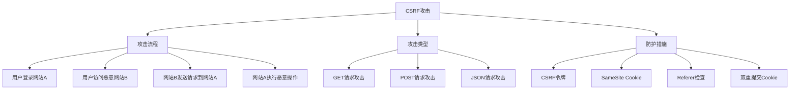

# CSRF防护

## 🎯 学习目标
- 理解CSRF攻击的原理和危害
- 掌握CSRF防护的基本方法
- 学会实现CSRF令牌验证
- 了解CSRF防护的最佳实践

## 📚 核心概念

### CSRF攻击原理



### CSRF攻击场景

| 攻击类型 | 攻击方式 | 示例 | 危害程度 |
|----------|----------|------|----------|
| GET攻击 | 图片标签 | `` | 中 |
| POST攻击 | 表单提交 | 自动提交表单到目标网站 | 高 |
| JSON攻击 | AJAX请求 | 跨域发送JSON请求 | 中 |

## 🔧 CSRF防护实现

### CSRF令牌防护
```php
<?php
// 1. CSRF令牌管理器
class CsrfTokenManager {
    private $tokenName = '_csrf_token';
    private $sessionKey = 'csrf_tokens';
    private $tokenLength = 32;
    private $tokenLifetime = 3600; // 1小时
    
    public function __construct($options = []) {
        $this->tokenName = $options['token_name'] ?? $this->tokenName;
        $this->sessionKey = $options['session_key'] ?? $this->sessionKey;
        $this->tokenLength = $options['token_length'] ?? $this->tokenLength;
        $this->tokenLifetime = $options['token_lifetime'] ?? $this->tokenLifetime;
        
        if (session_status() === PHP_SESSION_NONE) {
            session_start();
        }
    }
    
    // 生成CSRF令牌
    public function generateToken() {
        $token = bin2hex(random_bytes($this->tokenLength));
        $expires = time() + $this->tokenLifetime;
        
        // 存储令牌
        if (!isset($_SESSION[$this->sessionKey])) {
            $_SESSION[$this->sessionKey] = [];
        }
        
        $_SESSION[$this->sessionKey][$token] = $expires;
        
        // 清理过期令牌
        $this->cleanExpiredTokens();
        
        return $token;
    }
    
    // 验证CSRF令牌
    public function validateToken($token) {
        if (empty($token)) {
            return false;
        }
        
        if (!isset($_SESSION[$this->sessionKey][$token])) {
            return false;
        }
        
        $expires = $_SESSION[$this->sessionKey][$token];
        
        // 检查是否过期
        if (time() > $expires) {
            unset($_SESSION[$this->sessionKey][$token]);
            return false;
        }
        
        return true;
    }
    
    // 使用并销毁令牌
    public function consumeToken($token) {
        if (!$this->validateToken($token)) {
            return false;
        }
        
        // 一次性使用，使用后销毁
        unset($_SESSION[$this->sessionKey][$token]);
        return true;
    }
    
    // 清理过期令牌
    private function cleanExpiredTokens() {
        $currentTime = time();
        
        foreach ($_SESSION[$this->sessionKey] as $token => $expires) {
            if ($currentTime > $expires) {
                unset($_SESSION[$this->sessionKey][$token]);
            }
        }
    }
    
    // 获取隐藏字段HTML
    public function getHiddenField() {
        $token = $this->generateToken();
        return '<input type="hidden" name="' . $this->tokenName . '" value="' . htmlspecialchars($token) . '">';
    }
    
    // 获取令牌值
    public function getToken() {
        return $this->generateToken();
    }
    
    // 获取令牌名称
    public function getTokenName() {
        return $this->tokenName;
    }
}

// 2. CSRF防护中间件
class CsrfProtectionMiddleware {
    private $tokenManager;
    private $excludedPaths = [];
    private $excludedMethods = ['GET', 'HEAD', 'OPTIONS'];
    
    public function __construct($options = []) {
        $this->tokenManager = new CsrfTokenManager($options);
        $this->excludedPaths = $options['excluded_paths'] ?? [];
        $this->excludedMethods = $options['excluded_methods'] ?? $this->excludedMethods;
    }
    
    // 处理请求
    public function handle($request, $next) {
        $method = $_SERVER['REQUEST_METHOD'];
        $path = parse_url($_SERVER['REQUEST_URI'], PHP_URL_PATH);
        
        // 检查是否排除
        if ($this->isExcluded($method, $path)) {
            return $next($request);
        }
        
        // 验证CSRF令牌
        if (!$this->validateCsrfToken()) {
            $this->handleCsrfFailure();
            return;
        }
        
        return $next($request);
    }
    
    // 检查是否排除
    private function isExcluded($method, $path) {
        // 检查HTTP方法
        if (in_array(strtoupper($method), $this->excludedMethods)) {
            return true;
        }
        
        // 检查路径
        foreach ($this->excludedPaths as $excludedPath) {
            if (strpos($path, $excludedPath) === 0) {
                return true;
            }
        }
        
        return false;
    }
    
    // 验证CSRF令牌
    private function validateCsrfToken() {
        $token = $this->getTokenFromRequest();
        
        if (empty($token)) {
            return false;
        }
        
        return $this->tokenManager->validateToken($token);
    }
    
    // 从请求中获取令牌
    private function getTokenFromRequest() {
        // 优先从POST数据获取
        if (isset($_POST[$this->tokenManager->getTokenName()])) {
            return $_POST[$this->tokenManager->getTokenName()];
        }
        
        // 从请求头获取
        $headerName = 'X-CSRF-Token';
        if (isset($_SERVER['HTTP_' . str_replace('-', '_', strtoupper($headerName))])) {
            return $_SERVER['HTTP_' . str_replace('-', '_', strtoupper($headerName))];
        }
        
        // 从自定义头获取
        if (isset($_SERVER['HTTP_X_CSRF_TOKEN'])) {
            return $_SERVER['HTTP_X_CSRF_TOKEN'];
        }
        
        return null;
    }
    
    // 处理CSRF验证失败
    private function handleCsrfFailure() {
        http_response_code(403);
        
        if ($this->isAjaxRequest()) {
            header('Content-Type: application/json');
            echo json_encode([
                'error' => 'CSRF token validation failed',
                'code' => 403
            ]);
        } else {
            echo '<h1>403 Forbidden</h1><p>CSRF token validation failed.</p>';
        }
        
        exit;
    }
    
    // 检查是否为AJAX请求
    private function isAjaxRequest() {
        return isset($_SERVER['HTTP_X_REQUESTED_WITH']) && 
               strtolower($_SERVER['HTTP_X_REQUESTED_WITH']) === 'xmlhttprequest';
    }
    
    // 获取令牌管理器
    public function getTokenManager() {
        return $this->tokenManager;
    }
}

// 3. 安全表单类
class SecureForm {
    private $tokenManager;
    private $action;
    private $method;
    private $fields = [];
    
    public function __construct($action = '', $method = 'POST') {
        $this->tokenManager = new CsrfTokenManager();
        $this->action = $action;
        $this->method = strtoupper($method);
    }
    
    // 添加字段
    public function addField($name, $type = 'text', $attributes = []) {
        $this->fields[] = [
            'name' => $name,
            'type' => $type,
            'attributes' => $attributes
        ];
        
        return $this;
    }
    
    // 生成表单HTML
    public function render() {
        $html = '<form action="' . htmlspecialchars($this->action) . '" method="' . $this->method . '">';
        
        // 添加CSRF令牌
        $html .= $this->tokenManager->getHiddenField();
        
        // 添加字段
        foreach ($this->fields as $field) {
            $html .= $this->renderField($field);
        }
        
        $html .= '</form>';
        
        return $html;
    }
    
    // 渲染单个字段
    private function renderField($field) {
        $name = htmlspecialchars($field['name']);
        $type = htmlspecialchars($field['type']);
        $attributes = $field['attributes'];
        
        $attrString = '';
        foreach ($attributes as $key => $value) {
            $attrString .= ' ' . htmlspecialchars($key) . '="' . htmlspecialchars($value) . '"';
        }
        
        return '<input type="' . $type . '" name="' . $name . '"' . $attrString . '>';
    }
    
    // 验证表单提交
    public function validateSubmission() {
        if ($_SERVER['REQUEST_METHOD'] !== $this->method) {
            return false;
        }
        
        $token = $_POST[$this->tokenManager->getTokenName()] ?? '';
        return $this->tokenManager->validateToken($token);
    }
}

// 使用示例
echo "=== CSRF防护示例 ===\n";

try {
    // 创建CSRF令牌管理器
    $tokenManager = new CsrfTokenManager();
    
    // 生成令牌
    $token = $tokenManager->generateToken();
    echo "生成的CSRF令牌: " . substr($token, 0, 16) . "...\n";
    
    // 验证令牌
    $isValid = $tokenManager->validateToken($token);
    echo "令牌验证: " . ($isValid ? "有效" : "无效") . "\n";
    
    // 使用令牌
    $consumed = $tokenManager->consumeToken($token);
    echo "令牌消费: " . ($consumed ? "成功" : "失败") . "\n";
    
    // 再次验证（应该失败，因为已消费）
    $isValidAfter = $tokenManager->validateToken($token);
    echo "消费后验证: " . ($isValidAfter ? "有效" : "无效") . "\n";
    
    // 安全表单
    $form = new SecureForm('/submit', 'POST');
    $form->addField('username', 'text', ['placeholder' => '用户名'])
         ->addField('email', 'email', ['placeholder' => '邮箱'])
         ->addField('submit', 'submit', ['value' => '提交']);
    
    echo "\n安全表单HTML:\n";
    echo $form->render() . "\n";
    
    // CSRF防护中间件
    $middleware = new CsrfProtectionMiddleware([
        'excluded_paths' => ['/api/public'],
        'excluded_methods' => ['GET', 'HEAD', 'OPTIONS']
    ]);
    
    echo "\nCSRF防护中间件已创建\n";
    echo "排除的路径: /api/public\n";
    echo "排除的方法: GET, HEAD, OPTIONS\n";
    
} catch (Exception $e) {
    echo "错误: " . $e->getMessage() . "\n";
}
?>
```

### 双重提交Cookie防护
```php
<?php
// 1. 双重提交Cookie防护
class DoubleSubmitCookieProtection {
    private $cookieName = 'csrf_token';
    private $formFieldName = '_csrf_token';
    private $cookieLifetime = 3600; // 1小时
    private $cookiePath = '/';
    private $cookieDomain = '';
    private $cookieSecure = false;
    private $cookieHttpOnly = false;
    
    public function __construct($options = []) {
        $this->cookieName = $options['cookie_name'] ?? $this->cookieName;
        $this->formFieldName = $options['form_field_name'] ?? $this->formFieldName;
        $this->cookieLifetime = $options['cookie_lifetime'] ?? $this->cookieLifetime;
        $this->cookiePath = $options['cookie_path'] ?? $this->cookiePath;
        $this->cookieDomain = $options['cookie_domain'] ?? $this->cookieDomain;
        $this->cookieSecure = $options['cookie_secure'] ?? $this->cookieSecure;
        $this->cookieHttpOnly = $options['cookie_http_only'] ?? $this->cookieHttpOnly;
    }
    
    // 生成令牌
    public function generateToken() {
        $token = bin2hex(random_bytes(32));
        
        // 设置Cookie
        $this->setCookie($token);
        
        return $token;
    }
    
    // 设置Cookie
    private function setCookie($token) {
        setcookie(
            $this->cookieName,
            $token,
            time() + $this->cookieLifetime,
            $this->cookiePath,
            $this->cookieDomain,
            $this->cookieSecure,
            $this->cookieHttpOnly
        );
    }
    
    // 验证令牌
    public function validateToken($formToken) {
        $cookieToken = $_COOKIE[$this->cookieName] ?? '';
        
        if (empty($formToken) || empty($cookieToken)) {
            return false;
        }
        
        return hash_equals($cookieToken, $formToken);
    }
    
    // 获取隐藏字段HTML
    public function getHiddenField() {
        $token = $this->generateToken();
        return '<input type="hidden" name="' . $this->formFieldName . '" value="' . htmlspecialchars($token) . '">';
    }
    
    // 获取令牌值
    public function getToken() {
        return $this->generateToken();
    }
    
    // 获取表单字段名
    public function getFormFieldName() {
        return $this->formFieldName;
    }
    
    // 获取Cookie名
    public function getCookieName() {
        return $this->cookieName;
    }
}

// 2. SameSite Cookie防护
class SameSiteCookieProtection {
    private $cookieName = 'session_id';
    private $cookieValue;
    private $cookieLifetime = 3600;
    private $cookiePath = '/';
    private $cookieDomain = '';
    private $cookieSecure = true;
    private $cookieHttpOnly = true;
    private $sameSite = 'Strict';
    
    public function __construct($options = []) {
        $this->cookieName = $options['cookie_name'] ?? $this->cookieName;
        $this->cookieLifetime = $options['cookie_lifetime'] ?? $this->cookieLifetime;
        $this->cookiePath = $options['cookie_path'] ?? $this->cookiePath;
        $this->cookieDomain = $options['cookie_domain'] ?? $this->cookieDomain;
        $this->cookieSecure = $options['cookie_secure'] ?? $this->cookieSecure;
        $this->cookieHttpOnly = $options['cookie_http_only'] ?? $this->cookieHttpOnly;
        $this->sameSite = $options['same_site'] ?? $this->sameSite;
    }
    
    // 设置SameSite Cookie
    public function setCookie($value) {
        $this->cookieValue = $value;
        
        $cookieString = $this->cookieName . '=' . urlencode($value);
        $cookieString .= '; expires=' . gmdate('D, d M Y H:i:s', time() + $this->cookieLifetime) . ' GMT';
        $cookieString .= '; path=' . $this->cookiePath;
        
        if (!empty($this->cookieDomain)) {
            $cookieString .= '; domain=' . $this->cookieDomain;
        }
        
        if ($this->cookieSecure) {
            $cookieString .= '; secure';
        }
        
        if ($this->cookieHttpOnly) {
            $cookieString .= '; httponly';
        }
        
        $cookieString .= '; samesite=' . $this->sameSite;
        
        header('Set-Cookie: ' . $cookieString);
    }
    
    // 获取Cookie值
    public function getCookie() {
        return $_COOKIE[$this->cookieName] ?? null;
    }
    
    // 验证Cookie
    public function validateCookie($expectedValue) {
        $actualValue = $this->getCookie();
        return $actualValue && hash_equals($expectedValue, $actualValue);
    }
}

// 3. Referer检查防护
class RefererCheckProtection {
    private $allowedHosts = [];
    private $strictMode = true;
    
    public function __construct($options = []) {
        $this->allowedHosts = $options['allowed_hosts'] ?? [];
        $this->strictMode = $options['strict_mode'] ?? true;
    }
    
    // 验证Referer
    public function validateReferer() {
        $referer = $_SERVER['HTTP_REFERER'] ?? '';
        
        if (empty($referer)) {
            return !$this->strictMode; // 严格模式下不允许空Referer
        }
        
        $refererHost = parse_url($referer, PHP_URL_HOST);
        $currentHost = $_SERVER['HTTP_HOST'];
        
        // 检查是否为同源
        if ($refererHost === $currentHost) {
            return true;
        }
        
        // 检查是否在允许的主机列表中
        if (in_array($refererHost, $this->allowedHosts)) {
            return true;
        }
        
        return false;
    }
    
    // 添加允许的主机
    public function addAllowedHost($host) {
        if (!in_array($host, $this->allowedHosts)) {
            $this->allowedHosts[] = $host;
        }
        
        return $this;
    }
    
    // 获取允许的主机列表
    public function getAllowedHosts() {
        return $this->allowedHosts;
    }
}

// 使用示例
echo "=== 双重提交Cookie防护示例 ===\n";

try {
    // 双重提交Cookie防护
    $doubleSubmit = new DoubleSubmitCookieProtection();
    
    // 生成令牌
    $token = $doubleSubmit->getToken();
    echo "生成的令牌: " . substr($token, 0, 16) . "...\n";
    
    // 模拟表单提交验证
    $_COOKIE[$doubleSubmit->getCookieName()] = $token;
    $_POST[$doubleSubmit->getFormFieldName()] = $token;
    
    $isValid = $doubleSubmit->validateToken($_POST[$doubleSubmit->getFormFieldName()]);
    echo "双重提交验证: " . ($isValid ? "通过" : "失败") . "\n";
    
    // SameSite Cookie防护
    $sameSite = new SameSiteCookieProtection([
        'same_site' => 'Strict',
        'cookie_secure' => false // 测试环境
    ]);
    
    $sessionId = 'session_' . uniqid();
    $sameSite->setCookie($sessionId);
    echo "\nSameSite Cookie已设置: $sessionId\n";
    
    // Referer检查防护
    $refererCheck = new RefererCheckProtection([
        'allowed_hosts' => ['example.com', 'trusted-site.com'],
        'strict_mode' => true
    ]);
    
    // 模拟Referer检查
    $_SERVER['HTTP_REFERER'] = 'https://example.com/page';
    $_SERVER['HTTP_HOST'] = 'example.com';
    
    $refererValid = $refererCheck->validateReferer();
    echo "Referer检查: " . ($refererValid ? "通过" : "失败") . "\n";
    
    // 显示允许的主机
    $allowedHosts = $refererCheck->getAllowedHosts();
    echo "允许的主机: " . implode(', ', $allowedHosts) . "\n";
    
} catch (Exception $e) {
    echo "错误: " . $e->getMessage() . "\n";
}
?>
```

## 📊 最佳实践

### CSRF防护最佳实践
```php
<?php
// CSRF防护最佳实践

class CsrfBestPractices {
    // 1. 防护策略选择
    public static function getProtectionStrategies() {
        return [
            'CSRF令牌' => [
                '适用场景' => '所有需要状态改变的操作',
                '优点' => '安全性高，实现简单',
                '缺点' => '需要服务器端存储',
                '实现复杂度' => '中等'
            ],
            '双重提交Cookie' => [
                '适用场景' => '无状态应用，API接口',
                '优点' => '无需服务器端存储',
                '缺点' => '依赖Cookie，可能被XSS攻击',
                '实现复杂度' => '简单'
            ],
            'SameSite Cookie' => [
                '适用场景' => '现代浏览器，补充防护',
                '优点' => '浏览器原生支持',
                '缺点' => '老浏览器不支持',
                '实现复杂度' => '简单'
            ],
            'Referer检查' => [
                '适用场景' => '补充防护措施',
                '优点' => '实现简单',
                '缺点' => '可能被绕过，隐私问题',
                '实现复杂度' => '简单'
            ]
        ];
    }
    
    // 2. 实施建议
    public static function getImplementationGuidelines() {
        return [
            '表单防护' => [
                '所有表单都包含CSRF令牌',
                '使用POST方法进行状态改变操作',
                '验证令牌的有效性和唯一性',
                '令牌使用后立即销毁'
            ],
            'AJAX防护' => [
                '在请求头中发送CSRF令牌',
                '验证Origin和Referer头',
                '使用SameSite Cookie',
                '实现双重提交Cookie'
            ],
            'API防护' => [
                '使用双重提交Cookie',
                '验证请求来源',
                '实现速率限制',
                '记录可疑请求'
            ],
            'Cookie安全' => [
                '设置HttpOnly属性',
                '设置Secure属性（HTTPS）',
                '设置SameSite属性',
                '限制Cookie作用域'
            ]
        ];
    }
    
    // 3. 安全配置
    public static function getSecurityConfiguration() {
        return [
            '生产环境' => [
                'cookie_secure' => true,
                'cookie_httponly' => true,
                'cookie_samesite' => 'Strict',
                'token_lifetime' => 3600,
                'strict_mode' => true
            ],
            '开发环境' => [
                'cookie_secure' => false,
                'cookie_httponly' => true,
                'cookie_samesite' => 'Lax',
                'token_lifetime' => 7200,
                'strict_mode' => false
            ],
            '测试环境' => [
                'cookie_secure' => false,
                'cookie_httponly' => false,
                'cookie_samesite' => 'None',
                'token_lifetime' => 86400,
                'strict_mode' => false
            ]
        ];
    }
    
    // 4. 常见错误
    public static function getCommonMistakes() {
        return [
            '令牌管理' => [
                '令牌不唯一',
                '令牌不过期',
                '令牌可重复使用',
                '令牌存储不安全'
            ],
            '验证逻辑' => [
                '只验证令牌存在',
                '不验证令牌格式',
                '不验证令牌来源',
                '验证逻辑可绕过'
            ],
            'Cookie配置' => [
                'Cookie不安全传输',
                'Cookie可被JavaScript访问',
                'Cookie作用域过大',
                'SameSite配置错误'
            ],
            '实现细节' => [
                'GET请求改变状态',
                '不验证请求方法',
                '不检查请求来源',
                '错误处理不当'
            ]
        ];
    }
}

// 使用示例
echo "=== CSRF防护最佳实践示例 ===\n";

try {
    // 防护策略
    $strategies = CsrfBestPractices::getProtectionStrategies();
    echo "CSRF防护策略:\n";
    foreach ($strategies as $strategy => $info) {
        echo "  $strategy:\n";
        foreach ($info as $key => $value) {
            echo "    $key: $value\n";
        }
        echo "\n";
    }
    
    // 实施建议
    $guidelines = CsrfBestPractices::getImplementationGuidelines();
    echo "实施建议:\n";
    foreach ($guidelines as $category => $items) {
        echo "  $category:\n";
        foreach ($items as $item) {
            echo "    - $item\n";
        }
        echo "\n";
    }
    
    // 安全配置
    $configs = CsrfBestPractices::getSecurityConfiguration();
    echo "安全配置:\n";
    foreach ($configs as $env => $config) {
        echo "  $env:\n";
        foreach ($config as $key => $value) {
            echo "    $key: " . (is_bool($value) ? ($value ? 'true' : 'false') : $value) . "\n";
        }
        echo "\n";
    }
    
    // 常见错误
    $mistakes = CsrfBestPractices::getCommonMistakes();
    echo "常见错误:\n";
    foreach ($mistakes as $category => $items) {
        echo "  $category:\n";
        foreach ($items as $item) {
            echo "    - $item\n";
        }
        echo "\n";
    }
    
} catch (Exception $e) {
    echo "错误: " . $e->getMessage() . "\n";
}
?>
```

## 🎓 学习建议

### 费曼学习法应用
1. **选择概念**: 选择CSRF攻击中的核心概念
2. **简化解释**: 用简单语言解释CSRF攻击的危害
3. **识别盲点**: 发现理解不深入的地方
4. **重新学习**: 针对盲点进行深入学习

### 刻意练习重点
1. **令牌管理**: 掌握CSRF令牌的生成和验证
2. **Cookie安全**: 理解SameSite Cookie的作用
3. **双重提交**: 学会实现双重提交Cookie防护
4. **综合防护**: 结合多种防护措施

## 🔗 相关链接
- [[01-SQL注入防护|SQL注入防护]]
- [[02-XSS攻击防护|XSS攻击防护]]
- [[04-输入验证与过滤|输入验证与过滤]]
- [[05-密码安全|密码安全]]
- [[06-文件上传安全|文件上传安全]]
- [[07-安全编程最佳实践|安全编程最佳实践]]
- [[08-安全审计清单|安全审计清单]]
